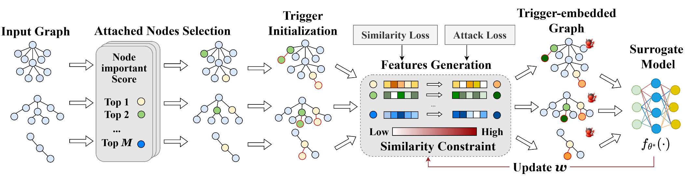

<div align="center">

  <h1><b>Awesome Social Intelligence Modeling</b></h1>
  <h4>A curated survey and paper collection for social intelligence modeling</h4>

</div>

<div align="center">


<!-- PAPER_BADGES_START -->
 [](https://doi.org/10.13140/RG.2.2.21157.87528)
<!-- PAPER_BADGES_END -->

</div>

<!-- PAPER_INTRO_START -->
This repository accompanies our paper:

> **[Social Intelligence Modeling: A Comprehensive Survey from Social Perception to Social Simulation](https://doi.org/10.13140/RG.2.2.21157.87528)** \
> Zikai Song, Xiajie Li, Yunyao Zhang, Xinglang Zhang, Wei Yang, and Junqing Yu \
> Huazhong University of Science and Technology \
> **Venue:** ResearchGate preprint &nbsp;|&nbsp; **Year:** 2026

> If this resource helps your research, please star the repository and cite our paper.
<!-- PAPER_INTRO_END -->

<!-- PAPER_NEWS_START -->
## News

- **August 4, 2026:** The survey is now available online: [https://doi.org/10.13140/RG.2.2.21157.87528](https://doi.org/10.13140/RG.2.2.21157.87528).
<!-- PAPER_NEWS_END -->

<!-- PAPER_CITATION_TOP_START -->
## Citation

```bibtex
@misc{song2026socialintelligence,
  title        = {Social Intelligence Modeling: A Comprehensive Survey from Social Perception to Social Simulation},
  author       = {Song, Zikai and Li, Xiajie and Zhang, Yunyao and Zhang, Xinglang and Yang, Wei and Yu, Junqing},
  howpublished = {ResearchGate preprint},
  year         = {2026},
  note         = {Preprint available on ResearchGate},
  doi          = {10.13140/RG.2.2.21157.87528},
  url          = {https://doi.org/10.13140/RG.2.2.21157.87528}
}
```
<!-- PAPER_CITATION_TOP_END -->

---


> **Contributions**<br>
> To add a paper or update existing metadata, follow the [contribution guide](./CONTRIBUTING.md). You can also email [lixiajie2182712226@gmail.com](mailto:lixiajie2182712226@gmail.com) with links to the paper and project.

### Join the SIM Research Community

<p align="center">
  
</p>

<p align="center">
  Scan the QR code with WeChat to join the Social Intelligence Modeling (SIM) research community.<br>
  WeChat group QR codes are time-limited. If this code has expired, please contact the maintainers by email.
</p>

### Technical documentation
[Contribution guide](./CONTRIBUTING.md)
<br>[PROJECT_README](./engineering/docs/PROJECT_README.md)
<br>[maintenance_manual](./engineering/docs/maintenance_manual.md)
>[Download the recommended Zotero plugins](https://github.com/sait-crypto/Awesome-Social-media-LLM-based-Analysis/raw/refs/heads/main/tools/One-Click%20Copy%20Metadata.xpi):
<br>Developed specifically for this project, it works with the GUI to speed up paper metadata entry. See the technical documentation for details.
><br><br>This plugin can also be used as an alternative:
<br>https://zotero-chinese.com/plugins/#search=Zutilo%20Utility%20for%20Zotero
---
<p align="center">

</p>

[Complete paper list](./COMPLETE_LIST.md)

## Selected paper list (412 papers)
<!-- CATEGORY_ARCHITECTURE_START -->
<p align="center">

</p>
<!-- CATEGORY_ARCHITECTURE_END -->

### Quick Links

  - [Uncategorized](#-Uncategorized-0-papers) (0 papers)
  - [Perception](#-Perception-186-papers) (186 papers)
    - [Content-Level Perception](#Content-Level-Perception-155-papers) (155 papers)
      - [Hate Speech Analysis](#Hate-Speech-Analysis-37-papers) (37 papers)
      - [Misinformation Analysis](#Misinformation-Analysis-48-papers) (48 papers)
      - [Machine-Generated Content Detection](#Machine-Generated-Content-Detection-15-papers) (15 papers)
      - [Sentiment Analysis](#Sentiment-Analysis-32-papers) (32 papers)
      - [Discourse and Pragmatic Analysis](#Discourse-and-Pragmatic-Analysis-32-papers) (32 papers)
    - [User-Level Perception](#User-Level-Perception-34-papers) (34 papers)
      - [User Stance Detection](#User-Stance-Detection-21-papers) (21 papers)
      - [Malicious User Detection](#Malicious-User-Detection-13-papers) (13 papers)
  - [Understanding](#-Understanding-83-papers) (83 papers)
    - [Structural and Discourse Modeling](#Structural-and-Discourse-Modeling-19-papers) (19 papers)
      - [Event Extraction](#Event-Extraction-11-papers) (11 papers)
      - [Topic Modeling](#Topic-Modeling-8-papers) (8 papers)
    - [Network and Propagation Understanding](#Network-and-Propagation-Understanding-47-papers) (47 papers)
      - [Meme and Multimodal Understanding](#Meme-and-Multimodal-Understanding-22-papers) (22 papers)
      - [Social Popularity Prediction](#Social-Popularity-Prediction-11-papers) (11 papers)
      - [Information Diffusion Analysis](#Information-Diffusion-Analysis-17-papers) (17 papers)
    - [User-Level Understanding](#User-Level-Understanding-17-papers) (17 papers)
      - [User Profiling](#User-Profiling-8-papers) (8 papers)
      - [Community Detection and Analysis](#Community-Detection-and-Analysis-10-papers) (10 papers)
  - [Generation](#-Generation-62-papers) (62 papers)
    - [Social Content Generation](#Social-Content-Generation-20-papers) (20 papers)
      - [Comment Generation](#Comment-Generation-3-papers) (3 papers)
      - [Social Summarization](#Social-Summarization-7-papers) (7 papers)
    - [Socially-Aware Dialogue Generation](#Socially-Aware-Dialogue-Generation-18-papers) (18 papers)
      - [Personalized Dialogue Generation](#Personalized-Dialogue-Generation-3-papers) (3 papers)
      - [Empathetic Dialogue Generation](#Empathetic-Dialogue-Generation-5-papers) (5 papers)
      - [Strategic and Persuasive Dialogue Generation](#Strategic-and-Persuasive-Dialogue-Generation-6-papers) (6 papers)
    - [Social Intervention](#Social-Intervention-24-papers) (24 papers)
      - [Misinformation Generation](#Misinformation-Generation-3-papers) (3 papers)
      - [Counter-Hate Speech Generation](#Counter-Hate-Speech-Generation-5-papers) (5 papers)
      - [Evidence-Grounded Rumor Refutation](#Evidence-Grounded-Rumor-Refutation-7-papers) (7 papers)
      - [Content Moderation and Detoxification](#Content-Moderation-and-Detoxification-9-papers) (9 papers)
  - [Simulation](#-Simulation-103-papers) (103 papers)
    - [Modeling Method](#Modeling-Method-19-papers) (19 papers)
      - [Mechanistic Models](#Mechanistic-Models-8-papers) (8 papers)
      - [Graph-Based Models](#Graph-Based-Models-7-papers) (7 papers)
      - [LLM-Empowered Agent-Based Modeling](#LLM-Empowered-Agent-Based-Modeling-4-papers) (4 papers)
    - [Simulation Scale](#Simulation-Scale-54-papers) (54 papers)
      - [Micro-Level Social Simulation](#Micro-Level-Social-Simulation-33-papers) (33 papers)
        - [Individual-Oriented Simulation](#Individual-Oriented-Simulation-18-papers) (18 papers)
        - [Group-Oriented Simulation](#Group-Oriented-Simulation-14-papers) (14 papers)
      - [Macro-Level Social Simulation](#Macro-Level-Social-Simulation-22-papers) (22 papers)
        - [Macro Social Alignment](#Macro-Social-Alignment-11-papers) (11 papers)
        - [Macro Social Phenomena Analysis](#Macro-Social-Phenomena-Analysis-11-papers) (11 papers)
    - [Application Domain](#Application-Domain-61-papers) (61 papers)
      - [Sociology and Social Media](#Sociology-and-Social-Media-30-papers) (30 papers)
      - [Economy and Politics](#Economy-and-Politics-9-papers) (9 papers)
      - [Psychology, Games, and Narrative](#Psychology-Games-and-Narrative-19-papers) (19 papers)
      - [Embodied Intelligence](#Embodied-Intelligence-4-papers) (4 papers)
  - [Other](#-Other-11-papers) (11 papers)


### | Perception (186 papers)


#### Content-Level Perception (155 papers)


##### Hate Speech Analysis (37 papers)

| Title & Info | Pipeline | Summary |
|:--| :----: | :---: |
|<a id="paper-entry-edb93fcb8979"></a> []()<br>[TOT Topology-Aware Optimal Transport for Multimodal Hate Detection](https://ojs.aaai.org/index.php/AAAI/article/view/25614) <br> Linhao Zhang, Li Jin, Xian Sun, Guangluan Xu, Zequn Zhang, Xiaoyu Li, Nayu Liu, Qing Liu, Shiyao Yan <br> 2023-06-26 <br> <span style="color:cyan">[multi-category: [Hate Speech Analysis](#Hate-Speech-Analysis-37-papers), [Meme and Multimodal Understanding](#Meme-and-Multimodal-Understanding-22-papers)]</span>|| <div style="line-height: 1.05;font-size: 0.8em"> <details><summary>**[analogy]**</summary><div style="margin-top:6px">Meme OT</div></details><div style="margin-top:6px"><details><summary>**[summary]**</summary><div style="margin-top:6px">**[motivation]** ” ” ” ”<br>**[innovation]** OT “+”<br>**[method]** + TOT CLIP ->optimal transport \(OT\) ->GNN -><br>**[conclusion/contribution]** Meme Harm-C, Harm-P<br>**[limitation/future]** OT</div></details><div style="margin-top:6px"><details><summary>**[notes]**</summary><div style="margin-top:6px">OT“ ” OT CLIP CLIP “ ” token patch GNN CLIP</div></details></div></div></div>|
|<a id="paper-entry-cfaa2f90c84c"></a> []()<br>[Flexible optimal transport with contrastive graphical modeling for multimodal hate detection](https://ieeexplore.ieee.org/abstract/document/11045556) <br> Linhao Zhang, Li Jin, Xiaoyu Li, Xian Sun, Xin Wang, Zequn Zhang, Jian Liu, Zhicong Lu, Guangluan Xu <br> 2025|<div style="display:flex;flex-direction:column;gap:6px;align-items:center"></div>| <div style="line-height: 1.05;font-size: 0.8em"> <details><summary>**[analogy]**</summary><div style="margin-top:6px">\[AI generated\] This method bridges multimodal gaps like a flexible translator, aligning implicit hateful memes through optimal transport and contrastive graphs.</div></details><div style="margin-top:6px"><details><summary>**[summary]**</summary><div style="margin-top:6px">**[innovation]** TOT<br>**[method]** TOT:1.OT OT $T_v$ $T_t$ 2. GNN<br>**[conclusion/contribution]** Harm-C Harm-P MET-MemeSOTA F1</div></details></div></div>|
|<a id="paper-entry-67f910e3f57f"></a> []()<br>[Improving Hateful Meme Detection through Retrieval-Guided Contrastive Learning](https://aclanthology.org/2024.acl-long.291) <br> Jingbiao Mei, Jinghong Chen, Weizhe Lin, Bill Byrne, Marcus Tomalin <br> 2024|| <div style="line-height: 1.05;font-size: 0.8em"> <details><summary>**[summary]**</summary><div style="margin-top:6px">**[motivation]** CLIP- “”<br>**[innovation]** **** ****<br>**[method]** 1. CLIP <br>2. Faiss <br>3. RGCLL MLP <br>4. KNN<br>**[conclusion/contribution]** HatefulMemes AUROC 87.0% SOTA Flamingo-80B</div></details><div style="margin-top:6px"><details><summary>**[notes]**</summary><div style="margin-top:6px">\[\]</div></details></div></div>|
|<a id="paper-entry-08398f558f02"></a> []()<br>[Human and LLM Biases in Hate Speech Annotations: A Socio-Demographic Analysis of Annotators and T...](https://ojs.aaai.org/index.php/ICWSM/article/view/35837) <br> Tommaso Giorgi, Lorenzo Cima, Tiziano Fagni, Marco Avvenuti, Stefano Cresci <br> 2025-06-07|| <div style="line-height: 1.05;font-size: 0.8em"> <details><summary>**[analogy]**</summary><div style="margin-top:6px">LLM</div></details><div style="margin-top:6px"><details><summary>**[summary]**</summary><div style="margin-top:6px">**[motivation]** bias<br>**[innovation]** The authors introduce a novel methodological framework on the Measuring Hate Speech corpus that quantifies bias through "Intensity" and "Prevalence" metrics without relying on ground truth, uniquely isolating the interplay between specific…<br>**[method]** Leveraging a large-scale dataset with rich demographic attributes, the methodology employs a comparative analysis using confusion matrices to measure relative labeling discrepancies between demographic groups, subsequently evaluating open-…<br>**[conclusion/contribution]** Quantitative analysis reveals that while human annotators exhibit significant "in-group" hypersensitivity and demographic-specific labeling variations, persona-based LLMs demonstrate a limited correlation with these human biases, failing t…<br>**[limitation/future]** The study's limitations include data scarcity for specific minority groups which constrains statistical significance, and a reliance solely on prompting strategies without fine-tuning, which may restrict the models' capacity for deep behav…</div></details><div style="margin-top:6px"><details><summary>**[notes]**</summary><div style="margin-top:6px">\[\]Serving as a foundational critique within the transition from static classification to dynamic social simulation, Giorgi et al. \(2025\) demonstrate that although human perception of hate speech is fundamentally shaped by the interplay between annotator and target demographics, current persona-based LLMs fail to faithfully emulate these emergent sociological biases, highlighting a critical gap in…</div></details></div></div></div>|
|<a id="paper-entry-7795bc0dafa1"></a> []()<br>[Towards Explainable Hate Speech Detection](https://aclanthology.org/2025.findings-acl.667) <br> Happy Khairunnisa Sariyanto, Diclehan Ulucan, Oguzhan Ulucan, Marc Ebner <br> 2025|| <div style="line-height: 1.05;font-size: 0.8em"> <details><summary>**[analogy]**</summary><div style="margin-top:6px">\[AI generated\] A lightweight VAD-based model achieves competitive hate speech detection performance, offering an explainable and computationally efficient alternative to complex deep learning architectures.</div></details><div style="margin-top:6px"><details><summary>**[summary]**</summary><div style="margin-top:6px">**[motivation]** \[AI generated\] The paper aims to address the computational cost and lack of explainability in deep learning-based hate speech detection by proposing a simpler, cost-efficient model. It explores using weighted Valence, Arousal, and Dominanc…<br>**[innovation]** \[AI generated\] This paper innovates by proposing a lightweight, explainable hate speech detection model based on weighted Valence, Arousal, and Dominance \(VAD\) scores. It demonstrates that this simple, resource-efficient approach can achie…<br>**[method]** \[AI generated\] The paper proposes a hate speech detection model based on a weighted sum of Valence, Arousal, and Dominance \(VAD\) scores. It analyzes hate and non-hate speech words to determine optimal weights and classification strategies,…<br>**[conclusion/contribution]** \[AI generated\] The paper demonstrates that a computationally efficient model based on weighted VAD \(Valence, Arousal, Dominance\) scores can achieve competitive performance in hate speech detection, rivaling complex deep learning models. Th…<br>**[limitation/future]** \[AI generated\] The proposed VAD-based approach, while computationally efficient and explainable, may struggle with complex linguistic phenomena like sarcasm, irony, and context-dependent hate speech that rely on broader discourse understan…</div></details><div style="margin-top:6px"><details><summary>**[notes]**</summary><div style="margin-top:6px">ai</div></details></div></div></div>|
|<a id="paper-entry-44b3f0dfedb7"></a>[](https://github.com/tarudesu/ViHateT5) []()<br>[ViHateT5: Enhancing Hate Speech Detection in Vietnamese With a Unified Text-to-Text Transformer M...](https://aclanthology.org/2024.findings-acl.355) <br> Luan Thanh Nguyen <br> 2024|||
|<a id="paper-entry-2df95d786df7"></a> []()<br>[Culture Matters in Toxic Language Detection in Persian](https://aclanthology.org/2025.acl-long.456) <br> Zahra Bokaei, Walid Magdy, Bonnie Webber <br> 2025|||
|<a id="paper-entry-61ae39a355d9"></a> []()<br>[BAN-PL: A polish dataset of banned harmful and offensive content from wykop.pl web service](https://aclanthology.org/2024.lrec-main.190/) <br> Anna Kolos, Inez Okulska, Kinga Głąbińska, Agnieszka Karlinska, Emilia Wisnios, Paweł Ellerik, Andrzej Prałat <br> 2024-05|||
|<a id="paper-entry-18c63066d9d9"></a>[](https://github.com/isadorasalles/HateBRXplain) []()<br>[HateBRXplain: A benchmark dataset with human-annotated rationales for explainable hate speech det...](https://aclanthology.org/2025.coling-main.446/) <br> Isadora Salles, Francielle Vargas, Fabrício Benevenuto <br> 2025-01|||
|<a id="paper-entry-9e82aa828b42"></a>[](https://github.com/Gitanjali1801/CM_MEMES.git) []()<br>[CM-off-meme: Code-mixed hindi-English offensive meme detection with multi-task learning by levera...](https://aclanthology.org/2024.lrec-main.300/) <br> Gitanjali Kumari, Dibyanayan Bandyopadhyay, Asif Ekbal, Vinutha B. NarayanaMurthy <br> 2024-05|||
|<a id="paper-entry-437de250e35a"></a>[](https://github.com/rewire-online/singapore-online-attacks) []()<br>[Improving the Detection of Multilingual Online Attacks with Rich Social Media Data from Singapore](https://aclanthology.org/2023.acl-long.711) <br> Janosch Haber, Bertie Vidgen, Matthew Chapman, Vibhor Agarwal, Roy Ka-Wei Lee, Yong Keong Yap, Paul Röttger <br> 2023|||
|<a id="paper-entry-0e02d7319462"></a>[](https://github.com/ssu-humane/K-HATERS) []()<br>[K-HATERS: A hate speech detection corpus in korean with target-specific ratings](https://openreview.net/forum?id=6mZIF4OxSq) <br> Chaewon Park, Soohwan Kim, Kyubyong Park, Kunwoo Park <br> 2023-12-01|||
|<a id="paper-entry-bbe15b448e3b"></a> []()<br>[Deciphering Hate: Identifying Hateful Memes and Their Targets](https://aclanthology.org/2024.acl-long.454) <br> Eftekhar Hossain, Omar Sharif, Mohammed Moshiul Hoque, Sarah Masud Preum <br> 2024|||
|<a id="paper-entry-9df4fd56297a"></a> []()<br>[So hateful! Building a multi-label hate speech annotated arabic dataset](https://aclanthology.org/2024.lrec-main.1308/) <br> Wajdi Zaghouani, Hamdy Mubarak, Md. Rafiul Biswas <br> 2024-05|||
|<a id="paper-entry-13388315d38f"></a>[](https://github.com/hate-alert/BanglaAbuseMeme) []()<br>[BanglaAbuseMeme: A dataset for bengali abusive meme classification](https://openreview.net/forum?id=1IRFq6qdke) <br> Mithun Das, Animesh Mukherjee <br> 2023-12-01|<div style="display:flex;flex-direction:column;gap:6px;align-items:center"></div>||
|<a id="paper-entry-72032c0a7499"></a> []()<br>[Silencing Empowerment, Allowing Bigotry: Auditing the Moderation of Hate Speech on Twitch](https://aclanthology.org/2025.acl-long.1110) <br> Prarabdh Shukla, Wei Yin Chong, Yash Patel, Brennan Schaffner, Danish Pruthi, Arjun Bhagoji <br> 2025 <br> <span style="color:cyan">[multi-category: [Hate Speech Analysis](#Hate-Speech-Analysis-37-papers), [Misinformation Analysis](#Misinformation-Analysis-48-papers), [Content Moderation and Detoxification](#Content-Moderation-and-Detoxification-9-papers)]</span>|||
|<a id="paper-entry-3c97bb570fd8"></a> []()<br>[Silent Signals, Loud Impact: LLMs for Word-Sense Disambiguation of Coded Dog Whistles](https://aclanthology.org/2024.acl-long.675) <br> Julia Kruk, Michela Marchini, Rijul Magu, Caleb Ziems, David Muchlinski, Diyi Yang <br> 2024 <br> <span style="color:cyan">[multi-category: [Hate Speech Analysis](#Hate-Speech-Analysis-37-papers), [Discourse and Pragmatic Analysis](#Discourse-and-Pragmatic-Analysis-32-papers)]</span>|||
|<a id="paper-entry-9f543a0e51b6"></a> []()<br>[Sheep’s Skin, Wolf’s Deeds: Are LLMs Ready for Metaphorical Implicit Hate Speech?](https://aclanthology.org/2025.acl-long.814) <br> Jingjie Zeng, Liang Yang, Zekun Wang, Yuanyuan Sun, Hongfei Lin <br> 2025 <br> <span style="color:cyan">[multi-category: [Hate Speech Analysis](#Hate-Speech-Analysis-37-papers), [Discourse and Pragmatic Analysis](#Discourse-and-Pragmatic-Analysis-32-papers)]</span>|||
|<a id="paper-entry-263f72478cc8"></a> []()<br>[Humans need context, what about machines? Investigating conversational context in abusive languag...](https://aclanthology.org/2024.lrec-main.740/) <br> Tom Bourgeade, Zongmin Li, Farah Benamara, Véronique Moriceau, Jian Su, Aixin Sun <br> 2024-05|||
|<a id="paper-entry-f03a00027f95"></a> []()<br>[Graphically speaking: Unmasking abuse in social media with conversation insights](https://aclanthology.org/2025.acl-long.894/) <br> Célia Nouri, Jean-Philippe Cointet, Chloé Clavel <br> 2025-07 <br> <span style="color:cyan">[multi-category: [Hate Speech Analysis](#Hate-Speech-Analysis-37-papers), [Discourse and Pragmatic Analysis](#Discourse-and-Pragmatic-Analysis-32-papers)]</span>|||
|<a id="paper-entry-b643130d9da3"></a> []()<br>[CoSyn: Detecting implicit hate speech in online conversations using a context synergized hyperbol...](https://openreview.net/forum?id=di1Foopybz) <br> Sreyan Ghosh, Manan Suri, Purva Chiniya, Utkarsh Tyagi, Sonal Kumar, Dinesh Manocha <br> 2023-12-01|||
|<a id="paper-entry-061c0ebc390e"></a> []()<br>[Learn from failure: Causality-guided contrastive learning for generalizable implicit hate speech ...](https://aclanthology.org/2025.coling-main.593/) <br> Tianming Jiang <br> 2025-01|||
|<a id="paper-entry-86d9fbdffa97"></a> []()<br>[Label-aware Hard Negative Sampling Strategies with Momentum Contrastive Learning for Implicit Hat...](https://aclanthology.org/2024.findings-acl.957) <br> Jaehoon Kim, Seungwan Jin, Sohyun Park, Someen Park, Kyungsik Han <br> 2024|||
|<a id="paper-entry-7a30acdfe4c1"></a> []()<br>[M3Hop-CoT: Misogynous Meme Identification with Multimodal Multi-hop Chain-of-Thought](https://aclanthology.org/2024.emnlp-main.1234) <br> Gitanjali Kumari, Kirtan Jain, Asif Ekbal <br> 2024|||
|<a id="paper-entry-c522159240e0"></a> []()<br>[Explainability and Hate Speech: Structured Explanations Make Social Media Moderators Faster](https://aclanthology.org/2024.acl-short.38) <br> Agostina Calabrese, Leonardo Neves, Neil Shah, Maarten Bos, Björn Ross, Mirella Lapata, Francesco Barbieri <br> 2024|||
|<a id="paper-entry-59ecdd5d6c90"></a> []()<br>[HateCOT: An Explanation-Enhanced Dataset for Generalizable Offensive Speech Detection via Large L...](https://aclanthology.org/2024.findings-emnlp.343) <br> Huy Nghiem, Hal Daumé Iii <br> 2024|||
|<a id="paper-entry-79e28865c32c"></a> []()<br>[Enhancing LLM-based Hatred and Toxicity Detection with Meta-Toxic Knowledge Graph](https://aclanthology.org/2025.findings-acl.1270) <br> Yibo Zhao, Jiapeng Zhu, Can Xu, Yao Liu, Xiang Li <br> 2025|||
|<a id="paper-entry-fe0b5185ea15"></a> []()<br>[HARE: Explainable hate speech detection with step-by-step reasoning](https://openreview.net/forum?id=gQUDsNE3Lh) <br> Yongjin Yang, Joonkee Kim, Yujin Kim, Namgyu Ho, James Thorne, Se-Young Yun <br> 2023-12-01|||
|<a id="paper-entry-b240d2037c76"></a> []()<br>[Rule By Example: Harnessing Logical Rules for Explainable Hate Speech Detection](https://aclanthology.org/2023.acl-long.22) <br> Christopher Clarke, Matthew Hall, Gaurav Mittal, Ye Yu, Sandra Sajeev, Jason Mars, Mei Chen <br> 2023|||
|<a id="paper-entry-5e11b83b1ca4"></a> []()<br>[Don’t Go To Extremes: Revealing the Excessive Sensitivity and Calibration Limitations of LLMs in ...](https://aclanthology.org/2024.acl-long.652) <br> Min Zhang, Jianfeng He, Taoran Ji, Chang-Tien Lu <br> 2024|||
|<a id="paper-entry-c9d255a2ba34"></a> []()<br>[HateDay: Insights from a Global Hate Speech Dataset Representative of a Day on Twitter](https://aclanthology.org/2025.acl-long.115) <br> Manuel Tonneau, Diyi Liu, Niyati Malhotra, Scott A. Hale, Samuel Fraiberger, Victor Orozco-Olvera, Paul Röttger <br> 2025|||
|<a id="paper-entry-182c89e4e2ef"></a> []()<br>[From Dogwhistles to Bullhorns: Unveiling Coded Rhetoric with Language Models](https://aclanthology.org/2023.acl-long.845) <br> Julia Mendelsohn, Ronan Le Bras, Yejin Choi, Maarten Sap <br> 2023 <br> <span style="color:cyan">[multi-category: [Hate Speech Analysis](#Hate-Speech-Analysis-37-papers), [Discourse and Pragmatic Analysis](#Discourse-and-Pragmatic-Analysis-32-papers)]</span>|||
|<a id="paper-entry-761e2ad90a96"></a> []()<br>[Casual insights into parler's content moderation shift: Effects on toxicity and factuality](https://openreview.net/forum?id=RatT4hCcVf#discussion) <br> Nihal Kumarswamy, Mohit Singhal, Shirin Nilizadeh <br> 2025-01-29 <br> <span style="color:cyan">[multi-category: [Hate Speech Analysis](#Hate-Speech-Analysis-37-papers), [Misinformation Analysis](#Misinformation-Analysis-48-papers), [Content Moderation and Detoxification](#Content-Moderation-and-Detoxification-9-papers)]</span>|||
|<a id="paper-entry-0e6c5fa68066"></a> []()<br>[PREDICT: Multi-Agent-based Debate Simulation for Generalized Hate Speech Detection](https://aclanthology.org/2024.emnlp-main.1166) <br> Someen Park, Jaehoon Kim, Seungwan Jin, Sohyun Park, Kyungsik Han <br> 2024|||
|<a id="paper-entry-a22895715c58"></a> []()<br>[Decoding Fake News and Hate Speech: A Survey of Explainable AI Techniques](https://dl.acm.org/doi/10.1145/3711123) <br> Mikel K. Ngueajio, Saurav Aryal, Marcellin Atemkeng, Gloria Washington, Danda Rawat <br> 2025-07-31 <br> <span style="color:cyan">[multi-category: [Hate Speech Analysis](#Hate-Speech-Analysis-37-papers), [Misinformation Analysis](#Misinformation-Analysis-48-papers)]</span>|| <div style="line-height: 1.05;font-size: 0.8em"> <details><summary>**[analogy]**</summary><div style="margin-top:6px">TLDR: The survey reviews state-of-the-art XAI approaches, algorithms, modeling datasets, as well as the evaluation metrics leveraged for assessing model interpretability, and thus provides a comprehensive summary table of the literature su…</div></details></div>|
|<a id="paper-entry-a48839cfe1d0"></a> []()<br>[Beneath the Surface: Unveiling Harmful Memes with Multimodal Reasoning Distilled from Large Langu...](https://aclanthology.org/2023.findings-emnlp.611) <br> Hongzhan Lin, Ziyang Luo, Jing Ma, Long Chen <br> 2023 <br> <span style="color:cyan">[multi-category: [Hate Speech Analysis](#Hate-Speech-Analysis-37-papers), [Meme and Multimodal Understanding](#Meme-and-Multimodal-Understanding-22-papers)]</span>|| <div style="line-height: 1.05;font-size: 0.8em"> <details><summary>**[analogy]**</summary><div style="margin-top:6px">TLDR: This paper proposes a novel generative framework to learn reasonable thoughts from LLMs for better multimodal fusion and lightweight fine-tuning, which consists of two training stages: 1\) Distill multi-modal reasoning knowledge fromL…</div></details></div>|
|<a id="paper-entry-322bff04a61c"></a> []()<br>[MultiHateClip: A Multilingual Benchmark Dataset for Hateful Video Detection on YouTube and Bilibili](https://dl.acm.org/doi/10.1145/3664647.3681521) <br> Han Wang, Tan Rui Yang, Usman Naseem, Roy Ka-Wei Lee <br> 2024-10-28|||

##### Misinformation Analysis (48 papers)

| Title & Info | Pipeline | Summary |
|:--| :----: | :---: |
|<a id="paper-entry-5fc16a265adc"></a> []()<br>[How does truth evolve into fake news? An empirical study of fake news evolution](https://dl.acm.org/doi/10.1145/3442442.3452328) <br> Mingfei Guo Xiuying Chen Juntao Li Dongyan Zhao Rui Yan <br> 2021-06-03|| <div style="line-height: 1.05;font-size: 0.8em"> <details><summary>**[analogy]**</summary><div style="margin-top:6px">\[ \]</div></details><div style="margin-top:6px"><details><summary>**[summary]**</summary><div style="margin-top:6px">**[innovation]** FNE “--”<br>**[method]** 1. Snopes.com\(\) ץȡtruth <br>2. <br>3. Archive Today <br>4.<br>**[conclusion/contribution]** “”<br>**[limitation/future]** Snopes</div></details></div></div>|
|<a id="paper-entry-4d07bd917293"></a> []()<br>[Learning Complex Heterogeneous Multimodal Fake News via Social Latent Network Inference](https://ojs.aaai.org/index.php/AAAI/article/view/32022) <br> Mingxin Li,Yuchen Zhang,Haowei Xu,Xianghua Li\*,Chao Gao,Zhen Wang <br> 2025-04-11|| <div style="line-height: 1.05;font-size: 0.8em"> <details><summary>**[analogy]**</summary><div style="margin-top:6px">GNN</div></details><div style="margin-top:6px"><details><summary>**[summary]**</summary><div style="margin-top:6px">**[innovation]** “Latent Network Inference”<br>**[method]** 1. Hawkes Process <br>2. **** “” <br>3. <br>4. Transformer Encoder<br>**[conclusion/contribution]** FakeSVFVC89% SOTA0.12%~4.39% Twitter/ +10.71% F1</div></details></div></div>|
|<a id="paper-entry-387b59452ed7"></a>[](https://github.com/xxfwin/NAGASIL) []()<br>[Harnessing Network Effect for Fake News Mitigation: Selecting Debunkers via Self-Imitation Learning](https://ojs.aaai.org/index.php/AAAI/article/view/30252) <br> Xiaofei Xu, Ke Deng, Michael Dann, Xiuzhen Zhang <br> 2024-03-24 <br> <span style="color:cyan">[multi-category: [Misinformation Analysis](#Misinformation-Analysis-48-papers), [Information Diffusion Analysis](#Information-Diffusion-Analysis-17-papers), [Evidence-Grounded Rumor Refutation](#Evidence-Grounded-Rumor-Refutation-7-papers)]</span>|| <div style="line-height: 1.05;font-size: 0.8em"> <details><summary>**[analogy]**</summary><div style="margin-top:6px">MDP</div></details><div style="margin-top:6px"><details><summary>**[summary]**</summary><div style="margin-top:6px">**[motivation]** Current approaches to multi-stage fake news mitigation often fail to address the episodic reward problem, where the effect of selecting an individual debunker cannot be measured until the campaign concludes. This sparse and delayed feedbac…<br>**[innovation]** The authors propose NAGASIL, introducing two key enhancements to Self-Imitation Learning: 1\) Negative Sampling, which leverages low-reward historical episodes to explicitly penalize poor debunker selections, and 2\) State Augmentation, whic…<br>**[method]** The debunker selection is formulated as a sequential decision-making problem under a budget constraint. A generative adversarial framework is employed, where a generator selects debunkers and a discriminator distinguishes between state-act…<br>**[conclusion/contribution]** Experiments conducted on both real-world \(Facebook\) and synthetic \(Twitter\) networks demonstrate that NAGASIL outperforms state-of-the-art fake news mitigation baselines and standard self-imitation learning methods across various budgets,…<br>**[limitation/future]** The proposed method operates under the assumption that the veracity of news is pre-determined, necessitating integration with an external fake news detection system. Future research could explore adaptive propagation models and the dynamic…</div></details><div style="margin-top:6px"><details><summary>**[notes]**</summary><div style="margin-top:6px">\[\] <br>\[\]The work by Xu et al. \(2024\) marks a pivotal transition from merely recognizing patterns of disinformation to actively intervening to curtail its spread. By harnessing network effects within a reinforcement learning framework enhanced by self-imitative adversarial learning, their NAGASIL model transcends static pattern recognition. It implements a dynamic, goal-oriented policy learning proc…</div></details></div></div></div>|
|<a id="paper-entry-86dabb4cd0ee"></a> []()<br>[News Source Credibility Assessment: A Reddit Case Study](https://ojs.aaai.org/index.php/ICWSM/article/view/35804) <br> Arash Amini, Yigit Ege Bayiz, Ashwin Ram, Radu Marculescu, and Ufuk Topcu <br> 2025-06-07 <br> <span style="color:cyan">[multi-category: [Misinformation Analysis](#Misinformation-Analysis-48-papers), [Malicious User Detection](#Malicious-User-Detection-13-papers)]</span>|| <div style="line-height: 1.05;font-size: 0.8em"> <details><summary>**[summary]**</summary><div style="margin-top:6px">**[motivation]** Driven by the proliferation of misinformation on social media, this work shifts focus from fact-checking individual news items to assessing the systemic credibility of news sources, addressing a critical gap in combating information pollut…<br>**[innovation]** Its core innovation lies in constructing a weighted post-to-post network based on the semantic similarity of user comments. This network models latent socio-contextual linkages between submissions, which are then integrated via a Graph Con…<br>**[method]** The framework, CREDiBERT, first trains a bi-encoder on paired submissions about the same event to learn credibility-aware text embeddings. It then builds a novel graph where edge weights encode user reaction similarity via comments. Finall…<br>**[conclusion/contribution]** The model outperforms BERT-based baselines by 3% in F1-score for credibility assessment. Incorporating the user-interaction graph yields a further 8% gain, demonstrating the significant value of socially-grounded signals in evaluating info…<br>**[limitation/future]** The method assesses source reputation rather than article veracity, leaving it blind to one-off falsehoods from otherwise credible outlets. Its performance is also tied to the bias present in the training data from specific online communit…</div></details><div style="margin-top:6px"><details><summary>**[notes]**</summary><div style="margin-top:6px">\[\] <br>\[notes\] GCN<br>\[\]Amini et al. \(2025\) move beyond purely content-based pattern recognition, attempting instead to establish connections between posts and the credibility of news sources. Their CREDiBERT framework innovatively constructs a weighted post-to-post network from user comment similarities. This graph structure captures community-specific reaction patterns, which, when processed through…</div></details></div></div>|
|[↪ Silencing Empowerment, Allowing Bigotry: Auditing the Moderation of Hate Speech on Twitch](#paper-entry-72032c0a7499) <sub>Full entry</sub>|||
|[↪ Casual insights into parler's content moderation shift: Effects on toxicity and factuality](#paper-entry-761e2ad90a96) <sub>Full entry</sub>|||
|[↪ Decoding Fake News and Hate Speech: A Survey of Explainable AI Techniques](#paper-entry-a22895715c58) <sub>Full entry</sub>|||
|<a id="paper-entry-76128ea58d8f"></a> []()<br>[GAMC: An Unsupervised Method for Fake News Detection Using Graph Autoencoder with Masking](https://ojs.aaai.org/index.php/AAAI/article/view/27788) <br> Shu Yin, Peican Zhu, Lianwei Wu, Chao Gao, Zhen Wang <br> 2024-03-24|||
|<a id="paper-entry-b1234c9e5f25"></a> []()<br>[Let Silence Speak: Enhancing Fake News Detection with Generated Comments from Large Language Models](https://dl.acm.org/doi/10.1145/3627673.3679519) <br> Qiong Nan, Qiang Sheng, Juan Cao, Beizhe Hu, Danding Wang, Jintao Li <br> 2024-10-21|| <div style="line-height: 1.05;font-size: 0.8em"> <details><summary>**[analogy]**</summary><div style="margin-top:6px">TLDR: This paper proposes to adopt large language models as a user simulator and comment generator, and designs GenFEND, a generated feedback-enhanced detection framework, which generates comments by prompting LLMs with diverse user profil…</div></details></div>|
|<a id="paper-entry-ff4e4476e3a6"></a> []()<br>[A Symbolic Adversarial Learning Framework for Evolving Fake News Generation and Detection](https://aclanthology.org/2025.emnlp-main.619) <br> Chong Tian, Qirong Ho, Xiuying Chen <br> 2025 <br> <span style="color:cyan">[multi-category: [Misinformation Analysis](#Misinformation-Analysis-48-papers), [Misinformation Generation](#Misinformation-Generation-3-papers)]</span>|||
|<a id="paper-entry-460dc8c13ae7"></a> []()<br>[Mitigating Social Hazards: Early Detection of Fake News via Diffusion-Guided Propagation Path Gen...](https://dl.acm.org/doi/10.1145/3664647.3681087) <br> Litian Zhang, Xiaoming Zhang, Chaozhuo Li, Ziyi Zhou, Jiacheng Liu, Feiran Huang, Xi Zhang <br> 2024-10-28 <br> <span style="color:cyan">[multi-category: [Misinformation Analysis](#Misinformation-Analysis-48-papers), [Information Diffusion Analysis](#Information-Diffusion-Analysis-17-papers)]</span>|||
|<a id="paper-entry-a2131cd24de1"></a> []()<br>[Faking Fake News for Real Fake News Detection: Propaganda-Loaded Training Data Generation](https://aclanthology.org/2023.acl-long.815) <br> Kung-Hsiang Huang, Kathleen McKeown, Preslav Nakov, Yejin Choi, Heng Ji <br> 2023|||
|<a id="paper-entry-0e664d6d193d"></a> []()<br>[Zero-Shot Rumor Detection with Propagation Structure via Prompt Learning](https://ojs.aaai.org/index.php/AAAI/article/view/25651) <br> Hongzhan Lin, Pengyao Yi, Jing Ma, Haiyun Jiang, Ziyang Luo, Shuming Shi, Ruifang Liu <br> 2023-06-26|||
|<a id="paper-entry-fa618fd872f6"></a> []()<br>[Epidemiology-informed network for robust rumor detection](https://openreview.net/forum?id=k7CeyvR0dd#discussion) <br> Wei Jiang, Tong Chen, Xinyi Gao, Wentao Zhang, Lizhen Cui, Hongzhi Yin <br> 2025-01-29 <br> <span style="color:cyan">[multi-category: [Misinformation Analysis](#Misinformation-Analysis-48-papers), [Information Diffusion Analysis](#Information-Diffusion-Analysis-17-papers)]</span>|||
|<a id="paper-entry-881842246574"></a> []()<br>[Unveiling Implicit Deceptive Patterns in Multi-Modal Fake News via Neuro-Symbolic Reasoning](https://ojs.aaai.org/index.php/AAAI/article/view/28677) <br> Yiqi Dong, Dongxiao He, Xiaobao Wang, Youzhu Jin, Meng Ge, Carl Yang, Di Jin <br> 2024-03-24|| <div style="line-height: 1.05;font-size: 0.8em"> <details><summary>**[analogy]**</summary><div style="margin-top:6px">TLDR: A novel Neuro-Symbolic Latent Model is proposed, called NSLM, that not only derives accurate judgments on the veracity of news but also uncovers the implicit deceptive patterns as explanations that reveal how fake news is fabricated.</div></details></div>|
|<a id="paper-entry-ca95166b59e5"></a> []()<br>[Two Heads Are Better Than One: Improving Fake News Video Detection by Correlating with Neighbors](https://aclanthology.org/2023.findings-acl.756) <br> Peng Qi, Yuyang Zhao, Yufeng Shen, Wei Ji, Juan Cao, Tat-Seng Chua <br> 2023|||
|<a id="paper-entry-111cf0c96e0e"></a> []()<br>[KAPALM: Knowledge grAPh enhAnced language models for fake news detection](https://openreview.net/forum?id=mQxqo1di63) <br> Jing Ma, Chen Chen, Chunyan Hou, Xiaojie Yuan <br> 2023-12-01|||
|<a id="paper-entry-a7ba6dbd0257"></a> []()<br>[TELLER: A Trustworthy Framework for Explainable, Generalizable and Controllable Fake News Detection](https://aclanthology.org/2024.findings-acl.919) <br> Hui Liu, Wenya Wang, Haoru Li, Haoliang Li <br> 2024|||
|<a id="paper-entry-e1c2ac216135"></a> []()<br>[Graph with sequence: Broad-range semantic modeling for fake news detection](https://openreview.net/forum?id=rAvsdsxDLr#discussion) <br> Junwei Yin, Min Gao, Kai Shu, Wentao Li, Yinqiu Huang, Zongwei Wang <br> 2025-01-29|||
|<a id="paper-entry-468ef0951fc5"></a> []()<br>[Using persuasive writing strategies to explain and detect health misinformation](https://aclanthology.org/2024.lrec-main.1501/) <br> Danial Kamali, Joseph D. Romain, Huiyi Liu, Wei Peng, Jingbo Meng, Parisa Kordjamshidi <br> 2024-05|||
|<a id="paper-entry-377c2e39e9a9"></a> []()<br>[Bootstrapping Multi-View Representations for Fake News Detection](https://ojs.aaai.org/index.php/AAAI/article/view/25670) <br> Qichao Ying, Xiaoxiao Hu, Yangming Zhou, Zhenxing Qian, Dan Zeng, Shiming Ge <br> 2023-06-26|| <div style="line-height: 1.05;font-size: 0.8em"> <details><summary>**[analogy]**</summary><div style="margin-top:6px">TLDR: A novel scheme of Bootstrapping Multi-view Representations \(BMR\) for fake news detection and improves Multi-gate Mixture-of-Expert networks \(iMMoE\) are proposed for feature refinement and fusion.</div></details></div>|
|<a id="paper-entry-f2f3afce3113"></a> []()<br>[Reinforcement Tuning for Detecting Stances and Debunking Rumors Jointly with Large Language Models](https://aclanthology.org/2024.findings-acl.796) <br> Ruichao Yang, Wei Gao, Jing Ma, Hongzhan Lin, Bo Wang <br> 2024 <br> <span style="color:cyan">[multi-category: [Misinformation Analysis](#Misinformation-Analysis-48-papers), [User Stance Detection](#User-Stance-Detection-21-papers), [Evidence-Grounded Rumor Refutation](#Evidence-Grounded-Rumor-Refutation-7-papers)]</span>|||
|<a id="paper-entry-5ea97de3e374"></a> []()<br>[The Earth is Flat because...: Investigating LLMs’ Belief towards Misinformation via Persuasive Co...](https://aclanthology.org/2024.acl-long.858) <br> Rongwu Xu, Brian Lin, Shujian Yang, Tianqi Zhang, Weiyan Shi, Tianwei Zhang, Zhixuan Fang, Wei Xu, Han Qiu <br> 2024|||
|<a id="paper-entry-3a13388f5386"></a> []()<br>[When agents “misremember” collectively: Exploring the mandela effect in LLM-based multi-agent sys...](https://openreview.net/forum?id=yIoMqDes7O) <br> Naen Xu, Hengyu An, Shuo Shi, Jinghuai Zhang, Chunyi Zhou, Changjiang Li, Tianyu Du, Zhihui Fu, Jun Wang, Shouling Ji <br> 2025-10-08 <br> <span style="color:cyan">[multi-category: [Misinformation Analysis](#Misinformation-Analysis-48-papers), [Group-Oriented Simulation](#Group-Oriented-Simulation-14-papers), [Psychology, Games, and Narrative](#Psychology-Games-and-Narrative-19-papers)]</span>|||
|<a id="paper-entry-63ab3218fb7b"></a> []()<br>[Interpretable short video rumor detection based on modality tampering](https://aclanthology.org/2024.lrec-main.804/) <br> Kaixuan Wu, Yanghao Lin, Donglin Cao, Dazhen Lin <br> 2024-05|||
|<a id="paper-entry-9832cb1e2ba6"></a> []()<br>[Harmfully Manipulated Images Matter in Multimodal Misinformation Detection](https://dl.acm.org/doi/10.1145/3664647.3681322) <br> Bing Wang, Shengsheng Wang, Changchun Li, Renchu Guan, Ximing Li <br> 2024-10-28|||
|<a id="paper-entry-9cc0a46520cf"></a> []()<br>[$\\\\textit{from chaos to clarity}$: Claim normalization to empower fact-checking](https://openreview.net/forum?id=bxltAqTJe2) <br> Megha Sundriyal, Tanmoy Chakraborty, Preslav Nakov <br> 2023-12-01|||
|<a id="paper-entry-6ef59bf87734"></a> []()<br>[Online rumors during the COVID-19 pandemic: co-evolution of themes and emotions](https://www.frontiersin.org/articles/10.3389/fpubh.2024.1375731/full) <br> Chao Shen, Zhenyu Song, Pengyu He, Limin Liu, Zhenyu Xiong <br> 2024-06-10 <br> <span style="color:cyan">[multi-category: [Misinformation Analysis](#Misinformation-Analysis-48-papers), [Information Diffusion Analysis](#Information-Diffusion-Analysis-17-papers)]</span>|| <div style="line-height: 1.05;font-size: 0.8em"> <details><summary>**[analogy]**</summary><div style="margin-top:6px">TLDR: The study results help to understand the public’s focus and emotional tendencies at different stages of the COVID-19 pandemic, thereby enabling targeted public opinion guidance and crisis management.</div></details></div>|
|<a id="paper-entry-7bbc07135612"></a> []()<br>[FakeSV: A Multimodal Benchmark with Rich Social Context for Fake News Detection on Short Video Pl...](https://ojs.aaai.org/index.php/AAAI/article/view/26689) <br> Peng Qi, Yuyan Bu, Juan Cao, Wei Ji, Ruihao Shui, Junbin Xiao, Danding Wang, Tat-Seng Chua <br> 2023-06-26|||
|<a id="paper-entry-06b1478a390e"></a> []()<br>[VeraCT Scan: Retrieval-Augmented Fake News Detection with Justifiable Reasoning](https://aclanthology.org/2024.acl-demos.25) <br> Cheng Niu, Yang Guan, Yuanhao Wu, Juno Zhu, Juntong Song, Randy Zhong, Kaihua Zhu, Siliang Xu, Shizhe Diao, Tong Zhang <br> 2024|||
|<a id="paper-entry-5671b688ebe2"></a> []()<br>[Exploring the usability of persuasion techniques for downstream misinformation-related classifica...](https://aclanthology.org/2024.lrec-main.613/) <br> Nikolaos Nikolaidis, Jakub Piskorski, Nicolas Stefanovitch <br> 2024-05|||
|<a id="paper-entry-068a1a71e636"></a> []()<br>[HQP: A Human-Annotated Dataset for Detecting Online Propaganda](https://aclanthology.org/2024.findings-acl.363) <br> Abdurahman Maarouf, Dominik Bär, Dominique Geissler, Stefan Feuerriegel <br> 2024|||
|<a id="paper-entry-ed1a3290b7e4"></a> []()<br>[LoCal: Logical and causal fact-checking with LLM-based multi-agents](https://openreview.net/forum?id=f5FDfChZRS#discussion) <br> Jiatong Ma, Linmei Hu, Rang Li, Wenbo Fu <br> 2025-01-29|||
|<a id="paper-entry-3fdb6fb2320b"></a> []()<br>[Decoding Susceptibility: Modeling Misbelief to Misinformation Through a Computational Approach](https://aclanthology.org/2024.emnlp-main.846) <br> Yanchen Liu, Mingyu Derek Ma, Wenna Qin, Azure Zhou, Jiaao Chen, Weiyan Shi, Wei Wang, Diyi Yang <br> 2024|||
|<a id="paper-entry-f45b17189c5b"></a> []()<br>[Interpretable Multimodal Misinformation Detection with Logic Reasoning](https://aclanthology.org/2023.findings-acl.620) <br> Hui Liu, Wenya Wang, Haoliang Li <br> 2023|||
|<a id="paper-entry-bf2cf8aad65e"></a> []()<br>[Identifying conspiracy theories news based on event relation graph](https://openreview.net/forum?id=OYWeQdQiIn) <br> Yuanyuan Lei, Ruihong Huang <br> 2023-12-01 <br> <span style="color:cyan">[multi-category: [Misinformation Analysis](#Misinformation-Analysis-48-papers), [Event Extraction](#Event-Extraction-11-papers)]</span>|||
|<a id="paper-entry-9c755d4c86c1"></a> []()<br>[Frequency Spectrum Is More Effective for Multimodal Representation and Fusion: A Multimodal Spect...](https://ojs.aaai.org/index.php/AAAI/article/view/29803) <br> An Lao, Qi Zhang, Chongyang Shi, Longbing Cao, Kun Yi, Liang Hu, Duoqian Miao <br> 2024-03-24|||
|<a id="paper-entry-18bc86ffcd74"></a> []()<br>[Is explanation the cure? Misinformation mitigation in the short term and long term](https://openreview.net/forum?id=vvnUi75U9i) <br> Yi-Li Hsu, Shih-Chieh Dai, Aiping Xiong, Lun-Wei Ku <br> 2023-12-01 <br> <span style="color:cyan">[multi-category: [Misinformation Analysis](#Misinformation-Analysis-48-papers), [Evidence-Grounded Rumor Refutation](#Evidence-Grounded-Rumor-Refutation-7-papers)]</span>|||
|<a id="paper-entry-bbc9520dbbe0"></a> []()<br>[Can GPT-4 identify propaganda? Annotation and detection of propaganda spans in news articles](https://aclanthology.org/2024.lrec-main.244/) <br> Maram Hasanain, Fatema Ahmad, Firoj Alam <br> 2024-05|||
|<a id="paper-entry-e0d3440da476"></a> []()<br>[The truth, the whole truth, and nothing but the truth: A new benchmark dataset for hebrew text cr...](https://openreview.net/forum?id=nPzrjWrtlz) <br> Ben Hagag, Reut Tsarfaty <br> 2023-12-01|||
|<a id="paper-entry-6c3150995534"></a> []()<br>[Each Fake News Is Fake in Its Own Way: An Attribution Multi-Granularity Benchmark for Multimodal ...](https://ojs.aaai.org/index.php/AAAI/article/view/31999) <br> Hao Guo, Zihan Ma, Zhi Zeng, Minnan Luo, Weixin Zeng, Jiuyang Tang, Xiang Zhao <br> 2025-04-11|| <div style="line-height: 1.05;font-size: 0.8em"> <details><summary>**[analogy]**</summary><div style="margin-top:6px">TLDR: An attributing multi-granularity multimodal fake news detection dataset AMG is constructed, revealing the inherent fake pattern and a multi-granularity clue alignment model MGCA is proposed to achieve multimodal fake news detection a…</div></details></div>|
|<a id="paper-entry-82a8e9a74525"></a> []()<br>[Thinking as society: Multi-social-agent self-distillation for multimodal misinformation detection](https://openreview.net/forum?id=nHW64r5KFG) <br> Yifei Gao, Ning Xu, Wenhui Li, Hongshuo Tian, Lanjun Wang, Anan Liu <br> 2025-10-08 <br> <span style="color:cyan">[multi-category: [Misinformation Analysis](#Misinformation-Analysis-48-papers), [Group-Oriented Simulation](#Group-Oriented-Simulation-14-papers), [Sociology and Social Media](#Sociology-and-Social-Media-30-papers)]</span>|||
|<a id="paper-entry-6cfd2a6ab57a"></a> []()<br>[MisinfoEval: Generative AI in the Era of “Alternative Facts”](https://aclanthology.org/2024.emnlp-main.487) <br> Saadia Gabriel, Liang Lyu, James Siderius, Marzyeh Ghassemi, Jacob Andreas, Asuman E. Ozdaglar <br> 2024 <br> <span style="color:cyan">[multi-category: [Misinformation Analysis](#Misinformation-Analysis-48-papers), [Evidence-Grounded Rumor Refutation](#Evidence-Grounded-Rumor-Refutation-7-papers)]</span>|||
|<a id="paper-entry-87d5e7f5df77"></a> []()<br>[ClaimVer: Explainable Claim-Level Verification and Evidence Attribution of Text Through Knowledge...](https://aclanthology.org/2024.findings-emnlp.795) <br> Preetam Prabhu Srikar Dammu, Himanshu Naidu, Mouly Dewan, YoungMin Kim, Tanya Roosta, Aman Chadha, Chirag Shah <br> 2024|||
|<a id="paper-entry-cc55f28d5cf5"></a> []()<br>[Propagation Tree Is Not Deep: Adaptive Graph Contrastive Learning Approach for Rumor Detection](https://ojs.aaai.org/index.php/AAAI/article/view/27757) <br> Chaoqun Cui, Caiyan Jia <br> 2024-03-24|| <div style="line-height: 1.05;font-size: 0.8em"> <details><summary>**[analogy]**</summary><div style="margin-top:6px">TLDR: This work reveals the wide-structure nature of RPTs and contributes an effective graph contrastive learning approach tailored for rumor detection through principled adaptive augmentation and the principles and augmentation techniques…</div></details></div>|
|<a id="paper-entry-bca8d5212884"></a> []()<br>[Cross-lingual learning vs. Low-resource fine-tuning: A case study with fact-checking in turkish](https://aclanthology.org/2024.lrec-main.368/) <br> Recep Firat Cekinel, Pinar Karagoz, Çağrı Çöltekin <br> 2024-05|||
|<a id="paper-entry-6e9e8c155f6e"></a> []()<br>[FakingRecipe: Detecting Fake News on Short Video Platforms from the Perspective of Creative Process](https://dl.acm.org/doi/10.1145/3664647.3680663) <br> Yuyan Bu, Qiang Sheng, Juan Cao, Peng Qi, Danding Wang, Jintao Li <br> 2024-10-28|||
|<a id="paper-entry-5bd902d27f20"></a> []()<br>[DeFaktS: A german dataset for fine-grained disinformation detection through social media framing](https://aclanthology.org/2024.lrec-main.409/) <br> Shaina Ashraf, Isabel Bezzaoui, Ionut Andone, Alexander Markowetz, Jonas Fegert, Lucie Flek <br> 2024-05|||

##### Machine-Generated Content Detection (15 papers)

| Title & Info | Pipeline | Summary |
|:--| :----: | :---: |
|<a id="paper-entry-56f877e4e1fe"></a> []()<br>[MAGE: Machine-generated Text Detection in the Wild](https://aclanthology.org/2024.acl-long.3) <br> Yafu Li, Qintong Li, Leyang Cui, Wei Bi, Zhilin Wang, Longyue Wang, Linyi Yang, Shuming Shi, Yue Zhang <br> 2024|||
|<a id="paper-entry-0269c4b4c917"></a> []()<br>[A Survey on Detection of LLMs-Generated Content](https://aclanthology.org/2024.findings-emnlp.572) <br> Xianjun Yang, Liangming Pan, Xuandong Zhao, Haifeng Chen, Linda Ruth Petzold, William Yang Wang, Wei Cheng <br> 2024|||
|<a id="paper-entry-00e5e880249e"></a> []()<br>[MultiSocial: Multilingual Benchmark of Machine-Generated Text Detection of Social-Media Texts](https://aclanthology.org/2025.acl-long.36) <br> Dominik Macko, Jakub Kopál, Robert Moro, Ivan Srba <br> 2025|||
|<a id="paper-entry-f9b3805ecf36"></a> []()<br>[Are We in the AI-Generated Text World Already? Quantifying and Monitoring AIGT on Social Media](https://aclanthology.org/2025.acl-long.1120) <br> Zhen Sun, Zongmin Zhang, Xinyue Shen, Ziyi Zhang, Yule Liu, Michael Backes, Yang Zhang, Xinlei He <br> 2025|||
|<a id="paper-entry-6ce821d4114d"></a> []()<br>[Probing the Uniquely Identifiable Linguistic Patterns of Conversational AI Agents](https://aclanthology.org/2024.findings-acl.274) <br> Iqra Zahid, Tharindu Madusanka, Riza Batista-Navarro, Youcheng Sun <br> 2024|||
|<a id="paper-entry-fd5147f043bc"></a> []()<br>[On the Risk of Evidence Pollution for Malicious Social Text Detection in the Era of LLMs](https://aclanthology.org/2025.acl-long.480) <br> Herun Wan, Minnan Luo, Zhixiong Su, Guang Dai, Xiang Zhao <br> 2025 <br> <span style="color:cyan">[multi-category: [Machine-Generated Content Detection](#Machine-Generated-Content-Detection-15-papers), [Malicious User Detection](#Malicious-User-Detection-13-papers)]</span>|||
|<a id="paper-entry-1b37ff9c0128"></a> []()<br>[When Detection Fails: The Power of Fine-Tuned Models to Generate Human-Like Social Media Text](https://aclanthology.org/2025.findings-acl.695) <br> Hillary Dawkins, Kathleen C. Fraser, Svetlana Kiritchenko <br> 2025|||
|<a id="paper-entry-9c0cd0d13a73"></a>[DetectGPT: Zero-shot machine-generated text detection using probability curvature](http://arxiv.org/abs/2301.11305) <br> Eric Mitchell, Yoonho Lee, Alexander Khazatsky, Christopher D. Manning, Chelsea Finn <br> 2023-07-23|||
|<a id="paper-entry-ee42eddc6c15"></a>[Longformer: The long-document transformer](http://arxiv.org/abs/2004.05150) <br> Iz Beltagy, Matthew E. Peters, Arman Cohan <br> 2020-12-02|||
|<a id="paper-entry-74885d734c9f"></a> []()<br>[DetectLLM: Leveraging log rank information for zero-shot detection of machine-generated text](https://openreview.net/forum?id=Dy2mbQIdMz) <br> Jinyan Su, Terry Yue Zhuo, Di Wang, Preslav Nakov <br> 2023-12-01|||
|<a id="paper-entry-a713d50d5981"></a> []()<br>[Beyond binary: Towards fine-grained LLM-generated text detection via role recognition and involve...](https://openreview.net/forum?id=nB1Apc36yp#discussion) <br> Zihao Cheng, Li Zhou, Feng Jiang, Benyou Wang, Haizhou Li <br> 2025-01-29|||
|<a id="paper-entry-e9e8cecde9f3"></a> []()<br>[Training-free LLM-generated text detection by mining token probability sequences](https://openreview.net/forum?id=vo4AHjowKi) <br> Yihuai Xu, Yongwei Wang, Yifei Bi, Huangsen Cao, Zhouhan Lin, Yu Zhao, Fei Wu <br> 2024-10-04|||
|<a id="paper-entry-bd8008962111"></a> []()<br>[Unmasking the imposters: How censorship and domain adaptation affect the detection of machine-gen...](https://aclanthology.org/2025.coling-main.607/) <br> Bryan E. Tuck, Rakesh Verma <br> 2025-01|||
|<a id="paper-entry-b6b22ed3c908"></a> []()<br>[A natural approach for synthetic short-form text analysis](https://aclanthology.org/2024.lrec-main.92/) <br> Ruiting Shao, Ryan Schwarz, Christopher Clifton, Edward Delp <br> 2024-05|||
|<a id="paper-entry-aee316dafdd3"></a> []()<br>[MIND: A Multi-agent Framework for Zero-shot Harmful Meme Detection](https://aclanthology.org/2025.acl-long.46) <br> Ziyan Liu, Chunxiao Fan, Haoran Lou, Yuexin Wu, Kaiwei Deng <br> 2025|||

##### Sentiment Analysis (32 papers)

| Title & Info | Pipeline | Summary |
|:--| :----: | :---: |
|<a id="paper-entry-8d12905aba9e"></a>[](https://github.com/neuralnaresh/multimodal-emotion-recognition) []()<br>[Multi-label emotion analysis in conversation via multimodal knowledge distillation](https://dl.acm.org/doi/10.1145/3581783.3612517) <br> Sidharth Anand?,Naresh Kumar Devulapally?,Sreyasee Das Bhattacharjee,Junsong Yuan <br> 2023-10-27|| <div style="line-height: 1.05;font-size: 0.8em"> <details><summary>**[summary]**</summary><div style="margin-top:6px">**[motivation]** Addresses the limitations of single-dominant emotion assumptions by tackling the challenge of multi-label emotion co-occurrence and generalization across diverse socio-demographic groups, particularly varying age populations.<br>**[innovation]** LCC<br>**[method]** Employing a Multimodal Transformer Network where mode-specific peer branches \(visual, audio, textual\) collaboratively distill learned probabilistic uncertainty into a fusion branch via cross-network attention and noise contrastive estimati…<br>**[conclusion/contribution]** Demonstrates state-of-the-art performance on MOSEI, EmoReact, and ElderReact datasets, achieving an approximate 17% improvement in weighted F1-score during cross-dataset evaluations, thereby validating robustness in age-diverse scenarios.<br>**[limitation/future]** The approach necessitates the reduction of complex emotion categories to basic subsets for cross-dataset consistency and entails significant computational overhead due to the spatiotemporal tubelet embedding mechanism.</div></details><div style="margin-top:6px"><details><summary>**[notes]**</summary><div style="margin-top:6px">\[\]"Transscending the traditional paradigm of identifying single dominant emotions, Anand et al. \[2023\] proposed SeMuL-PCD to enhance the granularity of affective perception in diverse social contexts; by leveraging a collaborative distillation mechanism that calibrates mode-specific feedback, their model robustly disentangles multi-label emotional co-occurrences across varying demographic backgro…</div></details></div></div>|
|<a id="paper-entry-fdc367087c5b"></a>[](https://github.com/dess-mannheim/temporal-adapters) []()<br>[Extracting affect aggregates from longitudinal social media data with temporal adapters for large...](https://ojs.aaai.org/index.php/ICWSM/article/view/35801) <br> Georg Ahnert, Max Pellert, David Garcia, Markus Strohmaier <br> 2025-06-07|<div style="display:flex;flex-direction:column;gap:6px;align-items:center"></div>| <div style="line-height: 1.05;font-size: 0.8em"> <details><summary>**[analogy]**</summary><div style="margin-top:6px">LoRA</div></details><div style="margin-top:6px"><details><summary>**[summary]**</summary><div style="margin-top:6px">**[motivation]** Addresses the temporal misalignment inherent in prompt-based in silico surveys and the scalability bottlenecks of traditional affective computing, which heavily relies on resource-intensive labeled datasets or static dictionaries.<br>**[innovation]** LoRA“”<br>**[method]** Employs a two-stage framework: first, fine-tuning weekly LoRA adapters on longitudinal Twitter timelines via a self-supervised causal language modeling objective; second, probing the adapted models with standard psychometric questionnaires…<br>**[conclusion/contribution]** Demonstrates strong, significant correlations with representative polling data \(YouGov\) during the COVID-19 pandemic, achieving performance comparable to supervised baselines \(e.g., TweetNLP\) while offering superior flexibility in querying…<br>**[limitation/future]** Primarily effective for longitudinal trend analysis rather than absolute cross-sectional calibration, and the representativeness of the emergent sentiment is constrained by the demographic biases inherent in the social media training corpo…</div></details><div style="margin-top:6px"><details><summary>**[notes]**</summary><div style="margin-top:6px">LoRA <br>\[\]Moving beyond traditional supervised classifiers, Ahnert et al. \(2025\) demonstrate a shift toward the social simulation paradigm by proposing Temporal Adapters. Instead of training models to explicitly recognize emotion patterns, they utilize self-supervised learning to train lightweight LoRA modules as learning components, aligning the frozen LLM with specific temporal and linguistic con…</div></details></div></div></div>|
|<a id="paper-entry-d2dacb22b91f"></a> []()<br>[CAMEL: Capturing Metaphorical Alignment with Context Disentangling for Multimodal Emotion Recogni...](https://ojs.aaai.org/index.php/AAAI/article/view/28787) <br> Linhao Zhang, Li Jin, Guangluan Xu, Xiaoyu Li, Cai Xu, Kaiwen Wei, Nayu Liu, Haonan Liu <br> 2024-03-24 <br> <span style="color:cyan">[multi-category: [Sentiment Analysis](#Sentiment-Analysis-32-papers), [Discourse and Pragmatic Analysis](#Discourse-and-Pragmatic-Analysis-32-papers), [Meme and Multimodal Understanding](#Meme-and-Multimodal-Understanding-22-papers)]</span>|| <div style="line-height: 1.05;font-size: 0.8em"> <details><summary>**[analogy]**</summary><div style="margin-top:6px">TLDR: This work proposes to leverage a conditional generative approach for capturing metaphorical analogies in MER, and incorporates a disentangled contrastive matching mechanism, which undergoes curricular adjustment to regulate its inten…</div></details></div>|
|<a id="paper-entry-65939d37f3c7"></a> []()<br>[LLMs to the Moon? Reddit Market Sentiment Analysis with Large Language Models](https://dl.acm.org/doi/10.1145/3543873.3587605) <br> Xiang Deng, Vasilisa Bashlovkina, Feng Han, Simon Baumgartner, Michael Bendersky <br> 2023-04-30|| <div style="line-height: 1.05;font-size: 0.8em"> <details><summary>**[analogy]**</summary><div style="margin-top:6px">TLDR: This case study conducts a case study approaching market sentiment analysis on social media content with semi-supervised learning using a large language model \(LLM\), finding that prompting the LLM to produce Chain-of-Thought summarie…</div></details></div>|
|<a id="paper-entry-5d20bb722b63"></a> []()<br>[Bias Beyond English: Counterfactual Tests for Bias in Sentiment Analysis in Four Languages](https://aclanthology.org/2023.findings-acl.272) <br> Seraphina Goldfarb-Tarrant, Adam Lopez, Roi Blanco, Diego Marcheggiani <br> 2023|||
|<a id="paper-entry-0a82579f0eec"></a> []()<br>[BRIGHTER: BRIdging the Gap in Human-Annotated Textual Emotion Recognition Datasets for 28 Languages](https://aclanthology.org/2025.acl-long.436) <br> Shamsuddeen Hassan Muhammad, Nedjma Ousidhoum, Idris Abdulmumin, Jan Philip Wahle, Terry Ruas, Meriem Beloucif, Christine De Kock, ... <br> 2025|||
|<a id="paper-entry-4a792edfae5c"></a> []()<br>[EmoTrans: Emotional transition-based model for emotion recognition in conversation](https://aclanthology.org/2024.lrec-main.508/) <br> Zhongquan Jian, Ante Wang, Jinsong Su, Junfeng Yao, Meihong Wang, Qingqiang Wu <br> 2024-05|||
|<a id="paper-entry-1a1512445d19"></a> []()<br>[Predict the future from the past? On the temporal data distribution shift in financial sentiment ...](https://openreview.net/forum?id=uz4OrlHDA8) <br> Yue Guo, Chenxi Hu, Yi Yang <br> 2023-12-01|||
|<a id="paper-entry-cdfcd7e67386"></a> []()<br>[Aspect Enhancement and Text Simplification in Multimodal Aspect-Based Sentiment Analysis for Mult...](https://ojs.aaai.org/index.php/AAAI/article/view/32161) <br> Linlin Zhu, Heli Sun, Qunshu Gao, Yuze Liu, Liang He <br> 2025-04-11|||
|<a id="paper-entry-f848ae1ffe46"></a> []()<br>[Target-to-source augmentation for aspect sentiment triplet extraction](https://openreview.net/forum?id=FghDWBBsIm) <br> Yice Zhang, Yifan Yang, Meng Li, Bin Liang, Shiwei Chen, Ruifeng Xu <br> 2023-12-01|||
|<a id="paper-entry-03ff4982467a"></a> []()<br>[Handling Ambiguity in Emotion: From Out-of-Domain Detection to Distribution Estimation](https://aclanthology.org/2024.acl-long.114) <br> Wen Wu, Bo Li, Chao Zhang, Chung-Cheng Chiu, Qiujia Li, Junwen Bai, Tara Sainath, Phil Woodland <br> 2024|||
|<a id="paper-entry-1663bed1f99b"></a> []()<br>[Robust Multimodal Sentiment Analysis of Image-Text Pairs by Distribution-Based Feature Recovery a...](https://dl.acm.org/doi/10.1145/3664647.3680653) <br> Daiqing Wu, Dongbao Yang, Yu Zhou, Can Ma <br> 2024-10-28|||
|<a id="paper-entry-014189619d5b"></a> []()<br>[Tackling Modality Heterogeneity with Multi-View Calibration Network for Multimodal Sentiment Dete...](https://aclanthology.org/2023.acl-long.287) <br> Yiwei Wei, Shaozu Yuan, Ruosong Yang, Lei Shen, Zhangmeizhi Li, Longbiao Wang, Meng Chen <br> 2023|||
|<a id="paper-entry-9db16d00b495"></a> []()<br>[Emotion recognition in conversation via dynamic personality](https://aclanthology.org/2024.lrec-main.507/) <br> Yan Wang, Bo Wang, Yachao Zhao, Dongming Zhao, Xiaojia Jin, Jijun Zhang, Ruifang He, Yuexian Hou <br> 2024-05|||
|<a id="paper-entry-50ff61267b30"></a> []()<br>[Causal intervention improves implicit sentiment analysis](https://aclanthology.org/2022.coling-1.607/) <br> Siyin Wang, Jie Zhou, Changzhi Sun, Junjie Ye, Tao Gui, Qi Zhang, Xuanjing Huang <br> 2022-10|||
|<a id="paper-entry-58c4042114af"></a> []()<br>[The sentiment problem: A critical survey towards deconstructing sentiment analysis](https://openreview.net/forum?id=8L5SA7ENI4) <br> Pranav Narayanan Venkit, Mukund Srinath, Sanjana Gautam, Saranya Venkatraman, Vipul Gupta, Rebecca J. Passonneau, Shomir Wilson <br> 2023-12-01|||
|<a id="paper-entry-f2eaee153085"></a> []()<br>[SM-FEEL-BG - the first bulgarian datasets and classifiers for detecting feelings, emotions, and s...](https://aclanthology.org/2024.lrec-main.1301/) <br> Irina Temnikova, Iva Marinova, Silvia Gargova, Ruslana Margova, Alexander Komarov, Tsvetelina Stefanova, Veneta Kireva, Dimana Vyatrova, ... <br> 2024-05|||
|<a id="paper-entry-fb33d0780ad6"></a> []()<br>[BESSTIE: A Benchmark for Sentiment and Sarcasm Classification for Varieties of English](https://aclanthology.org/2025.findings-acl.441) <br> Dipankar Srirag, Aditya Joshi, Jordan Painter, Diptesh Kanojia <br> 2025 <br> <span style="color:cyan">[multi-category: [Sentiment Analysis](#Sentiment-Analysis-32-papers), [Discourse and Pragmatic Analysis](#Discourse-and-Pragmatic-Analysis-32-papers)]</span>|||
|<a id="paper-entry-e3a176ff2015"></a> []()<br>[Angry Men, Sad Women: Large Language Models Reflect Gendered Stereotypes in Emotion Attribution](https://aclanthology.org/2024.acl-long.415) <br> Flor Miriam Plaza Del Arco, Amanda Curry, Alba Cercas Curry, Gavin Abercrombie, Dirk Hovy <br> 2024|||
|<a id="paper-entry-d9eec5231bd1"></a> []()<br>[AfriSenti: A twitter sentiment analysis benchmark for african languages](https://openreview.net/forum?id=7RzRbVXWPN) <br> Shamsuddeen Hassan Muhammad, Idris Abdulmumin, Abinew Ali Ayele, Nedjma Ousidhoum, David Ifeoluwa Adelani, Seid Muhie Yimam, ... <br> 2023-12-01|||
|<a id="paper-entry-c7dc936cceee"></a> []()<br>[PanoSent: A Panoptic Sextuple Extraction Benchmark for Multimodal Conversational Aspect-based Sen...](https://dl.acm.org/doi/10.1145/3664647.3680705) <br> Meng Luo, Hao Fei, Bobo Li, Shengqiong Wu, Qian Liu, Soujanya Poria, Erik Cambria, Mong-Li Lee, Wynne Hsu <br> 2024-10-28|||
|<a id="paper-entry-9ef2703120db"></a> []()<br>[Argument-Based Sentiment Analysis on Forward-Looking Statements](https://aclanthology.org/2024.findings-acl.820) <br> Chin-Yi Lin, Chung-Chi Chen, Hen-Hsen Huang, Hsin-Hsi Chen <br> 2024|||
|<a id="paper-entry-a5ac7f2b3bed"></a> []()<br>[My Words Imply Your Opinion: Reader Agent-Based Propagation Enhancement for Personalized Implicit...](https://aclanthology.org/2025.acl-long.787) <br> Jian Liao, Yu Feng, Yujin Zheng, Jun Zhao, Suge Wang, JianXing Zheng <br> 2025|||
|<a id="paper-entry-46ff2ca94f83"></a> []()<br>[User guide for KOTE: Korean online that-gul emotions dataset](https://aclanthology.org/2024.lrec-main.1499/) <br> Duyoung Jeon, Junho Lee, Cheongtag Kim <br> 2024-05|||
|<a id="paper-entry-b8c5d966b615"></a> []()<br>[RESEMO: A Benchmark Chinese Dataset for Studying Responsive Emotion from Social Media Content](https://aclanthology.org/2024.findings-acl.970) <br> Bo Hu, Meng Zhang, Chenfei Xie, Yuanhe Tian, Yan Song, Zhendong Mao <br> 2024|||
|<a id="paper-entry-94da8ee7f249"></a> []()<br>[Benchmark creation for aspect-based sentiment analysis in low-resource odia language and evaluati...](https://aclanthology.org/2025.coling-main.391/) <br> Lipika Dewangan, Zoyah Afsheen Sayeed, Chandresh Maurya <br> 2025-01|||
|<a id="paper-entry-ec8cec6f7ef6"></a> []()<br>[Aspect-category enhanced learning with a neural coherence model for implicit sentiment analysis](https://openreview.net/forum?id=InhYJzIuBi) <br> Jin Cui, Fumiyo Fukumoto, Xinfeng Wang, Yoshimi Suzuki, Jiyi Li, Wanzeng Kong <br> 2023-12-01|||
|<a id="paper-entry-ea24a8a84f2e"></a> []()<br>[<i>Aspects are Anchors:</i> Towards Multimodal Aspect-based Sentiment Analysis via Aspect-driven ...](https://dl.acm.org/doi/10.1145/3664647.3681189) <br> Zhanpeng Chen, Zhihong Zhu, Wanshi Xu, Yunyan Zhang, Xian Wu, Yefeng Zheng <br> 2024-10-28|||
|<a id="paper-entry-7d8d29ec67be"></a> []()<br>[Dynamic Interactive Bimodal Hypergraph Networks for Emotion Recognition in Conversations](https://ojs.aaai.org/index.php/AAAI/article/view/32114) <br> Xuping Chen, Wuzhen Shi <br> 2025-04-11|||
|<a id="paper-entry-be37ee4c4ad8"></a> []()<br>[EFSA: Towards Event-Level Financial Sentiment Analysis](https://aclanthology.org/2024.acl-long.402) <br> Tianyu Chen, Yiming Zhang, Guoxin Yu, Dapeng Zhang, Li Zeng, Qing He, Xiang Ao <br> 2024|||
|<a id="paper-entry-b8d7471a909d"></a> []()<br>[OATS: A challenge dataset for opinion aspect target sentiment joint detection for aspect-based se...](https://aclanthology.org/2024.lrec-main.1080/) <br> Siva Uday Sampreeth Chebolu, Franck Dernoncourt, Nedim Lipka, Thamar Solorio <br> 2024-05|||
|<a id="paper-entry-c04dda47006e"></a> []()<br>[A Study of Nationality Bias in Names and Perplexity using Off-the-Shelf Affect-related Tweet Clas...](https://aclanthology.org/2024.emnlp-main.34) <br> Valentin Barriere, Sebastian Cifuentes <br> 2024|||

##### Discourse and Pragmatic Analysis (32 papers)

| Title & Info | Pipeline | Summary |
|:--| :----: | :---: |
|<a id="paper-entry-fdd45b33485b"></a>[](https://github.com/gvrkiran/controversy-detection) []()<br>[A text and GNN based controversy detection method on social media](https://doi.org/10.1007/s11280-022-01116-0) <br> Samy Benslimane, Jér?me Azé, Sandra Bringay, Maximilien Servajean, Caroline Mollevi <br> 2023-03-01|| <div style="line-height: 1.05;font-size: 0.8em"> <details><summary>**[analogy]**</summary><div style="margin-top:6px">To identify controversial topics from discussion inputs, the method aggregates historical comments into user node features to encode intrinsic user and network attributes, and subsequently applies GNN methods on the user-centric social net…</div></details><div style="margin-top:6px"><details><summary>**[summary]**</summary><div style="margin-top:6px">**[motivation]** Existing controversy detection approaches often treat structural patterns and semantic content in isolation or rely solely on post-reply trees, neglecting the critical role of user entities and their interaction dynamics in driving social…<br>**[innovation]** The study shifts focus from message-level dependencies to user-centric interaction graphs. A key innovation lies in aggregating individual comments into unified user features, which allows the model to encode network-level information and…<br>**[method]** The framework constructs a user graph where node features are initialized with BERT-encoded textual features aggregated from user historical comments. Subsequently, two GNN methods—Hierarchical Representation Learning via differentiable po…<br>**[conclusion/contribution]** Empirical evaluations on Reddit and Twitter datasets demonstrate that the hierarchical pooling strategy \(HRL-GCN\) achieves superior performance by effectively capturing community-level structures, validating that combining aggregated user…<br>**[limitation/future]** Standard pre-trained language models perform suboptimally on noisy Twitter data without domain-specific fine-tuning. Additionally, the approach is currently limited to homogeneous graphs, suggesting that future work could explore heterogen…</div></details><div style="margin-top:6px"><details><summary>**[notes]**</summary><div style="margin-top:6px">\[\]To better capture the dynamics of social polarization in the field of controversial content identification, Benslimane et al. \(2023\) shift from content-based analysis to a user-centric perspective. They argue that the structural relationships between users and the users' inherent attributes are pivotal for understanding controversy. Unlike traditional methods that treat posts as isolated nodes,…</div></details></div></div></div>|
|[↪ Silent Signals, Loud Impact: LLMs for Word-Sense Disambiguation of Coded Dog Whistles](#paper-entry-3c97bb570fd8) <sub>Full entry</sub>|||
|[↪ Sheep’s Skin, Wolf’s Deeds: Are LLMs Ready for Metaphorical Implicit Hate Speech?](#paper-entry-9f543a0e51b6) <sub>Full entry</sub>|||
|[↪ Graphically speaking: Unmasking abuse in social media with conversation insights](#paper-entry-f03a00027f95) <sub>Full entry</sub>|||
|[↪ From Dogwhistles to Bullhorns: Unveiling Coded Rhetoric with Language Models](#paper-entry-182c89e4e2ef) <sub>Full entry</sub>|||
|[↪ CAMEL: Capturing Metaphorical Alignment with Context Disentangling for Multimodal Emotion Recogni...](#paper-entry-d2dacb22b91f) <sub>Full entry</sub>|||
|[↪ BESSTIE: A Benchmark for Sentiment and Sarcasm Classification for Varieties of English](#paper-entry-fb33d0780ad6) <sub>Full entry</sub>|||
|<a id="paper-entry-aef9e049a320"></a> []()<br>[Just Like a Human Would, Direct Access to Sarcasm Augmented with Potential Result and Reaction](https://aclanthology.org/2023.acl-long.566) <br> Changrong Min, Ximing Li, Liang Yang, Zhilin Wang, Bo Xu, Hongfei Lin <br> 2023|||
|<a id="paper-entry-d3b0310a8fac"></a> []()<br>[Detecting emotional incongruity of sarcasm by commonsense reasoning](https://aclanthology.org/2025.coling-main.608/) <br> Ziqi Qiu, Jianxing Yu, Yufeng Zhang, Hanjiang Lai, Yanghui Rao, Qinliang Su, Jian Yin <br> 2025-01|||
|<a id="paper-entry-fa2ef7b18933"></a> []()<br>[CofiPara: A Coarse-to-fine Paradigm for Multimodal Sarcasm Target Identification with Large Multi...](https://aclanthology.org/2024.acl-long.522) <br> Zixin Chen, Hongzhan Lin, Ziyang Luo, Mingfei Cheng, Jing Ma, Guang Chen <br> 2024|||
|<a id="paper-entry-0298525d4a20"></a> []()<br>[Mutual-Enhanced Incongruity Learning Network for Multi-Modal Sarcasm Detection](https://ojs.aaai.org/index.php/AAAI/article/view/26138) <br> Yang Qiao, Liqiang Jing, Xuemeng Song, Xiaolin Chen, Lei Zhu, Liqiang Nie <br> 2023-06-26|| <div style="line-height: 1.05;font-size: 0.8em"> <details><summary>**[analogy]**</summary><div style="margin-top:6px">TLDR: A mutual enhancement module is introduced to take advantage of the underlying consistency between the two modules to boost the performance of the Mutual-enhanced Incongruity Learning Network for multi-modal sarcasm detection, named M…</div></details></div>|
|<a id="paper-entry-b0d6311e0805"></a> []()<br>[Dynamic Routing Transformer Network for Multimodal Sarcasm Detection](https://aclanthology.org/2023.acl-long.139) <br> Yuan Tian, Nan Xu, Ruike Zhang, Wenji Mao <br> 2023|||
|<a id="paper-entry-f5f69ca1c916"></a> []()<br>[Conversation Kernels: A Flexible Mechanism to Learn Relevant Context for Online Conversation Unde...](https://ojs.aaai.org/index.php/ICWSM/article/view/35800) <br> Vibhor Agarwal, Arjoo Gupta, Suparna De, Nishanth Sastry <br> 2025-06-07|| <div style="line-height: 1.05;font-size: 0.8em"> <details><summary>**[analogy]**</summary><div style="margin-top:6px">TLDR: This work designs two families of Conversation Kernels, which explore different parts of the neighborhood of a post in the tree representing the conversation and through this, build relevant conversational context that is appropriate…</div></details></div>|
|<a id="paper-entry-160a49d1ffce"></a> []()<br>[Can language models laugh at YouTube short-form videos?](https://openreview.net/forum?id=okV4KG4kMg) <br> Dayoon Ko, Sangho Lee, Gunhee Kim <br> 2023-12-01|||
|<a id="paper-entry-40ba1930207a"></a> []()<br>[FanChuan: A Multilingual and Graph-Structured Benchmark For Parody Detection and Analysis](https://aclanthology.org/2025.findings-acl.1131) <br> Yilun Zheng, Sha Li, Fangkun Wu, Yang Ziyi, Lin Hongchao, Zhichao Hu, Cai Xinjun, Ziming Wang, Jinxuan Chen, Sitao Luan, Jiahao Xu, Lihui Chen <br> 2025|||
|<a id="paper-entry-65f7752b952d"></a> []()<br>[Chumor 2.0: Towards better benchmarking Chinese humor understanding from \\(ruo zhi ba\\)](https://aclanthology.org/2025.findings-acl.1122/) <br> Ruiqi He, Yushu He, Longju Bai, Jiarui Liu, Zhenjie Sun, Zenghao Tang, He Wang, Hanchen Xia, Rada Mihalcea, Naihao Deng <br> 2025-07|||
|<a id="paper-entry-c84f68f1abbf"></a> []()<br>[Computational humor recognition: A systematic literature review](https://doi.org/10.1007/s10462-024-11043-3) <br> Antonios Kalloniatis, Panagiotis Adamidis <br> 2024-12-20|||
|<a id="paper-entry-9101036f75f9"></a> []()<br>[Impromptu cybercrime euphemism detection](https://aclanthology.org/2025.coling-main.612/) <br> Xiang Li, Yucheng Zhou, Laiping Zhao, Jing Li, Fangming Liu <br> 2025-01|||
|<a id="paper-entry-d6067cf1146a"></a> []()<br>[A Unified Generative Framework for Bilingual Euphemism Detection and Identification](https://aclanthology.org/2024.findings-acl.403) <br> Yuxue Hu, Junsong Li, Tongguan Wang, Dongyu Su, Guixin Su, Ying Sha <br> 2024|||
|<a id="paper-entry-9846737bdd99"></a> []()<br>[Uncovering and Mitigating the Hidden Chasm: A Study on the Text-Text Domain Gap in Euphemism Iden...](https://ojs.aaai.org/index.php/AAAI/article/view/29786) <br> Yuxue Hu, Junsong Li, Mingmin Wu, Zhongqiang Huang, Gang Chen, Ying Sha <br> 2024-03-24|| <div style="line-height: 1.05;font-size: 0.8em"> <details><summary>**[analogy]**</summary><div style="margin-top:6px">TLDR: This paper presents the text-text domain gap and introduces a feature alignment network \(FA-Net\), which can both align the in-domain and cross-domain features, thus mitigating the domain gap from training data to test data and improv…</div></details></div>|
|<a id="paper-entry-92a66301285b"></a> []()<br>[“my life is miserable, have to sign 500 autographs everyday”: Exposing humblebragging, the brags ...](https://aclanthology.org/2025.findings-acl.198/) <br> Sharath Naganna, Saprativa Bhattacharjee, Biplab Banerjee, Pushpak Bhattacharyya <br> 2025-07|||
|<a id="paper-entry-568568c0d39b"></a> []()<br>[Who is bragging more online? A large scale analysis of bragging in social media](https://aclanthology.org/2024.lrec-main.1529/) <br> Mali Jin, Daniel Preotiuc-Pietro, A. Seza Doğruöz, Nikolaos Aletras <br> 2024-05|||
|<a id="paper-entry-1910f8310331"></a> []()<br>[It's not bragging if you can back it up: Can LLMs understand braggings?](https://aclanthology.org/2025.acl-long.858/) <br> Jingjie Zeng, Huayang Li, Liang Yang, Yuanyuan Sun, Hongfei Lin <br> 2025-07|||
|<a id="paper-entry-5466aee8abef"></a> []()<br>[COBRA Frames: Contextual Reasoning about Effects and Harms of Offensive Statements](https://aclanthology.org/2023.findings-acl.392) <br> Xuhui Zhou, Hao Zhu, Akhila Yerukola, Thomas Davidson, Jena D. Hwang, Swabha Swayamdipta, Maarten Sap <br> 2023|||
|<a id="paper-entry-c112c3feb566"></a> []()<br>[MentalManip: A Dataset For Fine-grained Analysis of Mental Manipulation in Conversations](https://aclanthology.org/2024.acl-long.206) <br> Yuxin Wang, Ivory Yang, Saeed Hassanpour, Soroush Vosoughi <br> 2024|||
|<a id="paper-entry-7b7c72a6f0f8"></a> []()<br>[Your spouse needs professional help: Determining the Contextual Appropriateness of Messages throu...](https://aclanthology.org/2023.acl-long.616) <br> David Jurgens, Agrima Seth, Jackson Sargent, Athena Aghighi, Michael Geraci <br> 2023|||
|<a id="paper-entry-ccd1151f6d98"></a> []()<br>[Paying Attention to Deflections: Mining Pragmatic Nuances for Whataboutism Detection in Online Di...](https://aclanthology.org/2024.findings-acl.750) <br> Khiem Phi, Noushin Salek Faramarzi, Chenlu Wang, Ritwik Banerjee <br> 2024|||
|<a id="paper-entry-84a6e89bc3e1"></a> []()<br>[Leveraging social context for humor recognition and sense of humor evaluation in social media wit...](https://aclanthology.org/2024.lrec-main.908/) <br> Zeyuan Zeng, Zefeng Li, Liang Yang, Hongfei Lin <br> 2024-05|||
|<a id="paper-entry-1f63eb48084f"></a> []()<br>[Multi-Granular Multimodal Clue Fusion for Meme Understanding](https://ojs.aaai.org/index.php/AAAI/article/view/34801) <br> Li Zheng, Hao Fei, Ting Dai, Zuquan Peng, Fei Li, Huisheng Ma, Chong Teng, Donghong Ji <br> 2025-04-11 <br> <span style="color:cyan">[multi-category: [Discourse and Pragmatic Analysis](#Discourse-and-Pragmatic-Analysis-32-papers), [Meme and Multimodal Understanding](#Meme-and-Multimodal-Understanding-22-papers)]</span>|||
|<a id="paper-entry-b214a7c8a007"></a> []()<br>[Generating Multimodal Metaphorical Features for Meme Understanding](https://dl.acm.org/doi/10.1145/3664647.3681060) <br> Bo Xu, Junzhe Zheng, Jiayuan He, Yuxuan Sun, Hongfei Lin, Liang Zhao, Feng Xia <br> 2024-10-28 <br> <span style="color:cyan">[multi-category: [Discourse and Pragmatic Analysis](#Discourse-and-Pragmatic-Analysis-32-papers), [Meme and Multimodal Understanding](#Meme-and-Multimodal-Understanding-22-papers)]</span>|||
|<a id="paper-entry-e88c122bcece"></a> []()<br>[SkOTaPA: A dataset for skepticism detection in online text after persuasion attempt](https://aclanthology.org/2024.lrec-main.1295/) <br> Smitha Muthya Sudheendra, Maral Abdollahi, Dongyeop Kang, Jisu Huh, Jaideep Srivastava <br> 2024-05|||
|<a id="paper-entry-0e97b598a2de"></a> []()<br>[Contrastive learning of sociopragmatic meaning in social media](https://aclanthology.org/2023.findings-acl.152/) <br> Chiyu Zhang, Muhammad Abdul-Mageed, Ganesh Jawahar <br> 2023-07|| <div style="line-height: 1.05;font-size: 0.8em"> <details><summary>**[notes]**</summary><div style="margin-top:6px">catSuggestion<br>{<br> "target_ids": \[<br> "Discourse and Pragmatic Analysis"<br> \],<br> "status": "matched",<br> "suggestion": null,<br> "meta": {<br> "title": "Contrastive learning of sociopragmatic meaning in social media",<br> "publication_date": "2023-07"<br> },<br> "paper_summary": "Recent progress in representation and contrastive learning in NLP has not widely considered the class of sociopragmatic meaning \(i.e., meaning…</div></details></div>|

#### User-Level Perception (34 papers)


##### User Stance Detection (21 papers)

| Title & Info | Pipeline | Summary |
|:--| :----: | :---: |
|<a id="paper-entry-7bc3000da790"></a> []()<br>[Stance Detection on Social Media with Background Knowledge](https://aclanthology.org/2023.emnlp-main.972) <br> Ang Li, Bin Liang, Jingqian Zhao, Bowen Zhang, Min Yang, Ruifeng Xu <br> 2023|||
|<a id="paper-entry-8665a8450fa9"></a> []()<br>[Stance Detection with Collaborative Role-Infused LLM-Based Agents](https://ojs.aaai.org/index.php/ICWSM/article/view/31360) <br> Xiaochong Lan, Chen Gao, Depeng Jin, Yong Li <br> 2024-05-28|||
|<a id="paper-entry-5a163cb35baa"></a> []()<br>[From values to opinions: Predicting human behaviors and stances using value-injected large langua...](https://openreview.net/forum?id=1BMj6opwbj) <br> Dongjun Kang, Joonsuk Park, Yohan Jo, JinYeong Bak <br> 2023-12-01|||
|<a id="paper-entry-b77573b36637"></a> []()<br>[Chain-of-thought embeddings for stance detection on social media](https://openreview.net/forum?id=lqe06F5OiU) <br> Joseph Gatto, Omar Sharif, Sarah Masud Preum <br> 2023-12-01|||
|<a id="paper-entry-84c3e549a0ae"></a> []()<br>[A New Direction in Stance Detection: Target-Stance Extraction in the Wild](https://aclanthology.org/2023.acl-long.560) <br> Yingjie Li, Krishna Garg, Cornelia Caragea <br> 2023|||
|<a id="paper-entry-b64e1f71d1b9"></a> []()<br>[DEEM: Dynamic experienced expert modeling for stance detection](https://aclanthology.org/2024.lrec-main.405/) <br> Xiaolong Wang, Yile Wang, Sijie Cheng, Peng Li, Yang Liu <br> 2024-05|||
|<a id="paper-entry-da5df966b1c7"></a> []()<br>[Multi-modal Stance Detection: New Datasets and Model](https://aclanthology.org/2024.findings-acl.736) <br> Bin Liang, Ang Li, Jingqian Zhao, Lin Gui, Min Yang, Yue Yu, Kam-Fai Wong, Ruifeng Xu <br> 2024|||
|<a id="paper-entry-be67cb41f1e8"></a> []()<br>[A challenge dataset and effective models for conversational stance detection](https://aclanthology.org/2024.lrec-main.11/) <br> Fuqiang Niu, Min Yang, Ang Li, Baoquan Zhang, Xiaojiang Peng, Bowen Zhang <br> 2024-05|||
|<a id="paper-entry-29056869dfd8"></a> []()<br>[Stance reasoner: Zero-shot stance detection on social media with explicit reasoning](https://aclanthology.org/2024.lrec-main.1326/) <br> Maksym Taranukhin, Vered Shwartz, Evangelos Milios <br> 2024-05|||
|<a id="paper-entry-32a9e56631ee"></a> []()<br>[ZeroStance: Leveraging ChatGPT for Open-Domain Stance Detection via Dataset Generation](https://aclanthology.org/2024.findings-acl.794) <br> Chenye Zhao, Yingjie Li, Cornelia Caragea, Yue Zhang <br> 2024|||
|<a id="paper-entry-94682cf37267"></a> []()<br>[The power of LLM-generated synthetic data for stance detection in online political discussions](https://openreview.net/forum?id=ws5phQki00) <br> Stefan Sylvius Wagner, Maike Behrendt, Marc Ziegele, Stefan Harmeling <br> 2024-10-04|||
|<a id="paper-entry-fa42de59c9ed"></a> []()<br>[Examining temporalities on stance detection towards COVID-19 vaccination](https://aclanthology.org/2024.lrec-main.594/) <br> Yida Mu, Mali Jin, Kalina Bontcheva, Xingyi Song <br> 2024-05|||
|<a id="paper-entry-0eb0259e3a70"></a> []()<br>[GunStance: Stance Detection for Gun Control and Gun Regulation](https://aclanthology.org/2024.acl-long.650) <br> Nikesh Gyawali, Iustin Sirbu, Tiberiu Sosea, Sarthak Khanal, Doina Caragea, Traian Rebedea, Cornelia Caragea <br> 2024|||
|<a id="paper-entry-4d544210a9ad"></a> []()<br>[Pro-Woman, Anti-Man? Identifying Gender Bias in Stance Detection](https://aclanthology.org/2024.findings-acl.192) <br> Yingjie Li, Yue Zhang <br> 2024|||
|<a id="paper-entry-3497d116a127"></a> []()<br>[Acquired TASTE: Multimodal stance detection with textual and structural embeddings](https://aclanthology.org/2025.coling-main.433/) <br> Guy Barel, Oren Tsur, Dan Vilenchik <br> 2025-01|||
|<a id="paper-entry-2cc3c353ad1d"></a> []()<br>[Can Large Language Models Address Open-Target Stance Detection?](https://aclanthology.org/2025.findings-acl.54) <br> Abu Ubaida Akash, Ahmed Fahmy, Amine Trabelsi <br> 2025|||
|<a id="paper-entry-7b15292f3c9f"></a> []()<br>[Extrapolating to unknown opinions using LLMs](https://aclanthology.org/2025.coling-main.523/) <br> Kexun Zhang, Jane Dwivedi-Yu, Zhaojiang Lin, Yuning Mao, William Yang Wang, Lei Li, Yi-Chia Wang <br> 2025-01|||
|<a id="paper-entry-4462dc291e60"></a> []()<br>[MPVStance: Mitigating Hallucinations in Stance Detection with Multi-Perspective Verification](https://aclanthology.org/2025.acl-long.53) <br> ZhaoDan Zhang, Zhao Zhang, Jin Zhang, Hui Xu, Xueqi Cheng <br> 2025|||
|<a id="paper-entry-2798cc001872"></a> []()<br>[USDC: A dataset of \\\\underlineUser \\\\underlineStance and \\\\underlineDogmatism in long \\\\underlineConv...](https://aclanthology.org/2025.findings-acl.1216/) <br> Mounika Marreddy, Subba Reddy Oota, Venkata Charan Chinni, Manish Gupta, Lucie Flek <br> 2025-07|||
|<a id="paper-entry-bc4880ba7a3d"></a> []()<br>[STEntConv: Predicting disagreement between reddit users with stance detection and a signed graph ...](https://aclanthology.org/2024.lrec-main.1327/) <br> Isabelle Lorge, Li Zhang, Xiaowen Dong, Janet Pierrehumbert <br> 2024-05 <br> <span style="color:cyan">[multi-category: [User Stance Detection](#User-Stance-Detection-21-papers), [Socially-Aware Dialogue Generation](#Socially-Aware-Dialogue-Generation-18-papers)]</span>|||
|[↪ Reinforcement Tuning for Detecting Stances and Debunking Rumors Jointly with Large Language Models](#paper-entry-f2f3afce3113) <sub>Full entry</sub>|||

##### Malicious User Detection (13 papers)

| Title & Info | Pipeline | Summary |
|:--| :----: | :---: |
|<a id="paper-entry-3871ee7bc7a4"></a>[](https://github.com/alceufc/rsc_model) []()<br>[RSC: Mining and modeling temporal activity in social media](https://dl.acm.org/doi/10.1145/2783258.2783294) <br> Alceu Ferraz Costa, Yuto Yamaguchi, Agma Juci Machado Traina, Caetano Traina, Christos Faloutsos <br> 2015-08-10|| <div style="line-height: 1.05;font-size: 0.8em"> <details><summary>**[analogy]**</summary><div style="margin-top:6px">24h ****</div></details><div style="margin-top:6px"><details><summary>**[summary]**</summary><div style="margin-top:6px">**[motivation]** Existing stochastic models for human dynamics, such as Poisson processes, fail to simultaneously capture the complex temporal patterns—specifically burstiness, circadian rhythms, and heavy-tailed distributions—observed in large-scale socia…<br>**[innovation]** The paper proposes RSC, a generative model that introduces a Self-Correlated Process \(SCorr\) to incorporate memory effects into event generation, effectively modeling the positive correlation of inter-arrival times \(IAT\) that memoryless ba…<br>**[method]** The approach mines four statistical patterns from raw timestamps \(positive correlation, heavy tails, periodic spikes, bimodal distribution\) and employs a three-state stochastic machine \(Active, Rest, Sleep\) to generate synthetic timelines…<br>**[conclusion/contribution]** Experiments on 35 million postings demonstrate that RSC fits empirical data distributions more accurately than Self-Feeding Processes \(SFP\) and achieves over 94% precision in bot detection using solely temporal features.<br>**[limitation/future]** The model assumes a single, stable physiological rhythm, which may lead to false positives for accounts operated by multiple users, those employing scheduling tools, or users with extremely fragmented activity patterns lacking distinct sle…</div></details><div style="margin-top:6px"><details><summary>**[notes]**</summary><div style="margin-top:6px">\[\]In the transition from statistical pattern recognition to generative social simulation, Costa et al. \[1\] introduced the Rest-Sleep-and-Comment \(RSC\) model. Transcending traditional memoryless baselines like Poisson processes, RSC employs a Self-Correlated Process \(SCorr\) within a three-state stochastic machine \(Active, Rest, Sleep\) to mathematically formalize human physiological rhythms. This a…</div></details></div></div></div>|
|[↪ News Source Credibility Assessment: A Reddit Case Study](#paper-entry-86dabb4cd0ee) <sub>Full entry</sub>|||
|<a id="paper-entry-58d33a6f1d52"></a> []()<br>[Pre-trained Behavioral Model for Malicious User Prediction on Social Platform](https://ojs.aaai.org/index.php/AAAI/article/view/35032) <br> Meng Jiang, Wenjie Wang, Shaofeng Hu, Kaishen Ou, Zhenjing Zheng, Fuli Feng <br> 2025-04-11|| <div style="line-height: 1.05;font-size: 0.8em"> <details><summary>**[analogy]**</summary><div style="margin-top:6px">TLDR: A Malicious User Behavior Pre-training framework \(MaP\), which integrates malicious pattern recognition with behavior consistency augmentation and local disruption augmentation strategies for contrastive learning to capture repetitive…</div></details></div>|
|<a id="paper-entry-8fc3b526aac0"></a> []()<br>[Multi-modal social bot detection: Learning homophilic and heterophilic connections adaptively](https://dl.acm.org/doi/10.1145/3581783.3612569) <br> Shilong Li, Boyu Qiao, Kun Li, Qianqian Lu, Meng Lin, Wei Zhou <br> 2023-10-27|||
|<a id="paper-entry-043384230479"></a> []()<br>[Dispelling the Fake: Social Bot Detection Based on Edge Confidence Evaluation](https://ieeexplore.ieee.org/document/10530431/) <br> Boyu Qiao, Wei Zhou, Kun Li, Shilong Li, Songlin Hu <br> 2025-04|| <div style="line-height: 1.05;font-size: 0.8em"> <details><summary>**[analogy]**</summary><div style="margin-top:6px">TLDR: This model incorporates an edge confidence evaluation module that assesses the reliability of the edges and identifies the unreliable edges and designs features for edges based on the representation of user nodes and introduces param…</div></details></div>|
|<a id="paper-entry-88145ff82004"></a> []()<br>[BotPercent: Estimating bot populations in twitter communities](https://openreview.net/forum?id=6dyvFZLRX8) <br> Zhaoxuan Tan, Shangbin Feng, Melanie Sclar, Herun Wan, Minnan Luo, Yejin Choi, Yulia Tsvetkov <br> 2023-12-01|||
|<a id="paper-entry-10784df0b2c2"></a> []()<br>[Generic Adversarial Attack Framework Against Vertical Federated Learning](https://www.ijcai.org/proceedings/2024/646) <br> Yimin Liu, Peng Jiang <br> 2024-08|||
|<a id="paper-entry-63e8348d57e4"></a> []()<br>[CACL: Community-Aware Heterogeneous Graph Contrastive Learning for Social Media Bot Detection](https://aclanthology.org/2024.findings-acl.617) <br> Sirry Chen, Shuo Feng, Liang Songsong, Chen-Chen Zong, Jing Li, Piji Li <br> 2024|||
|<a id="paper-entry-179baee19e9c"></a> []()<br>[What Does the Bot Say? Opportunities and Risks of Large Language Models in Social Media Bot Detec...](https://aclanthology.org/2024.acl-long.196) <br> Shangbin Feng, Herun Wan, Ningnan Wang, Zhaoxuan Tan, Minnan Luo, Yulia Tsvetkov <br> 2024|||
|<a id="paper-entry-11e254f2206d"></a> []()<br>[ETS-MM: A multi-modal social bot detection model based on enhanced textual semantic representation](https://openreview.net/forum?id=juwGL2d37N#discussion) <br> Wei Li, Jiawen Deng, Jiali You, Yuanyuan He, Yan Zhuang, Fuji Ren <br> 2025-01-29|||
|<a id="paper-entry-ba327ba836c9"></a> []()<br>[BIC: Twitter Bot Detection with Text-Graph Interaction and Semantic Consistency](https://aclanthology.org/2023.acl-long.575) <br> Zhenyu Lei, Herun Wan, Wenqian Zhang, Shangbin Feng, Zilong Chen, Jundong Li, Qinghua Zheng, Minnan Luo <br> 2023|||
|<a id="paper-entry-faa265c47879"></a> []()<br>[BotSim: LLM-Powered Malicious Social Botnet Simulation](https://ojs.aaai.org/index.php/AAAI/article/view/33575) <br> Boyu Qiao, Kun Li, Wei Zhou, Shilong Li, Qianqian Lu, Songlin Hu <br> 2025-04-11 <br> <span style="color:cyan">[multi-category: [Malicious User Detection](#Malicious-User-Detection-13-papers), [Sociology and Social Media](#Sociology-and-Social-Media-30-papers)]</span>|||
|[↪ On the Risk of Evidence Pollution for Malicious Social Text Detection in the Era of LLMs](#paper-entry-fd5147f043bc) <sub>Full entry</sub>|||

### | Understanding (83 papers)


#### Structural and Discourse Modeling (19 papers)


##### Event Extraction (11 papers)

| Title & Info | Pipeline | Summary |
|:--| :----: | :---: |
|<a id="paper-entry-a5d07b79d516"></a> []()<br>[Event Causality Extraction via Implicit Cause-Effect Interactions](https://aclanthology.org/2023.emnlp-main.420) <br> Jintao Liu, Zequn Zhang, Kaiwen Wei, Zhi Guo, Xian Sun, Li Jin, Xiaoyu Li <br> 2023|||
|<a id="paper-entry-47afe80b9228"></a> []()<br>[Identifying and Investigating Global News Coverage of Critical Events Such as Disasters and Terro...](https://ojs.aaai.org/index.php/ICWSM/article/view/35818) <br> Erica Cai, Xi Chen, Reagan Grey Keeney, Ethan Zuckerman, Brendan O'Connor, Przemyslaw A. Grabowicz <br> 2025-06-07|| <div style="line-height: 1.05;font-size: 0.8em"> <details><summary>**[analogy]**</summary><div style="margin-top:6px">TLDR: An AI-powered method for identifying news articles based on an event fingerprint, which is a minimal set of metadata required to identify critical events, efficiently identifies news articles about critical world events, specifically…</div></details></div>|
|<a id="paper-entry-69f11c5e665e"></a> []()<br>[Is a Large Language Model a Good Annotator for Event Extraction?](https://ojs.aaai.org/index.php/AAAI/article/view/29730) <br> Ruirui Chen, Chengwei Qin, Weifeng Jiang, Dongkyu Choi <br> 2024-03-24|| <div style="line-height: 1.05;font-size: 0.8em"> <details><summary>**[analogy]**</summary><div style="margin-top:6px">TLDR: This paper introduces an innovative approach where Large Language Models are employed as expert annotators for event extraction, and strategically include sample data from the training dataset in the prompt as a reference, ensuring a…</div></details></div>|
|<a id="paper-entry-c14ceaa0947c"></a> []()<br>[Reinforced, Incremental and Cross-Lingual Event Detection From Social Messages](https://ieeexplore.ieee.org/document/9693189/) <br> Hao Peng, Ruitong Zhang, Shaoning Li, Yuwei Cao, Shirui Pan, Philip S. Yu <br> 2023-01-01|| <div style="line-height: 1.05;font-size: 0.8em"> <details><summary>**[analogy]**</summary><div style="margin-top:6px">TLDR: This paper presents a novel reinForced, incremental and cross-lingual social Event detection architecture, namely FinEvent, from streaming social messages, and proposes a new reinforced weighted multi-relational graph neural network…</div></details></div>|
|<a id="paper-entry-b1346632403e"></a> []()<br>[Towards Effective, Efficient and Unsupervised Social Event Detection in the Hyperbolic Space](https://ojs.aaai.org/index.php/AAAI/article/view/33430) <br> Xiaoyan Yu, Yifan Wei, Shuaishuai Zhou, Zhiwei Yang, Li Sun, Hao Peng, Liehuang Zhu, Philip S. Yu <br> 2025-04-11|||
|<a id="paper-entry-3eb8eaa77b60"></a> []()<br>[A Three-Stage Framework for Event-Event Relation Extraction with Large Language Model](https://link.springer.com/10.1007/978-981-99-8181-6_33) <br> Feng Huang, Qiang Huang, YueTong Zhao, ZhiXiao Qi, BingKun Wang, YongFeng Huang, SongBin Li <br> 2024|||
|<a id="paper-entry-6916000167ac"></a> []()<br>[Media Attitude Detection via Framing Analysis with Events and their Relations](https://aclanthology.org/2024.emnlp-main.954) <br> Jin Zhao, Jingxuan Tu, Han Du, Nianwen Xue <br> 2024|||
|<a id="paper-entry-22a33cb50087"></a> []()<br>[MMUTF: Multimodal Multimedia Event Argument Extraction with Unified Template Filling](https://aclanthology.org/2024.findings-emnlp.381) <br> Philipp Seeberger, Dominik Wagner, Korbinian Riedhammer <br> 2024|||
|<a id="paper-entry-cf8900f3d25d"></a> []()<br>[SPEED++: A Multilingual Event Extraction Framework for Epidemic Prediction and Preparedness](https://aclanthology.org/2024.emnlp-main.720) <br> Tanmay Parekh, Jeffrey Kwan, Jiarui Yu, Sparsh Johri, Hyosang Ahn, Sreya Muppalla, Kai-Wei Chang, Wei Wang, Nanyun Peng <br> 2024|||
|<a id="paper-entry-101b420611eb"></a> []()<br>[Focus & Gating: A Multimodal Approach for Unveiling Relations in Noisy Social Media](https://dl.acm.org/doi/10.1145/3664647.3680995) <br> Liang He, Hongke Wang, Zhen Wu, Jianbing Zhang, Xinyu Dai, Jiajun Chen <br> 2024-10-28|||
|[↪ Identifying conspiracy theories news based on event relation graph](#paper-entry-bf2cf8aad65e) <sub>Full entry</sub>|||

##### Topic Modeling (8 papers)

| Title & Info | Pipeline | Summary |
|:--| :----: | :---: |
|<a id="paper-entry-e64f5ad47d06"></a> []()<br>[Platform-Invariant Topic Modeling via Contrastive Learning to Mitigate Platform-Induced Bias](https://aclanthology.org/2024.findings-emnlp.650) <br> Minseo Koo, Doeun Kim, Sungwon Han, Sungkyu Shaun Park <br> 2024|||
|<a id="paper-entry-e1524ddf57c7"></a> []()<br>[Hierarchical Level-Wise News Article Clustering via Multilingual Matryoshka Embeddings](https://aclanthology.org/2025.acl-long.124) <br> Hans William Alexander Hanley, Zakir Durumeric <br> 2025|||
|<a id="paper-entry-f92eed4b8a36"></a> []()<br>[Multilingual Topic Classification in X: Dataset and Analysis](https://aclanthology.org/2024.emnlp-main.1123) <br> Dimosthenis Antypas, Asahi Ushio, Francesco Barbieri, Jose Camacho-Collados <br> 2024|||
|<a id="paper-entry-fbffa1c793af"></a> []()<br>[TopicDiff: A topic-enriched diffusion approach for multimodal conversational emotion detection](https://aclanthology.org/2024.lrec-main.1417/) <br> Jiamin Luo, Jingjing Wang, Guodong Zhou <br> 2024-05|||
|<a id="paper-entry-bdb31f17ff2c"></a> []()<br>[LLMTaxo: Leveraging Large Language Models for Constructing Taxonomy of Factual Claims from Social...](https://aclanthology.org/2025.findings-acl.1007) <br> Haiqi Zhang, Zhengyuan Zhu, Zeyu Zhang, Chengkai Li <br> 2025|||
|<a id="paper-entry-ceeacd5c22d0"></a> []()<br>[Interactive Concept Learning for Uncovering Latent Themes in Large Text Collections](https://aclanthology.org/2023.findings-acl.313) <br> Maria Leonor Pacheco, Tunazzina Islam, Lyle Ungar, Ming Yin, Dan Goldwasser <br> 2023|||
|<a id="paper-entry-bc80fc17c3a6"></a> []()<br>[Continuous relational diffusion driven topic model with multi-grained text for microblog](https://aclanthology.org/2024.lrec-main.345/) <br> Chenhao Wu, Ruifang He, Chang Liu, Bo Wang <br> 2024-05|||
|<a id="paper-entry-0925bd5f7c67"></a> []()<br>[Thematic-LM: A LLM-based multi-agent system for large-scale thematic analysis](https://openreview.net/forum?id=jiv0Gl6sto#discussion) <br> Tingrui Qiao, Caroline Walker, Chris W. Cunningham, Yun Sing Koh <br> 2025-01-29|||

#### Network and Propagation Understanding (47 papers)


##### Meme and Multimodal Understanding (22 papers)

| Title & Info | Pipeline | Summary |
|:--| :----: | :---: |
|<a id="paper-entry-d4935d3a2219"></a>[Large Language Models Are Natural Video Popularity Predictors](https://aclanthology.org/2025.findings-acl.597/) <br> Wanxiang Che, Joyce Nabende, Ekaterina Shutova, Mohammad Taher Pilehvar <br> 2025-07 <br> <span style="color:cyan">[multi-category: [Social Popularity Prediction](#Social-Popularity-Prediction-11-papers), [Meme and Multimodal Understanding](#Meme-and-Multimodal-Understanding-22-papers)]</span>|| <div style="line-height: 1.05;font-size: 0.8em"> <details><summary>**[analogy]**</summary><div style="margin-top:6px">\[AI generated\] Predicting video popularity with LLMs is akin to forecasting weather patterns by analyzing atmospheric data—both leverage complex models to anticipate outcomes from multifaceted signals.</div></details><div style="margin-top:6px"><details><summary>**[summary]**</summary><div style="margin-top:6px">**[motivation]** LLMs Engagement Intensity Geographic Spread <br><br> <br><br><br> <br><br><br>LLM LLM<br>**[innovation]** “” Pixel-based “ Token” Token-based LLM <br><br><br> Training-free LLM ** Zero-shot ** <br><br><br> Intensity ** Geographic Spread ** / <br><br><br> LLM<br>**[method]** - \(Visual-to-Text Conversion\) <br><br> VLM GPT-4o LLaVA <br><br>LLM \(LLM Inference\) <br><br> Prompt LLM <br><br>LLM “” / <br><br>- \(Neuro-Symbolic Hybrid\) <br><br> LLM Logits Supervised Neural Network<br>**[conclusion/contribution]** 13,639 80% LLM 82% <br><br><br> LLM 85.5% <br><br><br> LLM Global Appeal <br><br><br>“” LLM Minecraft<br>**[limitation/future]** LLM "Dad Jokes" <br><br> LLM</div></details></div></div>|
|<a id="paper-entry-92319aefeca9"></a>[](https://github.com/Social-AI-Studio/MemeCraft) []()<br>[MemeCraft: Contextual and stance-driven multimodal meme generation](https://dl.acm.org/doi/10.1145/3589334.3648151) <br> Han Wang, Roy Ka-Wei Lee <br> 2024-05-13 <br> <span style="color:cyan">[multi-category: [Meme and Multimodal Understanding](#Meme-and-Multimodal-Understanding-22-papers), [Social Content Generation](#Social-Content-Generation-20-papers)]</span>|| <div style="line-height: 1.05;font-size: 0.8em"> <details><summary>**[analogy]**</summary><div style="margin-top:6px">This work presents an end-to-end, training-free meme generator that operates through a sequence of template retrieval, visual description generation, text synthesis via structured prompting, meme composition, and final hate speech detectio…</div></details><div style="margin-top:6px"><details><summary>**[summary]**</summary><div style="margin-top:6px">**[motivation]** While internet memes have evolved into potent vehicles for social and political discourse, existing generation tools often lack the capability to align content with specific ideological stances or ensure safety against hate speech.<br>**[innovation]** This work proposes a novel framework utilizing off-the-shelf Large Language Models \(LLMs\) and Visual Language Models \(VLMs\) to generate advocacy-driven memes without fine-tuning, incorporating a dedicated safety mechanism to mitigate the p…<br>**[method]** The authors devise an inference-only pipeline that decouples visual processing from text generation: a VLM first converts meme templates into textual descriptions, which serve as context for an LLM conditioned on structured prompts \(e.g.,…<br>**[conclusion/contribution]** Experimental evaluations focusing on UN Sustainable Development Goals demonstrate that the approach, particularly when leveraging ChatGPT, significantly outperforms state-of-the-art baselines in terms of hilarity and persuasiveness, achiev…<br>**[limitation/future]** A notable limitation lies in the information bottleneck introduced by converting visual data into text descriptions, which may fail to capture fine-grained visual nuances or pixel-level text-image interplay compared to end-to-end multimoda…</div></details><div style="margin-top:6px"><details><summary>**[notes]**</summary><div style="margin-top:6px">\[\]In the pursuit of deploying generative AI for specific social goals, Wang and Lee \[1\] introduce MemeCraft, a framework designed to fabricate memes advocating for UN Sustainable Development Goals \(e.g., climate action\). It functions as an end-to-end, inference-only generation framework where visual semantics are compressed into textual descriptions by a VLM to guide an LLM in generating stance-a…</div></details></div></div></div>|
|[↪ TOT Topology-Aware Optimal Transport for Multimodal Hate Detection](#paper-entry-edb93fcb8979) <sub>Full entry</sub>|||
|[↪ Beneath the Surface: Unveiling Harmful Memes with Multimodal Reasoning Distilled from Large Langu...](#paper-entry-a48839cfe1d0) <sub>Full entry</sub>|||
|<a id="paper-entry-385898b06447"></a> []()<br>[Retrieval-Augmented Dynamic Prompt Tuning for Incomplete Multimodal Learning](https://ojs.aaai.org/index.php/AAAI/article/view/33984) <br> Jian Lang, Zhangtao Cheng, Ting Zhong, Fan Zhou <br> 2025-04-11|||
|<a id="paper-entry-82ac391ac100"></a> []()<br>[Clustering Internet Memes Through Template Matching and Multi-Dimensional Similarity](https://ojs.aaai.org/index.php/ICWSM/article/view/35815) <br> Tygo Bloem, Filip Ilievski <br> 2025-06-07|| <div style="line-height: 1.05;font-size: 0.8em"> <details><summary>**[analogy]**</summary><div style="margin-top:6px">TLDR: This paper introduces a novel method that uses template-based matching with multi-dimensional similarity features, thus eliminating the need for predefined databases and supporting adaptive matching, and outperforms existing clusteri…</div></details></div>|
|<a id="paper-entry-05caa3c5a90c"></a> []()<br>[Seeing the Unseen in Micro-Video Popularity Prediction: Self-Correlation Retrieval for Missing Mo...](https://dl.acm.org/doi/10.1145/3690624.3709308) <br> Zhangtao Cheng, Jian Lang, Ting Zhong, Fan Zhou <br> 2025-07-20 <br> <span style="color:cyan">[multi-category: [Meme and Multimodal Understanding](#Meme-and-Multimodal-Understanding-22-papers), [Social Popularity Prediction](#Social-Popularity-Prediction-11-papers)]</span>|||
|<a id="paper-entry-78709f3415ee"></a> []()<br>[Cross-modal prototype augmentation and dual-grained prompt learning for social media popularity p...](https://dl.acm.org/doi/10.1145/3746027.3763784) <br> Ao Zhou, Mingsheng Tu, Luping Wang, Tenghao Sun, Zifeng Cheng, Yafeng Yin, Zhiwei Jiang, Qing Gu <br> 2025-10-27 <br> <span style="color:cyan">[multi-category: [Meme and Multimodal Understanding](#Meme-and-Multimodal-Understanding-22-papers), [Social Popularity Prediction](#Social-Popularity-Prediction-11-papers)]</span>|||
|<a id="paper-entry-89ea87f8caaf"></a> []()<br>[What Makes a Meme a Meme? Identifying Memes for Memetics-Aware Dataset Creation](https://ojs.aaai.org/index.php/ICWSM/article/view/35843) <br> Muzhaffar Hazman, Susan McKeever, Josephine Griffith <br> 2025-06-07|||
|<a id="paper-entry-d296f832ad32"></a> []()<br>[Computational Meme Understanding: A Survey](https://aclanthology.org/2024.emnlp-main.1184) <br> Khoi P. N. Nguyen, Vincent Ng <br> 2024|||
|<a id="paper-entry-315a6284eef1"></a> []()<br>[MM-SOC: Benchmarking Multimodal Large Language Models in Social Media Platforms](https://aclanthology.org/2024.findings-acl.370) <br> Yiqiao Jin, Minje Choi, Gaurav Verma, Jindong Wang, Srijan Kumar <br> 2024|||
|<a id="paper-entry-2a47b4ef6aaa"></a> []()<br>[Grounded Multimodal Named Entity Recognition on Social Media](https://aclanthology.org/2023.acl-long.508) <br> Jianfei Yu, Ziyan Li, Jieming Wang, Rui Xia <br> 2023|||
|<a id="paper-entry-2d2cf75a6112"></a> []()<br>[Can Large Multimodal Models Uncover Deep Semantics Behind Images?](https://aclanthology.org/2024.findings-acl.113) <br> Yixin Yang, Zheng Li, Qingxiu Dong, Heming Xia, Zhifang Sui <br> 2024|||
|<a id="paper-entry-0421b9a83981"></a> []()<br>[Uncertain multimodal intention and emotion understanding in the wild](https://openaccess.thecvf.com/content/CVPR2025/html/Yang_Uncertain_Multimodal_Intention_and_Emotion_Understanding_in_the_Wild_CVPR_2025_paper.html) <br> Qu Yang, Qinghongya Shi, Tongxin Wang, Mang Ye <br> 2025|||
|<a id="paper-entry-4f526f26e823"></a> []()<br>[An effective span-based multimodal named entity recognition with consistent cross-modal alignment](https://aclanthology.org/2024.lrec-main.95/) <br> Yongxiu Xu, Hao Xu, Heyan Huang, Shiyao Cui, Minghao Tang, Longzheng Wang, Hongbo Xu <br> 2024-05|||
|<a id="paper-entry-d29727780a4f"></a> []()<br>[MEMEX: Detecting Explanatory Evidence for Memes via Knowledge-Enriched Contextualization](https://aclanthology.org/2023.acl-long.289) <br> Shivam Sharma, Ramaneswaran S, Udit Arora, Md. Shad Akhtar, Tanmoy Chakraborty <br> 2023|||
|<a id="paper-entry-f09f74ea8d98"></a> []()<br>[What Do You MEME? Generating Explanations for Visual Semantic Role Labelling in Memes](https://ojs.aaai.org/index.php/AAAI/article/view/26166) <br> Shivam Sharma, Siddhant Agarwal, Tharun Suresh, Preslav Nakov, Md. Shad Akhtar, Tanmoy Chakraborty <br> 2023-06-26|||
|<a id="paper-entry-3b4067ed2563"></a> []()<br>[LLMs as Bridges: Reformulating Grounded Multimodal Named Entity Recognition](https://aclanthology.org/2024.findings-acl.76) <br> Jinyuan Li, Han Li, Di Sun, Jiahao Wang, Wenkun Zhang, Zan Wang, Gang Pan <br> 2024|||
|<a id="paper-entry-b4157edbf2db"></a> []()<br>[Prompting ChatGPT in MNER: Enhanced multimodal named entity recognition with auxiliary refined kn...](https://openreview.net/forum?id=rDuv0LGf3T) <br> Jinyuan Li, Han Li, Zhuo Pan, Di Sun, Jiahao Wang, Wenkun Zhang, Gang Pan <br> 2023-12-01|||
|[↪ CAMEL: Capturing Metaphorical Alignment with Context Disentangling for Multimodal Emotion Recogni...](#paper-entry-d2dacb22b91f) <sub>Full entry</sub>|||
|[↪ Multi-Granular Multimodal Clue Fusion for Meme Understanding](#paper-entry-1f63eb48084f) <sub>Full entry</sub>|||
|[↪ Generating Multimodal Metaphorical Features for Meme Understanding](#paper-entry-b214a7c8a007) <sub>Full entry</sub>|||

##### Social Popularity Prediction (11 papers)

| Title & Info | Pipeline | Summary |
|:--| :----: | :---: |
|<a id="paper-entry-c6c3317c03f5"></a> []()<br>[In-context Prompt-augmented Micro-video Popularity Prediction](https://ojs.aaai.org/index.php/AAAI/article/view/33254) <br> Zhangtao Cheng, Jiao Li, Jian Lang, Ting Zhong, Fan Zhou <br> 2025-04-11|| <div style="line-height: 1.05;font-size: 0.8em"> <details><summary>**[analogy]**</summary><div style="margin-top:6px">\[AI generated\] In-context Prompt-augmented Micro-video Popularity Prediction: Enhancing video popularity forecasting by retrieving similar content as contextual prompts, akin to providing reference examples to improve a model's judgment ac…</div></details><div style="margin-top:6px"><details><summary>**[summary]**</summary><div style="margin-top:6px">**[motivation]** Full Fine-Tuning<br>**[innovation]** ** Prompt Learning ** MVPP <br><br><br> <br><br><br> ICPF CLIP BLIP<br>**[method]** Multi-branch Retriever $K$ In-context Prompt Generator Cross-Attention Knowledge-augmented Predictor “”<br>**[conclusion/contribution]** TikTok MicroLens NUS 14 TikTok nMSE 22% <br><br><br> 3% <br><br><br> “” ICPF<br>**[limitation/future]** $K$ ICPF Multimodal Graph Learning</div></details></div></div>|
|[↪ Large Language Models Are Natural Video Popularity Predictors](#paper-entry-d4935d3a2219) <sub>Full entry</sub>|||
|<a id="paper-entry-00f7ee0e11ba"></a> []()<br>[Predicting Micro-video Popularity via Multi-modal Retrieval Augmentation](https://dl.acm.org/doi/10.1145/3626772.3657929) <br> Ting Zhong, Jian Lang, Yifan Zhang, Zhangtao Cheng, Kunpeng Zhang, Fan Zhou <br> 2024-07-10|| <div style="line-height: 1.05;font-size: 0.8em"> <details><summary>**[analogy]**</summary><div style="margin-top:6px">\[AI generated\] MMRA enhances micro-video popularity prediction by leveraging a multi-modal memory bank, akin to a librarian retrieving relevant past cases to inform current forecasts.</div></details><div style="margin-top:6px"><details><summary>**[summary]**</summary><div style="margin-top:6px">**[motivation]** Micro-video<br>**[innovation]** MMRA Multi-modal Retrieval-Augmented <br><br><br>- Multi-modal Interaction Network <br><br><br> Memory Bank<br>**[method]** MMRA Retrieval ViT BERT Top-$K$ Interaction - $K$ Prediction MLP<br>**[conclusion/contribution]** SOTA TikTok/Kwai MMRA MSE, MAE, SRC Retrieval Knowledge $K$<br>**[limitation/future]** “”</div></details></div></div>|
|<a id="paper-entry-9e720fbe118c"></a> []()<br>[SMTPD: A New Benchmark for Temporal Prediction of Social Media Popularity](https://ieeexplore.ieee.org/document/11092659/) <br> Yijie Xu, Bolun Zheng, Wei Zhu, Hangjia Pan, Yuchen Yao, Ning Xu, Anan Liu, Quan Zhang, Chenggang Yan <br> 2025-06-10|||
|<a id="paper-entry-682839e3a812"></a> []()<br>[Retrieval-Augmented Hypergraph for Multimodal Social Media Popularity Prediction](https://dl.acm.org/doi/10.1145/3637528.3672041) <br> Zhangtao Cheng, Jienan Zhang, Xovee Xu, Goce Trajcevski, Ting Zhong, Fan Zhou <br> 2024-08-25|||
|<a id="paper-entry-27c1e7af5fe2"></a> []()<br>[Improving Multimodal Social Media Popularity Prediction via Selective Retrieval Knowledge Augment...](https://ojs.aaai.org/index.php/AAAI/article/view/32078) <br> Xovee Xu, Yifan Zhang, Fan Zhou, Jingkuan Song <br> 2025-04-11|| <div style="line-height: 1.05;font-size: 0.8em"> <details><summary>**[analogy]**</summary><div style="margin-top:6px">TLDR: This work proposes a retrieval-based framework to enhance the popularity prediction of multimodal UGCs, incorporating a meta retrieval strategy that queries a diverse set of relevant UGCs by considering multimodal content semantics,…</div></details></div>|
|<a id="paper-entry-45468dcaa3ab"></a> []()<br>[MVP: Winning Solution to SMP Challenge 2025 Video Track](https://dl.acm.org/doi/10.1145/3746027.3763761) <br> Liliang Ye, Yunyao Zhang, Yafeng Wu, Yi-Ping Phoebe Chen, Junqing Yu, Wei Yang, Zikai Song <br> 2025-10-27|||
|<a id="paper-entry-28dcc627ab78"></a> []()<br>[FAME: Fusion-aware multi-modal ensemble for social media popularity prediction](https://dl.acm.org/doi/10.1145/3746027.3763759) <br> Yan Zhuang, Wei Bai, Yanru Zhang, Minhao Liu, Jiawen Deng, Fuji Ren <br> 2025-10-27|||
|<a id="paper-entry-f26408d3d0ef"></a> []()<br>[Higher-order vision-language fusion for video popularity prediction](https://dl.acm.org/doi/10.1145/3746027.3763762) <br> Kele Xu, Qisheng Xu, Binli Luo, Han Zhou, Zengming Lin, Hui Geng, Xianhan Tan <br> 2025-10-27|||
|[↪ Seeing the Unseen in Micro-Video Popularity Prediction: Self-Correlation Retrieval for Missing Mo...](#paper-entry-05caa3c5a90c) <sub>Full entry</sub>|||
|[↪ Cross-modal prototype augmentation and dual-grained prompt learning for social media popularity p...](#paper-entry-78709f3415ee) <sub>Full entry</sub>|||

##### Information Diffusion Analysis (17 papers)

| Title & Info | Pipeline | Summary |
|:--| :----: | :---: |
|[↪ Harnessing Network Effect for Fake News Mitigation: Selecting Debunkers via Self-Imitation Learning](#paper-entry-387b59452ed7) <sub>Full entry</sub>|||
|<a id="paper-entry-140fbd2fdd51"></a> []()<br>[LIN: Latent Influence Network for Discovering Hidden Directed Influence Links on Social Media](https://ojs.aaai.org/index.php/ICWSM/article/view/35842) <br> Chenhao Gu, Zainab Razia Zaidi, Shanika Karunasekera <br> 2025-06-07|| <div style="line-height: 1.05;font-size: 0.8em"> <details><summary>**[analogy]**</summary><div style="margin-top:6px">TLDR: A novel network called Latent Influence Network \(LIN\) is proposed, which advances the analysis of influence on social media and underscores the utility of LIN in capturing the dynamics of influence and enhancing the understanding of…</div></details></div>|
|<a id="paper-entry-786ef2d1783a"></a> []()<br>[Maximizing the spread of influence through a social network](https://dl.acm.org/doi/10.1145/956750.956769) <br> David Kempe, Jon Kleinberg, Éva Tardos <br> 2003-08-24|||
|<a id="paper-entry-8cb8bef3472c"></a> []()<br>[Minimizing the influence of misinformation via vertex blocking](https://ieeexplore.ieee.org/document/10184636/) <br> Jiadong Xie, Fan Zhang, Kai Wang, Xuemin Lin, Wenjie Zhang <br> 2023-04|||
|<a id="paper-entry-01fec26ef481"></a> []()<br>[A survey on information diffusion and competitive influence maximization in social networks](https://link.springer.com/10.1007/s13278-025-01459-2) <br> Shano Solanki, Mukesh Kumar, Rakesh Kumar <br> 2025-04-22|||
|<a id="paper-entry-7c2fecac6c70"></a> []()<br>[Roles of network and identity in hashtag diffusion](https://openreview.net/forum?id=QtYgNQhEFX#discussion) <br> Aparna Ananthasubramaniam, Yufei Louise Zhu, David Jurgens, Daniel Romero <br> 2025-01-29|||
|<a id="paper-entry-6bc338eff7be"></a> []()<br>[DiffIM: Differentiable influence minimization with surrogate modeling and continuous relaxation](https://ojs.aaai.org/index.php/AAAI/article/view/33994) <br> Junghun Lee, Hyunju Kim, Fanchen Bu, Jihoon Ko, Kijung Shin <br> 2025-04-11|||
|<a id="paper-entry-4a3789ff465d"></a> []()<br>[Public Opinion Field Effect and Hawkes Process Join Hands for Information Popularity Prediction](https://ojs.aaai.org/index.php/AAAI/article/view/33315) <br> Junliang Li, Yajun Yang, Yujia Zhang, Qinghua Hu, Alan Zhao, Hong Gao <br> 2025-04-11 <br> <span style="color:cyan">[multi-category: [Information Diffusion Analysis](#Information-Diffusion-Analysis-17-papers), [Mechanistic Models](#Mechanistic-Models-8-papers)]</span>|||
|[↪ Mitigating Social Hazards: Early Detection of Fake News via Diffusion-Guided Propagation Path Gen...](#paper-entry-460dc8c13ae7) <sub>Full entry</sub>|||
|[↪ Epidemiology-informed network for robust rumor detection](#paper-entry-fa618fd872f6) <sub>Full entry</sub>|||
|[↪ Online rumors during the COVID-19 pandemic: co-evolution of themes and emotions](#paper-entry-6ef59bf87734) <sub>Full entry</sub>|||
|<a id="paper-entry-9e4cd5dd9b1a"></a> []()<br>[The Irrelevance of Influencers: Information Diffusion with Re-Activation and Immunity Lasts Expon...](https://ojs.aaai.org/index.php/AAAI/article/view/29687) <br> Tobias Friedrich, Andreas Göbel, Nicolas Klodt, Martin S. Krejca, Marcus Pappik <br> 2024-03-24 <br> <span style="color:cyan">[multi-category: [Information Diffusion Analysis](#Information-Diffusion-Analysis-17-papers), [Mechanistic Models](#Mechanistic-Models-8-papers)]</span>|| <div style="line-height: 1.05;font-size: 0.8em"> <details><summary>**[analogy]**</summary><div style="margin-top:6px">TLDR: SIRS</div></details></div>|
|<a id="paper-entry-5cbf8162838a"></a> []()<br>[A Thorough Comparison Between Independent Cascade and Susceptible-Infected-Recovered Models](https://ojs.aaai.org/index.php/AAAI/article/view/32028) <br> Panfeng Liu, Guoliang Qiu, Biaoshuai Tao, Kuan Yang <br> 2025-04-11 <br> <span style="color:cyan">[multi-category: [Information Diffusion Analysis](#Information-Diffusion-Analysis-17-papers), [Mechanistic Models](#Mechanistic-Models-8-papers)]</span>|||
|<a id="paper-entry-658ad6542dbc"></a> []()<br>[Enhancing Multi-Scale Diffusion Prediction via Sequential Hypergraphs and Adversarial Learning](https://ojs.aaai.org/index.php/AAAI/article/view/28701) <br> Pengfei Jiao, Hongqian Chen, Qing Bao, Wang Zhang, Huaming Wu <br> 2024-03-24 <br> <span style="color:cyan">[multi-category: [Information Diffusion Analysis](#Information-Diffusion-Analysis-17-papers), [Graph-Based Models](#Graph-Based-Models-7-papers)]</span>|| <div style="line-height: 1.05;font-size: 0.8em"> <details><summary>**[analogy]**</summary><div style="margin-top:6px">TLDR: This paper proposes an intuitive and effective model that addresses both macroscopic and microscopic prediction tasks and considers the interactions and dynamics among cascades at the macro level and incorporates the social homophily…</div></details></div>|
|<a id="paper-entry-34d6e20e7384"></a> []()<br>[HyperIDP: Customizing temporal hypergraph neural networks for multi-scale information diffusion p...](https://aclanthology.org/2025.coling-main.64/) <br> Haowei Xu, Chao Gao, Xianghua Li, Zhen Wang <br> 2025-01 <br> <span style="color:cyan">[multi-category: [Information Diffusion Analysis](#Information-Diffusion-Analysis-17-papers), [Graph-Based Models](#Graph-Based-Models-7-papers)]</span>|||
|<a id="paper-entry-2da82f8900e7"></a> []()<br>[THGNets: Constrained Temporal Hypergraphs and Graph Neural Networks in Hyperbolic Space for Infor...](https://ojs.aaai.org/index.php/AAAI/article/view/33331) <br> Yanchao Liu, Pengzhou Zhang, Wenchao Song, Yao Zheng, Deyu Li, Lei Shi, Junpeng Gong <br> 2025-04-11 <br> <span style="color:cyan">[multi-category: [Information Diffusion Analysis](#Information-Diffusion-Analysis-17-papers), [Graph-Based Models](#Graph-Based-Models-7-papers)]</span>|| <div style="line-height: 1.05;font-size: 0.8em"> <details><summary>**[analogy]**</summary><div style="margin-top:6px">TLDR: This work introduces hyperbolic temporal hypergraphs neural network to alleviate the distortion of user features by hyperbolic hierarchical learning in information cascades and applies the hyperbolic graph neural network to investiga…</div></details></div>|
|<a id="paper-entry-b20a88c1ac6c"></a> []()<br>[Graph Bayesian Optimization for Multiplex Influence Maximization](https://ojs.aaai.org/index.php/AAAI/article/view/30255) <br> Zirui Yuan, Minglai Shao, Zhiqian Chen <br> 2024-03-24|| <div style="line-height: 1.05;font-size: 0.8em"> <details><summary>**[analogy]**</summary><div style="margin-top:6px">TLDR: This paper first formulates the Multiplex Influence Maximization \(Multi-IM\) problem using multiplex diffusion models with an information association mechanism, and proposes Graph Bayesian Optimization for Multi-IM \(GBIM\).</div></details></div>|

#### User-Level Understanding (17 papers)


##### User Profiling (8 papers)

| Title & Info | Pipeline | Summary |
|:--| :----: | :---: |
|<a id="paper-entry-390d2d89cf50"></a> []()<br>[Behavior Based Group Recommendation from Social Media Dataset by Using Deep Learning and Topic Mo...](https://link.springer.com/10.1007/s42979-024-03055-1) <br> Md. Saddam Hossain Mukta, Jubaer Ahmed, Mohaimenul Azam Khan Raiaan, Nur Mohammad Fahad, Muhammad Nazrul Islam, Nafiz Imtiaz, ... <br> 2024-07-16 <br> <span style="color:cyan">[multi-category: [Community Detection and Analysis](#Community-Detection-and-Analysis-10-papers), [User Profiling](#User-Profiling-8-papers)]</span>|<div style="display:flex;flex-direction:column;gap:6px;align-items:center"></div>| <div style="line-height: 1.05;font-size: 0.8em"> <details><summary>**[analogy]**</summary><div style="margin-top:6px">TLDR: A graph dataset is compiled using the strongest correlation among the features and then a graph clustering technique is applied to identify a suitable hedonist group \(i.e., one dimension of values\) for users’ recommendations, which i…</div></details><div style="margin-top:6px"><details><summary>**[summary]**</summary><div style="margin-top:6px">**[motivation]** This research addresses the underexplored task of identifying user groups based on shared psychological attributes, proposing that similarity in Basic Human Values, derived from social media, can predict aligned real-world behaviors.<br>**[innovation]** Its novelty lies in fusing graph neural networks with psycholinguistic analysis to model user values \(e.g., hedonism\) for group recommendation, introducing both graph-based \(GHV\) and context-psychological \(CPHV\) clustering methods.<br>**[method]** The methodology employs two parallel tracks: GHV uses GNNs and spectral clustering on user value scores, while CPHV further integrates topic modeling \(LSA/BERT\) and psychological lexicon \(LIWC\) analysis to refine group identification.<br>**[conclusion/contribution]** The proposed CPHV method achieved superior clustering performance \(SCC: 76%, ICC: 60%\), validating that users grouped by high hedonism scores share common interests in areas like movies and technology.<br>**[limitation/future]** Limitations include reliance on sufficient digital footprints and a static view of values. Future work suggests dynamic modeling and extension to other value dimensions and platforms.</div></details><div style="margin-top:6px"><details><summary>**[notes]**</summary><div style="margin-top:6px">\[\]Mukta et al. \(2024\) advance beyond surface-level analytics by modeling the latent psychological attributes of users, specifically their Basic Human Values, from social media traces. Their fusion of GNNs with psychometric analysis exemplifies a shift towards cognitive-level understanding of user collectives, forming a crucial bridge between pattern recognition and the simulation of motivation-dr…</div></details></div></div></div>|
|<a id="paper-entry-4f88e01927dc"></a> []()<br>[PASUM: A pre-training architecture for social media user modeling based on text graph](https://aclanthology.org/2024.lrec-main.1107/) <br> Kun Wu, Xinyi Mou, Lanqing Xue, Zhenzhe Ying, Weiqiang Wang, Qi Zhang, Xuanjing Huang, Zhongyu Wei <br> 2024-05|||
|<a id="paper-entry-adbdbc794748"></a> []()<br>[Task Relation-aware Continual User Representation Learning](https://dl.acm.org/doi/10.1145/3580305.3599516) <br> Sein Kim, Namkyeong Lee, Donghyun Kim, Minchul Yang, Chanyoung Park <br> 2023-08-06|| <div style="line-height: 1.05;font-size: 0.8em"> <details><summary>**[analogy]**</summary><div style="margin-top:6px">TLDR: A novel continual user representation learning method, called TERACON, whose learning capability is not limited as the number of learned tasks increases while capturing the relationship between the tasks.</div></details></div>|
|<a id="paper-entry-230da120cb07"></a> []()<br>[Orders Are Unwanted: Dynamic Deep Graph Convolutional Network for Personality Detection](https://ojs.aaai.org/index.php/AAAI/article/view/26627) <br> Tao Yang, Jinghao Deng, Xiaojun Quan, Qifan Wang <br> 2023-06-26|||
|<a id="paper-entry-f441512b0579"></a> []()<br>[LLM vs Small Model? Large Language Model Based Text Augmentation Enhanced Personality Detection M...](https://ojs.aaai.org/index.php/AAAI/article/view/29782) <br> Linmei Hu, Hongyu He, Duokang Wang, Ziwang Zhao, Yingxia Shao, Liqiang Nie <br> 2024-03-24|| <div style="line-height: 1.05;font-size: 0.8em"> <details><summary>**[analogy]**</summary><div style="margin-top:6px">TLDR: A large language model \(LLM\) based text augmentation enhanced personality detection model is proposed, which distills the LLM's knowledge to enhance the small model for personality detection, even when the LLM fails in this task.</div></details></div>|
|<a id="paper-entry-0504b8ad3f96"></a> []()<br>[Towards Open-Domain Twitter User Profile Inference](https://aclanthology.org/2023.findings-acl.198) <br> Haoyang Wen, Zhenxin Xiao, Eduard Hovy, Alexander Hauptmann <br> 2023|||
|<a id="paper-entry-4eb00d0097f2"></a> []()<br>[Low-Resource Personal Attribute Prediction from Conversations](https://ojs.aaai.org/index.php/AAAI/article/view/25572) <br> Yinan Liu, Hu Chen, Wei Shen, Jiaoyan Chen <br> 2023-06-26|||
|<a id="paper-entry-74e5459fc952"></a> []()<br>[Generating user-engaging news headlines](https://aclanthology.org/2023.acl-long.183/) <br> Pengshan Cai, Kaiqiang Song, Sangwoo Cho, Hongwei Wang, Xiaoyang Wang, Hong Yu, Fei Liu, Dong Yu <br> 2023-07 <br> <span style="color:cyan">[multi-category: [Social Content Generation](#Social-Content-Generation-20-papers), [User Profiling](#User-Profiling-8-papers)]</span>|| <div style="line-height: 1.05;font-size: 0.8em"> <details><summary>**[notes]**</summary><div style="margin-top:6px">catSuggestion<br>{<br> "target_ids": \[<br> "User Profiling",<br> "User Behavior Prediction"<br> \],<br> "status": "matched",<br> "meta": {<br> "title": "Generating user-engaging news headlines",<br> "publication_date": "2023-07"<br> },<br> "paper_summary": "The potential choices for news article headlines are enormous, and finding the right balance between conveying the essential message and capturing the reader's attention is ke…</div></details></div>|

##### Community Detection and Analysis (10 papers)

| Title & Info | Pipeline | Summary |
|:--| :----: | :---: |
|[↪ Behavior Based Group Recommendation from Social Media Dataset by Using Deep Learning and Topic Mo...](#paper-entry-390d2d89cf50) <sub>Full entry</sub>|||
|<a id="paper-entry-4813cdbbfce0"></a> []()<br>[Susceptibility of Communities Against Low-Credibility Content in Social News Websites](https://ojs.aaai.org/index.php/ICWSM/article/view/35813) <br> Yigit Ege Bayiz, Arash Amini, Radu Marculescu, Ufuk Topcu <br> 2025-06-07|| <div style="line-height: 1.05;font-size: 0.8em"> <details><summary>**[analogy]**</summary><div style="margin-top:6px">TLDR: This work develops a method to identify communities prone to uncredible or highly biased news within a social news website by employing a user embedding pipeline that detects user communities based on their stances toward posts and n…</div></details></div>|
|<a id="paper-entry-452b2b8a2bf9"></a> []()<br>[Community detection in large-scale complex networks via structural entropy game](https://openreview.net/forum?id=vyIZHrURMu#discussion) <br> Yantuan Xian, Pu Li, Hao Peng, Zhengtao Yu, Yan Xiang, Philip S. Yu <br> 2025-01-29|||
|<a id="paper-entry-30ecb2932de5"></a> []()<br>[Scalable attribute-missing graph clustering via neighborhood differentiation](https://openreview.net/forum?id=Qwy6JIA8Os) <br> Yaowenhu, Wenxuan Tu, Yue Liu, Xinhang Wan, Junyi Yan, Taichun Zhou, Xinwang Liu <br> 2025-06-18|||
|<a id="paper-entry-1f0ae674faa1"></a> []()<br>[SLRL: Semi-Supervised Local Community Detection Based on Reinforcement Learning](https://ojs.aaai.org/index.php/AAAI/article/view/32044) <br> Li Ni, Rui Ye, Wenjian Luo, Yiwen Zhang, Lei Zhang, Victor S. Sheng <br> 2025-04-11|||
|<a id="paper-entry-7683833c5f52"></a> []()<br>[One-model-connects-all: A unified graph pre-training model for online community modeling](https://openreview.net/forum?id=3aF1Rv3dHG) <br> Ruoxue Ma, Jiarong Xu, Xinnong Zhang, Haozhe Zhang, Zuyu Zhao, Qi Zhang, Xuanjing Huang, Zhongyu Wei <br> 2023-12-01|||
|<a id="paper-entry-710a844f6b93"></a> []()<br>[Detecting Online Community Practices with Large Language Models: A Case Study of Pro-Ukrainian Pu...](https://aclanthology.org/2024.emnlp-main.1122) <br> Kateryna Kasianenko, Shima Khanehzar, Stephen Wan, Ehsan Dehghan, Axel Bruns <br> 2024|||
|<a id="paper-entry-ff0dcf27a2a9"></a> []()<br>[Human-centric community detection in hybrid metaverse networks with integrated AI entities](https://openreview.net/forum?id=aq393AkrKa#discussion) <br> Shih-Hsuan Chiu, Ya-Wen Teng, De-Nian Yang, Ming-syan Chen <br> 2025-01-29|||
|<a id="paper-entry-5bb53e2816d3"></a> []()<br>[New Developments in Social Network Analysis](https://www.annualreviews.org/doi/10.1146/annurev-orgpsych-012420-090628) <br> Daniel J. Brass <br> 2022-01-21|||
|<a id="paper-entry-fa71cd17d309"></a> []()<br>[DGCLUSTER: A Neural Framework for Attributed Graph Clustering via Modularity Maximization](https://ojs.aaai.org/index.php/AAAI/article/view/28983) <br> Aritra Bhowmick, Mert Kosan, Zexi Huang, Ambuj Singh, Sourav Medya <br> 2024-03-24|||

### | Generation (62 papers)


#### Social Content Generation (20 papers)

| Title & Info | Pipeline | Summary |
|:--| :----: | :---: |
|[↪ MemeCraft: Contextual and stance-driven multimodal meme generation](#paper-entry-92319aefeca9) <sub>Full entry</sub>|||
|[↪ Generating user-engaging news headlines](#paper-entry-74e5459fc952) <sub>Full entry</sub>|||
|<a id="paper-entry-3f14a8a6593b"></a> []()<br>[Generating hashtags for short-form videos with guided signals](https://aclanthology.org/2023.acl-long.527/) <br> Tiezheng Yu, Hanchao Yu, Davis Liang, Yuning Mao, Shaoliang Nie, Po-Yao Huang, Madian Khabsa, Pascale Fung, Yi-Chia Wang <br> 2023-07|| <div style="line-height: 1.05;font-size: 0.8em"> <details><summary>**[notes]**</summary><div style="margin-top:6px">catSuggestion<br>{<br> "target_ids": \[<br> "Hashtag and Caption Generation"<br> \],<br> "status": "matched",<br> "meta": {<br> "title": "Generating hashtags for short-form videos with guided signals",<br> "publication_date": "2023-07"<br> },<br> "paper_summary": "Short-form video hashtag recommendation \(SVHR\) aims to recommend hashtags to content creators from videos and corresponding descriptions. Most prior studies regard SV…</div></details></div>|
|<a id="paper-entry-d64c292597a6"></a> []()<br>[MediaHG: Rethinking eye-catchy features in social media headline generation](https://openreview.net/forum?id=fG6zH1LBHE) <br> Boning Zhang, Yang Yang <br> 2023-12-01|| <div style="line-height: 1.05;font-size: 0.8em"> <details><summary>**[notes]**</summary><div style="margin-top:6px">catSuggestion<br>{<br> "target_ids": \[<br> "Social Simulation for Social Media"<br> \],<br> "status": "missing_category",<br> "suggestion": "Social Media Content Generation",<br> "meta": {<br> "title": "MediaHG: Rethinking eye-catchy features in social media headline generation",<br> "publication_date": "2023/12/01"<br> },<br> "paper_summary": "An attractive blog headline on social media platforms can immediately grab readers and…</div></details></div>|
|<a id="paper-entry-2acceb4f327b"></a> []()<br>[HEART-felt narratives: Tracing empathy and narrative style in personal stories with LLMs](https://aclanthology.org/2024.emnlp-main.59/) <br> Jocelyn Shen, Joel Mire, Hae Won Park, Cynthia Breazeal, Maarten Sap <br> 2024-11|| <div style="line-height: 1.05;font-size: 0.8em"> <details><summary>**[notes]**</summary><div style="margin-top:6px">catSuggestion<br>{<br> "target_ids": \[<br> "Social Simulation for Other Fields"<br> \],<br> "status": "missing_category",<br> "suggestion": "Social Simulation for Psychology",<br> "meta": {<br> "title": "HEART-felt narratives: Tracing empathy and narrative style in personal stories with LLMs",<br> "publication_date": "2024-11"<br> },<br> "paper_summary": "Empathy serves as a cornerstone in enabling prosocial behaviors, and can be…</div></details></div>|
|<a id="paper-entry-d9fe21ac8c2c"></a> []()<br>[SS-GEN: A social story generation framework with large language models](https://ojs.aaai.org/index.php/AAAI/article/view/32119) <br> Yi Feng, Mingyang Song, Jiaqi Wang, Zhuang Chen, Guanqun Bi, Minlie Huang, Liping Jing, Jian Yu <br> 2025-04-11|| <div style="line-height: 1.05;font-size: 0.8em"> <details><summary>**[analogy]**</summary><div style="margin-top:6px">TLDR: This work develops a constraint-driven sophisticated strategy named StarSow to hierarchically prompt LLMs to generate Social Stories at scale, followed by rigorous human filtering to build a high-quality dataset, and introduces quali…</div></details><div style="margin-top:6px"><details><summary>**[notes]**</summary><div style="margin-top:6px">catSuggestion<br>{<br> "target_ids": \[<br> "Social Simulation for Other Fields"<br> \],<br> "status": "out_of_scope",<br> "suggestion": "",<br> "meta": {<br> "title": "SS-GEN: A social story generation framework with large language models",<br> "publication_date": "2025-04-11"<br> },<br> "paper_summary": "Children with Autism Spectrum Disorder \(ASD\) often misunderstand social situations and struggle to participate in daily routin…</div></details></div></div>|
|<a id="paper-entry-e45400bd602b"></a> []()<br>[Where do people tell stories online? Story detection across online communities](https://aclanthology.org/2024.acl-long.383/) <br> Maria Antoniak, Joel Mire, Maarten Sap, Elliott Ash, Andrew Piper <br> 2024-08|| <div style="line-height: 1.05;font-size: 0.8em"> <details><summary>**[notes]**</summary><div style="margin-top:6px">catSuggestion<br>{<br> "target_ids": \[<br> "Social Simulation for Social Media"<br> \],<br> "status": "missing_category",<br> "suggestion": "Story Detection and Analysis",<br> "meta": {<br> "title": "Where do people tell stories online? Story detection across online communities",<br> "publication_date": "2024-08"<br> },<br> "paper_summary": "Story detection in online communities is a challenging task as stories are scattered acro…</div></details></div>|
|<a id="paper-entry-750504a94b67"></a> []()<br>[Let's Think Outside the Box: Exploring Leap-of-Thought in Large Language Models with Creative Hum...](https://ieeexplore.ieee.org/document/10656187/) <br> Shanshan Zhong, Zhongzhan Huang, Shanghua Gao, Wushao Wen, Liang Lin, Marinka Zitnik, Pan Zhou <br> 2024-06-16|| <div style="line-height: 1.05;font-size: 0.8em"> <details><summary>**[analogy]**</summary><div style="margin-top:6px">TLDR: A creative Leap-of-Thought \(CLoT\) paradigm is introduced to improve LLM's LoT ability and boosts creative abilities in various tasks like “cloud guessing game” and “divergent association task”.</div></details><div style="margin-top:6px"><details><summary>**[notes]**</summary><div style="margin-top:6px">catSuggestion<br>{<br> "target_ids": \[<br> "Humor Generation"<br> \],<br> "status": "out_of_scope",<br> "suggestion": "",<br> "meta": {<br> "title": "Let's Think Outside the Box: Exploring Leap-of-Thought in Large Language Models with Creative Humor Generation",<br> "publication_date": "2024-6-16"<br> },<br> "paper_summary": ""<br>}</div></details></div></div>|
|<a id="paper-entry-115593aac229"></a> []()<br>[XMeCap: Meme caption generation with sub-image adaptability](https://dl.acm.org/doi/10.1145/3664647.3681332) <br> Yuyan Chen, Songzhou Yan, Zhihong Zhu, Zhixu Li, Yanghua Xiao <br> 2024-10-28|| <div style="line-height: 1.05;font-size: 0.8em"> <details><summary>**[notes]**</summary><div style="margin-top:6px">catSuggestion<br>{<br> "target_ids": \[<br> "Humor Generation"<br> \],<br> "status": "matched",<br> "suggestion": null,<br> "meta": {<br> "title": "XMeCap: Meme caption generation with sub-image adaptability",<br> "publication_date": " 28, 2024"<br> },<br> "paper_summary": "Humor, deeply rooted in societal meanings and cultural details, poses a unique challenge for machines. While advances have been made in natural language proces…</div></details></div>|
|<a id="paper-entry-3fd5d0512981"></a> []()<br>[I'm sure you're a real scholar yourself: Exploring ironic content generation by large language mo...](https://aclanthology.org/2024.findings-emnlp.847/) <br> Pier Felice Balestrucci, Silvia Casola, Soda Marem Lo, Valerio Basile, Alessandro Mazzei <br> 2024-11 <br> <span style="color:cyan">[multi-category: [LLM-Empowered Agent-Based Modeling](#LLM-Empowered-Agent-Based-Modeling-4-papers), [Social Content Generation](#Social-Content-Generation-20-papers)]</span>|| <div style="line-height: 1.05;font-size: 0.8em"> <details><summary>**[notes]**</summary><div style="margin-top:6px">catSuggestion<br>{<br> "target_ids": \[<br> "Social Simulation for Social Media",<br> "Micro Social Simulation",<br> "Dynamic Social Simulation",<br> "Agent-based Social Simulation",<br> "Individual-oriented Social Simulation"<br> \],<br> "status": "matched",<br> "suggestion": null,<br> "meta": {<br> "title": "I'm sure you're a real scholar yourself: Exploring ironic content generation by large language models",<br> "publication_date":…</div></details></div>|

##### Comment Generation (3 papers)

| Title & Info | Pipeline | Summary |
|:--| :----: | :---: |
|<a id="paper-entry-52b1dd7c26d6"></a> []()<br>[ViCo: Engaging video comment generation with human preference rewards](https://dl.acm.org/doi/10.1145/3696409.3700260) <br> Yuchong Sun, Bei Liu, Xu Chen, Ruihua Song, Jianlong Fu <br> 2024-12-28|||
|<a id="paper-entry-623ee72577bd"></a> []()<br>[Active Listening: Personalized Question Generation in Open-Domain Social Conversation with User M...](https://aclanthology.org/2024.findings-emnlp.826) <br> Kevin Bowden, Yue Fan, Winson Chen, Wen Cui, Davan Harrison, Xin Eric Wang, Marilyn Walker <br> 2024|||
|<a id="paper-entry-a9d1068cfd38"></a> []()<br>[HOTVCOM: Generating Buzzworthy Comments for Videos](https://aclanthology.org/2024.findings-acl.130) <br> Yuyan Chen, Songzhou Yan, Qingpei Guo, Jiyuan Jia, Zhixu Li, Yanghua Xiao <br> 2024|||

##### Social Summarization (7 papers)

| Title & Info | Pipeline | Summary |
|:--| :----: | :---: |
|<a id="paper-entry-1c50ea99c66f"></a> []()<br>[Temporal reasoning for timeline summarisation in social media](https://aclanthology.org/2025.acl-long.1362) <br> Jiayu Song, Mahmud Elahi Akhter, Dana Atzil-Slonim, Maria Liakata <br> 2025|||
|<a id="paper-entry-548ea17b9f71"></a> []()<br>[Integrating Stickers into Multimodal Dialogue Summarization: A Novel Dataset and Approach for Enh...](https://dl.acm.org/doi/10.1145/3664647.3680978) <br> Yuanchen Shi, Fang Kong <br> 2024-10-28|||
|<a id="paper-entry-f52c256b0a19"></a> []()<br>[MultiSum: A Multi-Facet Approach for Extractive Social Summarization Utilizing Semantic and Socio...](https://ojs.aaai.org/index.php/AAAI/article/view/29939) <br> Tanglong Zhao, Ruifang He, Jing Xu, Bo Wang <br> 2024-03-24|| <div style="line-height: 1.05;font-size: 0.8em"> <details><summary>**[analogy]**</summary><div style="margin-top:6px">TLDR: A model named MultiSum is proposed to improve social summarization by using graph convolutional networks to fuse text content with social and semantic relations to improve post representation and the similarity between the summary an…</div></details></div>|
|<a id="paper-entry-ea5a6b5f6413"></a> []()<br>[Indicative summarization of long discussions](https://openreview.net/forum?id=pFTBsdZ1UM) <br> Shahbaz Syed, Dominik Schwabe, Khalid Al Khatib, Martin Potthast <br> 2023-12-01|||
|<a id="paper-entry-9dfa696e79c6"></a> []()<br>[Decomposed Opinion Summarization with Verified Aspect-Aware Modules](https://aclanthology.org/2025.findings-acl.1273) <br> Miao Li, Jey Han Lau, Eduard Hovy, Mirella Lapata <br> 2025|||
|<a id="paper-entry-ef7635d85770"></a> []()<br>[COSMMIC: Comment-Sensitive Multimodal Multilingual Indian Corpus for Summarization and Headline G...](https://aclanthology.org/2025.acl-long.427) <br> Raghvendra Kumar, Mohammed Salman S A, Aryan Sahu, Tridib Nandi, Pragathi Y P, Sriparna Saha, Jose G Moreno <br> 2025|||
|<a id="paper-entry-f4f384326e7a"></a> []()<br>[Dialogue Summarization with Static-Dynamic Structure Fusion Graph](https://aclanthology.org/2023.acl-long.775) <br> Shen Gao, Xin Cheng, Mingzhe Li, Xiuying Chen, Jinpeng Li, Dongyan Zhao, Rui Yan <br> 2023|||

#### Socially-Aware Dialogue Generation (18 papers)

| Title & Info | Pipeline | Summary |
|:--| :----: | :---: |
|<a id="paper-entry-ef7f25ff0009"></a> []()<br>[NORMSAGE: Multi-lingual multi-cultural norm discovery from conversations on-the-fly](https://openreview.net/forum?id=2kSufHoYEi) <br> Yi Fung, Tuhin Chakrabarty, Hao Guo, Owen Rambow, Smaranda Muresan, Heng Ji <br> 2023-12-01|||
|<a id="paper-entry-c25fc2b8a16a"></a> []()<br>[“They are uncultured”: Unveiling Covert Harms and Social Threats in LLM Generated Conversations](https://aclanthology.org/2024.emnlp-main.1134) <br> Preetam Prabhu Srikar Dammu, Hayoung Jung, Anjali Singh, Monojit Choudhury, Tanu Mitra <br> 2024|||
|<a id="paper-entry-fb7241fb9eba"></a> []()<br>[Self-reported demographics and discourse dynamics in a persuasive online forum](https://aclanthology.org/2024.lrec-main.1272/) <br> Agnieszka Falenska, Eva Maria Vecchi, Gabriella Lapesa <br> 2024-05|||
|[↪ STEntConv: Predicting disagreement between reddit users with stance detection and a signed graph ...](#paper-entry-bc4880ba7a3d) <sub>Full entry</sub>|||

##### Personalized Dialogue Generation (3 papers)

| Title & Info | Pipeline | Summary |
|:--| :----: | :---: |
|<a id="paper-entry-ed1c51da8068"></a> []()<br>[Persona-aware multi-party conversation response generation](https://aclanthology.org/2024.lrec-main.1113/) <br> Khyati Mahajan, Samira Shaikh <br> 2024-05|||
|<a id="paper-entry-73eb3e6e1f4b"></a> []()<br>[CharacterGLM: Customizing Social Characters with Large Language Models](https://aclanthology.org/2024.emnlp-industry.107) <br> Jinfeng Zhou, Zhuang Chen, Dazhen Wan, Bosi Wen, Yi Song, Jifan Yu, Yongkang Huang, Pei Ke, Guanqun Bi, Libiao Peng, JiaMing Yang, ... <br> 2024|||
|<a id="paper-entry-a0c503fef8d1"></a> []()<br>[Enhancing Personalized Dialogue Generation with Contrastive Latent Variables: Combining Sparse an...](https://aclanthology.org/2023.acl-long.299) <br> Yihong Tang, Bo Wang, Miao Fang, Dongming Zhao, Kun Huang, Ruifang He, Yuexian Hou <br> 2023|||

##### Empathetic Dialogue Generation (5 papers)

| Title & Info | Pipeline | Summary |
|:--| :----: | :---: |
|<a id="paper-entry-9c00576592ca"></a> []()<br>[EmpCRL: Controllable empathetic response generation via in-context commonsense reasoning and rein...](https://aclanthology.org/2024.lrec-main.509/) <br> Mingxiu Cai, Daling Wang, Shi Feng, Yifei Zhang <br> 2024-05|||
|<a id="paper-entry-8098259cef60"></a> []()<br>[EmpathicStories++: A Multimodal Dataset for Empathy Towards Personal Experiences](https://aclanthology.org/2024.findings-acl.268) <br> Jocelyn Shen, Yubin Kim, Mohit Hulse, Wazeer Zulfikar, Sharifa Alghowinem, Cynthia Breazeal, Hae Park <br> 2024|||
|<a id="paper-entry-0003bf6a842b"></a> []()<br>[AugESC: Dialogue Augmentation with Large Language Models for Emotional Support Conversation](https://aclanthology.org/2023.findings-acl.99) <br> Chujie Zheng, Sahand Sabour, Jiaxin Wen, Zheng Zhang, Minlie Huang <br> 2023|||
|<a id="paper-entry-2ba1f6d60885"></a> []()<br>[EmpathyEar: An Open-source Avatar Multimodal Empathetic Chatbot](https://aclanthology.org/2024.acl-demos.7) <br> Hao Fei, Han Zhang, Bin Wang, Lizi Liao, Qian Liu, Erik Cambria <br> 2024|||
|<a id="paper-entry-87c36de62fd3"></a> []()<br>[Towards multimodal empathetic response generation: A rich text-speech-vision avatar-based benchmark](https://openreview.net/forum?id=36Qk76s74U#discussion) <br> Han Zhang, Zixiang Meng, Meng Luo, Hong Han, Lizi Liao, Erik Cambria, Hao Fei <br> 2025-01-29|||

##### Strategic and Persuasive Dialogue Generation (6 papers)

| Title & Info | Pipeline | Summary |
|:--| :----: | :---: |
|<a id="paper-entry-21c520240980"></a> []()<br>[Assistive Large Language Model Agents for Socially-Aware Negotiation Dialogues](https://aclanthology.org/2024.findings-emnlp.473) <br> Yuncheng Hua, Lizhen Qu, Reza Haf <br> 2024 <br> <span style="color:cyan">[multi-category: [Strategic and Persuasive Dialogue Generation](#Strategic-and-Persuasive-Dialogue-Generation-6-papers), [Economy and Politics](#Economy-and-Politics-9-papers)]</span>|||
|<a id="paper-entry-a300dcc85d55"></a> []()<br>[GENTEEL-NEGOTIATOR: LLM-Enhanced Mixture-of-Expert-Based Reinforcement Learning Approach for Poli...](https://ojs.aaai.org/index.php/AAAI/article/view/34685) <br> Priyanshu Priya, Rishikant Chigrupaatii, Mauajama Firdaus, Asif Ekbal <br> 2025-04-11|||
|<a id="paper-entry-16f1bf14ae8f"></a> []()<br>[Werewolf Among Us: Multimodal Resources for Modeling Persuasion Behaviors in Social Deduction Games](https://aclanthology.org/2023.findings-acl.411) <br> Bolin Lai, Hongxin Zhang, Miao Liu, Aryan Pariani, Fiona Ryan, Wenqi Jia, Shirley Anugrah Hayati, James Rehg, Diyi Yang <br> 2023 <br> <span style="color:cyan">[multi-category: [Strategic and Persuasive Dialogue Generation](#Strategic-and-Persuasive-Dialogue-Generation-6-papers), [Psychology, Games, and Narrative](#Psychology-Games-and-Narrative-19-papers)]</span>|||
|<a id="paper-entry-e8d33df645da"></a> []()<br>[Measuring and improving persuasiveness of large language models](https://openreview.net/forum?id=NfCEVihkdC) <br> Somesh Kumar Singh, Yaman Kumar Singla, Harini S. I, Balaji Krishnamurthy <br> 2024-10-04|||
|<a id="paper-entry-b50d1c318b26"></a> []()<br>[Persuading across Diverse Domains: a Dataset and Persuasion Large Language Model](https://aclanthology.org/2024.acl-long.92) <br> Chuhao Jin, Kening Ren, Lingzhen Kong, Xiting Wang, Ruihua Song, Huan Chen <br> 2024|||
|<a id="paper-entry-730c8410668e"></a> []()<br>[Zero-shot Persuasive Chatbots with LLM-Generated Strategies and Information Retrieval](https://aclanthology.org/2024.findings-emnlp.656) <br> Kazuaki Furumai, Roberto Legaspi, Julio Cesar Vizcarra Romero, Yudai Yamazaki, Yasutaka Nishimura, Sina Semnani, Kazushi Ikeda, Weiyan Shi, Monica Lam <br> 2024|||

#### Social Intervention (24 papers)


##### Misinformation Generation (3 papers)

| Title & Info | Pipeline | Summary |
|:--| :----: | :---: |
|<a id="paper-entry-150437620d27"></a> []()<br>[The Stepwise Deception: Simulating the Evolution from True News to Fake News with LLM Agents](https://aclanthology.org/2025.emnlp-main.1330) <br> Yuhan Liu, Zirui Song, Juntian Zhang, Xiaoqing Zhang, Xiuying Chen, Rui Yan <br> 2025 <br> <span style="color:cyan">[multi-category: [Misinformation Generation](#Misinformation-Generation-3-papers), [Macro Social Phenomena Analysis](#Macro-Social-Phenomena-Analysis-11-papers), [Sociology and Social Media](#Sociology-and-Social-Media-30-papers)]</span>|| <div style="line-height: 1.05;font-size: 0.8em"> <details><summary>**[analogy]**</summary><div style="margin-top:6px">TLDR: A novel Large Language Model-based simulation approach explicitly focusing on fake news evolution from real news, which effectively captures fake news evolution patterns and accurately reproduces known fake news, aligning closely wit…</div></details></div>|
|<a id="paper-entry-57c46550a197"></a> []()<br>[Disinformation Capabilities of Large Language Models](https://aclanthology.org/2024.acl-long.793) <br> Ivan Vykopal, Matúš Pikuliak, Ivan Srba, Robert Moro, Dominik Macko, Maria Bielikova <br> 2024|||
|[↪ A Symbolic Adversarial Learning Framework for Evolving Fake News Generation and Detection](#paper-entry-ff4e4476e3a6) <sub>Full entry</sub>|||

##### Counter-Hate Speech Generation (5 papers)

| Title & Info | Pipeline | Summary |
|:--| :----: | :---: |
|<a id="paper-entry-b5ead522720b"></a> []()<br>[Outcome-Constrained Large Language Models for Countering Hate Speech](https://aclanthology.org/2024.emnlp-main.260) <br> Lingzi Hong, Pengcheng Luo, Eduardo Blanco, Xiaoying Song <br> 2024|||
|<a id="paper-entry-3021d901f68f"></a> []()<br>[Counterspeeches up my sleeve! Intent Distribution Learning and Persistent Fusion for Intent-Condi...](https://aclanthology.org/2023.acl-long.318) <br> Rishabh Gupta, Shaily Desai, Manvi Goel, Anil Bandhakavi, Tanmoy Chakraborty, Md. Shad Akhtar <br> 2023|||
|<a id="paper-entry-ed4b00d4f90f"></a> []()<br>[F2RL: Factuality and Faithfulness Reinforcement Learning Framework for Claim-Guided Evidence-Supp...](https://aclanthology.org/2024.emnlp-main.255) <br> Haiyang Wang, Yuchen Pan, Xin Song, Xuechen Zhao, Minghao Hu, Bin Zhou <br> 2024|||
|<a id="paper-entry-a239980bc60a"></a> []()<br>[Assessing the human likeness of AI-generated counterspeech](https://aclanthology.org/2025.coling-main.239/) <br> Xiaoying Song, Sujana Mamidisetty, Eduardo Blanco, Lingzi Hong <br> 2025-01|||
|<a id="paper-entry-75ab44a14a8f"></a> []()<br>[Is Safer Better? The Impact of Guardrails on the Argumentative Strength of LLMs in Hate Speech Co...](https://aclanthology.org/2024.emnlp-main.201) <br> Helena Bonaldi, Greta Damo, Nicolás Benjamín Ocampo, Elena Cabrio, Serena Villata, Marco Guerini <br> 2024|||

##### Evidence-Grounded Rumor Refutation (7 papers)

| Title & Info | Pipeline | Summary |
|:--| :----: | :---: |
|[↪ Harnessing Network Effect for Fake News Mitigation: Selecting Debunkers via Self-Imitation Learning](#paper-entry-387b59452ed7) <sub>Full entry</sub>|||
|<a id="paper-entry-af85b0c39284"></a> []()<br>[Countering misinformation via emotional response generation](https://openreview.net/forum?id=Ihgea6IIWo) <br> Daniel Russo, Shane Peter Kaszefski-Yaschuk, Jacopo Staiano, Marco Guerini <br> 2023-12-01|||
|<a id="paper-entry-c48633de3842"></a> []()<br>[Supernotes: Driving consensus in crowd-sourced fact-checking](https://openreview.net/forum?id=uAOFSQEE4G) <br> Soham De, Michiel A. Bakker, Jay Baxter, Martin Saveski <br> 2025-01-29|||
|<a id="paper-entry-f173ccaa326b"></a> []()<br>[Can Community Notes Replace Professional Fact-Checkers?](https://aclanthology.org/2025.acl-short.42) <br> Nadav Borenstein, Greta Warren, Desmond Elliott, Isabelle Augenstein <br> 2025|||
|[↪ Reinforcement Tuning for Detecting Stances and Debunking Rumors Jointly with Large Language Models](#paper-entry-f2f3afce3113) <sub>Full entry</sub>|||
|[↪ Is explanation the cure? Misinformation mitigation in the short term and long term](#paper-entry-18bc86ffcd74) <sub>Full entry</sub>|||
|[↪ MisinfoEval: Generative AI in the Era of “Alternative Facts”](#paper-entry-6cfd2a6ab57a) <sub>Full entry</sub>|||

##### Content Moderation and Detoxification (9 papers)

| Title & Info | Pipeline | Summary |
|:--| :----: | :---: |
|<a id="paper-entry-e9dd61693ddd"></a> []()<br>[Content Moderation for Evolving Policies using Binary Question Answering](https://aclanthology.org/2023.acl-industry.54) <br> Sankha Subhra Mullick, Mohan Bhambhani, Suhit Sinha, Akshat Mathur, Somya Gupta, Jidnya Shah <br> 2023|||
|<a id="paper-entry-ef0dec0ce3ab"></a> []()<br>[Reducing Privacy Risks in Online Self-Disclosures with Language Models](https://aclanthology.org/2024.acl-long.741) <br> Yao Dou, Isadora Krsek, Tarek Naous, Anubha Kabra, Sauvik Das, Alan Ritter, Wei Xu <br> 2024|||
|<a id="paper-entry-753e39b27207"></a> []()<br>[COUNT: COntrastive UNlikelihood text style transfer for text detoxification](https://openreview.net/forum?id=SvmlxXMLYr) <br> Mohammad Mahdi Abdollah Pour, Parsa Farinneya, Manasa Bharadwaj, Nikhil Verma, Ali Pesaranghader, Scott Sanner <br> 2023-12-01|||
|<a id="paper-entry-b3f2ab0c5164"></a> []()<br>[BiasX: “thinking slow” in toxic content moderation with explanations of implied social biases](https://openreview.net/forum?id=hiJ2hzwghq) <br> Yiming Zhang, Sravani Uttara Nanduri, Liwei Jiang, Tongshuang Wu, Maarten Sap <br> 2023-12-01|||
|<a id="paper-entry-69be7a81edfe"></a> []()<br>[Re-ranking Using Large Language Models for Mitigating Exposure to Harmful Content on Social Media...](https://aclanthology.org/2025.acl-long.44) <br> Rajvardhan Oak, Muhammad Haroon, Claire Wonjeong Jo, Magdalena Wojcieszak, Anshuman Chhabra <br> 2025|||
|<a id="paper-entry-096d0476a863"></a> []()<br>[DiffuDetox: A Mixed Diffusion Model for Text Detoxification](https://aclanthology.org/2023.findings-acl.478) <br> Griffin Floto, Mohammad Mahdi Abdollah Pour, Parsa Farinneya, Zhenwei Tang, Ali Pesaranghader, Manasa Bharadwaj, Scott Sanner <br> 2023|||
|<a id="paper-entry-fa6d1637d932"></a> []()<br>[Image Safeguarding: Reasoning with Conditional Vision Language Model and Obfuscating Unsafe Conte...](https://ojs.aaai.org/index.php/AAAI/article/view/27835) <br> Mazal Bethany, Brandon Wherry, Nishant Vishwamitra, Peyman Najafirad <br> 2024-03-24|||
|[↪ Silencing Empowerment, Allowing Bigotry: Auditing the Moderation of Hate Speech on Twitch](#paper-entry-72032c0a7499) <sub>Full entry</sub>|||
|[↪ Casual insights into parler's content moderation shift: Effects on toxicity and factuality](#paper-entry-761e2ad90a96) <sub>Full entry</sub>|||

### | Simulation (103 papers)

| Title & Info | Pipeline | Summary |
|:--| :----: | :---: |
|<a id="paper-entry-0fe8867868bb"></a> []()<br>[The persuasive power of large language models](https://ojs.aaai.org/index.php/ICWSM/article/view/31304) <br> Simon Martin Breum, Daniel V?dele Egdal, Victor Gram Mortensen, Anders Giovanni M?ller, Luca Maria Aiello <br> 2024-05-28 <br> <span style="color:cyan">[multi-category: [Simulation](#-Simulation-103-papers), [LLM-Empowered Agent-Based Modeling](#LLM-Empowered-Agent-Based-Modeling-4-papers), [Micro-Level Social Simulation](#Micro-Level-Social-Simulation-33-papers)]</span>|<div style="display:flex;flex-direction:column;gap:6px;align-items:center"></div>| <div style="line-height: 1.05;font-size: 0.8em"> <details><summary>**[analogy]**</summary><div style="margin-top:6px">TLDR: SIRS</div></details><div style="margin-top:6px"><details><summary>**[summary]**</summary><div style="margin-top:6px">**[motivation]** \[AI generated\] Investigating whether LLM-generated arguments can persuade and if AI agents can simulate human-like opinion dynamics.<br>LLM AI<br>**[innovation]** \[AI generated\] Proposes a synthetic persuasion dialogue framework using LLM agents to study opinion dynamics and identifies effective persuasive argument types.<br>**[method]** \[AI generated\] Designed a synthetic persuasion dialogue on climate change, where an AI 'convincer' generates arguments for an AI 'skeptic' to evaluate opinion change, incorporating psycho-linguistic dimensions.<br>**[conclusion/contribution]** \[AI generated\] The study found that arguments incorporating factual knowledge, trust markers, support expressions, and conveyed status were most persuasive to both AI agents and human judges, with humans showing a strong preference for kno…<br>**[limitation/future]** \[AI generated\] The study's in-silico framework and single-topic focus may not fully capture the complexity of real-world human persuasion dynamics.</div></details></div></div>|
|<a id="paper-entry-d27876a15c99"></a> []()<br>[Out of One, Many: Using Language Models to Simulate Human Samples](https://www.cambridge.org/core/product/identifier/S1047198723000025/type/journal_article) <br> Lisa P. Argyle, Ethan C. Busby, Nancy Fulda, Joshua R. Gubler, Christopher Rytting, David Wingate <br> 2023-07 <br> <span style="color:cyan">[multi-category: [Macro Social Alignment](#Macro-Social-Alignment-11-papers), [Simulation](#-Simulation-103-papers)]</span>|| <div style="line-height: 1.05;font-size: 0.8em"> <details><summary>**[analogy]**</summary><div style="margin-top:6px">TLDR: It is suggested that language models with sufficient algorithmic fidelity thus constitute a novel and powerful tool to advance understanding of humans and society across a variety of disciplines.</div></details></div>|
|<a id="paper-entry-a6e1373c6145"></a> []()<br>[Measuring and mitigating rapport bias of large language models under multi-agent social interactions](https://openreview.net/forum?id=gF31wuYdk7) <br> Maojia Song, Tej Deep Pala, Ruiwen Zhou, Weisheng Jin, Amir Zadeh, Chuan Li, Dorien Herremans, Soujanya Poria <br> 2025-10-08 <br> <span style="color:cyan">[multi-category: [Group-Oriented Simulation](#Group-Oriented-Simulation-14-papers), [Simulation](#-Simulation-103-papers)]</span>|||
|<a id="paper-entry-8822ec0f49ed"></a> []()<br>[An Empirical Study of Group Conformity in Multi-Agent Systems](https://aclanthology.org/2025.findings-acl.265) <br> Min Choi, Keonwoo Kim, Sungwon Chae, Sangyeop Baek <br> 2025 <br> <span style="color:cyan">[multi-category: [Group-Oriented Simulation](#Group-Oriented-Simulation-14-papers), [Simulation](#-Simulation-103-papers)]</span>|||
|<a id="paper-entry-172c716acb07"></a> []()<br>[Mind the \\(Belief\\) Gap: Group Identity in the World of LLMs](https://aclanthology.org/2025.findings-acl.948) <br> Angana Borah, Marwa Houalla, Rada Mihalcea <br> 2025 <br> <span style="color:cyan">[multi-category: [Group-Oriented Simulation](#Group-Oriented-Simulation-14-papers), [Sociology and Social Media](#Sociology-and-Social-Media-30-papers), [Simulation](#-Simulation-103-papers)]</span>|||
|<a id="paper-entry-b676bde2574a"></a> []()<br>[Self-alignment of large language models via monopolylogue-based social scene simulation](https://proceedings.mlr.press/v235/pang24a.html) <br> Xianghe Pang, Shuo Tang, Rui Ye, Yuxin Xiong, Bolun Zhang, Yanfeng Wang, Siheng Chen <br> 2024-07-08|||
|<a id="paper-entry-2a75edd18578"></a> []()<br>[Mitigating Social Bias in Large Language Models: A Multi-Objective Approach Within a Multi-Agent ...](https://ojs.aaai.org/index.php/AAAI/article/view/34748) <br> Zhenjie Xu, Wenqing Chen, Yi Tang, Xuanying Li, Cheng Hu, Zhixuan Chu, Kui Ren, Zibin Zheng, Zhichao Lu <br> 2025-04-11|||
|<a id="paper-entry-972ead6cfa93"></a> []()<br>[SocialGaze: Improving the Integration of Human Social Norms in Large Language Models](https://aclanthology.org/2024.findings-emnlp.962) <br> Anvesh Rao Vijjini, Rakesh R Menon, Jiayi Fu, Shashank Srivastava, Snigdha Chaturvedi <br> 2024|||
|<a id="paper-entry-4322bff2b342"></a> []()<br>[Modeling Human Subjectivity in LLMs Using Explicit and Implicit Human Factors in Personas](https://aclanthology.org/2024.findings-emnlp.420) <br> Salvatore Giorgi, Tingting Liu, Ankit Aich, Kelsey Jane Isman, Garrick Sherman, Zachary Fried, João Sedoc, Lyle Ungar, Brenda Curtis <br> 2024|||
|<a id="paper-entry-c6cc6845693a"></a> []()<br>[Towards Implicit Bias Detection and Mitigation in Multi-Agent LLM Interactions](https://aclanthology.org/2024.findings-emnlp.545) <br> Angana Borah, Rada Mihalcea <br> 2024|||
|<a id="paper-entry-27811ac14a1b"></a> []()<br>[Multiple LLM Agents Debate for Equitable Cultural Alignment](https://aclanthology.org/2025.acl-long.1210) <br> Dayeon Ki, Rachel Rudinger, Tianyi Zhou, Marine Carpuat <br> 2025|||
|<a id="paper-entry-4745adf6aa62"></a> []()<br>[Moral alignment for LLM agents](https://openreview.net/forum?id=MeGDmZjUXy) <br> Elizaveta Tennant, Stephen Hailes, Mirco Musolesi <br> 2024-10-04|||
|<a id="paper-entry-bf4b01ae089d"></a> []()<br>[ValueScope: Unveiling Implicit Norms and Values via Return Potential Model of Social Interactions](https://aclanthology.org/2024.findings-emnlp.972) <br> Chan Young Park, Shuyue Stella Li, Hayoung Jung, Svitlana Volkova, Tanu Mitra, David Jurgens, Yulia Tsvetkov <br> 2024|||
|<a id="paper-entry-aecb79b79d1d"></a> []()<br>[Aligned agents, biased swarm: Measuring bias amplification in multi-agent systems](https://openreview.net/forum?id=mo7u21GoQv) <br> Keyu Li, Jin Gao, Dequan Wang <br> 2025-10-08|||
|<a id="paper-entry-a7b345309d9e"></a> []()<br>[PopALM: Popularity-aligned language models for social media trendy response prediction](https://aclanthology.org/2024.lrec-main.1127/) <br> Erxin Yu, Jing Li, Chunpu Xu <br> 2024-05 <br> <span style="color:cyan">[multi-category: [Simulation](#-Simulation-103-papers), [Graph-Based Models](#Graph-Based-Models-7-papers), [Individual-Oriented Simulation](#Individual-Oriented-Simulation-18-papers), [Micro-Level Social Simulation](#Micro-Level-Social-Simulation-33-papers), [Sociology and Social Media](#Sociology-and-Social-Media-30-papers)]</span>|| <div style="line-height: 1.05;font-size: 0.8em"> <details><summary>**[notes]**</summary><div style="margin-top:6px">catSuggestion<br>{<br> "target_ids": \[<br> "Social Simulation for Social Media",<br> "Dynamic Social Simulation",<br> "Empirical-and-statistical-model-based Social Simulation",<br> "Individual-oriented Social Simulation",<br> "Micro Social Simulation"<br> \],<br> "status": "matched",<br> "suggestion": null,<br> "meta": {<br> "title": "PopALM: Popularity-aligned language models for social media trendy response prediction",<br> "publicat…</div></details></div>|

#### Modeling Method (19 papers)


##### Mechanistic Models (8 papers)

| Title & Info | Pipeline | Summary |
|:--| :----: | :---: |
|<a id="paper-entry-9f02dbb7a92e"></a> []()<br>[Opinion Optimization in Directed Social Networks](https://ojs.aaai.org/index.php/AAAI/article/view/25585) <br> Haoxin Sun, Zhongzhi Zhang <br> 2023-06-26 <br> <span style="color:cyan">[multi-category: [Mechanistic Models](#Mechanistic-Models-8-papers), [Macro Social Phenomena Analysis](#Macro-Social-Phenomena-Analysis-11-papers), [Sociology and Social Media](#Sociology-and-Social-Media-30-papers)]</span>|||
|<a id="paper-entry-df89ac921837"></a> []()<br>[Optimizing social network interventions via hypergradient-based recommender system design](https://openreview.net/forum?id=Q4tpr9bnXU) <br> Marino Kühne, Panagiotis D. Grontas, Giulia De Pasquale, Giuseppe Belgioioso, Florian Dorfler, John Lygeros <br> 2025-06-18 <br> <span style="color:cyan">[multi-category: [Mechanistic Models](#Mechanistic-Models-8-papers), [Macro Social Phenomena Analysis](#Macro-Social-Phenomena-Analysis-11-papers), [Sociology and Social Media](#Sociology-and-Social-Media-30-papers)]</span>|||
|<a id="paper-entry-f05af232caa6"></a> []()<br>[Bellman Meets Hawkes: Model-Based Reinforcement Learning via Temporal Point Processes](https://ojs.aaai.org/index.php/AAAI/article/view/26142) <br> Chao Qu, Xiaoyu Tan, Siqiao Xue, Xiaoming Shi, James Zhang, Hongyuan Mei <br> 2023-06-26|| <div style="line-height: 1.05;font-size: 0.8em"> <details><summary>**[analogy]**</summary><div style="margin-top:6px">TLDR: A novel framework of the model-based reinforcement learning where the agent's actions and observations are asynchronous stochastic discrete events occurring in continuous-time and an algorithm to embed such process in the Bellman equ…</div></details></div>|
|<a id="paper-entry-0abf34a96767"></a> []()<br>[Dynamic Representation Learning with Temporal Point Processes for Higher-Order Interaction Foreca...](https://ojs.aaai.org/index.php/AAAI/article/view/25939) <br> Tony Gracious, Ambedkar Dukkipati <br> 2023-06-26|| <div style="line-height: 1.05;font-size: 0.8em"> <details><summary>**[analogy]**</summary><div style="margin-top:6px">TLDR: This paper proposes a temporal point process model for hyperedge prediction that uses dynamic representation learning techniques for nodes in a neural point process framework to forecast hyperedges in dynamic networks.</div></details></div>|
|<a id="paper-entry-a913d3c1e8ff"></a> []()<br>[Online minimization of polarization and disagreement via low-rank matrix bandits](https://openreview.net/forum?id=nwkiK8vNd1) <br> Federico Cinus, Yuko Kuroki, Atsushi Miyauchi, Francesco Bonchi <br> 2025-10-08 <br> <span style="color:cyan">[multi-category: [Mechanistic Models](#Mechanistic-Models-8-papers), [Macro Social Phenomena Analysis](#Macro-Social-Phenomena-Analysis-11-papers), [Sociology and Social Media](#Sociology-and-Social-Media-30-papers)]</span>|||
|[↪ Public Opinion Field Effect and Hawkes Process Join Hands for Information Popularity Prediction](#paper-entry-4a3789ff465d) <sub>Full entry</sub>|||
|[↪ The Irrelevance of Influencers: Information Diffusion with Re-Activation and Immunity Lasts Expon...](#paper-entry-9e4cd5dd9b1a) <sub>Full entry</sub>|||
|[↪ A Thorough Comparison Between Independent Cascade and Susceptible-Infected-Recovered Models](#paper-entry-5cbf8162838a) <sub>Full entry</sub>|||

##### Graph-Based Models (7 papers)

| Title & Info | Pipeline | Summary |
|:--| :----: | :---: |
|<a id="paper-entry-c19d64d6bb69"></a> []()<br>[Temporal Triadic Closure: Finding Dense Substructures in Social Networks That Evolve over Time](https://ojs.aaai.org/index.php/AAAI/article/view/34899) <br> Tom Davot, Jessica Enright, Jayakrishnan Madathil, Kitty Meeks <br> 2025-04-11|| <div style="line-height: 1.05;font-size: 0.8em"> <details><summary>**[analogy]**</summary><div style="margin-top:6px">TLDR: A definition of temporal c-closed graphs, in which if two vertices u and v have at least c common neighbors during a short interval of time, then u and v are adjacent to each other around that time, is introduced.</div></details></div>|
|<a id="paper-entry-3cdc8bc8eb27"></a> []()<br>[Predicting Participation Shift of Users at the Next Stage in Social Networks](https://ieeexplore.ieee.org/document/10829773/) <br> Yichao Zhang, Zejian Wang, Huangxin Zhuang, Lei Song, Guanghui Wen, Jihong Guan, Shuigeng Zhou <br> 2025-03|| <div style="line-height: 1.05;font-size: 0.8em"> <details><summary>**[analogy]**</summary><div style="margin-top:6px">TLDR: A simple but efficient unsupervised agent-based model, the triple ranking model, which integrates exposure time ranking, social gravity ranking, and cascade similarity ranking is proposed, which outperforms the tested state-of-art al…</div></details></div>|
|<a id="paper-entry-58aa92eccbd4"></a> []()<br>[Identifying and Eliminating Majority Illusion in Social Networks](https://ojs.aaai.org/index.php/AAAI/article/view/25634) <br> Umberto Grandi, Lawqueen Kanesh, Grzegorz Lisowski, Ramanujan Sridharan, Paolo Turrini <br> 2023-06-26 <br> <span style="color:cyan">[multi-category: [Graph-Based Models](#Graph-Based-Models-7-papers), [Psychology, Games, and Narrative](#Psychology-Games-and-Narrative-19-papers)]</span>|| <div style="line-height: 1.05;font-size: 0.8em"> <details><summary>**[analogy]**</summary><div style="margin-top:6px">TLDR: This paper begins the computational study of majority illusion in social networks, providing NP-hardness and parametrised complexity results for its occurrence and elimination.</div></details></div>|
|[↪ Enhancing Multi-Scale Diffusion Prediction via Sequential Hypergraphs and Adversarial Learning](#paper-entry-658ad6542dbc) <sub>Full entry</sub>|||
|[↪ HyperIDP: Customizing temporal hypergraph neural networks for multi-scale information diffusion p...](#paper-entry-34d6e20e7384) <sub>Full entry</sub>|||
|[↪ THGNets: Constrained Temporal Hypergraphs and Graph Neural Networks in Hyperbolic Space for Infor...](#paper-entry-2da82f8900e7) <sub>Full entry</sub>|||
|[↪ PopALM: Popularity-aligned language models for social media trendy response prediction](#paper-entry-a7b345309d9e) <sub>Full entry</sub>|||

##### LLM-Empowered Agent-Based Modeling (4 papers)

| Title & Info | Pipeline | Summary |
|:--| :----: | :---: |
|[↪ The persuasive power of large language models](#paper-entry-0fe8867868bb) <sub>Full entry</sub>|||
|<a id="paper-entry-f823e49de90d"></a> []()<br>[Large language models empowered agent-based modeling and simulation: a survey and perspectives](https://www.nature.com/articles/s41599-024-03611-3) <br> Chen Gao, Xiaochong Lan, Nian Li, Yuan Yuan, Jingtao Ding, Zhilun Zhou, Fengli Xu, Yong Li <br> 2024-09-27|| <div style="line-height: 1.05;font-size: 0.8em"> <details><summary>**[analogy]**</summary><div style="margin-top:6px">TLDR: This paper surveys the landscape of utilizing large language models in agent-based modeling and simulation, discussing their challenges and promising future directions and provides a comprehensive overview of the recent works of larg…</div></details></div>|
|<a id="paper-entry-f997ad185974"></a>[Generative agents: Interactive simulacra of human behavior](http://arxiv.org/abs/2304.03442) <br> Joon Sung Park, Joseph C. O'Brien, Carrie J. Cai, Meredith Ringel Morris, Percy Liang, Michael S. Bernstein <br> 2023-08-06 <br> <span style="color:cyan">[multi-category: [LLM-Empowered Agent-Based Modeling](#LLM-Empowered-Agent-Based-Modeling-4-papers), [Individual-Oriented Simulation](#Individual-Oriented-Simulation-18-papers), [Psychology, Games, and Narrative](#Psychology-Games-and-Narrative-19-papers)]</span>|||
|[↪ I'm sure you're a real scholar yourself: Exploring ironic content generation by large language mo...](#paper-entry-3fd5d0512981) <sub>Full entry</sub>|||

#### Simulation Scale (54 papers)


##### Micro-Level Social Simulation (33 papers)

| Title & Info | Pipeline | Summary |
|:--| :----: | :---: |
|[↪ The persuasive power of large language models](#paper-entry-0fe8867868bb) <sub>Full entry</sub>|||
|[↪ PopALM: Popularity-aligned language models for social media trendy response prediction](#paper-entry-a7b345309d9e) <sub>Full entry</sub>|||

###### Individual-Oriented Simulation (18 papers)

| Title & Info | Pipeline | Summary |
|:--| :----: | :---: |
|<a id="paper-entry-75f99bf886e3"></a> []()<br>[Social interactions as recursive MDPs](https://proceedings.mlr.press/v164/tejwani22a.html) <br> Ravi Tejwani, Yen-Ling Kuo, Tianmin Shu, Boris Katz, Andrei Barbu <br> 2022-01-11 <br> <span style="color:cyan">[multi-category: [Individual-Oriented Simulation](#Individual-Oriented-Simulation-18-papers), [Psychology, Games, and Narrative](#Psychology-Games-and-Narrative-19-papers)]</span>|||
|<a id="paper-entry-5f9db01e7428"></a> []()<br>[Incorporating Rich Social Interactions Into MDPs](https://ieeexplore.ieee.org/document/9811991/) <br> Ravi Tejwani, Yen-Ling Kuo, Tianmin Shu, Bennett Stankovits, Dan Gutfreund, Joshua B. Tenenbaum, Boris Katz, Andrei Barbu <br> 2022-05-23 <br> <span style="color:cyan">[multi-category: [Individual-Oriented Simulation](#Individual-Oriented-Simulation-18-papers), [Psychology, Games, and Narrative](#Psychology-Games-and-Narrative-19-papers)]</span>|| <div style="line-height: 1.05;font-size: 0.8em"> <details><summary>**[analogy]**</summary><div style="margin-top:6px">TLDR: It is demonstrated that a rich theory of social interactions originating from microsociology can be formalized by extending a nested MDP where agents reason about arbitrary functions of each other's rewards, which allows for a roboti…</div></details></div>|
|<a id="paper-entry-47771c8e4f7b"></a> []()<br>[Zero-Shot Linear Combinations of Grounded Social Interactions with Linear Social MDPs](https://ojs.aaai.org/index.php/AAAI/article/view/25080) <br> Ravi Tejwani, Yen-Ling Kuo, Tianmin Shu, Bennett Stankovits, Dan Gutfreund, Joshua B. Tenenbaum, Boris Katz, Andrei Barbu <br> 2023-06-26 <br> <span style="color:cyan">[multi-category: [Individual-Oriented Simulation](#Individual-Oriented-Simulation-18-papers), [Psychology, Games, and Narrative](#Psychology-Games-and-Narrative-19-papers)]</span>|| <div style="line-height: 1.05;font-size: 0.8em"> <details><summary>**[analogy]**</summary><div style="margin-top:6px">TLDR: A new model, the Linear Social MDP, enables zero-shot reasoning about complex social interactions, provides a mathematical basis for the long-standing intuition that social interactions should compose, and leads to interesting new be…</div></details></div>|
|<a id="paper-entry-e8ab320dd3e1"></a> []()<br>[SOTOPIA: Interactive evaluation for social intelligence in language agents](https://openreview.net/forum?id=mM7VurbA4r) <br> Xuhui Zhou, Hao Zhu, Leena Mathur, Ruohong Zhang, Haofei Yu, Zhengyang Qi, Louis-Philippe Morency, Yonatan Bisk, Daniel Fried, ... <br> 2023-10-13|||
|<a id="paper-entry-f0732d173ed8"></a> []()<br>[Beyond Demographics: Aligning Role-playing LLM-based Agents Using Human Belief Networks](https://aclanthology.org/2024.findings-emnlp.819) <br> Yun-Shiuan Chuang, Krirk Nirunwiroj, Zach Studdiford, Agam Goyal, Vincent V. Frigo, Sijia Yang, Dhavan V. Shah, Junjie Hu, Timothy T. Rogers <br> 2024 <br> <span style="color:cyan">[multi-category: [Individual-Oriented Simulation](#Individual-Oriented-Simulation-18-papers), [Macro Social Alignment](#Macro-Social-Alignment-11-papers), [Sociology and Social Media](#Sociology-and-Social-Media-30-papers)]</span>|||
|<a id="paper-entry-745bb1a8aaf8"></a> []()<br>[SOTOPIA-: Dynamic Strategy Injection Learning and Social Instruction Following Evaluation for Soc...](https://aclanthology.org/2025.acl-long.1203) <br> Wenyuan Zhang, Tianyun Liu, Mengxiao Song, Xiaodong Li, Tingwen Liu <br> 2025|||
|<a id="paper-entry-ab9db4d6157a"></a> []()<br>[Quantifying the Persona Effect in LLM Simulations](https://aclanthology.org/2024.acl-long.554) <br> Tiancheng Hu, Nigel Collier <br> 2024|||
|<a id="paper-entry-b6f17b1451fb"></a> []()<br>[MuMA-ToM: Multi-modal Multi-Agent Theory of Mind](https://ojs.aaai.org/index.php/AAAI/article/view/32142) <br> Haojun Shi, Suyu Ye, Xinyu Fang, Chuanyang Jin, Leyla Isik, Yen-Ling Kuo, Tianmin Shu <br> 2025-04-11 <br> <span style="color:cyan">[multi-category: [Individual-Oriented Simulation](#Individual-Oriented-Simulation-18-papers), [Psychology, Games, and Narrative](#Psychology-Games-and-Narrative-19-papers)]</span>|||
|<a id="paper-entry-06c97813512f"></a> []()<br>[Neeko: Leveraging Dynamic LoRA for Efficient Multi-Character Role-Playing Agent](https://aclanthology.org/2024.emnlp-main.697) <br> Xiaoyan Yu, Tongxu Luo, Yifan Wei, Fangyu Lei, Yiming Huang, Hao Peng, Liehuang Zhu <br> 2024|||
|<a id="paper-entry-2fe715c5cbe3"></a> []()<br>[Simulating human-like daily activities with desire-driven autonomy](https://openreview.net/forum?id=3ms8EQY7f8) <br> Yiding Wang, Yuxuan Chen, Fangwei Zhong, Long Ma, Yizhou Wang <br> 2024-10-04|||
|<a id="paper-entry-1e281402cda4"></a> []()<br>[MemGen: Weaving generative latent memory for self-evolving agents](https://openreview.net/forum?id=vI56m4Iu4e) <br> Guibin Zhang, Muxin Fu, Shuicheng Yan <br> 2025-10-08|||
|<a id="paper-entry-4fda1c66a54a"></a> []()<br>[Towards Dynamic Theory of Mind: Evaluating LLM Adaptation to Temporal Evolution of Human States](https://aclanthology.org/2025.acl-long.1171) <br> Yang Xiao, Jiashuo Wang, Qiancheng Xu, Changhe Song, Chunpu Xu, Yi Cheng, Wenjie Li, Pengfei Liu <br> 2025 <br> <span style="color:cyan">[multi-category: [Individual-Oriented Simulation](#Individual-Oriented-Simulation-18-papers), [Psychology, Games, and Narrative](#Psychology-Games-and-Narrative-19-papers)]</span>|||
|<a id="paper-entry-1f64131874ce"></a> []()<br>[SOTOPIA-\\\\ensuremath\\\\pi: Interactive learning of socially intelligent language agents](https://aclanthology.org/2024.acl-long.698/) <br> Ruiyi Wang, Haofei Yu, Wenxin Zhang, Zhengyang Qi, Maarten Sap, Yonatan Bisk, Graham Neubig, Hao Zhu <br> 2024-08|||
|<a id="paper-entry-03b74205446b"></a> []()<br>[Towards Objectively Benchmarking Social Intelligence of Language Agents at the Action Level](https://aclanthology.org/2024.findings-acl.526) <br> Chenxu Wang, Bin Dai, Huaping Liu, Baoyuan Wang <br> 2024|||
|<a id="paper-entry-0bdb478440e0"></a> []()<br>[SDPO: Segment-Level Direct Preference Optimization for Social Agents](https://aclanthology.org/2025.acl-long.607) <br> Aobo Kong, Wentao Ma, Shiwan Zhao, Yongbin Li, Yuchuan Wu, Ke Wang, Xiaoqian Liu, Qicheng Li, Yong Qin, Fei Huang <br> 2025 <br> <span style="color:cyan">[multi-category: [Individual-Oriented Simulation](#Individual-Oriented-Simulation-18-papers), [Sociology and Social Media](#Sociology-and-Social-Media-30-papers)]</span>|||
|<a id="paper-entry-c6a5398554c8"></a> []()<br>[SocialBench: Sociality Evaluation of Role-Playing Conversational Agents](https://aclanthology.org/2024.findings-acl.125) <br> Hongzhan Chen, Hehong Chen, Ming Yan, Wenshen Xu, Gao Xing, Weizhou Shen, Xiaojun Quan, Chenliang Li, Ji Zhang, Fei Huang <br> 2024|||
|[↪ Generative agents: Interactive simulacra of human behavior](#paper-entry-f997ad185974) <sub>Full entry</sub>|||
|[↪ PopALM: Popularity-aligned language models for social media trendy response prediction](#paper-entry-a7b345309d9e) <sub>Full entry</sub>|||

###### Group-Oriented Simulation (14 papers)

| Title & Info | Pipeline | Summary |
|:--| :----: | :---: |
|<a id="paper-entry-35c45ab4da77"></a> []()<br>[Social agents: Collective intelligence improves LLM predictions](https://openreview.net/forum?id=73J3hsato3) <br> Aanisha Bhattacharyya, Abhilekh Borah, Yaman Kumar Singla, Rajiv Ratn Shah, Changyou Chen, Balaji Krishnamurthy <br> 2025-10-08 <br> <span style="color:cyan">[multi-category: [Group-Oriented Simulation](#Group-Oriented-Simulation-14-papers), [Sociology and Social Media](#Sociology-and-Social-Media-30-papers)]</span>|||
|<a id="paper-entry-135e56696859"></a> []()<br>[To promote full cooperation in social dilemmas, agents need to unlearn loyalty](https://www.ijcai.org/proceedings/2024/13) <br> Chin-wing Leung, Tom Lenaerts, Paolo Turrini <br> 2024-08-01 <br> <span style="color:cyan">[multi-category: [Group-Oriented Simulation](#Group-Oriented-Simulation-14-papers), [Sociology and Social Media](#Sociology-and-Social-Media-30-papers)]</span>|||
|<a id="paper-entry-b2094f9aa360"></a> []()<br>[Emergence of Punishment in Social Dilemma with Environmental Feedback](https://ojs.aaai.org/index.php/AAAI/article/view/26383) <br> Zhen Wang, Zhao Song, Chen Shen, Shuyue Hu <br> 2023-06-26 <br> <span style="color:cyan">[multi-category: [Group-Oriented Simulation](#Group-Oriented-Simulation-14-papers), [Sociology and Social Media](#Sociology-and-Social-Media-30-papers)]</span>|| <div style="line-height: 1.05;font-size: 0.8em"> <details><summary>**[analogy]**</summary><div style="margin-top:6px">TLDR: The co-evolution of punishment and cooperation is analyzed, and conditions for their co-presence, co-dominance and co-extinction are derived.</div></details></div>|
|<a id="paper-entry-7403884011c2"></a> []()<br>[Constructive Conflict-Driven Multi-Agent Reinforcement Learning for Strategic Diversity](https://www.ijcai.org/proceedings/2024/24) <br> Yuxiang Mai, Qiyue Yin, Wancheng Ni, Pei Xu, Kaiqi Huang <br> 2024-08|||
|<a id="paper-entry-a457a8c520ef"></a> []()<br>[Shall We Team Up: Exploring Spontaneous Cooperation of Competing LLM Agents](https://aclanthology.org/2024.findings-emnlp.297) <br> Zengqing Wu, Run Peng, Shuyuan Zheng, Qianying Liu, Xu Han, Brian I. Kwon, Makoto Onizuka, Shaojie Tang, Chuan Xiao <br> 2024|||
|<a id="paper-entry-232b025b734b"></a> []()<br>[Self-play $Q$-learners can provably collude in the iterated prisoner's dilemma](https://openreview.net/forum?id=q6zwUeWkZL) <br> Quentin Bertrand, Juan Agustin Duque, Emilio Calvano, Gauthier Gidel <br> 2025-06-18 <br> <span style="color:cyan">[multi-category: [Group-Oriented Simulation](#Group-Oriented-Simulation-14-papers), [Economy and Politics](#Economy-and-Politics-9-papers)]</span>|||
|[↪ Measuring and mitigating rapport bias of large language models under multi-agent social interactions](#paper-entry-a6e1373c6145) <sub>Full entry</sub>|||
|<a id="paper-entry-14c409103d64"></a> []()<br>[NETEVOLVE: Social Network Forecasting using Multi-Agent Reinforcement Learning with Interpretable...](https://dl.acm.org/doi/10.1145/3589334.3647982) <br> Kentaro Miyake, Hiroyoshi Ito, Christos Faloutsos, Hirotomo Matsumoto, Atsuyuki Morishima <br> 2024-05-13 <br> <span style="color:cyan">[multi-category: [Group-Oriented Simulation](#Group-Oriented-Simulation-14-papers), [Sociology and Social Media](#Sociology-and-Social-Media-30-papers)]</span>|||
|<a id="paper-entry-1b13d8303d24"></a> []()<br>[Odyssey : Empowering Minecraft Agents with Open-World Skills](https://www.ijcai.org/proceedings/2024/22) <br> Shunyu Liu, Yaoru Li, Kongcheng Zhang, Zhenyu Cui, Wenkai Fang, Yuxuan Zheng, Tongya Zheng, Mingli Song <br> 2024-08 <br> <span style="color:cyan">[multi-category: [Group-Oriented Simulation](#Group-Oriented-Simulation-14-papers), [Sociology and Social Media](#Sociology-and-Social-Media-30-papers)]</span>|||
|[↪ An Empirical Study of Group Conformity in Multi-Agent Systems](#paper-entry-8822ec0f49ed) <sub>Full entry</sub>|||
|[↪ Mind the \(Belief\) Gap: Group Identity in the World of LLMs](#paper-entry-172c716acb07) <sub>Full entry</sub>|||
|<a id="paper-entry-b7008869bb49"></a> []()<br>[Steering the herd: A framework for LLM-based control of social learning](https://openreview.net/forum?id=RtS4UqSmNt) <br> Raghu Arghal, Kevin He, Shirin Saeedi Bidokhti, Saswati Sarkar <br> 2025-10-08|||
|[↪ When agents “misremember” collectively: Exploring the mandela effect in LLM-based multi-agent sys...](#paper-entry-3a13388f5386) <sub>Full entry</sub>|||
|[↪ Thinking as society: Multi-social-agent self-distillation for multimodal misinformation detection](#paper-entry-82a8e9a74525) <sub>Full entry</sub>|||

##### Macro-Level Social Simulation (22 papers)


###### Macro Social Alignment (11 papers)

| Title & Info | Pipeline | Summary |
|:--| :----: | :---: |
|[↪ Beyond Demographics: Aligning Role-playing LLM-based Agents Using Human Belief Networks](#paper-entry-f0732d173ed8) <sub>Full entry</sub>|||
|<a id="paper-entry-f40c9553e647"></a>[SocioVerse: A world model for social simulation powered by LLM agents and a pool of 10 million re...](http://arxiv.org/abs/2504.10157) <br> Xinnong Zhang, Jiayu Lin, Xinyi Mou, Shiyue Yang, Xiawei Liu, Libo Sun, Hanjia Lyu, Yihang Yang, Weihong Qi, Yue Chen, Guanying Li, ... <br> 2025-07-15 <br> <span style="color:cyan">[multi-category: [Macro Social Alignment](#Macro-Social-Alignment-11-papers), [Sociology and Social Media](#Sociology-and-Social-Media-30-papers)]</span>|| <div style="line-height: 1.05;font-size: 0.8em"> <details><summary>**[analogy]**</summary><div style="margin-top:6px">TLDR: SocioVerse is introduced, an LLM-agent-driven world model for social simulation that can reflect large-scale population dynamics while ensuring diversity, credibility, and representativeness through standardized procedures and minima…</div></details></div>|
|[↪ Out of One, Many: Using Language Models to Simulate Human Samples](#paper-entry-d27876a15c99) <sub>Full entry</sub>|||
|<a id="paper-entry-49750ee06e38"></a> []()<br>[Are Large Language Models \\(LLMs\\) Good Social Predictors?](https://aclanthology.org/2024.findings-emnlp.153) <br> Kaiqi Yang, Hang Li, Hongzhi Wen, Tai-Quan Peng, Jiliang Tang, Hui Liu <br> 2024|||
|<a id="paper-entry-e0a1fb648242"></a> []()<br>[From individuals to crowds: Dual-level public response prediction in social media](https://dl.acm.org/doi/10.1145/3746027.3754828) <br> Jinghui Zhang, Kaiyang Wan, Longwei Xu, Ao Li, Zongfang Liu, Xiuying Chen <br> 2025-10-27 <br> <span style="color:cyan">[multi-category: [Macro Social Alignment](#Macro-Social-Alignment-11-papers), [Sociology and Social Media](#Sociology-and-Social-Media-30-papers)]</span>|| <div style="line-height: 1.05;font-size: 0.8em"> <details><summary>**[analogy]**</summary><div style="margin-top:6px">TLDR: Experimental results on SentiWeibo and related LaMP benchmark demonstrate that SocialAlign surpasses strong baselines, showing improved accuracy, interpretability, and generalization in public response prediction.</div></details></div>|
|<a id="paper-entry-78f60a088bd1"></a>[OASIS: Open agent social interaction simulations with one million agents](http://arxiv.org/abs/2411.11581) <br> Ziyi Yang, Zaibin Zhang, Zirui Zheng, Yuxian Jiang, Ziyue Gan, Zhiyu Wang, Zijian Ling, Jinsong Chen, Martz Ma, Bowen Dong, Prateek Gupta, ... <br> 2025-03-23 <br> <span style="color:cyan">[multi-category: [Macro Social Alignment](#Macro-Social-Alignment-11-papers), [Sociology and Social Media](#Sociology-and-Social-Media-30-papers)]</span>|| <div style="line-height: 1.05;font-size: 0.8em"> <details><summary>**[analogy]**</summary><div style="margin-top:6px">TLDR: OASIS is a generalizable and scalable social media simulator that replicates various social phenomena, including information spreading, group polarization, and herd effects across X and Reddit platforms, and demonstrates OASIS's pote…</div></details></div>|
|<a id="paper-entry-7d0f02b938d4"></a> []()<br>[GA-S3: Comprehensive Social Network Simulation with Group Agents](https://aclanthology.org/2025.findings-acl.468) <br> Yunyao Zhang, Zikai Song, Hang Zhou, Wenfeng Ren, Yi-Ping Phoebe Chen, Junqing Yu, Wei Yang <br> 2025 <br> <span style="color:cyan">[multi-category: [Macro Social Alignment](#Macro-Social-Alignment-11-papers), [Sociology and Social Media](#Sociology-and-Social-Media-30-papers)]</span>|||
|<a id="paper-entry-b740153f25e0"></a>[AgentSociety: Large-scale simulation of LLM-driven generative agents advances understanding of hu...](https://papers.ssrn.com/abstract%3D5954414) <br> Jinghua Piao, Yuwei Yan, Jun Zhang, Nian Li, Junbo Yan, Xiaochong Lan, Zhihong Lu, Zhiheng Zheng, Jing Yi Wang, Di Zhou, Chen Gao, ... <br> 2025-12-22|||
|<a id="paper-entry-598a538df32a"></a> []()<br>[Social opinions prediction utilizes fusing dynamics equation with LLM-based agents](https://www.nature.com/articles/s41598-025-99704-3) <br> Junchi Yao, Hongjie Zhang, Jie Ou, Dingyi Zuo, Zheng Yang, Zhicheng Dong <br> 2025-05-03|| <div style="line-height: 1.05;font-size: 0.8em"> <details><summary>**[analogy]**</summary><div style="margin-top:6px">TLDR: The result demonstrates that the FDE-LLM significantly outperforms traditional Agent-Based Modeling \(ABM\) algorithms and LLM-based algorithms and accurately simulates the decay and recovery of opinions over time, underscoring LLMs po…</div></details></div>|
|<a id="paper-entry-7d541547c337"></a> []()<br>[Mixture-of-Personas Language Models for Population Simulation](https://aclanthology.org/2025.findings-acl.1271) <br> Ngoc Bui, Hieu Trung Nguyen, Shantanu Kumar, Julian Theodore, Weikang Qiu, Viet Anh Nguyen, Rex Ying <br> 2025|||
|<a id="paper-entry-14729feb6792"></a> []()<br>[LLMs Generate Structurally Realistic Social Networks but Overestimate Political Homophily](https://ojs.aaai.org/index.php/ICWSM/article/view/35820) <br> Serina Chang, Alicja Chaszczewicz, Emma Wang, Maya Josifovska, Emma Pierson, Jure Leskovec <br> 2025-06-07 <br> <span style="color:cyan">[multi-category: [Macro Social Alignment](#Macro-Social-Alignment-11-papers), [Economy and Politics](#Economy-and-Politics-9-papers), [Sociology and Social Media](#Sociology-and-Social-Media-30-papers)]</span>|||

###### Macro Social Phenomena Analysis (11 papers)

| Title & Info | Pipeline | Summary |
|:--| :----: | :---: |
|[↪ The Stepwise Deception: Simulating the Evolution from True News to Fake News with LLM Agents](#paper-entry-150437620d27) <sub>Full entry</sub>|||
|[↪ Opinion Optimization in Directed Social Networks](#paper-entry-9f02dbb7a92e) <sub>Full entry</sub>|||
|[↪ Optimizing social network interventions via hypergradient-based recommender system design](#paper-entry-df89ac921837) <sub>Full entry</sub>|||
|[↪ Online minimization of polarization and disagreement via low-rank matrix bandits](#paper-entry-a913d3c1e8ff) <sub>Full entry</sub>|||
|<a id="paper-entry-80bb35a3eec3"></a> []()<br>[Understanding Online Polarization Through Human-Agent Interaction in a Synthetic LLM-Based Social...](https://ojs.aaai.org/index.php/ICWSM/article/view/35826) <br> Tim Donkers, Jürgen Ziegler <br> 2025-06-07 <br> <span style="color:cyan">[multi-category: [Macro Social Phenomena Analysis](#Macro-Social-Phenomena-Analysis-11-papers), [Sociology and Social Media](#Sociology-and-Social-Media-30-papers)]</span>|| <div style="line-height: 1.05;font-size: 0.8em"> <details><summary>**[analogy]**</summary><div style="margin-top:6px">TLDR: A novel experimental framework for investigating polarization dynamics that allows human users to interact with LLM-based artificial agents in a controlled social network simulation is presented, showing that polarized environments s…</div></details></div>|
|<a id="paper-entry-fdbc2e4a21d7"></a>[S$^3$: Social-network simulation system with large language model-empowered agents](http://arxiv.org/abs/2307.14984) <br> Chen Gao, Xiaochong Lan, Zhihong Lu, Jinzhu Mao, Jinghua Piao, Huandong Wang, Depeng Jin, Yong Li <br> 2025-06-03 <br> <span style="color:cyan">[multi-category: [Macro Social Phenomena Analysis](#Macro-Social-Phenomena-Analysis-11-papers), [Sociology and Social Media](#Sociology-and-Social-Media-30-papers)]</span>|| <div style="line-height: 1.05;font-size: 0.8em"> <details><summary>**[analogy]**</summary><div style="margin-top:6px">TLDR: This work harnesses the formidable human-like capabilities exhibited by large language models in sensing, reasoning, and behaving, and utilize these qualities to construct the S$^3 system, an initial step in the realm of social netwo…</div></details></div>|
|<a id="paper-entry-78a037bc3133"></a> []()<br>[Unveiling the Truth and Facilitating Change: Towards Agent-based Large-scale Social Movement Simu...](https://aclanthology.org/2024.findings-acl.285) <br> Xinyi Mou, Zhongyu Wei, Xuanjing Huang <br> 2024 <br> <span style="color:cyan">[multi-category: [Macro Social Phenomena Analysis](#Macro-Social-Phenomena-Analysis-11-papers), [Sociology and Social Media](#Sociology-and-Social-Media-30-papers)]</span>|||
|<a id="paper-entry-145bab8d5534"></a> []()<br>[Decoding echo chambers: LLM-powered simulations revealing polarization in social networks](https://aclanthology.org/2025.coling-main.264/) <br> Chenxi Wang, Zongfang Liu, Dequan Yang, Xiuying Chen <br> 2025-01 <br> <span style="color:cyan">[multi-category: [Macro Social Phenomena Analysis](#Macro-Social-Phenomena-Analysis-11-papers), [Sociology and Social Media](#Sociology-and-Social-Media-30-papers)]</span>|||
|<a id="paper-entry-b8d3b21066a7"></a> []()<br>[In-group love, out-group hate: A framework to measure affective polarization via contentious onli...](https://openreview.net/forum?id=ktZoMTTF3x#discussion) <br> Buddhika Nettasinghe, Ashwin Rao, Bohan Jiang, Allon Percus, Kristina Lerman <br> 2025-01-29|||
|<a id="paper-entry-89bd29bbd0ed"></a> []()<br>[The agenda-setting function of social media](https://openreview.net/forum?id=TkYee1NOvy#discussion) <br> Rachel Minyoung Kim, Ashton Anderson <br> 2025-01-29 <br> <span style="color:cyan">[multi-category: [Macro Social Phenomena Analysis](#Macro-Social-Phenomena-Analysis-11-papers), [Economy and Politics](#Economy-and-Politics-9-papers)]</span>|||
|<a id="paper-entry-62bcbbb7d026"></a> []()<br>[Exposing cross-platform coordinated inauthentic activity in the run-up to the 2024 U.S. election](https://openreview.net/forum?id=7cYDkGVYza#discussion) <br> Federico Cinus, Marco Minici, Luca Luceri, Emilio Ferrara <br> 2025-01-29 <br> <span style="color:cyan">[multi-category: [Macro Social Phenomena Analysis](#Macro-Social-Phenomena-Analysis-11-papers), [Sociology and Social Media](#Sociology-and-Social-Media-30-papers)]</span>|||

#### Application Domain (61 papers)


##### Sociology and Social Media (30 papers)

| Title & Info | Pipeline | Summary |
|:--| :----: | :---: |
|[↪ The Stepwise Deception: Simulating the Evolution from True News to Fake News with LLM Agents](#paper-entry-150437620d27) <sub>Full entry</sub>|||
|[↪ Opinion Optimization in Directed Social Networks](#paper-entry-9f02dbb7a92e) <sub>Full entry</sub>|||
|[↪ Optimizing social network interventions via hypergradient-based recommender system design](#paper-entry-df89ac921837) <sub>Full entry</sub>|||
|[↪ Online minimization of polarization and disagreement via low-rank matrix bandits](#paper-entry-a913d3c1e8ff) <sub>Full entry</sub>|||
|[↪ Beyond Demographics: Aligning Role-playing LLM-based Agents Using Human Belief Networks](#paper-entry-f0732d173ed8) <sub>Full entry</sub>|||
|[↪ SDPO: Segment-Level Direct Preference Optimization for Social Agents](#paper-entry-0bdb478440e0) <sub>Full entry</sub>|||
|[↪ SocioVerse: A world model for social simulation powered by LLM agents and a pool of 10 million re...](#paper-entry-f40c9553e647) <sub>Full entry</sub>|||
|[↪ From individuals to crowds: Dual-level public response prediction in social media](#paper-entry-e0a1fb648242) <sub>Full entry</sub>|||
|[↪ OASIS: Open agent social interaction simulations with one million agents](#paper-entry-78f60a088bd1) <sub>Full entry</sub>|||
|[↪ GA-S3: Comprehensive Social Network Simulation with Group Agents](#paper-entry-7d0f02b938d4) <sub>Full entry</sub>|||
|[↪ LLMs Generate Structurally Realistic Social Networks but Overestimate Political Homophily](#paper-entry-14729feb6792) <sub>Full entry</sub>|||
|<a id="paper-entry-b11b057d0cae"></a> []()<br>[Context-Aware Sentiment Forecasting via LLM-based Multi-Perspective Role-Playing Agents](https://aclanthology.org/2025.acl-long.136) <br> Fanhang Man, Huandong Wang, Jianjie Fang, Zhaoyi Deng, Baining Zhao, Xinlei Chen, Yong Li <br> 2025|||
|<a id="paper-entry-d813addec065"></a> []()<br>[Can Large Language Models Transform Computational Social Science?](https://direct.mit.edu/coli/article/50/1/237/118498/Can-Large-Language-Models-Transform-Computational) <br> Caleb Ziems, William Held, Omar Shaikh, Jiaao Chen, Zhehao Zhang, Diyi Yang <br> 2024-03-01|| <div style="line-height: 1.05;font-size: 0.8em"> <details><summary>**[analogy]**</summary><div style="margin-top:6px">TLDR: It is concluded that the performance of today’s LLMs can augment the CSS research pipeline in two ways: serving as zero-shot data annotators on human annotation teams, and bootstrapping challenging creative generation tasks \(e.g., ex…</div></details></div>|
|<a id="paper-entry-b0b7ddbe843e"></a> []()<br>[Position: LLM social simulations are a promising research method](https://openreview.net/forum?id=cRBg1dtj7o) <br> Jacy Reese Anthis, Ryan Liu, Sean M. Richardson, Austin C. Kozlowski, Bernard Koch, Erik Brynjolfsson, James Evans, Michael S. Bernstein <br> 2025-06-18|||
|<a id="paper-entry-4d06cc4044fe"></a> []()<br>[SurveyPilot: an Agentic Framework for Automated Human Opinion Collection from Social Media](https://aclanthology.org/2025.acl-long.221) <br> Viet Thanh Pham, Lizhen Qu, Zhuang Li, Suraj Sharma, Gholamreza Haffari <br> 2025|||
|<a id="paper-entry-48989f4784e4"></a> []()<br>[Agent-based modeling of language change in a small-world network](https://aclanthology.org/2024.lrec-main.51/) <br> Dalmo Buzato, Evandro Cunha <br> 2024-05|||
|[↪ Social agents: Collective intelligence improves LLM predictions](#paper-entry-35c45ab4da77) <sub>Full entry</sub>|||
|[↪ To promote full cooperation in social dilemmas, agents need to unlearn loyalty](#paper-entry-135e56696859) <sub>Full entry</sub>|||
|[↪ Emergence of Punishment in Social Dilemma with Environmental Feedback](#paper-entry-b2094f9aa360) <sub>Full entry</sub>|||
|[↪ NETEVOLVE: Social Network Forecasting using Multi-Agent Reinforcement Learning with Interpretable...](#paper-entry-14c409103d64) <sub>Full entry</sub>|||
|[↪ Odyssey : Empowering Minecraft Agents with Open-World Skills](#paper-entry-1b13d8303d24) <sub>Full entry</sub>|||
|[↪ Mind the \(Belief\) Gap: Group Identity in the World of LLMs](#paper-entry-172c716acb07) <sub>Full entry</sub>|||
|[↪ Understanding Online Polarization Through Human-Agent Interaction in a Synthetic LLM-Based Social...](#paper-entry-80bb35a3eec3) <sub>Full entry</sub>|||
|[↪ S$^3$: Social-network simulation system with large language model-empowered agents](#paper-entry-fdbc2e4a21d7) <sub>Full entry</sub>|||
|[↪ Unveiling the Truth and Facilitating Change: Towards Agent-based Large-scale Social Movement Simu...](#paper-entry-78a037bc3133) <sub>Full entry</sub>|||
|[↪ Decoding echo chambers: LLM-powered simulations revealing polarization in social networks](#paper-entry-145bab8d5534) <sub>Full entry</sub>|||
|[↪ Exposing cross-platform coordinated inauthentic activity in the run-up to the 2024 U.S. election](#paper-entry-62bcbbb7d026) <sub>Full entry</sub>|||
|[↪ Thinking as society: Multi-social-agent self-distillation for multimodal misinformation detection](#paper-entry-82a8e9a74525) <sub>Full entry</sub>|||
|[↪ BotSim: LLM-Powered Malicious Social Botnet Simulation](#paper-entry-faa265c47879) <sub>Full entry</sub>|||
|[↪ PopALM: Popularity-aligned language models for social media trendy response prediction](#paper-entry-a7b345309d9e) <sub>Full entry</sub>|||

##### Economy and Politics (9 papers)

| Title & Info | Pipeline | Summary |
|:--| :----: | :---: |
|[↪ LLMs Generate Structurally Realistic Social Networks but Overestimate Political Homophily](#paper-entry-14729feb6792) <sub>Full entry</sub>|||
|[↪ Self-play $Q$-learners can provably collude in the iterated prisoner's dilemma](#paper-entry-232b025b734b) <sub>Full entry</sub>|||
|[↪ The agenda-setting function of social media](#paper-entry-89bd29bbd0ed) <sub>Full entry</sub>|||
|<a id="paper-entry-6a4ab8e477f4"></a> []()<br>[When AI agents collude online: Financial fraud risks by collaborative LLM agents on social platforms](https://openreview.net/forum?id=a1d2smwmBS) <br> Qibing Ren, Zhijie Zheng, Jiaxuan Guo, Junchi Yan, Lizhuang Ma, Jing Shao <br> 2025-10-08|||
|<a id="paper-entry-75cbd2918c59"></a> []()<br>[InvestESG: A multi-agent reinforcement learning benchmark for studying climate investment as a so...](https://openreview.net/forum?id=2TasVD7FXp) <br> Xiaoxuan Hou, Jiayi Yuan, Joel Z. Leibo, Natasha Jaques <br> 2024-10-04|||
|<a id="paper-entry-4f42f5128f14"></a> []()<br>[Political Actor Agent: Simulating Legislative System for Roll Call Votes Prediction with Large La...](https://ojs.aaai.org/index.php/AAAI/article/view/32017) <br> Hao Li, Ruoyuan Gong, Hao Jiang <br> 2025-04-11|||
|<a id="paper-entry-d938d3b13192"></a> []()<br>[AI-press: A multi-agent news generating and feedback simulation system powered by large language ...](https://aclanthology.org/2025.coling-demos.8/) <br> Xiawei Liu, Shiyue Yang, Xinnong Zhang, Haoyu Kuang, Libo Sun, Yihang Yang, Siming Chen, Xuanjing Huang, Zhongyu Wei <br> 2025-01|||
|<a id="paper-entry-1b5bd9a1cdcf"></a> []()<br>[How Do Moral Emotions Shape Political Participation? A Cross-Cultural Analysis of Online Petition...](https://aclanthology.org/2024.findings-acl.963) <br> Jaehong Kim, Chaeyoon Jeong, Seongchan Park, Meeyoung Cha, Wonjae Lee <br> 2024|||
|[↪ Assistive Large Language Model Agents for Socially-Aware Negotiation Dialogues](#paper-entry-21c520240980) <sub>Full entry</sub>|||

##### Psychology, Games, and Narrative (19 papers)

| Title & Info | Pipeline | Summary |
|:--| :----: | :---: |
|[↪ Social interactions as recursive MDPs](#paper-entry-75f99bf886e3) <sub>Full entry</sub>|||
|[↪ Incorporating Rich Social Interactions Into MDPs](#paper-entry-5f9db01e7428) <sub>Full entry</sub>|||
|[↪ Zero-Shot Linear Combinations of Grounded Social Interactions with Linear Social MDPs](#paper-entry-47771c8e4f7b) <sub>Full entry</sub>|||
|[↪ MuMA-ToM: Multi-modal Multi-Agent Theory of Mind](#paper-entry-b6f17b1451fb) <sub>Full entry</sub>|||
|[↪ Towards Dynamic Theory of Mind: Evaluating LLM Adaptation to Temporal Evolution of Human States](#paper-entry-4fda1c66a54a) <sub>Full entry</sub>|||
|[↪ Identifying and Eliminating Majority Illusion in Social Networks](#paper-entry-58aa92eccbd4) <sub>Full entry</sub>|||
|[↪ Werewolf Among Us: Multimodal Resources for Modeling Persuasion Behaviors in Social Deduction Games](#paper-entry-16f1bf14ae8f) <sub>Full entry</sub>|||
|[↪ Generative agents: Interactive simulacra of human behavior](#paper-entry-f997ad185974) <sub>Full entry</sub>|||
|<a id="paper-entry-de3965136f81"></a>[Evaluating cognitive-behavioral fixation via multimodal user viewing patterns on social media](http://arxiv.org/abs/2509.04823) <br> Yujie Wang, Yunwei Zhao, Jing Yang, Han Han, Shiguang Shan, Jie Zhang <br> 2025-09-05|| <div style="line-height: 1.05;font-size: 0.8em"> <details><summary>**[analogy]**</summary><div style="margin-top:6px">TLDR: This work proposes a novel framework for assessing cognitive-behavioral fixation by analyzing users'multimodal social media engagement patterns, and introduces a multimodal topic extraction module and a cognitive-behavioral fixation…</div></details></div>|
|<a id="paper-entry-bd28498e6d3c"></a> []()<br>[LLM-Based Agent Society Investigation: Collaboration and Confrontation in Avalon Gameplay](https://aclanthology.org/2024.emnlp-main.7) <br> Yihuai Lan, Zhiqiang Hu, Lei Wang, Yang Wang, Deheng Ye, Peilin Zhao, Ee-Peng Lim, Hui Xiong, Hao Wang <br> 2024|||
|<a id="paper-entry-7510437abb03"></a> []()<br>[Shaping Social Robot to Play Games with Human Demonstrations and Evaluative Feedback](https://ieeexplore.ieee.org/document/10611605/) <br> Chuanxiong Zheng, Lei Zhang, Hui Wang, Randy Gomez, Eric Nichols, Guangliang Li <br> 2024-05-13|||
|<a id="paper-entry-9997a8fa6f5f"></a> []()<br>[GoBigger: A scalable platform for cooperative-competitive multi-agent interactive simulation](https://openreview.net/forum?id=NnOZT_CR26Z) <br> Ming Zhang, Shenghan Zhang, Zhenjie Yang, Lekai Chen, Jinliang Zheng, Chao Yang, Chuming Li, Hang Zhou, Yazhe Niu, Yu Liu <br> 2022-09-29|||
|<a id="paper-entry-bfcfc3fa8f18"></a> []()<br>[Debate-to-write: A persona-driven multi-agent framework for diverse argument generation](https://aclanthology.org/2025.coling-main.314/) <br> Zhe Hu, Hou Pong Chan, Jing Li, Yu Yin <br> 2025-01|||
|<a id="paper-entry-99cfbb05f868"></a> []()<br>[BOOKWORLD: From Novels to Interactive Agent Societies for Story Creation](https://aclanthology.org/2025.acl-long.773) <br> Yiting Ran, Xintao Wang, Tian Qiu, Jiaqing Liang, Yanghua Xiao, Deqing Yang <br> 2025|||
|<a id="paper-entry-8afb06c530de"></a> []()<br>[Exploring Collaboration Mechanisms for LLM Agents: A Social Psychology View](https://aclanthology.org/2024.acl-long.782) <br> Jintian Zhang, Xin Xu, Ningyu Zhang, Ruibo Liu, Bryan Hooi, Shumin Deng <br> 2024|||
|<a id="paper-entry-dbf324404c10"></a> []()<br>[Observer Effect in Social Media Use](https://dl.acm.org/doi/10.1145/3613904.3642078) <br> Koustuv Saha, Pranshu Gupta, Gloria Mark, Emre Kiciman, Munmun De Choudhury <br> 2024-05-11|| <div style="line-height: 1.05;font-size: 0.8em"> <details><summary>**[analogy]**</summary><div style="margin-top:6px">TLDR: A causal-inference study to examine the "observer effect" on the longitudinal Facebook use of 300+ participants who voluntarily shared their data spanning an average of 82 months before and 5 months after study enrollment, finding in…</div></details></div>|
|<a id="paper-entry-50337daadca4"></a> []()<br>[Memory-Augmented Theory of Mind Network](https://ojs.aaai.org/index.php/AAAI/article/view/26374) <br> Dung Nguyen, Phuoc Nguyen, Hung Le, Kien Do, Svetha Venkatesh, Truyen Tran <br> 2023-06-26|||
|<a id="paper-entry-dde50cc7fc97"></a> []()<br>[Eliminating Majority Illusion Is Easy](https://ojs.aaai.org/index.php/AAAI/article/view/33504) <br> Jack Dippel, Max Dupré La Tour, April Niu, Sanjukta Roy, Adrian Vetta <br> 2025-04-11|||
|[↪ When agents “misremember” collectively: Exploring the mandela effect in LLM-based multi-agent sys...](#paper-entry-3a13388f5386) <sub>Full entry</sub>|||

##### Embodied Intelligence (4 papers)

| Title & Info | Pipeline | Summary |
|:--| :----: | :---: |
|<a id="paper-entry-cbf0d9990137"></a> []()<br>[Virtual community: An open world for humans, robots, and society](https://openreview.net/forum?id=Qo0OZZoTLh) <br> Qinhong Zhou, Hongxin Zhang, Xiangye Lin, Zheyuan Zhang, Yutian Chen, Wenjun Liu, Zunzhe Zhang, Sunli Chen, Lixing Fang, Qiushi Lyu, ... <br> 2025-10-08|||
|<a id="paper-entry-503ba7a19bfd"></a> []()<br>[MetaUrban: An Embodied AI Simulation Platform for Urban Micromobility](https://openreview.net/forum?id=kFsWpSxkFz) <br> Wayne Wu, Honglin He, Jack He, Yiran Wang, Chenda Duan, Zhizheng Liu, Quanyi Li, Bolei Zhou <br> 2024-10-04|||
|<a id="paper-entry-72a6cfc7ee68"></a> []()<br>[Digital life project: Autonomous 3D characters with social intelligence](https://openaccess.thecvf.com/content/CVPR2024/html/Cai_Digital_Life_Project_Autonomous_3D_Characters_with_Social_Intelligence_CVPR_2024_paper.html) <br> Zhongang Cai, Jianping Jiang, Zhongfei Qing, Xinying Guo, Mingyuan Zhang, Zhengyu Lin, Haiyi Mei, Chen Wei, Ruisi Wang, Wanqi Yin, ... <br> 2024-06|||
|<a id="paper-entry-0a45acc1361b"></a> []()<br>[SocialGAIL: Faithful Crowd Simulation for Social Robot Navigation](https://ieeexplore.ieee.org/document/10610371/) <br> Bo Ling, Yan Lyu, Dongxiao Li, Guanyu Gao, Yi Shi, Xueyong Xu, Weiwei Wu <br> 2024-05-13|||

### | Other (11 papers)

| Title & Info | Pipeline | Summary |
|:--| :----: | :---: |
|<a id="paper-entry-3c8e3f307cc9"></a> []()<br>[Backdoor Attack on Propagation-based Rumor Detectors](https://ojs.aaai.org/index.php/AAAI/article/view/33944) <br> Di Jin, Yujun Zhang, Bingdao Feng, Xiaobao Wang, Dongxiao He, Zhen Wang <br> 2025-04-11|| <div style="line-height: 1.05;font-size: 0.8em"> <details><summary>**[analogy]**</summary><div style="margin-top:6px">\[AI generated\] Backdoor Attack on Propagation-based Rumor Detectors: Like a sleeper agent in a social network, it lies dormant until triggered to manipulate rumor detection outcomes.</div></details><div style="margin-top:6px"><details><summary>**[summary]**</summary><div style="margin-top:6px">**[motivation]** \[AI generated\] The proliferation of misinformation on social media necessitates robust rumor detection systems. Propagation-based detectors, while effective, are vulnerable to adversarial manipulation. Existing research has focused on adve…<br>**[innovation]** \[AI generated\] This paper pioneers the first backdoor attack framework targeting propagation-based rumor detectors. Its core innovation is an adaptive discrete trigger generator that strategically injects trigger nodes into critical positi…<br>**[method]** \[AI generated\] The proposed method introduces an adaptive discrete trigger generator that strategically injects trigger nodes into critical positions within propagation trees. This approach ensures stealthiness and transferability by modif…<br>**[conclusion/contribution]** \[AI generated\] This study proposes the first backdoor attack framework targeting propagation-based rumor detectors. By adaptively injecting discrete trigger nodes into critical positions of propagation trees, the attack successfully compro…<br>**[limitation/future]** \[AI generated\] **Summary of Limitations:** <br>The study primarily focuses on propagation-based rumor detectors, leaving other detection paradigms \(e.g., content- or user-based methods\) unexplored. The proposed attack framework assumes access…</div></details></div></div>|
|<a id="paper-entry-106c3abafd43"></a> []()<br>[A<sup>2</sup> S<sup>2</sup> -GNN: Rigging GNN-based social status by adversarial attacks in signe...](https://ieeexplore.ieee.org/document/9936655/) <br> Xiaoyan Yin, Wanyu Lin, Kexin Sun, Chun Wei, Yanjiao Chen <br> 2023|<div style="display:flex;flex-direction:column;gap:6px;align-items:center"></div>| <div style="line-height: 1.05;font-size: 0.8em"> <details><summary>**[summary]**</summary><div style="margin-top:6px">**[motivation]** While adversarial attacks on Graph Neural Networks \(GNNs\) have been extensively studied for classification in unsigned graphs, the manipulation of social status ranking in signed directed networks remains underexplored.<br>**[innovation]** This study presents the first white-box adversarial framework for social status, integrating Status Theory into GNNs to differentiate four types of neighbor influences \(positive/negative\) and extending the attack scope to 2-hop neighbors.<br>**[method]** The framework, <br>$A^2S^2-GNN$, aggregates features from four neighbor categories \(in/out-degree friends/foes\) via mean-pooling. The attack employs a static greedy strategy: it globally calculates and ranks the influence of operable nodes \(1…<br>**[conclusion/contribution]** Experimental results on seven datasets indicate that the method outperforms baselines like RTA and DICE, achieving up to 89.36% status promotion and 192.38% demotion, while exhibiting strong transferability to classical ranking algorithms…<br>**[limitation/future]** The reliance on a static greedy algorithm \(ranking nodes only once prior to execution\) sacrifices dynamic optimality for computational efficiency, as it ignores topological shifts and feature updates during the sequential edge modification…</div></details></div>|
|<a id="paper-entry-e0837584588b"></a>[](https://github.com/OpenBMB/IoA) []()<br>[Internet of agents: Weaving a web of heterogeneous agents for collaborative intelligence](https://openreview.net/forum?id=o1Et3MogPw) <br> Weize Chen\*, Ziming You\*, Ran Li\*, Yitong Guan\*, Chen Qian, Chenyang Zhao Cheng Yang, Ruobing Xie, Zhiyuan Liu, Maosong Sun <br> 2024-10-04|<div style="display:flex;flex-direction:column;gap:6px;align-items:center"></div>| <div style="line-height: 1.05;font-size: 0.8em"> <details><summary>**[analogy]**</summary><div style="margin-top:6px">agent ABM C/S</div></details><div style="margin-top:6px"><details><summary>**[summary]**</summary><div style="margin-top:6px">**[motivation]** multi-agent<br>**[method]** **** ->-><br>**[conclusion/contribution]** GAIA ReAct RAG GPT-3.5 IoA GPT-4<br>**[limitation/future]** Token agent</div></details><div style="margin-top:6px"><details><summary>**[notes]**</summary><div style="margin-top:6px">agent agent ABM “”</div></details></div></div></div>|
|<a id="paper-entry-5eb40d57fe1d"></a> []()<br>[Are Fairy Tales Fair? Analyzing Gender Bias in Temporal Narrative Event Chains of Children’s Fair...](https://aclanthology.org/2023.acl-long.359) <br> Paulina Toro Isaza, Guangxuan Xu, Toye Oloko, Yufang Hou, Nanyun Peng, Dakuo Wang <br> 2023|||
|<a id="paper-entry-598a8cae3e23"></a> []()<br>[Value Kaleidoscope: Engaging AI with Pluralistic Human Values, Rights, and Duties](https://ojs.aaai.org/index.php/AAAI/article/view/29970) <br> Taylor Sorensen, Liwei Jiang, Jena D. Hwang, Sydney Levine, Valentina Pyatkin, Peter West, Nouha Dziri, Ximing Lu, Kavel Rao, ... <br> 2024-03-24|| <div style="line-height: 1.05;font-size: 0.8em"> <details><summary>**[analogy]**</summary><div style="margin-top:6px">TLDR: Value Kaleidoscope, an open, light-weight, and structured language-based multi-task model that generates, explains, and assesses the relevance and valence of human values, rights, and duties within a specific context, and shows that…</div></details></div>|
|<a id="paper-entry-0577bdbbf4fd"></a> []()<br>[BiasAlert: A Plug-and-play Tool for Social Bias Detection in LLMs](https://aclanthology.org/2024.emnlp-main.820) <br> Zhiting Fan, Ruizhe Chen, Ruiling Xu, Zuozhu Liu <br> 2024|||
|<a id="paper-entry-34f62ea30f51"></a> []()<br>[ELEPHANT: Measuring and understanding social sycophancy in LLMs](https://openreview.net/forum?id=igbRHKEiAs) <br> Myra Cheng, Sunny Yu, Cinoo Lee, Pranav Khadpe, Lujain Ibrahim, Dan Jurafsky <br> 2025-10-08|||
|<a id="paper-entry-e3452f2ed511"></a> []()<br>[Measuring Political Bias in Large Language Models: What Is Said and How It Is Said](https://aclanthology.org/2024.acl-long.600) <br> Yejin Bang, Delong Chen, Nayeon Lee, Pascale Fung <br> 2024|||
|<a id="paper-entry-05b95b3fd95d"></a> []()<br>[After “the China virus” went viral: Racially charged coronavirus coverage and trends in bias agai...](https://journals.sagepub.com/doi/full/10.1177/1090198120957949) <br> Sean Darling-Hammond,Eli K. Michaels,Amani M. Allen,David H. Chae,Marilyn D. Thomas,Thu T. Nguyen,Mahasin M. Mujahid,Rucker C. Johnson <br> September 10, 2020|||
|<a id="paper-entry-867fd7a90b6b"></a> []()<br>[Creating COVID-19 stigma by referencing the novel coronavirus as the “Chinese virus” on twitter: ...](https://www.jmir.org/2020/5/e19301) <br> Henna Budhwani, Ruoyan Sun <br> 2020-05-06|||
|<a id="paper-entry-9198f4907217"></a> []()<br>[The anxiety of being asian American: Hate crimes and negative biases during the COVID-19 pandemic](https://doi.org/10.1007/s12103-020-09541-5) <br> Hannah Tessler, Meera Choi, Grace Kao <br> 2020-08-01|||

=====List End=====
## Acknowledgement

We thank all contributors who help maintain the paper databases, taxonomy, summaries, and project resources.

This repository is inspired by [Awesome-Efficient-Reasoning-Models](https://github.com/fscdc/Awesome-Efficient-Reasoning-Models).

<!-- PAPER_CITATION_BOTTOM_START -->
## Citation

```bibtex
@misc{song2026socialintelligence,
  title        = {Social Intelligence Modeling: A Comprehensive Survey from Social Perception to Social Simulation},
  author       = {Song, Zikai and Li, Xiajie and Zhang, Yunyao and Zhang, Xinglang and Yang, Wei and Yu, Junqing},
  howpublished = {ResearchGate preprint},
  year         = {2026},
  note         = {Preprint available on ResearchGate},
  doi          = {10.13140/RG.2.2.21157.87528},
  url          = {https://doi.org/10.13140/RG.2.2.21157.87528}
}
```
<!-- PAPER_CITATION_BOTTOM_END -->
