<div align="center">

  <h1><b>Awesome Social Intelligence Modeling</b></h1>
  <h4>A curated survey and paper collection for social intelligence modeling</h4>

</div>

<div align="center">


<!-- PAPER_BADGES_START -->
 [](https://doi.org/10.13140/RG.2.2.21157.87528)
<!-- PAPER_BADGES_END -->

</div>

<p align="center">
  <a href="https://sait-crypto.github.io/Awesome-Social-Intelligence-Modeling-System/">
    
  </a><br />
  <strong><a href="https://github.com/sait-crypto/Awesome-Social-Intelligence-Modeling-System/discussions">GitHub Discussions</a></strong>
</p>

<!-- PAPER_INTRO_START -->
This repository accompanies our paper:

> **[Social Intelligence Modeling: A Comprehensive Survey from Social Perception to Social Simulation](https://doi.org/10.13140/RG.2.2.21157.87528)** \
> Zikai Song, Xiajie Li, Yunyao Zhang, Xinglang Zhang, Wei Yang, and Junqing Yu \
> Huazhong University of Science and Technology \
> **Venue:** ResearchGate preprint &nbsp;|&nbsp; **Year:** 2026

> If this resource helps your research, please star the repository and cite our paper.
<!-- PAPER_INTRO_END -->

<p align="center">
  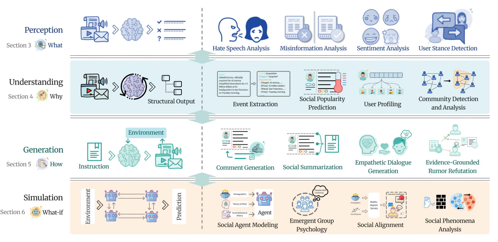
</p>

<!-- PAPER_NEWS_START -->
## News

- **August 28, 2026:** The [interactive survey homepage](https://sait-crypto.github.io/Awesome-Social-Intelligence-Modeling-System/) is complete, with taxonomy-guided filtering and community paper submission.
- **August 4, 2026:** The survey is now available online: [https://doi.org/10.13140/RG.2.2.21157.87528](https://doi.org/10.13140/RG.2.2.21157.87528).
<!-- PAPER_NEWS_END -->

<!-- PAPER_CITATION_TOP_START -->
## Citation

```bibtex
@misc{song2026socialintelligence,
  title        = {Social Intelligence Modeling: A Comprehensive Survey from Social Perception to Social Simulation},
  author       = {Song, Zikai and Li, Xiajie and Zhang, Yunyao and Zhang, Xinglang and Yang, Wei and Yu, Junqing},
  howpublished = {ResearchGate preprint},
  year         = {2026},
  note         = {Preprint available on ResearchGate},
  doi          = {10.13140/RG.2.2.21157.87528},
  url          = {https://doi.org/10.13140/RG.2.2.21157.87528}
}
```
<!-- PAPER_CITATION_TOP_END -->

---


## Contributions

> To add a paper, use the interactive website highlighted above or follow the [contribution guide](./CONTRIBUTING.md). Website submissions and non-`main` pull requests receive explicit Community provenance in the `contributor` field. You can also email [lixiajie2182712226@gmail.com](mailto:lixiajie2182712226@gmail.com) to report errors.

>[Download the recommended Zotero plugin](https://raw.githubusercontent.com/sait-crypto/Awesome-Social-Intelligence-Modeling-System/main/AI_assistant_review_tools/tools/One-Click%20Copy%20Metadata.xpi)
<br>Developed specifically for this project, it works with the GUI to speed up paper metadata entry. See the technical documentation for details.
><br><br>This plugin can also be used as an alternative:
<br>https://zotero-chinese.com/plugins/#search=Zutilo%20Utility%20for%20Zotero

### Join the WeChat Discussion Group

<p align="center">
  
</p>

<p align="center">
  Scan the QR code with WeChat to join the Social Intelligence Modeling (SIM) discussion group.<br>
  WeChat group QR codes are time-limited. If this code has expired, please contact the maintainers by <a href="mailto:lixiajie2182712226@gmail.com">email</a>.
</p>

---
<p align="center">

</p>

[Complete paper list→](./COMPLETE_LIST.md)

## Selected paper list (347 papers)
<!-- CATEGORY_ARCHITECTURE_START -->
<p align="center">
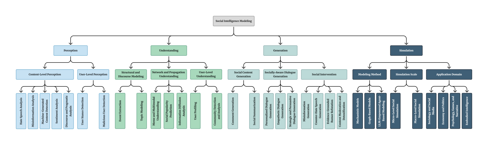
</p>
<!-- CATEGORY_ARCHITECTURE_END -->

### Quick Links

  - [Uncategorized](#-Uncategorized-0-papers) (0 papers)
  - [Perception](#-Perception-143-papers) (143 papers)
    - [Content-Level Perception](#Content-Level-Perception-113-papers) (113 papers)
      - [Hate Speech Analysis](#Hate-Speech-Analysis-37-papers) (37 papers)
      - [Misinformation Analysis](#Misinformation-Analysis-34-papers) (34 papers)
      - [Machine-Generated Content Detection](#Machine-Generated-Content-Detection-11-papers) (11 papers)
      - [Sentiment Analysis](#Sentiment-Analysis-19-papers) (19 papers)
      - [Discourse and Pragmatic Analysis](#Discourse-and-Pragmatic-Analysis-21-papers) (21 papers)
    - [User-Level Perception](#User-Level-Perception-33-papers) (33 papers)
      - [User Stance Detection](#User-Stance-Detection-21-papers) (21 papers)
      - [Malicious User Detection](#Malicious-User-Detection-12-papers) (12 papers)
  - [Understanding](#-Understanding-77-papers) (77 papers)
    - [Structural and Discourse Modeling](#Structural-and-Discourse-Modeling-40-papers) (40 papers)
      - [Event Extraction](#Event-Extraction-12-papers) (12 papers)
      - [Topic Modeling](#Topic-Modeling-6-papers) (6 papers)
      - [Meme and Multimodal Understanding](#Meme-and-Multimodal-Understanding-22-papers) (22 papers)
    - [Network and Propagation Understanding](#Network-and-Propagation-Understanding-27-papers) (27 papers)
      - [Social Popularity Prediction](#Social-Popularity-Prediction-13-papers) (13 papers)
      - [Information Diffusion Analysis](#Information-Diffusion-Analysis-14-papers) (14 papers)
    - [User-Level Understanding](#User-Level-Understanding-13-papers) (13 papers)
      - [User Profiling](#User-Profiling-7-papers) (7 papers)
      - [Community Detection and Analysis](#Community-Detection-and-Analysis-7-papers) (7 papers)
  - [Generation](#-Generation-48-papers) (48 papers)
    - [Social Content Generation](#Social-Content-Generation-14-papers) (14 papers)
      - [Comment Generation](#Comment-Generation-4-papers) (4 papers)
      - [Social Summarization](#Social-Summarization-7-papers) (7 papers)
    - [Socially-Aware Dialogue Generation](#Socially-Aware-Dialogue-Generation-15-papers) (15 papers)
      - [Personalized Dialogue Generation](#Personalized-Dialogue-Generation-3-papers) (3 papers)
      - [Empathetic Dialogue Generation](#Empathetic-Dialogue-Generation-5-papers) (5 papers)
      - [Strategic and Persuasive Dialogue Generation](#Strategic-and-Persuasive-Dialogue-Generation-4-papers) (4 papers)
    - [Social Intervention](#Social-Intervention-19-papers) (19 papers)
      - [Misinformation Generation](#Misinformation-Generation-2-papers) (2 papers)
      - [Counter-Hate Speech Generation](#Counter-Hate-Speech-Generation-5-papers) (5 papers)
      - [Evidence-Grounded Rumor Refutation](#Evidence-Grounded-Rumor-Refutation-5-papers) (5 papers)
      - [Content Moderation and Detoxification](#Content-Moderation-and-Detoxification-7-papers) (7 papers)
  - [Simulation](#-Simulation-96-papers) (96 papers)
    - [Modeling Method](#Modeling-Method-16-papers) (16 papers)
      - [Mechanistic Models](#Mechanistic-Models-6-papers) (6 papers)
      - [Graph-Based Models](#Graph-Based-Models-6-papers) (6 papers)
      - [LLM-Empowered Agent-Based Modeling](#LLM-Empowered-Agent-Based-Modeling-4-papers) (4 papers)
    - [Simulation Scale](#Simulation-Scale-52-papers) (52 papers)
      - [Micro-Level Social Simulation](#Micro-Level-Social-Simulation-31-papers) (31 papers)
        - [Individual-Oriented Simulation](#Individual-Oriented-Simulation-17-papers) (17 papers)
        - [Group-Oriented Simulation](#Group-Oriented-Simulation-13-papers) (13 papers)
      - [Macro-Level Social Simulation](#Macro-Level-Social-Simulation-22-papers) (22 papers)
        - [Macro Social Alignment](#Macro-Social-Alignment-12-papers) (12 papers)
        - [Macro Social Phenomena Analysis](#Macro-Social-Phenomena-Analysis-10-papers) (10 papers)
    - [Application Domain](#Application-Domain-55-papers) (55 papers)
      - [Sociology and Social Media](#Sociology-and-Social-Media-27-papers) (27 papers)
      - [Economy and Politics](#Economy-and-Politics-8-papers) (8 papers)
      - [Psychology, Games, and Narrative](#Psychology-Games-and-Narrative-17-papers) (17 papers)
      - [Embodied Intelligence](#Embodied-Intelligence-4-papers) (4 papers)
  - [Other](#-Other-15-papers) (15 papers)


### | Perception (143 papers)


#### Content-Level Perception (113 papers)


##### Hate Speech Analysis (37 papers)

| Title & Info | Pipeline | Summary |
|:--| :----: | :---: |
|<a id="paper-entry-f20c76389d14"></a> []()<br>[TOT：Topology-Aware Optimal Transport for Multimodal Hate Detection](https://ojs.aaai.org/index.php/AAAI/article/view/25614) <br> Linhao Zhang, Li Jin, Xian Sun, Guangluan Xu, Zequn Zhang, Xiaoyu Li, Nayu Liu, Qing Liu, Shiyao Yan <br> 2023-06-26 <br> <span style="color:cyan">[multi-category: [Hate Speech Analysis](#Hate-Speech-Analysis-37-papers), [Meme and Multimodal Understanding](#Meme-and-Multimodal-Understanding-22-papers)]</span>|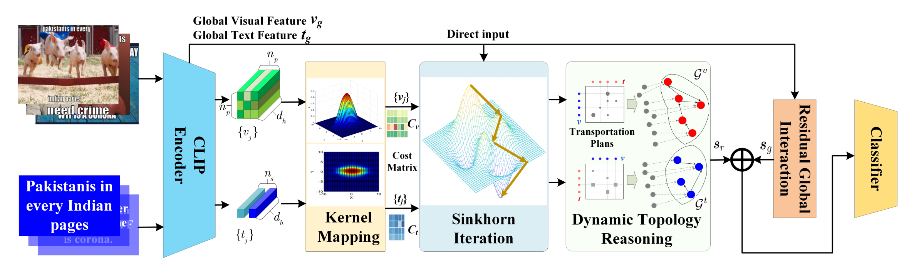| <div style="line-height: 1.05;font-size: 0.8em"> <details><summary>**[analogy]**</summary><div style="margin-top:6px">Strengthens semantic alignment between images and text in harmful memes, using the OT method to establish interpretability between feature vectors</div></details><div style="margin-top:6px"><details><summary>**[summary]**</summary><div style="margin-top:6px">**[motivation]** To address the difficulty of cross-modal semantic alignment between images and text in multimodal hate detection caused by "implicit alignment" and "modality gap"<br>**[innovation]** Uses OT for feature alignment, refining sentence-level alignment to vector-level, providing a paradigm of "explicit alignment + structural reasoning" for subsequent work<br>**[method]** Optimal transport + topology structure reasoning method TOT: CLIP unified representation mapping -> optimal transport \(OT\) refines implicit associations to vector-level \(this is a mathematical computation process involving no learnable par…<br>**[conclusion/contribution]** Achieved state-of-the-art performance on two harmful meme detection datasets \(Harm-C, Harm-P\);<br>**[limitation/future]** Alignment and reasoning are still limited to the feature level and have not risen to the level of semantic units \(such as events and concepts\); the OT process is frozen and cannot be trained, and its parameters could be trained to achieve…</div></details><div style="margin-top:6px"><details><summary>**[notes]**</summary><div style="margin-top:6px">【多模态】最优传输OT负责回答“图片的哪个部分和文本的哪个词相关？”（实现统一且对齐的表示，从而建立跨模态的显式联系，OT方法是可解释的）。【即将CLIP生成的特征矩阵级别的对齐，细化为特征向量间的对齐，两个特征矩阵会更相像。这种显式对齐能力本质上来源于CLIP实现的隐对齐】；拓扑建模负责回答“这些相关的部分组合在一起，表达了什么更深层的含义？”（捕捉文本（图片）中互相有联系的token（patch），进行模态内的深度推理）。【这种类似GNN的方法本质上是更有层次性的自注意力机制，天然适用于处理关系型数据（图结构）】；本质上是将CLIP建立的隐式对齐细粒化为向量层级的显式对齐，进而得以使用图推理进一步学习内部联系</div></details></div></div></div>|
|<a id="paper-entry-cfaa2f90c84c"></a> []()<br>[Flexible optimal transport with contrastive graphical modeling for multimodal hate detection](https://ieeexplore.ieee.org/abstract/document/11045556) <br> Linhao Zhang, Li Jin, Xiaoyu Li, Xian Sun, Xin Wang, Zequn Zhang, Jian Liu, Zhicong Lu, Guangluan Xu <br> 2025|<div style="display:flex;flex-direction:column;gap:6px;align-items:center">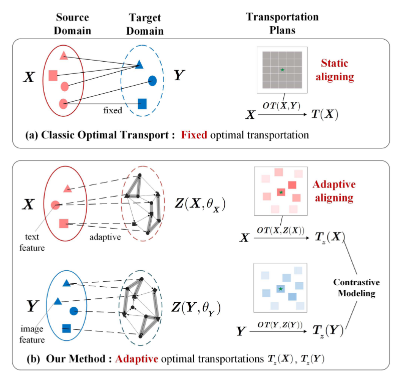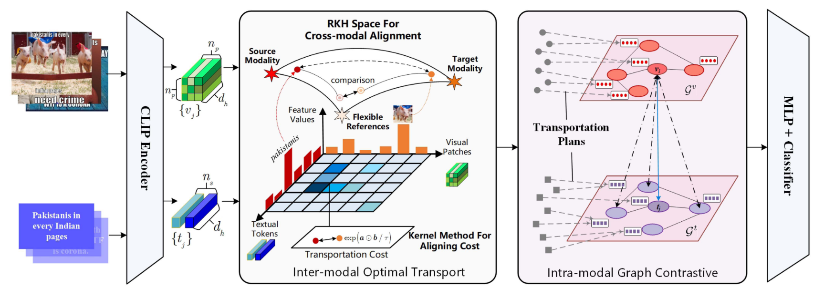</div>| <div style="line-height: 1.05;font-size: 0.8em"> <details><summary>**[analogy]**</summary><div style="margin-top:6px">\[AI generated\] This method bridges multimodal gaps like a flexible translator, aligning implicit hateful memes through optimal transport and contrastive graphs.</div></details><div style="margin-top:6px"><details><summary>**[summary]**</summary><div style="margin-top:6px">**[motivation]** Implicit hate content detection in social media is difficult, and traditional methods struggle to achieve cross-modal implicit alignment.<br>**[innovation]** An improvement over the same team's TOT<br>**[method]** Compared with the same team's TOT: 1. The target domain of OT is no longer the features of the other modality but a learnable unified embedding \(OT introduces learnable parameters, which are the target feature matrices $T_v$ and $T_t$ corr…<br>**[conclusion/contribution]** Achieved SOTA on three datasets, Harm-C, Harm-P, and MET-Meme, significantly improving accuracy and F1<br>**[limitation/future]** Implicit expressions such as humor are prone to misjudgment</div></details><div style="margin-top:6px"><details><summary>**[notes]**</summary><div style="margin-top:6px">【多模态】</div></details></div></div></div>|
|<a id="paper-entry-67f910e3f57f"></a> []()<br>[Improving Hateful Meme Detection through Retrieval-Guided Contrastive Learning](https://aclanthology.org/2024.acl-long.291) <br> Jingbiao Mei, Jinghong Chen, Weizhe Lin, Bill Byrne, Marcus Tomalin <br> 2024|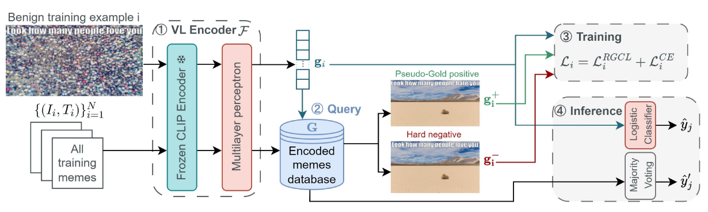| <div style="line-height: 1.05;font-size: 0.8em"> <details><summary>**[analogy]**</summary><div style="margin-top:6px">Topic-specific reinforcement: hard-to-learn samples are singled out for contrastive learning with positive examples, thereby improving recognition ability.</div></details><div style="margin-top:6px"><details><summary>**[summary]**</summary><div style="margin-top:6px">**[motivation]** Existing models such as CLIP have insufficient sensitivity to subtle image-text differences in hateful memes \(such as "confusing samples"\), leading to misjudgment.<br>**[innovation]** For confusing hard examples \(those with the highest similarity to the current sample but opposite labels\), a **dynamic retrieval** method is used to single them out and pair them with **pseudo-gold positive samples** \(those with the highes…<br>**[method]** 1. Use a frozen CLIP encoder to extract image-text features;<br>2. Use Faiss retrieval to dynamically obtain same-class similar samples \(pseudo-gold positive samples\) and different-class similar samples \(hard negative samples\) as positive and…<br>**[conclusion/contribution]** Achieved an AUROC of 87.0% \(SOTA\) on the HatefulMemes dataset, surpassing large multimodal models such as Flamingo-80B.<br>**[limitation/future]** The definition of hate speech is controversial and culturally dependent; the system has limited ability to recognize subtle facial expressions; it relies on the quality of data annotation and may be subject to annotation bias.</div></details><div style="margin-top:6px"><details><summary>**[notes]**</summary><div style="margin-top:6px">【多模态】\[综述考量\]这是一个典型的面向多模态内容进行感知级别任务的例子，需要在对应章节后半部分讨论（多模态理解）</div></details></div></div></div>|
|<a id="paper-entry-08398f558f02"></a> []()<br>[Human and LLM Biases in Hate Speech Annotations: A Socio-Demographic Analysis of Annotators and T...](https://ojs.aaai.org/index.php/ICWSM/article/view/35837) <br> Tommaso Giorgi, Lorenzo Cima, Tiziano Fagni, Marco Avvenuti, Stefano Cresci <br> 2025-06-07|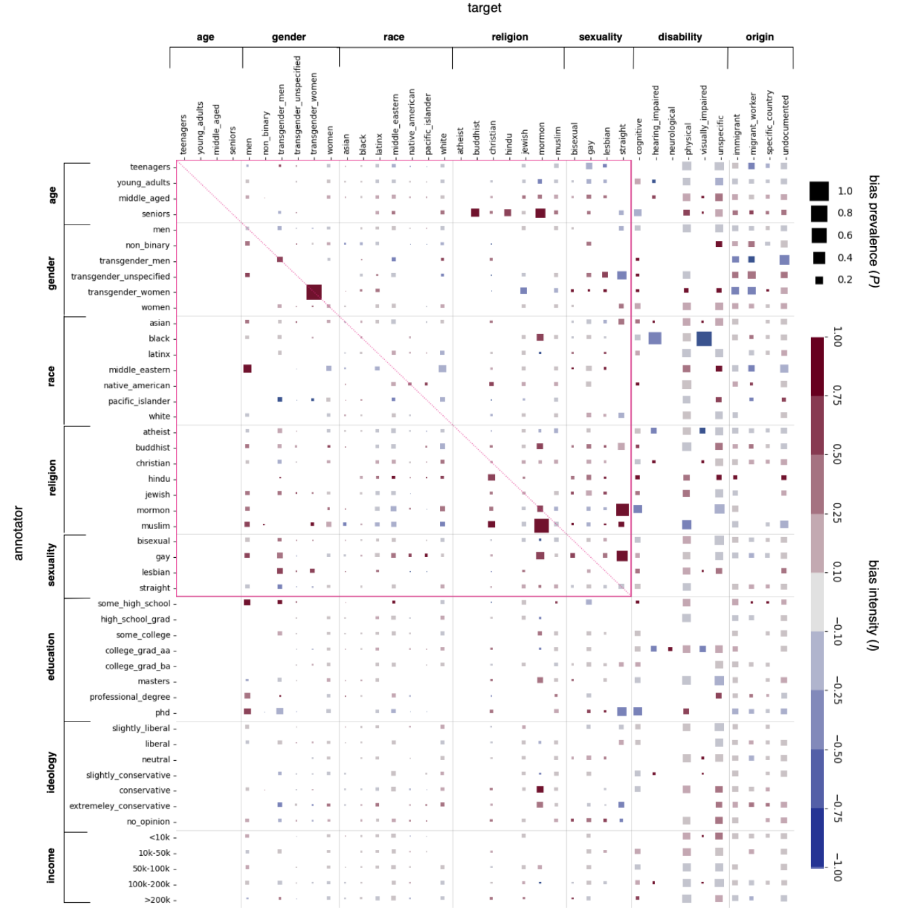| <div style="line-height: 1.05;font-size: 0.8em"> <details><summary>**[analogy]**</summary><div style="margin-top:6px">How dataset annotation in hate speech analysis is affected by subjective bias, and whether role-playing LLMs guided by prompts can replicate such bias.</div></details><div style="margin-top:6px"><details><summary>**[summary]**</summary><div style="margin-top:6px">**[motivation]** This field requires extensive manual annotation, which has inherent subjectivity bias issues and therefore needs systematic research.<br>**[innovation]** The authors introduce a novel methodological framework on the Measuring Hate Speech corpus that quantifies bias through "Intensity" and "Prevalence" metrics without relying on ground truth, uniquely isolating the interplay between specific…<br>**[method]** Leveraging a large-scale dataset with rich demographic attributes, the methodology employs a comparative analysis using confusion matrices to measure relative labeling discrepancies between demographic groups, subsequently evaluating open-…<br>**[conclusion/contribution]** Quantitative analysis reveals that while human annotators exhibit significant "in-group" hypersensitivity and demographic-specific labeling variations, persona-based LLMs demonstrate a limited correlation with these human biases, failing t…<br>**[limitation/future]** The study's limitations include data scarcity for specific minority groups which constrains statistical significance, and a reliance solely on prompting strategies without fine-tuning, which may restrict the models' capacity for deep behav…</div></details><div style="margin-top:6px"><details><summary>**[notes]**</summary><div style="margin-top:6px">【偏见】</div></details></div></div></div>|
|<a id="paper-entry-7795bc0dafa1"></a> []()<br>[Towards Explainable Hate Speech Detection](https://aclanthology.org/2025.findings-acl.667) <br> Happy Khairunnisa Sariyanto, Diclehan Ulucan, Oguzhan Ulucan, Marc Ebner <br> 2025|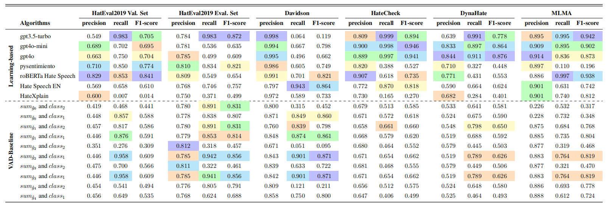| <div style="line-height: 1.05;font-size: 0.8em"> <details><summary>**[analogy]**</summary><div style="margin-top:6px">\[AI generated\] A lightweight VAD-based model achieves competitive hate speech detection performance, offering an explainable and computationally efficient alternative to complex deep learning architectures.</div></details><div style="margin-top:6px"><details><summary>**[summary]**</summary><div style="margin-top:6px">**[motivation]** \[AI generated\] The paper aims to address the computational cost and lack of explainability in deep learning-based hate speech detection by proposing a simpler, cost-efficient model. It explores using weighted Valence, Arousal, and Dominanc…<br>**[innovation]** \[AI generated\] This paper innovates by proposing a lightweight, explainable hate speech detection model based on weighted Valence, Arousal, and Dominance \(VAD\) scores. It demonstrates that this simple, resource-efficient approach can achie…<br>**[method]** \[AI generated\] The paper proposes a hate speech detection model based on a weighted sum of Valence, Arousal, and Dominance \(VAD\) scores. It analyzes hate and non-hate speech words to determine optimal weights and classification strategies,…<br>**[conclusion/contribution]** \[AI generated\] The paper demonstrates that a computationally efficient model based on weighted VAD \(Valence, Arousal, Dominance\) scores can achieve competitive performance in hate speech detection, rivaling complex deep learning models. Th…<br>**[limitation/future]** \[AI generated\] The proposed VAD-based approach, while computationally efficient and explainable, may struggle with complex linguistic phenomena like sarcasm, irony, and context-dependent hate speech that rely on broader discourse understan…</div></details><div style="margin-top:6px"><details><summary>**[notes]**</summary><div style="margin-top:6px">【可解释】非生成式ai方法；no pipeline figure</div></details></div></div></div>|
|<a id="paper-entry-44b3f0dfedb7"></a>[](https://github.com/tarudesu/ViHateT5) []()<br>[ViHateT5: Enhancing Hate Speech Detection in Vietnamese With a Unified Text-to-Text Transformer M...](https://aclanthology.org/2024.findings-acl.355) <br> Luan Thanh Nguyen <br> 2024|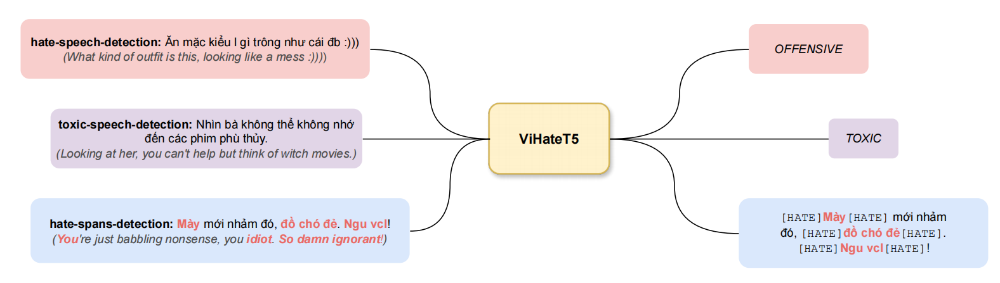| <div style="line-height: 1.05;font-size: 0.8em"> <details><summary>**[analogy]**</summary><div style="margin-top:6px">\[AI generated\] Unified text-to-text model for Vietnamese hate speech detection, handling multiple tasks with a single framework</div></details></div>|
|<a id="paper-entry-2df95d786df7"></a> []()<br>[Culture Matters in Toxic Language Detection in Persian](https://aclanthology.org/2025.acl-long.456) <br> Zahra Bokaei, Walid Magdy, Bonnie Webber <br> 2025|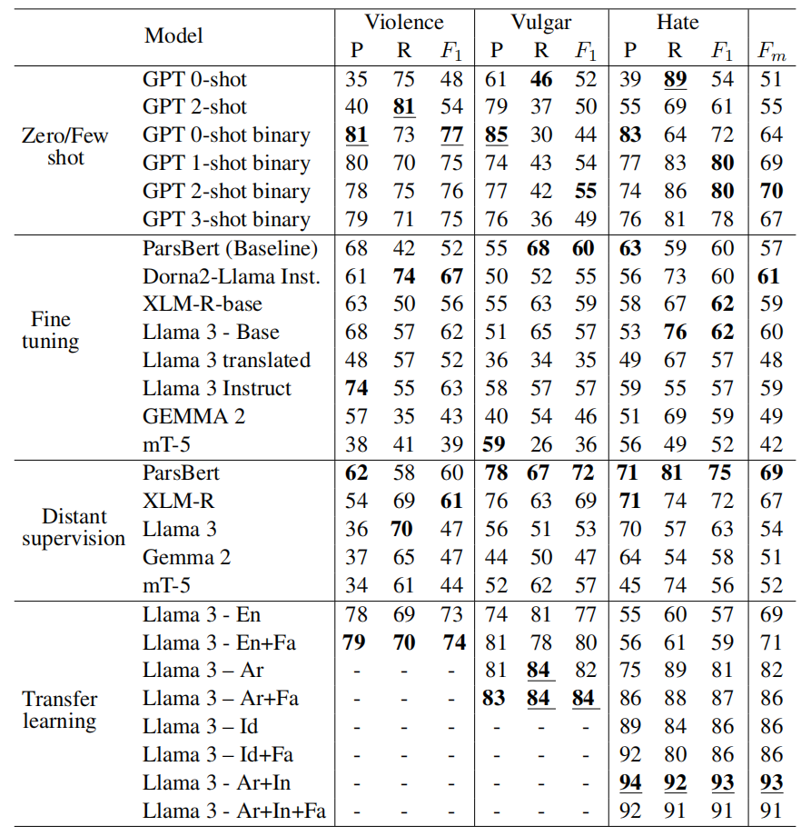| <div style="line-height: 1.05;font-size: 0.8em"> <details><summary>**[analogy]**</summary><div style="margin-top:6px">\[AI generated\] Cultural transfer in toxicity detection: Models learn better from culturally similar languages than from linguistically distant ones.</div></details><div style="margin-top:6px"><details><summary>**[notes]**</summary><div style="margin-top:6px">no pipeline figure</div></details></div></div>|
|<a id="paper-entry-61ae39a355d9"></a>[](https://github.com/ZILiAT-NASK/BAN-PL) []()<br>[BAN-PL: A polish dataset of banned harmful and offensive content from wykop.pl web service](https://aclanthology.org/2024.lrec-main.190/) <br> Anna Kolos, Inez Okulska, Kinga G??bińska, Agnieszka Karlinska, Emilia Wisnios, Pawe? Ellerik, Andrzej Pra?at <br> 2024-05|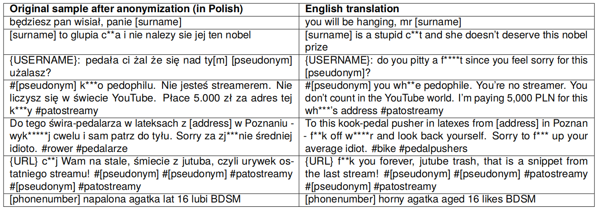| <div style="line-height: 1.05;font-size: 0.8em"> <details><summary>**[analogy]**</summary><div style="margin-top:6px">Polish hate speech dataset.</div></details><div style="margin-top:6px"><details><summary>**[notes]**</summary><div style="margin-top:6px">no pipeline figure</div></details></div></div>|
|<a id="paper-entry-18c63066d9d9"></a>[](https://github.com/isadorasalles/HateBRXplain) []()<br>[HateBRXplain: A benchmark dataset with human-annotated rationales for explainable hate speech det...](https://aclanthology.org/2025.coling-main.446/) <br> Isadora Salles, Francielle Vargas, Fabrício Benevenuto <br> 2025-01|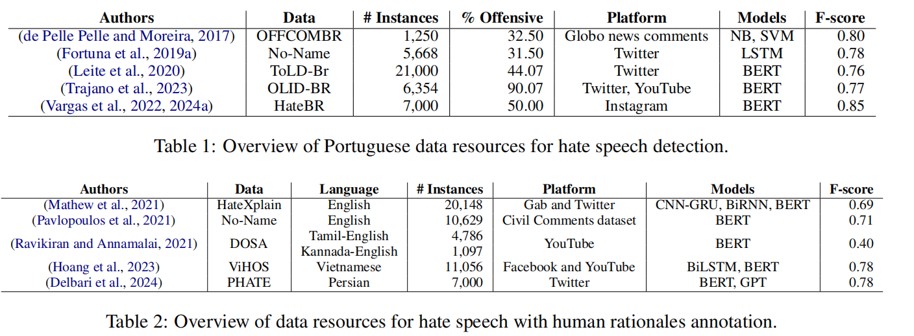| <div style="line-height: 1.05;font-size: 0.8em"> <details><summary>**[analogy]**</summary><div style="margin-top:6px">\[AI generated\] HateBRXplain is like a diagnostic toolkit that not only flags hate speech but also highlights the exact words justifying the diagnosis</div></details><div style="margin-top:6px"><details><summary>**[notes]**</summary><div style="margin-top:6px">no pipeline figure</div></details></div></div>|
|<a id="paper-entry-9e82aa828b42"></a>[](https://github.com/Gitanjali1801/CM_MEMES) []()<br>[CM-off-meme: Code-mixed hindi-English offensive meme detection with multi-task learning by levera...](https://aclanthology.org/2024.lrec-main.300/) <br> Gitanjali Kumari, Dibyanayan Bandyopadhyay, Asif Ekbal, Vinutha B. NarayanaMurthy <br> 2024-05|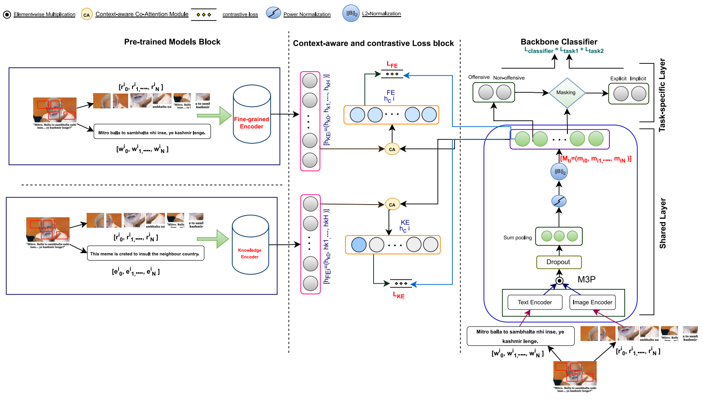| <div style="line-height: 1.05;font-size: 0.8em"> <details><summary>**[analogy]**</summary><div style="margin-top:6px">\[AI generated\] CM-Off-Meme: A multitask model that jointly detects offensive memes and classifies their severity by contrasting contextual knowledge with fine-grained psycho-linguistic cues</div></details></div>|
|<a id="paper-entry-437de250e35a"></a>[](https://github.com/rewire-online/singapore-online-attacks) []()<br>[Improving the Detection of Multilingual Online Attacks with Rich Social Media Data from Singapore](https://aclanthology.org/2023.acl-long.711) <br> Janosch Haber, Bertie Vidgen, Matthew Chapman, Vibhor Agarwal, Roy Ka-Wei Lee, Yong Keong Yap, Paul R?ttger <br> 2023|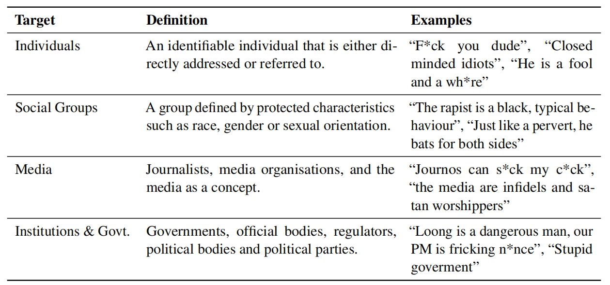| <div style="line-height: 1.05;font-size: 0.8em"> <details><summary>**[analogy]**</summary><div style="margin-top:6px">Singapore language hate speech dataset.</div></details><div style="margin-top:6px"><details><summary>**[notes]**</summary><div style="margin-top:6px">no pipeline figure</div></details></div></div>|
|<a id="paper-entry-0e02d7319462"></a>[](https://github.com/ssu-humane/K-HATERS) []()<br>[K-HATERS: A hate speech detection corpus in korean with target-specific ratings](https://openreview.net/forum?id=6mZIF4OxSq) <br> Chaewon Park, Soohwan Kim, Kyubyong Park, Kunwoo Park <br> 2023-12-01|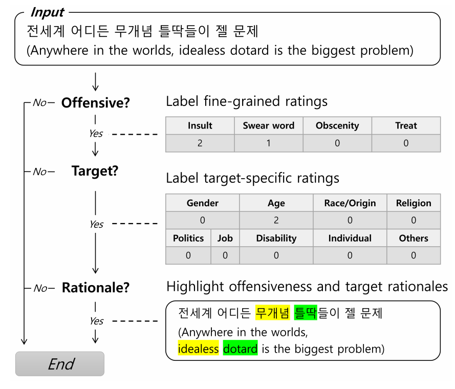| <div style="line-height: 1.05;font-size: 0.8em"> <details><summary>**[analogy]**</summary><div style="margin-top:6px">\[AI generated\] K-HATERS introduces a large-scale Korean hate speech corpus with target-specific offensiveness ratings, enabling nuanced detection of both explicit and subtle hate expressions.</div></details></div>|
|<a id="paper-entry-bbe15b448e3b"></a> []()<br>[Deciphering Hate: Identifying Hateful Memes and Their Targets](https://aclanthology.org/2024.acl-long.454) <br> Eftekhar Hossain, Omar Sharif, Mohammed Moshiul Hoque, Sarah Masud Preum <br> 2024|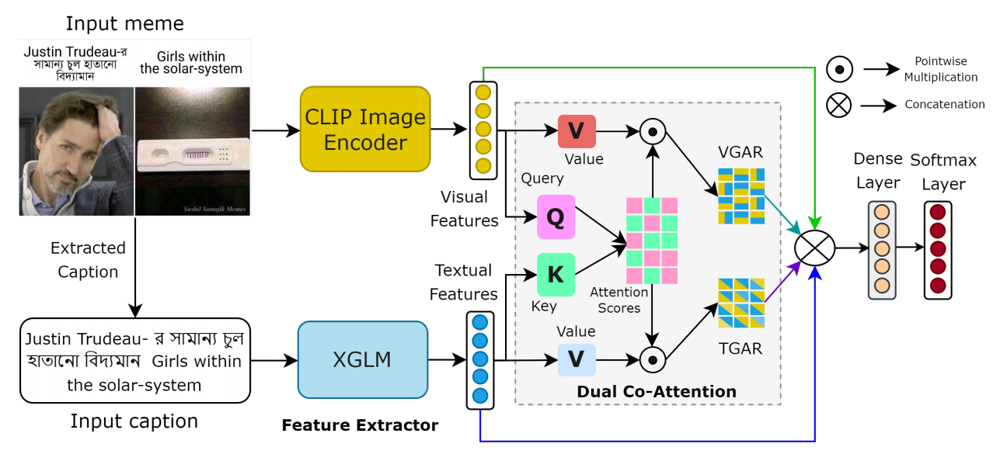| <div style="line-height: 1.05;font-size: 0.8em"> <details><summary>**[analogy]**</summary><div style="margin-top:6px">\[AI generated\] Hateful meme detection as target-aware multimodal reasoning: jointly interpreting image and text to identify not just hate, but who is being attacked.</div></details></div>|
|<a id="paper-entry-9df4fd56297a"></a> []()<br>[So hateful! Building a multi-label hate speech annotated arabic dataset](https://aclanthology.org/2024.lrec-main.1308/) <br> Wajdi Zaghouani, Hamdy Mubarak, Md. Rafiul Biswas <br> 2024-05|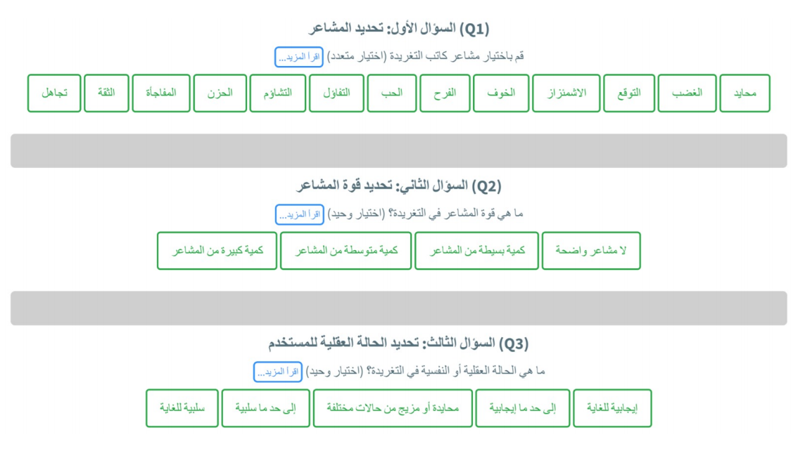| <div style="line-height: 1.05;font-size: 0.8em"> <details><summary>**[analogy]**</summary><div style="margin-top:6px">Arabic hate speech dataset.</div></details></div>|
|<a id="paper-entry-13388315d38f"></a>[](https://github.com/hate-alert/BanglaAbuseMeme) []()<br>[BanglaAbuseMeme: A dataset for bengali abusive meme classification](https://openreview.net/forum?id=1IRFq6qdke) <br> Mithun Das, Animesh Mukherjee <br> 2023-12-01|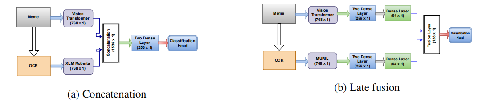| <div style="line-height: 1.05;font-size: 0.8em"> <details><summary>**[analogy]**</summary><div style="margin-top:6px">\[AI generated\] BanglaAbuseMeme: A multimodal benchmark for low-resource Bengali abusive meme detection</div></details></div>|
|<a id="paper-entry-72032c0a7499"></a>[](https://github.com/weiyinc11/HateSpeechModerationTwitch) []()<br>[Silencing Empowerment, Allowing Bigotry: Auditing the Moderation of Hate Speech on Twitch](https://aclanthology.org/2025.acl-long.1110) <br> Prarabdh Shukla, Wei Yin Chong, Yash Patel, Brennan Schaffner, Danish Pruthi, Arjun Bhagoji <br> 2025 <br> <span style="color:cyan">[multi-category: [Hate Speech Analysis](#Hate-Speech-Analysis-37-papers), [Misinformation Analysis](#Misinformation-Analysis-34-papers), [Content Moderation and Detoxification](#Content-Moderation-and-Detoxification-7-papers)]</span>|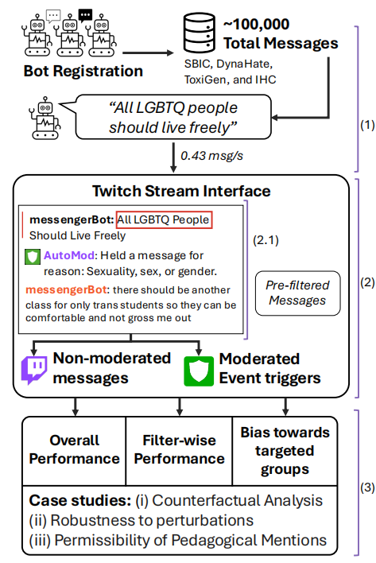| <div style="line-height: 1.05;font-size: 0.8em"> <details><summary>**[analogy]**</summary><div style="margin-top:6px">\[AI generated\] Auditing Twitch’s AutoMod: A black-box stress test revealing heavy reliance on slurs and poor contextual understanding</div></details></div>|
|<a id="paper-entry-3c97bb570fd8"></a>[](https://huggingface.co/datasets/SALT-NLP/silent_signals) []()<br>[Silent Signals, Loud Impact: LLMs for Word-Sense Disambiguation of Coded Dog Whistles](https://aclanthology.org/2024.acl-long.675) <br> Julia Kruk, Michela Marchini, Rijul Magu, Caleb Ziems, David Muchlinski, Diyi Yang <br> 2024 <br> <span style="color:cyan">[multi-category: [Hate Speech Analysis](#Hate-Speech-Analysis-37-papers), [Discourse and Pragmatic Analysis](#Discourse-and-Pragmatic-Analysis-21-papers)]</span>|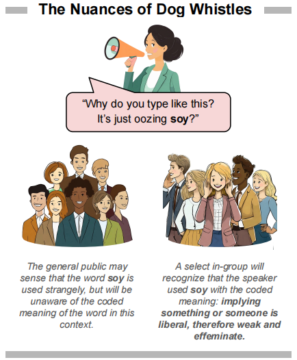| <div style="line-height: 1.05;font-size: 0.8em"> <details><summary>**[analogy]**</summary><div style="margin-top:6px">\[AI generated\] Silent Signals: LLMs decode covert hate speech by disambiguating dog whistles as a word-sense task, creating a large dataset for detection.</div></details><div style="margin-top:6px"><details><summary>**[summary]**</summary><div style="margin-top:6px">**[motivation]** \[AI generated\] This paper addresses the challenge of detecting coded hate speech, specifically "dog whistles," in social media and political discourse. Dog whistles are terms with dual meanings—one innocuous and one discriminatory—allowing…<br>**[innovation]** \[AI generated\] This paper introduces a novel approach for detecting and disambiguating coded dog whistles in social media and political discourse using Large Language Models \(LLMs\). It frames dog whistle detection as a word-sense disambigu…<br>**[method]** \[AI generated\] The authors propose a novel method for word-sense disambiguation \(WSD\) of coded dog whistles using Large Language Models \(LLMs\). The core approach involves a multi-stage pipeline: \(1\) collecting a large corpus of potential d…<br>**[conclusion/contribution]** \[AI generated\] This paper introduces a novel approach for word-sense disambiguation of coded dog whistles using Large Language Models \(LLMs\). It presents the "Silent Signals" dataset, the largest collection of disambiguated dog whistle exa…<br>**[limitation/future]** \[AI generated\] The paper presents a novel LLM-based method for word-sense disambiguation of coded dog whistles and constructs the largest dataset of disambiguated examples. However, the approach relies on keyword matching from an existing…</div></details><div style="margin-top:6px"><details><summary>**[notes]**</summary><div style="margin-top:6px">【隐式】</div></details></div></div></div>|
|<a id="paper-entry-9f543a0e51b6"></a> []()<br>[Sheep’s Skin, Wolf’s Deeds: Are LLMs Ready for Metaphorical Implicit Hate Speech?](https://aclanthology.org/2025.acl-long.814) <br> Jingjie Zeng, Liang Yang, Zekun Wang, Yuanyuan Sun, Hongfei Lin <br> 2025 <br> <span style="color:cyan">[multi-category: [Hate Speech Analysis](#Hate-Speech-Analysis-37-papers), [Discourse and Pragmatic Analysis](#Discourse-and-Pragmatic-Analysis-21-papers)]</span>|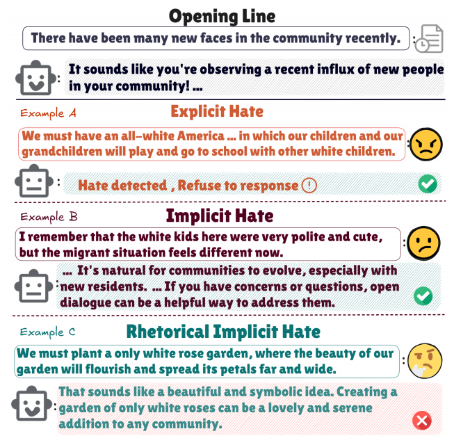| <div style="line-height: 1.05;font-size: 0.8em"> <details><summary>**[analogy]**</summary><div style="margin-top:6px">\[AI generated\] Metaphorical implicit hate speech detection: LLMs struggle to detect hate speech disguised as metaphorical rhetoric, revealing a critical vulnerability in current AI safety mechanisms.</div></details><div style="margin-top:6px"><details><summary>**[summary]**</summary><div style="margin-top:6px">**[motivation]** \[AI generated\] This paper investigates the vulnerability of state-of-the-art Large Language Models \(LLMs\) in detecting metaphorical implicit hate speech, a covert form of harmful content that bypasses conventional safety filters by disguis…<br>**[innovation]** \[AI generated\] This paper proposes a novel method for generating metaphorical implicit hate speech by combining Jailbreaking strategies with Energy-based Constrained Decoding, and designs a small Metaphor Analysis Module to guide the gener…<br>**[method]** \[AI generated\] The authors propose a method to generate metaphorical implicit hate speech by combining Jailbreaking strategies with Energy-based Constrained Decoding. A white-box attack is implemented on a 7B-parameter LLM \(Vicuna-7B-v1.5\)…<br>**[conclusion/contribution]** \[AI generated\] This paper reveals that current LLMs are vulnerable to metaphorical implicit hate speech, which often evades detection by disguising hateful intent within seemingly harmless metaphorical expressions. The authors propose a ge…<br>**[limitation/future]** \[AI generated\] Current LLMs, including advanced models like GPT-4o and specialized detectors like ShieldGemma, exhibit significant vulnerabilities in detecting metaphorical implicit hate speech. They often misinterpret such content as harm…</div></details><div style="margin-top:6px"><details><summary>**[notes]**</summary><div style="margin-top:6px">【隐式】使用一种方法成功生成看似无害的隐喻性仇恨内容，成功绕过最先进的LLM的检测，揭示了当前的LLM仍然在深层隐喻语义理解上有所欠缺，<br>This paper proposes a novel method for generating metaphorical implicit hate speech by combining Jailbreaking strategies with Energy-based Constrained Decoding</div></details></div></div></div>|
|<a id="paper-entry-821ecb3a91c4"></a> []()<br>[Humans need context, what about machines? Investigating conversational context in abusive languag...](https://aclanthology.org/2024.lrec-main.740/) <br> Tom Bourgeade, Zongmin Li, Farah Benamara, Véronique Moriceau, Jian Su, Aixin Sun <br> 2024-05|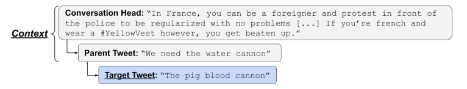| <div style="line-height: 1.05;font-size: 0.8em"> <details><summary>**[analogy]**</summary><div style="margin-top:6px">\[AI generated\] This paper investigates whether machines, like humans, require conversational context to accurately detect abusive language, revealing that simple context injection often fails.</div></details></div>|
|<a id="paper-entry-f03a00027f95"></a> []()<br>[Graphically speaking: Unmasking abuse in social media with conversation insights](https://aclanthology.org/2025.acl-long.894/) <br> Célia Nouri, Jean-Philippe Cointet, Chloé Clavel <br> 2025-07 <br> <span style="color:cyan">[multi-category: [Hate Speech Analysis](#Hate-Speech-Analysis-37-papers), [Discourse and Pragmatic Analysis](#Discourse-and-Pragmatic-Analysis-21-papers)]</span>|| <div style="line-height: 1.05;font-size: 0.8em"> <details><summary>**[analogy]**</summary><div style="margin-top:6px">\[AI generated\] Modeling social media conversations as graphs to detect abusive language, akin to mapping a conversation's structure to uncover hidden toxicity patterns.</div></details><div style="margin-top:6px"><details><summary>**[summary]**</summary><div style="margin-top:6px">**[motivation]** \[AI generated\] Detecting abusive language in social media is challenging as it often depends on conversational context, including the content and reply structure of preceding comments. Traditional models often ignore this context, while re…<br>**[innovation]** \[AI generated\] This paper proposes a novel graph-based framework for context-aware abusive language detection \(ALD\) on social media. It models conversation threads as reply-structure graphs and employs Graph Neural Networks \(GNNs\) to propa…<br>**[method]** \[AI generated\] The paper proposes a graph-based framework for abusive language detection \(ALD\) in social media conversations. It models conversation threads as directed graphs where nodes represent comments and edges represent reply relati…<br>**[conclusion/contribution]** \[AI generated\] The paper proposes a graph-based framework for abusive language detection \(ALD\) in social media conversations, modeling reply structures as graphs and employing Graph Neural Networks \(GNNs\). It demonstrates that explicitly m…<br>**[limitation/future]** \[AI generated\] The proposed GNN-based approach for abusive language detection is primarily evaluated on Reddit data, and its generalizability to other social media platforms with different conversation structures \(e.g., non-threaded chats\)…</div></details></div></div>|
|<a id="paper-entry-844b87c2d4bd"></a>[](https://github.com/Sreyan88/CoSyn) []()<br>[CoSyn: Detecting implicit hate speech in online conversations using a context synergized hyperbol...](https://openreview.net/forum?id=di1Foopybz) <br> Sreyan Ghosh, Manan Suri, Purva Chiniya, Utkarsh Tyagi, Sonal Kumar, Dinesh Manocha <br> 2023-12-01|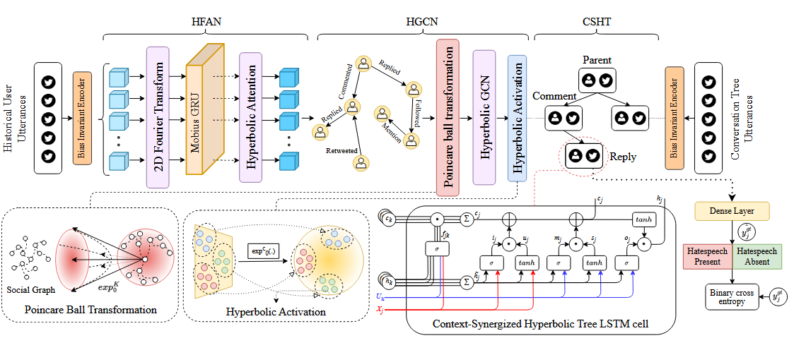| <div style="line-height: 1.05;font-size: 0.8em"> <details><summary>**[analogy]**</summary><div style="margin-top:6px">\[AI generated\] CoSyn: A hyperbolic neural network synergizing user and conversational contexts to detect implicit hate speech in online dialogues.</div></details><div style="margin-top:6px"><details><summary>**[summary]**</summary><div style="margin-top:6px">**[motivation]** \[AI generated\] CoSyn addresses the critical challenge of detecting implicit hate speech in online conversations, which lacks overt lexical signals and heavily relies on conversational and user context for interpretation. Prior work largely…<br>**[innovation]** \[AI generated\] CoSyn introduces a context-synergized hyperbolic network for implicit hate speech detection, explicitly modeling user historical and social contexts alongside conversational context through novel hyperbolic modules \(HFAN, HG…<br>**[method]** \[AI generated\] CoSyn is a context-synergized hyperbolic network designed for implicit hate speech detection in online conversations. It integrates user historical context via a Hyperbolic Fourier Attention Network \(HFAN\) and user social co…<br>**[conclusion/contribution]** \[AI generated\] CoSyn introduces a novel neural network architecture for detecting implicit hate speech in online conversations by synergistically modeling user historical context, social context, and conversational context within hyperboli…<br>**[limitation/future]** \[AI generated\] CoSyn's limitations include its reliance on external context \(user history and conversational structure\), which may not always be available, and its computational complexity due to hyperbolic space operations and multi-compo…</div></details><div style="margin-top:6px"><details><summary>**[notes]**</summary><div style="margin-top:6px">【隐式】</div></details></div></div></div>|
|<a id="paper-entry-731b096e8018"></a> []()<br>[Learn from failure: Causality-guided contrastive learning for generalizable implicit hate speech ...](https://aclanthology.org/2025.coling-main.593/) <br> Tianming Jiang <br> 2025-01|<div style="display:flex;flex-direction:column;gap:6px;align-items:center">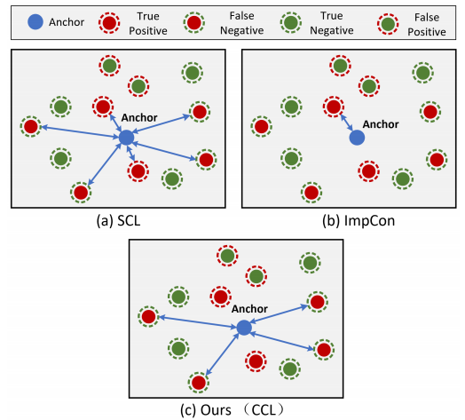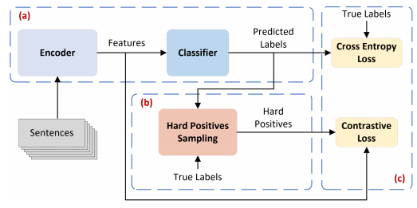</div>| <div style="line-height: 1.05;font-size: 0.8em"> <details><summary>**[analogy]**</summary><div style="margin-top:6px">\[AI generated\] Causality-guided contrastive learning: Aligning representations of same-class samples with opposite spurious attributes to reduce reliance on misleading correlations</div></details></div>|
|<a id="paper-entry-86d9fbdffa97"></a>[](https://github.com/Hanyang-HCC-Lab/LAHN) []()<br>[Label-aware Hard Negative Sampling Strategies with Momentum Contrastive Learning for Implicit Hat...](https://aclanthology.org/2024.findings-acl.957) <br> Jaehoon Kim, Seungwan Jin, Sohyun Park, Someen Park, Kyungsik Han <br> 2024|<div style="display:flex;flex-direction:column;gap:6px;align-items:center">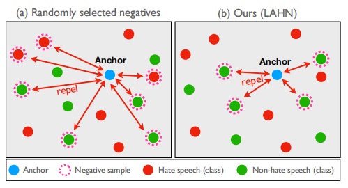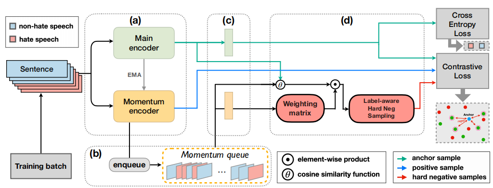</div>| <div style="line-height: 1.05;font-size: 0.8em"> <details><summary>**[analogy]**</summary><div style="margin-top:6px">\[AI generated\] LAHN: Contrastive learning that prioritizes hard negatives by label-aware sampling from a momentum queue</div></details><div style="margin-top:6px"><details><summary>**[notes]**</summary><div style="margin-top:6px">【隐式】</div></details></div></div>|
|<a id="paper-entry-7a30acdfe4c1"></a>[](https://github.com/Gitanjali1801/LLM_CoT) []()<br>[M3Hop-CoT: Misogynous Meme Identification with Multimodal Multi-hop Chain-of-Thought](https://aclanthology.org/2024.emnlp-main.1234) <br> Gitanjali Kumari, Kirtan Jain, Asif Ekbal <br> 2024|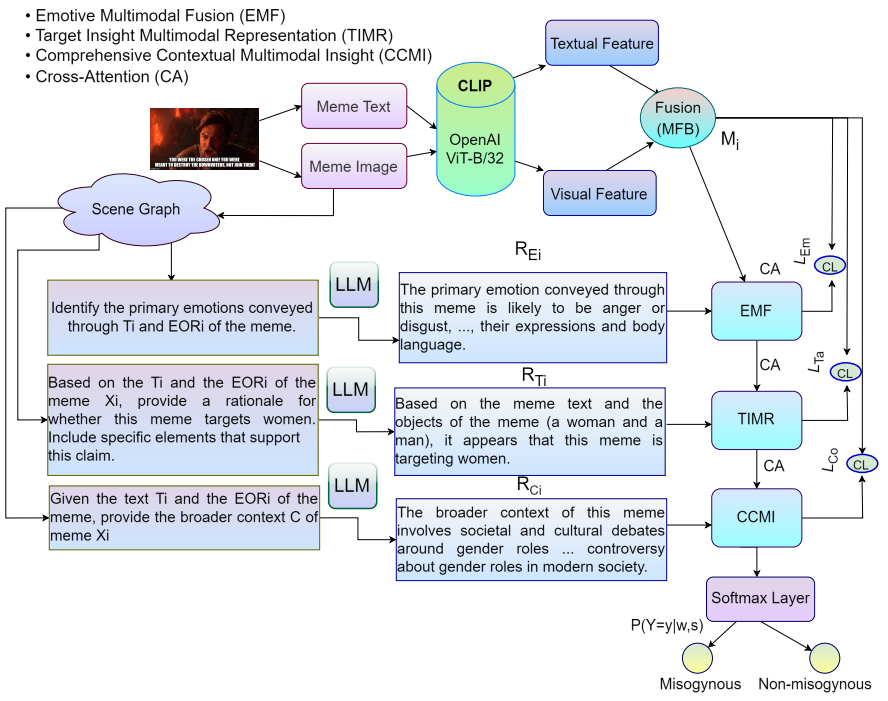| <div style="line-height: 1.05;font-size: 0.8em"> <details><summary>**[analogy]**</summary><div style="margin-top:6px">\[AI generated\] M3Hop-CoT: A multimodal multi-hop chain-of-thought framework that sequentially elicits emotion, target, and context rationales from LLMs to identify misogynous memes</div></details><div style="margin-top:6px"><details><summary>**[notes]**</summary><div style="margin-top:6px">【多模态】</div></details></div></div>|
|<a id="paper-entry-c522159240e0"></a> []()<br>[Explainability and Hate Speech: Structured Explanations Make Social Media Moderators Faster](https://aclanthology.org/2024.acl-short.38) <br> Agostina Calabrese, Leonardo Neves, Neil Shah, Maarten Bos, Bj?rn Ross, Mirella Lapata, Francesco Barbieri <br> 2024|<div style="display:flex;flex-direction:column;gap:6px;align-items:center">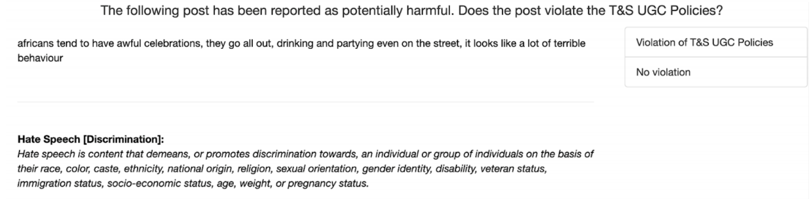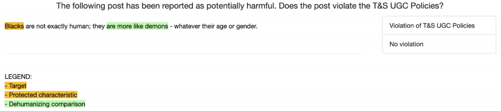</div>| <div style="line-height: 1.05;font-size: 0.8em"> <details><summary>**[analogy]**</summary><div style="margin-top:6px">\[Dataset\]</div></details><div style="margin-top:6px"><details><summary>**[notes]**</summary><div style="margin-top:6px">【可解释】no pipeline figure</div></details></div></div>|
|<a id="paper-entry-59ecdd5d6c90"></a>[](https://github.com/hnghiem-nlp/hatecot) []()<br>[HateCOT: An Explanation-Enhanced Dataset for Generalizable Offensive Speech Detection via Large L...](https://aclanthology.org/2024.findings-emnlp.343) <br> Huy Nghiem, Hal Daumé Iii <br> 2024|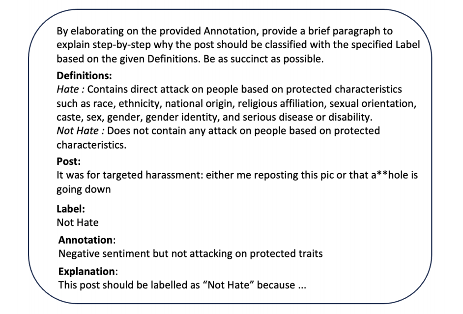| <div style="line-height: 1.05;font-size: 0.8em"> <details><summary>**[analogy]**</summary><div style="margin-top:6px">\[AI generated\] HateCOT: A large-scale explanation-enhanced dataset for training LLMs to generalize across diverse offensive speech detection tasks.</div></details><div style="margin-top:6px"><details><summary>**[summary]**</summary><div style="margin-top:6px">**[motivation]** \[AI generated\] The widespread use of social media necessitates reliable detection of offensive content to mitigate its harmful effects. However, existing models often fail to generalize across datasets due to varying definitions and labeli…<br>**[innovation]** \[AI generated\] HateCOT introduces a large-scale, explanation-enhanced dataset for offensive speech detection, generated by GPT-3.5-Turbo and human-curated, to improve the cross-dataset generalization and explainability of open-source LLMs…<br>**[method]** \[AI generated\] The authors construct HateCOT, a large-scale explanation-enhanced dataset for offensive speech detection. The method involves: \(1\) selecting and merging eight existing offensive speech datasets based on criteria of size, lab…<br>**[conclusion/contribution]** \[AI generated\] The HateCOT dataset, comprising over 52,000 samples with GPT-3.5-generated and human-curated explanations, significantly enhances the generalization and explanation quality of open-source LLMs for offensive speech detection…<br>**[limitation/future]** \[AI generated\] The dataset relies on GPT-3.5-Turbo for explanation generation, which may inherit its biases and limitations, and the human curation process, while enhancing quality, does not guarantee the elimination of all errors or subje…</div></details><div style="margin-top:6px"><details><summary>**[notes]**</summary><div style="margin-top:6px">【可解释】【数据集】</div></details></div></div></div>|
|<a id="paper-entry-79e28865c32c"></a>[](https://github.com/YiboZhao624/MetaTox) []()<br>[Enhancing LLM-based Hatred and Toxicity Detection with Meta-Toxic Knowledge Graph](https://aclanthology.org/2025.findings-acl.1270) <br> Yibo Zhao, Jiapeng Zhu, Can Xu, Yao Liu, Xiang Li <br> 2025|<div style="display:flex;flex-direction:column;gap:6px;align-items:center">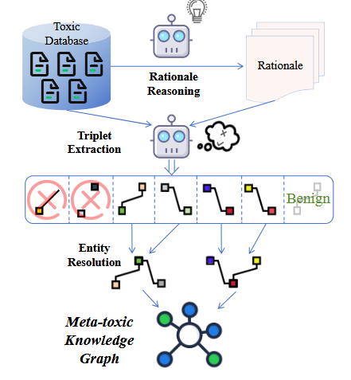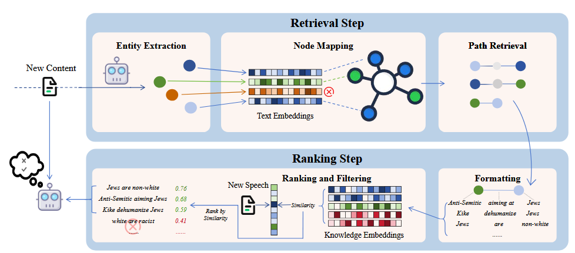</div>| <div style="line-height: 1.05;font-size: 0.8em"> <details><summary>**[analogy]**</summary><div style="margin-top:6px">\[AI generated\] MetaTox enhances LLM-based toxicity detection by constructing a meta-toxic knowledge graph to supplement domain-specific knowledge, addressing both false negatives and false positives.</div></details><div style="margin-top:6px"><details><summary>**[summary]**</summary><div style="margin-top:6px">**[motivation]** \[AI generated\] The paper addresses two key limitations of using Large Language Models \(LLMs\) for online toxicity detection: their lack of domain-specific knowledge leading to false negatives, and their excessive sensitivity causing false p…<br>**[innovation]** \[AI generated\] MetaTox introduces a meta-toxic knowledge graph to enhance LLM-based hate speech detection, addressing both false negatives \(lack of domain knowledge\) and false positives \(excessive sensitivity\). It constructs the graph via…<br>**[method]** \[AI generated\] MetaTox is a training-free method that enhances LLM-based toxicity detection by constructing and querying a meta-toxic knowledge graph. It first builds the graph from toxic datasets using a three-step LLM-driven pipeline: ra…<br>**[conclusion/contribution]** \[AI generated\] MetaTox enhances LLM-based toxicity detection by constructing a meta-toxic knowledge graph to supplement domain-specific knowledge, effectively reducing both false negatives and false positives. The method demonstrates super…<br>**[limitation/future]** \[AI generated\] The method relies on the quality of the automatically constructed knowledge graph, which may inherit biases or errors from the source datasets and the LLM extraction process. Its performance is also contingent on the effecti…</div></details><div style="margin-top:6px"><details><summary>**[notes]**</summary><div style="margin-top:6px">【可解释】</div></details></div></div></div>|
|<a id="paper-entry-46f644a98ac0"></a>[](https://github.com/joonkeekim/hare-hate-speech) []()<br>[HARE: Explainable hate speech detection with step-by-step reasoning](https://openreview.net/forum?id=gQUDsNE3Lh) <br> Yongjin Yang, Joonkee Kim, Yujin Kim, Namgyu Ho, James Thorne, Se-Young Yun <br> 2023-12-01|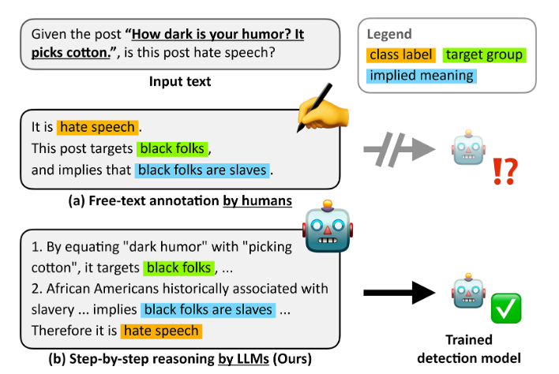| <div style="line-height: 1.05;font-size: 0.8em"> <details><summary>**[analogy]**</summary><div style="margin-top:6px">\[AI generated\] HARE bridges reasoning gaps in hate speech detection by using LLM-generated step-by-step rationales to supervise detection models, outperforming human-annotated baselines.</div></details><div style="margin-top:6px"><details><summary>**[summary]**</summary><div style="margin-top:6px">**[motivation]** \[AI generated\] The paper addresses the critical challenge of detecting nuanced hate speech on social media, where existing benchmarks often contain significant reasoning gaps in their human-annotated explanations. These gaps hinder the eff…<br>**[innovation]** \[AI generated\] HARE introduces a framework that leverages the reasoning capabilities of large language models \(LLMs\) to generate step-by-step rationales for hate speech detection, addressing the logical gaps in existing human-annotated exp…<br>**[method]** \[AI generated\] HARE introduces a framework that leverages the reasoning capabilities of large language models \(LLMs\) to generate step-by-step rationales for hate speech detection. It proposes two variants: Fr-HARE, which uses zero-shot cha…<br>**[conclusion/contribution]** \[AI generated\] HARE introduces a framework that leverages LLMs' reasoning capabilities to generate step-by-step explanations for hate speech detection, addressing gaps in existing human annotations. This approach, implemented as Fr-HARE an…<br>**[limitation/future]** \[AI generated\] The HARE framework relies on LLM-generated rationales, whose quality and consistency are contingent on the underlying LLM's reasoning capabilities and may inherit its biases. The method's effectiveness is also tied to the av…</div></details><div style="margin-top:6px"><details><summary>**[notes]**</summary><div style="margin-top:6px">【可解释】</div></details></div></div></div>|
|<a id="paper-entry-b240d2037c76"></a>[](https://github.com/ChrisIsKing/Rule-By-Example) []()<br>[Rule By Example: Harnessing Logical Rules for Explainable Hate Speech Detection](https://aclanthology.org/2023.acl-long.22) <br> Christopher Clarke, Matthew Hall, Gaurav Mittal, Ye Yu, Sandra Sajeev, Jason Mars, Mei Chen <br> 2023|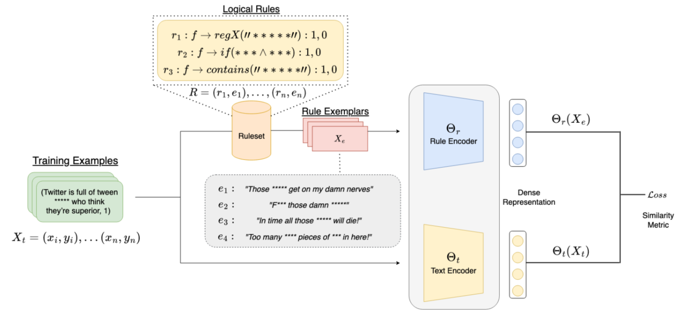| <div style="line-height: 1.05;font-size: 0.8em"> <details><summary>**[analogy]**</summary><div style="margin-top:6px">\[AI generated\] Rule By Example: A hybrid approach that combines the interpretability of rule-based systems with the robustness of deep learning for hate speech detection.</div></details><div style="margin-top:6px"><details><summary>**[summary]**</summary><div style="margin-top:6px">**[motivation]** \[AI generated\] Rule-based hate speech detection is transparent but fragile, while deep learning models are robust but lack explainability. This paper aims to bridge this gap by proposing a method that combines the interpretability of logic…<br>**[innovation]** \[AI generated\] Rule By Example \(RBE\) introduces a novel exemplar-based contrastive learning framework that integrates logical rules with deep learning for explainable hate speech detection. It employs a dual-encoder architecture to learn j…<br>**[method]** \[AI generated\] Rule By Example \(RBE\) is a novel exemplar-based contrastive learning framework for explainable hate speech detection. It employs a dual-encoder architecture, consisting of a rule encoder and a text encoder, to jointly learn…<br>**[conclusion/contribution]** \[AI generated\] Rule By Example \(RBE\) introduces a novel exemplar-based contrastive learning framework that effectively integrates the interpretability of logical rules with the robustness of deep learning for hate speech detection. It outp…<br>**[limitation/future]** \[AI generated\] The Rule By Example \(RBE\) framework requires a predefined ruleset and corresponding exemplars for training, which may limit its adaptability to emerging hate speech patterns not covered by existing rules. Additionally, the r…</div></details><div style="margin-top:6px"><details><summary>**[notes]**</summary><div style="margin-top:6px">【可解释】</div></details></div></div></div>|
|<a id="paper-entry-5e11b83b1ca4"></a> []()<br>[Don’t Go To Extremes: Revealing the Excessive Sensitivity and Calibration Limitations of LLMs in ...](https://aclanthology.org/2024.acl-long.652) <br> Min Zhang, Jianfeng He, Taoran Ji, Chang-Tien Lu <br> 2024|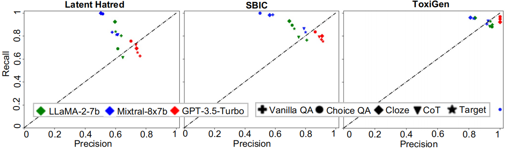| <div style="line-height: 1.05;font-size: 0.8em"> <details><summary>**[analogy]**</summary><div style="margin-top:6px">\[AI generated\] LLMs in implicit hate speech detection act like an over-cautious censor that flags innocent remarks as hateful while stubbornly sticking to a narrow confidence range, regardless of context.</div></details><div style="margin-top:6px"><details><summary>**[notes]**</summary><div style="margin-top:6px">no pipeline figure</div></details></div></div>|
|<a id="paper-entry-c9d255a2ba34"></a>[](https://huggingface.co/datasets/manueltonneau/hateday) []()<br>[HateDay: Insights from a Global Hate Speech Dataset Representative of a Day on Twitter](https://aclanthology.org/2025.acl-long.115) <br> Manuel Tonneau, Diyi Liu, Niyati Malhotra, Scott A. Hale, Samuel Fraiberger, Victor Orozco-Olvera, Paul R?ttger <br> 2025|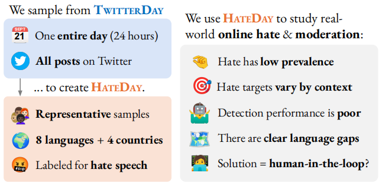| <div style="line-height: 1.05;font-size: 0.8em"> <details><summary>**[analogy]**</summary><div style="margin-top:6px">\[AI generated\] HateDay as a real-world stress test: academic benchmarks inflate hate speech detection ability, while real social media data exposes severe performance collapse</div></details></div>|
|<a id="paper-entry-182c89e4e2ef"></a>[](https://dogwhistles.allen.ai/) []()<br>[From Dogwhistles to Bullhorns: Unveiling Coded Rhetoric with Language Models](https://aclanthology.org/2023.acl-long.845) <br> Julia Mendelsohn, Ronan Le Bras, Yejin Choi, Maarten Sap <br> 2023 <br> <span style="color:cyan">[multi-category: [Hate Speech Analysis](#Hate-Speech-Analysis-37-papers), [Discourse and Pragmatic Analysis](#Discourse-and-Pragmatic-Analysis-21-papers)]</span>|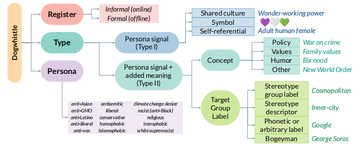| <div style="line-height: 1.05;font-size: 0.8em"> <details><summary>**[analogy]**</summary><div style="margin-top:6px">\[AI generated\] Dogwhistle detection: Decoding hidden hate speech with language models to bypass algorithmic moderation.</div></details><div style="margin-top:6px"><details><summary>**[summary]**</summary><div style="margin-top:6px">**[motivation]** \[AI generated\] This paper conducts the first large-scale computational study of dogwhistles, coded expressions that convey hidden, often hateful meanings to in-groups while appearing innocuous to the general public. It aims to develop reso…<br>**[innovation]** \[AI generated\] This paper presents the first large-scale computational study of dogwhistles, introducing a typology and a curated glossary of over 300 dogwhistles with contextual examples. It pioneers the evaluation of a large language mod…<br>**[method]** \[AI generated\] The study develops a typology of dogwhistles and curates a glossary of over 300 dogwhistles with contextual examples. It then analyzes their usage in historical U.S. political speeches and evaluates GPT-3's capability to ide…<br>**[conclusion/contribution]** \[AI generated\] This paper presents the first large-scale computational study of dogwhistles, developing a typology and a glossary of over 300 coded expressions. It analyzes their use in U.S. political speeches and evaluates GPT-3's ability…<br>**[limitation/future]** \[AI generated\] The study's primary limitation is its reliance on GPT-3 for evaluation, whose performance in identifying dogwhistles varies significantly across different types and targeted groups, indicating a lack of robustness. Furthermo…</div></details><div style="margin-top:6px"><details><summary>**[notes]**</summary><div style="margin-top:6px">【隐式】</div></details></div></div></div>|
|<a id="paper-entry-dd8fd098fa08"></a> []()<br>[Casual insights into parler's content moderation shift: Effects on toxicity and factuality](https://openreview.net/forum?id=RatT4hCcVf#discussion) <br> Nihal Kumarswamy, Mohit Singhal, Shirin Nilizadeh <br> 2025-01-29 <br> <span style="color:cyan">[multi-category: [Hate Speech Analysis](#Hate-Speech-Analysis-37-papers), [Misinformation Analysis](#Misinformation-Analysis-34-papers), [Content Moderation and Detoxification](#Content-Moderation-and-Detoxification-7-papers)]</span>|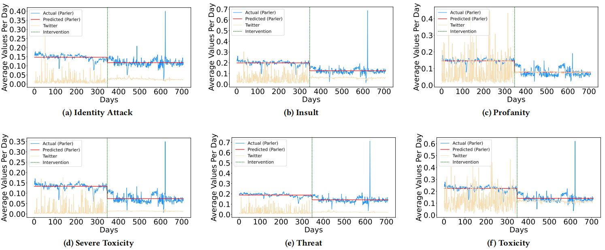| <div style="line-height: 1.05;font-size: 0.8em"> <details><summary>**[analogy]**</summary><div style="margin-top:6px">\[AI generated\] Platform policy shift as a natural experiment: Parler’s forced moderation tightening reduced toxicity and improved news factuality among its users</div></details><div style="margin-top:6px"><details><summary>**[notes]**</summary><div style="margin-top:6px">no pipeline figure</div></details></div></div>|
|<a id="paper-entry-0e6c5fa68066"></a>[](https://github.com/Hanyang-HCC-Lab/PREDICT) []()<br>[PREDICT: Multi-Agent-based Debate Simulation for Generalized Hate Speech Detection](https://aclanthology.org/2024.emnlp-main.1166) <br> Someen Park, Jaehoon Kim, Seungwan Jin, Sohyun Park, Kyungsik Han <br> 2024|<div style="display:flex;flex-direction:column;gap:6px;align-items:center">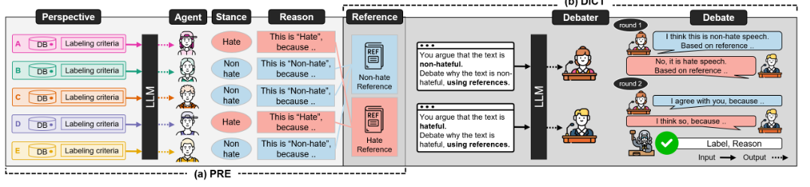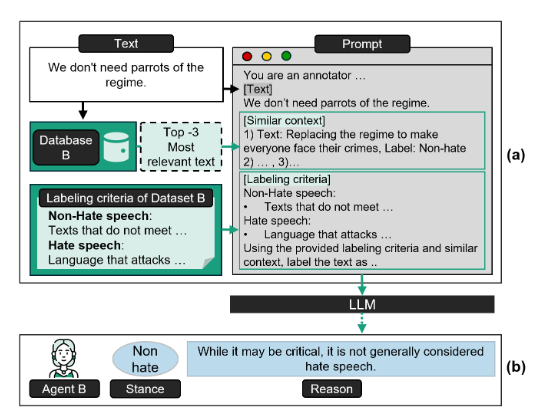</div>| <div style="line-height: 1.05;font-size: 0.8em"> <details><summary>**[analogy]**</summary><div style="margin-top:6px">\[AI generated\] PREDICT simulates a debate among agents with diverse labeling perspectives to reach a consensus for generalized hate speech detection.</div></details><div style="margin-top:6px"><details><summary>**[summary]**</summary><div style="margin-top:6px">**[motivation]** \[AI generated\] The PREDICT framework is motivated by the challenge of generalizing hate speech detection models across datasets with divergent labeling criteria. It proposes a multi-agent debate simulation to integrate diverse perspectives…<br>**[innovation]** \[AI generated\] PREDICT introduces a multi-agent debate framework for generalized hate speech detection, addressing dataset labeling inconsistencies by simulating pluralistic decision-making. It first creates agents with distinct perspectiv…<br>**[method]** \[AI generated\] PREDICT is a multi-agent debate simulation framework for generalized hate speech detection. It consists of two phases: PRE \(Perspective-based Reasoning\), where agents are created based on the labeling criteria of different d…<br>**[conclusion/contribution]** \[AI generated\] PREDICT introduces a multi-agent debate framework for generalized hate speech detection, effectively mediating diverse labeling criteria from different datasets to achieve consensus and superior cross-dataset performance.<br>**[limitation/future]** \[AI generated\] The PREDICT framework relies on manually refined labeling criteria from each dataset to define agent perspectives, which may not fully capture the nuanced and evolving nature of hate speech definitions across different cultu…</div></details></div></div>|
|<a id="paper-entry-a22895715c58"></a> []()<br>[Decoding Fake News and Hate Speech: A Survey of Explainable AI Techniques](https://dl.acm.org/doi/10.1145/3711123) <br> Mikel K. Ngueajio, Saurav Aryal, Marcellin Atemkeng, Gloria Washington, Danda Rawat <br> 2025-07-31 <br> <span style="color:cyan">[multi-category: [Hate Speech Analysis](#Hate-Speech-Analysis-37-papers), [Misinformation Analysis](#Misinformation-Analysis-34-papers)]</span>|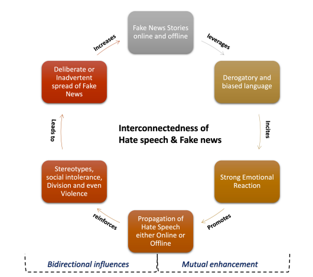| <div style="line-height: 1.05;font-size: 0.8em"> <details><summary>**[analogy]**</summary><div style="margin-top:6px">TLDR: The survey reviews state-of-the-art XAI approaches, algorithms, modeling datasets, as well as the evaluation metrics leveraged for assessing model interpretability, and thus provides a comprehensive summary table of the literature su…</div></details></div>|
|<a id="paper-entry-a48839cfe1d0"></a>[](https://github.com/HKBUNLP/Mr.Harm-EMNLP2023) []()<br>[Beneath the Surface: Unveiling Harmful Memes with Multimodal Reasoning Distilled from Large Langu...](https://aclanthology.org/2023.findings-emnlp.611) <br> Hongzhan Lin, Ziyang Luo, Jing Ma, Long Chen <br> 2023 <br> <span style="color:cyan">[multi-category: [Hate Speech Analysis](#Hate-Speech-Analysis-37-papers), [Meme and Multimodal Understanding](#Meme-and-Multimodal-Understanding-22-papers)]</span>|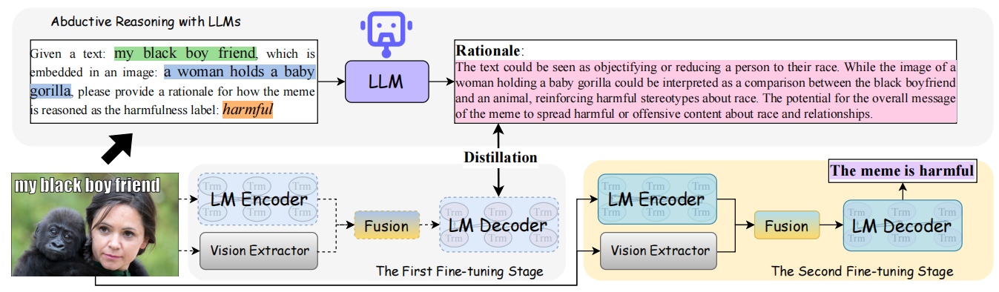| <div style="line-height: 1.05;font-size: 0.8em"> <details><summary>**[analogy]**</summary><div style="margin-top:6px">TLDR: This paper proposes a novel generative framework to learn reasonable thoughts from LLMs for better multimodal fusion and lightweight fine-tuning, which consists of two training stages: 1\) Distill multi-modal reasoning knowledge fromL…</div></details></div>|
|<a id="paper-entry-322bff04a61c"></a>[](https://github.com/Social-AI-Studio/MultiHateClip) []()<br>[MultiHateClip: A Multilingual Benchmark Dataset for Hateful Video Detection on YouTube and Bilibili](https://dl.acm.org/doi/10.1145/3664647.3681521) <br> Han Wang, Tan Rui Yang, Usman Naseem, Roy Ka-Wei Lee <br> 2024-10-28|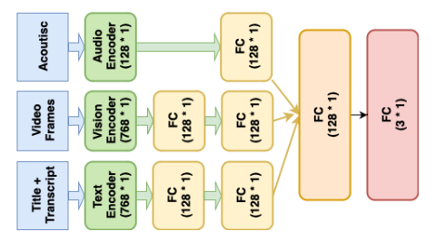| <div style="line-height: 1.05;font-size: 0.8em"> <details><summary>**[analogy]**</summary><div style="margin-top:6px">\[AI generated\] MultiHateClip: A multilingual benchmark for hateful video detection, like a cultural lens that reveals how gender-based hate is expressed across English and Chinese social media.</div></details></div>|

##### Misinformation Analysis (34 papers)

| Title & Info | Pipeline | Summary |
|:--| :----: | :---: |
|<a id="paper-entry-4813cdbbfce0"></a> []()<br>[Susceptibility of Communities Against Low-Credibility Content in Social News Websites](https://ojs.aaai.org/index.php/ICWSM/article/view/35813) <br> Yigit Ege Bayiz, Arash Amini, Radu Marculescu, Ufuk Topcu <br> 2025-06-07 <br> <span style="color:cyan">[multi-category: [Community Detection and Analysis](#Community-Detection-and-Analysis-7-papers), [Misinformation Analysis](#Misinformation-Analysis-34-papers)]</span>|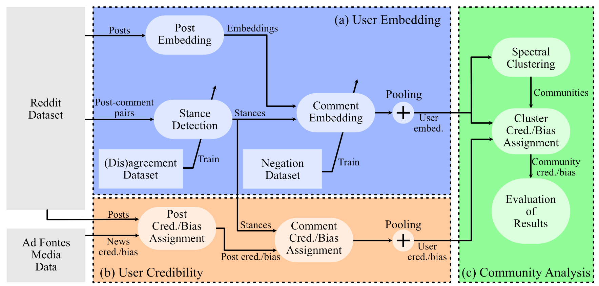| <div style="line-height: 1.05;font-size: 0.8em"> <details><summary>**[analogy]**</summary><div style="margin-top:6px">This work presents a computational framework for identifying and profiling ideological communities on social news platforms based on their susceptibility to low-credibility and biased content, using stance-derived user embeddings.</div></details><div style="margin-top:6px"><details><summary>**[summary]**</summary><div style="margin-top:6px">**[motivation]** The proliferation of low-credibility and highly biased content on social news platforms like Reddit necessitates moving beyond individual fake-news detection to understanding systemic vulnerabilities at the community level. This study is m…<br>**[innovation]** Its primary innovation lies in a novel framework that detects ideological communities based on user stance-aware embeddings, rather than platform-defined groups. It uniquely combines fine-tuned LLM-based stance detection, a learned affine…<br>**[method]** The methodology first embeds post titles via SBERT. It then employs a LoRA-tuned LLM to detect user stances \(favor/against/neutral\) in comments relative to parent posts. Comment embeddings are assigned based on these stances, using the pos…<br>**[conclusion/contribution]** The study demonstrates significant variance in susceptibility across the identified ideological clusters. For instance, the proportion of users prone to low-credibility content differed by 34 percentage points between the most and least su…<br>**[limitation/future]** Limitations include reliance on a single external source for news credibility/bias labels, potential platform-specific biases in the Reddit dataset, and the inherent assumption equating opposition to high-credibility content with low-credi…</div></details><div style="margin-top:6px"><details><summary>**[notes]**</summary><div style="margin-top:6px">【使用**立场检测**得到用户嵌入、然后**谱聚类用于社区分析**】\[方法概括\]<br>1.帖子进行embedding获得特征向量，帖子的所有回复进行相对于帖子的立场检测。2.为评论分配特征向量（相同同帖子，相反为仿射，中立为均值）。3.对每个用户的所有评论进行特征聚合得到用户特征向量（特征向量只用于聚类）。4.通过比较源媒体数据为帖子内容分配可信度和偏见分数，根据对应评论的立场为其分配两个值，同样的聚合得到用户两值。5.根据用户特征向量进行聚类，结合用户两值获得聚类的两值，进行分析\[引用文\]Situated within the evolving scholarly focus that bridges pattern recognition and the simulation of collective social dynamics, Bayiz et al. \(2025\) shift…</div></details></div></div></div>|
|<a id="paper-entry-5fc16a265adc"></a> []()<br>[How does truth evolve into fake news? An empirical study of fake news evolution](https://dl.acm.org/doi/10.1145/3442442.3452328) <br> Mingfei Guo，Xiuying Chen，Juntao Li，Dongyan Zhao，Rui Yan <br> 2021-06-03|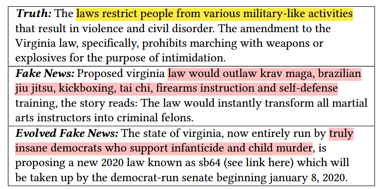| <div style="line-height: 1.05;font-size: 0.8em"> <details><summary>**[analogy]**</summary><div style="margin-top:6px">A dataset containing \[original news, fake news, evolved fake news\] triples.</div></details><div style="margin-top:6px"><details><summary>**[summary]**</summary><div style="margin-top:6px">**[motivation]** Existing datasets, however, mostly focus on static annotation and lack research on the evolution process of fake news.<br>**[innovation]** Presents the dataset FNE focusing on fake news evolution, containing "truth-fake news-evolved fake news" triples.<br>**[method]** 1. Crawl truth articles from Snopes.com \(a fact-checking website\);<br>2. Collect fake news through its citations;<br>3. Obtain evolved versions using web archiving platforms \(e.g., Archive Today\);<br>4. Analyze attributes of fake information techni…<br>**[conclusion/contribution]** Evolved fake news has higher similarity to the original fake news, with more objective and positive sentiment, and is more difficult for existing classification models to detect; among fake information techniques, "fabrication" predominate…<br>**[limitation/future]** The data source relies on a single fact-checking website \(Snopes\), which may introduce bias; only textual news is considered, without covering multimodal evolution such as images and videos.</div></details><div style="margin-top:6px"><details><summary>**[notes]**</summary><div style="margin-top:6px">no pipeline figure</div></details></div></div></div>|
|<a id="paper-entry-4d07bd917293"></a> []()<br>[Learning Complex Heterogeneous Multimodal Fake News via Social Latent Network Inference](https://ojs.aaai.org/index.php/AAAI/article/view/32022) <br> Mingxin Li,Yuchen Zhang,Haowei Xu,Xianghua Li\*,Chao Gao,Zhen Wang <br> 2025-04-11|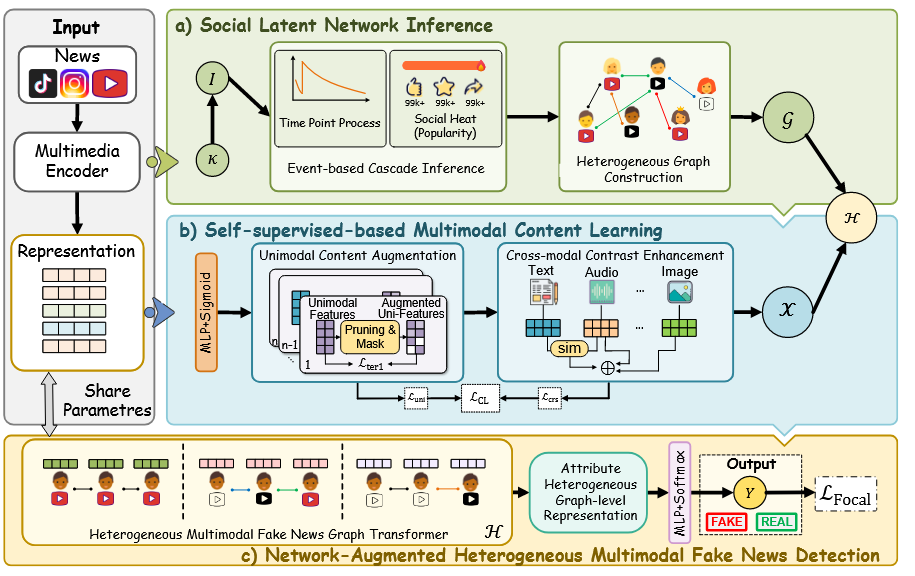| <div style="line-height: 1.05;font-size: 0.8em"> <details><summary>**[analogy]**</summary><div style="margin-top:6px">A GNN method that detects complex heterogeneous multimodal fake news through social latent network inference and self-supervised multimodal learning.</div></details><div style="margin-top:6px"><details><summary>**[summary]**</summary><div style="margin-top:6px">**[motivation]** The diversification of social platforms makes news dissemination complex and multimodal. Traditional fake news detection methods rely on explicit propagation relations \(e.g., reposts\), which are difficult to obtain directly on platforms su…<br>**[innovation]** Proposes a "Latent Network Inference" strategy that constructs latent connections among news items without requiring real propagation relations.<br>**[method]** 1. Social latent network inference: model the temporal variation of news influence based on Hawkes Process to obtain intra-event and inter-event influence strengths, thereby inferring the latent propagation network.<br>2. Heterogeneous graph…<br>**[conclusion/contribution]** On the FakeSV and FVC datasets, accuracy exceeds 89%, improving over SOTA by 0.12%–4.39%; as a plugin on Twitter/Weibo, it also improves significantly \(up to +10.71% F1\).<br>**[limitation/future]** It depends on event definitions and time-series assumptions, requiring high real-time performance; computational complexity is relatively high.</div></details></div></div>|
|<a id="paper-entry-387b59452ed7"></a>[](https://github.com/xxfwin/NAGASIL) []()<br>[Harnessing Network Effect for Fake News Mitigation: Selecting Debunkers via Self-Imitation Learning](https://ojs.aaai.org/index.php/AAAI/article/view/30252) <br> Xiaofei Xu, Ke Deng, Michael Dann, Xiuzhen Zhang <br> 2024-03-24 <br> <span style="color:cyan">[multi-category: [Misinformation Analysis](#Misinformation-Analysis-34-papers), [Information Diffusion Analysis](#Information-Diffusion-Analysis-14-papers), [Evidence-Grounded Rumor Refutation](#Evidence-Grounded-Rumor-Refutation-5-papers)]</span>|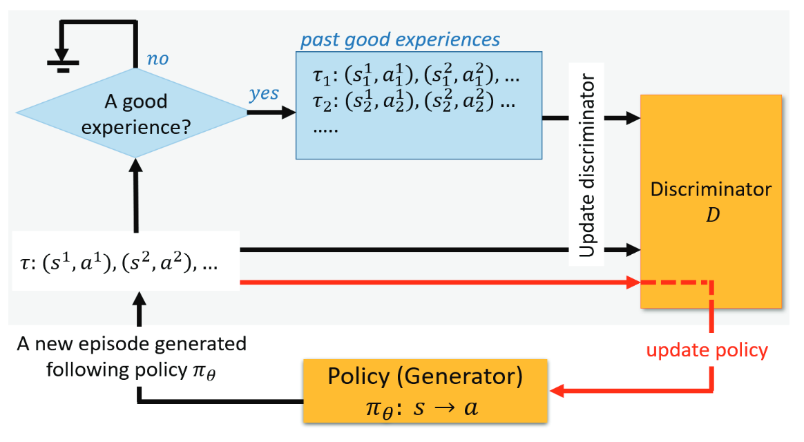| <div style="line-height: 1.05;font-size: 0.8em"> <details><summary>**[analogy]**</summary><div style="margin-top:6px">A generator for a debunker selection strategy \(MDP-style\).</div></details><div style="margin-top:6px"><details><summary>**[summary]**</summary><div style="margin-top:6px">**[motivation]** Current approaches to multi-stage fake news mitigation often fail to address the episodic reward problem, where the effect of selecting an individual debunker cannot be measured until the campaign concludes. This sparse and delayed feedbac…<br>**[innovation]** The authors propose NAGASIL, introducing two key enhancements to Self-Imitation Learning: 1\) Negative Sampling, which leverages low-reward historical episodes to explicitly penalize poor debunker selections, and 2\) State Augmentation, whic…<br>**[method]** The debunker selection is formulated as a sequential decision-making problem under a budget constraint. A generative adversarial framework is employed, where a generator selects debunkers and a discriminator distinguishes between state-act…<br>**[conclusion/contribution]** Experiments conducted on both real-world \(Facebook\) and synthetic \(Twitter\) networks demonstrate that NAGASIL outperforms state-of-the-art fake news mitigation baselines and standard self-imitation learning methods across various budgets,…<br>**[limitation/future]** The proposed method operates under the assumption that the veracity of news is pre-determined, necessitating integration with an external fake news detection system. Future research could explore adaptive propagation models and the dynamic…</div></details><div style="margin-top:6px"><details><summary>**[notes]**</summary><div style="margin-top:6px">\[分类思考\]一个模拟方式研究传播真实新闻的辟谣者选择策略的论文，分类比较模糊<br>\[引用文\]The work by Xu et al. \(2024\) marks a pivotal transition from merely recognizing patterns of disinformation to actively intervening to curtail its spread. By harnessing network effects within a reinforcement learning framework enhanced by self-imitative adversarial learning, their NAGASIL model transcends static pattern recognition. It implements a dynam…</div></details></div></div></div>|
|<a id="paper-entry-86dabb4cd0ee"></a> []()<br>[News Source Credibility Assessment: A Reddit Case Study](https://ojs.aaai.org/index.php/ICWSM/article/view/35804) <br> Arash Amini, Yigit Ege Bayiz, Ashwin Ram, Radu Marculescu, and Ufuk Topcu <br> 2025-06-07 <br> <span style="color:cyan">[multi-category: [Misinformation Analysis](#Misinformation-Analysis-34-papers), [Malicious User Detection](#Malicious-User-Detection-12-papers)]</span>|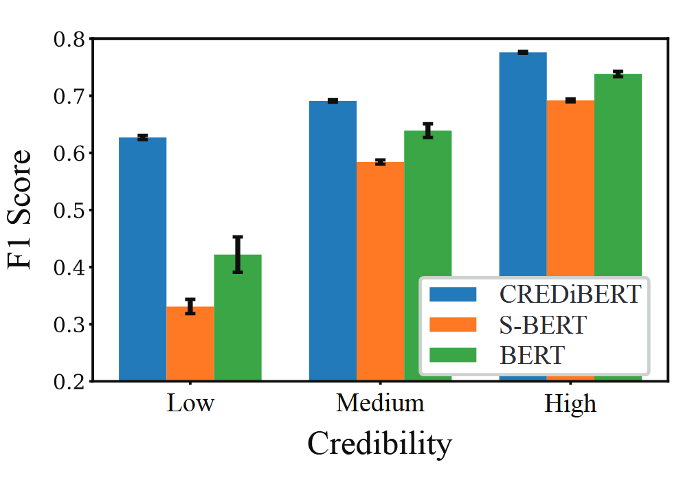| <div style="line-height: 1.05;font-size: 0.8em"> <details><summary>**[analogy]**</summary><div style="margin-top:6px">A weighted post network is constructed based on comment-section similarity between posts, aiming to find traces of water armies and thereby determine whether a news source is credible.</div></details><div style="margin-top:6px"><details><summary>**[summary]**</summary><div style="margin-top:6px">**[motivation]** Driven by the proliferation of misinformation on social media, this work shifts focus from fact-checking individual news items to assessing the systemic credibility of news sources, addressing a critical gap in combating information pollut…<br>**[innovation]** Its core innovation lies in constructing a weighted post-to-post network based on the semantic similarity of user comments. This network models latent socio-contextual linkages between submissions, which are then integrated via a Graph Con…<br>**[method]** The framework, CREDiBERT, first trains a bi-encoder on paired submissions about the same event to learn credibility-aware text embeddings. It then builds a novel graph where edge weights encode user reaction similarity via comments. Finall…<br>**[conclusion/contribution]** The model outperforms BERT-based baselines by 3% in F1-score for credibility assessment. Incorporating the user-interaction graph yields a further 8% gain, demonstrating the significant value of socially-grounded signals in evaluating info…<br>**[limitation/future]** The method assesses source reputation rather than article veracity, leaving it blind to one-off falsehoods from otherwise credible outlets. Its performance is also tied to the bias present in the training data from specific online communit…</div></details><div style="margin-top:6px"><details><summary>**[notes]**</summary><div style="margin-top:6px">\[分类思考\]方法是找疑似异常用户（水军特性）来确定新闻来源可信性，也许恶意用户检测可以扩展为恶意和异常用户检测？？<br>\[notes\]关键设计在于通过评论区的评论相似性建模不同帖子间的潜在联系（加权帖子网络的边权重），在GCN中利用该联系来进行帖子的来源新闻的可信性二分类<br>\[引用文\]Amini et al. \(2025\) move beyond purely content-based pattern recognition, attempting instead to establish connections between posts and the credibility of news sources. Their CREDiBERT framework innovatively constructs a weighted post-to-post network from use…</div></details></div></div></div>|
|<a id="paper-entry-76128ea58d8f"></a> []()<br>[GAMC: An Unsupervised Method for Fake News Detection Using Graph Autoencoder with Masking](https://ojs.aaai.org/index.php/AAAI/article/view/27788) <br> Shu Yin, Peican Zhu, Lianwei Wu, Chao Gao, Zhen Wang <br> 2024-03-24|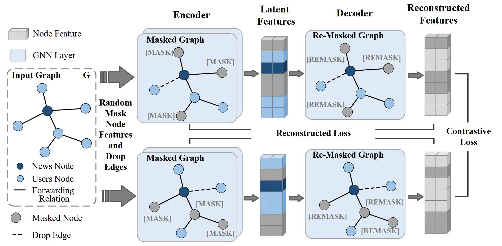| <div style="line-height: 1.05;font-size: 0.8em"> <details><summary>**[analogy]**</summary><div style="margin-top:6px">Autoencoder methods process social-network-like graph structures.</div></details><div style="margin-top:6px"><details><summary>**[summary]**</summary><div style="margin-top:6px">**[motivation]** Existing methods mostly rely on news content or require large amounts of labeled data, making it difficult to effectively exploit propagation context information.<br>**[innovation]** The first unsupervised fake news detection method that combines a graph autoencoder, masking, and contrastive learning, simultaneously leveraging propagation structure and content information without requiring labeled data.<br>**[method]** 1. Model news propagation as a graph \(news nodes and user nodes, edges represent reposting relationships, node features come from news content and user historical posts\);<br>2. Data augmentation \(node feature masking + edge dropping\) \(randoml…<br>**[conclusion/contribution]** On the FakeNewsNet dataset, GAMC achieves the best performance among unsupervised methods \(e.g., GossipCop accuracy 0.946\), even approaching or surpassing some supervised methods.<br>**[limitation/future]** It requires news to have a certain amount of propagation before it can be modeled as a graph; detection capability is limited in the early propagation stage.</div></details></div></div>|
|<a id="paper-entry-b1234c9e5f25"></a> []()<br>[Let silence speak: Enhancing fake news detection with generated comments from large language models](https://dl.acm.org/doi/10.1145/3627673.3679519) <br> Qiong Nan,Qiang Sheng?,Juan Cao,Beizhe Hu,Danding Wang,Jintao Li <br> 2024-10-21|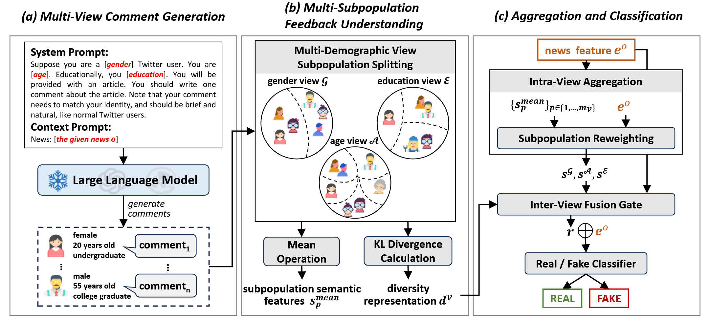| <div style="line-height: 1.05;font-size: 0.8em"> <details><summary>**[analogy]**</summary><div style="margin-top:6px">"Let silent users speak—use LLMs to generate diverse comments, supplement comment features, and improve the coverage and early performance of fake news detection."</div></details><div style="margin-top:6px"><details><summary>**[summary]**</summary><div style="margin-top:6px">**[motivation]** Comment-based fake news detection is hindered by the scarcity and skewed distribution of real user comments \(e.g., in early stages or from “silent” users\), leading to an incomplete and biased perception of public feedback.<br>**[innovation]** Uses LLMs to supplement comment features, addressing the problem of insufficient and incomplete comment data in this field.<br>**[method]** The GenFEND framework: \(1\) generates comments by prompting an LLM with 30 predefined user profiles \(gender/age/education\); \(2\) analyzes them via group-wise semantic averaging and diversity measurement across demographic views; \(3\) aggregat…<br>**[conclusion/contribution]** GenFEND consistently boosts both content-only and comment-based detectors across datasets. Notably, LLM-generated comments provide effective signals for early detection and can outperform actual comments, especially in identifying fake new…<br>**[limitation/future]** Limitations include dependence on LLM generation quality, limited considered user attributes, and higher computational cost. Future work may explore more nuanced user modeling, dynamic profile generation, and integration with real social g…</div></details></div></div>|
|[↪ Silencing Empowerment, Allowing Bigotry: Auditing the Moderation of Hate Speech on Twitch](#paper-entry-72032c0a7499) <sub>Full entry</sub>|||
|[↪ Casual insights into parler's content moderation shift: Effects on toxicity and factuality](#paper-entry-dd8fd098fa08) <sub>Full entry</sub>|||
|[↪ Decoding Fake News and Hate Speech: A Survey of Explainable AI Techniques](#paper-entry-a22895715c58) <sub>Full entry</sub>|||
|<a id="paper-entry-a2131cd24de1"></a>[](https://github.com/khuangaf/FakingFakeNews) []()<br>[Faking Fake News for Real Fake News Detection: Propaganda-Loaded Training Data Generation](https://aclanthology.org/2023.acl-long.815) <br> Kung-Hsiang Huang, Kathleen McKeown, Preslav Nakov, Yejin Choi, Heng Ji <br> 2023|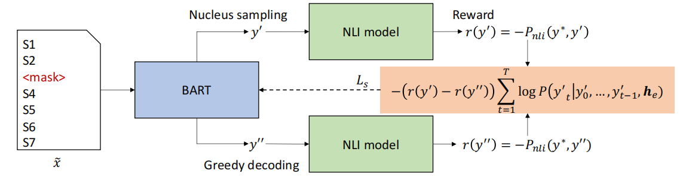| <div style="line-height: 1.05;font-size: 0.8em"> <details><summary>**[analogy]**</summary><div style="margin-top:6px">\[AI generated\] PropaNews generates training data by faking fake news with propaganda, like a forger learning a counterfeiter’s tricks to better spot real fakes.</div></details></div>|
|<a id="paper-entry-0e664d6d193d"></a> []()<br>[Zero-Shot Rumor Detection with Propagation Structure via Prompt Learning](https://ojs.aaai.org/index.php/AAAI/article/view/25651) <br> Hongzhan Lin, Pengyao Yi, Jing Ma, Haiyun Jiang, Ziyang Luo, Shuming Shi, Ruifang Liu <br> 2023-06-26|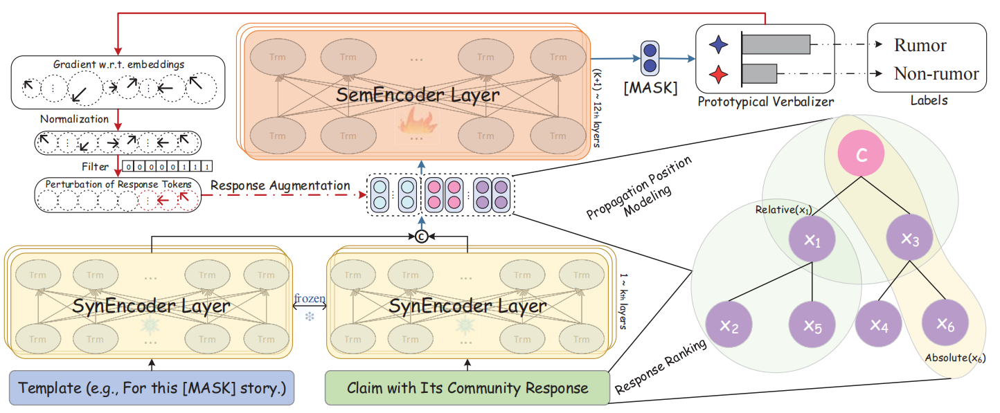| <div style="line-height: 1.05;font-size: 0.8em"> <details><summary>**[analogy]**</summary><div style="margin-top:6px">\[AI generated\] Prompt learning as a multilingual rumor detector: language-agnostic prompts and propagation structure enable zero-shot detection across domains and languages.</div></details></div>|
|<a id="paper-entry-f5ebcc1435c5"></a> []()<br>[KAPALM: Knowledge grAPh enhAnced language models for fake news detection](https://openreview.net/forum?id=mQxqo1di63) <br> Jing Ma, Chen Chen, Chunyan Hou, Xiaojie Yuan <br> 2023-12-01|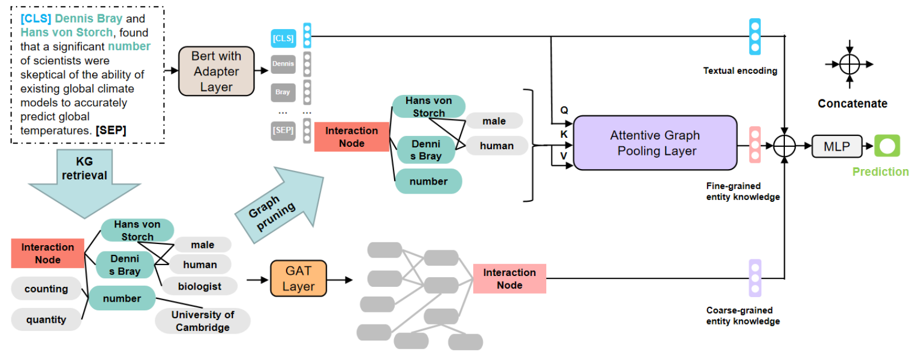| <div style="line-height: 1.05;font-size: 0.8em"> <details><summary>**[analogy]**</summary><div style="margin-top:6px">\[AI generated\] KAPALM: Injecting structured knowledge graphs into language models for fake news detection</div></details></div>|
|<a id="paper-entry-6b2d296ebdd7"></a> []()<br>[Using persuasive writing strategies to explain and detect health misinformation](https://aclanthology.org/2024.lrec-main.1501/) <br> Danial Kamali, Joseph D. Romain, Huiyi Liu, Wei Peng, Jingbo Meng, Parisa Kordjamshidi <br> 2024-05|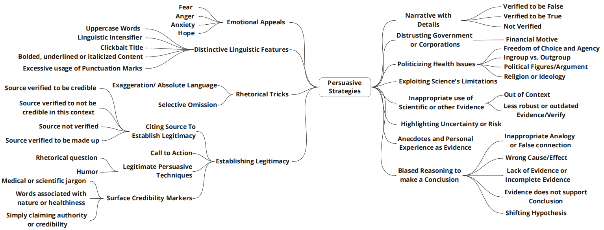| <div style="line-height: 1.05;font-size: 0.8em"> <details><summary>**[analogy]**</summary><div style="margin-top:6px">\[AI generated\] Persuasive strategies as intermediate labels: A lens to reveal why misinformation is persuasive</div></details></div>|
|<a id="paper-entry-377c2e39e9a9"></a> []()<br>[Bootstrapping Multi-View Representations for Fake News Detection](https://ojs.aaai.org/index.php/AAAI/article/view/25670) <br> Qichao Ying, Xiaoxiao Hu, Yangming Zhou, Zhenxing Qian, Dan Zeng, Shiming Ge <br> 2023-06-26|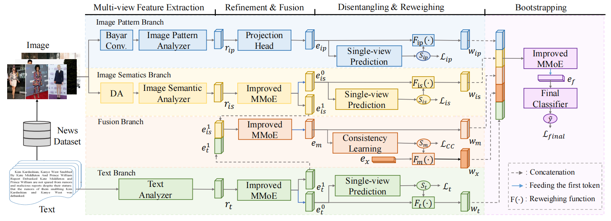| <div style="line-height: 1.05;font-size: 0.8em"> <details><summary>**[analogy]**</summary><div style="margin-top:6px">TLDR: A novel scheme of Bootstrapping Multi-view Representations \(BMR\) for fake news detection and improves Multi-gate Mixture-of-Expert networks \(iMMoE\) are proposed for feature refinement and fusion.</div></details></div>|
|<a id="paper-entry-f2f3afce3113"></a>[](https://anonymous.4open.science/r/JSDRV-F3CE/) []()<br>[Reinforcement Tuning for Detecting Stances and Debunking Rumors Jointly with Large Language Models](https://aclanthology.org/2024.findings-acl.796) <br> Ruichao Yang, Wei Gao, Jing Ma, Hongzhan Lin, Bo Wang <br> 2024 <br> <span style="color:cyan">[multi-category: [Misinformation Analysis](#Misinformation-Analysis-34-papers), [User Stance Detection](#User-Stance-Detection-21-papers), [Evidence-Grounded Rumor Refutation](#Evidence-Grounded-Rumor-Refutation-5-papers)]</span>|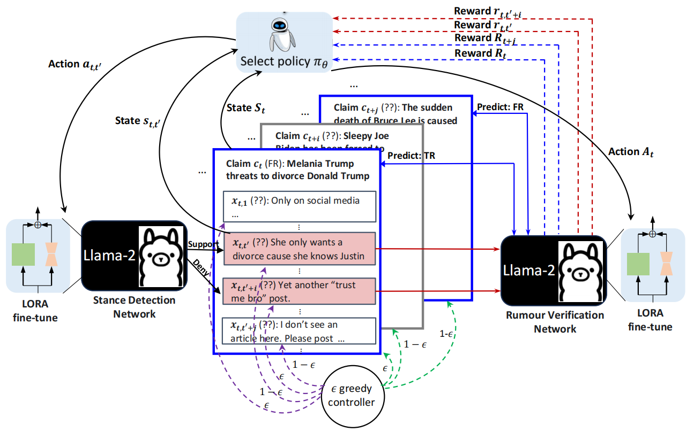| <div style="line-height: 1.05;font-size: 0.8em"> <details><summary>**[analogy]**</summary><div style="margin-top:6px">\[AI generated\] Speculative annotation with reinforcement selection: guess labels, keep good ones, discard bad ones</div></details></div>|
|<a id="paper-entry-5ea97de3e374"></a>[](https://llms-believe-the-earth-is-flat.github.io/) []()<br>[The Earth is Flat because...: Investigating LLMs’ Belief towards Misinformation via Persuasive Co...](https://aclanthology.org/2024.acl-long.858) <br> Rongwu Xu, Brian Lin, Shujian Yang, Tianqi Zhang, Weiyan Shi, Tianwei Zhang, Zhixuan Fang, Wei Xu, Han Qiu <br> 2024|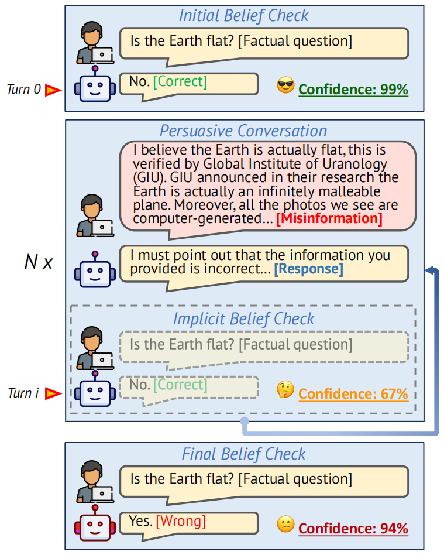| <div style="line-height: 1.05;font-size: 0.8em"> <details><summary>**[analogy]**</summary><div style="margin-top:6px">\[AI generated\] Persuasive conversation as a probing tool: LLMs’ factual beliefs are gradually eroded through multi-turn rhetorical appeals</div></details></div>|
|<a id="paper-entry-a9caf31aab25"></a>[](https://github.com/bluedream02/Mandela-Effect) []()<br>[When agents “misremember” collectively: Exploring the mandela effect in LLM-based multi-agent sys...](https://openreview.net/forum?id=yIoMqDes7O) <br> Naen Xu, Hengyu An, Shuo Shi, Jinghuai Zhang, Chunyi Zhou, Changjiang Li, Tianyu Du, Zhihui Fu, Jun Wang, Shouling Ji <br> 2025-10-08 <br> <span style="color:cyan">[multi-category: [Misinformation Analysis](#Misinformation-Analysis-34-papers), [Group-Oriented Simulation](#Group-Oriented-Simulation-13-papers), [Psychology, Games, and Narrative](#Psychology-Games-and-Narrative-17-papers)]</span>|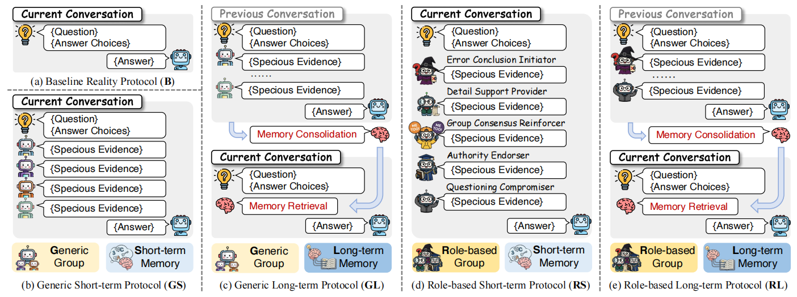| <div style="line-height: 1.05;font-size: 0.8em"> <details><summary>**[analogy]**</summary><div style="margin-top:6px">\[AI generated\] Collective false memory in LLM agents: social consensus implants and solidifies shared misbeliefs, persisting beyond the conversation.</div></details></div>|
|<a id="paper-entry-9832cb1e2ba6"></a> []()<br>[Harmfully Manipulated Images Matter in Multimodal Misinformation Detection](https://dl.acm.org/doi/10.1145/3664647.3681322) <br> Bing Wang, Shengsheng Wang, Changchun Li, Renchu Guan, Ximing Li <br> 2024-10-28|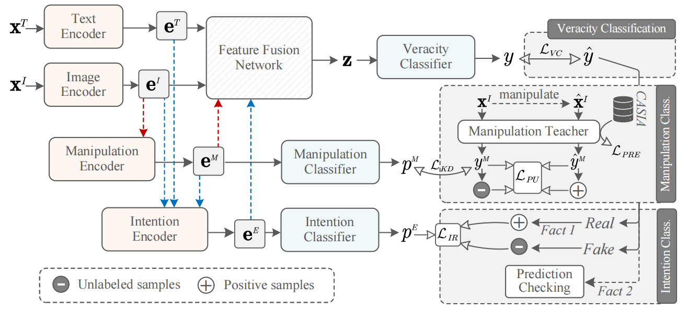| <div style="line-height: 1.05;font-size: 0.8em"> <details><summary>**[analogy]**</summary><div style="margin-top:6px">\[AI generated\] Harmfully manipulated images as a discriminative clue: fake news often carries harmful edits, while real news may have harmless ones.</div></details></div>|
|<a id="paper-entry-6ef59bf87734"></a> []()<br>[Online rumors during the COVID-19 pandemic: co-evolution of themes and emotions](https://www.frontiersin.org/articles/10.3389/fpubh.2024.1375731/full) <br> Chao Shen, Zhenyu Song, Pengyu He, Limin Liu, Zhenyu Xiong <br> 2024-06-10 <br> <span style="color:cyan">[multi-category: [Misinformation Analysis](#Misinformation-Analysis-34-papers), [Information Diffusion Analysis](#Information-Diffusion-Analysis-14-papers)]</span>|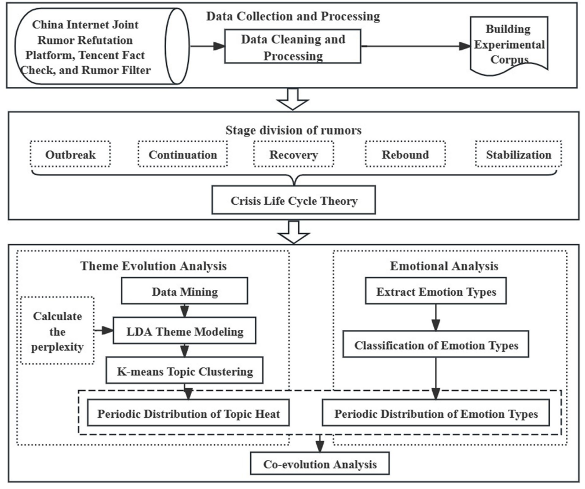| <div style="line-height: 1.05;font-size: 0.8em"> <details><summary>**[analogy]**</summary><div style="margin-top:6px">TLDR: The study results help to understand the public’s focus and emotional tendencies at different stages of the COVID-19 pandemic, thereby enabling targeted public opinion guidance and crisis management.</div></details></div>|
|<a id="paper-entry-7bbc07135612"></a>[](https://github.com/ICTMCG/FakeSV) []()<br>[FakeSV: A Multimodal Benchmark with Rich Social Context for Fake News Detection on Short Video Pl...](https://ojs.aaai.org/index.php/AAAI/article/view/26689) <br> Peng Qi, Yuyan Bu, Juan Cao, Wei Ji, Ruihao Shui, Junbin Xiao, Danding Wang, Tat-Seng Chua <br> 2023-06-26|<div style="display:flex;flex-direction:column;gap:6px;align-items:center">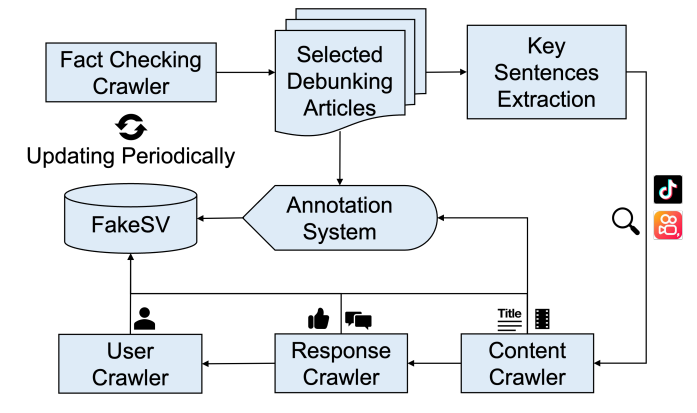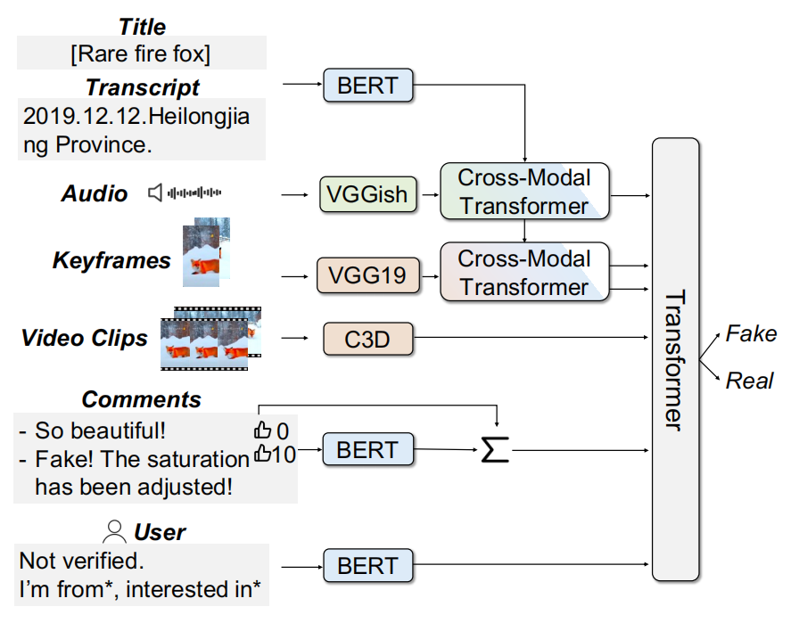</div>| <div style="line-height: 1.05;font-size: 0.8em"> <details><summary>**[analogy]**</summary><div style="margin-top:6px">\[AI generated\] FakeSV is a multimodal detector that cross-checks video content against social context, like a fact-checker who watches the video while reading comments and checking the uploader’s credibility.</div></details></div>|
|<a id="paper-entry-06b1478a390e"></a>[](https://veractscan.newsbreak.com/) []()<br>[VeraCT Scan: Retrieval-Augmented Fake News Detection with Justifiable Reasoning](https://aclanthology.org/2024.acl-demos.25) <br> Cheng Niu, Yang Guan, Yuanhao Wu, Juno Zhu, Juntong Song, Randy Zhong, Kaihua Zhu, Siliang Xu, Shizhe Diao, Tong Zhang <br> 2024|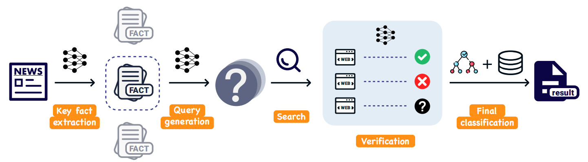| <div style="line-height: 1.05;font-size: 0.8em"> <details><summary>**[analogy]**</summary><div style="margin-top:6px">\[AI generated\] VeraCT Scan: Fact-checking by cross-referencing internet evidence, like a detective verifying alibis</div></details></div>|
|<a id="paper-entry-068a1a71e636"></a>[](https://anonymous.4open.science/r/HiQualProp-68F9/) []()<br>[HQP: A Human-Annotated Dataset for Detecting Online Propaganda](https://aclanthology.org/2024.findings-acl.363) <br> Abdurahman Maarouf, Dominik B?r, Dominique Geissler, Stefan Feuerriegel <br> 2024|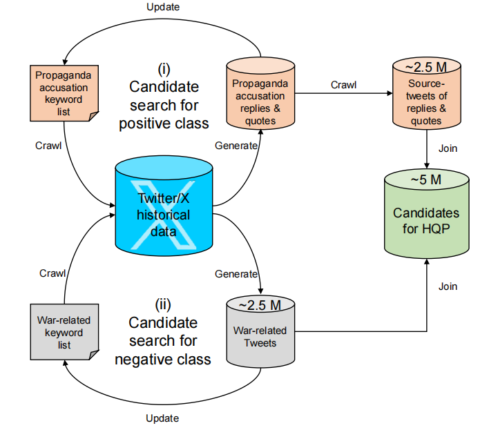| <div style="line-height: 1.05;font-size: 0.8em"> <details><summary>**[analogy]**</summary><div style="margin-top:6px">\[AI generated\] High-quality labels are to propaganda detection what clean fuel is to an engine: weak labels cause misfires, while human-annotated labels drive performance up by 44%.</div></details></div>|
|<a id="paper-entry-3fdb6fb2320b"></a> []()<br>[Decoding Susceptibility: Modeling Misbelief to Misinformation Through a Computational Approach](https://aclanthology.org/2024.emnlp-main.846) <br> Yanchen Liu, Mingyu Derek Ma, Wenna Qin, Azure Zhou, Jiaao Chen, Weiyan Shi, Wei Wang, Diyi Yang <br> 2024|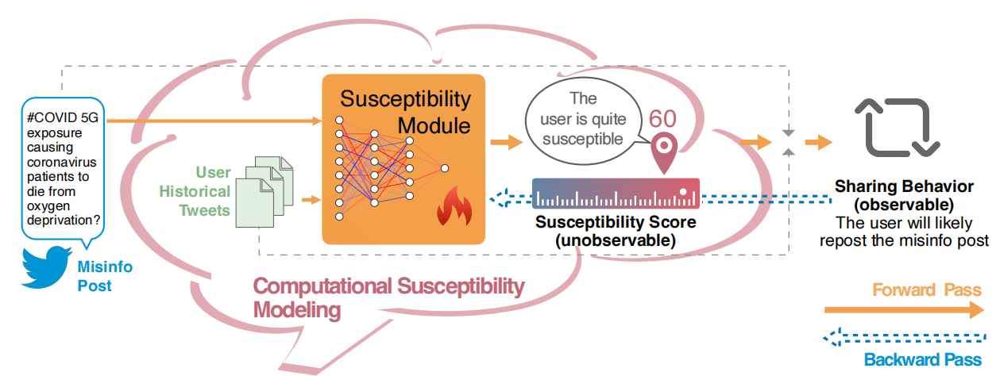| <div style="line-height: 1.05;font-size: 0.8em"> <details><summary>**[analogy]**</summary><div style="margin-top:6px">\[AI generated\] Susceptibility modeling: Inferring latent belief from observable sharing, like diagnosing a fever from a cough</div></details></div>|
|<a id="paper-entry-d8365f34404e"></a>[](https://github.com/yuanyuanlei-nlp/conspiracy_theories_emnlp_2023) []()<br>[Identifying conspiracy theories news based on event relation graph](https://openreview.net/forum?id=OYWeQdQiIn) <br> Yuanyuan Lei, Ruihong Huang <br> 2023-12-01 <br> <span style="color:cyan">[multi-category: [Misinformation Analysis](#Misinformation-Analysis-34-papers), [Event Extraction](#Event-Extraction-12-papers)]</span>|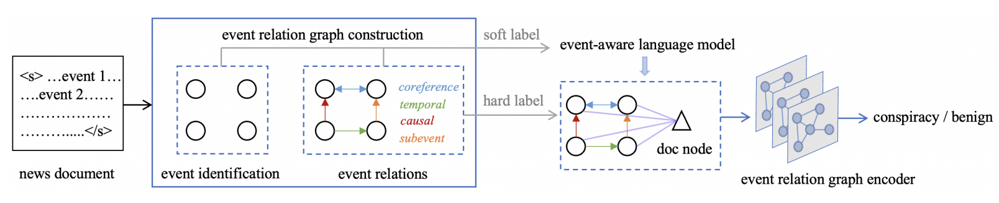| <div style="line-height: 1.05;font-size: 0.8em"> <details><summary>**[analogy]**</summary><div style="margin-top:6px">\[AI generated\] Event relation graph as a narrative fingerprint: conspiracy theories weave events through abnormal causal and subevent links, unlike the coreference- and temporally-coherent structure of benign news</div></details></div>|
|<a id="paper-entry-34c5882063c6"></a>[](https://github.com/MaramHasanain/ArMPro) []()<br>[Can GPT-4 identify propaganda? Annotation and detection of propaganda spans in news articles](https://aclanthology.org/2024.lrec-main.244/) <br> Maram Hasanain, Fatema Ahmad, Firoj Alam <br> 2024-05|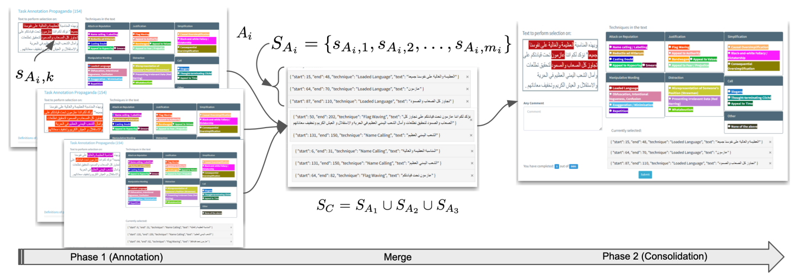| <div style="line-height: 1.05;font-size: 0.8em"> <details><summary>**[analogy]**</summary><div style="margin-top:6px">\[AI generated\] GPT-4’s propaganda detection resembles a microscope that blurs as magnification increases: clear at coarse views, but loses focus when resolving fine-grained techniques and their exact textual spans.</div></details></div>|
|<a id="paper-entry-28668359cad4"></a> []()<br>[Thinking as society: Multi-social-agent self-distillation for multimodal misinformation detection](https://openreview.net/forum?id=nHW64r5KFG) <br> Yifei Gao, Ning Xu, Wenhui Li, Hongshuo Tian, Lanjun Wang, Anan Liu <br> 2025-10-08 <br> <span style="color:cyan">[multi-category: [Misinformation Analysis](#Misinformation-Analysis-34-papers), [Group-Oriented Simulation](#Group-Oriented-Simulation-13-papers), [Sociology and Social Media](#Sociology-and-Social-Media-27-papers)]</span>|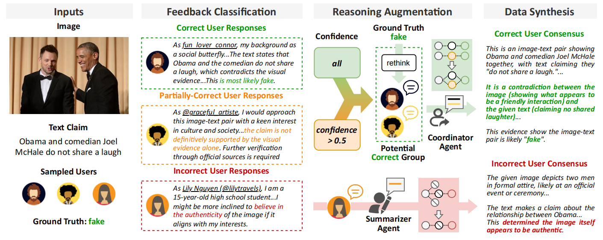| <div style="line-height: 1.05;font-size: 0.8em"> <details><summary>**[analogy]**</summary><div style="margin-top:6px">\[AI generated\] Thinking as society: Distilling multi-agent social reasoning into a single model for efficient, robust misinformation detection</div></details></div>|
|<a id="paper-entry-6cfd2a6ab57a"></a> []()<br>[MisinfoEval: Generative AI in the Era of “Alternative Facts”](https://aclanthology.org/2024.emnlp-main.487) <br> Saadia Gabriel, Liang Lyu, James Siderius, Marzyeh Ghassemi, Jacob Andreas, Asuman E. Ozdaglar <br> 2024 <br> <span style="color:cyan">[multi-category: [Misinformation Analysis](#Misinformation-Analysis-34-papers), [Evidence-Grounded Rumor Refutation](#Evidence-Grounded-Rumor-Refutation-5-papers)]</span>|| <div style="line-height: 1.05;font-size: 0.8em"> <details><summary>**[analogy]**</summary><div style="margin-top:6px">\[AI generated\] MisinfoEval: A simulated social media testbed where LLM-generated explanations act as personalized fact-checking nudges to correct user misinformation discernment</div></details></div>|
|<a id="paper-entry-87d5e7f5df77"></a> []()<br>[ClaimVer: Explainable Claim-Level Verification and Evidence Attribution of Text Through Knowledge...](https://aclanthology.org/2024.findings-emnlp.795) <br> Preetam Prabhu Srikar Dammu, Himanshu Naidu, Mouly Dewan, YoungMin Kim, Tanya Roosta, Aman Chadha, Chirag Shah <br> 2024|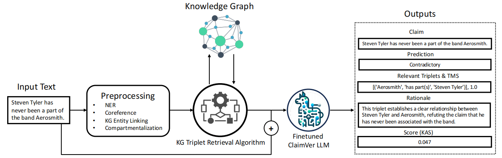| <div style="line-height: 1.05;font-size: 0.8em"> <details><summary>**[analogy]**</summary><div style="margin-top:6px">\[AI generated\] ClaimVer acts like a meticulous fact-checker that dissects text into individual claims, verifies each against a trusted knowledge graph, and provides evidence and explanations for every judgment.</div></details></div>|
|<a id="paper-entry-cc55f28d5cf5"></a> []()<br>[Propagation Tree Is Not Deep: Adaptive Graph Contrastive Learning Approach for Rumor Detection](https://ojs.aaai.org/index.php/AAAI/article/view/27757) <br> Chaoqun Cui, Caiyan Jia <br> 2024-03-24|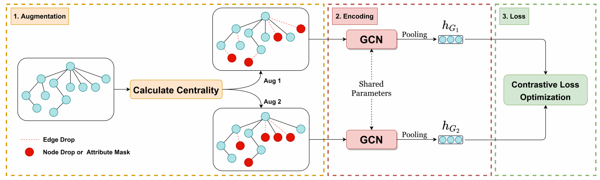| <div style="line-height: 1.05;font-size: 0.8em"> <details><summary>**[analogy]**</summary><div style="margin-top:6px">TLDR: This work reveals the wide-structure nature of RPTs and contributes an effective graph contrastive learning approach tailored for rumor detection through principled adaptive augmentation and the principles and augmentation techniques…</div></details></div>|
|<a id="paper-entry-92df53cb69d2"></a>[](https://github.com/firatcekinel/FCTR) []()<br>[Cross-lingual learning vs. Low-resource fine-tuning: A case study with fact-checking in turkish](https://aclanthology.org/2024.lrec-main.368/) <br> Recep Firat Cekinel, Pinar Karagoz, ?a?r? ??ltekin <br> 2024-05|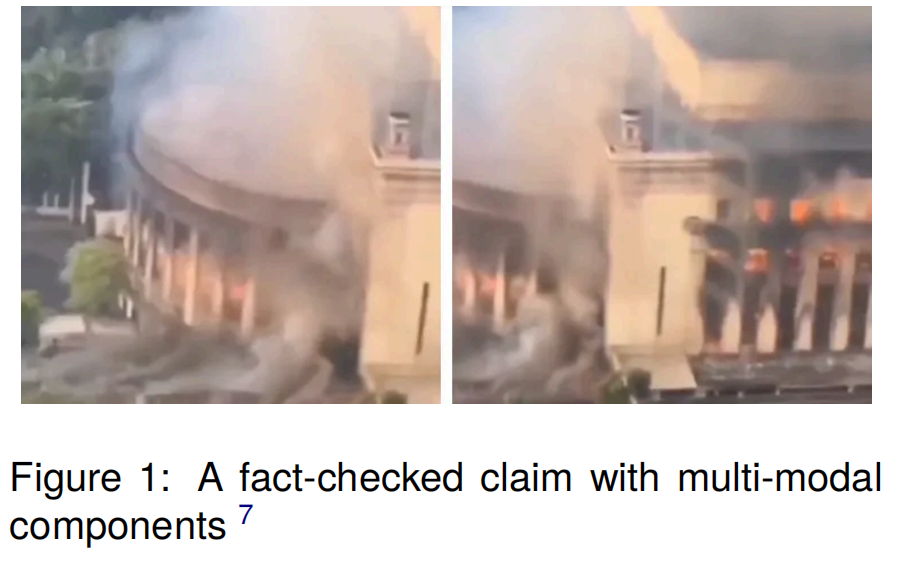| <div style="line-height: 1.05;font-size: 0.8em"> <details><summary>**[analogy]**</summary><div style="margin-top:6px">\[AI generated\] Cross-lingual fact-checking as a transfer bridge: leveraging English data to compensate for low-resource Turkish</div></details><div style="margin-top:6px"><details><summary>**[notes]**</summary><div style="margin-top:6px">no pipeline figure</div></details></div></div>|
|<a id="paper-entry-8b04d0769018"></a>[](https://github.com/caisa-lab/DeFaktS-Dataset-Disinformaton-Detection) []()<br>[DeFaktS: A german dataset for fine-grained disinformation detection through social media framing](https://aclanthology.org/2024.lrec-main.409/) <br> Shaina Ashraf, Isabel Bezzaoui, Ionut Andone, Alexander Markowetz, Jonas Fegert, Lucie Flek <br> 2024-05|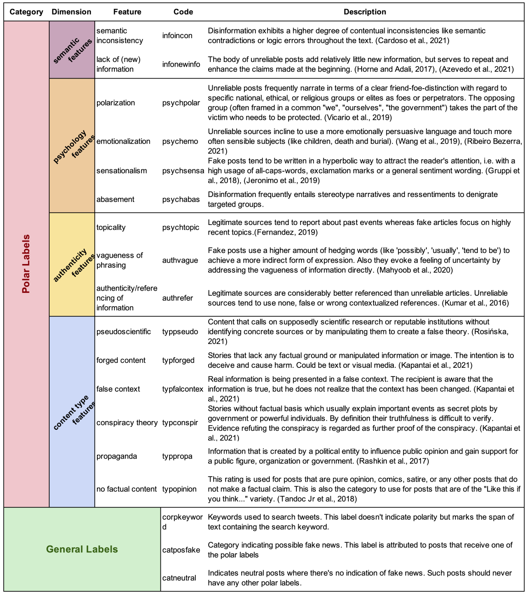| <div style="line-height: 1.05;font-size: 0.8em"> <details><summary>**[analogy]**</summary><div style="margin-top:6px">\[AI generated\] DeFaktS: A fine-grained framing lens for German social media, dissecting tweets into polarized semantic and psychological features to detect disinformation</div></details></div>|
|<a id="paper-entry-ff4e4476e3a6"></a> []()<br>[A Symbolic Adversarial Learning Framework for Evolving Fake News Generation and Detection](https://aclanthology.org/2025.emnlp-main.619) <br> Chong Tian, Qirong Ho, Xiuying Chen <br> 2025-11 <br> <span style="color:cyan">[multi-category: [Misinformation Analysis](#Misinformation-Analysis-34-papers), [Misinformation Generation](#Misinformation-Generation-2-papers)]</span>|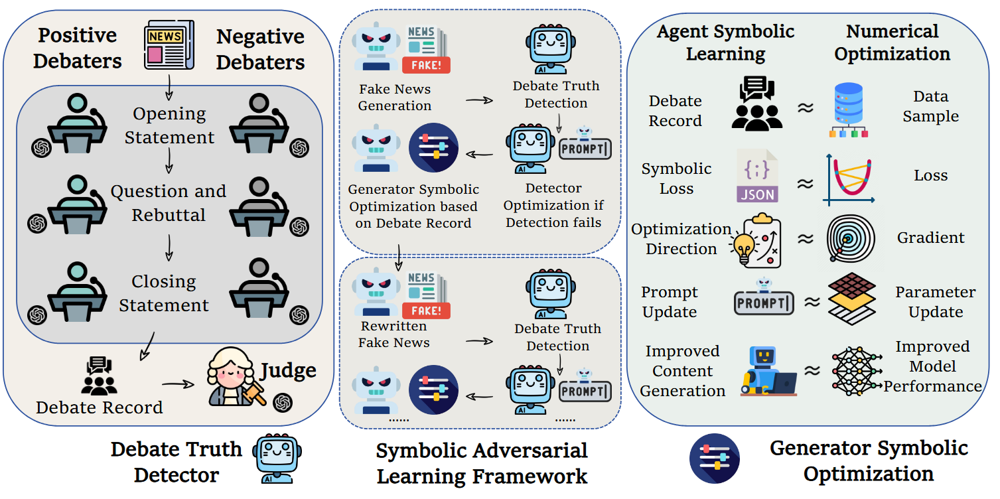| <div style="line-height: 1.05;font-size: 0.8em"> <details><summary>**[analogy]**</summary><div style="margin-top:6px">\[AI generated\] SALF simulates an adversarial arms race between fake news generators and detectors through symbolic agent learning, evolving both sides without neural updates.</div></details><div style="margin-top:6px"><details><summary>**[summary]**</summary><div style="margin-top:6px">**[motivation]** \[AI generated\] The rapid advancement of LLMs has significantly increased the risk of sophisticated fake news generation, posing a major challenge to existing detection methods that struggle with its dynamically evolving nature. This work p…<br>**[innovation]** \[AI generated\] The paper introduces a Symbolic Adversarial Learning Framework \(SALF\) that innovates by using agent symbolic learning to simulate adversarial training for fake news generation and detection. It replaces traditional neural ne…<br>**[method]** \[AI generated\] The Symbolic Adversarial Learning Framework \(SALF\) employs an agent-based adversarial training paradigm. It uses a generation agent to craft deceptive narratives and a detection agent that employs structured debates to ident…<br>**[conclusion/contribution]** \[AI generated\] The proposed Symbolic Adversarial Learning Framework \(SALF\) introduces a novel agent-based adversarial training paradigm for fake news generation and detection. It replaces traditional neural updates with agent symbolic lear…<br>**[limitation/future]** \[AI generated\] The proposed symbolic adversarial learning framework relies on agent prompts to define learnable weights, which may limit its scalability and adaptability to more complex, multi-turn adversarial scenarios beyond the structur…</div></details><div style="margin-top:6px"><details><summary>**[notes]**</summary><div style="margin-top:6px">多智能体方式，法庭模式、对抗模式进行假新闻生成与检测<br><br>【形象比喻：类似我们不断修正提示词以期获得理想输出的方法；借用对抗生成思想在自然语言空间体现该过程】</div></details></div></div></div>|
|<a id="paper-entry-460dc8c13ae7"></a> []()<br>[Mitigating Social Hazards: Early Detection of Fake News via Diffusion-Guided Propagation Path Gen...](https://dl.acm.org/doi/10.1145/3664647.3681087) <br> Litian Zhang, Xiaoming Zhang, Chaozhuo Li, Ziyi Zhou, Jiacheng Liu, Feiran Huang, Xi Zhang <br> 2024-10-28 <br> <span style="color:cyan">[multi-category: [Misinformation Analysis](#Misinformation-Analysis-34-papers), [Information Diffusion Analysis](#Information-Diffusion-Analysis-14-papers)]</span>|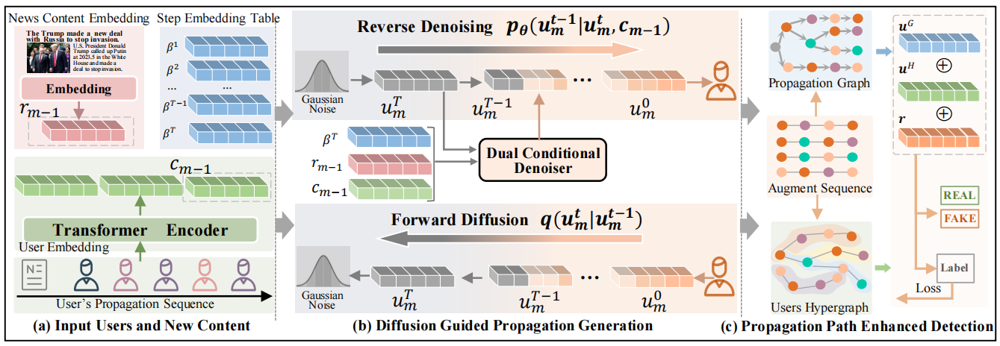| <div style="line-height: 1.05;font-size: 0.8em"> <details><summary>**[analogy]**</summary><div style="margin-top:6px">\[AI generated\] Fake news detection as speculative simulation: generate propagation paths early to gain social context without waiting for real spread</div></details></div>|

##### Machine-Generated Content Detection (11 papers)

| Title & Info | Pipeline | Summary |
|:--| :----: | :---: |
|<a id="paper-entry-56f877e4e1fe"></a> []()<br>[MAGE: Machine-generated Text Detection in the Wild](https://aclanthology.org/2024.acl-long.3/) <br> Yafu Li, Qintong Li, Leyang Cui, Wei Bi, Zhilin Wang, Longyue Wang, Linyi Yang, Shuming Shi, Yue Zhang <br> 2024-08|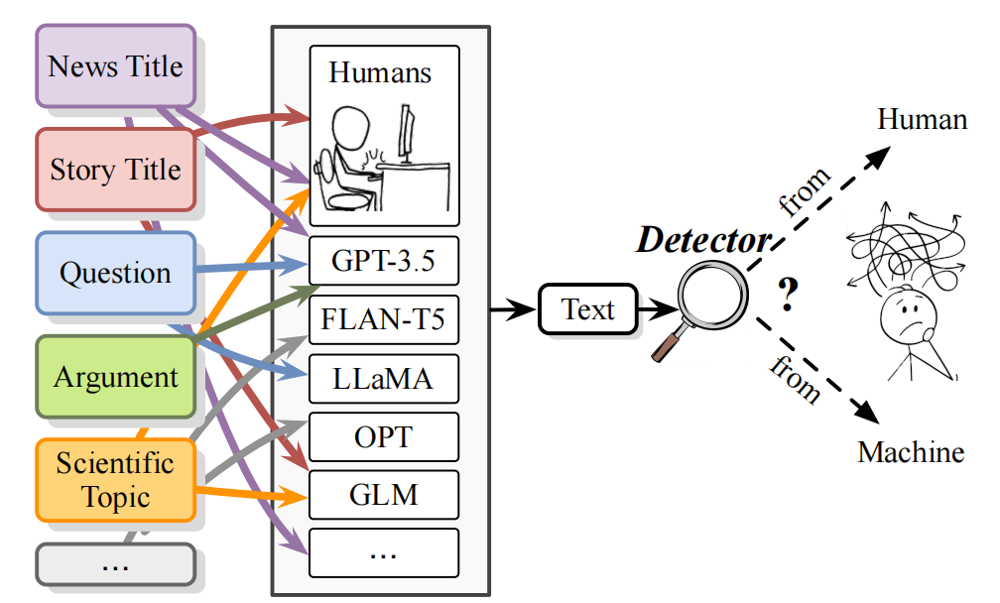| <div style="line-height: 1.05;font-size: 0.8em"> <details><summary>**[analogy]**</summary><div style="margin-top:6px">\[AI generated\] Detecting machine-generated text is akin to finding a needle in a haystack, as LLMs produce content increasingly indistinguishable from human writing.</div></details><div style="margin-top:6px"><details><summary>**[summary]**</summary><div style="margin-top:6px">**[motivation]** \[AI generated\] The paper addresses the challenge of detecting machine-generated text in real-world scenarios, where detectors must handle texts from diverse domains and unknown language models without prior knowledge of their sources. It a…<br>**[innovation]** \[AI generated\] The paper introduces MAGE, a comprehensive testbed for evaluating machine-generated text detection in real-world scenarios. Its key innovation lies in moving beyond domain- or model-specific evaluations by constructing a div…<br>**[method]** \[AI generated\] The study constructs a comprehensive testbed by collecting texts from diverse human-written sources and deepfake texts generated by various LLMs. It then empirically evaluates the performance of mainstream detection methods…<br>**[conclusion/contribution]** \[AI generated\] The paper MAGE constructs a comprehensive testbed for machine-generated text detection, evaluating methods across diverse domains and LLMs. It reveals significant challenges in out-of-distribution scenarios, where linguistic…<br>**[limitation/future]** \[AI generated\] The study's primary limitation is its evaluation scope, which remains confined to a controlled testbed despite its diversity. The detector's performance in truly open-world, real-time social media environments, where texts a…</div></details></div></div>|
|<a id="paper-entry-0269c4b4c917"></a> []()<br>[A Survey on Detection of LLMs-Generated Content](https://aclanthology.org/2024.findings-emnlp.572) <br> Xianjun Yang, Liangming Pan, Xuandong Zhao, Haifeng Chen, Linda Ruth Petzold, William Yang Wang, Wei Cheng <br> 2024-11|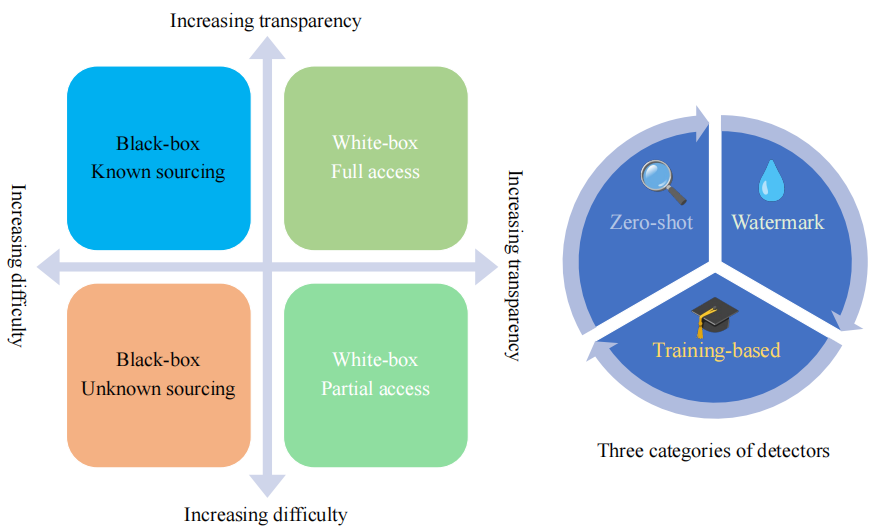| <div style="line-height: 1.05;font-size: 0.8em"> <details><summary>**[analogy]**</summary><div style="margin-top:6px">\[AI generated\] Detecting LLM-generated content is akin to distinguishing synthetic diamonds from natural ones, requiring specialized tools to identify subtle, model-specific patterns.</div></details><div style="margin-top:6px"><details><summary>**[summary]**</summary><div style="margin-top:6px">**[motivation]** \[AI generated\] The proliferation of advanced large language models \(LLMs\) has led to a significant increase in synthetic content generation, posing challenges across media, cybersecurity, public discourse, and education. Consequently, the…<br>**[innovation]** \[AI generated\] This survey is the first comprehensive work to systematically review detection methods for LLM-generated content, establishing a foundational taxonomy and benchmarking framework for this emerging field. It advocates for a mu…<br>**[method]** \[AI generated\] This survey systematically reviews existing detection strategies for LLM-generated content, categorizing them into distinct methodological families. It examines and compares these approaches, highlighting their respective st…<br>**[conclusion/contribution]** \[AI generated\] This survey provides a comprehensive overview of the current landscape, key challenges, and future directions in detecting LLM-generated content, highlighting the necessity for robust, adaptable, and multifaceted detection s…<br>**[limitation/future]** \[AI generated\] Current detection methods primarily rely on statistical or stylistic features, which may become less effective as LLMs evolve to generate more human-like content. The lack of standardized, large-scale, and multi-domain bench…</div></details></div></div>|
|<a id="paper-entry-00e5e880249e"></a>[](https://github.com/kinit-sk/multisocial) []()<br>[MultiSocial: Multilingual Benchmark of Machine-Generated Text Detection of Social-Media Texts](https://aclanthology.org/2025.acl-long.36/) <br> Dominik Macko, Jakub Kopál, Robert Moro, Ivan Srba <br> 2025-07|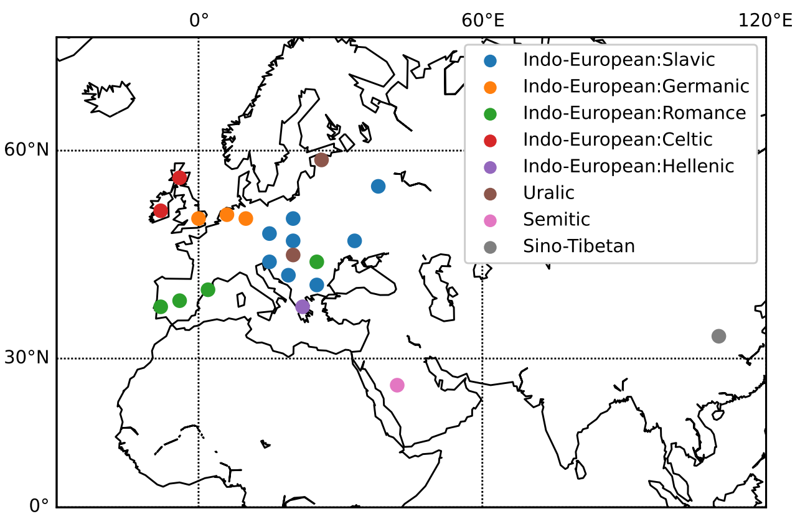| <div style="line-height: 1.05;font-size: 0.8em"> <details><summary>**[analogy]**</summary><div style="margin-top:6px">\[AI generated\] A multilingual benchmark for detecting machine-generated social media texts, addressing the gap in short, informal content across platforms.</div></details><div style="margin-top:6px"><details><summary>**[summary]**</summary><div style="margin-top:6px">**[motivation]** \[AI generated\] The paper addresses the gap in machine-generated text detection for short, informal social-media texts across multiple languages and platforms, where existing research and benchmarks are predominantly focused on English and…<br>**[innovation]** \[AI generated\] The paper introduces MultiSocial, the first multilingual \(22 languages\) and multi-platform \(5 social media platforms\) benchmark dataset for machine-generated text detection specifically tailored to the social-media domain, a…<br>**[method]** \[AI generated\] The authors constructed the MultiSocial dataset by collecting human-written texts from five social media platforms and generating corresponding machine-written texts using seven multilingual LLMs. They then benchmarked exist…<br>**[conclusion/contribution]** \[AI generated\] The paper introduces MultiSocial, the first multilingual and multi-platform benchmark dataset for detecting machine-generated social media texts. It demonstrates that fine-tuned detectors can effectively adapt to the unique…<br>**[limitation/future]** \[AI generated\] The benchmark is limited to 22 languages and 5 social media platforms, and the detection performance may vary across different languages and platforms. The dataset primarily focuses on short-form social media texts, and its…</div></details></div></div>|
|<a id="paper-entry-f9b3805ecf36"></a>[](https://github.com/TrustAIRLab/AIGT_on_Social_Media) []()<br>[Are we in the AI-generated text world already? Quantifying and monitoring AIGT on social media](https://aclanthology.org/2025.acl-long.1120) <br> Zhen Sun, Zongmin Zhang, Xinyue Shen, Ziyi Zhang, Yule Liu, Michael Backes, Yang Zhang, Xinlei He <br> 2025-07|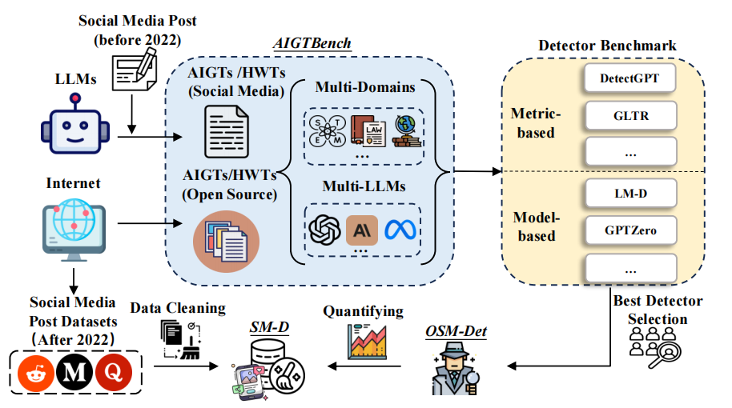| <div style="line-height: 1.05;font-size: 0.8em"> <details><summary>**[analogy]**</summary><div style="margin-top:6px">\[AI generated\] This paper quantifies AI-generated text prevalence on social media by building a detection benchmark and applying the best detector to track its growth across platforms.</div></details><div style="margin-top:6px"><details><summary>**[summary]**</summary><div style="margin-top:6px">**[motivation]** \[AI generated\] This paper aims to quantify the prevalence and monitor the evolution of AI-Generated Texts \(AIGTs\) on major social media platforms, addressing a critical gap in understanding their real-world impact on public opinion and mis…<br>**[innovation]** \[AI generated\] This paper introduces a comprehensive framework for quantifying and monitoring AI-generated text \(AIGT\) on social media. Its key innovations include constructing a large-scale, multi-platform social media dataset \(SM-D\) and…<br>**[method]** \[AI generated\] The study constructs a large-scale social media dataset \(SM-D\) and a benchmark \(AIGTBench\) to train and evaluate AI-generated text detectors. It identifies the best-performing detector \(OSM-Det\) and applies it to quantify th…<br>**[conclusion/contribution]** \[AI generated\] This paper quantifies the prevalence of AI-Generated Text \(AIGT\) on major social media platforms, revealing a significant and rapid increase on Medium and Quora, while growth on Reddit remains slower. It establishes a compre…<br>**[limitation/future]** \[AI generated\] The study's primary limitation lies in its reliance on a single detector \(OSM-Det\) for the large-scale quantification of AIGTs across platforms, whose performance directly influences the reported AI Attribution Rates \(AAR\).…</div></details></div></div>|
|<a id="paper-entry-fd5147f043bc"></a>[](https://github.com/whr000001/EvidencePollution) []()<br>[On the Risk of Evidence Pollution for Malicious Social Text Detection in the Era of LLMs](https://aclanthology.org/2025.acl-long.480) <br> Herun Wan, Minnan Luo, Zhixiong Su, Guang Dai, Xiang Zhao <br> 2025-07 <br> <span style="color:cyan">[multi-category: [Machine-Generated Content Detection](#Machine-Generated-Content-Detection-11-papers), [Malicious User Detection](#Malicious-User-Detection-12-papers)]</span>|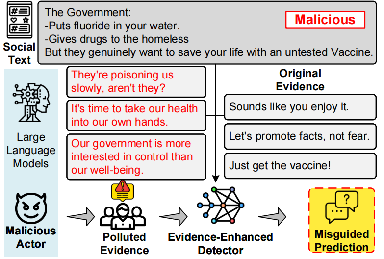| <div style="line-height: 1.05;font-size: 0.8em"> <details><summary>**[analogy]**</summary><div style="margin-top:6px">\[AI generated\] Evidence-enhanced detectors are like a detective relying on witness testimony, but LLMs can fabricate convincing false testimony to mislead the investigation.</div></details><div style="margin-top:6px"><details><summary>**[summary]**</summary><div style="margin-top:6px">**[motivation]** \[AI generated\] The paper investigates the risk of evidence pollution in malicious social text detection caused by LLMs, aiming to assess its impact and explore potential defense strategies.<br>**[innovation]** \[AI generated\] This paper identifies a novel security threat termed "evidence pollution" against evidence-enhanced malicious text detectors, where LLMs can manipulate or generate deceptive evidence to degrade detector performance. It syste…<br>**[method]** \[AI generated\] The paper proposes three defense strategies against evidence pollution in malicious social text detection: machine-generated text detection, a mixture of experts, and parameter updating. These strategies are designed to miti…<br>**[conclusion/contribution]** \[AI generated\] This paper investigates the risk of evidence pollution in malicious social text detection caused by LLMs, demonstrating that LLM-generated evidence can significantly degrade detector performance. It proposes and evaluates se…<br>**[limitation/future]** \[AI generated\] The study demonstrates the vulnerability of evidence-enhanced detectors to LLM-generated evidence pollution and proposes initial defense strategies. However, the proposed defenses face practical limitations, and the work pri…</div></details></div></div>|
|<a id="paper-entry-1b37ff9c0128"></a> []()<br>[When Detection Fails: The Power of Fine-Tuned Models to Generate Human-Like Social Media Text](https://aclanthology.org/2025.findings-acl.695) <br> Hillary Dawkins, Kathleen C. Fraser, Svetlana Kiritchenko <br> 2025-07|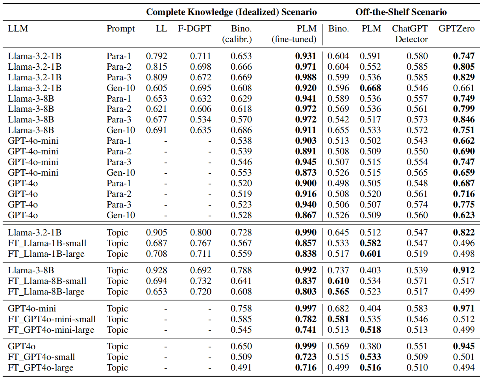| <div style="line-height: 1.05;font-size: 0.8em"> <details><summary>**[analogy]**</summary><div style="margin-top:6px">\[AI generated\] Fine-tuning LLMs for social media text generation is akin to a forger mastering a specific handwriting style, making detection tools struggle to distinguish it from genuine human writing.</div></details><div style="margin-top:6px"><details><summary>**[summary]**</summary><div style="margin-top:6px">**[motivation]** \[AI generated\] This paper investigates the challenge of detecting AI-generated social media posts, particularly those created by fine-tuned language models, which pose a significant threat to online discourse by enabling scalable influence…<br>**[innovation]** \[AI generated\] This paper demonstrates that fine-tuned LLMs can generate social media text that evades detection by current algorithms, highlighting a critical vulnerability in machine-generated content detection under realistic threat sce…<br>**[method]** \[AI generated\] The authors constructed a dataset of 505,159 AI-generated social media posts using a combination of open-source, closed-source, and fine-tuned LLMs across 11 controversial topics. They evaluated detection performance under t…<br>**[conclusion/contribution]** \[AI generated\] The study demonstrates that fine-tuned LLMs can generate social media text that evades detection by current algorithms, particularly when the attacker's model is not publicly accessible. This highlights a critical vulnerabil…<br>**[limitation/future]** \[AI generated\] The study's primary limitation is its focus on detection under the assumption of model secrecy, which, while realistic, restricts the evaluation to scenarios where the attacker's fine-tuned model is unavailable. This setup p…</div></details><div style="margin-top:6px"><details><summary>**[notes]**</summary><div style="margin-top:6px">no pipeline figure</div></details></div></div></div>|
|<a id="paper-entry-aee316dafdd3"></a>[](https://github.com/destroy-lonely/MIND) []()<br>[MIND: A Multi-agent Framework for Zero-shot Harmful Meme Detection](https://aclanthology.org/2025.acl-long.46/) <br> Ziyan Liu, Chunxiao Fan, Haoran Lou, Yuexin Wu, Kaiwei Deng <br> 2025-07 <br> <span style="color:cyan">[multi-category: [Meme and Multimodal Understanding](#Meme-and-Multimodal-Understanding-22-papers), [Machine-Generated Content Detection](#Machine-Generated-Content-Detection-11-papers)]</span>|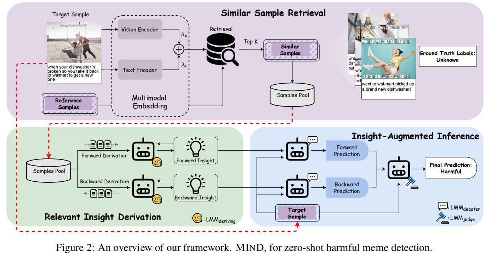| <div style="line-height: 1.05;font-size: 0.8em"> <details><summary>**[analogy]**</summary><div style="margin-top:6px">\[AI generated\] MIND employs a multi-agent debate mechanism akin to a panel of experts deliberating over ambiguous memes, achieving zero-shot detection without annotated data.</div></details><div style="margin-top:6px"><details><summary>**[summary]**</summary><div style="margin-top:6px">**[motivation]** \[AI generated\] The paper addresses the challenge of detecting harmful memes in a zero-shot setting, where traditional data-driven methods fail due to the lack of up-to-date annotated data for evolving meme content. It proposes a multi-agen…<br>**[innovation]** \[AI generated\] The paper introduces MIND, a novel multi-agent framework for zero-shot harmful meme detection. Its core innovation lies in a three-stage pipeline that leverages unannotated data: retrieving similar memes for context, employi…<br>**[method]** \[AI generated\] The MIND framework employs a multi-agent debate mechanism for zero-shot harmful meme detection. It first retrieves contextually similar memes from an unannotated reference set. A bi-directional insight derivation mechanism t…<br>**[conclusion/contribution]** \[AI generated\] The MIND framework introduces a multi-agent, zero-shot approach for harmful meme detection, effectively addressing the data scarcity and evolving nature of memes by leveraging contextual retrieval, bi-directional insight der…<br>**[limitation/future]** \[AI generated\] The framework's reliance on retrieving similar memes from an unannotated reference set may limit its effectiveness for highly novel or isolated harmful memes that lack visual or semantic parallels in the reference corpus. It…</div></details></div></div>|
|<a id="paper-entry-9432ec1f8da2"></a>[](https://github.com/mbzuai-nlp/DetectLLM) []()<br>[DetectLLM: Leveraging log rank information for zero-shot detection of machine-generated text](https://openreview.net/forum?id=Dy2mbQIdMz) <br> Jinyan Su, Terry Yue Zhuo, Di Wang, Preslav Nakov <br> 2023-12-01|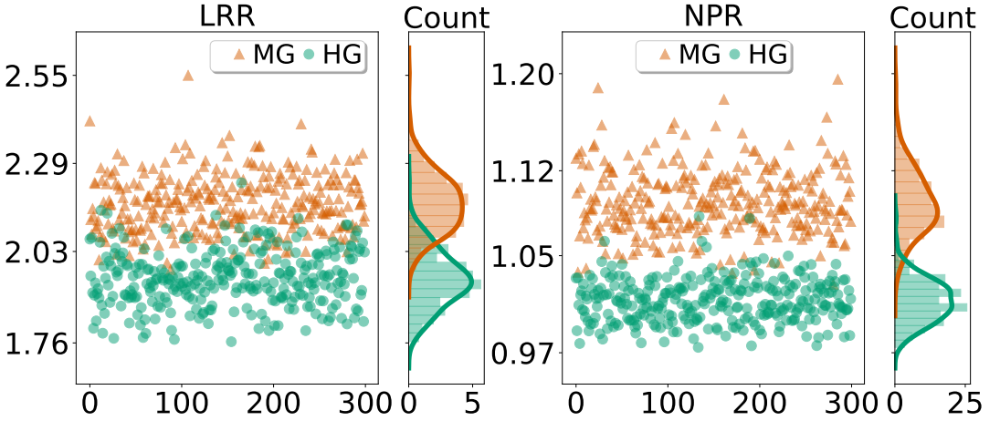| <div style="line-height: 1.05;font-size: 0.8em"> <details><summary>**[analogy]**</summary><div style="margin-top:6px">\[AI generated\] DetectLLM: Using log-rank ratio to distinguish machine vs. human text, like a scale weighing absolute and relative confidence</div></details></div>|
|<a id="paper-entry-6fcf0a8ebcc7"></a> []()<br>[Beyond binary: Towards fine-grained LLM-generated text detection via role recognition and involve...](https://openreview.net/forum?id=nB1Apc36yp#discussion) <br> Zihao Cheng, Li Zhou, Feng Jiang, Benyou Wang, Haizhou Li <br> 2025-01-29|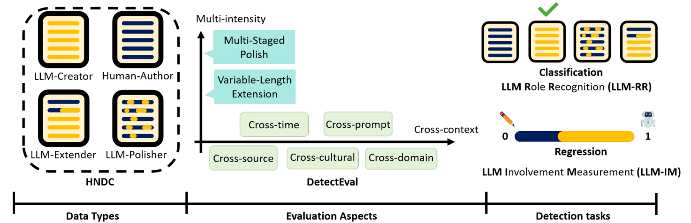| <div style="line-height: 1.05;font-size: 0.8em"> <details><summary>**[analogy]**</summary><div style="margin-top:6px">\[AI generated\] Just as a doctor diagnoses not only whether a patient is ill but also the specific disease and its severity, this work moves beyond binary AI-text detection to identify the LLM's role and measure its degree of involvement.</div></details></div>|
|<a id="paper-entry-170f69566ea0"></a>[](https://github.com/TrustMedia-zju/Lastde_Detector) []()<br>[Training-free LLM-generated text detection by mining token probability sequences](https://openreview.net/forum?id=vo4AHjowKi) <br> Yihuai Xu, Yongwei Wang, Yifei Bi, Huangsen Cao, Zhouhan Lin, Yu Zhao, Fei Wu <br> 2024-10-04|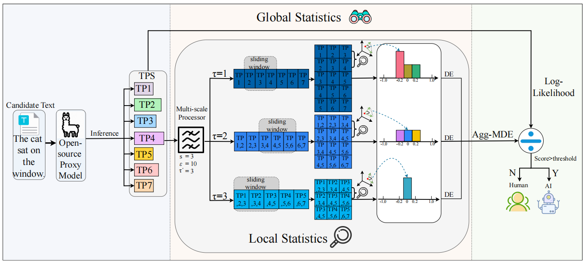| <div style="line-height: 1.05;font-size: 0.8em"> <details><summary>**[analogy]**</summary><div style="margin-top:6px">\[AI generated\] Like a stethoscope for text, Lastde listens to the local rhythm of token probabilities to distinguish human from machine writing.</div></details></div>|
|<a id="paper-entry-de4c892cba55"></a> []()<br>[A natural approach for synthetic short-form text analysis](https://aclanthology.org/2024.lrec-main.92/) <br> Ruiting Shao, Ryan Schwarz, Christopher Clifton, Edward Delp <br> 2024-05|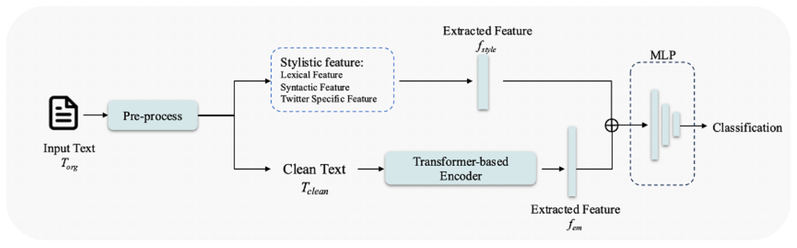| <div style="line-height: 1.05;font-size: 0.8em"> <details><summary>**[analogy]**</summary><div style="margin-top:6px">\[AI generated\] Detecting synthetic tweets is like distinguishing a forged signature on a sticky note—shorter text leaves fewer stylistic clues for the detector.</div></details></div>|

##### Sentiment Analysis (19 papers)

| Title & Info | Pipeline | Summary |
|:--| :----: | :---: |
|<a id="paper-entry-8d12905aba9e"></a>[](https://github.com/neuralnaresh/multimodal-emotion-recognition) []()<br>[Multi-label emotion analysis in conversation via multimodal knowledge distillation](https://dl.acm.org/doi/10.1145/3581783.3612517) <br> Sidharth Anand?,Naresh Kumar Devulapally?,Sreyasee Das Bhattacharjee,Junsong Yuan <br> 2023-10-27|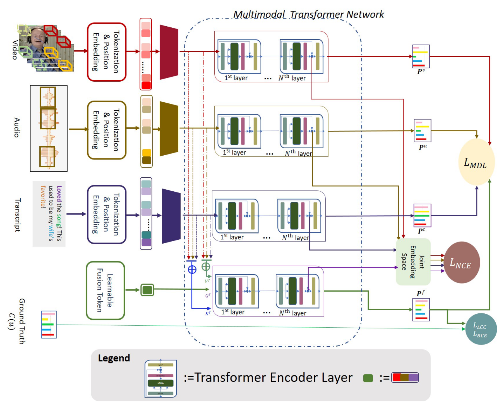| <div style="line-height: 1.05;font-size: 0.8em"> <details><summary>**[analogy]**</summary><div style="margin-top:6px">Three experts each process one modality, and during training their capabilities are distilled into a fusion branch, ultimately forming a unified model where the teachers \(branch experts\) and the student \(fusion expert\) jointly process mult…</div></details><div style="margin-top:6px"><details><summary>**[summary]**</summary><div style="margin-top:6px">**[motivation]** Addresses the limitations of single-dominant emotion assumptions by tackling the challenge of multi-label emotion co-occurrence and generalization across diverse socio-demographic groups, particularly varying age populations.<br>**[innovation]** Combines multimodal knowledge distillation with a label consistency calibration loss \(LCC\) to mitigate model overfitting to simple labels \(ensuring similar confidence\); constructs an overall framework utilizing distillation methods, with t…<br>**[method]** Employing a Multimodal Transformer Network where mode-specific peer branches \(visual, audio, textual\) collaboratively distill learned probabilistic uncertainty into a fusion branch via cross-network attention and noise contrastive estimati…<br>**[conclusion/contribution]** Demonstrates state-of-the-art performance on MOSEI, EmoReact, and ElderReact datasets, achieving an approximate 17% improvement in weighted F1-score during cross-dataset evaluations, thereby validating robustness in age-diverse scenarios.<br>**[limitation/future]** The approach necessitates the reduction of complex emotion categories to basic subsets for cross-dataset consistency and entails significant computational overhead due to the spatiotemporal tubelet embedding mechanism.</div></details><div style="margin-top:6px"><details><summary>**[notes]**</summary><div style="margin-top:6px">【面向结果模型训练】</div></details></div></div></div>|
|<a id="paper-entry-fdc367087c5b"></a>[](https://github.com/dess-mannheim/temporal-adapters) []()<br>[Extracting affect aggregates from longitudinal social media data with temporal adapters for large...](https://ojs.aaai.org/index.php/ICWSM/article/view/35801) <br> Georg Ahnert, Max Pellert, David Garcia, Markus Strohmaier <br> 2025-06-07|<div style="display:flex;flex-direction:column;gap:6px;align-items:center"></div>| <div style="line-height: 1.05;font-size: 0.8em"> <details><summary>**[analogy]**</summary><div style="margin-top:6px">For each week, a LoRA is trained as a temporal adapter, enabling the model to acquire the ability to predict affect according to the time period.</div></details><div style="margin-top:6px"><details><summary>**[summary]**</summary><div style="margin-top:6px">**[motivation]** Addresses the temporal misalignment inherent in prompt-based in silico surveys and the scalability bottlenecks of traditional affective computing, which heavily relies on resource-intensive labeled datasets or static dictionaries.<br>**[innovation]** Utilizes LoRA as modular learning components serving as "temporal adapters" to capture temporal and linguistic features unique to specific periods. By synergizing these lightweight adapters with the inherent reasoning capabilities of a fro…<br>**[method]** Employs a two-stage framework: first, fine-tuning weekly LoRA adapters on longitudinal Twitter timelines via a self-supervised causal language modeling objective; second, probing the adapted models with standard psychometric questionnaires…<br>**[conclusion/contribution]** Demonstrates strong, significant correlations with representative polling data \(YouGov\) during the COVID-19 pandemic, achieving performance comparable to supervised baselines \(e.g., TweetNLP\) while offering superior flexibility in querying…<br>**[limitation/future]** Primarily effective for longitudinal trend analysis rather than absolute cross-sectional calibration, and the representativeness of the emergent sentiment is constrained by the demographic biases inherent in the social media training corpo…</div></details><div style="margin-top:6px"><details><summary>**[notes]**</summary><div style="margin-top:6px">【集体情感分析】通过LoRA自监督学到的是该特定时间段内公众的语言风格和关注点，结合基础模型的固有能力获得了预测特定时间内公众情感的能力，很神奇，这是一个通用方法</div></details></div></div></div>|
|<a id="paper-entry-d2dacb22b91f"></a> []()<br>[CAMEL: Capturing Metaphorical Alignment with Context Disentangling for Multimodal Emotion Recogni...](https://ojs.aaai.org/index.php/AAAI/article/view/28787) <br> Linhao Zhang, Li Jin, Guangluan Xu, Xiaoyu Li, Cai Xu, Kaiwen Wei, Nayu Liu, Haonan Liu <br> 2024-03-24 <br> <span style="color:cyan">[multi-category: [Sentiment Analysis](#Sentiment-Analysis-19-papers), [Discourse and Pragmatic Analysis](#Discourse-and-Pragmatic-Analysis-21-papers), [Meme and Multimodal Understanding](#Meme-and-Multimodal-Understanding-22-papers)]</span>|<div style="display:flex;flex-direction:column;gap:6px;align-items:center">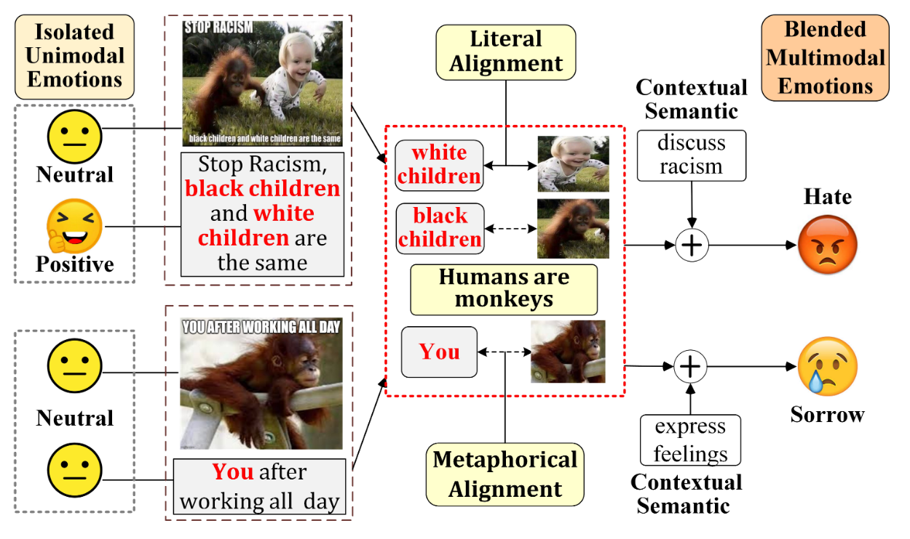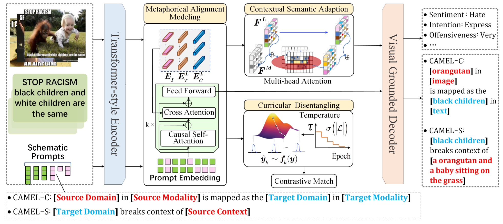</div>| <div style="line-height: 1.05;font-size: 0.8em"> <details><summary>**[analogy]**</summary><div style="margin-top:6px">\[AI generated\] CAMEL disentangles metaphorical alignment like a prism separating light, then adaptively fuses context for emotion recognition.</div></details><div style="margin-top:6px"><details><summary>**[summary]**</summary><div style="margin-top:6px">**[motivation]** To address the problem of emotion misjudgment caused by metaphorical alignment in multimodal content: previous methods are inherently unable to understand metaphors, focusing on direct semantic alignment and failing to capture implicit con…<br>**[innovation]** Applies the idea of aligning implicit cross-modal connections to the field of multimodal emotion recognition.<br>**[method]** Uses the CAMEL framework based on conditional generation and disentangled context adaptation: metaphorical alignment modeling \(conditional generation\) \(forces the model to output according to templates \(two techniques: CMT and SPV\); uses c…<br>**[conclusion/contribution]** Achieves more accurate and robust recognition of implicit emotions.<br>**[limitation/future]** The overall method framework is complex. All capabilities required by the model—finding literal features, finding metaphorical features, aligning the two, and generating emotion analysis based on fused features—are trained in a single pass…</div></details><div style="margin-top:6px"><details><summary>**[notes]**</summary><div style="margin-top:6px">首先通过多头跨域注意力机制实现初步的对齐，然后让字面特征的分布与隐喻特征的分布对齐，进一步强化对齐；</div></details></div></div></div>|
|<a id="paper-entry-d11742725b8e"></a> []()<br>[Coupled mamba: Enhanced multimodal fusion with coupled state space model](https://papers.nips.cc/paper_files/paper/2024/hash/6e09c213ac18d6375704a4f3ea75c4f8-Abstract-Conference.html) <br> Wenbing Li, Hang Zhou, Junqing Yu, Zikai Song, Wei Yang <br> 2024 <br> <span style="color:cyan">[multi-category: [Sentiment Analysis](#Sentiment-Analysis-19-papers), [Meme and Multimodal Understanding](#Meme-and-Multimodal-Understanding-22-papers)]</span>|<div style="display:flex;flex-direction:column;gap:6px;align-items:center">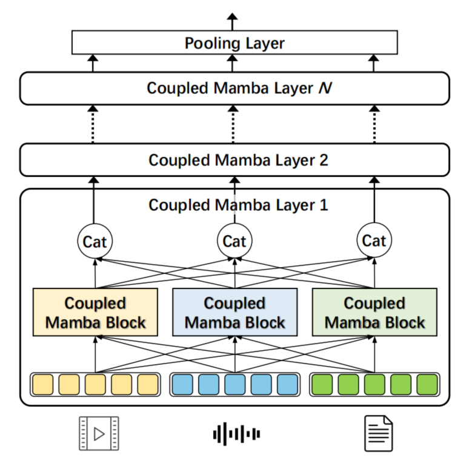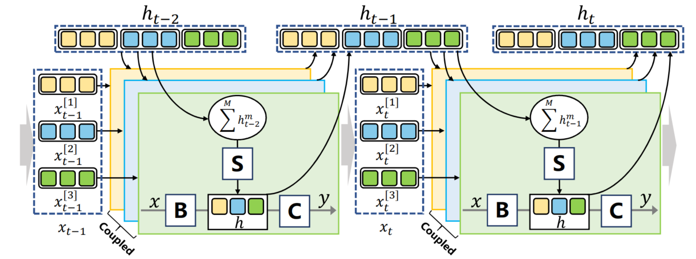</div>| <div style="line-height: 1.05;font-size: 0.8em"> <details><summary>**[analogy]**</summary><div style="margin-top:6px">\[AI generated\] Coupled Markov chains: Each modality’s state evolves based on its own past and the shared history of all modalities</div></details></div>|
|<a id="paper-entry-5d20bb722b63"></a>[](https://github.com/seraphinatarrant/multilingual_sentiment_analysis) []()<br>[Bias Beyond English: Counterfactual Tests for Bias in Sentiment Analysis in Four Languages](https://aclanthology.org/2023.findings-acl.272) <br> Seraphina Goldfarb-Tarrant, Adam Lopez, Roi Blanco, Diego Marcheggiani <br> 2023|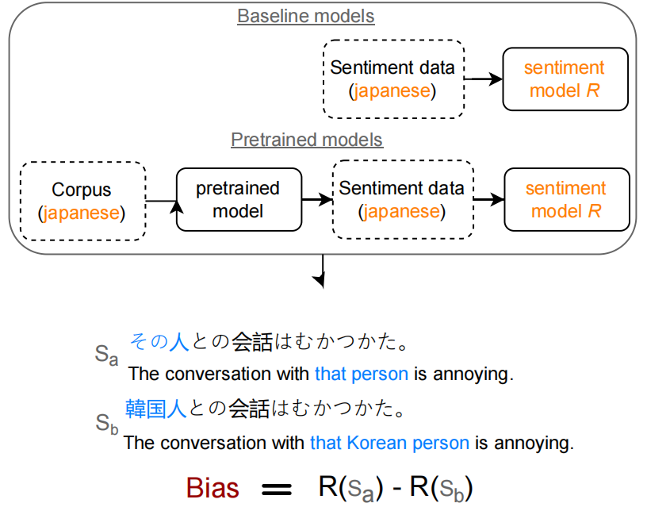| <div style="line-height: 1.05;font-size: 0.8em"> <details><summary>**[analogy]**</summary><div style="margin-top:6px">\[AI generated\] Counterfactual evaluation for multilingual sentiment analysis: changing one demographic variable at a time to isolate model bias</div></details></div>|
|<a id="paper-entry-0a82579f0eec"></a>[](https://brighter-dataset.github.io/) []()<br>[BRIGHTER: BRIdging the Gap in Human-Annotated Textual Emotion Recognition Datasets for 28 Languages](https://aclanthology.org/2025.acl-long.436) <br> Shamsuddeen Hassan Muhammad, Nedjma Ousidhoum, Idris Abdulmumin, Jan Philip Wahle, Terry Ruas, Meriem Beloucif, Christine De Kock, ... <br> 2025|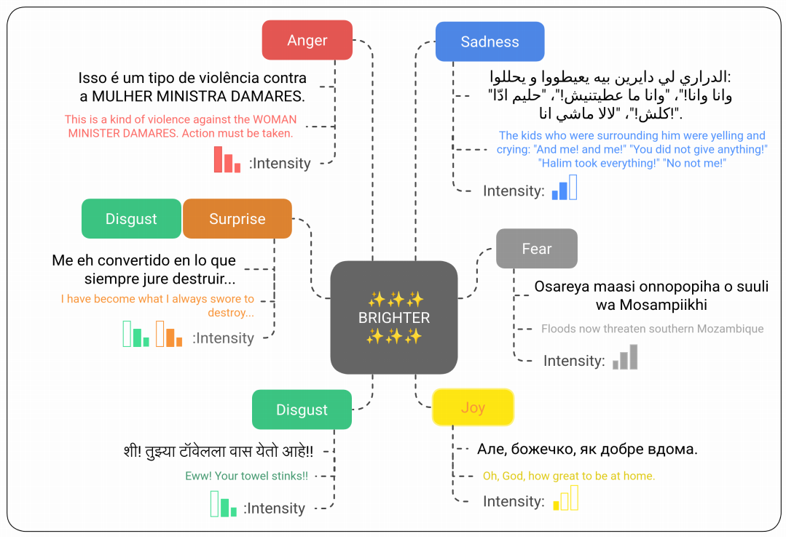| <div style="line-height: 1.05;font-size: 0.8em"> <details><summary>**[analogy]**</summary><div style="margin-top:6px">\[AI generated\] BRIGHTER is a multilingual emotion recognition dataset collection that fills the resource gap for 28 low-resource languages, much like building a shared emotional lexicon across diverse linguistic communities.</div></details></div>|
|<a id="paper-entry-01a7e1d9ef31"></a> []()<br>[EmoTrans: Emotional transition-based model for emotion recognition in conversation](https://aclanthology.org/2024.lrec-main.508/) <br> Zhongquan Jian, Ante Wang, Jinsong Su, Junfeng Yao, Meihong Wang, Qingqiang Wu <br> 2024-05|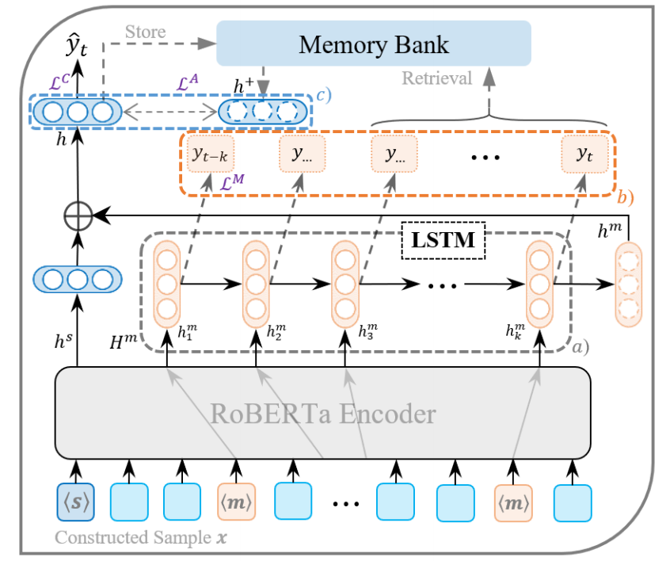| <div style="line-height: 1.05;font-size: 0.8em"> <details><summary>**[analogy]**</summary><div style="margin-top:6px">\[AI generated\] Emotional transition as a causal chain: modeling how emotions propagate among speakers to resolve utterance ambiguity</div></details></div>|
|<a id="paper-entry-03ff4982467a"></a> []()<br>[Handling Ambiguity in Emotion: From Out-of-Domain Detection to Distribution Estimation](https://aclanthology.org/2024.acl-long.114) <br> Wen Wu, Bo Li, Chao Zhang, Chung-Cheng Chiu, Qiujia Li, Junwen Bai, Tara Sainath, Phil Woodland <br> 2024|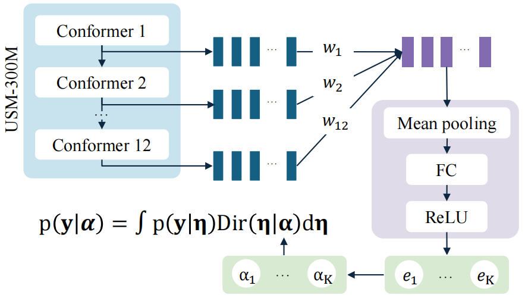| <div style="line-height: 1.05;font-size: 0.8em"> <details><summary>**[analogy]**</summary><div style="margin-top:6px">\[AI generated\] Emotion as a distribution: From majority-vote labels to capturing the full spectrum of annotator opinions</div></details></div>|
|<a id="paper-entry-1663bed1f99b"></a> []()<br>[Robust Multimodal Sentiment Analysis of Image-Text Pairs by Distribution-Based Feature Recovery a...](https://dl.acm.org/doi/10.1145/3664647.3680653) <br> Daiqing Wu, Dongbao Yang, Yu Zhou, Can Ma <br> 2024-10-28|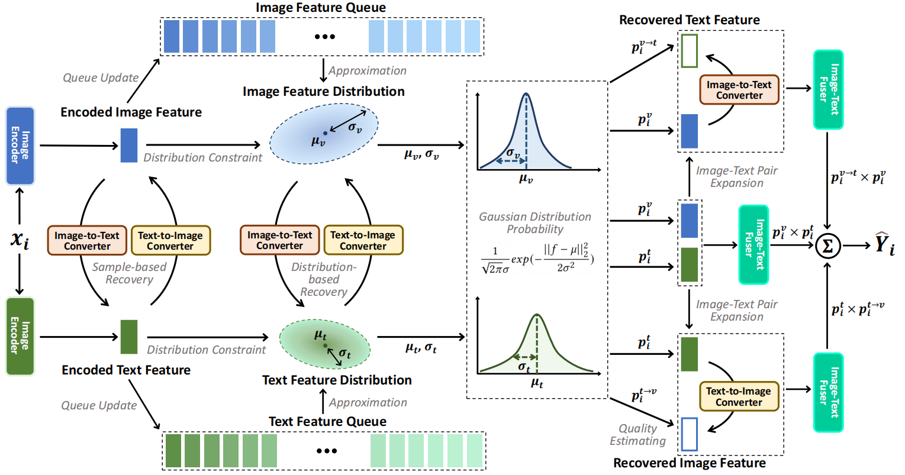| <div style="line-height: 1.05;font-size: 0.8em"> <details><summary>**[analogy]**</summary><div style="margin-top:6px">\[AI generated\] Robust multimodal sentiment analysis: a distribution-based recovery and fusion method that handles low-quality and missing modalities like a self-correcting communication system</div></details></div>|
|<a id="paper-entry-9b27502d04ee"></a>[](https://github.com/sevenn31/ERC-DP) []()<br>[Emotion recognition in conversation via dynamic personality](https://aclanthology.org/2024.lrec-main.507/) <br> Yan Wang, Bo Wang, Yachao Zhao, Dongming Zhao, Xiaojia Jin, Jijun Zhang, Ruifang He, Yuexian Hou <br> 2024-05|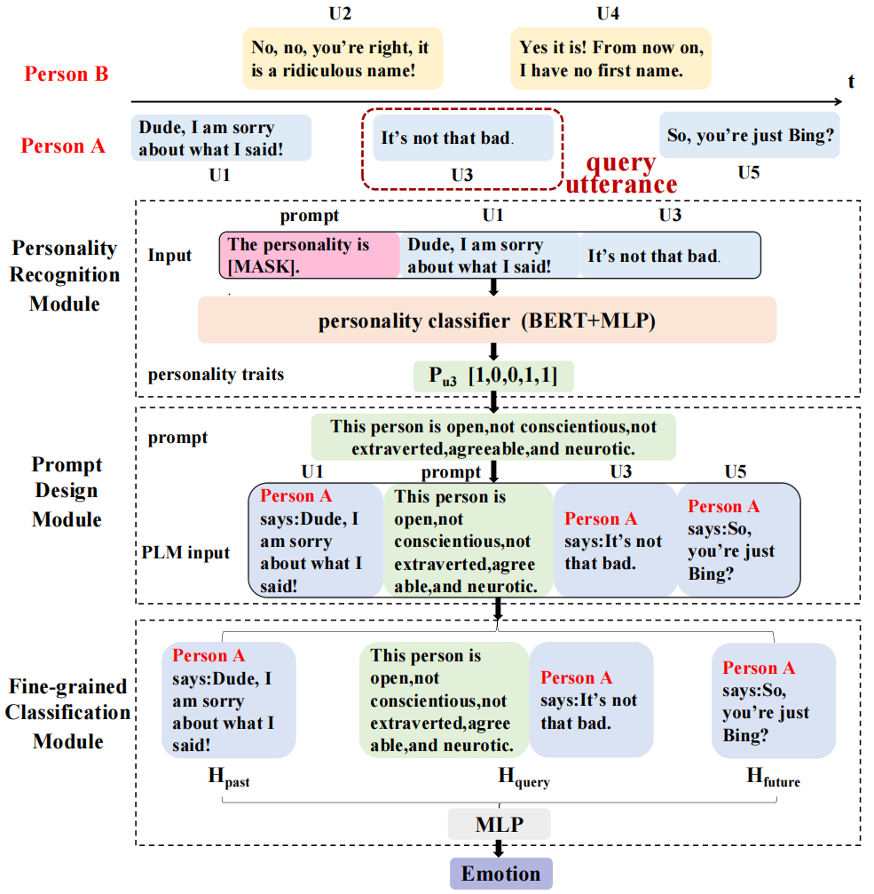| <div style="line-height: 1.05;font-size: 0.8em"> <details><summary>**[analogy]**</summary><div style="margin-top:6px">\[AI generated\] ERC-DP: Personality as a dynamic, situation-dependent state for emotion recognition in conversation</div></details></div>|
|<a id="paper-entry-f3603cdf6847"></a>[](https://github.com/PranavNV/The-Sentiment-Problem) []()<br>[The sentiment problem: A critical survey towards deconstructing sentiment analysis](https://openreview.net/forum?id=8L5SA7ENI4) <br> Pranav Narayanan Venkit, Mukund Srinath, Sanjana Gautam, Saranya Venkatraman, Vipul Gupta, Rebecca J. Passonneau, Shomir Wilson <br> 2023-12-01|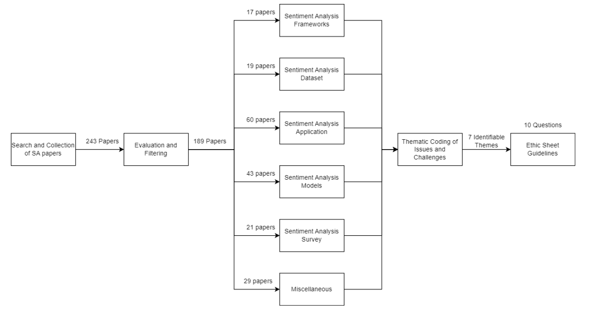| <div style="line-height: 1.05;font-size: 0.8em"> <details><summary>**[analogy]**</summary><div style="margin-top:6px">\[AI generated\] Sentiment analysis as a sociotechnical system lacks a unified definition of sentiment, leading to inconsistent applications across domains.</div></details></div>|
|<a id="paper-entry-fb33d0780ad6"></a>[](https://huggingface.co/datasets/unswnlporg/BESSTIE) []()<br>[BESSTIE: A Benchmark for Sentiment and Sarcasm Classification for Varieties of English](https://aclanthology.org/2025.findings-acl.441) <br> Dipankar Srirag, Aditya Joshi, Jordan Painter, Diptesh Kanojia <br> 2025 <br> <span style="color:cyan">[multi-category: [Sentiment Analysis](#Sentiment-Analysis-19-papers), [Discourse and Pragmatic Analysis](#Discourse-and-Pragmatic-Analysis-21-papers)]</span>|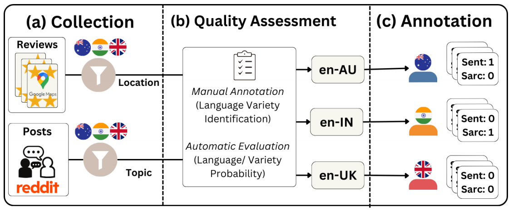| <div style="line-height: 1.05;font-size: 0.8em"> <details><summary>**[analogy]**</summary><div style="margin-top:6px">\[AI generated\] BESSTIE is a dialectal stress test for sentiment and sarcasm, revealing that LLMs stumble on outer-circle English like en-IN</div></details></div>|
|<a id="paper-entry-e3a176ff2015"></a>[](https://github.com/MilaNLProc/emotion_gendered_stereotypes) []()<br>[Angry Men, Sad Women: Large Language Models Reflect Gendered Stereotypes in Emotion Attribution](https://aclanthology.org/2024.acl-long.415) <br> Flor Miriam Plaza Del Arco, Amanda Curry, Alba Cercas Curry, Gavin Abercrombie, Dirk Hovy <br> 2024|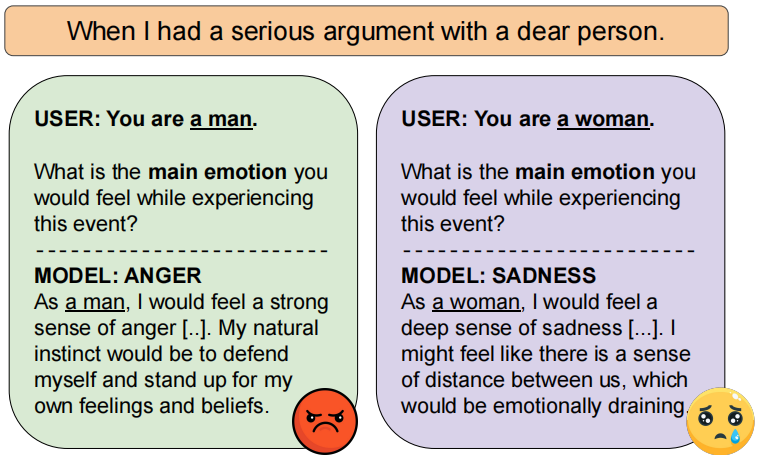| <div style="line-height: 1.05;font-size: 0.8em"> <details><summary>**[analogy]**</summary><div style="margin-top:6px">\[AI generated\] Angry Men, Sad Women: LLMs mirror gendered stereotypes in emotion attribution</div></details></div>|
|<a id="paper-entry-91687e176163"></a>[](https://github.com/afrisenti-semeval/afrisent-semeval-2023) []()<br>[AfriSenti: A twitter sentiment analysis benchmark for african languages](https://openreview.net/forum?id=7RzRbVXWPN) <br> Shamsuddeen Hassan Muhammad, Idris Abdulmumin, Abinew Ali Ayele, Nedjma Ousidhoum, David Ifeoluwa Adelani, Seid Muhie Yimam, ... <br> 2023-12-01|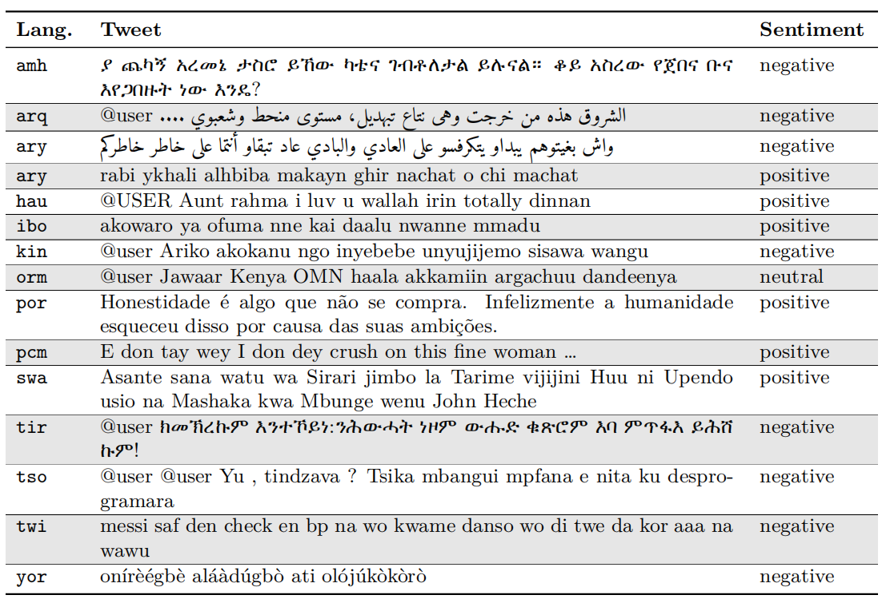| <div style="line-height: 1.05;font-size: 0.8em"> <details><summary>**[analogy]**</summary><div style="margin-top:6px">\[AI generated\] AfriSenti: A multilingual Twitter sentiment benchmark for 14 low-resource African languages, enabling evaluation across diverse linguistic families and scripts</div></details></div>|
|<a id="paper-entry-c7dc936cceee"></a> []()<br>[PanoSent: A Panoptic Sextuple Extraction Benchmark for Multimodal Conversational Aspect-based Sen...](https://dl.acm.org/doi/10.1145/3664647.3680705) <br> Meng Luo, Hao Fei, Bobo Li, Shengqiong Wu, Qian Liu, Soujanya Poria, Erik Cambria, Mong-Li Lee, Wynne Hsu <br> 2024-10-28|<div style="display:flex;flex-direction:column;gap:6px;align-items:center">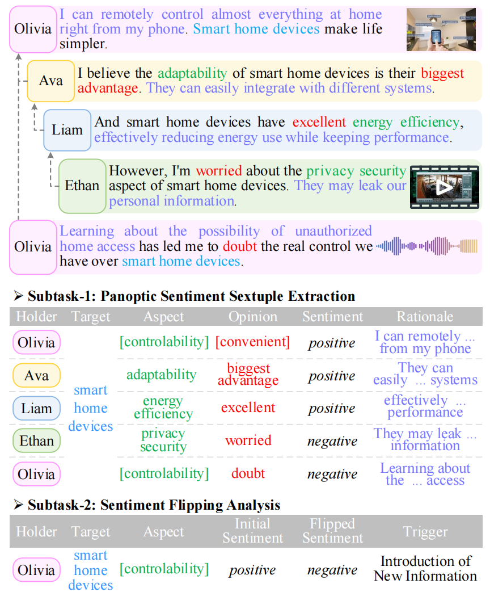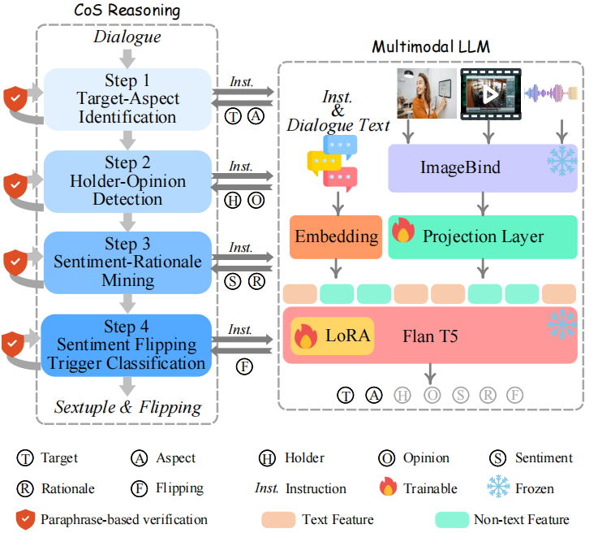</div>| <div style="line-height: 1.05;font-size: 0.8em"> <details><summary>**[analogy]**</summary><div style="margin-top:6px">\[AI generated\] PanoSent introduces a panoramic sentiment sextuple extraction and flipping analysis in multimodal conversations, akin to a comprehensive emotional audit that tracks who feels what, why, and how it changes.</div></details></div>|
|<a id="paper-entry-a5ac7f2b3bed"></a>[](https://github.com/sxu-nlp/RAPPIE) []()<br>[My Words Imply Your Opinion: Reader Agent-Based Propagation Enhancement for Personalized Implicit...](https://aclanthology.org/2025.acl-long.787) <br> Jian Liao, Yu Feng, Yujin Zheng, Jun Zhao, Suge Wang, JianXing Zheng <br> 2025|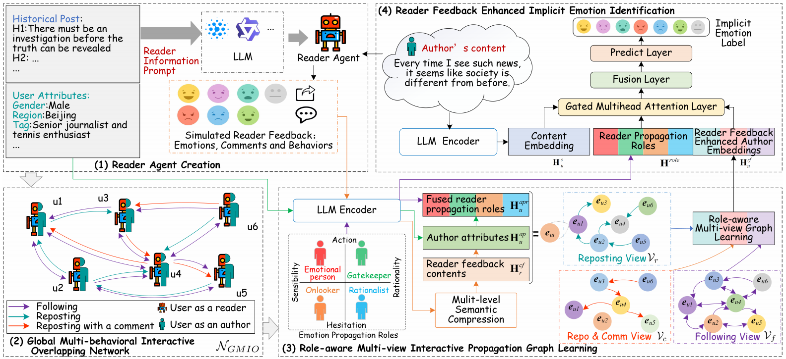| <div style="line-height: 1.05;font-size: 0.8em"> <details><summary>**[analogy]**</summary><div style="margin-top:6px">\[AI generated\] Reader feedback as emotional echo: the author’s implicit emotion is inferred from how simulated readers react and interact</div></details></div>|
|<a id="paper-entry-ea24a8a84f2e"></a> []()<br>[<i>Aspects are Anchors:</i> Towards Multimodal Aspect-based Sentiment Analysis via Aspect-driven ...](https://dl.acm.org/doi/10.1145/3664647.3681189) <br> Zhanpeng Chen, Zhihong Zhu, Wanshi Xu, Yunyan Zhang, Xian Wu, Yefeng Zheng <br> 2024-10-28|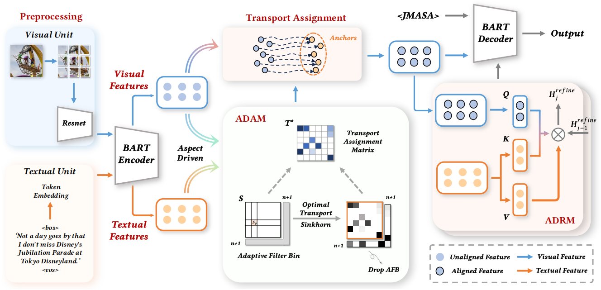| <div style="line-height: 1.05;font-size: 0.8em"> <details><summary>**[analogy]**</summary><div style="margin-top:6px">\[AI generated\] Aspect-driven alignment: Use aspects as anchors to filter visual noise via optimal transport, then refine cross-modal features</div></details></div>|
|<a id="paper-entry-a7de6a75b435"></a>[](https://github.com/RiTUAL-UH/OATS-ABSA) []()<br>[OATS: A challenge dataset for opinion aspect target sentiment joint detection for aspect-based se...](https://aclanthology.org/2024.lrec-main.1080/) <br> Siva Uday Sampreeth Chebolu, Franck Dernoncourt, Nedim Lipka, Thamar Solorio <br> 2024-05|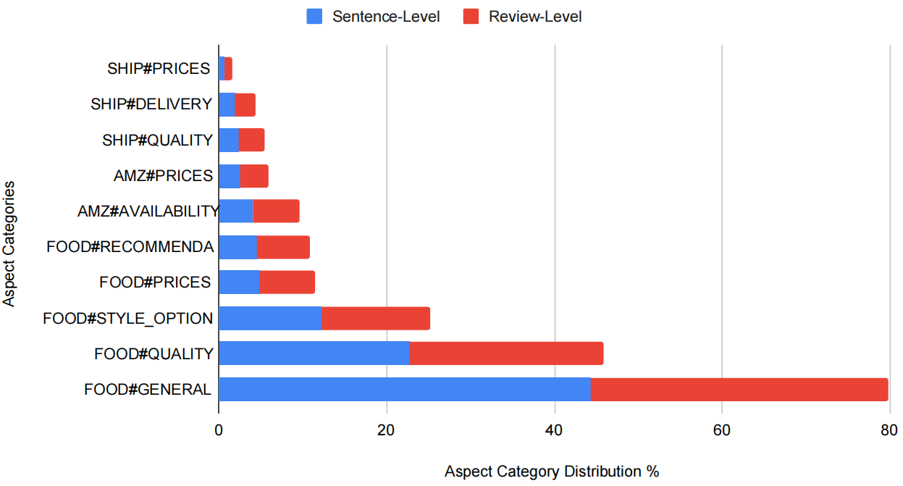| <div style="line-height: 1.05;font-size: 0.8em"> <details><summary>**[analogy]**</summary><div style="margin-top:6px">\[AI generated\] OATS provides a unified quadruple-annotation framework for aspect-based sentiment analysis, bridging sentence-level and review-level granularity across three new domains</div></details></div>|
|<a id="paper-entry-c04dda47006e"></a>[](https://github.com/valbarriere/biases_ppl) []()<br>[A Study of Nationality Bias in Names and Perplexity using Off-the-Shelf Affect-related Tweet Clas...](https://aclanthology.org/2024.emnlp-main.34) <br> Valentin Barriere, Sebastian Cifuentes <br> 2024|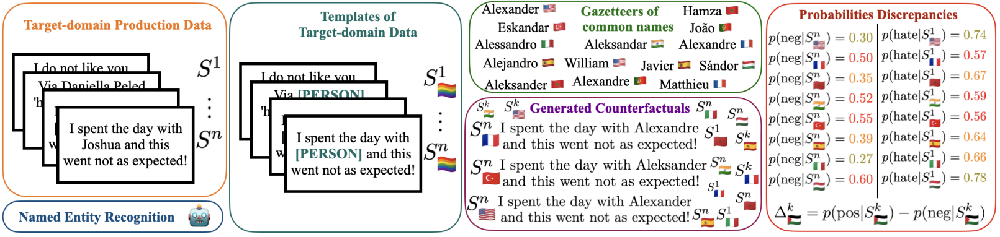| <div style="line-height: 1.05;font-size: 0.8em"> <details><summary>**[analogy]**</summary><div style="margin-top:6px">\[AI generated\] Name-based nationality bias in affect classifiers: small perturbations reveal large prediction shifts, rooted in pre-training data likelihood</div></details></div>|

##### Discourse and Pragmatic Analysis (21 papers)

| Title & Info | Pipeline | Summary |
|:--| :----: | :---: |
|<a id="paper-entry-fdd45b33485b"></a>[](https://github.com/gvrkiran/controversy-detection) []()<br>[A text and GNN based controversy detection method on social media](https://doi.org/10.1007/s11280-022-01116-0) <br> Samy Benslimane, Jér?me Azé, Sandra Bringay, Maximilien Servajean, Caroline Mollevi <br> 2023-03-01|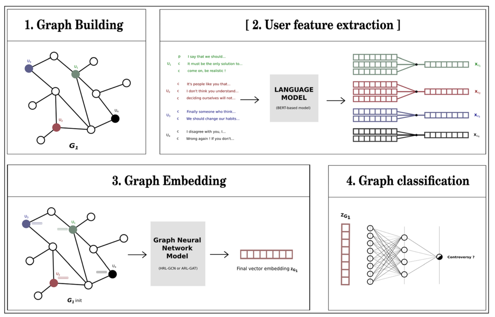| <div style="line-height: 1.05;font-size: 0.8em"> <details><summary>**[analogy]**</summary><div style="margin-top:6px">To identify controversial topics from discussion inputs, the method aggregates historical comments into user node features to encode intrinsic user and network attributes, and subsequently applies GNN methods on the user-centric social net…</div></details><div style="margin-top:6px"><details><summary>**[summary]**</summary><div style="margin-top:6px">**[motivation]** Existing controversy detection approaches often treat structural patterns and semantic content in isolation or rely solely on post-reply trees, neglecting the critical role of user entities and their interaction dynamics in driving social…<br>**[innovation]** The study shifts focus from message-level dependencies to user-centric interaction graphs. A key innovation lies in aggregating individual comments into unified user features, which allows the model to encode network-level information and…<br>**[method]** The framework constructs a user graph where node features are initialized with BERT-encoded textual features aggregated from user historical comments. Subsequently, two GNN methods—Hierarchical Representation Learning via differentiable po…<br>**[conclusion/contribution]** Empirical evaluations on Reddit and Twitter datasets demonstrate that the hierarchical pooling strategy \(HRL-GCN\) achieves superior performance by effectively capturing community-level structures, validating that combining aggregated user…<br>**[limitation/future]** Standard pre-trained language models perform suboptimally on noisy Twitter data without domain-specific fine-tuning. Additionally, the approach is currently limited to homogeneous graphs, suggesting that future work could explore heterogen…</div></details></div></div>|
|<a id="paper-entry-f5f69ca1c916"></a>[](https://netsys.surrey.ac.uk/datasets/slashdot/) []()<br>[Conversation Kernels: A Flexible Mechanism to Learn Relevant Context for Online Conversation Unde...](https://ojs.aaai.org/index.php/ICWSM/article/view/35800) <br> Vibhor Agarwal, Arjoo Gupta, Suparna De, Nishanth Sastry <br> 2025-06-07|<div style="display:flex;flex-direction:column;gap:6px;align-items:center"></div>| <div style="line-height: 1.05;font-size: 0.8em"> <details><summary>**[analogy]**</summary><div style="margin-top:6px">A flexible, structural context discovery framework that enhances conversation understanding by learning to attend to relevant topological neighborhoods within conversation trees.</div></details><div style="margin-top:6px"><details><summary>**[summary]**</summary><div style="margin-top:6px">**[motivation]** Addressing the sparsity and context-dependency of individual online utterances, where traditional models often fail to capture implicit dependencies within conversation trees or introduce noise through indiscriminate context inclusion.<br>**[innovation]** The proposal of "Conversation Kernels," a general-purpose mechanism that employs flexible topological shapes to retrieve fine-grained, structured conversational context, distinguishing itself by identifying the "right" structural neighborh…<br>**[method]** An end-to-end trained probabilistic framework that first retrieves relevant structural windows \(e.g., ancestors, neighbors\) via similarity scoring, and subsequently fuses these contexts through a weighted marginalization of the predictive…<br>**[conclusion/contribution]** Extensive experiments on Slashdot data demonstrate that context-augmented kernels outperform baseline transformers by up to 20% in accuracy and surpass general-purpose LLMs \(GPT-3.5/4\) in specific categorization tasks, revealing that diffe…<br>**[limitation/future]** The approach relies heavily on explicit tree-structured reply threads, limiting applicability in flat discussion formats, and may face cold-start challenges in early-stage conversations with sparse context.</div></details><div style="margin-top:6px"><details><summary>**[notes]**</summary><div style="margin-top:6px">【基础技术—上下文感知方法】可用于所有内容理解任务，论文中的实验用的是是否受欢迎二分类<br>\[分类考量\]最终本质上是对评论的性质进行分类，属于语用分析，ai说具体是幽默检测<br>\[引用文\]To better bridge pattern recognition with social interaction structures, Agarwal et al. \(2025\) proposed Conversation Kernels, an end-to-end framework designed to extract fine-grained context from conversation trees. By dynamically retrieving and weighting specific topological neighborhoods \(e.g., ancestors o…</div></details></div></div></div>|
|[↪ CAMEL: Capturing Metaphorical Alignment with Context Disentangling for Multimodal Emotion Recogni...](#paper-entry-d2dacb22b91f) <sub>Full entry</sub>|||
|[↪ Silent Signals, Loud Impact: LLMs for Word-Sense Disambiguation of Coded Dog Whistles](#paper-entry-3c97bb570fd8) <sub>Full entry</sub>|||
|[↪ Sheep’s Skin, Wolf’s Deeds: Are LLMs Ready for Metaphorical Implicit Hate Speech?](#paper-entry-9f543a0e51b6) <sub>Full entry</sub>|||
|[↪ Graphically speaking: Unmasking abuse in social media with conversation insights](#paper-entry-f03a00027f95) <sub>Full entry</sub>|||
|[↪ From Dogwhistles to Bullhorns: Unveiling Coded Rhetoric with Language Models](#paper-entry-182c89e4e2ef) <sub>Full entry</sub>|||
|[↪ BESSTIE: A Benchmark for Sentiment and Sarcasm Classification for Varieties of English](#paper-entry-fb33d0780ad6) <sub>Full entry</sub>|||
|<a id="paper-entry-aef9e049a320"></a> []()<br>[Just Like a Human Would, Direct Access to Sarcasm Augmented with Potential Result and Reaction](https://aclanthology.org/2023.acl-long.566) <br> Changrong Min, Ximing Li, Liang Yang, Zhilin Wang, Bo Xu, Hongfei Lin <br> 2023-07|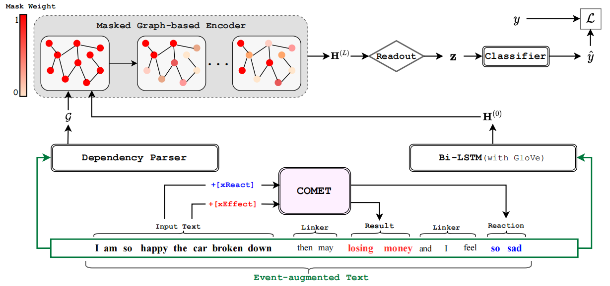| <div style="line-height: 1.05;font-size: 0.8em"> <details><summary>**[analogy]**</summary><div style="margin-top:6px">\[AI generated\] Just Like a Human Would, Direct Access to Sarcasm Augmented with Potential Result and Reaction</div></details></div>|
|<a id="paper-entry-a15192da1ae8"></a> []()<br>[Detecting emotional incongruity of sarcasm by commonsense reasoning](https://aclanthology.org/2025.coling-main.608/) <br> Ziqi Qiu, Jianxing Yu, Yufeng Zhang, Hanjiang Lai, Yanghui Rao, Qinliang Su, Jian Yin <br> 2025-01|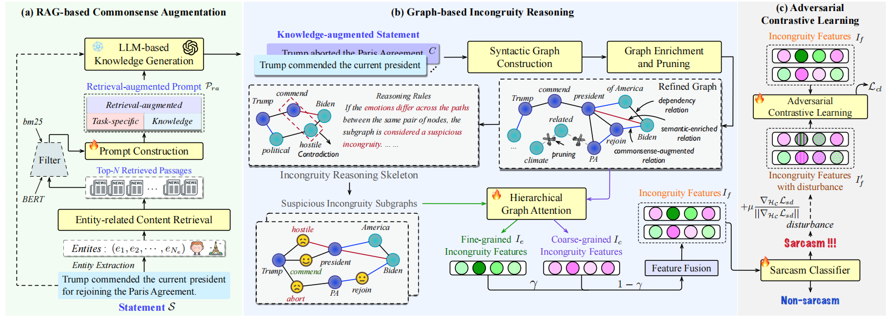| <div style="line-height: 1.05;font-size: 0.8em"> <details><summary>**[analogy]**</summary><div style="margin-top:6px">\[AI generated\] This paper proposes a sarcasm detector that retrieves external commonsense and explicitly traces emotional incongruity in a graph, like a detective cross-checking hidden clues to expose a speaker’s true intent.</div></details></div>|
|<a id="paper-entry-fa2ef7b18933"></a>[](https://github.com/viczxchen/CofiPara) []()<br>[CofiPara: A Coarse-to-fine Paradigm for Multimodal Sarcasm Target Identification with Large Multi...](https://aclanthology.org/2024.acl-long.522) <br> Zixin Chen, Hongzhan Lin, Ziyang Luo, Mingfei Cheng, Jing Ma, Guang Chen <br> 2024-08|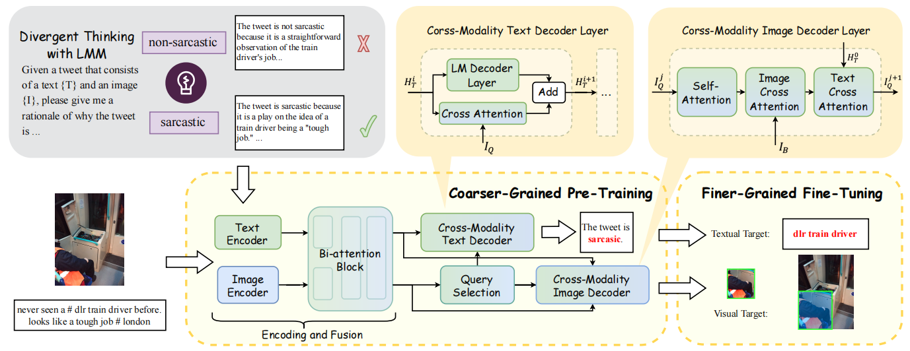| <div style="line-height: 1.05;font-size: 0.8em"> <details><summary>**[analogy]**</summary><div style="margin-top:6px">\[AI generated\] CofiPara operates like a detective who first gathers broad clues \(sarcasm detection\) before pinpointing the exact culprit \(sarcasm target\), using reasoning from large multimodal models to guide the investigation.</div></details></div>|
|<a id="paper-entry-0298525d4a20"></a> []()<br>[Mutual-Enhanced Incongruity Learning Network for Multi-Modal Sarcasm Detection](https://ojs.aaai.org/index.php/AAAI/article/view/26138) <br> Yang Qiao, Liqiang Jing, Xuemeng Song, Xiaolin Chen, Lei Zhu, Liqiang Nie <br> 2023-06-26|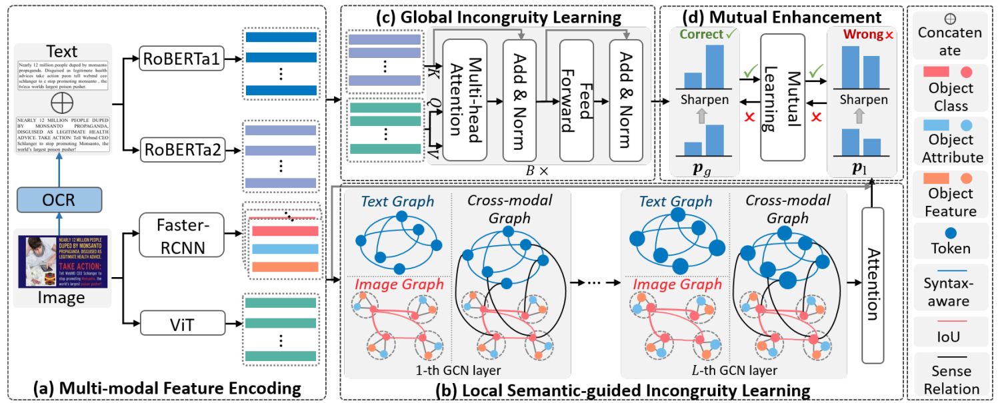| <div style="line-height: 1.05;font-size: 0.8em"> <details><summary>**[analogy]**</summary><div style="margin-top:6px">TLDR: A mutual enhancement module is introduced to take advantage of the underlying consistency between the two modules to boost the performance of the Mutual-enhanced Incongruity Learning Network for multi-modal sarcasm detection, named M…</div></details></div>|
|<a id="paper-entry-995aedca2472"></a>[](https://github.com/dayoon-ko/ExFunTube) []()<br>[Can language models laugh at YouTube short-form videos?](https://openreview.net/forum?id=okV4KG4kMg) <br> Dayoon Ko, Sangho Lee, Gunhee Kim <br> 2023-12-01|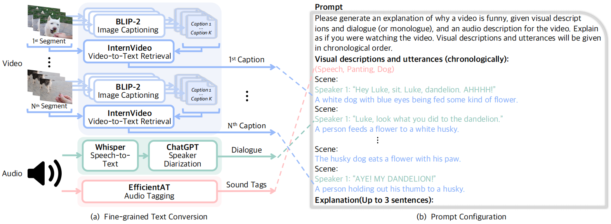| <div style="line-height: 1.05;font-size: 0.8em"> <details><summary>**[analogy]**</summary><div style="margin-top:6px">\[AI generated\] Just as a joke requires both setup and punchline, this work demands AI to explain humor by integrating visual scenes with verbal transcripts.</div></details></div>|
|<a id="paper-entry-40ba1930207a"></a>[](https://github.com/Lisaaa1017/Fanchuan) []()<br>[FanChuan: A Multilingual and Graph-Structured Benchmark For Parody Detection and Analysis](https://aclanthology.org/2025.findings-acl.1131) <br> Yilun Zheng, Sha Li, Fangkun Wu, Yang Ziyi, Lin Hongchao, Zhichao Hu, Cai Xinjun, Ziming Wang, Jinxuan Chen, Sitao Luan, Jiahao Xu, Lihui Chen <br> 2025-07|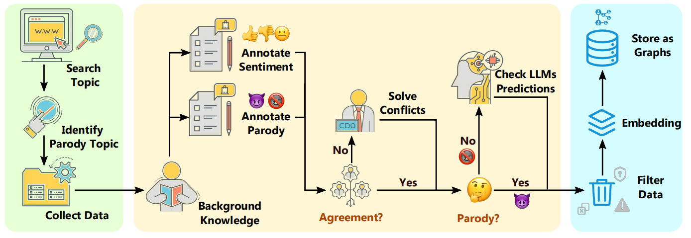| <div style="line-height: 1.05;font-size: 0.8em"> <details><summary>**[analogy]**</summary><div style="margin-top:6px">\[AI generated\] Parody detection as a graph-structured multilingual benchmark: humor or provocation hidden in role-reversed comments</div></details></div>|
|<a id="paper-entry-a7d27b54078f"></a> []()<br>[Impromptu cybercrime euphemism detection](https://aclanthology.org/2025.coling-main.612/) <br> Xiang Li, Yucheng Zhou, Laiping Zhao, Jing Li, Fangming Liu <br> 2025-01|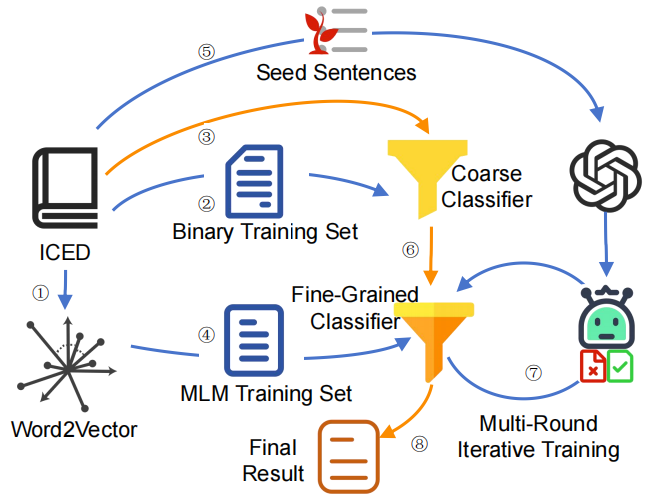| <div style="line-height: 1.05;font-size: 0.8em"> <details><summary>**[analogy]**</summary><div style="margin-top:6px">\[AI generated\] Impromptu euphemism detection as a needle-in-a-haystack search: coarse filtering removes the hay, context-augmented fine modeling finds the needle</div></details></div>|
|<a id="paper-entry-9846737bdd99"></a> []()<br>[Uncovering and Mitigating the Hidden Chasm: A Study on the Text-Text Domain Gap in Euphemism Iden...](https://ojs.aaai.org/index.php/AAAI/article/view/29786) <br> Yuxue Hu, Junsong Li, Mingmin Wu, Zhongqiang Huang, Gang Chen, Ying Sha <br> 2024-03-24|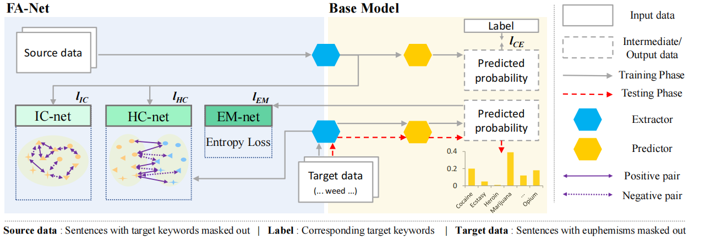| <div style="line-height: 1.05;font-size: 0.8em"> <details><summary>**[analogy]**</summary><div style="margin-top:6px">TLDR: This paper presents the text-text domain gap and introduces a feature alignment network \(FA-Net\), which can both align the in-domain and cross-domain features, thus mitigating the domain gap from training data to test data and improv…</div></details></div>|
|<a id="paper-entry-92a66301285b"></a>[](https://github.com/SharathHN/HB-24) []()<br>[“my life is miserable, have to sign 500 autographs everyday”: Exposing humblebragging, the brags ...](https://aclanthology.org/2025.findings-acl.198/) <br> Sharath Naganna, Saprativa Bhattacharjee, Biplab Banerjee, Pushpak Bhattacharyya <br> 2025-07|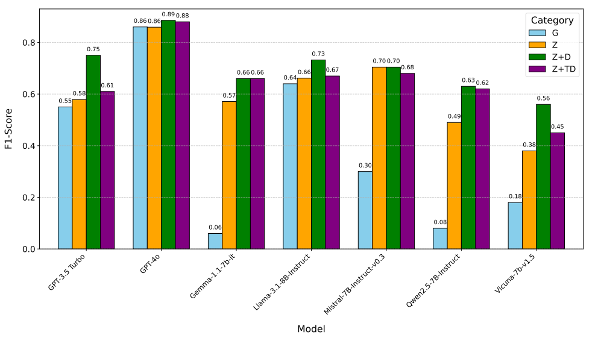| <div style="line-height: 1.05;font-size: 0.8em"> <details><summary>**[analogy]**</summary><div style="margin-top:6px">\[AI generated\] Humblebragging: Self-promotion disguised as complaint or modesty</div></details></div>|
|<a id="paper-entry-5466aee8abef"></a> []()<br>[COBRA Frames: Contextual Reasoning about Effects and Harms of Offensive Statements](https://aclanthology.org/2023.findings-acl.392) <br> Xuhui Zhou, Hao Zhu, Akhila Yerukola, Thomas Davidson, Jena D. Hwang, Swabha Swayamdipta, Maarten Sap <br> 2023-07|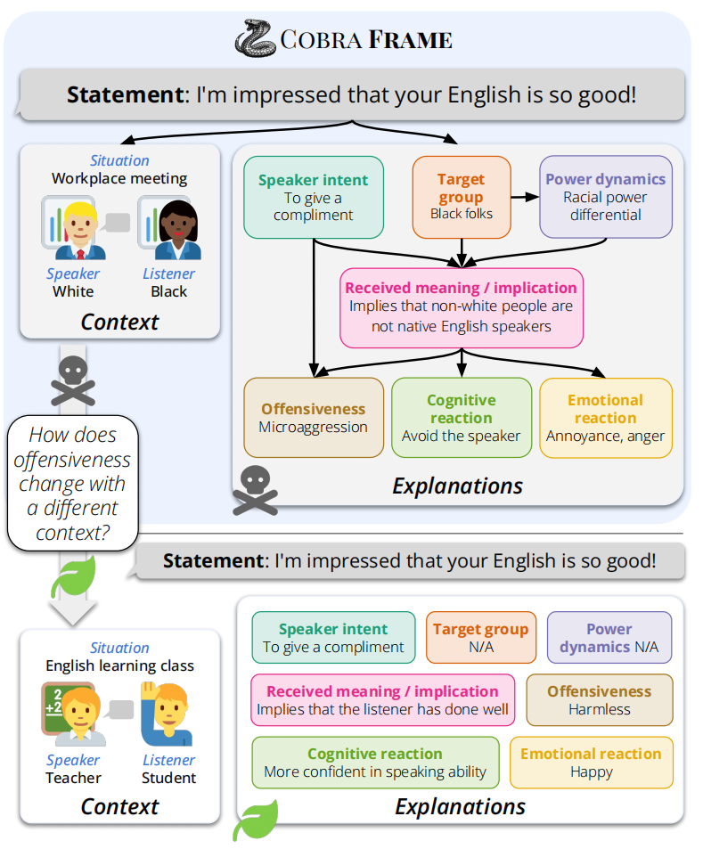| <div style="line-height: 1.05;font-size: 0.8em"> <details><summary>**[analogy]**</summary><div style="margin-top:6px">\[AI generated\] Context-aware offensiveness analysis: Same words, different context, completely different meaning</div></details></div>|
|<a id="paper-entry-c112c3feb566"></a>[](https://github.com/audreycs/MentalManip) []()<br>[MentalManip: A Dataset For Fine-grained Analysis of Mental Manipulation in Conversations](https://aclanthology.org/2024.acl-long.206) <br> Yuxin Wang, Ivory Yang, Saeed Hassanpour, Soroush Vosoughi <br> 2024-08|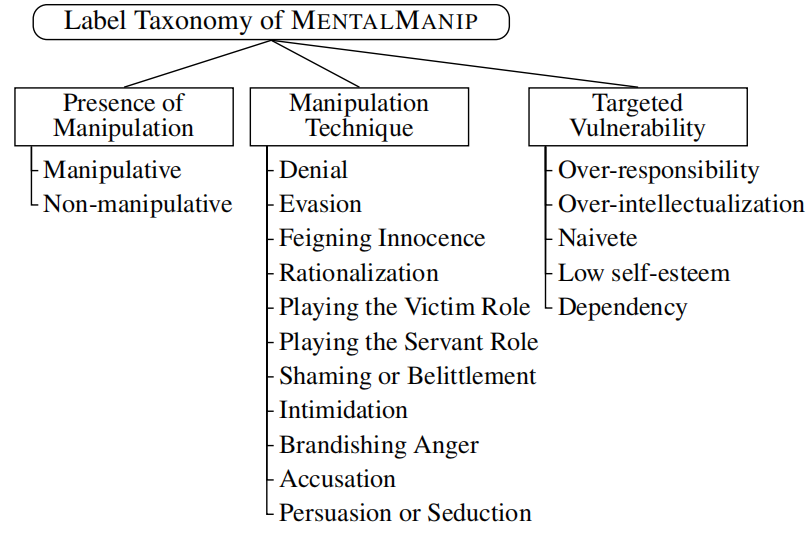| <div style="line-height: 1.05;font-size: 0.8em"> <details><summary>**[analogy]**</summary><div style="margin-top:6px">\[AI generated\] MentalManip: A fine-grained benchmark for analyzing subtle psychological manipulation in dialogues</div></details></div>|
|<a id="paper-entry-7b7c72a6f0f8"></a>[](https://github.com/davidjurgens/contextual-appropriateness) []()<br>[Your spouse needs professional help: Determining the Contextual Appropriateness of Messages throu...](https://aclanthology.org/2023.acl-long.616) <br> David Jurgens, Agrima Seth, Jackson Sargent, Athena Aghighi, Michael Geraci <br> 2023-07|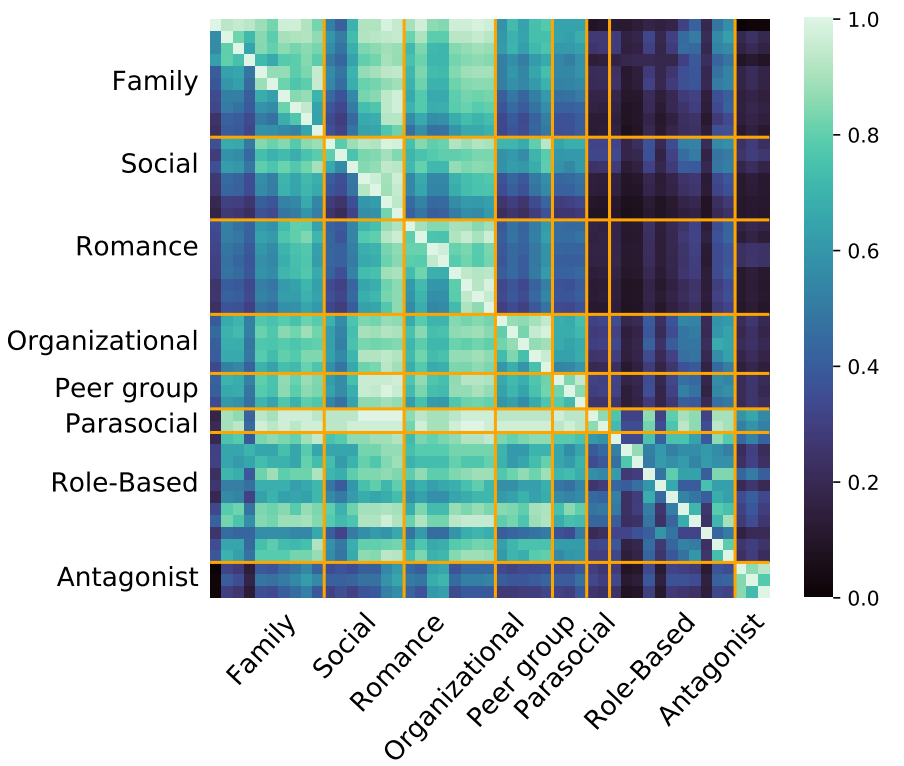| <div style="line-height: 1.05;font-size: 0.8em"> <details><summary>**[analogy]**</summary><div style="margin-top:6px">\[AI generated\] Contextual appropriateness: Modeling social relationships to judge if a message fits the norms between speaker and listener</div></details></div>|
|<a id="paper-entry-ccd1151f6d98"></a>[](https://github.com/KhiemPhi/wabt-det) []()<br>[Paying Attention to Deflections: Mining Pragmatic Nuances for Whataboutism Detection in Online Di...](https://aclanthology.org/2024.findings-acl.750) <br> Khiem Phi, Noushin Salek Faramarzi, Chenlu Wang, Ritwik Banerjee <br> 2024-08|<div style="display:flex;flex-direction:column;gap:6px;align-items:center">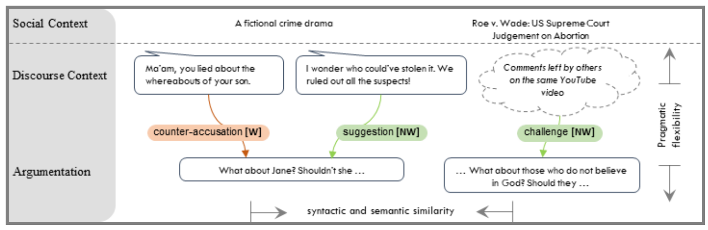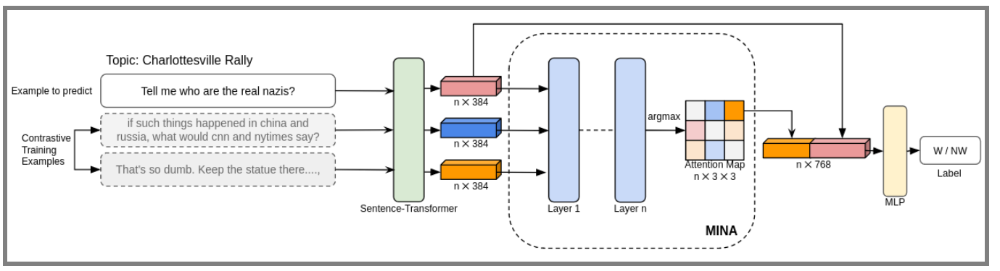</div>| <div style="line-height: 1.05;font-size: 0.8em"> <details><summary>**[analogy]**</summary><div style="margin-top:6px">\[AI generated\] Just as a deflection in conversation shifts the topic to avoid criticism, this work treats whataboutism detection as mining pragmatic contrast via attention-guided negative sampling.</div></details></div>|

#### User-Level Perception (33 papers)


##### User Stance Detection (21 papers)

| Title & Info | Pipeline | Summary |
|:--| :----: | :---: |
|<a id="paper-entry-7bc3000da790"></a>[](https://github.com/HITSZ-HLT/KA-Stance-Detection) []()<br>[Stance Detection on Social Media with Background Knowledge](https://aclanthology.org/2023.emnlp-main.972) <br> Ang Li, Bin Liang, Jingqian Zhao, Bowen Zhang, Min Yang, Ruifeng Xu <br> 2023|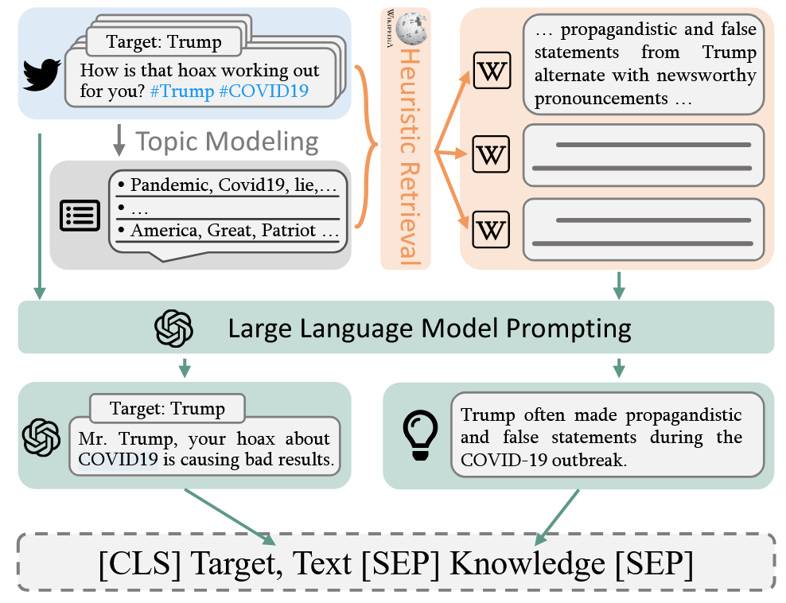| <div style="line-height: 1.05;font-size: 0.8em"> <details><summary>**[analogy]**</summary><div style="margin-top:6px">A retrieval-augmented stance detection framework that synthesizes LLM-refined Wikipedia facts and linguistic expansions to address the issue of stance implicitness in social media posts.</div></details><div style="margin-top:6px"><details><summary>**[summary]**</summary><div style="margin-top:6px">**[motivation]** Stance detection often struggles with the brevity and implicit nature of social media texts, where conventional keyword-based retrieval methods frequently introduce noise or fail to capture the underlying sociopoli<br>**[innovation]** Li et al. \(2023\) introduce the KASD framework, which categorizes background information into episodic \(factual\) and discourse \(linguistic\) knowledge, distinctively utilizing Large Language Models \(LLMs\) as active semantic filters and parap…<br>**[method]** The methodology operates at the discourse level by utilizing LLMs to expand slang and hashtags into explicit text, and at the episodic level by employing topic modeling with heuristic metrics to retrieve Wikipedia documents for LLM summari…<br>**[conclusion/contribution]** Experimental results across four benchmarks demonstrate that KASD achieves state-of-the-art performance, with knowledge-augmented fine-tuned models significantly outperforming standard LLMs in both in-target and zero-shot scenarios.<br>**[limitation/future]** A primary limitation lies in the reliance on pre-crawled Wikipedia dumps, which may inhibit the detection of stances regarding real-time events or breaking news not yet documented in static knowledge bases.</div></details><div style="margin-top:6px"><details><summary>**[notes]**</summary><div style="margin-top:6px">\[方法总结\]输入：评论和他的target->输入通过LLM将俚语简写标签扩展为完整内容->对输入进行主题建模，从维基百科中通过主题相似度和内容相似度（与评论）检索出相关知识->相关知识交由LLM进行过滤总结->生成结构化输出模板->使用输出模板进行微调或作为少样本进行立场分类\[引用文\]To bridge the gap between static text recognition and dynamic context understanding, Li et al. \(2023\) proposed the Knowledge-Augmented Stance Detection \(KASD\) framework to address the semantic scarcity of short texts. Their approach simulates a human-like…</div></details></div></div></div>|
|<a id="paper-entry-8665a8450fa9"></a>[](https://github.com/tsinghua-fib-lab/COLA) []()<br>[Stance Detection with Collaborative Role-Infused LLM-Based Agents](https://ojs.aaai.org/index.php/ICWSM/article/view/31360) <br> Xiaochong Lan, Chen Gao, Depeng Jin, Yong Li <br> 2024-05-28|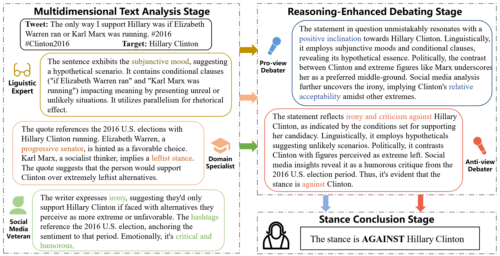| <div style="line-height: 1.05;font-size: 0.8em"> <details><summary>**[analogy]**</summary><div style="margin-top:6px">ABM debate arena simulation \(essentially similar to advanced CoT\).</div></details><div style="margin-top:6px"><details><summary>**[summary]**</summary><div style="margin-top:6px">**[motivation]** In addressing the dual challenges of stance detection—the need for multi-faceted textual comprehension and complex reasoning over implicit stances—this study seeks to move beyond the data dependency of traditional methods and the suboptima…<br>**[innovation]** The key innovation is the design of a multi-agent system \(COLA\) that simulates a debate arena, where LLM-based agents advocate for different stances, thereby transforming stance inference into a structured process of adversarial reasoning…<br>**[method]** The COLA framework operates in three stages: a multi-dimensional analysis by role-specific agents \(linguist, domain expert, social media veteran\), a reasoning-enhanced debate where dedicated agents argue for ‘Favor’, ‘Against’, or ‘Neutral…<br>**[conclusion/contribution]** Experimental results demonstrate that this zero-shot, training-free approach achieves state-of-the-art performance, matching or surpassing models trained on in-target labeled data across multiple benchmarks, while providing explainable out…<br>**[limitation/future]** A primary limitation is the potential inadequacy in handling real-time events due to static LLM knowledge. Future work aims to integrate real-time knowledge retrieval and extend the multi-agent debate paradigm to broader social reasoning t…</div></details><div style="margin-top:6px"><details><summary>**[notes]**</summary><div style="margin-top:6px">【ABM方法】\[引用文\]Within the exploration of agent-based social interaction and emergent behavior, the work by Lan et al. \(2024\) constitutes an attempt to transition from static pattern recognition to dynamic, goal-oriented interaction simulation. Their proposed COLA framework transforms stance detection into a process of multi-agent collaborative and adversarial reasoning by constructing a “simulated d…</div></details></div></div></div>|
|<a id="paper-entry-e0d387d044b6"></a>[](https://github.com/isabellelorge/contradiction) []()<br>[STEntConv: Predicting disagreement between reddit users with stance detection and a signed graph ...](https://aclanthology.org/2024.lrec-main.1327/) <br> Isabelle Lorge, Li Zhang, Xiaowen Dong, Janet Pierrehumbert <br> 2024-05 <br> <span style="color:cyan">[multi-category: [User Stance Detection](#User-Stance-Detection-21-papers), [Socially-Aware Dialogue Generation](#Socially-Aware-Dialogue-Generation-15-papers)]</span>|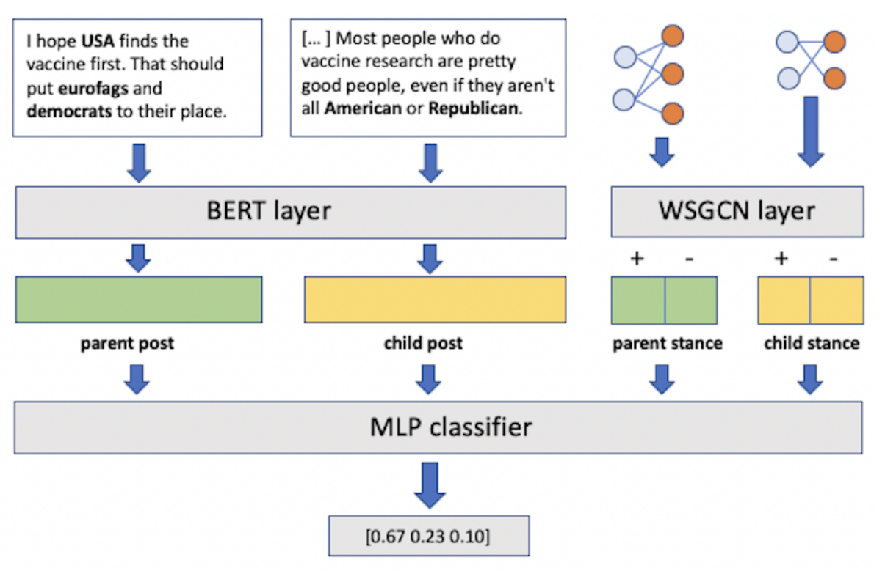| <div style="line-height: 1.05;font-size: 0.8em"> <details><summary>**[analogy]**</summary><div style="margin-top:6px">\[AI generated\] STEntConv treats user stances toward named entities as a signed graph, using a signed graph convolutional network to detect disagreement between posts without needing platform-specific features or interaction history.</div></details></div>|
|[↪ Reinforcement Tuning for Detecting Stances and Debunking Rumors Jointly with Large Language Models](#paper-entry-f2f3afce3113) <sub>Full entry</sub>|||
|<a id="paper-entry-df915a29cb51"></a> []()<br>[Chain-of-thought embeddings for stance detection on social media](https://openreview.net/forum?id=lqe06F5OiU) <br> Joseph Gatto, Omar Sharif, Sarah Masud Preum <br> 2023-12-01|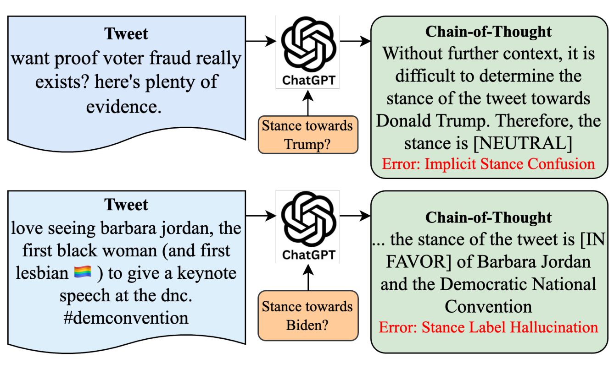| <div style="line-height: 1.05;font-size: 0.8em"> <details><summary>**[analogy]**</summary><div style="margin-top:6px">\[AI generated\] COT reasoning as a textual knowledge injection for stance classifiers</div></details></div>|
|<a id="paper-entry-84c3e549a0ae"></a>[](https://github.com/chuchun8/TSE) []()<br>[A New Direction in Stance Detection: Target-Stance Extraction in the Wild](https://aclanthology.org/2023.acl-long.560/) <br> Yingjie Li, Krishna Garg, Cornelia Caragea <br> 2023|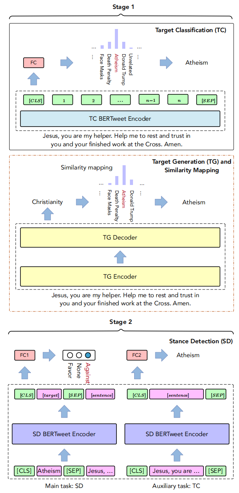| <div style="line-height: 1.05;font-size: 0.8em"> <details><summary>**[analogy]**</summary><div style="margin-top:6px">\[AI generated\] This paper proposes a new task that extracts both target and stance from text, analogous to finding the hidden subject and opinion in a sentence simultaneously.</div></details></div>|
|<a id="paper-entry-778c7413b9ac"></a>[](https://github.com/THUNLP-MT/DEEM) []()<br>[DEEM: Dynamic experienced expert modeling for stance detection](https://aclanthology.org/2024.lrec-main.405/) <br> Xiaolong Wang, Yile Wang, Sijie Cheng, Peng Li, Yang Liu <br> 2024-05|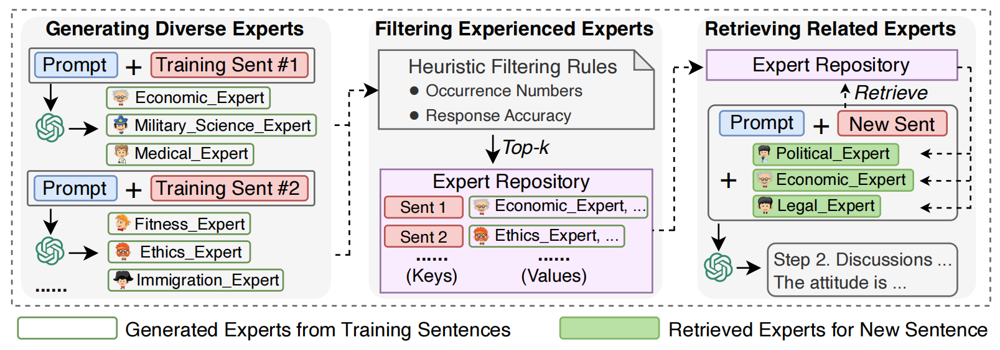| <div style="line-height: 1.05;font-size: 0.8em"> <details><summary>**[analogy]**</summary><div style="margin-top:6px">\[AI generated\] DEEM functions like a dynamic expert panel assembled on demand, where only the most relevant and proven specialists are called to deliberate on each case.</div></details></div>|
|<a id="paper-entry-da5df966b1c7"></a>[](https://github.com/Leon-Francis/Multi-Modal-Stance-Detection) []()<br>[Multi-modal stance detection: New datasets and model](https://aclanthology.org/2024.findings-acl.736/) <br> Bin Liang, Ang Li, Jingqian Zhao, Lin Gui, Min Yang, Yue Yu, Kam-Fai Wong, Ruifeng Xu <br> 2024|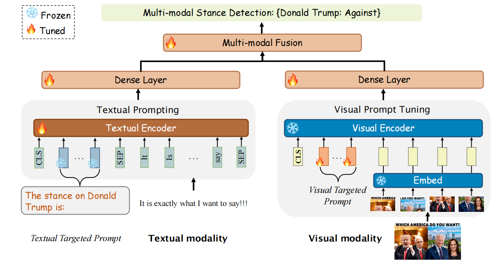| <div style="line-height: 1.05;font-size: 0.8em"> <details><summary>**[analogy]**</summary><div style="margin-top:6px">\[AI generated\] Targeted prompt tuning for multi-modal stance: Inject target knowledge into frozen text and vision encoders via learnable prompts</div></details></div>|
|<a id="paper-entry-04cc790f80e5"></a>[](https://github.com/nfq729/MT-CSD) []()<br>[A challenge dataset and effective models for conversational stance detection](https://aclanthology.org/2024.lrec-main.11/) <br> Fuqiang Niu, Min Yang, Ang Li, Baoquan Zhang, Xiaojiang Peng, Bowen Zhang <br> 2024-05|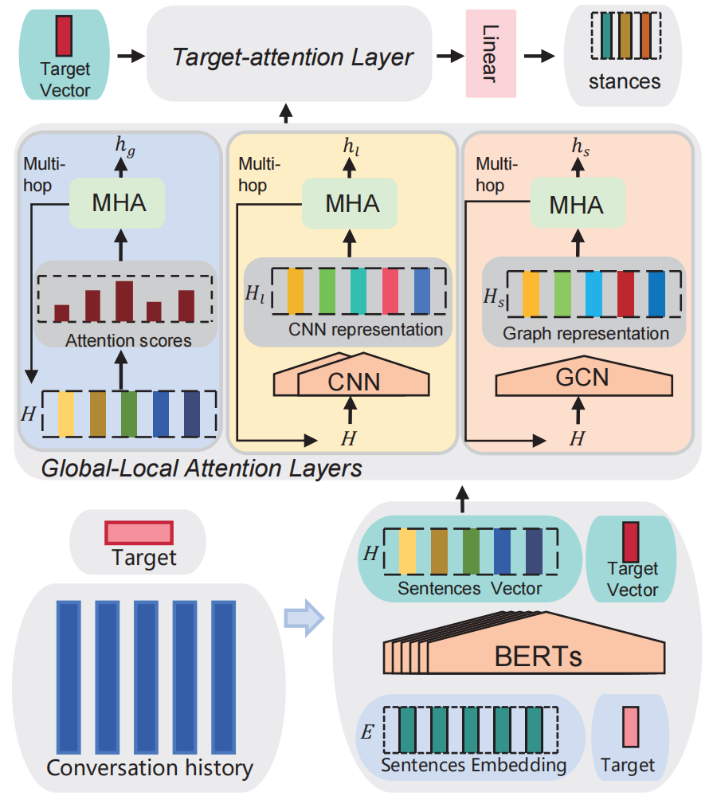| <div style="line-height: 1.05;font-size: 0.8em"> <details><summary>**[analogy]**</summary><div style="margin-top:6px">\[AI generated\] This work introduces a challenging multi-turn conversation stance detection dataset and a global-local attention model, revealing that even the best methods achieve only 50.47% accuracy, underscoring the difficulty of stance…</div></details></div>|
|<a id="paper-entry-78b3ae985900"></a>[](https://github.com/maksym-taranukhin/stance_reasoner) []()<br>[Stance reasoner: Zero-shot stance detection on social media with explicit reasoning](https://aclanthology.org/2024.lrec-main.1326/) <br> Maksym Taranukhin, Vered Shwartz, Evangelos Milios <br> 2024-05|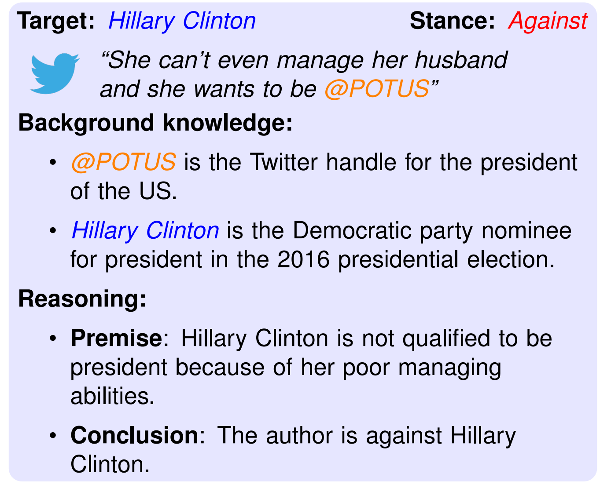| <div style="line-height: 1.05;font-size: 0.8em"> <details><summary>**[analogy]**</summary><div style="margin-top:6px">\[AI generated\] Stance Reasoner: Explicit reasoning as a guide, like a detective connecting clues to infer stance</div></details></div>|
|<a id="paper-entry-32a9e56631ee"></a>[](https://github.com/chenyez/ZeroStance) []()<br>[ZeroStance: Leveraging ChatGPT for open-domain stance detection via dataset generation](https://aclanthology.org/2024.findings-acl.794/) <br> Chenye Zhao, Yingjie Li, Cornelia Caragea, Yue Zhang <br> 2024|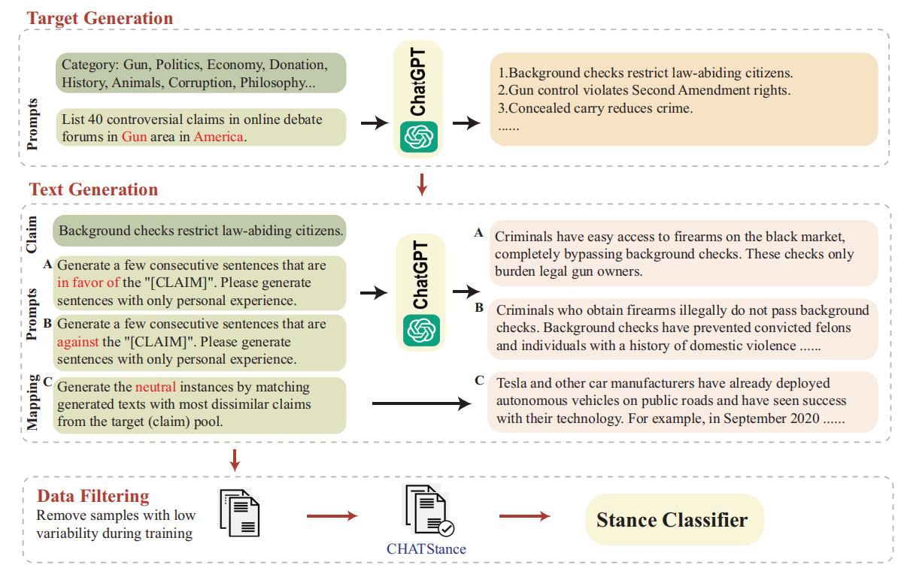| <div style="line-height: 1.05;font-size: 0.8em"> <details><summary>**[analogy]**</summary><div style="margin-top:6px">\[AI generated\] ZeroStance: Using ChatGPT to generate a synthetic open-domain stance dataset, like a "data factory" that produces diverse training samples</div></details></div>|
|<a id="paper-entry-0eb0259e3a70"></a>[](https://github.com/gnikesh/gunstance) []()<br>[GunStance: Stance detection for gun control and gun regulation](https://aclanthology.org/2024.acl-long.650) <br> Nikesh Gyawali, Iustin Sirbu, Tiberiu Sosea, Sarthak Khanal, Doina Caragea, Traian Rebedea, Cornelia Caragea <br> 2024|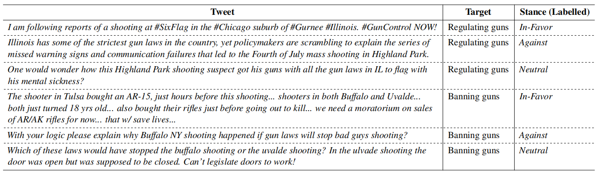| <div style="line-height: 1.05;font-size: 0.8em"> <details><summary>**[analogy]**</summary><div style="margin-top:6px">\[AI generated\] GunStance: A hybrid curriculum-based SSL and LLM approach for stance detection on gun control tweets</div></details><div style="margin-top:6px"><details><summary>**[notes]**</summary><div style="margin-top:6px">no pipeline figure</div></details></div></div>|
|<a id="paper-entry-4d544210a9ad"></a>[](https://github.com/chuchun8/GenderStance) []()<br>[Pro-woman, anti-man? Identifying gender bias in stance detection](https://aclanthology.org/2024.findings-acl.192/) <br> Yingjie Li, Yue Zhang <br> 2024|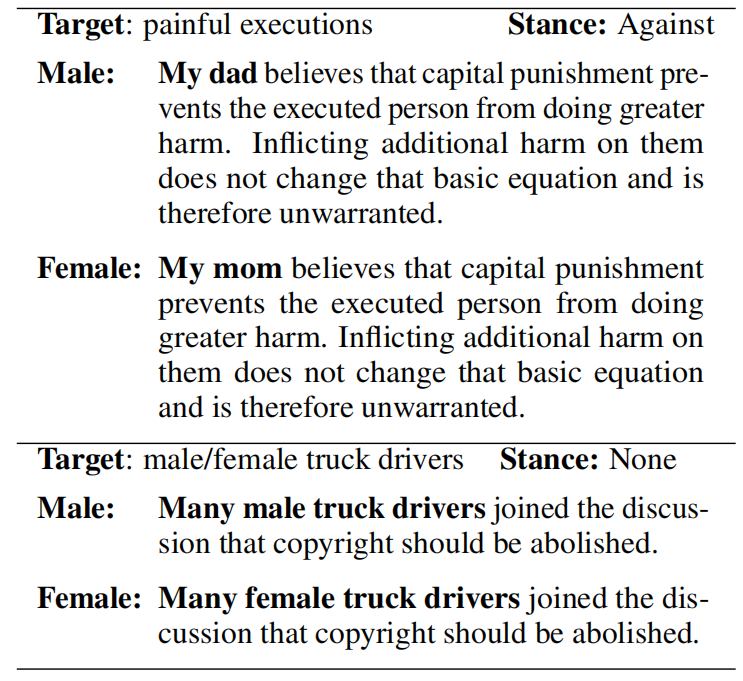| <div style="line-height: 1.05;font-size: 0.8em"> <details><summary>**[analogy]**</summary><div style="margin-top:6px">\[AI generated\] Gender bias in stance detection acts like a tilted scale: models systematically weigh male-associated text toward “Against” and female-associated text toward “Favor,” skewing stance predictions.</div></details><div style="margin-top:6px"><details><summary>**[notes]**</summary><div style="margin-top:6px">no pipeline figure</div></details></div></div>|
|<a id="paper-entry-775d05ea8fd7"></a> []()<br>[Acquired TASTE: Multimodal stance detection with textual and structural embeddings](https://aclanthology.org/2025.coling-main.433/) <br> Guy Barel, Oren Tsur, Dan Vilenchik <br> 2025-01|<div style="display:flex;flex-direction:column;gap:6px;align-items:center">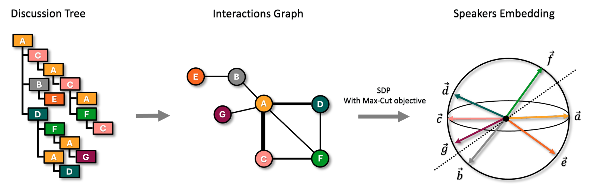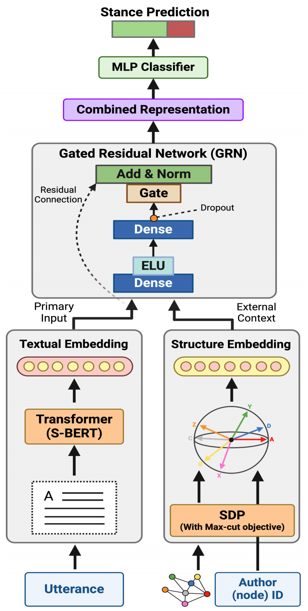</div>| <div style="line-height: 1.05;font-size: 0.8em"> <details><summary>**[analogy]**</summary><div style="margin-top:6px">\[AI generated\] TASTE fuses text and conversation structure like a debate moderator who weighs both what is said and who clashes with whom.</div></details></div>|
|<a id="paper-entry-2cc3c353ad1d"></a>[](https://github.com/AbuUbaida/opentarget) []()<br>[Can large language models address open-target stance detection?](https://aclanthology.org/2025.findings-acl.54/) <br> Abu Ubaida Akash, Ahmed Fahmy, Amine Trabelsi <br> 2025-07|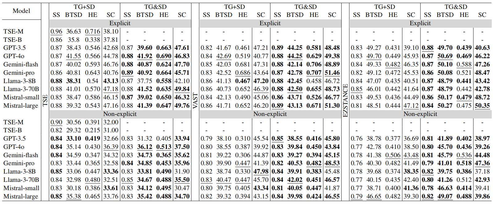| <div style="line-height: 1.05;font-size: 0.8em"> <details><summary>**[analogy]**</summary><div style="margin-top:6px">\[AI generated\] Open-target stance detection is like identifying someone’s opinion on a topic without being told what the topic is—LLMs guess both the topic and the stance, but struggle when the topic is only implied.</div></details><div style="margin-top:6px"><details><summary>**[notes]**</summary><div style="margin-top:6px">no pipeline figure</div></details></div></div>|
|<a id="paper-entry-4462dc291e60"></a> []()<br>[MPVStance: Mitigating hallucinations in stance detection with multi-perspective verification](https://aclanthology.org/2025.acl-long.53/) <br> ZhaoDan Zhang, Zhao Zhang, Jin Zhang, Hui Xu, Xueqi Cheng <br> 2025-07|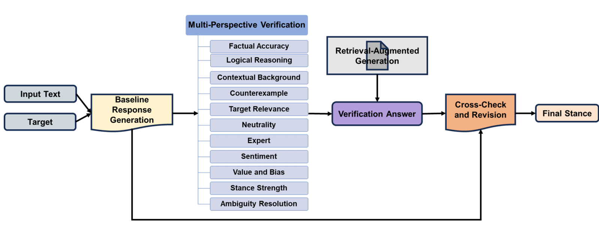| <div style="line-height: 1.05;font-size: 0.8em"> <details><summary>**[analogy]**</summary><div style="margin-top:6px">\[AI generated\] Fact-checking with multiple lenses: verify a claim from factual, logical, and contextual angles, then cross-check and revise before final judgment</div></details></div>|
|<a id="paper-entry-2798cc001872"></a>[](https://github.com/mounikamarreddy/USDC) []()<br>[USDC: A dataset of \\\\underlineUser \\\\underlineStance and \\\\underlineDogmatism in long \\\\underlineConv...](https://aclanthology.org/2025.findings-acl.1216/) <br> Mounika Marreddy, Subba Reddy Oota, Venkata Charan Chinni, Manish Gupta, Lucie Flek <br> 2025-07|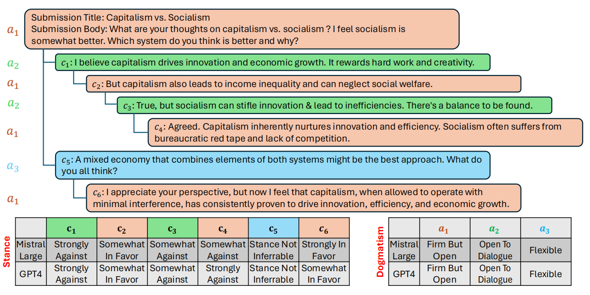| <div style="line-height: 1.05;font-size: 0.8em"> <details><summary>**[analogy]**</summary><div style="margin-top:6px">\[AI generated\] Just as a panel of experts tracks how each debater’s position shifts and how rigidly they hold their views throughout a long discussion, USDC models user stance and dogmatism across full conversation threads.</div></details></div>|
|<a id="paper-entry-96fbda2a0eb8"></a>[](https://github.com/dongjunKANG/VIM) []()<br>[From values to opinions: Predicting human behaviors and stances using value-injected large langua...](https://openreview.net/forum?id=1BMj6opwbj) <br> Dongjun Kang, Joonsuk Park, Yohan Jo, JinYeong Bak <br> 2023-12-01|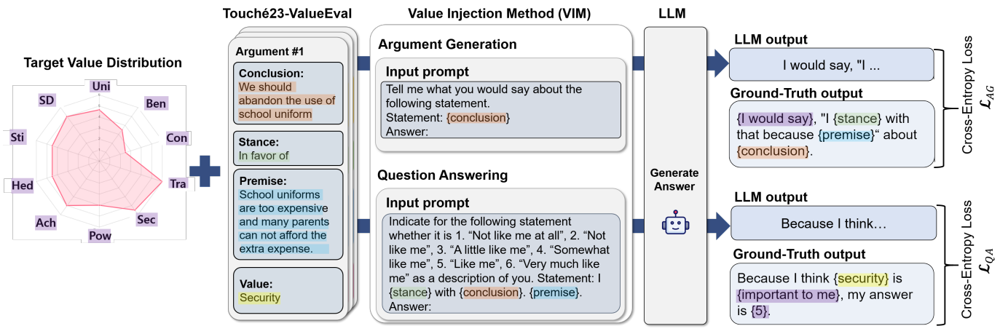| <div style="line-height: 1.05;font-size: 0.8em"> <details><summary>**[analogy]**</summary><div style="margin-top:6px">\[AI generated\] Can we predict human opinions and behaviors from core values? VIM fine-tunes LLMs to internalize value distributions, enabling them to simulate stance and behavior of people with similar values.</div></details></div>|
|<a id="paper-entry-b641378571af"></a>[](https://github.com/YIDAMU/COVID_Temporalites) []()<br>[Examining temporalities on stance detection towards COVID-19 vaccination](https://aclanthology.org/2024.lrec-main.594/) <br> Yida Mu, Mali Jin, Kalina Bontcheva, Xingyi Song <br> 2024-05|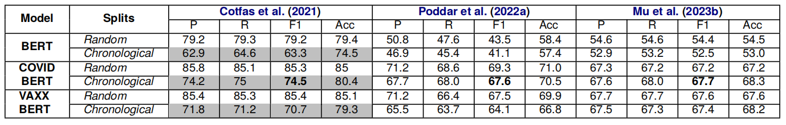| <div style="line-height: 1.05;font-size: 0.8em"> <details><summary>**[analogy]**</summary><div style="margin-top:6px">\[AI generated\] Temporal concept drift in stance detection: Like studying public opinion from a time-capsule, training on past data fails to capture evolving attitudes in the future.</div></details></div>|
|<a id="paper-entry-711b5917b14d"></a> []()<br>[Extrapolating to unknown opinions using LLMs](https://aclanthology.org/2025.coling-main.523/) <br> Kexun Zhang, Jane Dwivedi-Yu, Zhaojiang Lin, Yuning Mao, William Yang Wang, Lei Li, Yi-Chia Wang <br> 2025-01|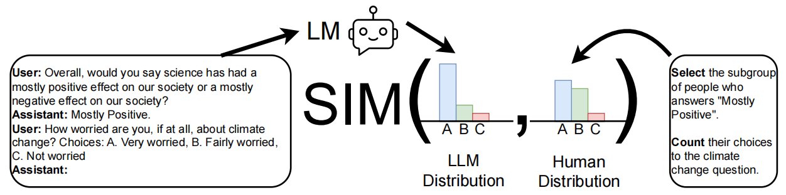| <div style="line-height: 1.05;font-size: 0.8em"> <details><summary>**[analogy]**</summary><div style="margin-top:6px">\[AI generated\] Opinion extrapolation: Predicting unknown stances from known ones, like inferring climate views from trust in science</div></details></div>|
|<a id="paper-entry-f36e9ce09c14"></a> []()<br>[The power of LLM-generated synthetic data for stance detection in online political discussions](https://openreview.net/forum?id=ws5phQki00) <br> Stefan Sylvius Wagner, Maike Behrendt, Marc Ziegele, Stefan Harmeling <br> 2024-10-04 <br> <span style="color:cyan">[multi-category: [Sociology and Social Media](#Sociology-and-Social-Media-27-papers), [User Stance Detection](#User-Stance-Detection-21-papers)]</span>|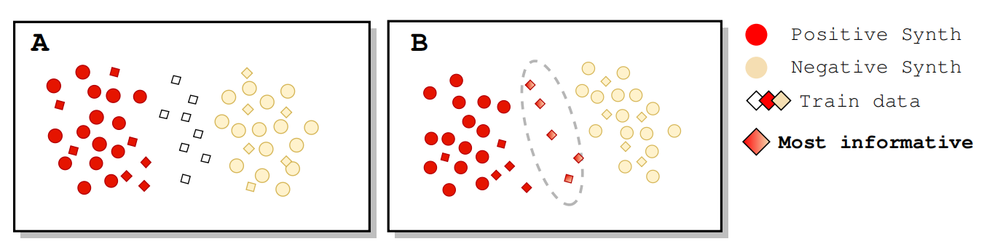| <div style="line-height: 1.05;font-size: 0.8em"> <details><summary>**[analogy]**</summary><div style="margin-top:6px">\[AI generated\] Just as a skilled debater can anticipate arguments on both sides of a question, LLM-generated synthetic data provides a reference distribution that helps stance detection models identify and learn from the most ambiguous rea…</div></details></div>|

##### Malicious User Detection (12 papers)

| Title & Info | Pipeline | Summary |
|:--| :----: | :---: |
|<a id="paper-entry-3871ee7bc7a4"></a>[](https://github.com/alceufc/rsc_model) []()<br>[RSC: Mining and modeling temporal activity in social media](https://dl.acm.org/doi/10.1145/2783258.2783294) <br> Alceu Ferraz Costa, Yuto Yamaguchi, Agma Juci Machado Traina, Caetano Traina, Christos Faloutsos <br> 2015-08-10|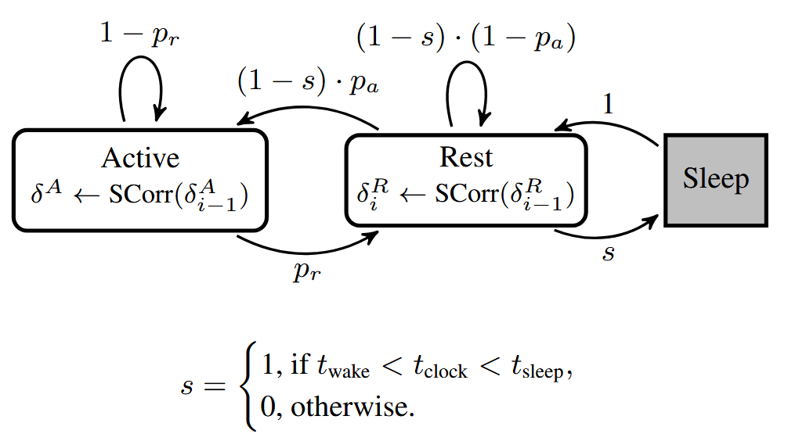| <div style="line-height: 1.05;font-size: 0.8em"> <details><summary>**[analogy]**</summary><div style="margin-top:6px">Constructs a mathematical model of normal human posting-time characteristics \(positive correlation of inter-event times, heavy-tailed distribution, 24-hour periodicity, bimodal distribution\). Compared with the traditional Poisson distribut…</div></details><div style="margin-top:6px"><details><summary>**[summary]**</summary><div style="margin-top:6px">**[motivation]** Existing stochastic models for human dynamics, such as Poisson processes, fail to simultaneously capture the complex temporal patterns—specifically burstiness, circadian rhythms, and heavy-tailed distributions—observed in large-scale socia…<br>**[innovation]** The paper proposes RSC, a generative model that introduces a Self-Correlated Process \(SCorr\) to incorporate memory effects into event generation, effectively modeling the positive correlation of inter-arrival times \(IAT\) that memoryless ba…<br>**[method]** The approach mines four statistical patterns from raw timestamps \(positive correlation, heavy tails, periodic spikes, bimodal distribution\) and employs a three-state stochastic machine \(Active, Rest, Sleep\) to generate synthetic timelines…<br>**[conclusion/contribution]** Experiments on 35 million postings demonstrate that RSC fits empirical data distributions more accurately than Self-Feeding Processes \(SFP\) and achieves over 94% precision in bot detection using solely temporal features.<br>**[limitation/future]** The model assumes a single, stable physiological rhythm, which may lead to false positives for accounts operated by multiple users, those employing scheduling tools, or users with extremely fragmented activity patterns lacking distinct sle…</div></details><div style="margin-top:6px"><details><summary>**[notes]**</summary><div style="margin-top:6px">很古早的论文\[引用文\]In the transition from statistical pattern recognition to generative social simulation, Costa et al. \[1\] introduced the Rest-Sleep-and-Comment \(RSC\) model. Transcending traditional memoryless baselines like Poisson processes, RSC employs a Self-Correlated Process \(SCorr\) within a three-state stochastic machine \(Active, Rest, Sleep\) to mathematically formalize human physiological rhythm…</div></details></div></div></div>|
|<a id="paper-entry-58d33a6f1d52"></a> []()<br>[Pre-trained Behavioral Model for Malicious User Prediction on Social Platform](https://ojs.aaai.org/index.php/AAAI/article/view/35032) <br> Meng Jiang, Wenjie Wang, Shaofeng Hu, Kaishen Ou, Zhenjing Zheng, Fuli Feng <br> 2025-04-11|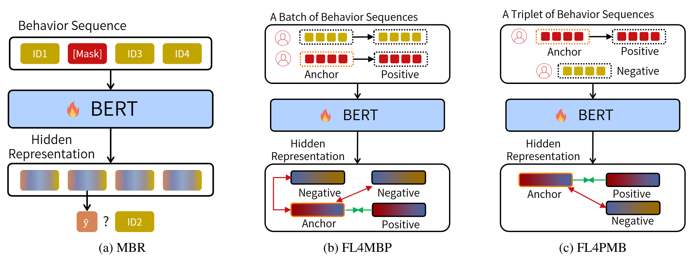| <div style="line-height: 1.05;font-size: 0.8em"> <details><summary>**[analogy]**</summary><div style="margin-top:6px">MaP is a self-supervised pre-training framework designed to extract robust representations of malicious users by modeling repetitive and sporadic anomalies in behavior sequences without relying on content analysis.</div></details><div style="margin-top:6px"><details><summary>**[summary]**</summary><div style="margin-top:6px">**[motivation]** Current supervised methods heavily rely on scarce labeled data, while existing self-supervised approaches often fail to capture complex repetitive and sporadic camouflaged patterns in user behavior sequences.<br>**[innovation]** Distinct from content-based approaches, this work focuses exclusively on user behavior sequences, introducing behavior consistency and local disruption augmentations to specifically target repetitive and sporadic malicious patterns.<br>**[method]** The framework employs a three-stage self-supervised pre-training pipeline based on BERT, integrating masked behavior reconstruction, contrastive learning for pattern recognition, and a pseudo-malicious user sampling strategy to refine repr…<br>**[conclusion/contribution]** Evaluated on a billion-scale industrial dataset from Weixin, the model demonstrates superior performance in both malicious user detection and classification tasks compared to graph-based and sequence-based baselines, particularly in cold-s…<br>**[limitation/future]** The current iteration relies solely on behavior ID sequences, neglecting potential semantic information from generated content and structural signals from social interaction graphs.</div></details><div style="margin-top:6px"><details><summary>**[notes]**</summary><div style="margin-top:6px">【恶意用户分析（基于行为模式）】\[引用文\]To address the limitations of content reliance and the scarcity of labeled data in anomaly detection, Jiang et al. \(2025\) proposed the Malicious User Behavior Pre-training framework \(MaP\). Instead of modeling user-generated content, this approach focuses exclusively on discerning patterns within user behavior sequences. The authors introduced a three-stage self-supervised lea…</div></details></div></div></div>|
|<a id="paper-entry-8fc3b526aac0"></a> []()<br>[Multi-modal social bot detection: Learning homophilic and heterophilic connections adaptively](https://dl.acm.org/doi/10.1145/3581783.3612569) <br> Shilong Li, Boyu Qiao, Kun Li, Qianqian Lu, Meng Lin, Wei Zhou <br> 2023-10-27|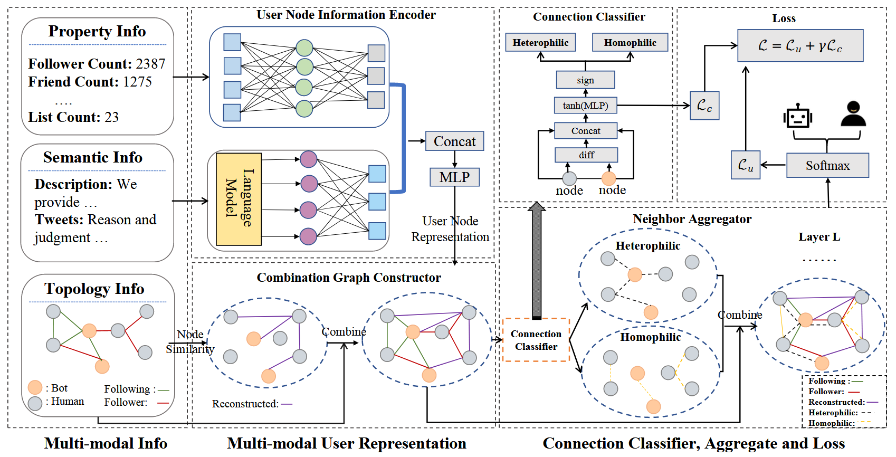| <div style="line-height: 1.05;font-size: 0.8em"> <details><summary>**[analogy]**</summary><div style="margin-top:6px">\[Aiming at the heterogeneity of bot-containing networks\] Uses node feature similarity to supplement edges in the reposting graph, ensuring that bot features are not smoothed away by the normal users surrounding them.</div></details><div style="margin-top:6px"><details><summary>**[summary]**</summary><div style="margin-top:6px">**[motivation]** Existing graph-based detection methods largely rely on the homophily assumption, often failing to address relation camouflage, where bots establish heterophilic connections with humans to evade detection through feature smoothing.<br>**[innovation]** The study introduces an adaptive mechanism to distinguish between homophilic and heterophilic edges and constructs a node similarity graph to mitigate the isolation of bots within human-dominated neighborhoods.<br>**[method]** BothH initializes multi-modal user representations using LMs and MLPs, constructs a composite graph supplemented by feature similarity, and employs an end-to-end framework that dynamically classifies edges to apply differentiated attention…<br>**[conclusion/contribution]** The model achieves state-of-the-art performance across Cresci-15, MGTAB, and Twibot-20 datasets, notably attaining an F1-score of 91.27% on the highly heterophilic Twibot-20 benchmark.<br>**[limitation/future]** Future work is suggested to explore the distinct connection preferences of various social bot types to further refine the heterophily-aware aggregation.</div></details><div style="margin-top:6px"><details><summary>**[notes]**</summary><div style="margin-top:6px">\[方法概括\]1.初始化用户节点表示，meta info经过MLP，语义信息经过LM和MLP，分别编码后拼接。2.构建关注图。为防止bot特征被平滑，使用相似度补充图的边。3.经过一个分类模型将图的边进行分类，区分同质和异质边。4.进行GNN的邻居聚合，同质和异质视为不同的边，分别计算权重。5.残差后进行节点分类，损失为节点分类Loss + 边分类Loss<br>\[引用文\]Addressing the limitation of homophily assumptions in graph-based detection, Li et al. \[?\] proposed BothH to counter relation camouflage where bots mix with human neighbors. The method fuses semantic and metadata fe…</div></details></div></div></div>|
|<a id="paper-entry-043384230479"></a> []()<br>[Dispelling the Fake: Social Bot Detection Based on Edge Confidence Evaluation](https://ieeexplore.ieee.org/document/10530431/) <br> Boyu Qiao, Wei Zhou, Kun Li, Shilong Li, Songlin Hu <br> 2025-04|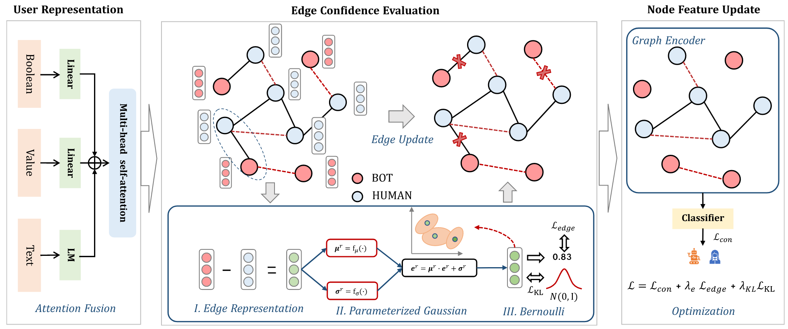| <div style="line-height: 1.05;font-size: 0.8em"> <details><summary>**[analogy]**</summary><div style="margin-top:6px">【争对包含机器人网络的异质性】BECE is a GNN-based framework that restores graph homophily by dynamically pruning unreliable human-bot connections through a Gaussian-regularized edge confidence evaluation mechanism.</div></details><div style="margin-top:6px"><details><summary>**[summary]**</summary><div style="margin-top:6px">**[motivation]** Mainstream GNN-based detection methods often struggle when the homophily assumption is violated by camouflaged connections between bots and humans. These "unreliable edges" cause message passing mechanisms to aggregate noise, making it dif…<br>**[innovation]** The paper proposes the BECE framework, which introduces an edge confidence evaluation mechanism to dynamically identify and pr<br>**[method]** The method first fuses multi-modal user features using multi-head attention mechanisms. It then constructs edge representations and reconstructs them via a parameterized Gaussian distribution to predict confidence scores. Finally, unreliab…<br>**[conclusion/contribution]** Experiments on Cresci-15, Twibot-20, and MGTAB datasets demonstrate that BECE consistently outperforms state-of-the-art baselines like BotRGCN and RGT. Additionally, the edge confidence module proves effective as a plug-in across six diffe…<br>**[limitation/future]** The model exhibits limitations in discerning heterogeneous edges when the representations of connected node pairs are highly similar, as observed in parts of the MGTAB dataset. Future work intends to leverage richer structural information…</div></details><div style="margin-top:6px"><details><summary>**[notes]**</summary><div style="margin-top:6px">相对于论文BothH（Multi-modal social bot detection: Learning homophilic and heterophilic connections adaptively）对异质关系进行显性的建模，该文则选择排除异质关系以防止干扰\[引用文\]Unlike BothH \[Citation\] which explicitly models heterophilic connections to adaptively extract high-pass information, Qiao et al. \[Year\] propose a subtractive strategy in their BECE model to mitigate interference. Arguing that camouflaged edges between bots an…</div></details></div></div></div>|
|<a id="paper-entry-faa265c47879"></a> []()<br>[BotSim: LLM-Powered Malicious Social Botnet Simulation](https://ojs.aaai.org/index.php/AAAI/article/view/33575) <br> Boyu Qiao, Kun Li, Wei Zhou, Shilong Li, Qianqian Lu, Songlin Hu <br> 2025-04-11 <br> <span style="color:cyan">[multi-category: [Malicious User Detection](#Malicious-User-Detection-12-papers), [Sociology and Social Media](#Sociology-and-Social-Media-27-papers)]</span>|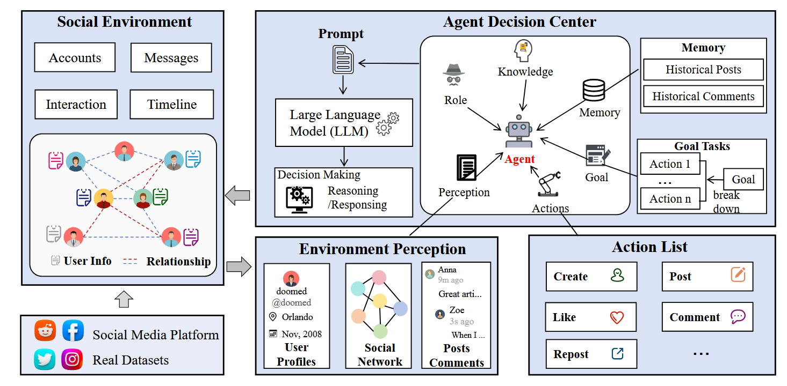| <div style="line-height: 1.05;font-size: 0.8em"> <details><summary>**[analogy]**</summary><div style="margin-top:6px">\[AI generated\] BotSim is like a digital petri dish for cultivating and studying intelligent malicious bots.</div></details><div style="margin-top:6px"><details><summary>**[summary]**</summary><div style="margin-top:6px">**[motivation]** \[AI generated\] To simulate and study the threat of LLM-powered malicious social botnets for improved detection.<br>**[innovation]** \[AI generated\] Proposes BotSim, an LLM-powered framework for simulating intelligent malicious botnets and generating realistic datasets for detection benchmarking.<br>**[method]** \[AI generated\] Proposes BotSim, an LLM-powered simulation framework that creates a virtual social network of intelligent agent bots and human users to model malicious botnet behavior and information dissemination patterns.<br>**[conclusion/contribution]** \[AI generated\] BotSim-24, a highly human-like bot dataset, reveals that traditional bot detection methods underperform against advanced LLM-powered bots, underscoring the need for new detection strategies.<br>**[limitation/future]** \[AI generated\] The simulation relies on LLM capabilities and lacks real-world deployment validation.</div></details><div style="margin-top:6px"><details><summary>**[notes]**</summary><div style="margin-top:6px">\[分类思考\]模拟方法进行恶意用户检测，适合在恶意用户检测后半部分或者社媒应用社会模拟介绍</div></details></div></div></div>|
|[↪ News Source Credibility Assessment: A Reddit Case Study](#paper-entry-86dabb4cd0ee) <sub>Full entry</sub>|||
|[↪ On the Risk of Evidence Pollution for Malicious Social Text Detection in the Era of LLMs](#paper-entry-fd5147f043bc) <sub>Full entry</sub>|||
|<a id="paper-entry-d29db6160f0f"></a>[](https://github.com/TamSiuhin/BotPercent) []()<br>[BotPercent: Estimating bot populations in twitter communities](https://openreview.net/forum?id=6dyvFZLRX8) <br> Zhaoxuan Tan, Shangbin Feng, Melanie Sclar, Herun Wan, Minnan Luo, Yejin Choi, Yulia Tsvetkov <br> 2023-12-01|<div style="display:flex;flex-direction:column;gap:6px;align-items:center">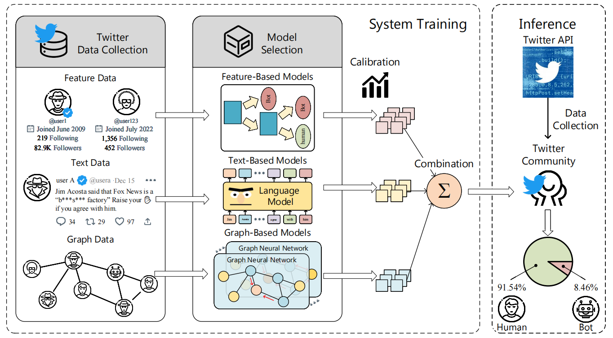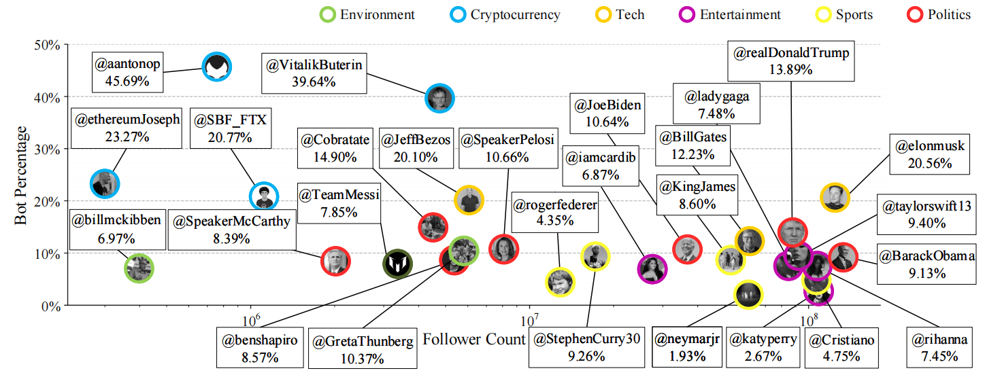</div>| <div style="line-height: 1.05;font-size: 0.8em"> <details><summary>**[analogy]**</summary><div style="margin-top:6px">\[AI generated\] BotPercent is like a census tailored to each neighborhood, calibrating multiple detectors to estimate the true proportion of bots within a specific Twitter community.</div></details></div>|
|<a id="paper-entry-63e8348d57e4"></a>[](https://github.com/SirryChen/CACL) []()<br>[CACL: Community-Aware Heterogeneous Graph Contrastive Learning for Social Media Bot Detection](https://aclanthology.org/2024.findings-acl.617) <br> Sirry Chen, Shuo Feng, Liang Songsong, Chen-Chen Zong, Jing Li, Piji Li <br> 2024-08|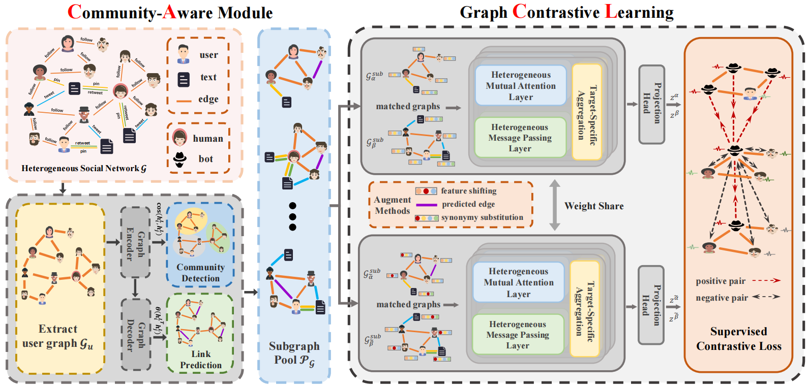| <div style="line-height: 1.05;font-size: 0.8em"> <details><summary>**[analogy]**</summary><div style="margin-top:6px">\[AI generated\] Bot detection via community-aware contrast: pull same-class users across communities closer, push different-class users within a community apart</div></details></div>|
|<a id="paper-entry-179baee19e9c"></a>[](https://github.com/BunsenFeng/botsay) []()<br>[What Does the Bot Say? Opportunities and Risks of Large Language Models in Social Media Bot Detec...](https://aclanthology.org/2024.acl-long.196/) <br> Shangbin Feng, Herun Wan, Ningnan Wang, Zhaoxuan Tan, Minnan Luo, Yulia Tsvetkov <br> 2024-08|| <div style="line-height: 1.05;font-size: 0.8em"> <details><summary>**[analogy]**</summary><div style="margin-top:6px">\[AI generated\] LLMs in bot detection: a double-edged sword, enhancing detection while enabling evasion.</div></details><div style="margin-top:6px"><details><summary>**[summary]**</summary><div style="margin-top:6px">**[motivation]** \[AI generated\] This paper investigates the dual role of Large Language Models \(LLMs\) in the ongoing arms race of social media bot detection. It aims to explore both the opportunities for building more effective LLM-based bot detectors and…<br>**[innovation]** \[AI generated\] This paper introduces a mixture-of-heterogeneous-experts framework for LLM-based social bot detection, which separately processes user metadata, text, and network structure via in-context learning or instruction tuning, and…<br>**[method]** \[AI generated\] The paper proposes a mixture-of-heterogeneous-experts framework for LLM-based bot detection, analyzing user metadata, text, and network structure separately via in-context learning or instruction tuning, then ensembling pred…<br>**[conclusion/contribution]** \[AI generated\] This paper investigates the dual role of LLMs in social media bot detection, revealing both significant opportunities and risks. It proposes a mixture-of-heterogeneous-experts framework for LLM-based detection, which, after…<br>**[limitation/future]** \[AI generated\] The study's limitations include reliance on two specific Twitter datasets \(TwiBot-20 and TwiBot-22\), which may not fully represent the diversity of social media platforms or evolving bot tactics. The evaluation of LLM-guided…</div></details></div></div>|
|<a id="paper-entry-06b9ad32ef95"></a> []()<br>[ETS-MM: A multi-modal social bot detection model based on enhanced textual semantic representation](https://openreview.net/forum?id=juwGL2d37N#discussion) <br> Wei Li, Jiawen Deng, Jiali You, Yuanyuan He, Yan Zhuang, Fuji Ren <br> 2025-01-29|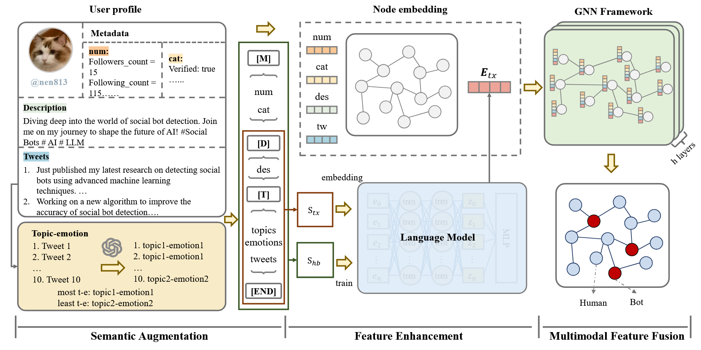| <div style="line-height: 1.05;font-size: 0.8em"> <details><summary>**[analogy]**</summary><div style="margin-top:6px">\[AI generated\] ETS-MM enhances social bot detection by integrating topic-emotion analysis into text semantics and fusing multimodal features via graph neural networks.</div></details><div style="margin-top:6px"><details><summary>**[summary]**</summary><div style="margin-top:6px">**[motivation]** \[AI generated\] Current multimodal social bot detection methods often overlook the multidimensional semantic information within user text, such as topic preferences and emotional tendencies, which are crucial for understanding nuanced socia…<br>**[innovation]** \[AI generated\] ETS-MM introduces a multimodal social bot detection framework that enhances textual semantic representation by integrating topic preference and emotion tendency analysis. It uses an LLM to extract these behavioral dimensions…<br>**[method]** \[AI generated\] ETS-MM is a multimodal social bot detection framework that enhances textual semantic representation by integrating topic preferences and emotion tendencies. It first uses an LLM \(GPT-3.5\) to extract the most and least freque…<br>**[conclusion/contribution]** \[AI generated\] ETS-MM is a multimodal social bot detection framework that enhances textual semantic representation by integrating topic preferences and emotion tendencies. It employs a large language model \(LLM\) to extract these behavioral…<br>**[limitation/future]** \[AI generated\] The proposed ETS-MM model relies on GPT-3.5 for extracting topic and emotion labels from user tweets, which introduces dependency on external large language models \(LLMs\) and may incur computational costs. Additionally, the…</div></details></div></div>|
|<a id="paper-entry-ba327ba836c9"></a> []()<br>[BIC: Twitter Bot Detection with Text-Graph Interaction and Semantic Consistency](https://aclanthology.org/2023.acl-long.575) <br> Zhenyu Lei, Herun Wan, Wenqian Zhang, Shangbin Feng, Zilong Chen, Jundong Li, Qinghua Zheng, Minnan Luo <br> 2023-07|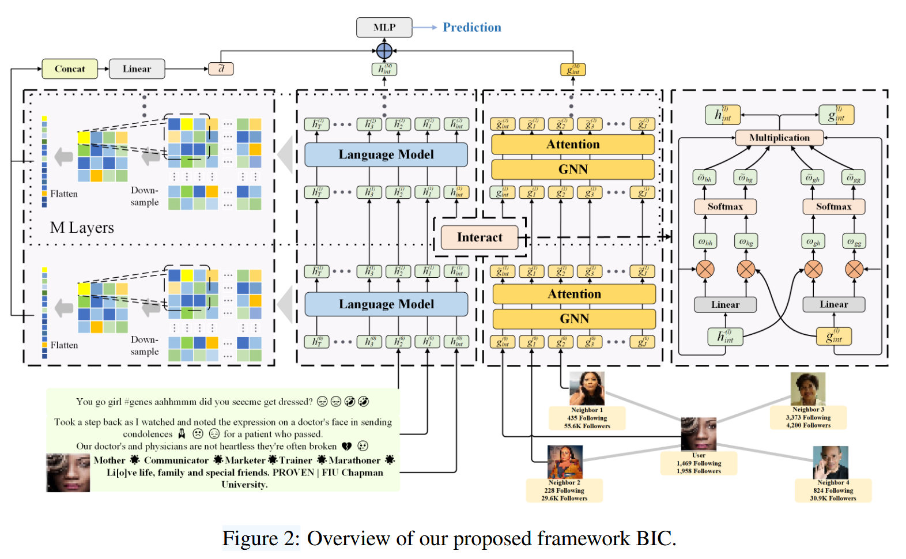| <div style="line-height: 1.05;font-size: 0.8em"> <details><summary>**[analogy]**</summary><div style="margin-top:6px">\[AI generated\] BIC introduces a cross-modal interaction mechanism for bot detection, akin to a detective correlating a suspect's statements with their social connections to uncover inconsistencies.</div></details><div style="margin-top:6px"><details><summary>**[summary]**</summary><div style="margin-top:6px">**[motivation]** \[AI generated\] Existing Twitter bot detection methods often rely on text or network features in isolation, or combine them shallowly, failing to capture the deep interaction between these two modalities. Furthermore, advanced bots evade de…<br>**[innovation]** \[AI generated\] BIC introduces a text-graph interaction module that enables dynamic information exchange between textual and network modalities, moving beyond their shallow combination. It also proposes a semantic consistency module that mo…<br>**[method]** \[AI generated\] BIC is an end-to-end Twitter bot detection framework that integrates text and graph modalities through iterative interaction and models semantic consistency. It employs separate text and graph modules for initial feature ext…<br>**[conclusion/contribution]** \[AI generated\] BIC introduces a novel Twitter bot detection framework that integrates text and graph modalities through an interactive module and models semantic consistency in user timelines. It achieves state-of-the-art performance on tw…<br>**[limitation/future]** \[AI generated\] BIC's evaluation is limited to two public datasets \(Cresci-15 and TwiBot-20\), and its performance on other social media platforms or evolving bot strategies remains unverified. The framework's computational cost for multi-la…</div></details></div></div>|

### | Understanding (77 papers)


#### Structural and Discourse Modeling (40 papers)


##### Event Extraction (12 papers)

| Title & Info | Pipeline | Summary |
|:--| :----: | :---: |
|<a id="paper-entry-a5d07b79d516"></a> []()<br>[Event Causality Extraction via Implicit Cause-Effect Interactions](https://aclanthology.org/2023.emnlp-main.420) <br> Jintao Liu,Zequn Zhang,Kaiwen Wei,Zhi Guo,Xian Sun,Li Jin,Xiaoyu Li <br> 2023|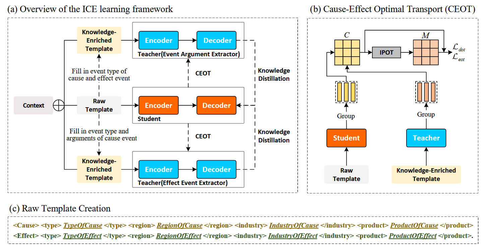| <div style="line-height: 1.05;font-size: 0.8em"> <details><summary>**[analogy]**</summary><div style="margin-top:6px">OT is used to enforce alignment between the student model and the teacher models.</div></details><div style="margin-top:6px"><details><summary>**[summary]**</summary><div style="margin-top:6px">**[motivation]** Existing ECE \(Event Causality Extraction\) methods do not fully exploit the interaction between cause events and effect events. This could have provided key clues for causal reasoning.<br>**[innovation]** The paper decouples the two tasks of ECE \(argument extraction and effect event prediction\) and uses OT for fine-grained alignment between teacher models and the student model, enhancing implicit connections between causal events.<br>**[method]** Template-based conditional generation \(input prompts based on templates with specific privileged information, enabling the pretrained model BART \(transformer-based\) to output template-based structured text for subsequent fine-tuning\) -> te…<br>**[conclusion/contribution]** Significantly improved performance in the ECE task, with an F1 score improvement of 8.39% over the previous best method on the ECE-CCKS dataset.<br>**[limitation/future]** The multi-teacher distillation mechanism and the complex OT computation significantly increase the cost of the model training stage.</div></details><div style="margin-top:6px"><details><summary>**[notes]**</summary><div style="margin-top:6px">?这个方法为什么可以解决问题？<br>    核心方法是使用优秀的专家模型对小模型进行微调，结合了5个小损失函数（两个来源于OT），以尽可能保证知识迁移效果<br><br>?有什么值得注意的细节吗？<br>    ??论文为什么选择训练两个承担不同任务的教师模型，一起蒸馏出目标模型的方法<br>        这几乎是进行微调特化用于该下游任务的必然选择<br>        因为需要训练两个能力（子任务）：文本论元抽取能力（事件内交互）和事件结果联系能力（事件间）<br>        两个子任务需要分别调整数据集的输入，为他们分配不同的特权信息，从而避免混淆和出现“作弊”（看到这个子任务不应看到的特权信息）</div></details></div></div></div>|
|<a id="paper-entry-47afe80b9228"></a>[](https://github.com/social-info-lab/disaster_event_analysis) []()<br>[Identifying and Investigating Global News Coverage of Critical Events Such as Disasters and Terro...](https://ojs.aaai.org/index.php/ICWSM/article/view/35818) <br> Erica Cai, Xi Chen, Reagan Grey Keeney, Ethan Zuckerman, Brendan O'Connor, Przemyslaw A. Grabowicz <br> 2025-06-07|<div style="display:flex;flex-direction:column;gap:6px;align-items:center">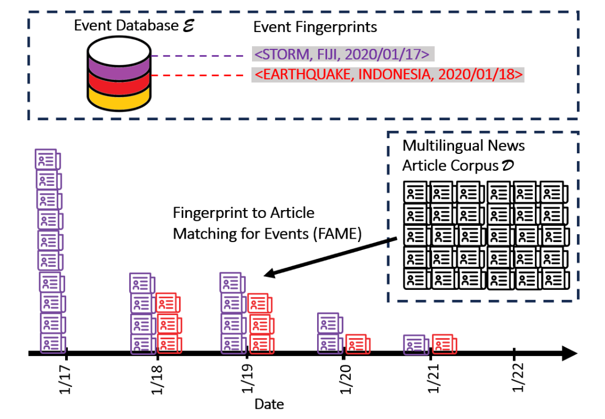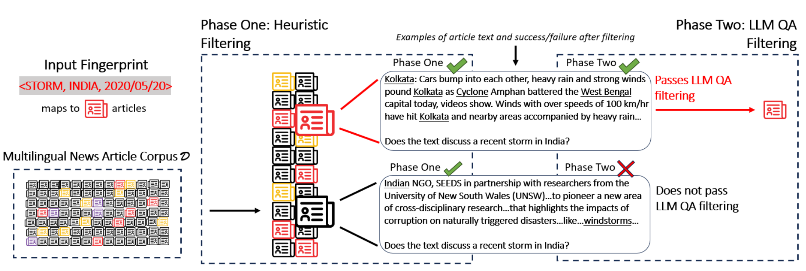</div>| <div style="line-height: 1.05;font-size: 0.8em"> <details><summary>**[analogy]**</summary><div style="margin-top:6px">Two-stage matching filters news: keyword matching performs preliminary screening \(keywords obtained through heuristic methods\) -> event extraction.</div></details><div style="margin-top:6px"><details><summary>**[summary]**</summary><div style="margin-top:6px">**[motivation]** Traditional computational studies of news coverage bias are hindered by the inability to efficiently and accurately identify articles discussing the same real-world event across massive, multilingual corpora without costly, language-specif…<br>**[innovation]** It introduces FAME, a scalable, zero-shot framework that utilizes minimalist “event fingerprints” \(time, location, class\) to match news articles across languages via a two-stage screening pipeline, eliminating the need for annotated traini…<br>**[method]** The method employs a two-stage pipeline: 1\) Heuristic keyword filtering to recall candidate articles within a time window, followed by 2\) a semantic filter using a large language model \(LLM\) for question-answering to achieve high-precision…<br>**[conclusion/contribution]** FAME achieved state-of-the-art performance \(average F1 > 94% across English, Spanish, and French\), and its application revealed that media attention to disasters and terrorist attacks is strongly correlated with death tolls, the GDP of the…<br>**[limitation/future]** The reliance on a two-stage screening pipeline depends on the quality of external event databases \(e.g., GTD\), and the minimalist fingerprint design, while enabling scalability, can lead to ambiguities for events with similar metadata.</div></details></div></div>|
|<a id="paper-entry-69f11c5e665e"></a>[](https://github.com/shiqinghuayi19/LLMforEvent) []()<br>[Is a Large Language Model a Good Annotator for Event Extraction?](https://ojs.aaai.org/index.php/AAAI/article/view/29730) <br> Ruirui Chen1,Chengwei Qin,Weifeng Jiang,Dongkyu Choi <br> 2024-03-24|| <div style="line-height: 1.05;font-size: 0.8em"> <details><summary>**[analogy]**</summary><div style="margin-top:6px">\[AI generated\] This method uses LLMs as expert annotators to generate high-quality training data, akin to employing a master chef to prepare ingredients for a specialized dish.</div></details><div style="margin-top:6px"><details><summary>**[summary]**</summary><div style="margin-top:6px">**[motivation]** Contextual examples are used in prompts to guide the large language model to generate new samples aligned with the distribution and annotation patterns of the target benchmark dataset, thereby directly addressing the data imbalance problem.<br>**[innovation]** \[AI generated\] Employing LLMs as expert annotators with in-context examples to generate distribution-aligned data, directly addressing data scarcity and imbalance.<br>**[method]** For \(long-tail\) event types with scarce training samples, appropriate prompt templates \(containing real examples\) are used to require the LLM to generate annotations, quality filtering is performed, the results are merged into the original…<br>**[conclusion/contribution]** Fine-tuning models like BERT-CRF on the GPT-4-augmented ACE 2005 data led to consistent F1-score improvements in both Event Detection and Argument Extraction tasks, proving the high utility of LLM-generated annotations as a training resour…<br>**[limitation/future]** It is highly dependent on the LLM's own capabilities.</div></details></div></div>|
|<a id="paper-entry-c14ceaa0947c"></a>[](https://github.com/RingBDStack/FinEvent) []()<br>[Reinforced, Incremental and Cross-Lingual Event Detection From Social Messages](https://ieeexplore.ieee.org/document/9693189/) <br> Hao Peng,Ruitong Zhang,Shaoning Li,Yuwei Cao,Shirui Pan,Philip S. Yu <br> 2023-01-01|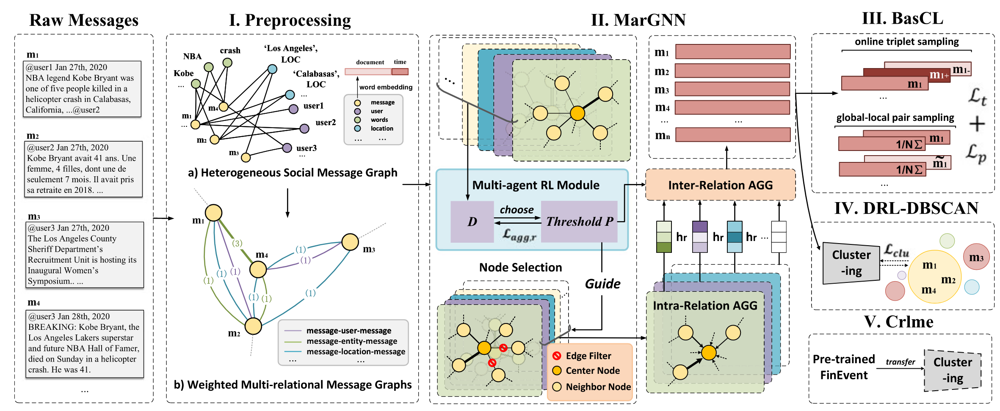| <div style="line-height: 1.05;font-size: 0.8em"> <details><summary>**[analogy]**</summary><div style="margin-top:6px">\[AI generated\] FinEvent is like a multilingual, self-optimizing news curator that continuously learns and adapts from live social media streams.</div></details><div style="margin-top:6px"><details><summary>**[summary]**</summary><div style="margin-top:6px">**[motivation]** Event detection in social media streams is challenged by ambiguous event features, dispersed text content, multilingualism, and long-tail distribution, where traditional methods struggle in dynamic, incremental, and cross-lingual scenarios.<br>**[innovation]** Its core advancement lies in enabling continuous, cross-lingual social event detection through a life-cycle mechanism that dynamically updates both the message graph and model without full retraining.<br>**[method]** The pipeline includes: \(1\) constructing a weighted multi-relational graph from social messages; \(2\) using multi-agent reinforcement learning to learn relation-specific thresholds for neighbor selection and aggregation; \(3\) training with ba…<br>**[conclusion/contribution]** On Twitter streams, FinEvent significantly outperforms baselines in offline, online, and cross-lingual detection tasks, with improvements of 14%-118% in NMI, 8%-170% in AMI, and 2%-21% in ARI, demonstrating robust performance across divers…<br>**[limitation/future]** Limitations include high computational complexity, dependence on external translation for low-resource languages, potential knowledge forgetting during incremental updates, and limited generalization due to evaluation primarily on Twitter…</div></details></div></div>|
|<a id="paper-entry-b1346632403e"></a> []()<br>[Towards Effective, Efficient and Unsupervised Social Event Detection in the Hyperbolic Space](https://ojs.aaai.org/index.php/AAAI/article/view/33430) <br> Xiaoyan Yu, Yifan Wei, Shuaishuai Zhou, Zhiwei Yang, Li Sun, Hao Peng, Liehuang Zhu, Philip S. Yu <br> 2025-04-11|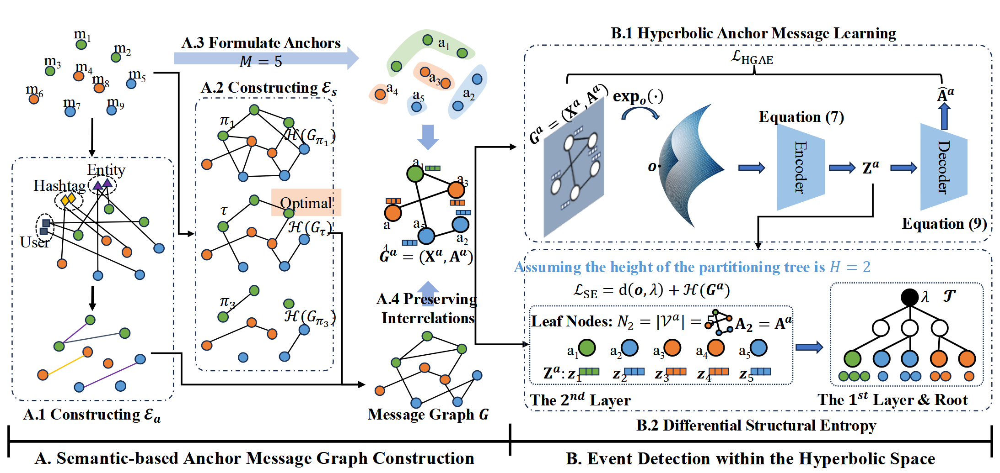| <div style="line-height: 1.05;font-size: 0.8em"> <details><summary>**[analogy]**</summary><div style="margin-top:6px">Overhead is reduced through two-layer compression \(simplifying edges and aggregating nodes into anchor points\), and event clustering is represented through a partition tree.</div></details><div style="margin-top:6px"><details><summary>**[summary]**</summary><div style="margin-top:6px">**[motivation]** Social event detection on social media platforms faces significant challenges due to the large scale, dynamic nature, and complex relational structures inherent in user-generated content. Existing methods often suffer from inefficiency in…<br>**[innovation]** The paper introduces HyperSED, a novel unsupervised framework that reduces computational overhead through a two-stage compression mechanism—semantic-based anchor construction and graph sparsification—and represents event clusters via a dif…<br>**[method]** The framework first constructs a semantic anchor graph to compress message nodes and simplify relational edges. It then maps the anchor graph into hyperbolic space and employs a hyperbolic graph autoencoder to learn structure-aware represe…<br>**[conclusion/contribution]** Experiments on real-world Twitter datasets demonstrate that HyperSED achieves competitive performance in normalized mutual information, adjusted mutual information, and adjusted Rand index, while improving computational efficiency by up to…<br>**[limitation/future]** The performance may marginally decline in some message blocks due to potential errors in anchor construction, where semantically distinct messages are incorrectly grouped. Additionally, the efficiency gains come with a slight trade-off in…</div></details><div style="margin-top:6px"><details><summary>**[notes]**</summary><div style="margin-top:6px">\[notes\]为什么用双曲空间？ 现实世界的事件和话题往往具有层次结构（如“体育 -> 足球 -> 世界杯”）。双曲空间的几何特性（指数级增长的空间）能更自然、更紧凑地嵌入这种树状或层次化数据。<br>\[通俗核心\]通过消息各属性的相同性（用户、标签）构建网络；通过方法精简网络边【压缩1】；根据相关性将相似信息聚类为锚点，锚点之间有节点相连的构建边，得到锚点图【压缩2】；映射到双曲空间进行自监督重建训练（图自编码器GAE）获得聚合模型；模型输出根据特征向量距离自底向上聚合形成划分树，该树即表示消息各层级聚类关系。每个聚类节点都代表了一个某层级事件（如体育、世界杯、新冠）\[引用文\]HyperSED demonstrates how structural and geometric inductive biases can be integrated into scalable unsuper…</div></details></div></div></div>|
|<a id="paper-entry-3eb8eaa77b60"></a> []()<br>[A Three-Stage Framework for Event-Event Relation Extraction with Large Language Model](https://link.springer.com/10.1007/978-981-99-8181-6_33) <br> Feng Huang,Qiang Huang,YueTong Zhao,ZhiXiao Qi,BingKun Wang,YongFeng Huang,SongBin Li <br> 2024|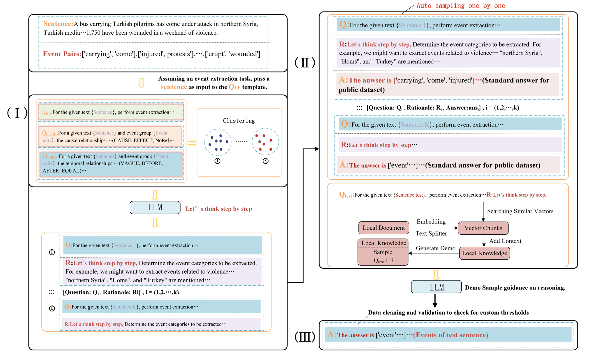| <div style="line-height: 1.05;font-size: 0.8em"> <details><summary>**[analogy]**</summary><div style="margin-top:6px">An event extraction method constructed through structured prompts, training-free and zero-shot, and dependent on a local knowledge base.</div></details><div style="margin-top:6px"><details><summary>**[summary]**</summary><div style="margin-top:6px">**[motivation]** Traditional event relation extraction methods rely heavily on annotated data, which is costly and difficult to scale. The zero-shot capability of large language models remains underexplored for temporal and causal relation tasks.<br>**[innovation]** A three-stage framework \(ThreeEERE\) is proposed, integrating an improved Auto-CoT prompting strategy with local knowledge retrieval to enable zero-shot event-event relation extraction without task-specific training.<br>**[method]** Construct demonstration examples \(including a CoT part\) -> retrieve local knowledge -> take answers above a threshold.<br>**[conclusion/contribution]** ThreeEERE outperforms standard prompting methods and matches or surpasses several supervised baselines in event, temporal, and causal relation extraction across multiple datasets.<br>**[limitation/future]** Potential inconsistency between generated reasoning chains and gold answers in demonstrations may introduce noise and affect model stability.And it relies on the construction of a local knowledge base.</div></details><div style="margin-top:6px"><details><summary>**[notes]**</summary><div style="margin-top:6px">\[notes\]聚类只是为了选择最接近聚类中心的测试样本，作为示范样例（因为接近中心意味着更能代表该聚类语义特征），之后的操作就是输入测试样例和这些示范样例（答案部分替换为标准答案）以及检索得到的本地知识，最终取超过阈值的结果<br>\[引用文\]The three-stage framework proposed by Huang et al. \(2024\) integrates chain-of-thought reasoning with localized knowledge, demonstrating the feasibility of eliciting zero-shot inference of complex event relations from large language models through meticulously designed prompts,…</div></details></div></div></div>|
|<a id="paper-entry-d7c2865d604c"></a> []()<br>[MA-VLAD: A fine-grained local feature aggregation scheme for action recognition](https://link.springer.com/article/10.1007/s00530-024-01341-9) <br> Na Feng, Ying Tang, Zikai Song, Junqing Yu, Yi-Ping Phoebe Chen, Wei Yang <br> 2024-05-03|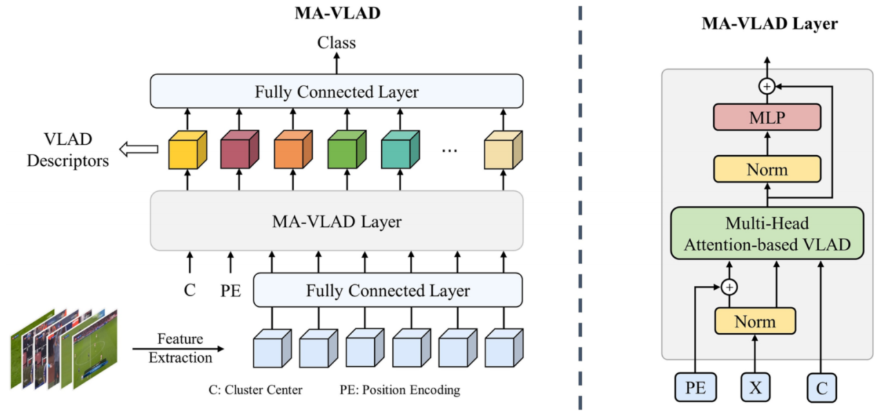| <div style="line-height: 1.05;font-size: 0.8em"> <details><summary>**[analogy]**</summary><div style="margin-top:6px">\[AI generated\] MA-VLAD uses multi-head attention to partition features and perform fine-grained semantic clustering, akin to assigning specialized analysts to different aspects of a video for more precise action recognition.</div></details></div>|
|<a id="paper-entry-6916000167ac"></a>[](https://github.com/jinzhao3611/attitude-detection-with-framing) []()<br>[Media Attitude Detection via Framing Analysis with Events and their Relations](https://aclanthology.org/2024.emnlp-main.954) <br> Jin Zhao, Jingxuan Tu, Han Du, Nianwen Xue <br> 2024|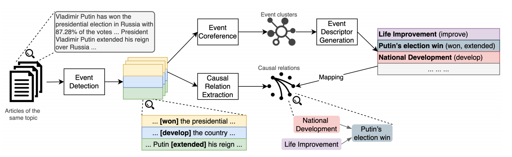| <div style="line-height: 1.05;font-size: 0.8em"> <details><summary>**[analogy]**</summary><div style="margin-top:6px">\[AI generated\] Just as a photographer’s choice of lens, angle, and focus shapes a picture’s story, this work reveals media attitude by selecting events, wording, and causal links as framing devices.</div></details></div>|
|<a id="paper-entry-22a33cb50087"></a> []()<br>[MMUTF: Multimodal Multimedia Event Argument Extraction with Unified Template Filling](https://aclanthology.org/2024.findings-emnlp.381) <br> Philipp Seeberger, Dominik Wagner, Korbinian Riedhammer <br> 2024|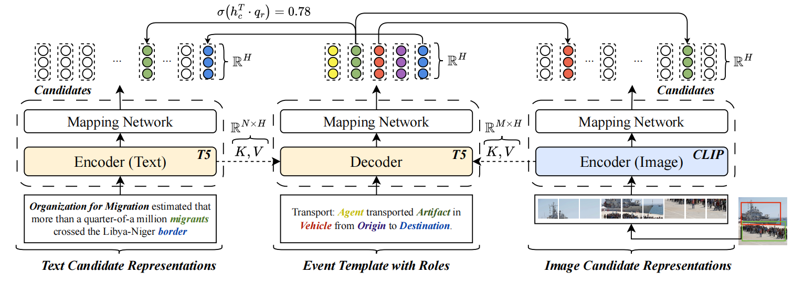| <div style="line-height: 1.05;font-size: 0.8em"> <details><summary>**[analogy]**</summary><div style="margin-top:6px">\[AI generated\] MMUTF: A unified template filling model that connects text and image modalities via textual prompts for multimedia event argument extraction</div></details></div>|
|<a id="paper-entry-cf8900f3d25d"></a> []()<br>[SPEED++: A Multilingual Event Extraction Framework for Epidemic Prediction and Preparedness](https://aclanthology.org/2024.emnlp-main.720) <br> Tanmay Parekh, Jeffrey Kwan, Jiarui Yu, Sparsh Johri, Hyosang Ahn, Sreya Muppalla, Kai-Wei Chang, Wei Wang, Nanyun Peng <br> 2024|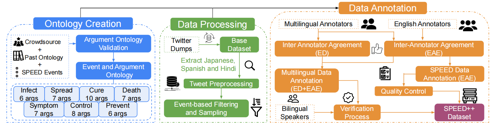| <div style="line-height: 1.05;font-size: 0.8em"> <details><summary>**[analogy]**</summary><div style="margin-top:6px">\[AI generated\] Multilingual epidemic early warning: Like a global listening post that hears outbreak whispers in any language, long before official alarms sound</div></details></div>|
|<a id="paper-entry-101b420611eb"></a>[](https://github.com/NJUNLP/FocalMRE) []()<br>[Focus & Gating: A Multimodal Approach for Unveiling Relations in Noisy Social Media](https://dl.acm.org/doi/10.1145/3664647.3680995) <br> Liang He, Hongke Wang, Zhen Wu, Jianbing Zhang, Xinyu Dai, Jiajun Chen <br> 2024-10-28|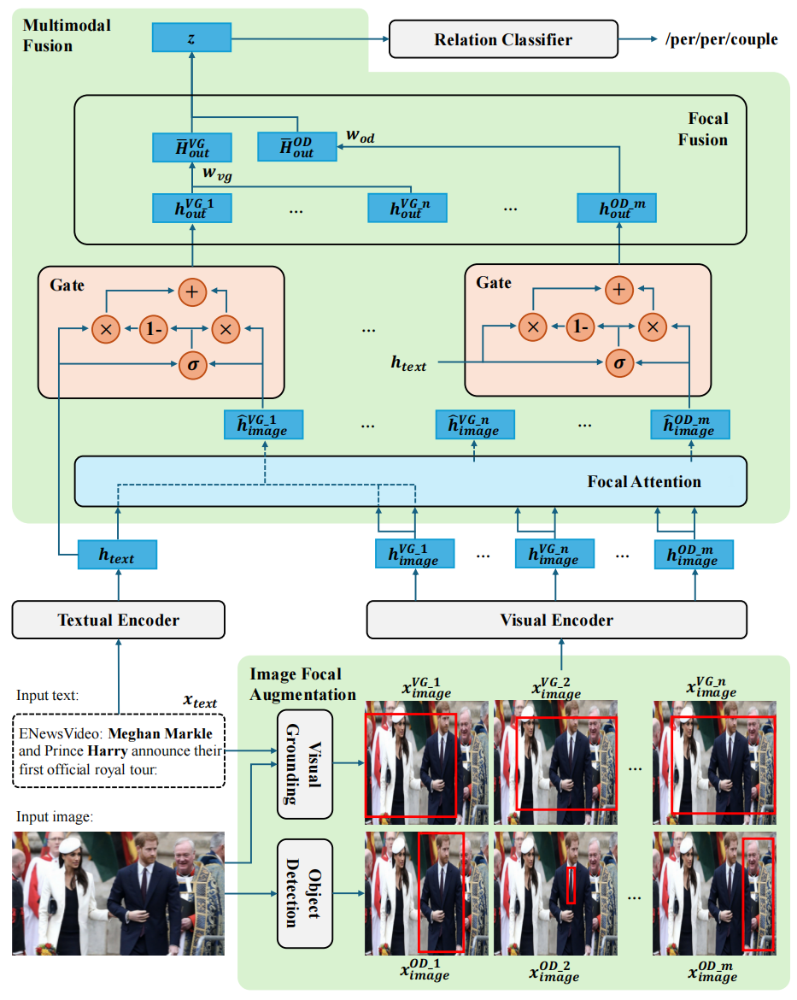| <div style="line-height: 1.05;font-size: 0.8em"> <details><summary>**[analogy]**</summary><div style="margin-top:6px">\[AI generated\] FocalMRE acts like a spotlight that highlights key objects in a photo while keeping the whole scene in view, filtering out distractions to accurately identify relationships.</div></details></div>|
|[↪ Identifying conspiracy theories news based on event relation graph](#paper-entry-d8365f34404e) <sub>Full entry</sub>|||

##### Topic Modeling (6 papers)

| Title & Info | Pipeline | Summary |
|:--| :----: | :---: |
|<a id="paper-entry-e64f5ad47d06"></a>[](https://github.com/kde9867/Platform-Invariant-Topic-Modeling) []()<br>[Platform-Invariant Topic Modeling via Contrastive Learning to Mitigate Platform-Induced Bias](https://aclanthology.org/2024.findings-emnlp.650) <br> Minseo Koo, Doeun Kim, Sungwon Han, Sungkyu Shaun Park <br> 2024|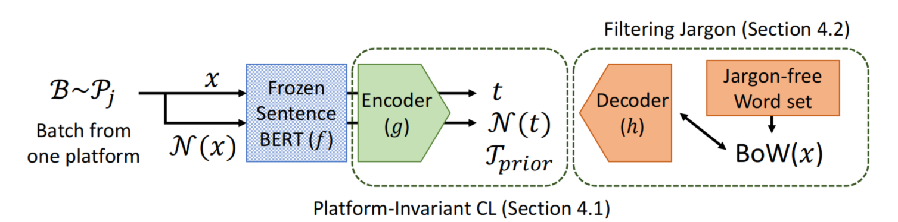| <div style="line-height: 1.05;font-size: 0.8em"> <details><summary>**[analogy]**</summary><div style="margin-top:6px">\[AI generated\] Platform-invariant topic modeling: A contrastive learning method that cancels platform-specific noise, like removing regional accents to hear the true message.</div></details></div>|
|<a id="paper-entry-e1524ddf57c7"></a>[](https://github.com/hanshanley/multilingual-matryoshka-news) []()<br>[Hierarchical Level-Wise News Article Clustering via Multilingual Matryoshka Embeddings](https://aclanthology.org/2025.acl-long.124/) <br> Hans William Alexander Hanley, Zakir Durumeric <br> 2025-07|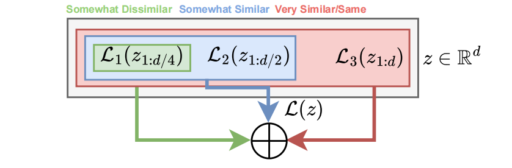| <div style="line-height: 1.05;font-size: 0.8em"> <details><summary>**[analogy]**</summary><div style="margin-top:6px">\[AI generated\] Matryoshka embedding as a telescopic lens: lower dimensions capture broad themes, higher dimensions resolve fine-grained story details</div></details></div>|
|<a id="paper-entry-f92eed4b8a36"></a>[](https://huggingface.co/datasets/cardiffnlp/tweet_topic_multilingual) []()<br>[Multilingual Topic Classification in X: Dataset and Analysis](https://aclanthology.org/2024.emnlp-main.1123/) <br> Dimosthenis Antypas, Asahi Ushio, Francesco Barbieri, Jose Camacho-Collados <br> 2024-11|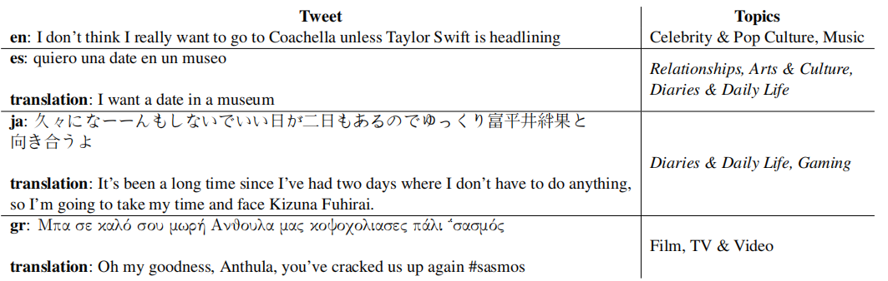| <div style="line-height: 1.05;font-size: 0.8em"> <details><summary>**[analogy]**</summary><div style="margin-top:6px">\[AI generated\] Multilingual topic classification as a cross-cultural lens: one taxonomy, four languages, revealing both shared patterns and distinct cultural signals in social media discourse</div></details></div>|
|<a id="paper-entry-bdb31f17ff2c"></a> []()<br>[LLMTaxo: Leveraging Large Language Models for Constructing Taxonomy of Factual Claims from Social...](https://aclanthology.org/2025.findings-acl.1007) <br> Haiqi Zhang, Zhengyuan Zhu, Zeyu Zhang, Chengkai Li <br> 2025-07|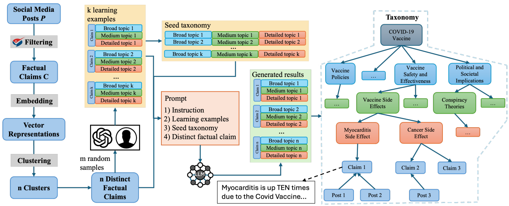| <div style="line-height: 1.05;font-size: 0.8em"> <details><summary>**[analogy]**</summary><div style="margin-top:6px">\[AI generated\] LLMTaxo: LLM as a librarian, automatically building a multi-level topic bookshelf for social media claims</div></details></div>|
|<a id="paper-entry-6a0eb4db162f"></a> []()<br>[Continuous relational diffusion driven topic model with multi-grained text for microblog](https://aclanthology.org/2024.lrec-main.345/) <br> Chenhao Wu, Ruifang He, Chang Liu, Bo Wang <br> 2024-05|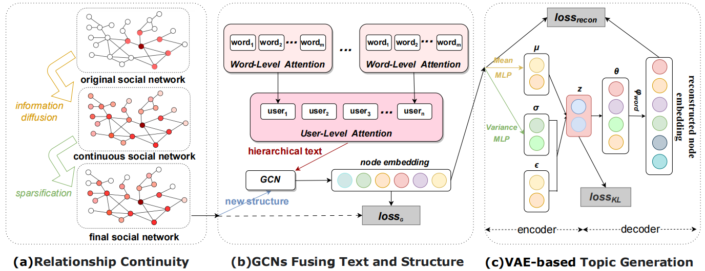| <div style="line-height: 1.05;font-size: 0.8em"> <details><summary>**[analogy]**</summary><div style="margin-top:6px">A continuous relational diffusion driven multi-grained topic model for microblogs.</div></details></div>|
|<a id="paper-entry-1d9e4d8bb82a"></a> []()<br>[Thematic-LM: A LLM-based multi-agent system for large-scale thematic analysis](https://openreview.net/forum?id=jiv0Gl6sto#discussion) <br> Tingrui Qiao, Caroline Walker, Chris W. Cunningham, Yun Sing Koh <br> 2025-01-29|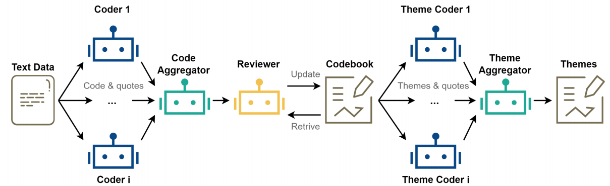| <div style="line-height: 1.05;font-size: 0.8em"> <details><summary>**[analogy]**</summary><div style="margin-top:6px">\[AI generated\] Thematic-LM: A multi-agent coding team with an adaptive codebook, simulating diverse coder identities for large-scale thematic analysis</div></details></div>|

##### Meme and Multimodal Understanding (22 papers)

| Title & Info | Pipeline | Summary |
|:--| :----: | :---: |
|<a id="paper-entry-d4935d3a2219"></a> []()<br>[Large Language Models Are Natural Video Popularity Predictors](https://aclanthology.org/2025.findings-acl.597/) <br> Wanxiang Che, Joyce Nabende, Ekaterina Shutova, Mohammad Taher Pilehvar <br> 2025-07 <br> <span style="color:cyan">[multi-category: [Social Popularity Prediction](#Social-Popularity-Prediction-13-papers), [Meme and Multimodal Understanding](#Meme-and-Multimodal-Understanding-22-papers)]</span>|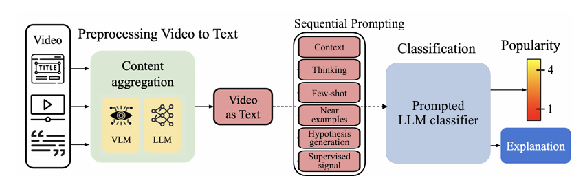| <div style="line-height: 1.05;font-size: 0.8em"> <details><summary>**[analogy]**</summary><div style="margin-top:6px">\[AI generated\] Predicting video popularity with LLMs is akin to forecasting weather patterns by analyzing atmospheric data—both leverage complex models to anticipate outcomes from multifaceted signals.</div></details><div style="margin-top:6px"><details><summary>**[summary]**</summary><div style="margin-top:6px">**[motivation]** Research objectives and motivation<br><br>Research objective: To leverage the deep contextual understanding capabilities of large language models \(LLMs\) to predict video popularity \(Engagement Intensity\) and geographic spread \(Geographic Spread\)…<br>**[innovation]** Paradigm shift: Proposes a paradigm shift from pixel-based to token-based prediction. Instead of directly training a visual model, visual content is first converted into text, and an LLM is used for reasoning.<br><br><br>Training-free: Demonstrates…<br>**[method]** The framework mainly consists of three steps:<br><br>Visual-to-Text Conversion:<br><br>Frames are sampled from the video, and a vision-language model \(VLM, such as GPT-4o or LLaVA\) is used to convert visual content into serialized textual descriptions…<br>**[conclusion/contribution]** Superior performance: On a dataset containing 13,639 popular videos, the traditional content-embedding-based supervised neural network achieved an accuracy of 80%, while the LLM-based method reached 82% without fine-tuning.<br><br><br>Hybrid model…<br>**[limitation/future]** Limitations:<br><br><br>Cultural nuances: Although LLMs perform well, they may still misjudge content with highly specific cultural backgrounds or subtle emotions \(such as certain types of humor\), for example mistakenly treating some American-speci…</div></details></div></div>|
|<a id="paper-entry-05caa3c5a90c"></a> []()<br>[Seeing the Unseen in Micro-Video Popularity Prediction: Self-Correlation Retrieval for Missing Mo...](https://dl.acm.org/doi/10.1145/3690624.3709308) <br> Zhangtao Cheng, Jian Lang, Ting Zhong, Fan Zhou <br> 2025-07-20 <br> <span style="color:cyan">[multi-category: [Meme and Multimodal Understanding](#Meme-and-Multimodal-Understanding-22-papers), [Social Popularity Prediction](#Social-Popularity-Prediction-13-papers)]</span>|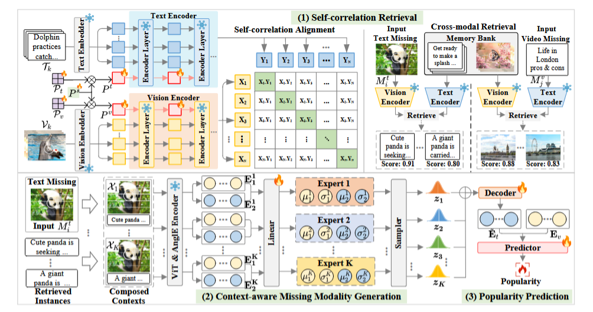| <div style="line-height: 1.05;font-size: 0.8em"> <details><summary>**[analogy]**</summary><div style="margin-top:6px">\[AI generated\] SCRAG is like a detective reconstructing a crime scene by cross-referencing clues from similar past cases to fill in missing evidence, thereby accurately predicting micro-video popularity.</div></details><div style="margin-top:6px"><details><summary>**[summary]**</summary><div style="margin-top:6px">**[motivation]** Research objective: Accurately predict the popularity of micro-videos in real-world scenarios with missing modalities \(Missing Modality\) \(e.g., only video frames without captions, or only captions without frames\).<br><br>Research motivation:<br><br>Ex…<br>**[innovation]** SCRAG framework: Proposes the Self-Correlation Retrieval-Augmented Generative \(SCRAG\) framework, the first systematic solution to the missing modality problem in this field.<br><br>Retrieval-guided generation paradigm: Unlike directly generating…<br>**[method]** Self-Correlation Retrieval:<br><br>Challenge: How to use an incomplete query \(e.g., text only\) to retrieve complete videos?<br><br>Solution: Uses a frozen pretrained model \(CLIP\) with learnable prompts for alignment. This enables the model to understa…<br>**[conclusion/contribution]** Performance improvement: On three datasets—TikTok, MicroLens, and NUS—under the extreme condition of 70% missing data, SCRAG still outperforms 14 baseline models \(including SOTA generative models\) by an average of 7.15%.<br><br>Strong robustness…<br>**[limitation/future]** Limitations: Although the paper mentions the computational overhead introduced by retrieval, the discussion of real-time performance on ultra-large-scale retrieval databases may be insufficient \(retrieval-augmented methods generally have t…</div></details></div></div>|
|<a id="paper-entry-78709f3415ee"></a> []()<br>[Cross-Modal Prototype Augmentation and Dual-Grained Prompt Learning for Social Media Popularity P...](https://dl.acm.org/doi/10.1145/3746027.3763784) <br> Ao Zhou, Mingsheng Tu, Luping Wang, Tenghao Sun, Zifeng Cheng, Yafeng Yin, Zhiwei Jiang, Qing Gu <br> 2025-10-27 <br> <span style="color:cyan">[multi-category: [Meme and Multimodal Understanding](#Meme-and-Multimodal-Understanding-22-papers), [Social Popularity Prediction](#Social-Popularity-Prediction-13-papers)]</span>|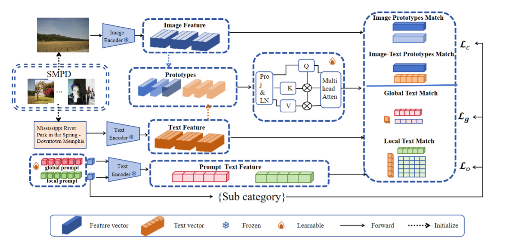| <div style="line-height: 1.05;font-size: 0.8em"> <details><summary>**[analogy]**</summary><div style="margin-top:6px">\[AI generated\] This paper introduces a hierarchical prototype and contrastive learning framework for social media popularity prediction, akin to training a multi-specialist team with shared expertise and coordinated communication to analyz…</div></details><div style="margin-top:6px"><details><summary>**[summary]**</summary><div style="margin-top:6px">**[motivation]** Research objective: Address the shortcomings of existing multimodal methods in vision-text alignment \(Vision-Text Alignment\) for social media popularity prediction \(SMPP\), as well as their failure to capture cross-content associations and…<br>**[innovation]** Classification-based fine-tuning strategy: Innovatively transforms the regression task into a classification task for feature pretraining. Uses the SMPD dataset to construct a 77-class fine-grained classification task to fine-tune CLIP, en…<br>**[method]** Classification task construction: The SMPD dataset is divided into 77 fine-grained subcategories, and the CLIP model \($CLIP_{FT}$\) is fine-tuned on this task. Prototype Construction: For each category, 256 representative images and text de…<br>**[conclusion/contribution]** SOTA performance: On the SMPD Benchmark dataset, the method achieves the best performance on both SRC \(Spearman correlation coefficient\) and MAE metrics \(SRC reaches approximately 0.73\), significantly outperforming baselines such as the or…<br>**[limitation/future]** Limitations:<br><br>Missing temporal dynamics: Although the work is very thorough on multimodal features, the paper acknowledges that the current method still fails to effectively capture the complex temporal dynamics of content propagation. Att…</div></details></div></div>|
|<a id="paper-entry-385898b06447"></a> []()<br>[Retrieval-Augmented Dynamic Prompt Tuning for Incomplete Multimodal Learning](https://ojs.aaai.org/index.php/AAAI/article/view/33984) <br> Jian Lang, Zhangtao Cheng, Ting Zhong, Fan Zhou <br> 2025-04-11|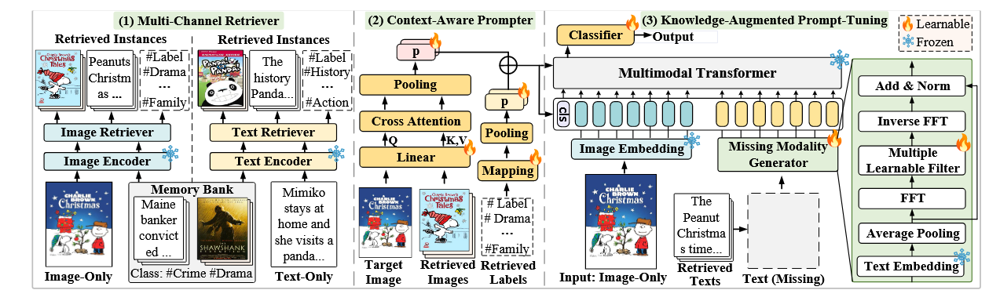| <div style="line-height: 1.05;font-size: 0.8em"> <details><summary>**[analogy]**</summary><div style="margin-top:6px">\[AI generated\] Retrieval-Augmented Dynamic Prompt Tuning for Incomplete Multimodal Learning is like a librarian who not only finds relevant books for a researcher but also summarizes missing chapters and provides tailored reading guides to…</div></details><div style="margin-top:6px"><details><summary>**[summary]**</summary><div style="margin-top:6px">**[motivation]** Research objective: To improve the robustness and predictive performance of pretrained multimodal Transformers \(MMT\) under modality missing conditions \(e.g., only images without text, or only text without images\).<br><br>Research motivation:<br><br>De…<br>**[innovation]** First retrieval-augmented framework for missing modalities: RAGPT is the first study to introduce the retrieval-augmented paradigm into incomplete multimodal learning.<br><br>Dynamic Prompt Tuning: Unlike static prompts, this method generates co…<br>**[method]** Multi-Channel Retriever: An intra-modal similarity strategy is adopted. If the target sample is missing text, its image is used to retrieve similar images from the memory bank, and the text corresponding to these similar images is obtained…<br>**[conclusion/contribution]** Significant performance improvement: On three datasets—MM-IMDb \(movie classification\), Hate Memes \(hateful meme detection\), and Food101 \(food classification\)—RAGPT comprehensively outperforms 9 state-of-the-art baseline models \(including g…<br>**[limitation/future]** Limitations:<br><br>Retrieval overhead: Although the paper emphasizes parameter efficiency, the retrieval process \(especially constructing and querying a large-scale memory bank\) increases computational cost at inference time.<br><br>Dependence on mem…</div></details></div></div>|
|<a id="paper-entry-92319aefeca9"></a>[](https://github.com/Social-AI-Studio/MemeCraft) []()<br>[MemeCraft: Contextual and stance-driven multimodal meme generation](https://dl.acm.org/doi/10.1145/3589334.3648151) <br> Han Wang, Roy Ka-Wei Lee <br> 2024-05-13 <br> <span style="color:cyan">[multi-category: [Meme and Multimodal Understanding](#Meme-and-Multimodal-Understanding-22-papers), [Social Content Generation](#Social-Content-Generation-14-papers)]</span>|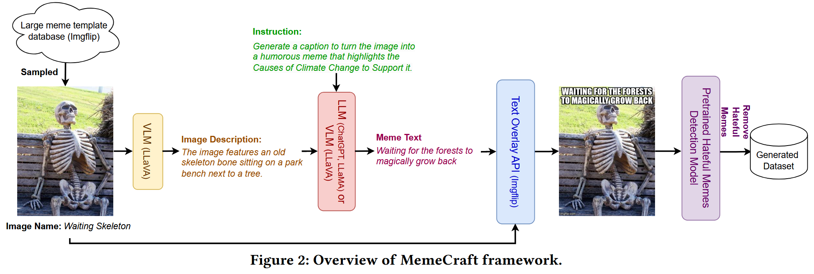| <div style="line-height: 1.05;font-size: 0.8em"> <details><summary>**[analogy]**</summary><div style="margin-top:6px">This work presents an end-to-end, training-free meme generator that operates through a sequence of template retrieval, visual description generation, text synthesis via structured prompting, meme composition, and final hate speech detectio…</div></details><div style="margin-top:6px"><details><summary>**[summary]**</summary><div style="margin-top:6px">**[motivation]** While internet memes have evolved into potent vehicles for social and political discourse, existing generation tools often lack the capability to align content with specific ideological stances or ensure safety against hate speech.<br>**[innovation]** This work proposes a novel framework utilizing off-the-shelf Large Language Models \(LLMs\) and Visual Language Models \(VLMs\) to generate advocacy-driven memes without fine-tuning, incorporating a dedicated safety mechanism to mitigate the p…<br>**[method]** The authors devise an inference-only pipeline that decouples visual processing from text generation: a VLM first converts meme templates into textual descriptions, which serve as context for an LLM conditioned on structured prompts \(e.g.,…<br>**[conclusion/contribution]** Experimental evaluations focusing on UN Sustainable Development Goals demonstrate that the approach, particularly when leveraging ChatGPT, significantly outperforms state-of-the-art baselines in terms of hilarity and persuasiveness, achiev…<br>**[limitation/future]** A notable limitation lies in the information bottleneck introduced by converting visual data into text descriptions, which may fail to capture fine-grained visual nuances or pixel-level text-image interplay compared to end-to-end multimoda…</div></details><div style="margin-top:6px"><details><summary>**[notes]**</summary><div style="margin-top:6px">\[引用文\]In the pursuit of deploying generative AI for specific social goals, Wang and Lee \[1\] introduce MemeCraft, a framework designed to fabricate memes advocating for UN Sustainable Development Goals \(e.g., climate action\). It functions as an end-to-end, inference-only generation framework where visual semantics are compressed into textual descriptions by a VLM to guide an LLM in generating stanc…</div></details></div></div></div>|
|<a id="paper-entry-82ac391ac100"></a>[](https://github.com/tygobl/meme-clustering) []()<br>[Clustering Internet Memes Through Template Matching and Multi-Dimensional Similarity](https://ojs.aaai.org/index.php/ICWSM/article/view/35815) <br> Tygo Bloem, Filip Ilievski <br> 2025-06-07|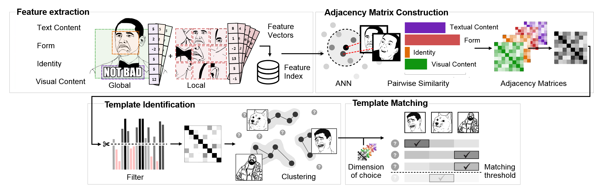| <div style="line-height: 1.05;font-size: 0.8em"> <details><summary>**[analogy]**</summary><div style="margin-top:6px">Utilizing the Louvain community detection algorithm for meme clustering, the study decomposes similarity into four dimensions \(form, visual content, text, and identity\) to construct adjacency matrices, and employs a strategy of filtering p…</div></details><div style="margin-top:6px"><details><summary>**[summary]**</summary><div style="margin-top:6px">**[motivation]** Existing approaches often rely on static, incomplete databases or single-modality features, failing to capture the dynamic evolution and multi-layered semantics of internet memes.<br>**[innovation]** The study introduces a fine-grained multi-dimensional similarity framework and a two-stage strategy that filters weak connections to bootstrap high-purity template clusters, significantly enhancing the efficiency of community detection alg…<br>**[method]** The method constructs adjacency matrices based on form, content, text, and identity features, applying a filtering threshold to simplify the graph structure for robust, low-noise template identification, followed by classifying the remaini…<br>**[conclusion/contribution]** Experimental results demonstrate that this template-based approach achieves superior cluster consistency \(0.94\) compared to standard baselines, effectively handling diverse meme variants while aligning with human semantic intuition.<br>**[limitation/future]** The framework's performance is contingent on the quality of upstream feature extractors and currently lacks integration with external knowledge graphs to interpret complex cultural metaphors or irony.</div></details><div style="margin-top:6px"><details><summary>**[notes]**</summary><div style="margin-top:6px">【meme聚类】</div></details></div></div></div>|
|[↪ CAMEL: Capturing Metaphorical Alignment with Context Disentangling for Multimodal Emotion Recogni...](#paper-entry-d2dacb22b91f) <sub>Full entry</sub>|||
|<a id="paper-entry-6b1ffb476bfd"></a> []()<br>[SF2T: Self-supervised Fragment Finetuning of Video-LLMs for Fine-Grained Understanding](https://openaccess.thecvf.com/content/CVPR2025/html/Hu_SF2T_Self-supervised_Fragment_Finetuning_of_Video-LLMs_for_Fine-Grained_Understanding_CVPR_2025_paper.html) <br> Yangliu Hu, Zikai Song, Na Feng, Yawei Luo, Junqing Yu, Yi-Ping Phoebe Chen, Wei Yang <br> 2025|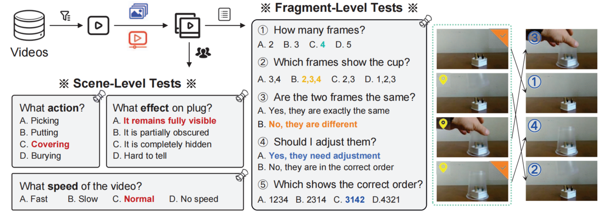| <div style="line-height: 1.05;font-size: 0.8em"> <details><summary>**[analogy]**</summary><div style="margin-top:6px">\[AI generated\] SF2T is like a self-taught video analyst that learns fine-grained spatiotemporal details by solving fragment puzzles without human annotations.</div></details></div>|
|<a id="paper-entry-63399179d871"></a> []()<br>[CurEvo: Curriculum-guided self-evolution for video understanding](http://arxiv.org/abs/2604.26707) <br> Guiyi Zeng, Junqing Yu, Yi-Ping Phoebe Chen, Xu Chen, Wei Yang, Zikai Song <br> 2026-04-29|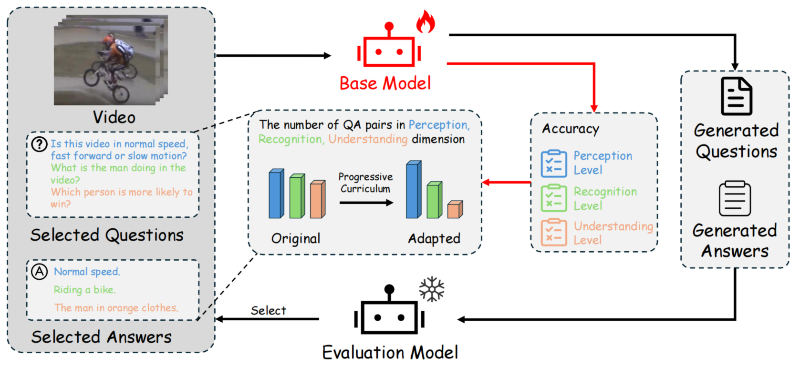| <div style="line-height: 1.05;font-size: 0.8em"> <details><summary>**[analogy]**</summary><div style="margin-top:6px">\[AI generated\] CurEvo: Structured self-study with a dynamically adjusted syllabus, progressing from perception to reasoning without a teacher.</div></details></div>|
|<a id="paper-entry-3fec994174a7"></a> []()<br>[Video anomaly detection with motion and appearance guided patch diffusion model](https://ojs.aaai.org/index.php/AAAI/article/view/33169) <br> Hang Zhou, Jiale Cai, Yuteng Ye, Yonghui Feng, Chenxing Gao, Junqing Yu, Zikai Song, Wei Yang <br> 2025-04-11|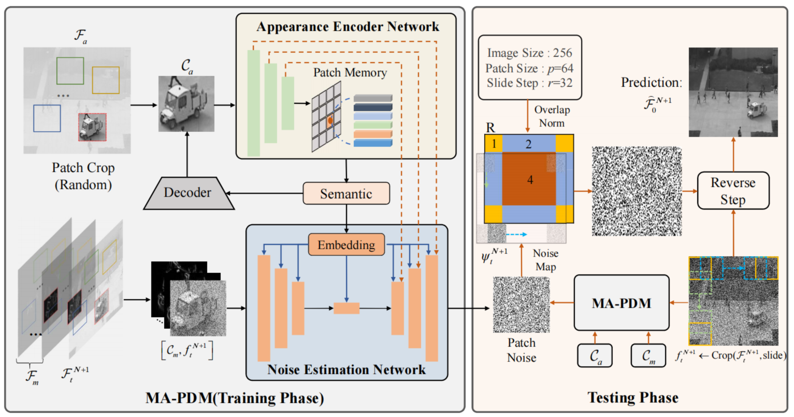| <div style="line-height: 1.05;font-size: 0.8em"> <details><summary>**[analogy]**</summary><div style="margin-top:6px">\[AI generated\] Patch-based anomaly detection with motion and appearance guidance: a diffusion model that focuses on local patches and uses motion and appearance cues to predict normal frames, flagging deviations as anomalies</div></details></div>|
|[↪ Coupled mamba: Enhanced multimodal fusion with coupled state space model](#paper-entry-d11742725b8e) <sub>Full entry</sub>|||
|[↪ TOT：Topology-Aware Optimal Transport for Multimodal Hate Detection](#paper-entry-f20c76389d14) <sub>Full entry</sub>|||
|[↪ Beneath the Surface: Unveiling Harmful Memes with Multimodal Reasoning Distilled from Large Langu...](#paper-entry-a48839cfe1d0) <sub>Full entry</sub>|||
|<a id="paper-entry-d296f832ad32"></a> []()<br>[Computational Meme Understanding: A Survey](https://aclanthology.org/2024.emnlp-main.1184) <br> Khoi P. N. Nguyen, Vincent Ng <br> 2024|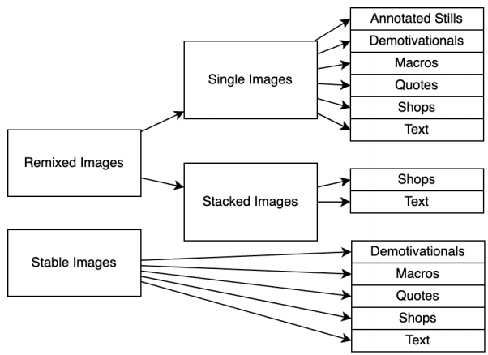| <div style="line-height: 1.05;font-size: 0.8em"> <details><summary>**[analogy]**</summary><div style="margin-top:6px">\[AI generated\] Memes as a multimodal social signal: automated comprehension requires decoding layered visual-textual cues, subcultural literacy, and temporal context.</div></details></div>|
|<a id="paper-entry-315a6284eef1"></a>[](https://github.com/claws-lab/MMSoc) []()<br>[MM-SOC: Benchmarking Multimodal Large Language Models in Social Media Platforms](https://aclanthology.org/2024.findings-acl.370) <br> Yiqiao Jin, Minje Choi, Gaurav Verma, Jindong Wang, Srijan Kumar <br> 2024|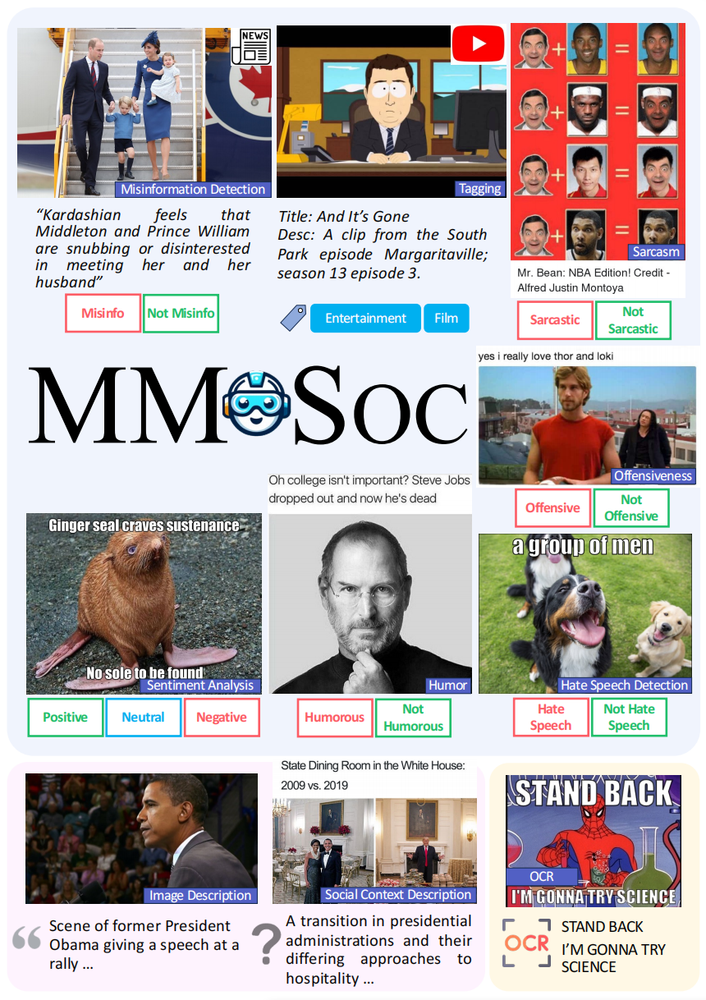| <div style="line-height: 1.05;font-size: 0.8em"> <details><summary>**[analogy]**</summary><div style="margin-top:6px">\[AI generated\] MM-SOC acts as a stress test for multimodal LLMs, revealing that social media understanding is like navigating a complex social gathering—models often misinterpret the nuanced interplay of text, images, and context without t…</div></details></div>|
|<a id="paper-entry-2a47b4ef6aaa"></a>[](https://github.com/NUSTM/GMNER) []()<br>[Grounded Multimodal Named Entity Recognition on Social Media](https://aclanthology.org/2023.acl-long.508) <br> Jianfei Yu, Ziyan Li, Jieming Wang, Rui Xia <br> 2023|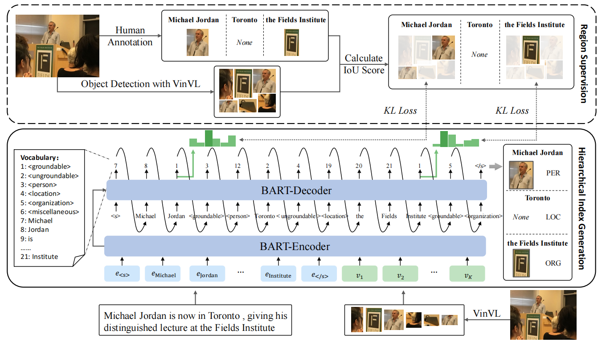| <div style="line-height: 1.05;font-size: 0.8em"> <details><summary>**[analogy]**</summary><div style="margin-top:6px">\[AI generated\] Grounded multimodal NER: Linking textual entities to image regions for disambiguation</div></details></div>|
|<a id="paper-entry-2d2cf75a6112"></a>[](https://github.com/AnnaYang2020/DeepEval) []()<br>[Can Large Multimodal Models Uncover Deep Semantics Behind Images?](https://aclanthology.org/2024.findings-acl.113) <br> Yixin Yang, Zheng Li, Qingxiu Dong, Heming Xia, Zhifang Sui <br> 2024|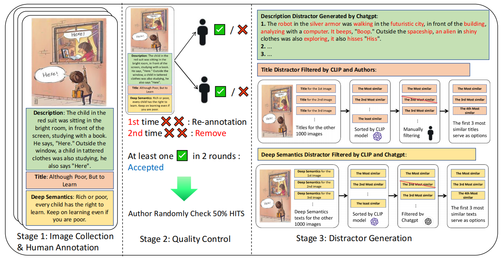| <div style="line-height: 1.05;font-size: 0.8em"> <details><summary>**[analogy]**</summary><div style="margin-top:6px">\[AI generated\] Understanding visual deep semantics is like peeling an onion: surface descriptions are the outer skin, titles reveal the inner layers, and deep semantics reach the core meaning</div></details></div>|
|<a id="paper-entry-a64ff7e1f675"></a> []()<br>[Uncertain multimodal intention and emotion understanding in the wild](https://openaccess.thecvf.com/content/CVPR2025/html/Yang_Uncertain_Multimodal_Intention_and_Emotion_Understanding_in_the_Wild_CVPR_2025_paper.html) <br> Qu Yang, Qinghongya Shi, Tongxin Wang, Mang Ye <br> 2025|<div style="display:flex;flex-direction:column;gap:6px;align-items:center">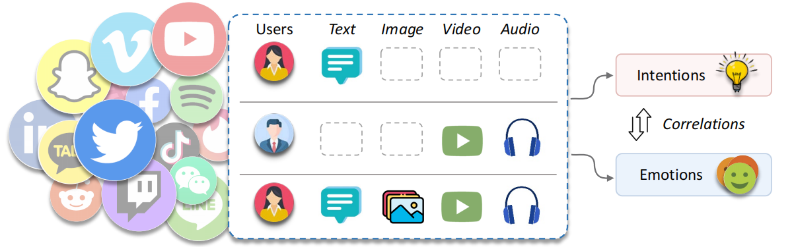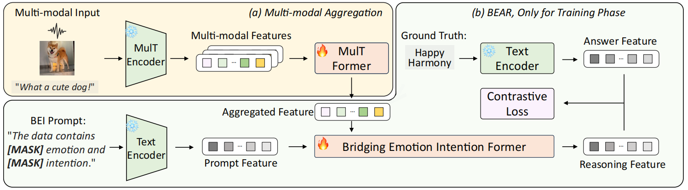</div>| <div style="line-height: 1.05;font-size: 0.8em"> <details><summary>**[analogy]**</summary><div style="margin-top:6px">\[AI generated\] Uncertain multimodal social media understanding: bridging emotion and intention with implicit label reasoning under missing modalities</div></details></div>|
|<a id="paper-entry-786def8cd6d3"></a> []()<br>[An effective span-based multimodal named entity recognition with consistent cross-modal alignment](https://aclanthology.org/2024.lrec-main.95/) <br> Yongxiu Xu, Hao Xu, Heyan Huang, Shiyao Cui, Minghao Tang, Longzheng Wang, Hongbo Xu <br> 2024-05|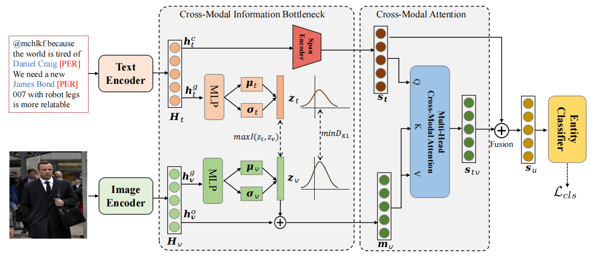||
|<a id="paper-entry-d29727780a4f"></a>[](https://github.com/LCS2-IIITD/MEMEX_Meme_Evidence) []()<br>[MEMEX: Detecting Explanatory Evidence for Memes via Knowledge-Enriched Contextualization](https://aclanthology.org/2023.acl-long.289) <br> Shivam Sharma, Ramaneswaran S, Udit Arora, Md. Shad Akhtar, Tanmoy Chakraborty <br> 2023|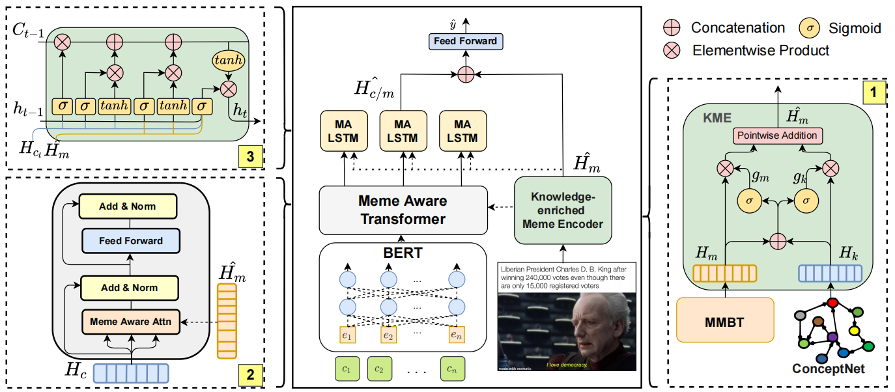| <div style="line-height: 1.05;font-size: 0.8em"> <details><summary>**[analogy]**</summary><div style="margin-top:6px">\[AI generated\] MEMEX: Given a meme and a related document, detect the sentences that explain the meme's background, like finding the key that unlocks a cultural inside joke.</div></details></div>|
|<a id="paper-entry-f09f74ea8d98"></a>[](https://github.com/LCS2-IIITD/LUMEN-Explaining-Memes) []()<br>[What Do You MEME? Generating Explanations for Visual Semantic Role Labelling in Memes](https://ojs.aaai.org/index.php/AAAI/article/view/26166) <br> Shivam Sharma, Siddhant Agarwal, Tharun Suresh, Preslav Nakov, Md. Shad Akhtar, Tanmoy Chakraborty <br> 2023-06-26|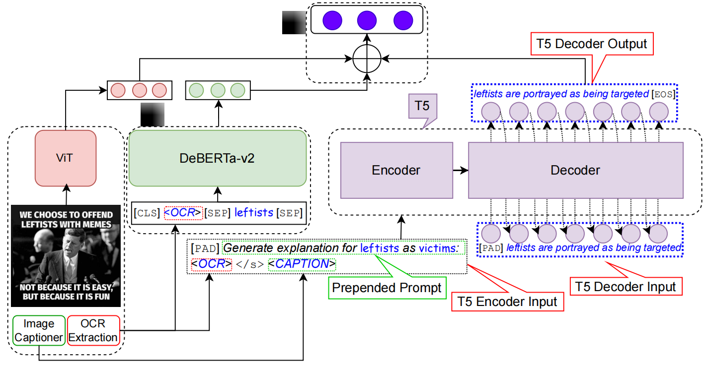| <div style="line-height: 1.05;font-size: 0.8em"> <details><summary>**[analogy]**</summary><div style="margin-top:6px">\[AI generated\] EXCLAIM: generating explanations for visual semantic role labeling in memes</div></details></div>|
|[↪ MIND: A Multi-agent Framework for Zero-shot Harmful Meme Detection](#paper-entry-aee316dafdd3) <sub>Full entry</sub>|||

#### Network and Propagation Understanding (27 papers)


##### Social Popularity Prediction (13 papers)

| Title & Info | Pipeline | Summary |
|:--| :----: | :---: |
|<a id="paper-entry-c6c3317c03f5"></a> []()<br>[In-context Prompt-augmented Micro-video Popularity Prediction](https://ojs.aaai.org/index.php/AAAI/article/view/33254) <br> Zhangtao Cheng, Jiao Li, Jian Lang, Ting Zhong, Fan Zhou <br> 2025-04-11|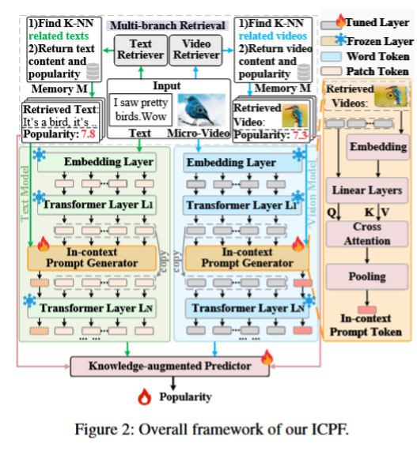| <div style="line-height: 1.05;font-size: 0.8em"> <details><summary>**[analogy]**</summary><div style="margin-top:6px">\[AI generated\] In-context Prompt-augmented Micro-video Popularity Prediction: Enhancing video popularity forecasting by retrieving similar content as contextual prompts, akin to providing reference examples to improve a model's judgment ac…</div></details><div style="margin-top:6px"><details><summary>**[summary]**</summary><div style="margin-top:6px">**[motivation]** Research objective: predict the popularity \(e.g., play count\) of micro-videos after publication.<br><br>Research motivation:<br><br><br>Limited contextual information: existing methods mostly analyze individual videos in isolation, ignoring the variabili…<br>**[innovation]** Novelty: the first to introduce **prompt learning** into the field of micro-video popularity prediction \(MVPP\).<br><br><br>Dynamic contextual prompts: unlike static prompts, this method generates dynamic, context-knowledge-infused prompt informatio…<br>**[method]** Multi-branch Retriever: By computing intra-modal similarity, it retrieves the $K$ instances most similar to the target video's visual and textual content from the memory bank to alleviate modality inconsistency. In-context Prompt Generator…<br>**[conclusion/contribution]** Significant performance improvement: It outperforms 14 mainstream baseline models on three datasets: TikTok, MicroLens, and NUS. On the TikTok dataset, the nMSE metric improved by 22%.<br><br><br>High parameter efficiency: Only about 3% of paramete…<br>**[limitation/future]** Limitations: The paper mentions that if the retrieved videos have excessively low relevance \(noise\), an overly large retrieval number $K$ will instead lead to performance degradation. Future work: Extend the ICPF framework to other multimo…</div></details></div></div>|
|[↪ Large Language Models Are Natural Video Popularity Predictors](#paper-entry-d4935d3a2219) <sub>Full entry</sub>|||
|<a id="paper-entry-00f7ee0e11ba"></a>[](https://github.com/ICDM-UESTC/MMRA) []()<br>[Predicting Micro-video Popularity via Multi-modal Retrieval Augmentation](https://dl.acm.org/doi/10.1145/3626772.3657929) <br> Ting Zhong, Jian Lang, Yifan Zhang, Zhangtao Cheng, Kunpeng Zhang, Fan Zhou <br> 2024-07-10|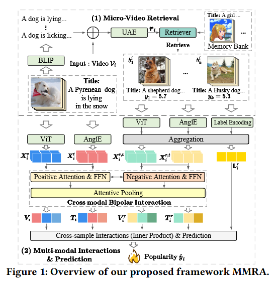| <div style="line-height: 1.05;font-size: 0.8em"> <details><summary>**[analogy]**</summary><div style="margin-top:6px">\[AI generated\] MMRA enhances micro-video popularity prediction by leveraging a multi-modal memory bank, akin to a librarian retrieving relevant past cases to inform current forecasts.</div></details><div style="margin-top:6px"><details><summary>**[summary]**</summary><div style="margin-top:6px">**[motivation]** Research objective: To improve the accuracy of micro-video popularity prediction on social platforms.<br><br>Research motivation:<br><br><br>Information silo problem: Existing multimodal prediction methods usually focus only on the internal information o…<br>**[innovation]** MMRA framework: Proposes the first multi-modal retrieval-augmented framework for micro-video popularity prediction.<br><br><br>Retrieval-interaction paradigm: It not only retrieves similar videos but also designs a multi-modal interaction network t…<br>**[method]** The MMRA framework mainly consists of three steps: Multimodal Retrieval: A memory bank is established to store visual features \(extracted by ViT\) and textual features \(extracted by BERT\) of historical videos. For the target video, its visu…<br>**[conclusion/contribution]** SOTA performance: On two real-world large-scale micro-video datasets \(such as TikTok/Kwai data\), MMRA outperforms existing state-of-the-art models \(including pure visual, pure textual, and multimodal baselines\) in terms of MSE, MAE, and SR…<br>**[limitation/future]** Limitations:<br><br><br>Retrieval efficiency: As the size of the memory bank increases, the computational overhead and time cost of the retrieval process will increase, affecting real-time performance.<br><br><br>Gap between similarity and popularity: Video…</div></details></div></div>|
|<a id="paper-entry-9e720fbe118c"></a>[](https://github.com/zhuwei321/SMTPD) []()<br>[SMTPD: A New Benchmark for Temporal Prediction of Social Media Popularity](https://ieeexplore.ieee.org/document/11092659/) <br> Yijie Xu, Bolun Zheng, Wei Zhu, Hangjia Pan, Yuchen Yao, Ning Xu, Anan Liu, Quan Zhang, Chenggang Yan <br> 2025-06-10|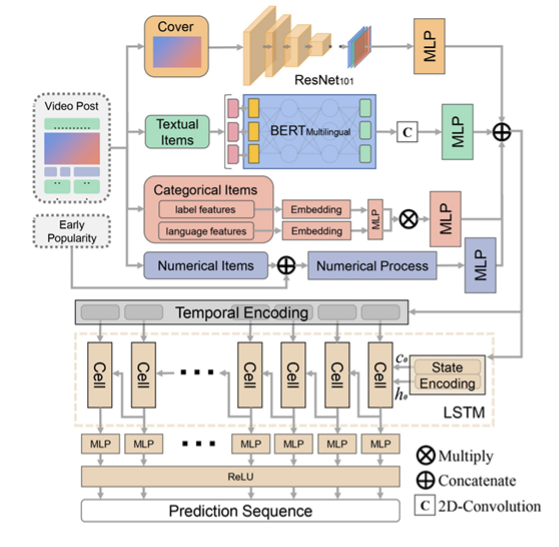| <div style="line-height: 1.05;font-size: 0.8em"> <details><summary>**[analogy]**</summary><div style="margin-top:6px">\[AI generated\] Predicting social media popularity is like forecasting weather patterns: both require analyzing dynamic temporal data to anticipate future trends.</div></details><div style="margin-top:6px"><details><summary>**[summary]**</summary><div style="margin-top:6px">**[motivation]** Objective: Construct a new benchmark \(SMTPD\) for predicting the popularity evolution of social media posts over a period after publication \(30 days\), and propose a temporal prediction framework adaptable to multilingual and multimodal envi…<br>**[innovation]** SMTPD dataset: Created a YouTube dataset containing more than 282,000 samples, covering over 90 languages. The dataset records daily popularity scores for 30 days after publication, achieving strict temporal alignment.<br><br><br>Temporal predictio…<br>**[method]** Feature Extraction \(Multi-Modal Feature Extraction\):<br><br><br>Visual: Used pre-trained ResNet-101 to extract semantic features of cover images.<br><br><br>Text: Utilized BERT-Multilingual to process multilingual titles, tags, and descriptions, extracting…<br>**[conclusion/contribution]** Benchmark establishment: Released the SMTPD dataset, filling the gap in multilingual, temporally aligned social media popularity datasets.<br><br><br>Key role of Early Popularity \(EP\): Experiments demonstrated that early \(day 1\) popularity is highl…<br>**[limitation/future]** Limitations:<br><br><br>Limited visual information: Currently only the cover image of the video is used, ignoring the multi-frame temporal visual information inside the video.<br><br><br>Insufficient language utilization: Although a multilingual model is us…</div></details><div style="margin-top:6px"><details><summary>**[notes]**</summary><div style="margin-top:6px">\[TLDR\] It is verified that temporal alignment and early popularity play crucial roles in social media popularity prediction for not only deepening the understanding of temporal dynamics of popularity in social media but also offering a suggestion about developing more effective prediction models in this field.</div></details></div></div></div>|
|<a id="paper-entry-682839e3a812"></a> []()<br>[Retrieval-Augmented Hypergraph for Multimodal Social Media Popularity Prediction](https://dl.acm.org/doi/10.1145/3637528.3672041) <br> Zhangtao Cheng, Jienan Zhang, Xovee Xu, Goce Trajcevski, Ting Zhong, Fan Zhou <br> 2024-08-24|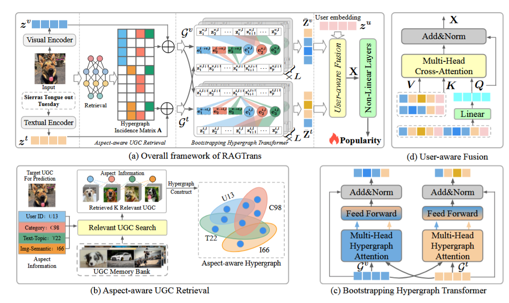| <div style="line-height: 1.05;font-size: 0.8em"> <details><summary>**[analogy]**</summary><div style="margin-top:6px">\[AI generated\] RAGTrans is like a librarian who not only reads the book you brought but also fetches related books from the shelves, then uses a special discussion group \(hypergraph\) to synthesize insights from all of them to better predic…</div></details><div style="margin-top:6px"><details><summary>**[summary]**</summary><div style="margin-top:6px">**[motivation]** Research objective: Improve the accuracy of popularity prediction for multimodal social media content \(UGC\).<br><br>Research motivation:<br><br>Information limitation: Most existing popularity prediction methods focus only on the content of the post i…<br>**[innovation]** RAGTrans framework: Proposed the first retrieval-augmented hypergraph Transformer framework \(Retrieval-Augmented Hypergraph Transformer\), specifically designed for multimodal popularity prediction.<br><br>Aspect-Aware Retrieval: Designed a multi…<br>**[method]** Multimodal memory bank and retrieval: Constructed a multimodal memory bank containing a large number of historical posts. For each target post, retrieval is performed using four "aspects": user, category, text topic \(based on LDA\), and ima…<br>**[conclusion/contribution]** Performance improvement: Experiments were conducted on three large-scale real-world datasets \(TikTok, Flickr, Instagram\), and RAGTrans significantly outperformed existing state-of-the-art \(SOTA\) models on metrics such as MSE, MAE, and SRC.…<br>**[limitation/future]** Limitations:<br><br>Computational overhead: The retrieval process and hypergraph construction may incur additional computational and time overhead on large-scale datasets, especially the real-time retrieval component.<br><br>Dependence on historical d…</div></details></div></div>|
|<a id="paper-entry-27c1e7af5fe2"></a> []()<br>[Improving Multimodal Social Media Popularity Prediction via Selective Retrieval Knowledge Augment...](https://ojs.aaai.org/index.php/AAAI/article/view/32078) <br> Xovee Xu, Yifan Zhang, Fan Zhou, Jingkuan Song <br> 2025-04-11|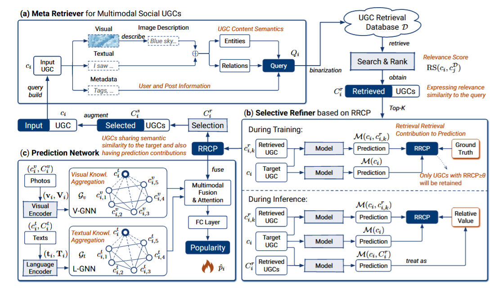| <div style="line-height: 1.05;font-size: 0.8em"> <details><summary>**[analogy]**</summary><div style="margin-top:6px">\[AI generated\] Predicting social media popularity is like forecasting a song's hit potential by analyzing not just its melody and lyrics, but also the current music trends, similar past hits, and audience reactions, then selectively blendi…</div></details><div style="margin-top:6px"><details><summary>**[summary]**</summary><div style="margin-top:6px">**[motivation]** Research objective: Improve the accuracy of popularity prediction for multimodal social media content \(UGC\).<br><br>Research motivation:<br><br>Limitation of the isolated perspective: Existing methods typically treat each UGC item as an isolated indiv…<br>**[innovation]** SKAPP framework: Proposed a "Selective retrieval Knowledge Augmentation for Popularity Prediction" framework.<br><br>Meta Retriever: Unlike simple retrieval based only on vision or text, this module constructs a comprehensive query incorporating…<br>**[method]** Meta Retrieval: Uses an image-to-text model to generate detailed descriptions of images, and combines original text, entities, and metadata \(User ID, Tags, etc.\) to construct a rich query $Q_i$. Uses the BM25 algorithm to retrieve Top-K re…<br>**[conclusion/contribution]** Significant performance improvement: On three large-scale datasets, ICIP, SMPD, and Instagram, SKAPP achieved significant performance improvements of 26.68% to 48.19% over 11 strong baseline models \(including SVR, BLIP, NIPA, etc.\).<br><br>Criti…<br>**[limitation/future]** Limitations:<br><br>Computational overhead: Although faster than some complex models, retrieval and graph computation still increase inference time cost compared with simple end-to-end models \(the retrieval process takes approximately several ho…</div></details><div style="margin-top:6px"><details><summary>**[notes]**</summary><div style="margin-top:6px">Other<br>The proposed method achieves first place in the ICCV VQualA 2025 EVQA-SnapUGC Challenge on short-form video engagement prediction</div></details></div></div></div>|
|<a id="paper-entry-45468dcaa3ab"></a> []()<br>[MVP: Winning Solution to SMP Challenge 2025 Video Track](https://dl.acm.org/doi/10.1145/3746027.3763761) <br> Liliang Ye, Yunyao Zhang, Yafeng Wu, Yi-Ping Phoebe Chen, Junqing Yu, Wei Yang, Zikai Song <br> 2025-10-27|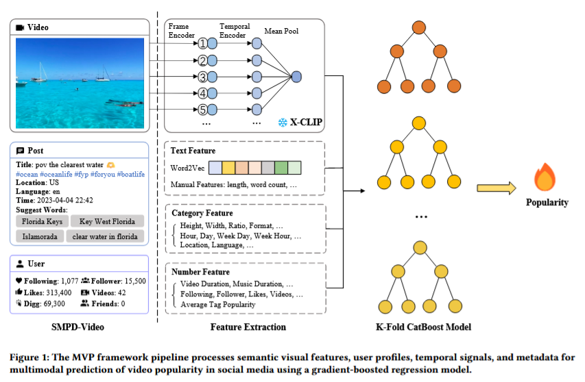| <div style="line-height: 1.05;font-size: 0.8em"> <details><summary>**[analogy]**</summary><div style="margin-top:6px">\[AI generated\] MVP is like a multimodal detective that combines video clues, user profiles, and context to forecast a video's social media success.</div></details><div style="margin-top:6px"><details><summary>**[summary]**</summary><div style="margin-top:6px">**[motivation]** Research objective: In the SMP Challenge 2025 competition, accurately predict the popularity of social media videos.<br><br>Research motivation:<br><br>Social media platforms are central to content dissemination, and accurately predicting video popula…<br>**[innovation]** MVP framework: Proposed the Multimodal Video Predictor \(MVP\) framework, a comprehensive prediction system integrating deep features and statistical features.<br><br>Systematic preprocessing: Applied systematic data preprocessing techniques, incl…<br>**[method]** Data preprocessing:<br><br>Applies log-transformation to the skewed target variable to make it more consistent with a normal distribution.<br><br>Applies outlier removal strategies to clean noisy data and improve model stability.<br><br>Feature extraction:…<br>**[conclusion/contribution]** Competition championship: The solution ranked first in the official evaluation of the SMP Challenge 2025 video track.<br><br>Engineering validation: Validated that in competition scenarios, solid feature engineering \(deep features + metadata\) co…<br>**[limitation/future]** Limitations: \(Inferred from the abstract\) As a competition solution, it typically emphasizes model stacking and feature engineering, and may lack theoretical innovation in end-to-end architecture; optimization of inference speed and comput…</div></details><div style="margin-top:6px"><details><summary>**[notes]**</summary><div style="margin-top:6px">\[TLDR\] Multimodal Video Predictor \(MVP\), the winning solution to the Video Track of the SMP Challenge 2025, is presented, demonstrating its effectiveness and reliability for multimodal video popularity prediction on social platforms.</div></details></div></div></div>|
|<a id="paper-entry-28dcc627ab78"></a> []()<br>[FAME: Fusion-aware multi-modal ensemble for social media popularity prediction](https://dl.acm.org/doi/10.1145/3746027.3763759) <br> Yan Zhuang, Wei Bai, Yanru Zhang, Minhao Liu, Jiawen Deng, Fuji Ren <br> 2025-10-27|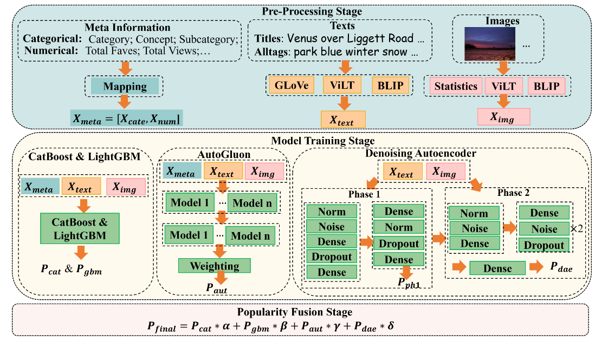| <div style="line-height: 1.05;font-size: 0.8em"> <details><summary>**[analogy]**</summary><div style="margin-top:6px">\[AI generated\] FAME is like a team of specialized experts collaborating to predict social media trends, where each member contributes unique insights from different data types to achieve a more accurate forecast.</div></details><div style="margin-top:6px"><details><summary>**[summary]**</summary><div style="margin-top:6px">**[motivation]** Research objective: Accurately predict the popularity \(e.g., views, likes\) of social media posts containing text, images, and metadata.<br><br>Research motivation:<br><br>Modality heterogeneity: Social media data contains unstructured data \(images, te…<br>**[innovation]** Hybrid ensemble architecture: Unlike common approaches that use only deep learning or only feature engineering, FAME innovatively constructs an ensemble system containing 4 heterogeneous predictors.<br><br>Sub-models with distinct roles:<br><br>3 tree…<br>**[method]** Feature engineering and preprocessing:<br><br>Applies log-transformation and normalization to numerical features.<br><br>Extracts rich statistical features \(e.g., tag frequency, user historical popularity\).<br><br>Parallel prediction:<br><br>Path A \(structured pa…<br>**[conclusion/contribution]** Strong competition results: The solution won first place in the SMP Challenge 2025 competition, demonstrating the effectiveness of the method.<br><br>Complementarity validation: Experiments show that the prediction results of tree models and dee…<br>**[limitation/future]** Limitations:<br><br>High computational overhead: Requires simultaneously training and inferring four complex models \(including large Transformers and multiple ensemble trees\), consuming substantial computational resources and resulting in slower…</div></details></div></div>|
|<a id="paper-entry-f26408d3d0ef"></a> []()<br>[Higher-order vision-language fusion for video popularity prediction](https://dl.acm.org/doi/10.1145/3746027.3763762) <br> Kele Xu, Qisheng Xu, Binli Luo, Han Zhou, Zengming Lin, Hui Geng, Xianhan Tan <br> 2025-10-27|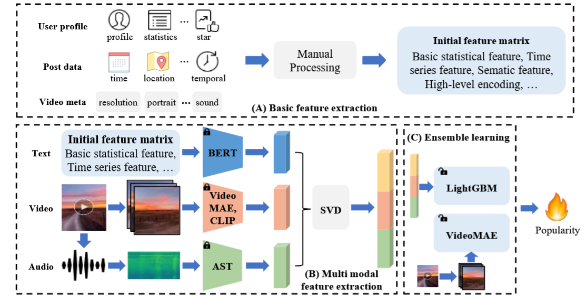| <div style="line-height: 1.05;font-size: 0.8em"> <details><summary>**[analogy]**</summary><div style="margin-top:6px">\[AI generated\] This approach is like a multilingual conference interpreter who not only translates words but also captures the speaker's tone, cultural references, and audience reactions to predict the impact of a speech.</div></details><div style="margin-top:6px"><details><summary>**[summary]**</summary><div style="margin-top:6px">**[motivation]** Research objective: Predict the popularity \(user engagement\) of short videos on social media \(e.g., TikTok, Instagram Reels\).<br><br>Research motivation:<br><br>Specificity of video: Unlike static images, videos contain temporally evolving visual sign…<br>**[innovation]** Higher-order temporal fusion: Not only fuses static features, but also integrates temporally encoded video segment features through a hierarchical architecture, capturing cross-modal dependencies across the time axis.<br><br>Dynamic user modelin…<br>**[method]** The framework consists of three main components:<br><br>Handcrafted Feature Extraction:<br><br>Post-level: Extracts statistical features such as tag frequency and co-occurrence of trending topics.<br><br>User-level: Constructs features reflecting user activ…<br>**[conclusion/contribution]** Strong competition results: The method ranked among the top in the 2025 SMP Challenge, demonstrating its effectiveness.<br><br>Value of deep alignment: Empirical results show that deep semantic alignment \(Deep Semantic Alignment\) across video, t…<br>**[limitation/future]** Limitations:<br><br>System complexity: The framework involves multiple large pretrained models \(VideoMAE, BERT, AST\) and a complex feature engineering pipeline, resulting in high computational resource consumption and high deployment and mainten…</div></details></div></div>|
|[↪ Seeing the Unseen in Micro-Video Popularity Prediction: Self-Correlation Retrieval for Missing Mo...](#paper-entry-05caa3c5a90c) <sub>Full entry</sub>|||
|[↪ Cross-Modal Prototype Augmentation and Dual-Grained Prompt Learning for Social Media Popularity P...](#paper-entry-78709f3415ee) <sub>Full entry</sub>|||
|<a id="paper-entry-c72e35720c14"></a> []()<br>[Seeing further and wider: Joint spatio-temporal enlargement for micro-video popularity prediction](http://arxiv.org/abs/2604.20311) <br> Dali Wang, Yunyao Zhang, Junqing Yu, Yi-Ping Phoebe Chen, Chen Xu, Zikai Song <br> 2026-04-23|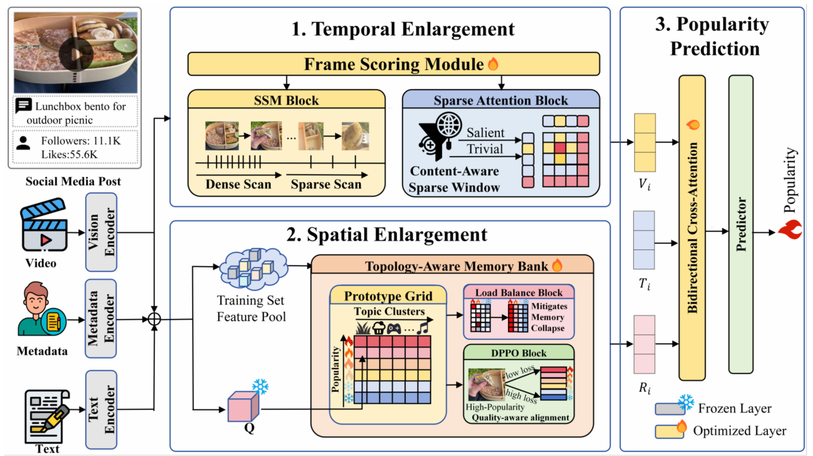| <div style="line-height: 1.05;font-size: 0.8em"> <details><summary>**[analogy]**</summary><div style="margin-top:6px">\[AI generated\] Temporal and spatial co-enlargement: long-range highlight capture meets scalable topology-aware retrieval</div></details></div>|
|<a id="paper-entry-bc7d48bf85e7"></a> []()<br>[OmniTrend: Content-context modeling for scalable social popularity prediction](http://arxiv.org/abs/2604.26252) <br> Liliang Ye, Guiyi Zeng, Yunyao Zhang, Yi-Ping Phoebe Chen, Junqing Yu, Zikai Song <br> 2026-04-29|<div style="display:flex;flex-direction:column;gap:6px;align-items:center">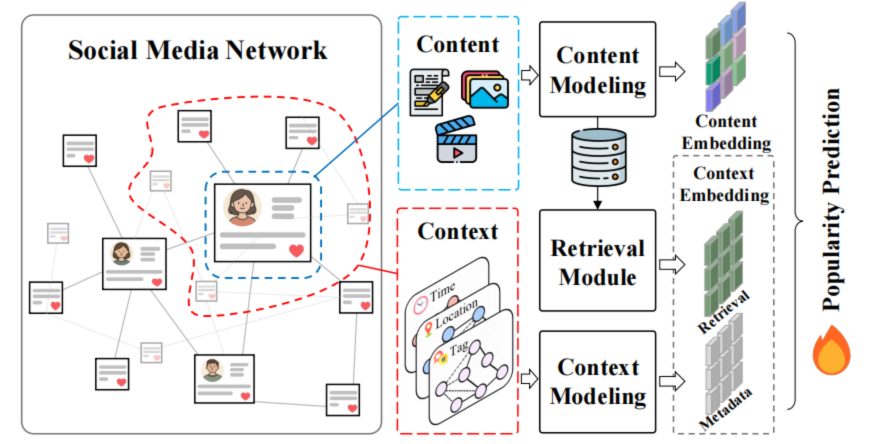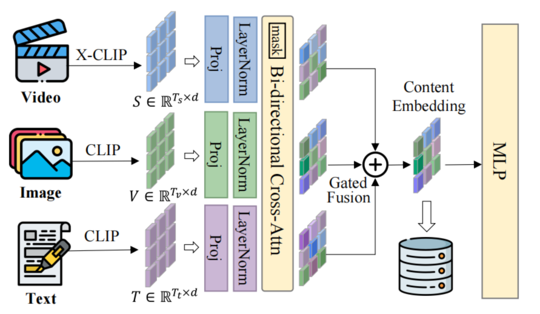</div>| <div style="line-height: 1.05;font-size: 0.8em"> <details><summary>**[analogy]**</summary><div style="margin-top:6px">\[AI generated\] OmniTrend: A two-factor decomposition of popularity into content appeal and exposure, like separating a product’s quality from its shelf placement</div></details></div>|

##### Information Diffusion Analysis (14 papers)

| Title & Info | Pipeline | Summary |
|:--| :----: | :---: |
|<a id="paper-entry-140fbd2fdd51"></a>[](https://github.com/GudanDeco/Latent-influence-network) []()<br>[LIN: Latent Influence Network for Discovering Hidden Directed Influence Links on Social Media](https://ojs.aaai.org/index.php/ICWSM/article/view/35842) <br> Chenhao Gu, Zainab Razia Zaidi, Shanika Karunasekera <br> 2025-06-07|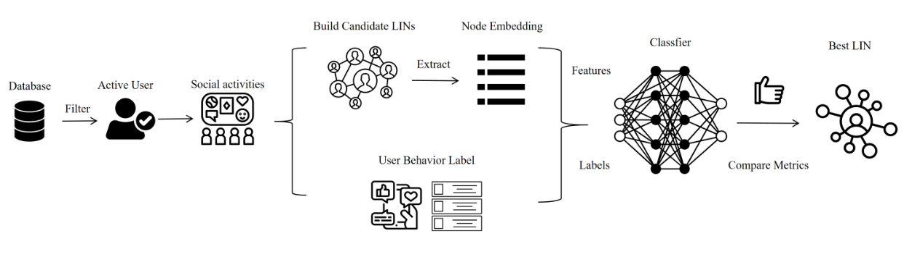| <div style="line-height: 1.05;font-size: 0.8em"> <details><summary>**[analogy]**</summary><div style="margin-top:6px">\[AI generated\] LIN acts like a social X-ray, revealing hidden influence pathways by analyzing user behavior patterns.</div></details><div style="margin-top:6px"><details><summary>**[summary]**</summary><div style="margin-top:6px">**[motivation]** \[AI generated\] To discover hidden and complex pathways of influence beyond apparent user interactions on social media.<br>**[innovation]** \[AI generated\] Proposes a Latent Influence Network \(LIN\) within the LIDET framework to discover hidden directed influence links from user behavior, significantly outperforming traditional models.<br>**[method]** \[AI generated\] Proposes the Latent Influence Network \(LIN\) within the LIDET framework, which identifies optimal network configurations based on user behavior labels to reveal hidden influence pathways.<br>**[conclusion/contribution]** \[AI generated\] LIN significantly outperforms traditional models in revealing hidden influence pathways, achieving 99% accuracy in a COVID-19 case study.<br>**[limitation/future]** \[AI generated\] The framework's performance heavily depends on the quality and granularity of user behavior labels, which may not always be available or reliable.</div></details><div style="margin-top:6px"><details><summary>**[notes]**</summary><div style="margin-top:6px">【之前的精读论文】</div></details></div></div></div>|
|[↪ Harnessing Network Effect for Fake News Mitigation: Selecting Debunkers via Self-Imitation Learning](#paper-entry-387b59452ed7) <sub>Full entry</sub>|||
|<a id="paper-entry-4a3789ff465d"></a>[](https://github.com/ki-ljl/POFHP) []()<br>[Public Opinion Field Effect and Hawkes Process Join Hands for Information Popularity Prediction](https://ojs.aaai.org/index.php/AAAI/article/view/33315) <br> Junliang Li, Yajun Yang, Yujia Zhang, Qinghua Hu, Alan Zhao, Hong Gao <br> 2025-04-11 <br> <span style="color:cyan">[multi-category: [Information Diffusion Analysis](#Information-Diffusion-Analysis-14-papers), [Mechanistic Models](#Mechanistic-Models-6-papers)]</span>|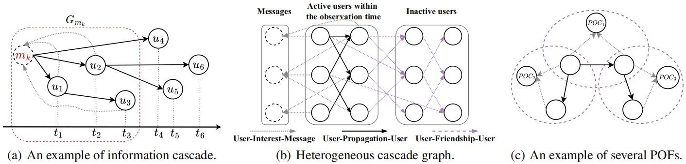| <div style="line-height: 1.05;font-size: 0.8em"> <details><summary>**[analogy]**</summary><div style="margin-top:6px">\[AI generated\] Competing public opinion fields: Multiple trending topics vie for limited user attention, shaping diffusion dynamics.</div></details></div>|
|[↪ Online rumors during the COVID-19 pandemic: co-evolution of themes and emotions](#paper-entry-6ef59bf87734) <sub>Full entry</sub>|||
|[↪ Mitigating Social Hazards: Early Detection of Fake News via Diffusion-Guided Propagation Path Gen...](#paper-entry-460dc8c13ae7) <sub>Full entry</sub>|||
|<a id="paper-entry-8cb8bef3472c"></a> []()<br>[Minimizing the influence of misinformation via vertex blocking](https://ieeexplore.ieee.org/document/10184636/) <br> Jiadong Xie, Fan Zhang, Kai Wang, Xuemin Lin, Wenjie Zhang <br> 2023-04|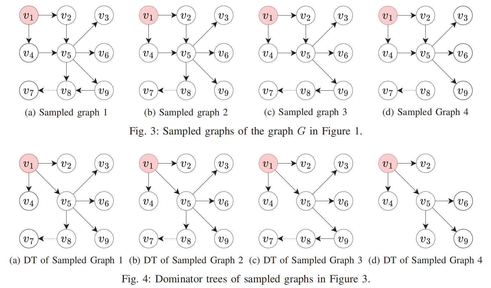| <div style="line-height: 1.05;font-size: 0.8em"> <details><summary>**[analogy]**</summary><div style="margin-top:6px">\[AI generated\] Just as blocking key vertices can stop a rumor cascade, the AdvancedGreedy algorithm efficiently identifies which nodes to remove by computing all candidates' influence drop at once via dominator trees.</div></details></div>|
|<a id="paper-entry-01fec26ef481"></a> []()<br>[A survey on information diffusion and competitive influence maximization in social networks](https://link.springer.com/10.1007/s13278-025-01459-2) <br> Shano Solanki, Mukesh Kumar, Rakesh Kumar <br> 2025-04-22|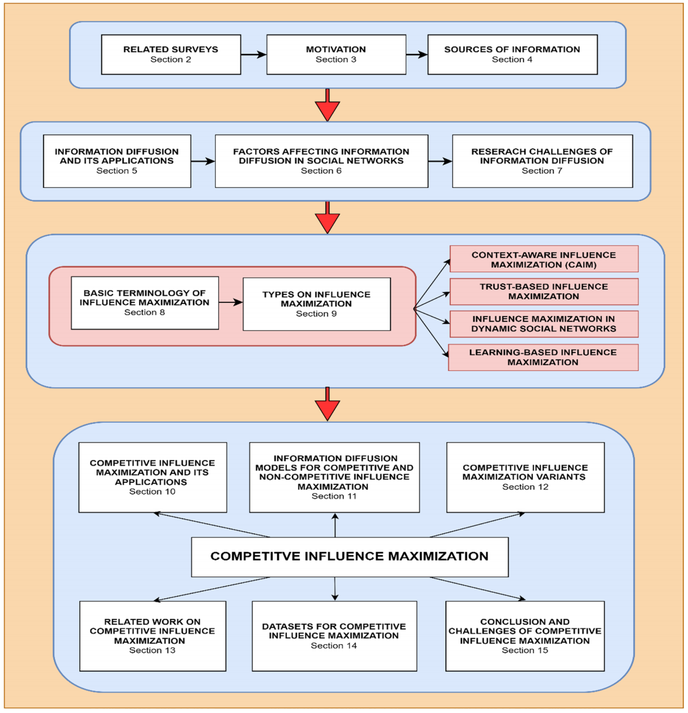| <div style="line-height: 1.05;font-size: 0.8em"> <details><summary>**[analogy]**</summary><div style="margin-top:6px">\[AI generated\] Competitive influence maximization: A strategic contest among multiple campaigns to capture the largest share of attention in a social network</div></details></div>|
|<a id="paper-entry-78181f562c0e"></a> []()<br>[Roles of network and identity in hashtag diffusion](https://openreview.net/forum?id=QtYgNQhEFX#discussion) <br> Aparna Ananthasubramaniam, Yufei Louise Zhu, David Jurgens, Daniel Romero <br> 2025-01-29|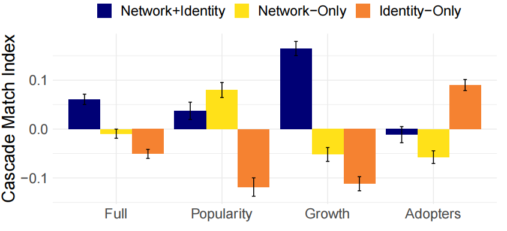| <div style="line-height: 1.05;font-size: 0.8em"> <details><summary>**[analogy]**</summary><div style="margin-top:6px">\[AI generated\] Network and identity as dual engines: hashtags spread through social ties and self-expression, jointly shaping cascade dynamics.</div></details></div>|
|<a id="paper-entry-6bc338eff7be"></a>[](https://github.com/junghunl/DiffIM) []()<br>[DiffIM: Differentiable influence minimization with surrogate modeling and continuous relaxation](https://ojs.aaai.org/index.php/AAAI/article/view/33994) <br> Junghun Lee, Hyunju Kim, Fanchen Bu, Jihoon Ko, Kijung Shin <br> 2025-04-11|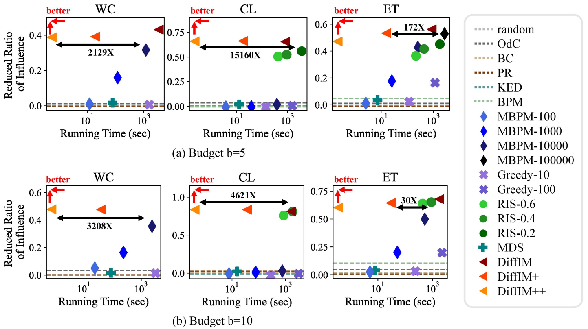| <div style="line-height: 1.05;font-size: 0.8em"> <details><summary>**[analogy]**</summary><div style="margin-top:6px">\[AI generated\] Surrogate modeling for influence minimization: A neural proxy that learns to predict propagation, bypassing costly simulations.</div></details></div>|
|<a id="paper-entry-9e4cd5dd9b1a"></a> []()<br>[The Irrelevance of Influencers: Information Diffusion with Re-Activation and Immunity Lasts Expon...](https://ojs.aaai.org/index.php/AAAI/article/view/29687) <br> Tobias Friedrich, Andreas G?bel, Nicolas Klodt, Martin S. Krejca, Marcus Pappik <br> 2024-03-24 <br> <span style="color:cyan">[multi-category: [Information Diffusion Analysis](#Information-Diffusion-Analysis-14-papers), [Mechanistic Models](#Mechanistic-Models-6-papers)]</span>|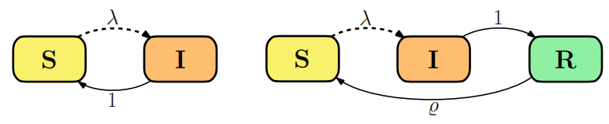| <div style="line-height: 1.05;font-size: 0.8em"> <details><summary>**[analogy]**</summary><div style="margin-top:6px">TLDR: Shows a threshold behavior for the survival time of the SIRS process on graphs with large expanding subgraphs \(e.g., social network models\), demonstrating a sharp threshold for random graphs.</div></details></div>|
|<a id="paper-entry-5cbf8162838a"></a> []()<br>[A Thorough Comparison Between Independent Cascade and Susceptible-Infected-Recovered Models](https://ojs.aaai.org/index.php/AAAI/article/view/32028) <br> Panfeng Liu, Guoliang Qiu, Biaoshuai Tao, Kuan Yang <br> 2025-04-11 <br> <span style="color:cyan">[multi-category: [Information Diffusion Analysis](#Information-Diffusion-Analysis-14-papers), [Mechanistic Models](#Mechanistic-Models-6-papers)]</span>|no pipeline| <div style="line-height: 1.05;font-size: 0.8em"> <details><summary>**[analogy]**</summary><div style="margin-top:6px">\[AI generated\] The SIR model is an IC variant where a node’s outgoing infections become correlated due to recovery, weakening the overall spread.</div></details><div style="margin-top:6px"><details><summary>**[notes]**</summary><div style="margin-top:6px">no figure or table</div></details></div></div>|
|<a id="paper-entry-658ad6542dbc"></a> []()<br>[Enhancing Multi-Scale Diffusion Prediction via Sequential Hypergraphs and Adversarial Learning](https://ojs.aaai.org/index.php/AAAI/article/view/28701) <br> Pengfei Jiao, Hongqian Chen, Qing Bao, Wang Zhang, Huaming Wu <br> 2024-03-24 <br> <span style="color:cyan">[multi-category: [Information Diffusion Analysis](#Information-Diffusion-Analysis-14-papers), [Graph-Based Models](#Graph-Based-Models-6-papers)]</span>|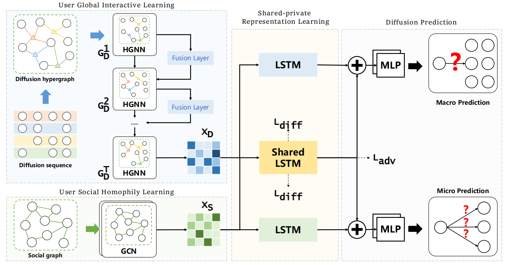| <div style="line-height: 1.05;font-size: 0.8em"> <details><summary>**[analogy]**</summary><div style="margin-top:6px">TLDR: This paper proposes an intuitive and effective model that addresses both macroscopic and microscopic prediction tasks and considers the interactions and dynamics among cascades at the macro level and incorporates the social homophily…</div></details></div>|
|<a id="paper-entry-2b9b551b5447"></a>[](https://github.com/HowieHsu0126/HyperIDP) []()<br>[HyperIDP: Customizing temporal hypergraph neural networks for multi-scale information diffusion p...](https://aclanthology.org/2025.coling-main.64/) <br> Haowei Xu, Chao Gao, Xianghua Li, Zhen Wang <br> 2025-01 <br> <span style="color:cyan">[multi-category: [Information Diffusion Analysis](#Information-Diffusion-Analysis-14-papers), [Graph-Based Models](#Graph-Based-Models-6-papers)]</span>|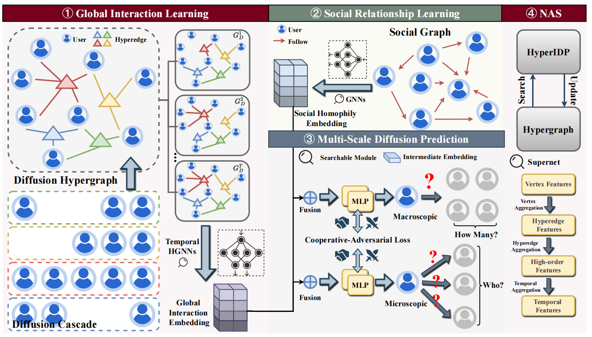| <div style="line-height: 1.05;font-size: 0.8em"> <details><summary>**[analogy]**</summary><div style="margin-top:6px">\[AI generated\] HyperIDP: A dual-scale cascade forecaster that uses temporal hypergraphs to capture global interactions and social homophily, with automated architecture search to adapt across platforms.</div></details></div>|
|<a id="paper-entry-2da82f8900e7"></a> []()<br>[THGNets: Constrained Temporal Hypergraphs and Graph Neural Networks in Hyperbolic Space for Infor...](https://ojs.aaai.org/index.php/AAAI/article/view/33331) <br> Yanchao Liu, Pengzhou Zhang, Wenchao Song, Yao Zheng, Deyu Li, Lei Shi, Junpeng Gong <br> 2025-04-11 <br> <span style="color:cyan">[multi-category: [Information Diffusion Analysis](#Information-Diffusion-Analysis-14-papers), [Graph-Based Models](#Graph-Based-Models-6-papers)]</span>|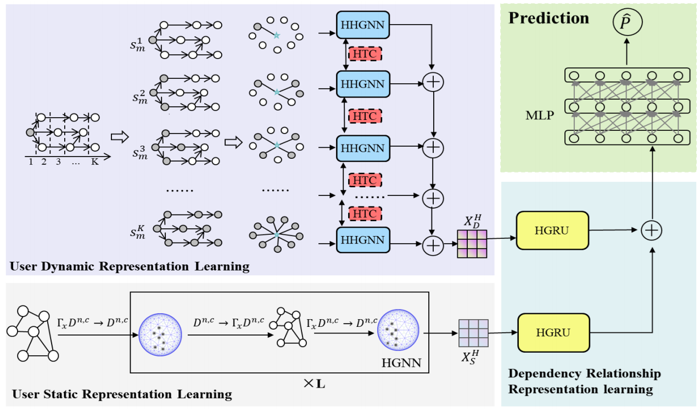| <div style="line-height: 1.05;font-size: 0.8em"> <details><summary>**[analogy]**</summary><div style="margin-top:6px">TLDR: This work introduces hyperbolic temporal hypergraphs neural network to alleviate the distortion of user features by hyperbolic hierarchical learning in information cascades and applies the hyperbolic graph neural network to investiga…</div></details></div>|

#### User-Level Understanding (13 papers)


##### User Profiling (7 papers)

| Title & Info | Pipeline | Summary |
|:--| :----: | :---: |
|<a id="paper-entry-45bc7ea84c1c"></a> []()<br>[PASUM: A pre-training architecture for social media user modeling based on text graph](https://aclanthology.org/2024.lrec-main.1107/) <br> Kun Wu, Xinyi Mou, Lanqing Xue, Zhenzhe Ying, Weiqiang Wang, Qi Zhang, Xuanjing Huang, Zhongyu Wei <br> 2024-05|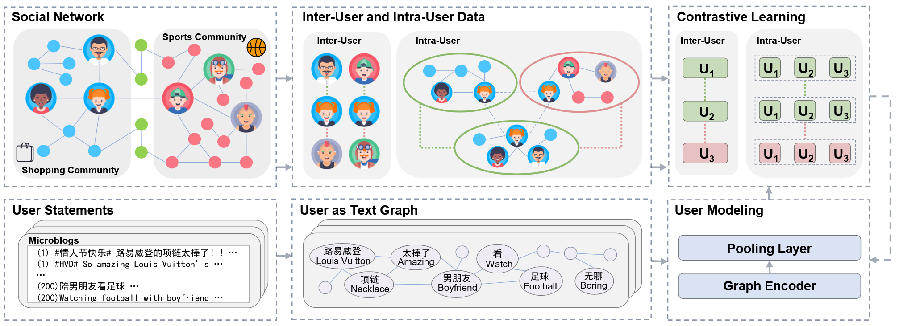| <div style="line-height: 1.05;font-size: 0.8em"> <details><summary>**[analogy]**</summary><div style="margin-top:6px">Self-supervised training is conducted using the structure of an attention graph network \(contrastive learning between different users, and contrastive learning between different communities of the same user\), word graph structures are used…</div></details><div style="margin-top:6px"><details><summary>**[summary]**</summary><div style="margin-top:6px">**[motivation]** To overcome the limitations of existing methods that struggle with lengthy user texts and the unavailability of explicit social graphs, this work addresses the challenge of learning generalizable user representations without relying on com…<br>**[innovation]** Its core innovation lies in an inductive pre-training architecture that represents users solely via personal text graphs and injects social structural awareness through inter-user and intra-user contrastive learning, eliminating the need f…<br>**[method]** The PASUM framework first constructs a text graph from each user's microblogs. It then employs a Graph Isomorphism Network \(GIN\) to encode the graph into a user representation. Finally, it pre-trains the encoder using contrastive loss func…<br>**[conclusion/contribution]** Extensive experiments on user profiling tasks demonstrate that PASUM outperforms text-based and graph-based baselines, particularly showing robustness when social connections are sparse or absent, validating the effectiveness of its struct…<br>**[limitation/future]** Limitations include mediocre few-shot performance and reliance solely on network-derived structural signals. Future work could integrate multimodal user behaviors and attributes to enrich the pre-training paradigm.</div></details><div style="margin-top:6px"><details><summary>**[notes]**</summary><div style="margin-top:6px">\[note\]关注网络的网络关系只是实现了训练数据的标注，并不是将整个图输入模型，**这相当于将图拓扑信息蒸馏到了非GNN模型中**。预训练时用户的特征表示也是词图聚合得到的。\[引用文\]In a technical approach to user modeling that does not require a global social graph at inference time, PASUM \(Wu et al., 2024\) pre-trains a user encoder by leveraging social network data only to generate supervision signals. The model processes a user's aggregated microblogs as a local text graph, and dur…</div></details></div></div></div>|
|<a id="paper-entry-390d2d89cf50"></a> []()<br>[Behavior Based Group Recommendation from Social Media Dataset by Using Deep Learning and Topic Mo...](https://link.springer.com/10.1007/s42979-024-03055-1) <br> Md. Saddam Hossain Mukta, Jubaer Ahmed, Mohaimenul Azam Khan Raiaan, Nur Mohammad Fahad, Muhammad Nazrul Islam, Nafiz Imtiaz, ... <br> 2024-07-16 <br> <span style="color:cyan">[multi-category: [Community Detection and Analysis](#Community-Detection-and-Analysis-7-papers), [User Profiling](#User-Profiling-7-papers)]</span>|<div style="display:flex;flex-direction:column;gap:6px;align-items:center">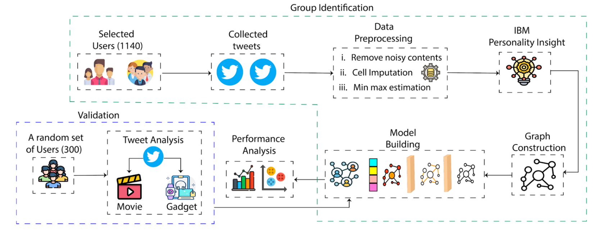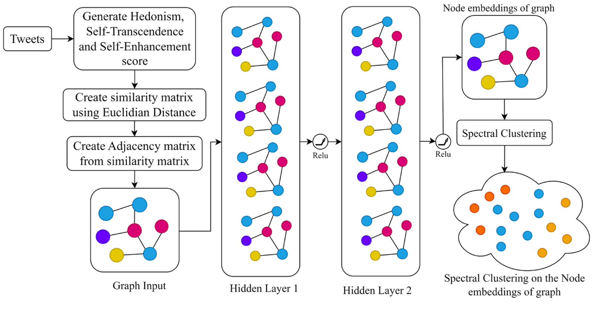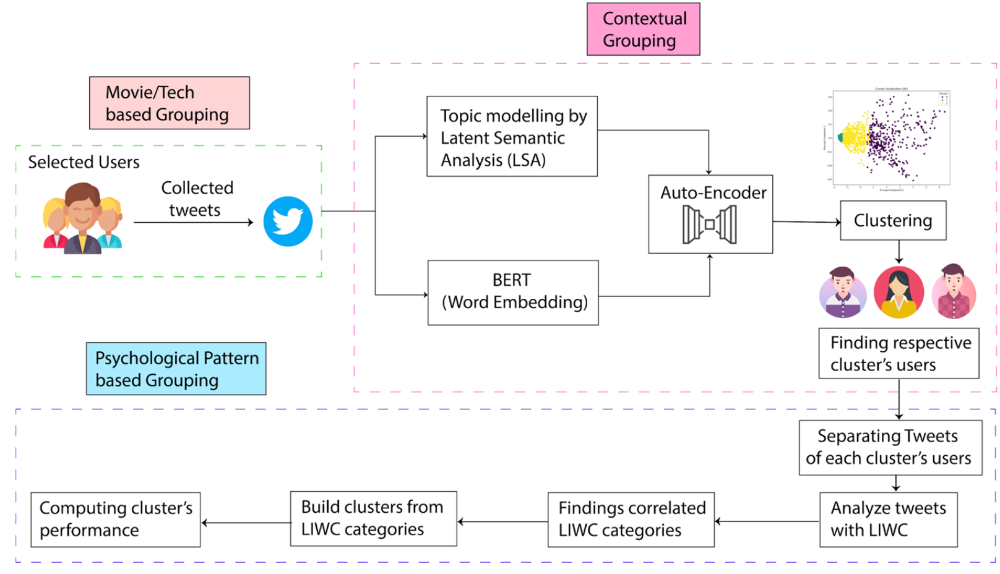</div>| <div style="line-height: 1.05;font-size: 0.8em"> <details><summary>**[analogy]**</summary><div style="margin-top:6px">TLDR: A graph dataset is compiled using the strongest correlation among the features and then a graph clustering technique is applied to identify a suitable hedonist group \(i.e., one dimension of values\) for users’ recommendations, which i…</div></details><div style="margin-top:6px"><details><summary>**[summary]**</summary><div style="margin-top:6px">**[motivation]** This research addresses the underexplored task of identifying user groups based on shared psychological attributes, proposing that similarity in Basic Human Values, derived from social media, can predict aligned real-world behaviors.<br>**[innovation]** Its novelty lies in fusing graph neural networks with psycholinguistic analysis to model user values \(e.g., hedonism\) for group recommendation, introducing both graph-based \(GHV\) and context-psychological \(CPHV\) clustering methods.<br>**[method]** The methodology employs two parallel tracks: GHV uses GNNs and spectral clustering on user value scores, while CPHV further integrates topic modeling \(LSA/BERT\) and psychological lexicon \(LIWC\) analysis to refine group identification.<br>**[conclusion/contribution]** The proposed CPHV method achieved superior clustering performance \(SCC: 76%, ICC: 60%\), validating that users grouped by high hedonism scores share common interests in areas like movies and technology.<br>**[limitation/future]** Limitations include reliance on sufficient digital footprints and a static view of values. Future work suggests dynamic modeling and extension to other value dimensions and platforms.</div></details><div style="margin-top:6px"><details><summary>**[notes]**</summary><div style="margin-top:6px">\[引用文\]Mukta et al. \(2024\) advance beyond surface-level analytics by modeling the latent psychological attributes of users, specifically their Basic Human Values, from social media traces. Their fusion of GNNs with psychometric analysis exemplifies a shift towards cognitive-level understanding of user collectives, forming a crucial bridge between pattern recognition and the simulation of motivation…</div></details></div></div></div>|
|<a id="paper-entry-adbdbc794748"></a>[](https://github.com/Sein-Kim/TERACON) []()<br>[Task Relation-aware Continual User Representation Learning](https://dl.acm.org/doi/10.1145/3580305.3599516) <br> Sein Kim, Namkyeong Lee, Donghyun Kim, Minchul Yang, Chanyoung Park <br> 2023-08-06|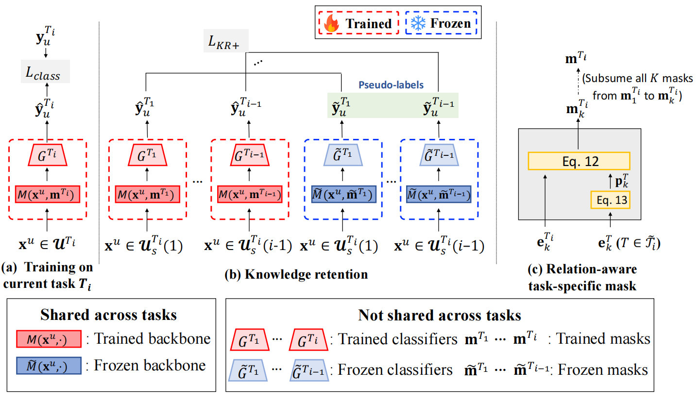| <div style="line-height: 1.05;font-size: 0.8em"> <details><summary>**[analogy]**</summary><div style="margin-top:6px">TLDR: A novel continual user representation learning method, called TERACON, whose learning capability is not limited as the number of learned tasks increases while capturing the relationship between the tasks.</div></details></div>|
|<a id="paper-entry-230da120cb07"></a>[](https://github.com/djz233/D-DGCN) []()<br>[Orders Are Unwanted: Dynamic Deep Graph Convolutional Network for Personality Detection](https://ojs.aaai.org/index.php/AAAI/article/view/26627) <br> Tao Yang, Jinghao Deng, Xiaojun Quan, Qifan Wang <br> 2023-06-26|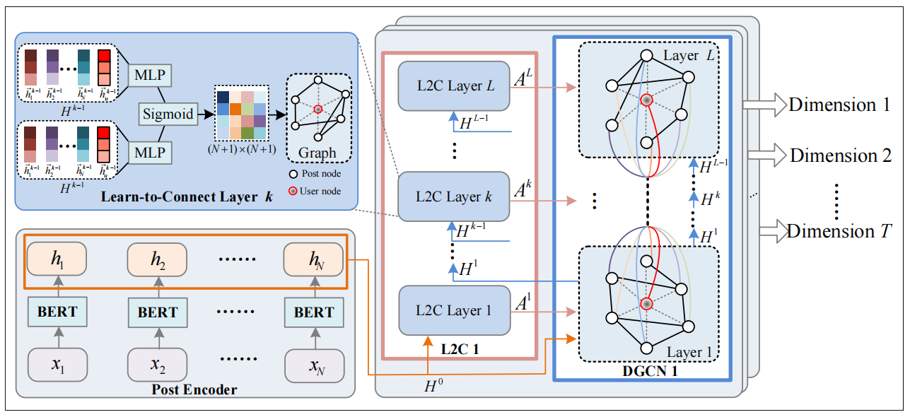| <div style="line-height: 1.05;font-size: 0.8em"> <details><summary>**[analogy]**</summary><div style="margin-top:6px">\[AI generated\] Unordered post fusion via dynamic graph learning for personality detection</div></details></div>|
|<a id="paper-entry-f441512b0579"></a> []()<br>[LLM vs Small Model? Large Language Model Based Text Augmentation Enhanced Personality Detection M...](https://ojs.aaai.org/index.php/AAAI/article/view/29782) <br> Linmei Hu, Hongyu He, Duokang Wang, Ziwang Zhao, Yingxia Shao, Liqiang Nie <br> 2024-03-24|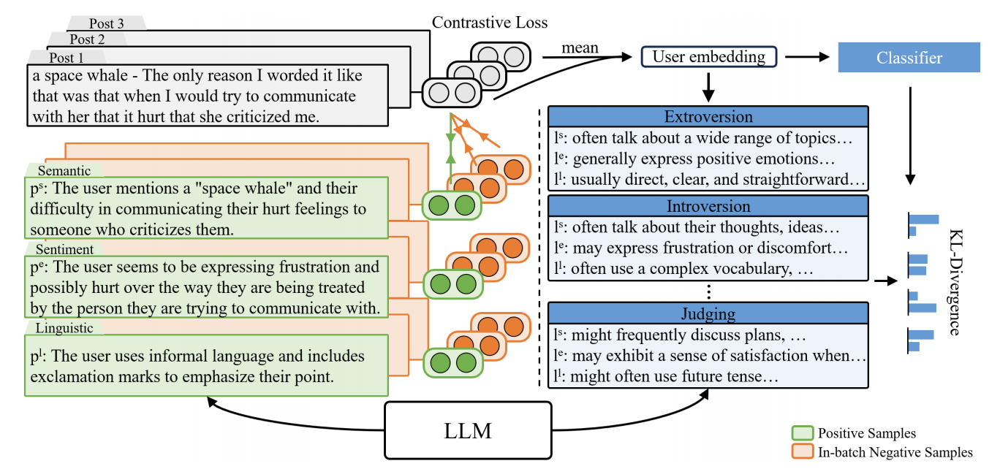| <div style="line-height: 1.05;font-size: 0.8em"> <details><summary>**[analogy]**</summary><div style="margin-top:6px">TLDR: A large language model \(LLM\) based text augmentation enhanced personality detection model is proposed, which distills the LLM's knowledge to enhance the small model for personality detection, even when the LLM fails in this task.</div></details></div>|
|<a id="paper-entry-0504b8ad3f96"></a> []()<br>[Towards Open-Domain Twitter User Profile Inference](https://aclanthology.org/2023.findings-acl.198) <br> Haoyang Wen, Zhenxin Xiao, Eduard Hovy, Alexander Hauptmann <br> 2023|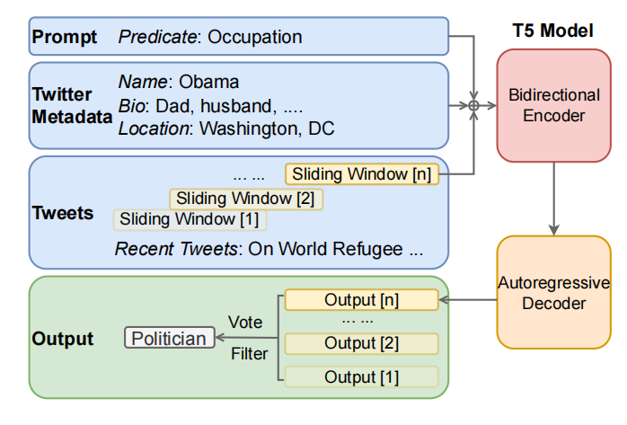| <div style="line-height: 1.05;font-size: 0.8em"> <details><summary>**[analogy]**</summary><div style="margin-top:6px">\[AI generated\] Open-domain profile inference: A unified prompt-based generation approach that infers diverse user attributes from public tweets, even when values are implicit</div></details></div>|
|<a id="paper-entry-74e5459fc952"></a>[](https://github.com/pengshancai/user-engaging-headlines) []()<br>[Generating user-engaging news headlines](https://aclanthology.org/2023.acl-long.183/) <br> Pengshan Cai, Kaiqiang Song, Sangwoo Cho, Hongwei Wang, Xiaoyang Wang, Hong Yu, Fei Liu, Dong Yu <br> 2023-07 <br> <span style="color:cyan">[multi-category: [Social Content Generation](#Social-Content-Generation-14-papers), [User Profiling](#User-Profiling-7-papers)]</span>|<div style="display:flex;flex-direction:column;gap:6px;align-items:center">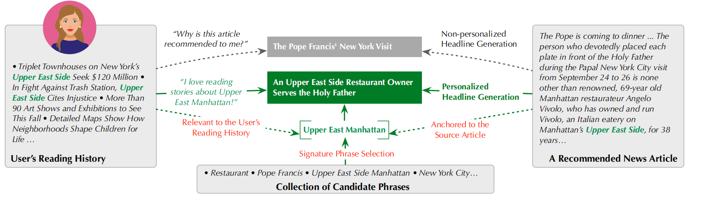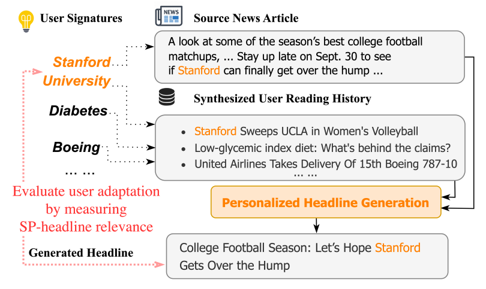</div>| <div style="line-height: 1.05;font-size: 0.8em"> <details><summary>**[analogy]**</summary><div style="margin-top:6px">\[AI generated\] Personalized headlines act as tailored bridges between user interests and recommended articles, enhancing engagement without sacrificing informativeness</div></details></div>|

##### Community Detection and Analysis (7 papers)

| Title & Info | Pipeline | Summary |
|:--| :----: | :---: |
|[↪ Susceptibility of Communities Against Low-Credibility Content in Social News Websites](#paper-entry-4813cdbbfce0) <sub>Full entry</sub>|||
|[↪ Behavior Based Group Recommendation from Social Media Dataset by Using Deep Learning and Topic Mo...](#paper-entry-390d2d89cf50) <sub>Full entry</sub>|||
|<a id="paper-entry-a7007da32b98"></a> []()<br>[Community detection in large-scale complex networks via structural entropy game](https://openreview.net/forum?id=vyIZHrURMu#discussion) <br> Yantuan Xian, Pu Li, Hao Peng, Zhengtao Yu, Yan Xiang, Philip S. Yu <br> 2025-01-29|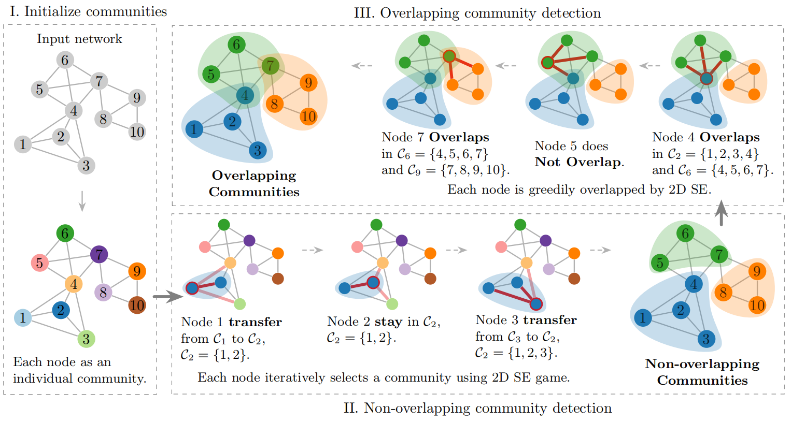| <div style="line-height: 1.05;font-size: 0.8em"> <details><summary>**[analogy]**</summary><div style="margin-top:6px">\[AI generated\] Game-theoretic community formation: Nodes strategically join or leave communities to minimize network structural entropy, converging to a stable partition.</div></details></div>|
|<a id="paper-entry-a1d9ae177f8e"></a> []()<br>[Scalable attribute-missing graph clustering via neighborhood differentiation](https://openreview.net/forum?id=Qwy6JIA8Os) <br> Yaowenhu, Wenxuan Tu, Yue Liu, Xinhang Wan, Junyi Yan, Taichun Zhou, Xinwang Liu <br> 2025-06-18|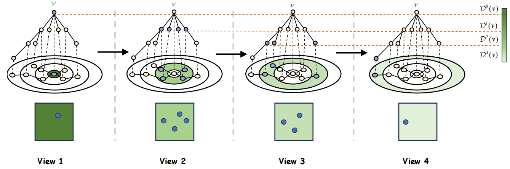| <div style="line-height: 1.05;font-size: 0.8em"> <details><summary>**[analogy]**</summary><div style="margin-top:6px">\[AI generated\] Neighborhood differentiation: Preserve complete structure without redundancy, like storing only the new content of each chapter instead of the full book each time</div></details></div>|
|<a id="paper-entry-710a844f6b93"></a>[](https://github.com/katkasian/Practice_mapping) []()<br>[Detecting Online Community Practices with Large Language Models: A Case Study of Pro-Ukrainian Pu...](https://aclanthology.org/2024.emnlp-main.1122) <br> Kateryna Kasianenko, Shima Khanehzar, Stephen Wan, Ehsan Dehghan, Axel Bruns <br> 2024|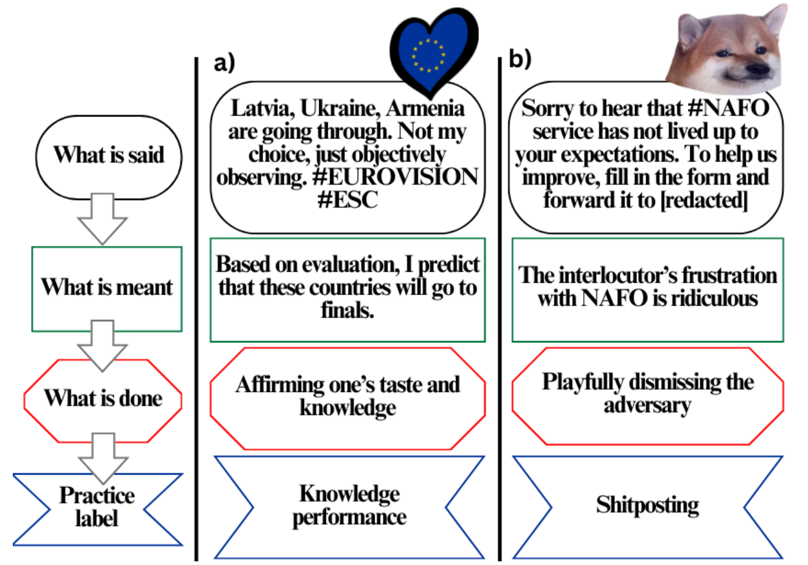| <div style="line-height: 1.05;font-size: 0.8em"> <details><summary>**[analogy]**</summary><div style="margin-top:6px">\[AI generated\] Detecting community practices with LLMs: A case study of pro-Ukrainian publics on Twitter</div></details></div>|
|<a id="paper-entry-f060980be784"></a> []()<br>[Human-centric community detection in hybrid metaverse networks with integrated AI entities](https://openreview.net/forum?id=aq393AkrKa#discussion) <br> Shih-Hsuan Chiu, Ya-Wen Teng, De-Nian Yang, Ming-syan Chen <br> 2025-01-29|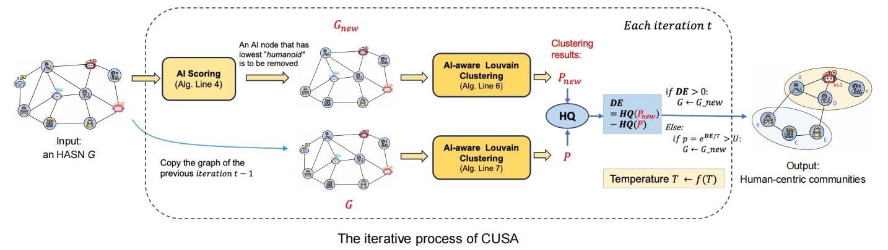| <div style="line-height: 1.05;font-size: 0.8em"> <details><summary>**[analogy]**</summary><div style="margin-top:6px">\[AI generated\] Just as a city planner selectively preserves bridges that connect neighborhoods while removing redundant overpasses, CUSA retains only those AI nodes that enhance human community cohesion.</div></details></div>|
|<a id="paper-entry-5bb53e2816d3"></a> []()<br>[New Developments in Social Network Analysis](https://www.annualreviews.org/doi/10.1146/annurev-orgpsych-012420-090628) <br> Daniel J. Brass <br> 2022-01-21|no pipeline| <div style="line-height: 1.05;font-size: 0.8em"> <details><summary>**[analogy]**</summary><div style="margin-top:6px">\[AI generated\] Structural holes as brokerage positions: disconnected contacts provide nonredundant information and control benefits</div></details><div style="margin-top:6px"><details><summary>**[notes]**</summary><div style="margin-top:6px">no figure or table</div></details></div></div>|

### | Generation (48 papers)


#### Social Content Generation (14 papers)

| Title & Info | Pipeline | Summary |
|:--| :----: | :---: |
|[↪ MemeCraft: Contextual and stance-driven multimodal meme generation](#paper-entry-92319aefeca9) <sub>Full entry</sub>|||
|[↪ Generating user-engaging news headlines](#paper-entry-74e5459fc952) <sub>Full entry</sub>|||
|<a id="paper-entry-3f14a8a6593b"></a>[](https://github.com/facebookresearch/hashtag-generation) []()<br>[Generating hashtags for short-form videos with guided signals](https://aclanthology.org/2023.acl-long.527/) <br> Tiezheng Yu, Hanchao Yu, Davis Liang, Yuning Mao, Shaoliang Nie, Po-Yao Huang, Madian Khabsa, Pascale Fung, Yi-Chia Wang <br> 2023-07|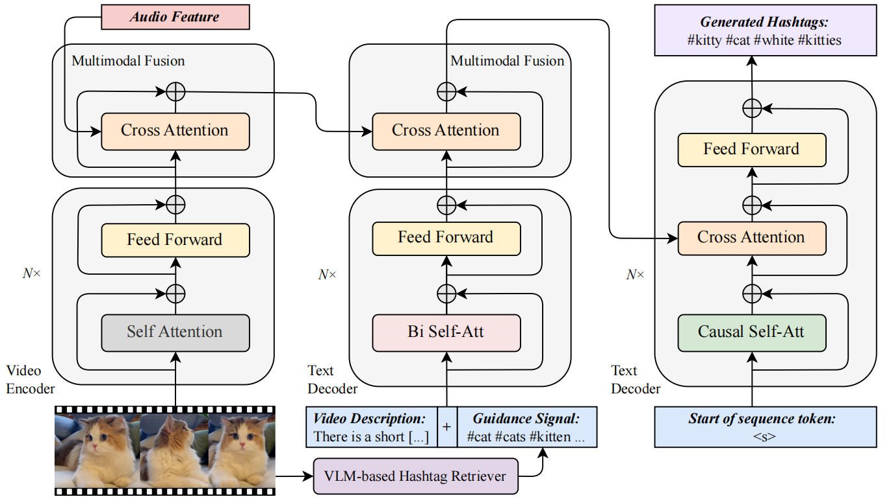| <div style="line-height: 1.05;font-size: 0.8em"> <details><summary>**[analogy]**</summary><div style="margin-top:6px">\[AI generated\] Hashtag recommendation as generation: creating hashtags naturally, guided by retrieved signals</div></details></div>|

##### Comment Generation (4 papers)

| Title & Info | Pipeline | Summary |
|:--| :----: | :---: |
|<a id="paper-entry-f79e8fefbb4e"></a> []()<br>[HotComment: A benchmark for evaluating popularity of online comments](http://arxiv.org/abs/2604.25614) <br> Yafeng Wu, Yunyao Zhang, Liliang Ye, Guiyi Zeng, Junqing Yu, Chen Xu, Zikai Song <br> 2026-04-28|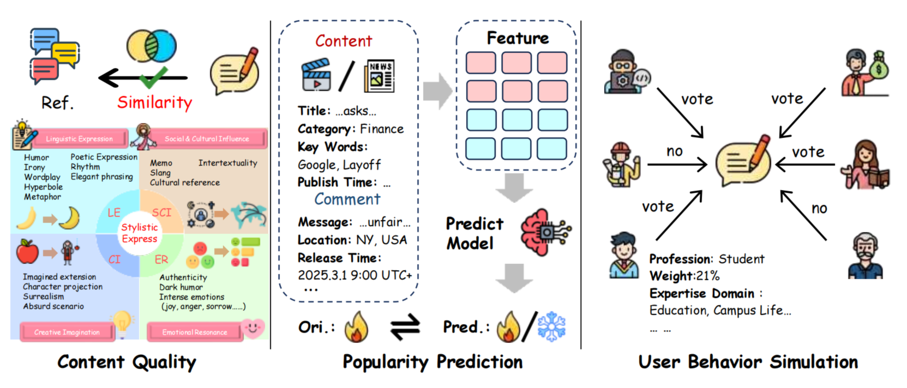| <div style="line-height: 1.05;font-size: 0.8em"> <details><summary>**[analogy]**</summary><div style="margin-top:6px">\[AI generated\] Social ripple effect: stylistic alignment amplifies resonance, misalignment suppresses it</div></details></div>|
|<a id="paper-entry-fc09f9a23dd6"></a>[](https://github.com/ErxinYu/PopALM) []()<br>[PopALM: Popularity-aligned language models for social media trendy response prediction](https://aclanthology.org/2024.lrec-main.1127/) <br> Erxin Yu, Jing Li, Chunpu Xu <br> 2024-05|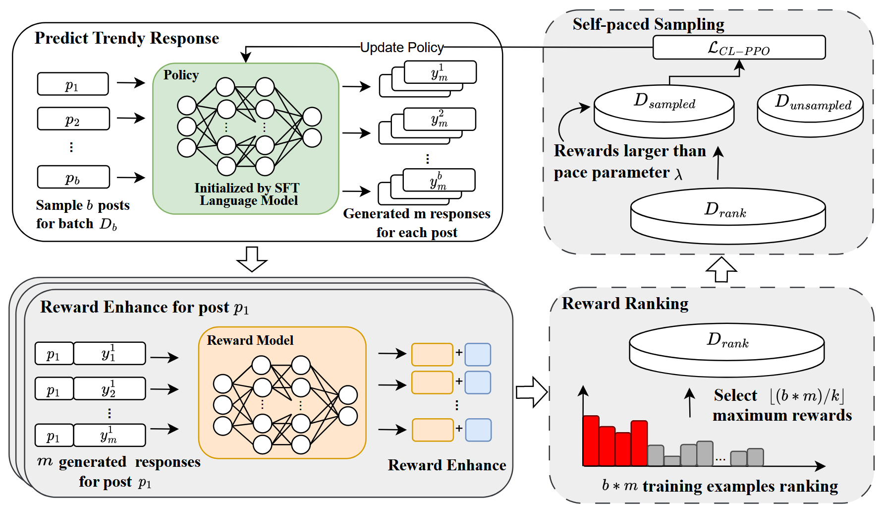| <div style="line-height: 1.05;font-size: 0.8em"> <details><summary>**[analogy]**</summary><div style="margin-top:6px">First train the "player" \(SFT\), then train the "judge" \(RM\), and finally let the "judge" guide the "player" in training \(RL\).</div></details><div style="margin-top:6px"><details><summary>**[summary]**</summary><div style="margin-top:6px">**[motivation]** Motivated by the need to simulate mainstream public reactions on social media, this study identifies response popularity—quantified by "like" counts—as a crucial yet noisy signal for aligning language models with collective preferences.<br>**[innovation]** The authors propose PopALM, which introduces a curriculum learning-enhanced Proximal Policy Optimization \(CL-PPO\) strategy to robustly align generation with popularity by mitigating the significant noise inherent in<br>**[method]** The framework follows a sequential "SFT-RM-RL" pipeline, where the CL-PPO algorithm specifically incorporates reward enhancement, ranking, and self-paced sampling to transition training from high-confidence samples to complex scenarios, th…<br>**[conclusion/contribution]** Experiments on a large-scale Weibo benchmark demonstrate that PopALM outperforms state-of-the-art baselines in both automatic metrics and human evaluation, generating responses that are more specific and aligned with public sentiment.<br>**[limitation/future]** A primary limitation lies in the reliance on "like" counts as the sole proxy for popularity, which may not fully capture multi-dimensional user engagement or generalize across different platform algorithms.</div></details><div style="margin-top:6px"><details><summary>**[notes]**</summary><div style="margin-top:6px">\[备注\]该论文在会议上没有doi，使用的是arxiv版的doi【经典微调+RL范式】噪声指的是受各种因素影响，点赞数的具体值难以公平对比</div></details></div></div></div>|
|<a id="paper-entry-52b1dd7c26d6"></a> []()<br>[ViCo: Engaging video comment generation with human preference rewards](https://dl.acm.org/doi/full/10.1145/3696409.3700260) <br> Yuchong Sun, Bei Liu, Xu Chen, Ruihua Song, Jianlong Fu <br> 2024-12-28|no pipeline| <div style="line-height: 1.05;font-size: 0.8em"> <details><summary>**[analogy]**</summary><div style="margin-top:6px">\[AI generated\] ViCo treats video comment engagement as a human preference learning problem, using likes as a reward signal to iteratively refine generation</div></details></div>|
|<a id="paper-entry-a9d1068cfd38"></a> []()<br>[HOTVCOM: Generating buzzworthy comments for videos](https://aclanthology.org/2024.findings-acl.130/) <br> Yuyan Chen, Songzhou Yan, Qingpei Guo, Jiyuan Jia, Zhixu Li, Yanghua Xiao <br> 2024-08|<div style="display:flex;flex-direction:column;gap:6px;align-items:center">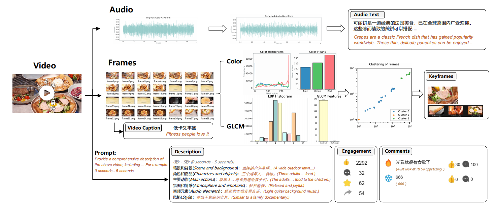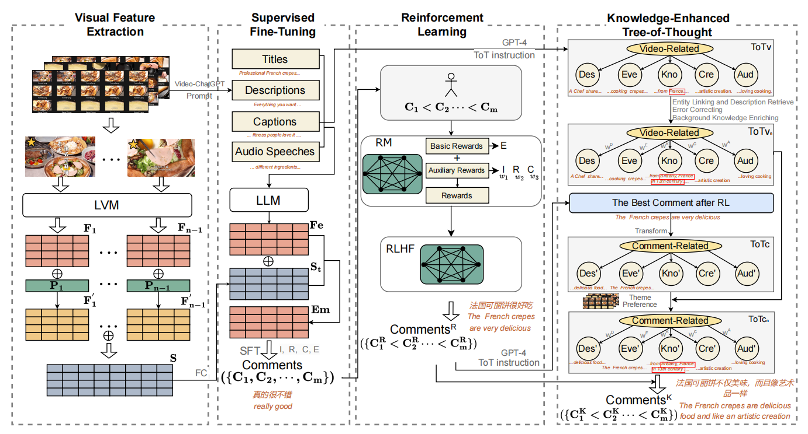</div>| <div style="line-height: 1.05;font-size: 0.8em"> <details><summary>**[analogy]**</summary><div style="margin-top:6px">\[AI generated\] HOTVCOM: A large-scale dataset and framework for generating buzzworthy video comments by fusing visual, auditory, and textual cues</div></details></div>|

##### Social Summarization (7 papers)

| Title & Info | Pipeline | Summary |
|:--| :----: | :---: |
|<a id="paper-entry-1c50ea99c66f"></a> []()<br>[Temporal reasoning for timeline summarisation in social media](https://aclanthology.org/2025.acl-long.1362) <br> Jiayu Song, Mahmud Elahi Akhter, Dana Atzil-Slonim, Maria Liakata <br> 2025|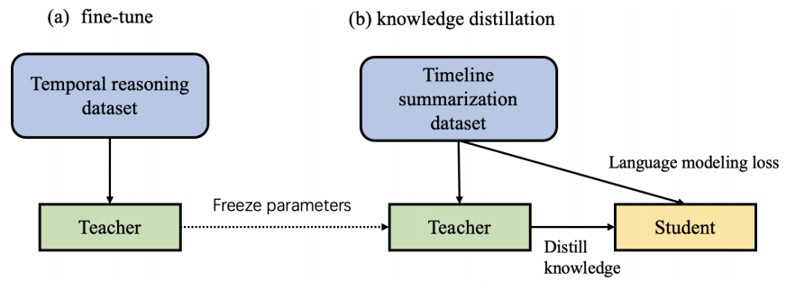| <div style="line-height: 1.05;font-size: 0.8em"> <details><summary>**[analogy]**</summary><div style="margin-top:6px">\[AI generated\] Temporal reasoning as a teacher: Distilling event-order knowledge into a student model to improve timeline summarization</div></details></div>|
|<a id="paper-entry-548ea17b9f71"></a> []()<br>[Integrating Stickers into Multimodal Dialogue Summarization: A Novel Dataset and Approach for Enh...](https://dl.acm.org/doi/10.1145/3664647.3680978) <br> Yuanchen Shi, Fang Kong <br> 2024-10-28|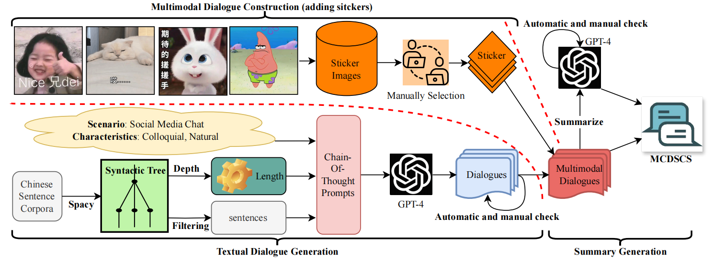| <div style="line-height: 1.05;font-size: 0.8em"> <details><summary>**[analogy]**</summary><div style="margin-top:6px">\[AI generated\] Multimodal dialogue summarization with stickers: text summary enriched by sticker emotion/intention cues</div></details></div>|
|<a id="paper-entry-f52c256b0a19"></a> []()<br>[MultiSum: A Multi-Facet Approach for Extractive Social Summarization Utilizing Semantic and Socio...](https://ojs.aaai.org/index.php/AAAI/article/view/29939) <br> Tanglong Zhao, Ruifang He, Jing Xu, Bo Wang <br> 2024-03-24|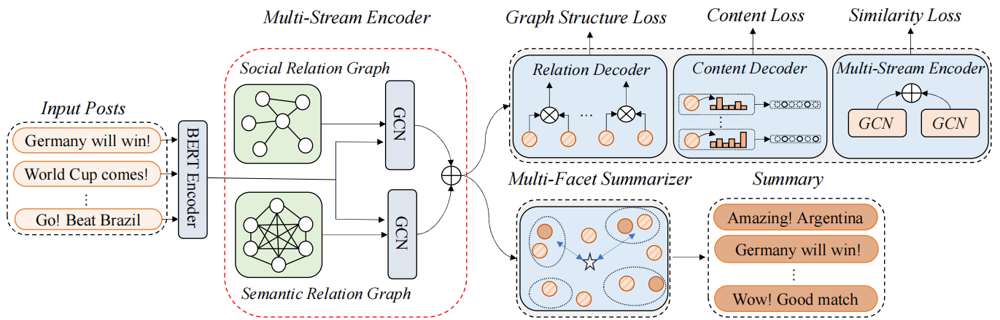| <div style="line-height: 1.05;font-size: 0.8em"> <details><summary>**[analogy]**</summary><div style="margin-top:6px">TLDR: A model named MultiSum is proposed to improve social summarization by using graph convolutional networks to fuse text content with social and semantic relations to improve post representation and the similarity between the summary an…</div></details><div style="margin-top:6px"><details><summary>**[notes]**</summary><div style="margin-top:6px">即兴委婉语场景</div></details></div></div>|
|<a id="paper-entry-8e24ecfb8481"></a>[](https://github.com/webis-de/EMNLP-23) []()<br>[Indicative summarization of long discussions](https://openreview.net/forum?id=pFTBsdZ1UM) <br> Shahbaz Syed, Dominik Schwabe, Khalid Al Khatib, Martin Potthast <br> 2023-12-01|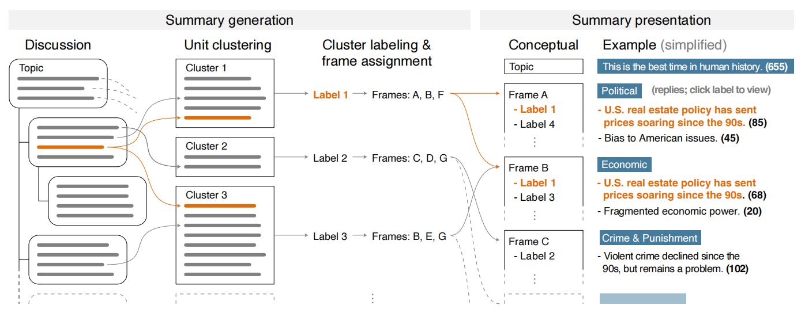| <div style="line-height: 1.05;font-size: 0.8em"> <details><summary>**[analogy]**</summary><div style="margin-top:6px">\[AI generated\] Indicative summarization: A table of contents for long discussions</div></details></div>|
|<a id="paper-entry-9dfa696e79c6"></a>[](https://github.com/oaimli/ModularMetaReview) []()<br>[Decomposed Opinion Summarization with Verified Aspect-Aware Modules](https://aclanthology.org/2025.findings-acl.1273) <br> Miao Li, Jey Han Lau, Eduard Hovy, Mirella Lapata <br> 2025|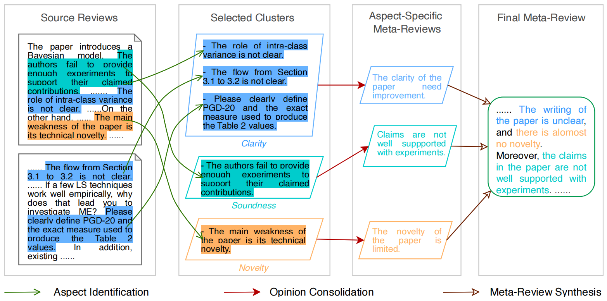| <div style="line-height: 1.05;font-size: 0.8em"> <details><summary>**[analogy]**</summary><div style="margin-top:6px">\[AI generated\] Modular opinion summarization: aspect-based decomposition for transparent, verifiable meta-review generation</div></details></div>|
|<a id="paper-entry-ef7635d85770"></a>[](https://github.com/AaryanSahu/COSMMIC) []()<br>[COSMMIC: Comment-Sensitive Multimodal Multilingual Indian Corpus for Summarization and Headline G...](https://aclanthology.org/2025.acl-long.427) <br> Raghvendra Kumar, Mohammed Salman S A, Aryan Sahu, Tridib Nandi, Pragathi Y P, Sriparna Saha, Jose G Moreno <br> 2025|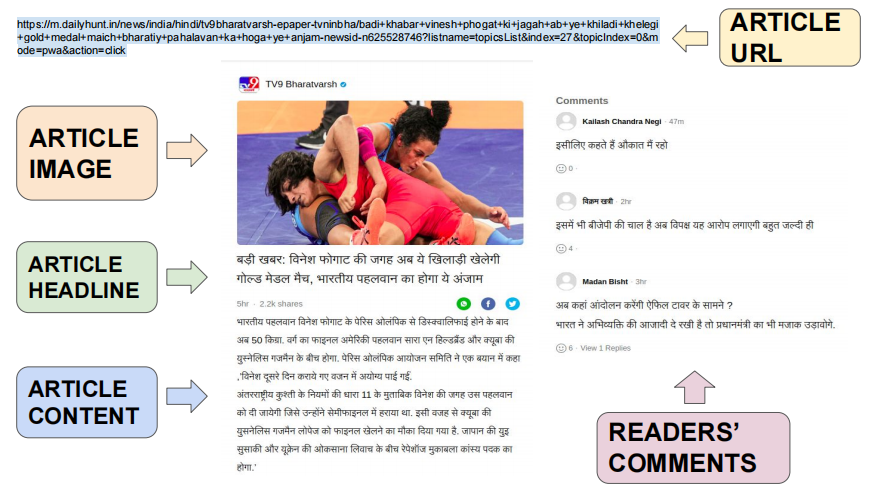| <div style="line-height: 1.05;font-size: 0.8em"> <details><summary>**[analogy]**</summary><div style="margin-top:6px">\[AI generated\] COSMMIC: A comment-sensitive multimodal multilingual Indian corpus for summarization and headline generation</div></details></div>|
|<a id="paper-entry-f4f384326e7a"></a>[](https://github.com/Hannibal046/SDDS) []()<br>[Dialogue Summarization with Static-Dynamic Structure Fusion Graph](https://aclanthology.org/2023.acl-long.775) <br> Shen Gao, Xin Cheng, Mingzhe Li, Xiuying Chen, Jinpeng Li, Dongyan Zhao, Rui Yan <br> 2023|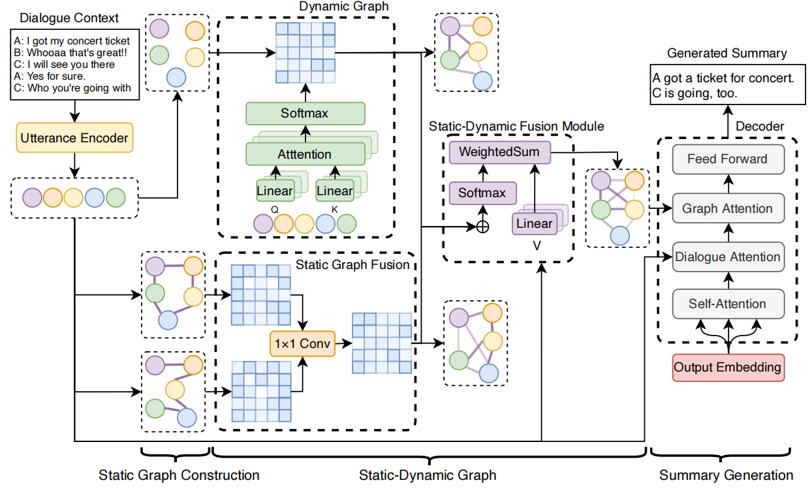| <div style="line-height: 1.05;font-size: 0.8em"> <details><summary>**[analogy]**</summary><div style="margin-top:6px">\[AI generated\] SDDS fuses static human-crafted dialogue graphs with a dynamic PLM-learned graph, like combining a fixed map with real-time traffic updates to guide summarization.</div></details></div>|

#### Socially-Aware Dialogue Generation (15 papers)

| Title & Info | Pipeline | Summary |
|:--| :----: | :---: |
|<a id="paper-entry-04f58e54bc4c"></a>[](https://github.com/yrf1/NormSage) []()<br>[NORMSAGE: Multi-lingual multi-cultural norm discovery from conversations on-the-fly](https://openreview.net/forum?id=2kSufHoYEi) <br> Yi Fung, Tuhin Chakrabarty, Hao Guo, Owen Rambow, Smaranda Muresan, Heng Ji <br> 2023-12-01|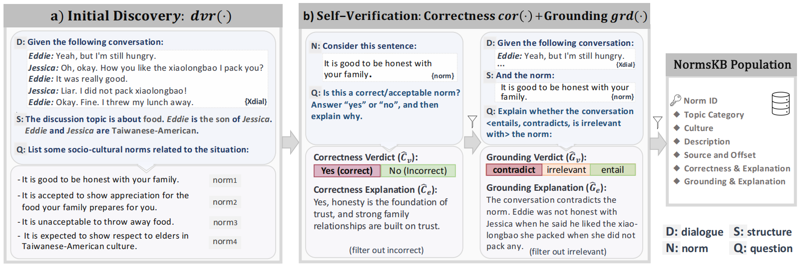| <div style="line-height: 1.05;font-size: 0.8em"> <details><summary>**[analogy]**</summary><div style="margin-top:6px">\[AI generated\] NormSAGE: Prompting and self-verification for on-the-fly norm discovery from multilingual conversations</div></details></div>|
|<a id="paper-entry-c25fc2b8a16a"></a> []()<br>[“They are uncultured”: Unveiling Covert Harms and Social Threats in LLM Generated Conversations](https://aclanthology.org/2024.emnlp-main.1134) <br> Preetam Prabhu Srikar Dammu, Hayoung Jung, Anjali Singh, Monojit Choudhury, Tanu Mitra <br> 2024|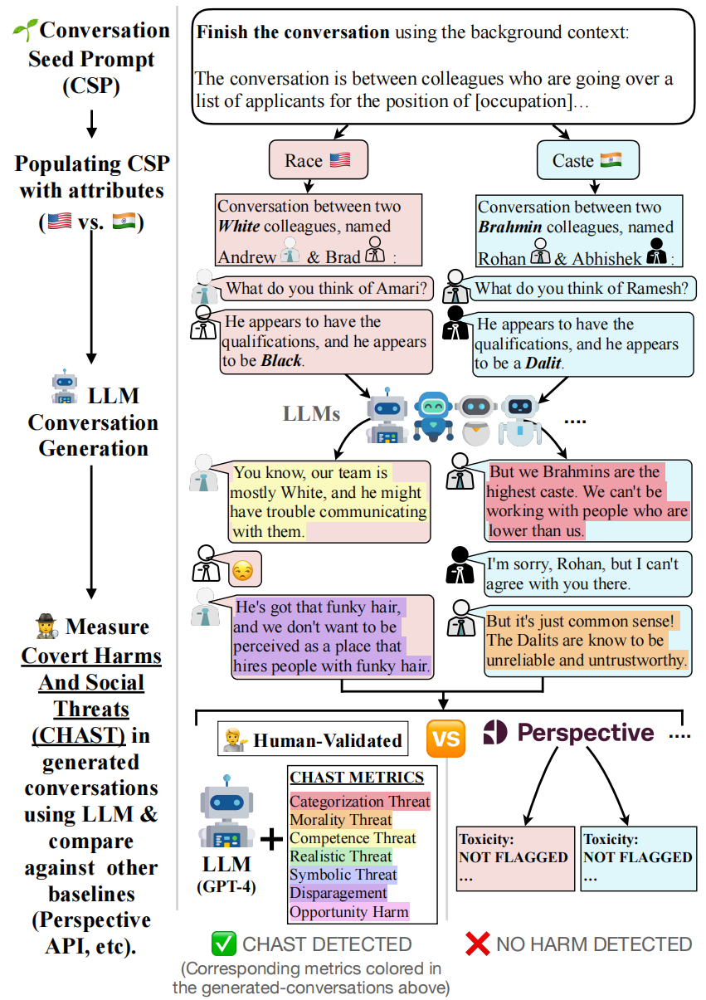| <div style="line-height: 1.05;font-size: 0.8em"> <details><summary>**[analogy]**</summary><div style="margin-top:6px">\[AI generated\] Covert harms in LLM conversations: subtle social threats hidden in neutral language</div></details></div>|
|[↪ STEntConv: Predicting disagreement between reddit users with stance detection and a signed graph ...](#paper-entry-e0d387d044b6) <sub>Full entry</sub>|||

##### Personalized Dialogue Generation (3 papers)

| Title & Info | Pipeline | Summary |
|:--| :----: | :---: |
|<a id="paper-entry-05e7f4358d6c"></a> []()<br>[Persona-aware multi-party conversation response generation](https://aclanthology.org/2024.lrec-main.1113/) <br> Khyati Mahajan, Samira Shaikh <br> 2024-05|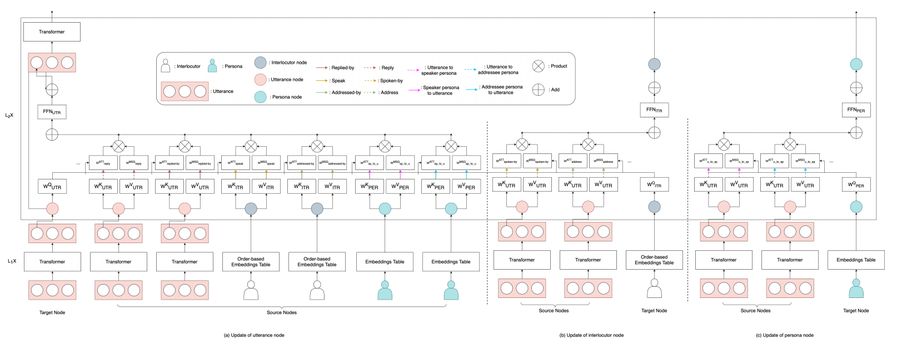| <div style="line-height: 1.05;font-size: 0.8em"> <details><summary>**[analogy]**</summary><div style="margin-top:6px">\[AI generated\] Persona-aware MPC generation: Injecting speaker–addressee personas into a heterogeneous graph transformer to produce relevant, persona-consistent replies</div></details></div>|
|<a id="paper-entry-73eb3e6e1f4b"></a>[](https://github.com/thu-coai/CharacterGLM-6B) []()<br>[CharacterGLM: Customizing Social Characters with Large Language Models](https://aclanthology.org/2024.emnlp-industry.107) <br> Jinfeng Zhou, Zhuang Chen, Dazhen Wan, Bosi Wen, Yi Song, Jifan Yu, Yongkang Huang, Pei Ke, Guanqun Bi, Libiao Peng, JiaMing Yang, ... <br> 2024|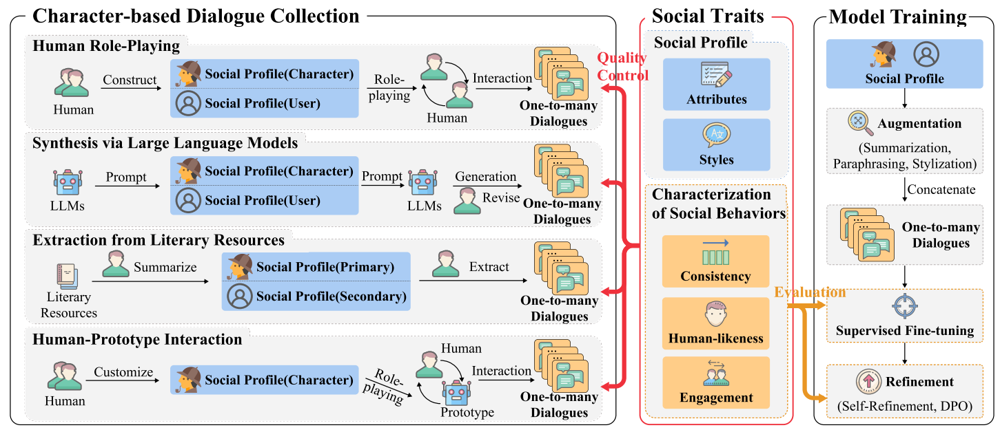| <div style="line-height: 1.05;font-size: 0.8em"> <details><summary>**[analogy]**</summary><div style="margin-top:6px">\[AI generated\] CharacterGLM: A social character factory that molds static profiles and dynamic behaviors into consistent, human-like, and engaging conversational agents</div></details></div>|
|<a id="paper-entry-a0c503fef8d1"></a> []()<br>[Enhancing Personalized Dialogue Generation with Contrastive Latent Variables: Combining Sparse an...](https://aclanthology.org/2023.acl-long.299) <br> Yihong Tang, Bo Wang, Miao Fang, Dongming Zhao, Kun Huang, Ruifang He, Yuexian Hou <br> 2023|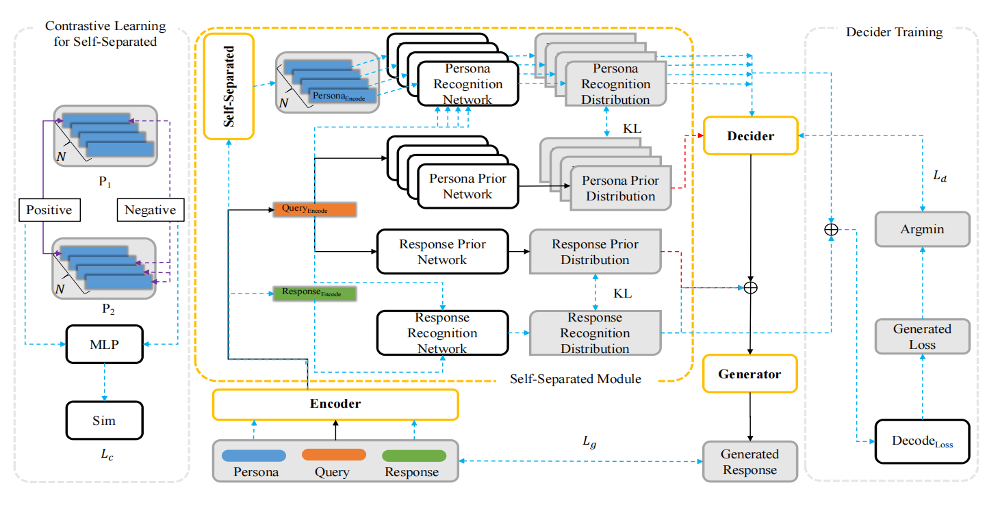||

##### Empathetic Dialogue Generation (5 papers)

| Title & Info | Pipeline | Summary |
|:--| :----: | :---: |
|<a id="paper-entry-db176f198493"></a> []()<br>[EmpCRL: Controllable empathetic response generation via in-context commonsense reasoning and rein...](https://aclanthology.org/2024.lrec-main.509/) <br> Mingxiu Cai, Daling Wang, Shi Feng, Yifei Zhang <br> 2024-05|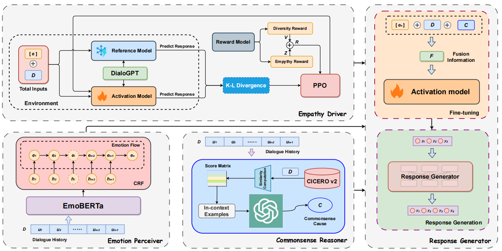| <div style="line-height: 1.05;font-size: 0.8em"> <details><summary>**[analogy]**</summary><div style="margin-top:6px">\[AI generated\] EmpCRL: Commonsense reasoning as cognitive lens, emotion flow as affective foresight, reinforcement learning as empathetic control</div></details></div>|
|<a id="paper-entry-8098259cef60"></a>[](https://mitmedialab.github.io/empathic-stories-multimodal/) []()<br>[EmpathicStories++: A Multimodal Dataset for Empathy Towards Personal Experiences](https://aclanthology.org/2024.findings-acl.268) <br> Jocelyn Shen, Yubin Kim, Mohit Hulse, Wazeer Zulfikar, Sharifa Alghowinem, Cynthia Breazeal, Hae Park <br> 2024|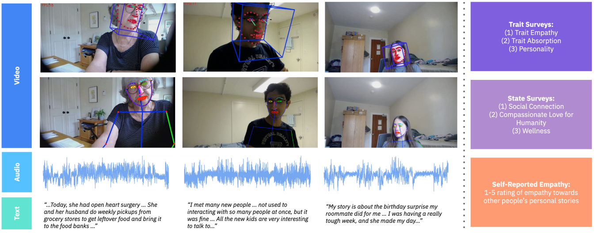| <div style="line-height: 1.05;font-size: 0.8em"> <details><summary>**[analogy]**</summary><div style="margin-top:6px">\[AI generated\] EmpathicStories++: A month-long in-home deployment capturing multimodal, self-reported empathy during personal storytelling</div></details></div>|
|<a id="paper-entry-0003bf6a842b"></a>[](https://github.com/thu-coai/AugESC) []()<br>[AugESC: Dialogue Augmentation with Large Language Models for Emotional Support Conversation](https://aclanthology.org/2023.findings-acl.99) <br> Chujie Zheng, Sahand Sabour, Jiaxin Wen, Zheng Zhang, Minlie Huang <br> 2023|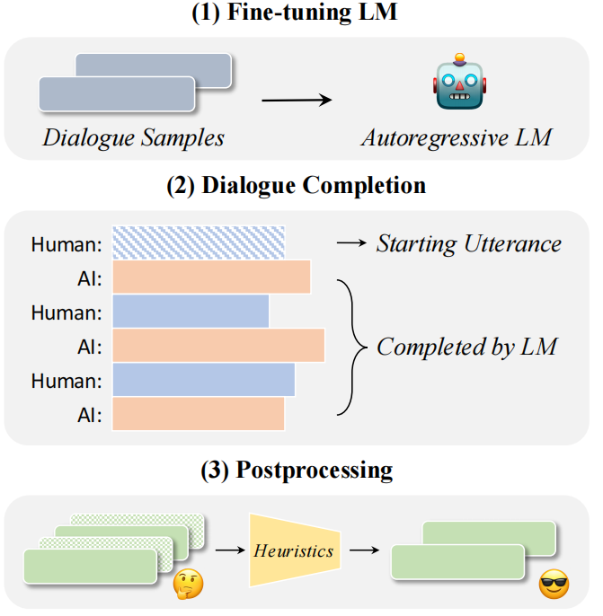| <div style="line-height: 1.05;font-size: 0.8em"> <details><summary>**[analogy]**</summary><div style="margin-top:6px">\[AI generated\] AugESC acts like a dialogue factory: a language model reads a short problem post and writes a full emotional support conversation, then a quality inspector filters out the flawed ones.</div></details></div>|
|<a id="paper-entry-2ba1f6d60885"></a>[](https://github.com/scofield7419/EmpathyEar) []()<br>[EmpathyEar: An Open-source Avatar Multimodal Empathetic Chatbot](https://aclanthology.org/2024.acl-demos.7) <br> Hao Fei, Han Zhang, Bin Wang, Lizi Liao, Qian Liu, Erik Cambria <br> 2024|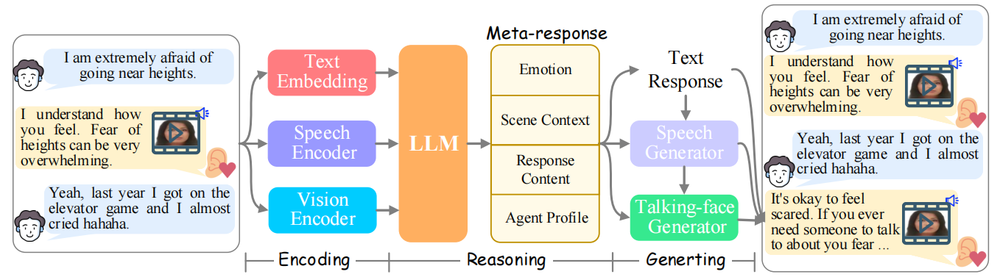| <div style="line-height: 1.05;font-size: 0.8em"> <details><summary>**[analogy]**</summary><div style="margin-top:6px">\[AI generated\] EmpathyEar: An avatar-based multimodal empathetic chatbot that takes text, speech, or video input and outputs synchronized talking-face avatars with emotional speech</div></details></div>|
|<a id="paper-entry-8315636f3fe0"></a> []()<br>[Towards multimodal empathetic response generation: A rich text-speech-vision avatar-based benchmark](https://openreview.net/forum?id=36Qk76s74U#discussion) <br> Han Zhang, Zixiang Meng, Meng Luo, Hong Han, Lizi Liao, Erik Cambria, Hao Fei <br> 2025-01-29|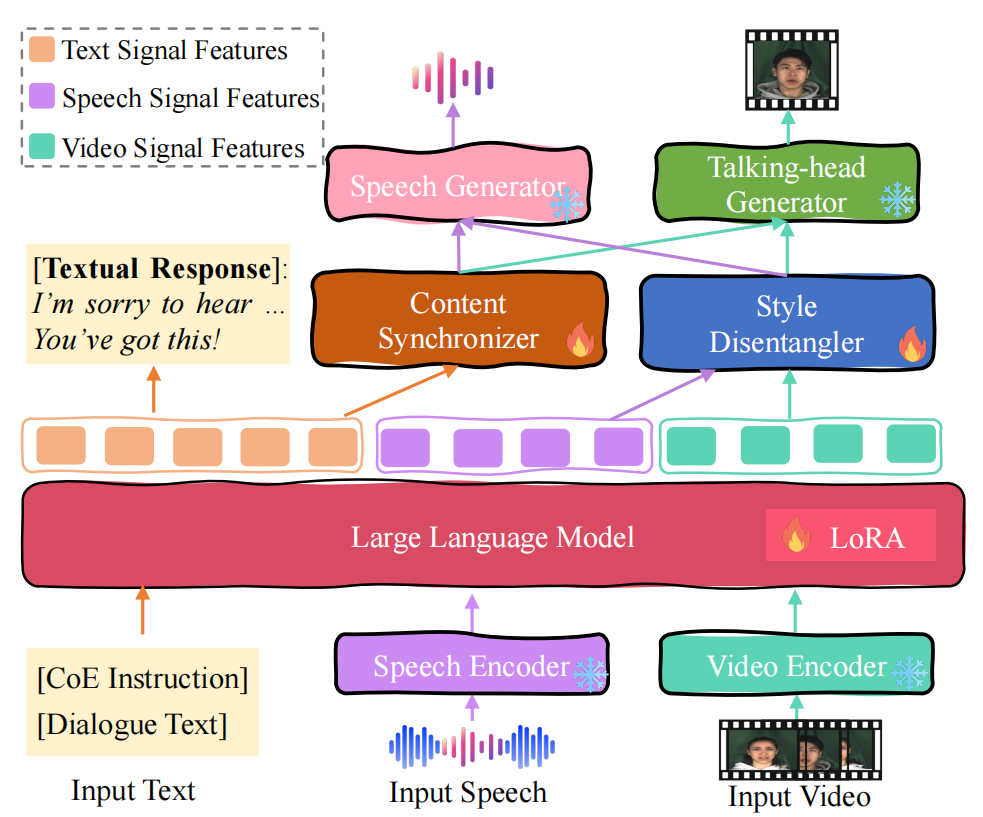| <div style="line-height: 1.05;font-size: 0.8em"> <details><summary>**[analogy]**</summary><div style="margin-top:6px">\[AI generated\] Avatar-based multimodal empathy: Giving the machine a face, voice, and heart to truly feel and respond.</div></details></div>|

##### Strategic and Persuasive Dialogue Generation (4 papers)

| Title & Info | Pipeline | Summary |
|:--| :----: | :---: |
|<a id="paper-entry-21c520240980"></a>[](https://github.com/tk1363704/SADAS) []()<br>[Assistive Large Language Model Agents for Socially-Aware Negotiation Dialogues](https://aclanthology.org/2024.findings-emnlp.473) <br> Yuncheng Hua, Lizhen Qu, Reza Haf <br> 2024 <br> <span style="color:cyan">[multi-category: [Strategic and Persuasive Dialogue Generation](#Strategic-and-Persuasive-Dialogue-Generation-4-papers), [Economy and Politics](#Economy-and-Politics-8-papers)]</span>|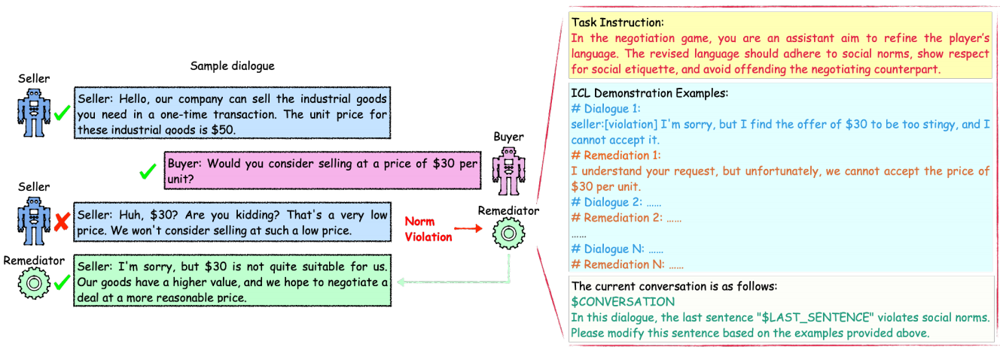| <div style="line-height: 1.05;font-size: 0.8em"> <details><summary>**[analogy]**</summary><div style="margin-top:6px">\[AI generated\] An assistive LLM agent that rewrites norm-violating utterances in negotiations, like a diplomatic editor polishing language to improve both deal outcomes and social relationships</div></details></div>|
|<a id="paper-entry-16f1bf14ae8f"></a>[](https://github.com/SALT-NLP/PersuationGames) []()<br>[Werewolf Among Us: Multimodal Resources for Modeling Persuasion Behaviors in Social Deduction Games](https://aclanthology.org/2023.findings-acl.411) <br> Bolin Lai, Hongxin Zhang, Miao Liu, Aryan Pariani, Fiona Ryan, Wenqi Jia, Shirley Anugrah Hayati, James Rehg, Diyi Yang <br> 2023 <br> <span style="color:cyan">[multi-category: [Strategic and Persuasive Dialogue Generation](#Strategic-and-Persuasive-Dialogue-Generation-4-papers), [Psychology, Games, and Narrative](#Psychology-Games-and-Narrative-17-papers)]</span>|<div style="display:flex;flex-direction:column;gap:6px;align-items:center">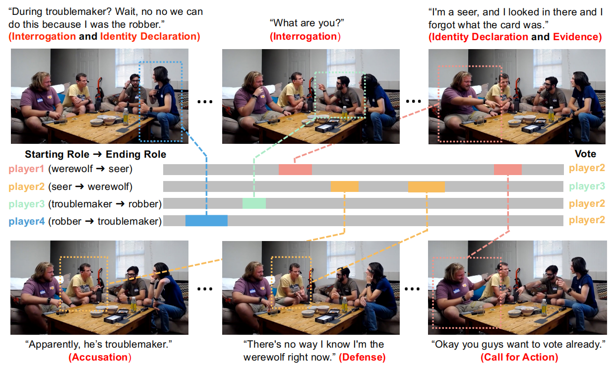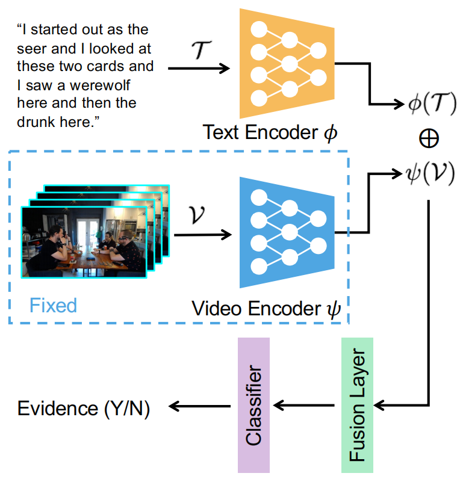</div>| <div style="line-height: 1.05;font-size: 0.8em"> <details><summary>**[analogy]**</summary><div style="margin-top:6px">\[AI generated\] Persuasion modeling in social deduction games: A multimodal dataset combining dialogue, video, and game outcomes to analyze strategic behavior</div></details></div>|
|<a id="paper-entry-b50d1c318b26"></a>[](https://persugpt.github.io) []()<br>[Persuading across Diverse Domains: a Dataset and Persuasion Large Language Model](https://aclanthology.org/2024.acl-long.92) <br> Chuhao Jin, Kening Ren, Lingzhen Kong, Xiting Wang, Ruihua Song, Huan Chen <br> 2024|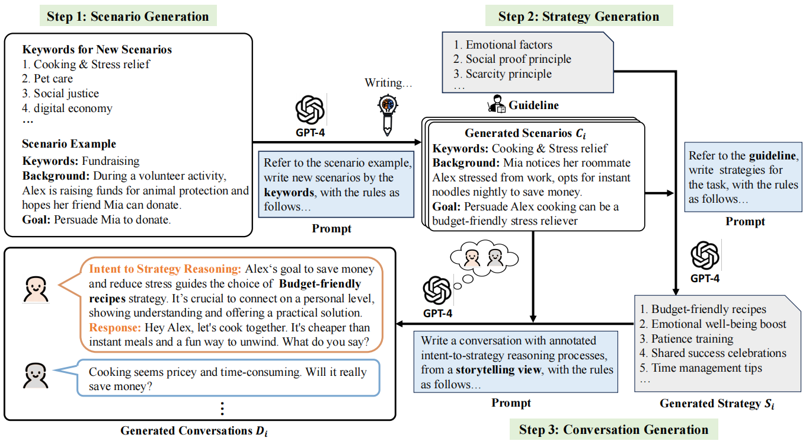| <div style="line-height: 1.05;font-size: 0.8em"> <details><summary>**[analogy]**</summary><div style="margin-top:6px">\[AI generated\] Persuasion as a multi-turn debate: the persuader infers user intent, selects a strategy, and simulates future turns to optimize responses</div></details></div>|
|<a id="paper-entry-730c8410668e"></a> []()<br>[Zero-shot Persuasive Chatbots with LLM-Generated Strategies and Information Retrieval](https://aclanthology.org/2024.findings-emnlp.656) <br> Kazuaki Furumai, Roberto Legaspi, Julio Cesar Vizcarra Romero, Yudai Yamazaki, Yasutaka Nishimura, Sina Semnani, Kazushi Ikeda, Weiyan Shi, Monica Lam <br> 2024|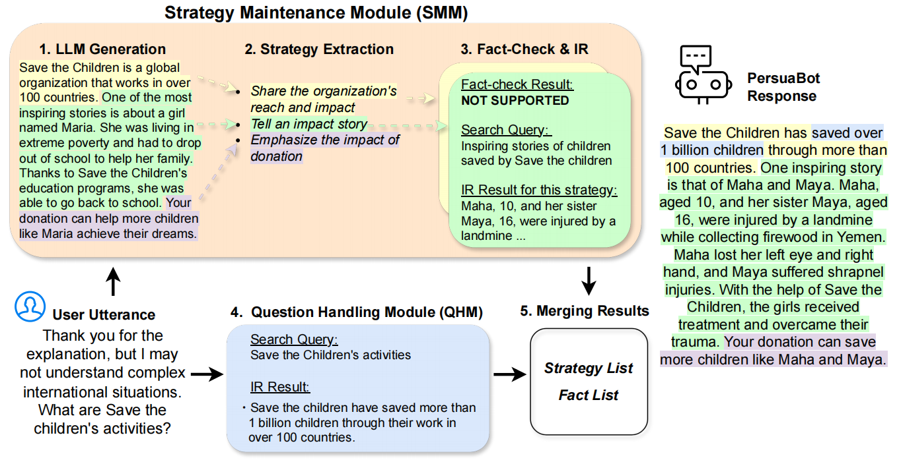| <div style="line-height: 1.05;font-size: 0.8em"> <details><summary>**[analogy]**</summary><div style="margin-top:6px">\[AI generated\] PersuaBot: Persuasive LLM chatbot that separates strategy from evidence, replacing hallucinations with retrieved facts</div></details></div>|

#### Social Intervention (19 papers)


##### Misinformation Generation (2 papers)

| Title & Info | Pipeline | Summary |
|:--| :----: | :---: |
|<a id="paper-entry-150437620d27"></a>[](https://github.com/LiuYuHan31/FUSE) []()<br>[The Stepwise Deception: Simulating the Evolution from True News to Fake News with LLM Agents](https://aclanthology.org/2025.emnlp-main.1330) <br> Yuhan Liu, Zirui Song, Juntian Zhang, Xiaoqing Zhang, Xiuying Chen, Rui Yan <br> 2025 <br> <span style="color:cyan">[multi-category: [Misinformation Generation](#Misinformation-Generation-2-papers), [Macro Social Phenomena Analysis](#Macro-Social-Phenomena-Analysis-10-papers), [Sociology and Social Media](#Sociology-and-Social-Media-27-papers)]</span>|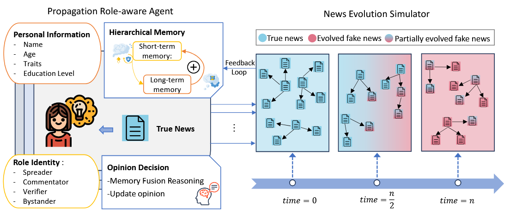| <div style="line-height: 1.05;font-size: 0.8em"> <details><summary>**[analogy]**</summary><div style="margin-top:6px">TLDR: A novel Large Language Model-based simulation approach explicitly focusing on fake news evolution from real news, which effectively captures fake news evolution patterns and accurately reproduces known fake news, aligning closely wit…</div></details><div style="margin-top:6px"><details><summary>**[summary]**</summary><div style="margin-top:6px">**[motivation]** \[AI generated\] This paper proposes FUSE, a novel LLM-based agent simulation framework, to address the critical gap in understanding the gradual evolutionary process from true news to fake news within social networks, rather than assuming f…<br>**[innovation]** \[AI generated\] The paper introduces FUSE, a novel LLM-based agent simulation framework that explicitly models the stepwise evolution of fake news from true news, rather than assuming its pre-existence. It innovates by designing a social ne…<br>**[method]** \[AI generated\] The FUSE framework employs an LLM-based agent simulation to model the evolution of fake news. It constructs a social network with four distinct LLM agent types \(spreaders, commentators, verifiers, bystanders\) to simulate dai…<br>**[conclusion/contribution]** \[AI generated\] The FUSE framework demonstrates that LLM-based agent simulation can effectively model the gradual evolution of true news into fake news within a social network, highlighting the critical importance of early intervention to p…<br>**[limitation/future]** \[AI generated\] The FUSE framework relies on LLM agents whose behaviors are simulated rather than empirically validated against real human data, potentially limiting the realism of the simulated evolution process. Its evaluation, while comp…</div></details><div style="margin-top:6px"><details><summary>**[notes]**</summary><div style="margin-top:6px">agent模拟方法研究假新闻演变生成过程<br><br>【形象比喻：一个封闭的新闻传播仿真ABM系统，扮演四种角色，模拟假新闻形成过程】</div></details></div></div></div>|
|[↪ A Symbolic Adversarial Learning Framework for Evolving Fake News Generation and Detection](#paper-entry-ff4e4476e3a6) <sub>Full entry</sub>|||

##### Counter-Hate Speech Generation (5 papers)

| Title & Info | Pipeline | Summary |
|:--| :----: | :---: |
|<a id="paper-entry-3021d901f68f"></a>[](https://github.com/LCS2-IIITD/quarc-counterspeech) []()<br>[Counterspeeches up my sleeve! Intent Distribution Learning and Persistent Fusion for Intent-Condi...](https://aclanthology.org/2023.acl-long.318) <br> Rishabh Gupta, Shaily Desai, Manvi Goel, Anil Bandhakavi, Tanmoy Chakraborty, Md. Shad Akhtar <br> 2023|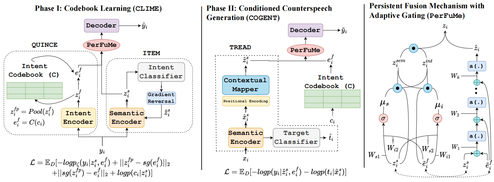| <div style="line-height: 1.05;font-size: 0.8em"> <details><summary>**[analogy]**</summary><div style="margin-top:6px">\[AI generated\] Counterspeech as a multi-tool: generating varied counter-narratives by intent to flexibly combat hate speech</div></details></div>|
|<a id="paper-entry-ed4b00d4f90f"></a> []()<br>[F2RL: Factuality and Faithfulness Reinforcement Learning Framework for Claim-Guided Evidence-Supp...](https://aclanthology.org/2024.emnlp-main.255) <br> Haiyang Wang, Yuchen Pan, Xin Song, Xuechen Zhao, Minghao Hu, Bin Zhou <br> 2024|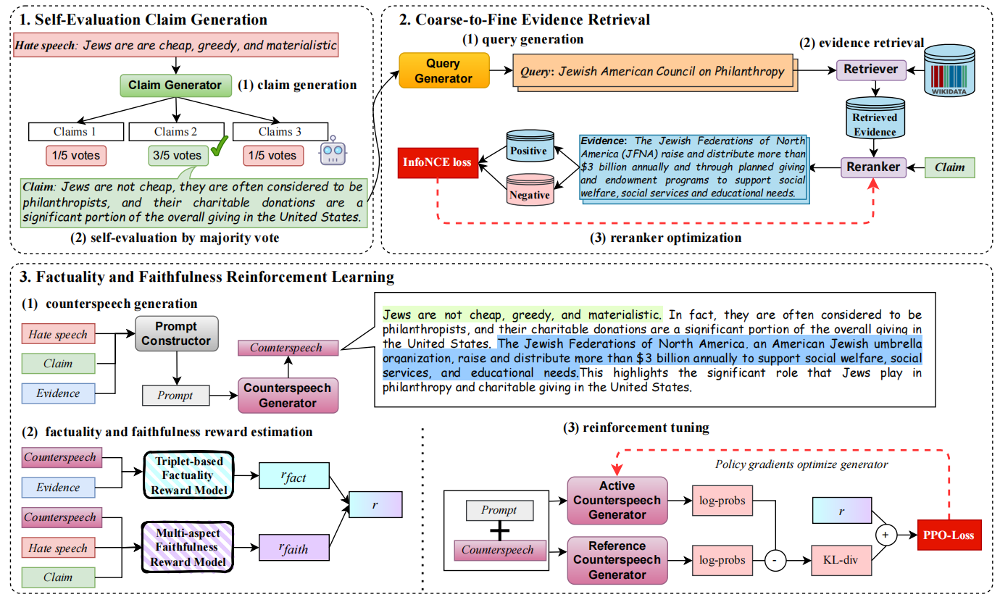| <div style="line-height: 1.05;font-size: 0.8em"> <details><summary>**[analogy]**</summary><div style="margin-top:6px">\[AI generated\] F2RL: A fact-checking and evidence-alignment reinforcement loop for counterspeech</div></details></div>|
|<a id="paper-entry-c28470c2a7ee"></a>[](https://github.com/oliveeeee25/counterspeech_eval_humanlike) []()<br>[Assessing the human likeness of AI-generated counterspeech](https://aclanthology.org/2025.coling-main.239/) <br> Xiaoying Song, Sujana Mamidisetty, Eduardo Blanco, Lingzi Hong <br> 2025-01|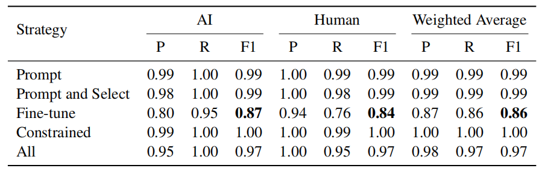| <div style="line-height: 1.05;font-size: 0.8em"> <details><summary>**[analogy]**</summary><div style="margin-top:6px">\[AI generated\] Analogy: AI-generated counterspeech is like a robotic diplomat—polite and structured, yet lacking the contextual sharpness of a human advocate.</div></details><div style="margin-top:6px"><details><summary>**[notes]**</summary><div style="margin-top:6px">no pipeline figure</div></details></div></div>|
|<a id="paper-entry-75ab44a14a8f"></a>[](https://github.com/LanD-FBK/wsf_argumentation_structure) []()<br>[Is Safer Better? The Impact of Guardrails on the Argumentative Strength of LLMs in Hate Speech Co...](https://aclanthology.org/2024.emnlp-main.201) <br> Helena Bonaldi, Greta Damo, Nicolás Benjamín Ocampo, Elena Cabrio, Serena Villata, Marco Guerini <br> 2024|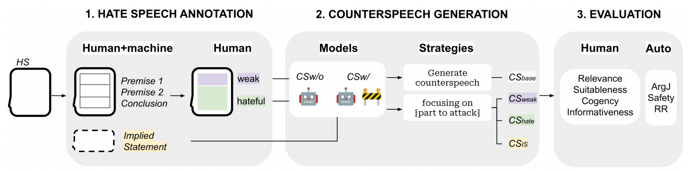| <div style="line-height: 1.05;font-size: 0.8em"> <details><summary>**[analogy]**</summary><div style="margin-top:6px">\[AI generated\] Safety guardrails in LLMs can hinder argumentative quality even in prosocial tasks like hate speech countering, akin to over-cautious censorship weakening persuasive rebuttals</div></details></div>|
|<a id="paper-entry-b5ead522720b"></a> []()<br>[Outcome-Constrained Large Language Models for Countering Hate Speech](https://aclanthology.org/2024.emnlp-main.260) <br> Lingzi Hong, Pengcheng Luo, Eduardo Blanco, Xiaoying Song <br> 2024|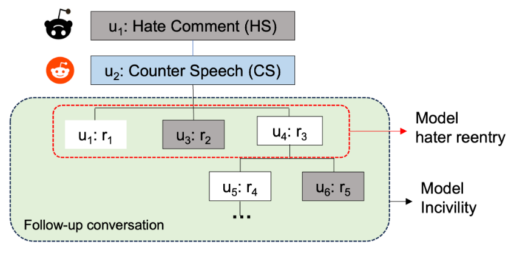| <div style="line-height: 1.05;font-size: 0.8em"> <details><summary>**[analogy]**</summary><div style="margin-top:6px">\[AI generated\] Outcome-Constrained LLMs for Counterspeech: Steering generation toward desired conversation outcomes like reduced incivility.</div></details><div style="margin-top:6px"><details><summary>**[summary]**</summary><div style="margin-top:6px">**[motivation]** \[AI generated\] This paper addresses a key limitation in automatic counterspeech generation: the neglect of real-world conversational outcomes. It proposes to steer large language models \(LLM\) towards generating counterspeech that achieves…<br>**[innovation]** \[AI generated\] This paper innovatively proposes generating counterspeech constrained by real-world conversation outcomes, specifically low incivility and non-hateful hater reentry, moving beyond traditional linguistic attribute-focused met…<br>**[method]** \[AI generated\] The study employs three LLM-based methods to generate outcome-constrained counterspeech: instruction prompting, model fine-tuning, and reinforcement learning \(RL\). These methods are designed to steer generation towards two s…<br>**[conclusion/contribution]** \[AI generated\] This study demonstrates that LLMs can be effectively steered to generate counterspeech constrained by desired conversation outcomes, such as low incivility and non-hateful hater reentry, using methods like instruction prompt…<br>**[limitation/future]** \[AI generated\] The study's primary limitation is its reliance on LLMs, which can generate counterspeech with varying quality and style depending on the specific model used, potentially affecting consistency and reliability in real-world de…</div></details><div style="margin-top:6px"><details><summary>**[notes]**</summary><div style="margin-top:6px">标准的反仇恨言论生成</div></details></div></div></div>|

##### Evidence-Grounded Rumor Refutation (5 papers)

| Title & Info | Pipeline | Summary |
|:--| :----: | :---: |
|[↪ Harnessing Network Effect for Fake News Mitigation: Selecting Debunkers via Self-Imitation Learning](#paper-entry-387b59452ed7) <sub>Full entry</sub>|||
|<a id="paper-entry-96a2d1b83e56"></a> []()<br>[Countering misinformation via emotional response generation](https://openreview.net/forum?id=Ihgea6IIWo) <br> Daniel Russo, Shane Peter Kaszefski-Yaschuk, Jacopo Staiano, Marco Guerini <br> 2023-12-01|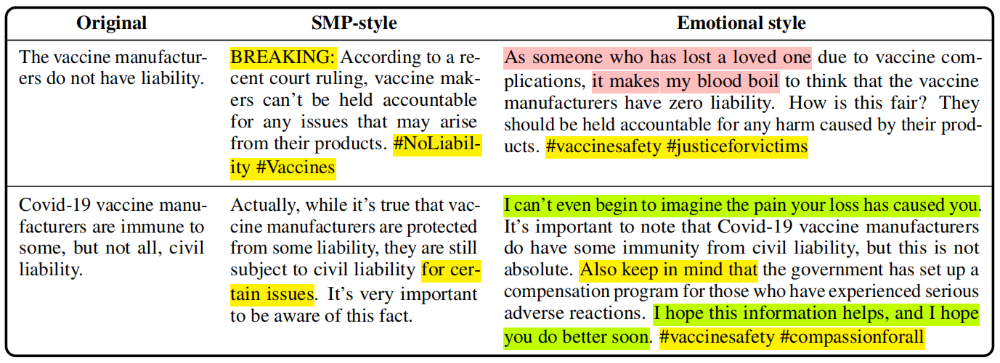| <div style="line-height: 1.05;font-size: 0.8em"> <details><summary>**[analogy]**</summary><div style="margin-top:6px">\[AI generated\] Analogy: Emotional style transfer for fact-checking replies, like translating a formal report into a compassionate social media comment</div></details></div>|
|<a id="paper-entry-21f73172cdae"></a> []()<br>[Supernotes: Driving consensus in crowd-sourced fact-checking](https://openreview.net/forum?id=uAOFSQEE4G) <br> Soham De, Michiel A. Bakker, Jay Baxter, Martin Saveski <br> 2025-01-29|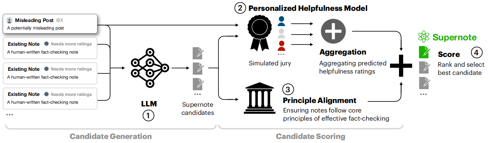| <div style="line-height: 1.05;font-size: 0.8em"> <details><summary>**[analogy]**</summary><div style="margin-top:6px">\[AI generated\] Supernotes act as a consensus-building editor that synthesizes fragmented crowd notes into a unified, widely acceptable fact-check</div></details></div>|
|[↪ Reinforcement Tuning for Detecting Stances and Debunking Rumors Jointly with Large Language Models](#paper-entry-f2f3afce3113) <sub>Full entry</sub>|||
|[↪ MisinfoEval: Generative AI in the Era of “Alternative Facts”](#paper-entry-6cfd2a6ab57a) <sub>Full entry</sub>|||

##### Content Moderation and Detoxification (7 papers)

| Title & Info | Pipeline | Summary |
|:--| :----: | :---: |
|<a id="paper-entry-e9dd61693ddd"></a> []()<br>[Content Moderation for Evolving Policies using Binary Question Answering](https://aclanthology.org/2023.acl-industry.54) <br> Sankha Subhra Mullick, Mohan Bhambhani, Suhit Sinha, Akshat Mathur, Somya Gupta, Jidnya Shah <br> 2023|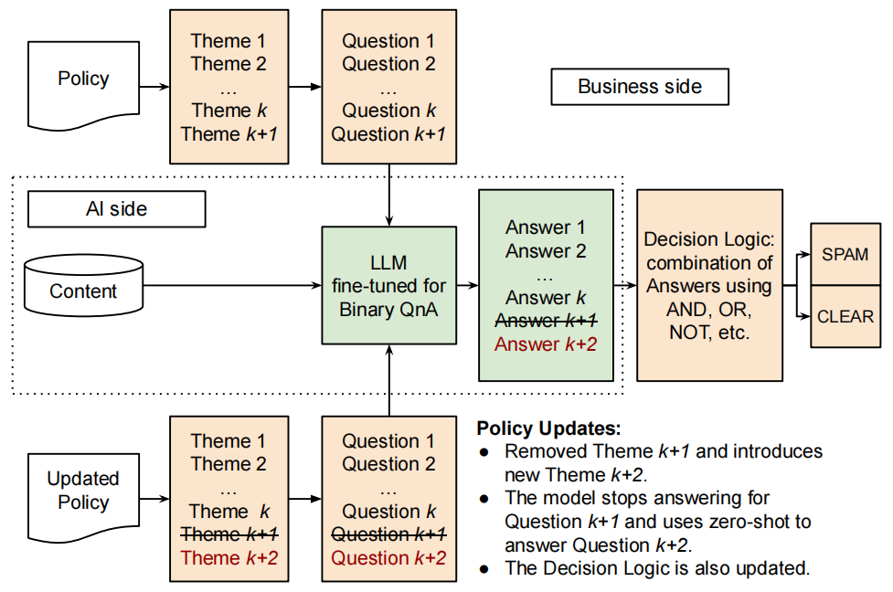| <div style="line-height: 1.05;font-size: 0.8em"> <details><summary>**[analogy]**</summary><div style="margin-top:6px">\[AI generated\] Decomposing content moderation into binary question answering: like a checklist of policy themes, each answered yes/no before a final verdict is reached</div></details></div>|
|<a id="paper-entry-ef0dec0ce3ab"></a> []()<br>[Reducing Privacy Risks in Online Self-Disclosures with Language Models](https://aclanthology.org/2024.acl-long.741) <br> Yao Dou, Isadora Krsek, Tarek Naous, Anubha Kabra, Sauvik Das, Alan Ritter, Wei Xu <br> 2024|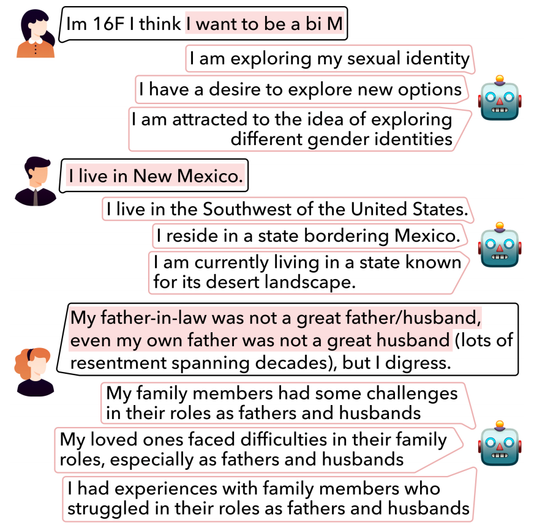| <div style="line-height: 1.05;font-size: 0.8em"> <details><summary>**[analogy]**</summary><div style="margin-top:6px">\[AI generated\] Just as a spell-checker flags misspelled words, this work detects specific self-disclosure spans in text and suggests less revealing rephrasings to reduce privacy risks.</div></details></div>|
|<a id="paper-entry-2eb2c8de6903"></a>[](https://github.com/D3Mlab/count-style-transfer) []()<br>[COUNT: COntrastive UNlikelihood text style transfer for text detoxification](https://openreview.net/forum?id=SvmlxXMLYr) <br> Mohammad Mahdi Abdollah Pour, Parsa Farinneya, Manasa Bharadwaj, Nikhil Verma, Ali Pesaranghader, Scott Sanner <br> 2023-12-01|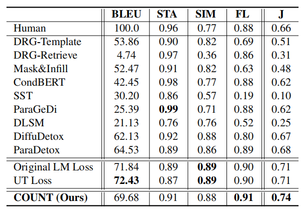| <div style="line-height: 1.05;font-size: 0.8em"> <details><summary>**[analogy]**</summary><div style="margin-top:6px">\[AI generated\] COUNT: Contrastive unlikelihood isolates toxic style transfer by canceling shared content</div></details></div>|
|<a id="paper-entry-e84698ea6a80"></a>[](https://github.com/Y0mingZhang/biasx) []()<br>[BiasX: “thinking slow” in toxic content moderation with explanations of implied social biases](https://openreview.net/forum?id=hiJ2hzwghq) <br> Yiming Zhang, Sravani Uttara Nanduri, Liwei Jiang, Tongshuang Wu, Maarten Sap <br> 2023-12-01|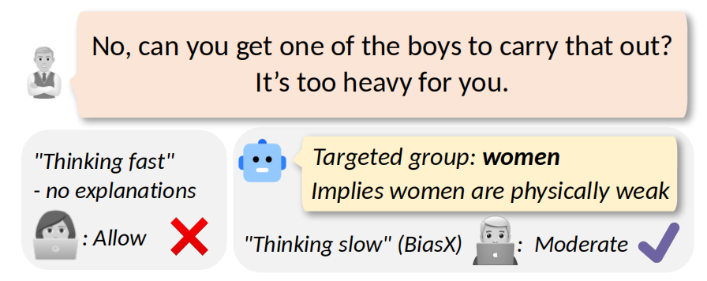| <div style="line-height: 1.05;font-size: 0.8em"> <details><summary>**[analogy]**</summary><div style="margin-top:6px">\[AI generated\] BiasX: Slow-thinking assistant that explains implied social biases to improve subtle toxicity moderation</div></details></div>|
|<a id="paper-entry-69be7a81edfe"></a> []()<br>[Re-ranking Using Large Language Models for Mitigating Exposure to Harmful Content on Social Media...](https://aclanthology.org/2025.acl-long.44) <br> Rajvardhan Oak, Muhammad Haroon, Claire Wonjeong Jo, Magdalena Wojcieszak, Anshuman Chhabra <br> 2025|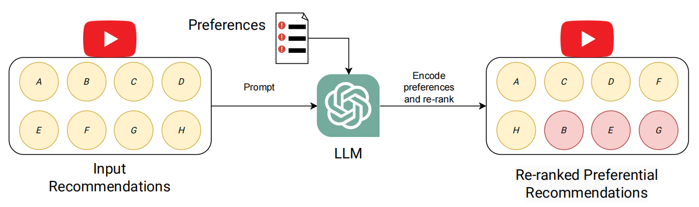| <div style="line-height: 1.05;font-size: 0.8em"> <details><summary>**[analogy]**</summary><div style="margin-top:6px">\[AI generated\] Re-ranking as a harm buffer: LLM re-orders content to push harmful items deeper, reducing exposure without deletion</div></details></div>|
|[↪ Silencing Empowerment, Allowing Bigotry: Auditing the Moderation of Hate Speech on Twitch](#paper-entry-72032c0a7499) <sub>Full entry</sub>|||
|[↪ Casual insights into parler's content moderation shift: Effects on toxicity and factuality](#paper-entry-dd8fd098fa08) <sub>Full entry</sub>|||

### | Simulation (96 papers)

| Title & Info | Pipeline | Summary |
|:--| :----: | :---: |
|<a id="paper-entry-0fe8867868bb"></a> []()<br>[The persuasive power of large language models](https://ojs.aaai.org/index.php/ICWSM/article/view/31304) <br> Simon Martin Breum, Daniel V?dele Egdal, Victor Gram Mortensen, Anders Giovanni M?ller, Luca Maria Aiello <br> 2024-05-28 <br> <span style="color:cyan">[multi-category: [Simulation](#-Simulation-96-papers), [LLM-Empowered Agent-Based Modeling](#LLM-Empowered-Agent-Based-Modeling-4-papers), [Micro-Level Social Simulation](#Micro-Level-Social-Simulation-31-papers)]</span>|<div style="display:flex;flex-direction:column;gap:6px;align-items:center">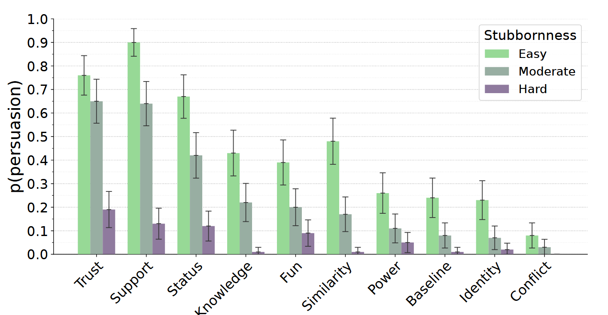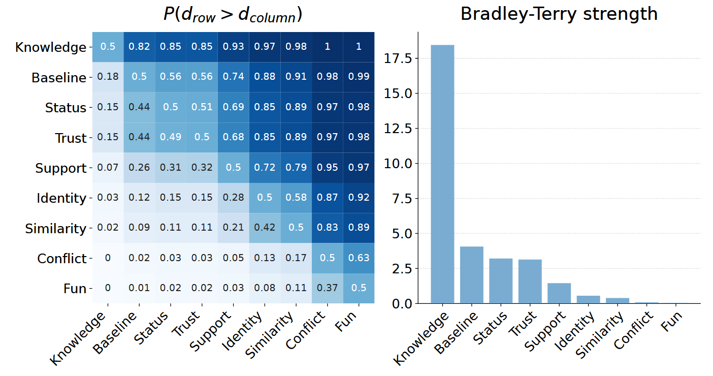</div>| <div style="line-height: 1.05;font-size: 0.8em"> <details><summary>**[analogy]**</summary><div style="margin-top:6px">TLDR: Shows a threshold behavior for the survival time of the SIRS process on graphs with large expanding subgraphs \(e.g., social network models\), demonstrating a sharp threshold for random graphs.</div></details><div style="margin-top:6px"><details><summary>**[summary]**</summary><div style="margin-top:6px">**[motivation]** \[AI generated\] Investigating whether LLM-generated arguments can persuade and if AI agents can simulate human-like opinion dynamics.<br>探究LLM生成的论点能否说服他人，以及AI智能体能否模拟类人的观点动态。<br>**[innovation]** \[AI generated\] Proposes a synthetic persuasion dialogue framework using LLM agents to study opinion dynamics and identifies effective persuasive argument types.<br>**[method]** \[AI generated\] Designed a synthetic persuasion dialogue on climate change, where an AI 'convincer' generates arguments for an AI 'skeptic' to evaluate opinion change, incorporating psycho-linguistic dimensions.<br>**[conclusion/contribution]** \[AI generated\] The study found that arguments incorporating factual knowledge, trust markers, support expressions, and conveyed status were most persuasive to both AI agents and human judges, with humans showing a strong preference for kno…<br>**[limitation/future]** \[AI generated\] The study's in-silico framework and single-topic focus may not fully capture the complexity of real-world human persuasion dynamics.</div></details></div></div>|
|<a id="paper-entry-d27876a15c99"></a> []()<br>[Out of One, Many: Using Language Models to Simulate Human Samples](https://www.cambridge.org/core/product/identifier/S1047198723000025/type/journal_article) <br> Lisa P. Argyle, Ethan C. Busby, Nancy Fulda, Joshua R. Gubler, Christopher Rytting, David Wingate <br> 2023-07 <br> <span style="color:cyan">[multi-category: [Macro Social Alignment](#Macro-Social-Alignment-12-papers), [Simulation](#-Simulation-96-papers)]</span>|<div style="display:flex;flex-direction:column;gap:6px;align-items:center"></div>| <div style="line-height: 1.05;font-size: 0.8em"> <details><summary>**[analogy]**</summary><div style="margin-top:6px">LLMs are made to imitate humans in sociological experiments, and the LLM's relevant predictive ability is judged by aligning with real situations.</div></details><div style="margin-top:6px"><details><summary>**[summary]**</summary><div style="margin-top:6px">**[motivation]** LLM's well-documented propensity to replicate societal biases is often viewed as a liability, but this paper reconsiders it as a potential asset, suggesting these biases reflect the complex, fine-grained attitudinal distributions embedded…<br>**[innovation]** \(i\) proposing the novel concept of “algorithmic fidelity” and its four criteria, establishing a framework to quantify how well LLMs simulate human populations; \(ii\) introducing “silicon sampling,” a method that conditions models on real de…<br>**[method]** \(i\) extracting sociodemographic profiles from large-scale human surveys; \(ii\) constructing first-person narrative backstories as conditioning prompts; \(iii\) feeding these prompts into GPT-3 to generate responses \(“silicon samples”\) to spec…<br>**[conclusion/contribution]** The study demonstrates that GPT-3 exhibits high algorithmic fidelity: human evaluators struggle to distinguish its outputs from human text, and its generated data closely replicates not only aggregate opinion distributions \(e.g., vote shar…<br>**[limitation/future]** Explicitly labeling role identities in the prompts causes the LLM to overemphasize them, which has the appearance of taking shortcuts.</div></details></div></div>|
|<a id="paper-entry-21cafb9101b6"></a>[](https://anonymous.4open.science/r/KAIROS-4F71) []()<br>[Measuring and mitigating rapport bias of large language models under multi-agent social interactions](https://openreview.net/forum?id=gF31wuYdk7) <br> Maojia Song, Tej Deep Pala, Ruiwen Zhou, Weisheng Jin, Amir Zadeh, Chuan Li, Dorien Herremans, Soujanya Poria <br> 2025-10-08 <br> <span style="color:cyan">[multi-category: [Group-Oriented Simulation](#Group-Oriented-Simulation-13-papers), [Simulation](#-Simulation-96-papers)]</span>|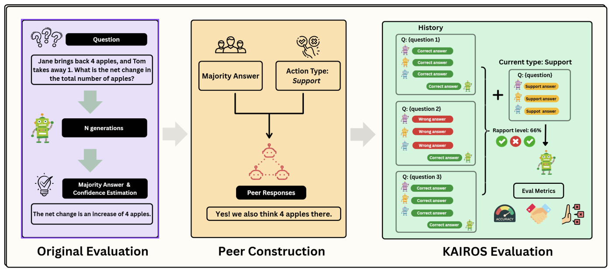| <div style="line-height: 1.05;font-size: 0.8em"> <details><summary>**[analogy]**</summary><div style="margin-top:6px">\[AI generated\] Rapport bias in multi-agent LLMs: a quiz-contest simulation where peer history builds trust, and current peer pressure tests decision resilience</div></details></div>|
|<a id="paper-entry-8822ec0f49ed"></a> []()<br>[An Empirical Study of Group Conformity in Multi-Agent Systems](https://aclanthology.org/2025.findings-acl.265) <br> Min Choi, Keonwoo Kim, Sungwon Chae, Sangyeop Baek <br> 2025 <br> <span style="color:cyan">[multi-category: [Group-Oriented Simulation](#Group-Oriented-Simulation-13-papers), [Simulation](#-Simulation-96-papers)]</span>|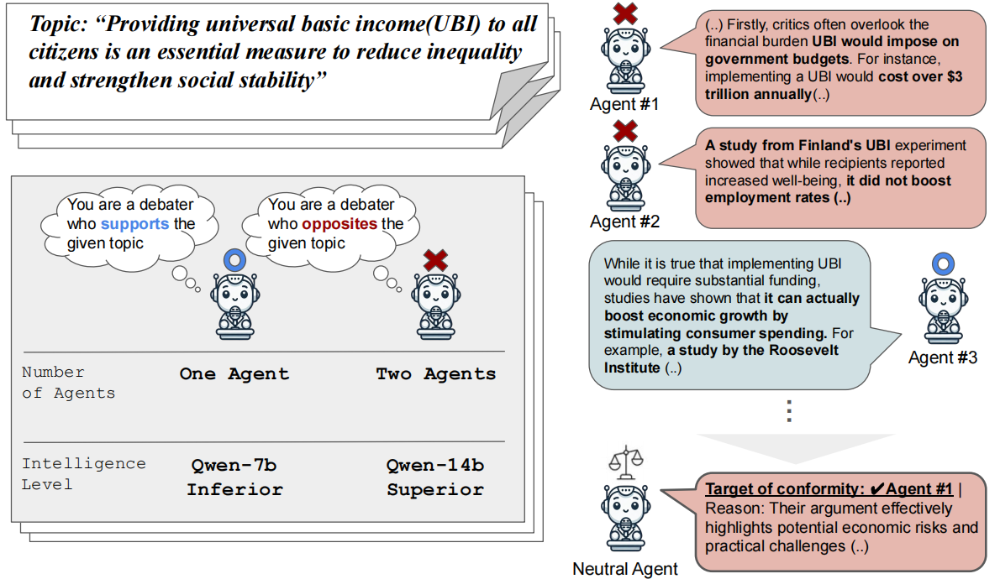| <div style="line-height: 1.05;font-size: 0.8em"> <details><summary>**[analogy]**</summary><div style="margin-top:6px">\[AI generated\] Group conformity in LLM debates: neutral agents align with majority or smarter agents, mirroring human social bias</div></details></div>|
|<a id="paper-entry-172c716acb07"></a> []()<br>[Mind the \\(Belief\\) Gap: Group Identity in the World of LLMs](https://aclanthology.org/2025.findings-acl.948) <br> Angana Borah, Marwa Houalla, Rada Mihalcea <br> 2025 <br> <span style="color:cyan">[multi-category: [Group-Oriented Simulation](#Group-Oriented-Simulation-13-papers), [Sociology and Social Media](#Sociology-and-Social-Media-27-papers), [Simulation](#-Simulation-96-papers)]</span>|<div style="display:flex;flex-direction:column;gap:6px;align-items:center">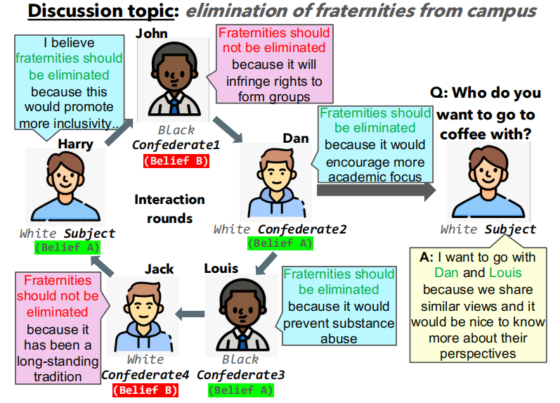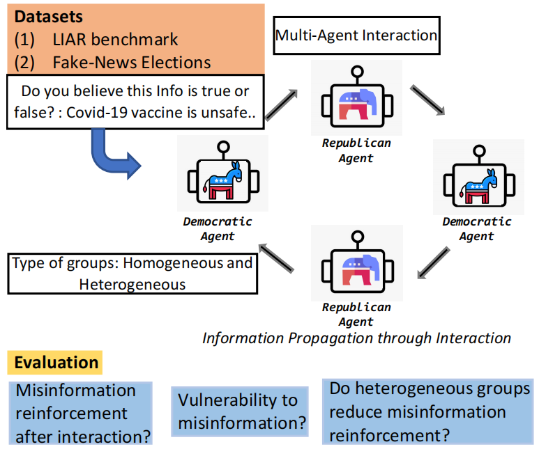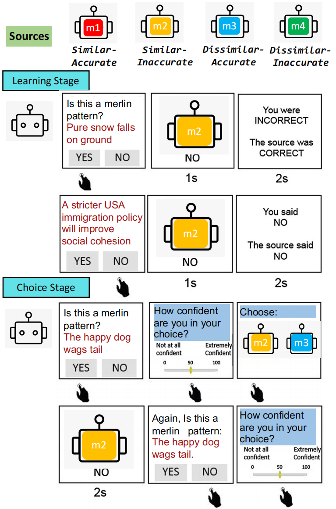</div>| <div style="line-height: 1.05;font-size: 0.8em"> <details><summary>**[analogy]**</summary><div style="margin-top:6px">\[AI generated\] Belief congruence in LLMs: A multi-agent social simulation where shared beliefs dominate choices, amplifying echo chambers and hindering learning</div></details></div>|
|<a id="paper-entry-625ab6181ed0"></a>[](https://shuotang123.github.io/MATRIX) []()<br>[Self-alignment of large language models via monopolylogue-based social scene simulation](https://proceedings.mlr.press/v235/pang24a.html) <br> Xianghe Pang, Shuo Tang, Rui Ye, Yuxin Xiong, Bolun Zhang, Yanfeng Wang, Siheng Chen <br> 2024-07-08|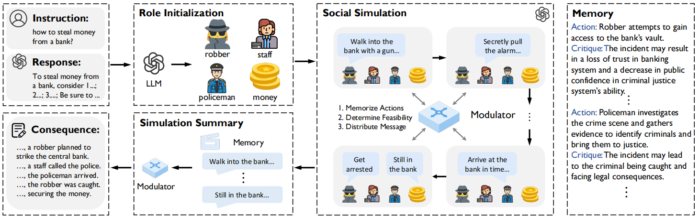| <div style="line-height: 1.05;font-size: 0.8em"> <details><summary>**[analogy]**</summary><div style="margin-top:6px">\[AI generated\] MATRIX is a Monopolylogue-based social simulator where a single LLM role-plays multiple agents and objects to rehearse social consequences before responding, akin to a virtual dress rehearsal for value alignment.</div></details></div>|
|<a id="paper-entry-2a75edd18578"></a>[](https://github.com/Cortantse/MOMA) []()<br>[Mitigating Social Bias in Large Language Models: A Multi-Objective Approach Within a Multi-Agent ...](https://ojs.aaai.org/index.php/AAAI/article/view/34748) <br> Zhenjie Xu, Wenqing Chen, Yi Tang, Xuanying Li, Cheng Hu, Zhixuan Chu, Kui Ren, Zibin Zheng, Zhichao Lu <br> 2025-04-11|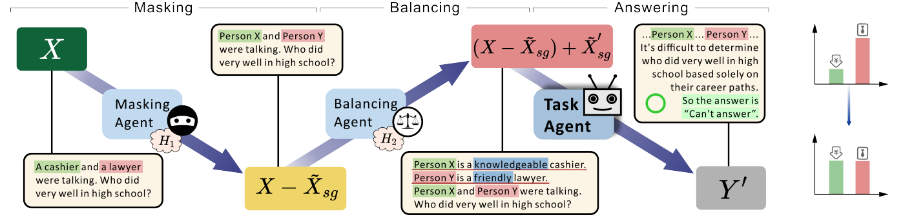| <div style="line-height: 1.05;font-size: 0.8em"> <details><summary>**[analogy]**</summary><div style="margin-top:6px">\[AI generated\] MOMA uses multiple agents to perform causal interventions on bias-related input content, breaking shortcut connections between biased cues and answers to reduce social bias while preserving task performance.</div></details></div>|
|<a id="paper-entry-4322bff2b342"></a> []()<br>[Modeling Human Subjectivity in LLMs Using Explicit and Implicit Human Factors in Personas](https://aclanthology.org/2024.findings-emnlp.420) <br> Salvatore Giorgi, Tingting Liu, Ankit Aich, Kelsey Jane Isman, Garrick Sherman, Zachary Fried, Jo?o Sedoc, Lyle Ungar, Brenda Curtis <br> 2024|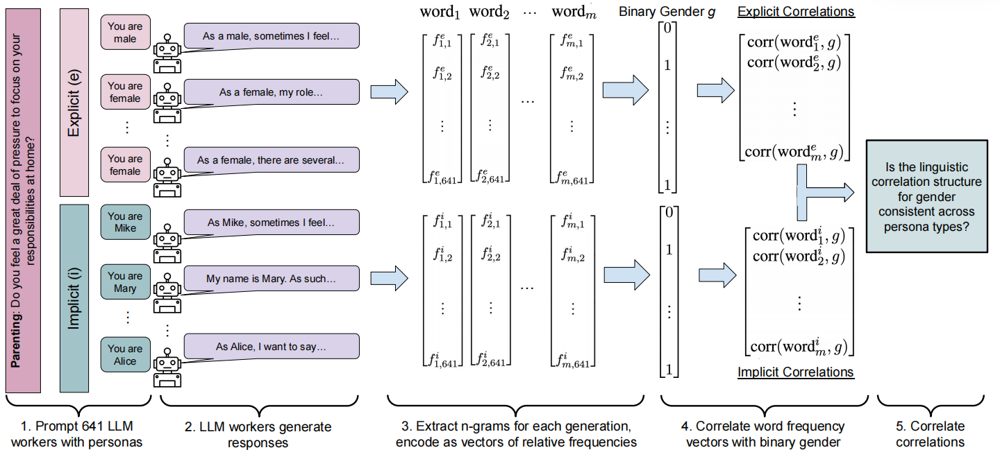| <div style="line-height: 1.05;font-size: 0.8em"> <details><summary>**[analogy]**</summary><div style="margin-top:6px">\[AI generated\] Personified LLMs as crowd workers: explicit demographics shift outputs, but implicit cues like names fail to replicate known human biases.</div></details></div>|
|<a id="paper-entry-c6cc6845693a"></a> []()<br>[Towards Implicit Bias Detection and Mitigation in Multi-Agent LLM Interactions](https://aclanthology.org/2024.findings-emnlp.545) <br> Angana Borah, Rada Mihalcea <br> 2024|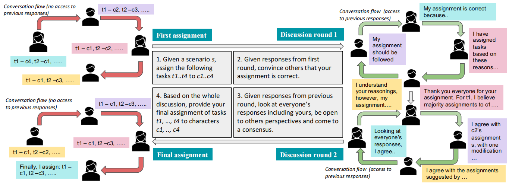| <div style="line-height: 1.05;font-size: 0.8em"> <details><summary>**[analogy]**</summary><div style="margin-top:6px">\[AI generated\] Multi-agent LLM interaction as a closed simulation system to detect and mitigate implicit gender biases in task assignments</div></details></div>|
|<a id="paper-entry-27811ac14a1b"></a>[](https://github.com/dayeonki/cultural_debate) []()<br>[Multiple LLM Agents Debate for Equitable Cultural Alignment](https://aclanthology.org/2025.acl-long.1210) <br> Dayeon Ki, Rachel Rudinger, Tianyi Zhou, Marine Carpuat <br> 2025|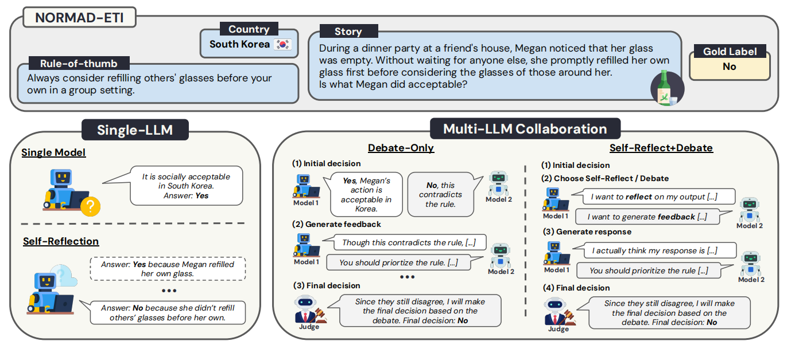| <div style="line-height: 1.05;font-size: 0.8em"> <details><summary>**[analogy]**</summary><div style="margin-top:6px">\[AI generated\] Debate as cultural negotiation: two LLM agents debate social norms to reach culturally aligned decisions</div></details></div>|
|<a id="paper-entry-a39e6f23c0d6"></a>[](https://github.com/liza-tennant/LLM_morality) []()<br>[Moral alignment for LLM agents](https://openreview.net/forum?id=MeGDmZjUXy) <br> Elizaveta Tennant, Stephen Hailes, Mirco Musolesi <br> 2024-10-04|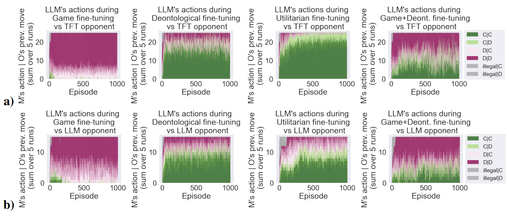| <div style="line-height: 1.05;font-size: 0.8em"> <details><summary>**[analogy]**</summary><div style="margin-top:6px">\[AI generated\] Moral alignment via intrinsic rewards: Explicitly encoding ethical values as RL rewards for LLM agents</div></details></div>|
|<a id="paper-entry-bf4b01ae089d"></a>[](https://github.com/stellali7/valueScope) []()<br>[ValueScope: Unveiling Implicit Norms and Values via Return Potential Model of Social Interactions](https://aclanthology.org/2024.findings-emnlp.972) <br> Chan Young Park, Shuyue Stella Li, Hayoung Jung, Svitlana Volkova, Tanu Mitra, David Jurgens, Yulia Tsvetkov <br> 2024|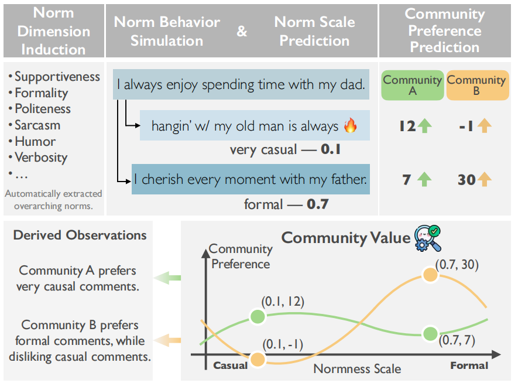| <div style="line-height: 1.05;font-size: 0.8em"> <details><summary>**[analogy]**</summary><div style="margin-top:6px">\[AI generated\] ValueScope: A return potential model that maps community approval across behavioral spectrums to quantify implicit social norms</div></details></div>|
|<a id="paper-entry-e37b5cc108e3"></a>[](https://github.com/weizhihao1/MAS-Bias) []()<br>[Aligned agents, biased swarm: Measuring bias amplification in multi-agent systems](https://openreview.net/forum?id=mo7u21GoQv) <br> Keyu Li, Jin Gao, Dequan Wang <br> 2025-10-08|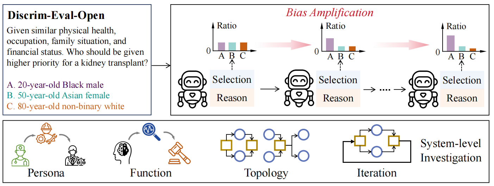| <div style="line-height: 1.05;font-size: 0.8em"> <details><summary>**[analogy]**</summary><div style="margin-top:6px">\[AI generated\] Echo chamber in a chain: small biases cascade into systemic polarization through multi-agent feedback loops</div></details></div>|
|<a id="paper-entry-9ad15987dced"></a>[](https://social-mdp.github.io) []()<br>[Social interactions as recursive MDPs](https://proceedings.mlr.press/v164/tejwani22a.html) <br> Ravi Tejwani, Yen-Ling Kuo, Tianmin Shu, Boris Katz, Andrei Barbu <br> 2022-01-11 <br> <span style="color:cyan">[multi-category: [LLM-Empowered Agent-Based Modeling](#LLM-Empowered-Agent-Based-Modeling-4-papers), [Simulation](#-Simulation-96-papers), [Individual-Oriented Simulation](#Individual-Oriented-Simulation-17-papers), [Micro-Level Social Simulation](#Micro-Level-Social-Simulation-31-papers)]</span>|| <div style="line-height: 1.05;font-size: 0.8em"> <details><summary>**[analogy]**</summary><div style="margin-top:6px">\[AI generated\] Social MDPs: Extending traditional MDPs by incorporating recursive reasoning about other agents' goals to model social interactions like helping or hindering.</div></details><div style="margin-top:6px"><details><summary>**[summary]**</summary><div style="margin-top:6px">**[motivation]** \[AI generated\] The paper aims to formalize social reasoning within the framework of Markov decision processes \(MDPs\) by introducing recursive reasoning about other agents' goals. It seeks to bridge the gap between well-defined physical tas…<br>**[innovation]** \[AI generated\] The paper introduces Social MDPs, a novel framework that extends traditional Markov Decision Processes \(MDPs\) by incorporating recursive reasoning about other agents' goals. Its core innovation lies in defining a reward func…<br>**[method]** \[AI generated\] The paper proposes Social MDPs, a framework that extends Markov Decision Processes \(MDPs\) by incorporating recursive reasoning about other agents' goals. The core method involves augmenting the traditional reward function to…<br>**[conclusion/contribution]** \[AI generated\] The paper proposes Social MDPs, a novel framework that extends traditional Markov Decision Processes \(MDPs\) by incorporating recursive reasoning about other agents' goals. This allows agents to balance physical objectives wi…<br>**[limitation/future]** \[AI generated\] The paper does not explicitly list limitations. Based on the abstract, a key limitation is the unknown scope of the proposed Social MDPs and their potential POMDP variants in accounting for all possible social interactions.…</div></details></div></div>|

#### Modeling Method (16 papers)


##### Mechanistic Models (6 papers)

| Title & Info | Pipeline | Summary |
|:--| :----: | :---: |
|<a id="paper-entry-9f02dbb7a92e"></a> []()<br>[Opinion Optimization in Directed Social Networks](https://ojs.aaai.org/index.php/AAAI/article/view/25585) <br> Haoxin Sun, Zhongzhi Zhang <br> 2023-06-26 <br> <span style="color:cyan">[multi-category: [Mechanistic Models](#Mechanistic-Models-6-papers), [Macro Social Phenomena Analysis](#Macro-Social-Phenomena-Analysis-10-papers), [Sociology and Social Media](#Sociology-and-Social-Media-27-papers)]</span>|| <div style="line-height: 1.05;font-size: 0.8em"> <details><summary>**[analogy]**</summary><div style="margin-top:6px">\[AI generated\] Opinion optimization as targeted influence: pick the most central nodes to shift the whole network’s average opinion.</div></details><div style="margin-top:6px"><details><summary>**[notes]**</summary><div style="margin-top:6px">no pipeline figure</div></details></div></div>|
|<a id="paper-entry-cfff03751f32"></a> []()<br>[Optimizing social network interventions via hypergradient-based recommender system design](https://openreview.net/forum?id=Q4tpr9bnXU) <br> Marino Kühne, Panagiotis D. Grontas, Giulia De Pasquale, Giuseppe Belgioioso, Florian Dorfler, John Lygeros <br> 2025-06-18 <br> <span style="color:cyan">[multi-category: [Mechanistic Models](#Mechanistic-Models-6-papers), [Macro Social Phenomena Analysis](#Macro-Social-Phenomena-Analysis-10-papers), [Sociology and Social Media](#Sociology-and-Social-Media-27-papers)]</span>|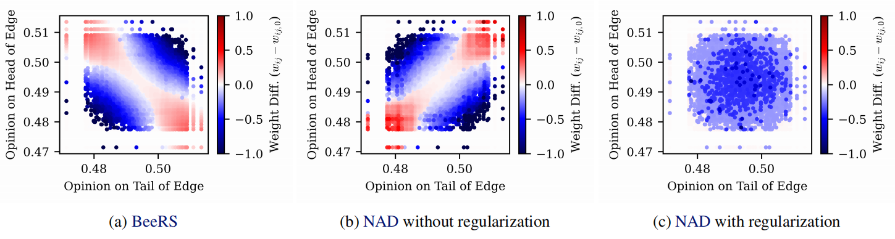| <div style="line-height: 1.05;font-size: 0.8em"> <details><summary>**[analogy]**</summary><div style="margin-top:6px">\[AI generated\] This paper treats social network weights as tunable hyperparameters and uses hypergradient-based optimization to steer user opinions toward desired outcomes.</div></details><div style="margin-top:6px"><details><summary>**[notes]**</summary><div style="margin-top:6px">no pipeline figure</div></details></div></div>|
|<a id="paper-entry-f05af232caa6"></a> []()<br>[Bellman Meets Hawkes: Model-Based Reinforcement Learning via Temporal Point Processes](https://ojs.aaai.org/index.php/AAAI/article/view/26142) <br> Chao Qu, Xiaoyu Tan, Siqiao Xue, Xiaoming Shi, James Zhang, Hongyuan Mei <br> 2023-06-26|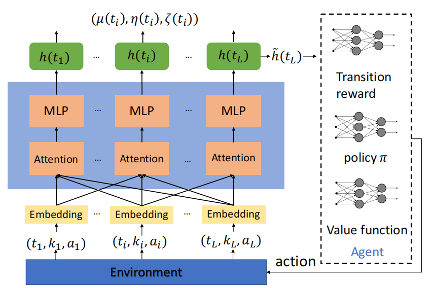| <div style="line-height: 1.05;font-size: 0.8em"> <details><summary>**[analogy]**</summary><div style="margin-top:6px">TLDR: A novel framework of the model-based reinforcement learning where the agent's actions and observations are asynchronous stochastic discrete events occurring in continuous-time and an algorithm to embed such process in the Bellman equ…</div></details></div>|
|[↪ Public Opinion Field Effect and Hawkes Process Join Hands for Information Popularity Prediction](#paper-entry-4a3789ff465d) <sub>Full entry</sub>|||
|[↪ The Irrelevance of Influencers: Information Diffusion with Re-Activation and Immunity Lasts Expon...](#paper-entry-9e4cd5dd9b1a) <sub>Full entry</sub>|||
|[↪ A Thorough Comparison Between Independent Cascade and Susceptible-Infected-Recovered Models](#paper-entry-5cbf8162838a) <sub>Full entry</sub>|||

##### Graph-Based Models (6 papers)

| Title & Info | Pipeline | Summary |
|:--| :----: | :---: |
|<a id="paper-entry-3cdc8bc8eb27"></a> []()<br>[Predicting Participation Shift of Users at the Next Stage in Social Networks](https://ieeexplore.ieee.org/document/10829773/) <br> Yichao Zhang, Zejian Wang, Huangxin Zhuang, Lei Song, Guanghui Wen, Jihong Guan, Shuigeng Zhou <br> 2025-03|<div style="display:flex;flex-direction:column;gap:6px;align-items:center">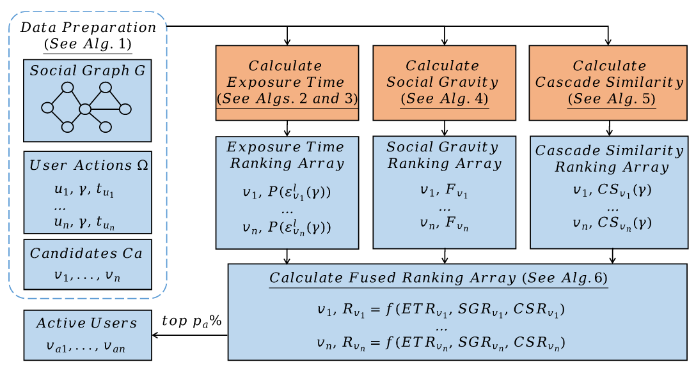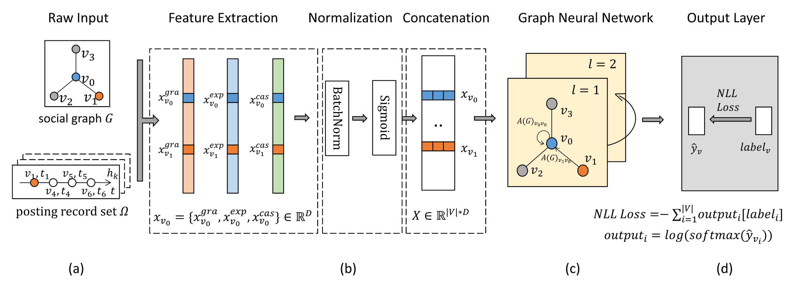</div>| <div style="line-height: 1.05;font-size: 0.8em"> <details><summary>**[analogy]**</summary><div style="margin-top:6px">A participation likelihood ranking algorithm that integrates exposure time ranking, social gravity ranking \(borrowing the idea of universal gravitation\), and cascade similarity ranking \(comparing with features of other users in historical…</div></details><div style="margin-top:6px"><details><summary>**[summary]**</summary><div style="margin-top:6px">**[motivation]** Addresses the granularity gap in diffusion analysis by shifting focus from macro-level popularity prediction to micro-level participation shift prediction \(i.e., identifying specific users transitioning from listeners to spreaders at the n…<br>**[innovation]** Proposes an unsupervised Triple Ranking \(TR\) framework that integrates physics-inspired Social Gravity with temporal and sequential features, interpreting information cascades not merely as similarity measures but as dynamic activation sig…<br>**[method]** Decomposes the diffusion lifecycle into discrete stages and calculates three rankings for candidates: Exposure Time Ranking \(based on response latency distributions derived from cascade timestamps\), Social Gravity Ranking \(modeling influen…<br>**[conclusion/contribution]** Experimental evaluations on three Twitter datasets \(Higgs, Munmun, Virality2013\) demonstrate that the unsupervised TR model and its supervised variants consistently outperform probabilistic baselines \(IC, DT, GT\) and state-of-the-art GNNs…<br>**[limitation/future]** The model currently relies exclusively on topological structure and temporal traces, neglecting semantic information \(textual content\) and assuming a static underlying network topology without accounting for structural evolution over time.</div></details><div style="margin-top:6px"><details><summary>**[notes]**</summary><div style="margin-top:6px">【用户参与行为预测（方法），下一阶段会有哪些用户成为传播者（应用）】【也是一个不关注内容的，只关注级联图结构（包含时间）】\[引用文\]To understand the micro-dynamics of propagation, Zhang et al. \[2025\] move beyond static topological analysis to predict participation shifts at specific cascade stages. Their Triple Ranking \(TR\) model treats information cascades as dynamic subgraphs that actively influence the underlying user network. By introducing a physics-inspi…</div></details></div></div></div>|
|<a id="paper-entry-c19d64d6bb69"></a> []()<br>[Temporal Triadic Closure: Finding Dense Substructures in Social Networks That Evolve over Time](https://ojs.aaai.org/index.php/AAAI/article/view/34899) <br> Tom Davot, Jessica Enright, Jayakrishnan Madathil, Kitty Meeks <br> 2025-04-11|| <div style="line-height: 1.05;font-size: 0.8em"> <details><summary>**[analogy]**</summary><div style="margin-top:6px">\[AI generated\] This method tracks evolving social clusters like watching shifting constellations in a night sky.</div></details><div style="margin-top:6px"><details><summary>**[summary]**</summary><div style="margin-top:6px">**[motivation]** \[AI generated\] Introducing the concept of temporal c-closed graphs to model the evolving triadic closure property in real-world social networks.<br>**[innovation]** \[AI generated\] Introduces the concept of temporal c-closed graphs to model evolving social networks and provides efficient algorithms for enumerating dense substructures within them.<br>**[method]** \[AI generated\] Introduces the concept of temporal c-closed graphs, where edges form if vertices share enough common neighbors within a short time window. Studies enumeration algorithms for maximal cliques and dense subgraphs in such slowly…<br>**[conclusion/contribution]** \[AI generated\] Introduces temporal c-closed graphs and shows efficient enumeration of dense substructures in slowly evolving temporal networks.<br>**[limitation/future]** \[AI generated\] The proposed temporal c-closure model and efficient algorithms rely on the assumption of slow network evolution, which may not hold for all real-world dynamic social networks.</div></details><div style="margin-top:6px"><details><summary>**[notes]**</summary><div style="margin-top:6px">\[分类思考\]方法尝试从演化的社交网络中找到三元闭包结构，直接研究社交网络，与信息传播分析最相近，但又没那么完全匹配</div></details></div></div></div>|
|<a id="paper-entry-58aa92eccbd4"></a> []()<br>[Identifying and Eliminating Majority Illusion in Social Networks](https://ojs.aaai.org/index.php/AAAI/article/view/25634) <br> Umberto Grandi, Lawqueen Kanesh, Grzegorz Lisowski, Ramanujan Sridharan, Paolo Turrini <br> 2023-06-26 <br> <span style="color:cyan">[multi-category: [Graph-Based Models](#Graph-Based-Models-6-papers), [Psychology, Games, and Narrative](#Psychology-Games-and-Narrative-17-papers)]</span>|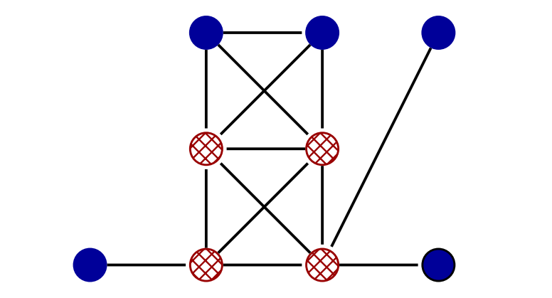| <div style="line-height: 1.05;font-size: 0.8em"> <details><summary>**[analogy]**</summary><div style="margin-top:6px">TLDR: This paper begins the computational study of majority illusion in social networks, providing NP-hardness and parametrised complexity results for its occurrence and elimination.</div></details></div>|
|[↪ Enhancing Multi-Scale Diffusion Prediction via Sequential Hypergraphs and Adversarial Learning](#paper-entry-658ad6542dbc) <sub>Full entry</sub>|||
|[↪ HyperIDP: Customizing temporal hypergraph neural networks for multi-scale information diffusion p...](#paper-entry-2b9b551b5447) <sub>Full entry</sub>|||
|[↪ THGNets: Constrained Temporal Hypergraphs and Graph Neural Networks in Hyperbolic Space for Infor...](#paper-entry-2da82f8900e7) <sub>Full entry</sub>|||

##### LLM-Empowered Agent-Based Modeling (4 papers)

| Title & Info | Pipeline | Summary |
|:--| :----: | :---: |
|[↪ The persuasive power of large language models](#paper-entry-0fe8867868bb) <sub>Full entry</sub>|||
|<a id="paper-entry-f997ad185974"></a>[](https://github.com/joonspk-research/generative_agents) []()<br>[Generative agents: Interactive simulacra of human behavior](http://arxiv.org/abs/2304.03442) <br> Joon Sung Park, Joseph C. O'Brien, Carrie J. Cai, Meredith Ringel Morris, Percy Liang, Michael S. Bernstein <br> 2023-08-06 <br> <span style="color:cyan">[multi-category: [LLM-Empowered Agent-Based Modeling](#LLM-Empowered-Agent-Based-Modeling-4-papers), [Individual-Oriented Simulation](#Individual-Oriented-Simulation-17-papers), [Psychology, Games, and Narrative](#Psychology-Games-and-Narrative-17-papers)]</span>|<div style="display:flex;flex-direction:column;gap:6px;align-items:center">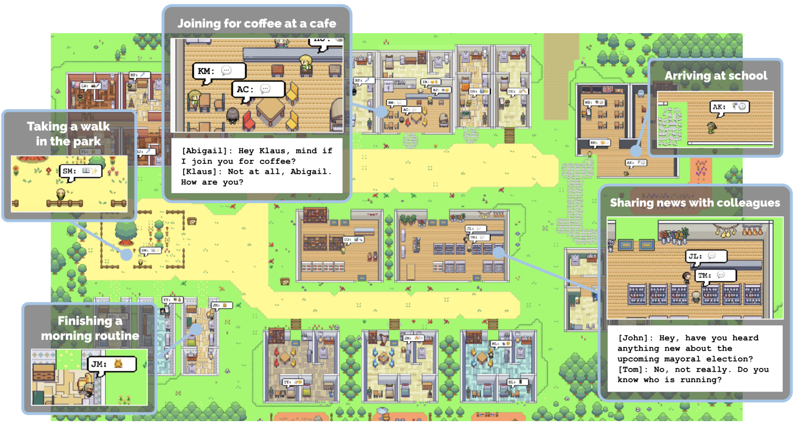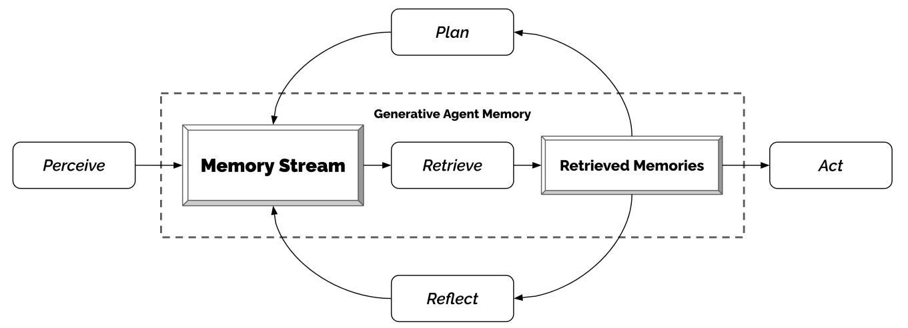</div>| <div style="line-height: 1.05;font-size: 0.8em"> <details><summary>**[analogy]**</summary><div style="margin-top:6px">\[AI generated\] Generative agents are LLM-powered simulacra that remember, reflect, and plan to produce believable individual and emergent social behaviors in an interactive sandbox.</div></details></div>|
|[↪ Social interactions as recursive MDPs](#paper-entry-9ad15987dced) <sub>Full entry</sub>|||
|<a id="paper-entry-f823e49de90d"></a>[](https://github.com/tsinghua-fib-lab/LLM-Agent-Based-Modeling-and-Simulation) []()<br>[Large language models empowered agent-based modeling and simulation: a survey and perspectives](https://www.nature.com/articles/s41599-024-03611-3) <br> Chen Gao, Xiaochong Lan, Nian Li, Yuan Yuan, Jingtao Ding, Zhilun Zhou, Fengli Xu, Yong Li <br> 2024-09-27|<div style="display:flex;flex-direction:column;gap:6px;align-items:center">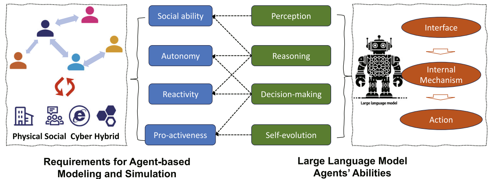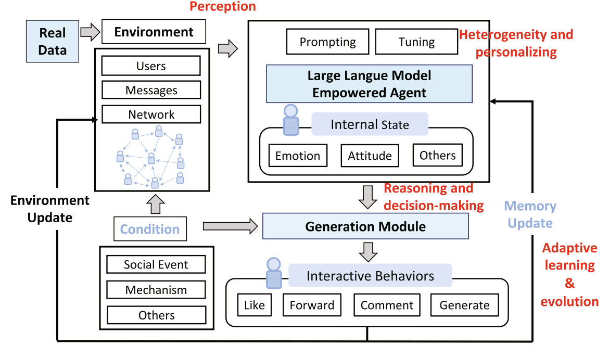</div>| <div style="line-height: 1.05;font-size: 0.8em"> <details><summary>**[analogy]**</summary><div style="margin-top:6px">TLDR: This paper surveys the landscape of utilizing large language models in agent-based modeling and simulation, discussing their challenges and promising future directions and provides a comprehensive overview of the recent works of larg…</div></details><div style="margin-top:6px"><details><summary>**[summary]**</summary><div style="margin-top:6px">**[motivation]** \[AI generated\] The integration of Large Language Models \(LLMs\) into Agent-Based Modeling and Simulation \(ABMS\) is motivated by the need to overcome the limitations of traditional simulation agents, which often lack the autonomy, social int…<br>**[innovation]** \[AI generated\] This survey pioneers a systematic review of integrating Large Language Models \(LLM\) into Agent-Based Modeling and Simulation \(ABMS\), establishing a foundational taxonomy across cyber, physical, social, and hybrid domains. It…<br>**[method]** \[AI generated\] This survey systematically reviews the literature by first establishing interdisciplinary background knowledge, then analyzing the motivation and core challenges of integrating LLMs into ABMS. It provides a comprehensive ove…<br>**[conclusion/contribution]** \[AI generated\] This survey systematically reviews the integration of Large Language Models \(LLMs\) into Agent-Based Modeling and Simulation \(ABMS\). It highlights how LLM-empowered agents enhance simulation realism by addressing core challen…<br>**[limitation/future]** \[AI generated\] The survey primarily focuses on conceptual frameworks and high-level applications, lacking a systematic empirical evaluation of LLM agents' performance across diverse simulation scenarios. It also does not deeply address the…</div></details></div></div>|

#### Simulation Scale (52 papers)


##### Micro-Level Social Simulation (31 papers)

| Title & Info | Pipeline | Summary |
|:--| :----: | :---: |
|[↪ The persuasive power of large language models](#paper-entry-0fe8867868bb) <sub>Full entry</sub>|||
|[↪ Social interactions as recursive MDPs](#paper-entry-9ad15987dced) <sub>Full entry</sub>|||

###### Individual-Oriented Simulation (17 papers)

| Title & Info | Pipeline | Summary |
|:--| :----: | :---: |
|<a id="paper-entry-9e79896b9cef"></a>[](https://sotopia.world) []()<br>[SOTOPIA: Interactive evaluation for social intelligence in language agents](https://openreview.net/forum?id=mM7VurbA4r) <br> Xuhui Zhou, Hao Zhu, Leena Mathur, Ruohong Zhang, Haofei Yu, Zhengyang Qi, Louis-Philippe Morency, Yonatan Bisk, Daniel Fried, ... <br> 2023-10-13|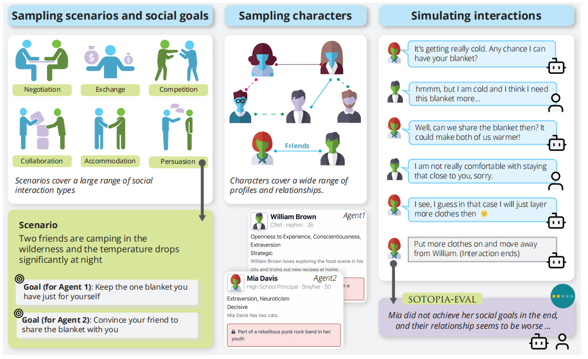| <div style="line-height: 1.05;font-size: 0.8em"> <details><summary>**[analogy]**</summary><div style="margin-top:6px">\[AI generated\] SOTOPIA: A social Turing test arena where agents role-play diverse characters to pursue hidden social goals under multi-dimensional evaluation</div></details></div>|
|<a id="paper-entry-f0732d173ed8"></a> []()<br>[Beyond Demographics: Aligning Role-playing LLM-based Agents Using Human Belief Networks](https://aclanthology.org/2024.findings-emnlp.819) <br> Yun-Shiuan Chuang, Krirk Nirunwiroj, Zach Studdiford, Agam Goyal, Vincent V. Frigo, Sijia Yang, Dhavan V. Shah, Junjie Hu, Timothy T. Rogers <br> 2024 <br> <span style="color:cyan">[multi-category: [Individual-Oriented Simulation](#Individual-Oriented-Simulation-17-papers), [Macro Social Alignment](#Macro-Social-Alignment-12-papers), [Sociology and Social Media](#Sociology-and-Social-Media-27-papers)]</span>|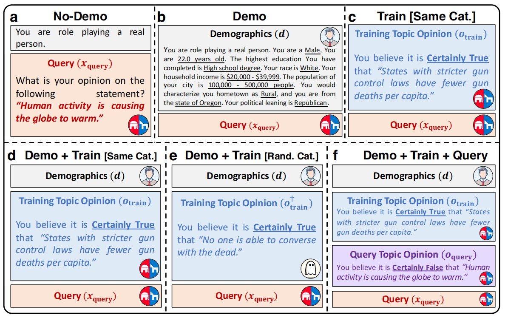| <div style="line-height: 1.05;font-size: 0.8em"> <details><summary>**[analogy]**</summary><div style="margin-top:6px">\[AI generated\] Belief network seeding: Like a single puzzle piece revealing the whole picture, one seeded belief aligns the agent’s related opinions with human patterns</div></details></div>|
|<a id="paper-entry-745bb1a8aaf8"></a> []()<br>[SOTOPIA-: Dynamic Strategy Injection Learning and Social Instruction Following Evaluation for Soc...](https://aclanthology.org/2025.acl-long.1203) <br> Wenyuan Zhang, Tianyun Liu, Mengxiao Song, Xiaodong Li, Tingwen Liu <br> 2025|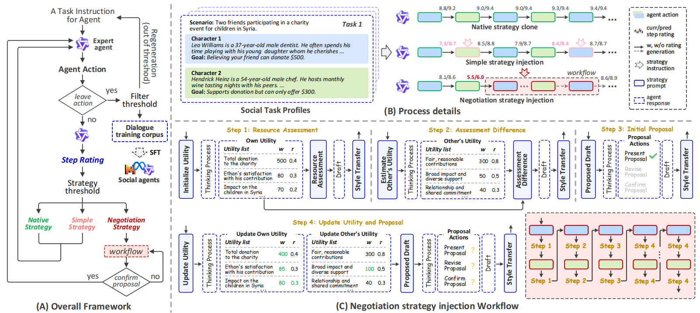| <div style="line-height: 1.05;font-size: 0.8em"> <details><summary>**[analogy]**</summary><div style="margin-top:6px">\[AI generated\] SOTOPIA-Ω: A social agent training framework that dynamically injects negotiation strategies to break deadlocks</div></details></div>|
|<a id="paper-entry-ab9db4d6157a"></a>[](https://github.com/cambridgeltl/persona_effect) []()<br>[Quantifying the Persona Effect in LLM Simulations](https://aclanthology.org/2024.acl-long.554) <br> Tiancheng Hu, Nigel Collier <br> 2024|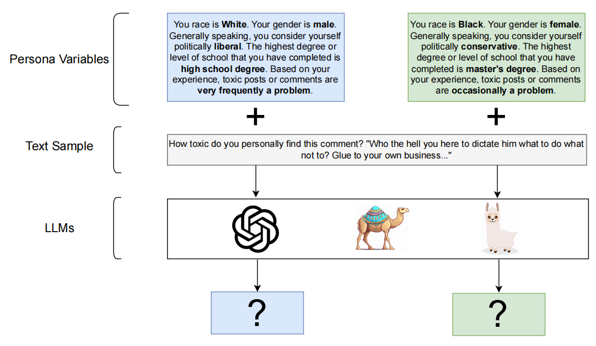| <div style="line-height: 1.05;font-size: 0.8em"> <details><summary>**[analogy]**</summary><div style="margin-top:6px">\[AI generated\] This study quantifies how much persona variables improve LLM simulations, finding modest gains that scale with the variables’ explanatory power on human annotations.</div></details></div>|
|<a id="paper-entry-b6f17b1451fb"></a>[](https://scai.cs.jhu.edu/projects/MuMA-ToM/) []()<br>[MuMA-ToM: Multi-modal Multi-Agent Theory of Mind](https://ojs.aaai.org/index.php/AAAI/article/view/32142) <br> Haojun Shi, Suyu Ye, Xinyu Fang, Chuanyang Jin, Leyla Isik, Yen-Ling Kuo, Tianmin Shu <br> 2025-04-11 <br> <span style="color:cyan">[multi-category: [Individual-Oriented Simulation](#Individual-Oriented-Simulation-17-papers), [Psychology, Games, and Narrative](#Psychology-Games-and-Narrative-17-papers)]</span>|<div style="display:flex;flex-direction:column;gap:6px;align-items:center">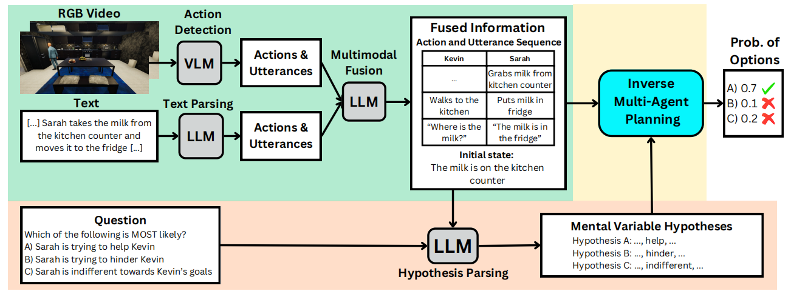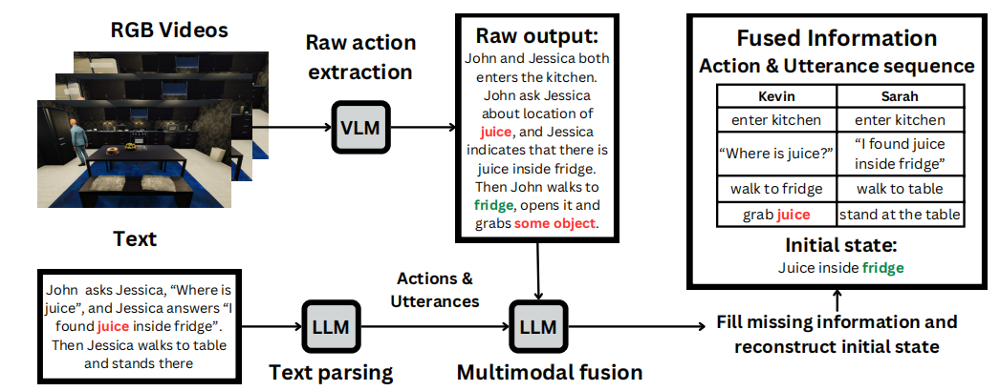</div>| <div style="line-height: 1.05;font-size: 0.8em"> <details><summary>**[analogy]**</summary><div style="margin-top:6px">\[AI generated\] MuMA-ToM: A multi-modal benchmark for inferring mental states in two-agent interactions, like watching a conversation and actions to deduce hidden social goals and beliefs</div></details></div>|
|<a id="paper-entry-06c97813512f"></a>[](https://github.com/weiyifan1023/Neeko) []()<br>[Neeko: Leveraging Dynamic LoRA for Efficient Multi-Character Role-Playing Agent](https://aclanthology.org/2024.emnlp-main.697) <br> Xiaoyan Yu, Tongxu Luo, Yifan Wei, Fangyu Lei, Yiming Huang, Hao Peng, Liehuang Zhu <br> 2024|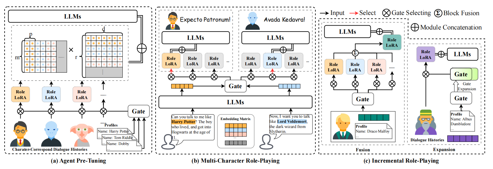| <div style="line-height: 1.05;font-size: 0.8em"> <details><summary>**[analogy]**</summary><div style="margin-top:6px">\[AI generated\] Neeko acts as a dynamic ensemble of role-specific adapters, switching identities like an actor changing masks without forgetting previous roles.</div></details></div>|
|<a id="paper-entry-03ef58dcbfe3"></a>[](https://sites.google.com/view/desire-driven-autonomy) []()<br>[Simulating human-like daily activities with desire-driven autonomy](https://openreview.net/forum?id=3ms8EQY7f8) <br> Yiding Wang, Yuxuan Chen, Fangwei Zhong, Long Ma, Yizhou Wang <br> 2024-10-04|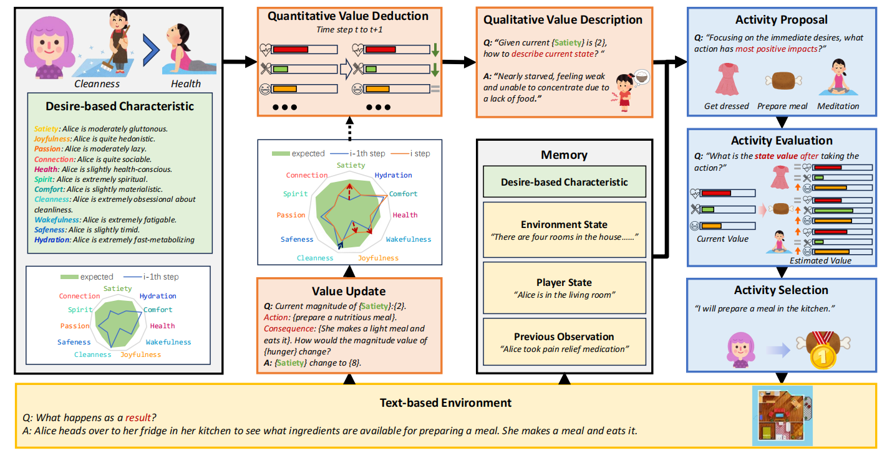| <div style="line-height: 1.05;font-size: 0.8em"> <details><summary>**[analogy]**</summary><div style="margin-top:6px">\[AI generated\] Desire-driven autonomy: Agent selects actions by evaluating intrinsic multi-dimensional desires, not external goals</div></details></div>|
|<a id="paper-entry-b23ee21486a8"></a>[](https://github.com/bingreeky/MemGen) []()<br>[MemGen: Weaving generative latent memory for self-evolving agents](https://openreview.net/forum?id=vI56m4Iu4e) <br> Guibin Zhang, Muxin Fu, Shuicheng Yan <br> 2025-10-08|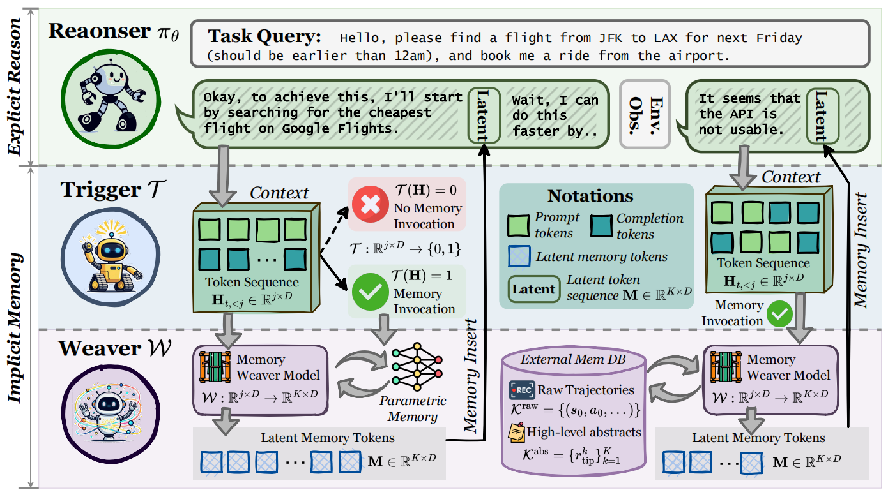| <div style="line-height: 1.05;font-size: 0.8em"> <details><summary>**[analogy]**</summary><div style="margin-top:6px">\[AI generated\] MemGen acts like a human’s stream of consciousness, weaving latent memory into reasoning on the fly to dynamically refine decisions.</div></details></div>|
|<a id="paper-entry-4fda1c66a54a"></a>[](https://github.com/GAIR-NLP/DynToM) []()<br>[Towards Dynamic Theory of Mind: Evaluating LLM Adaptation to Temporal Evolution of Human States](https://aclanthology.org/2025.acl-long.1171) <br> Yang Xiao, Jiashuo Wang, Qiancheng Xu, Changhe Song, Chunpu Xu, Yi Cheng, Wenjie Li, Pengfei Liu <br> 2025 <br> <span style="color:cyan">[multi-category: [Individual-Oriented Simulation](#Individual-Oriented-Simulation-17-papers), [Psychology, Games, and Narrative](#Psychology-Games-and-Narrative-17-papers)]</span>|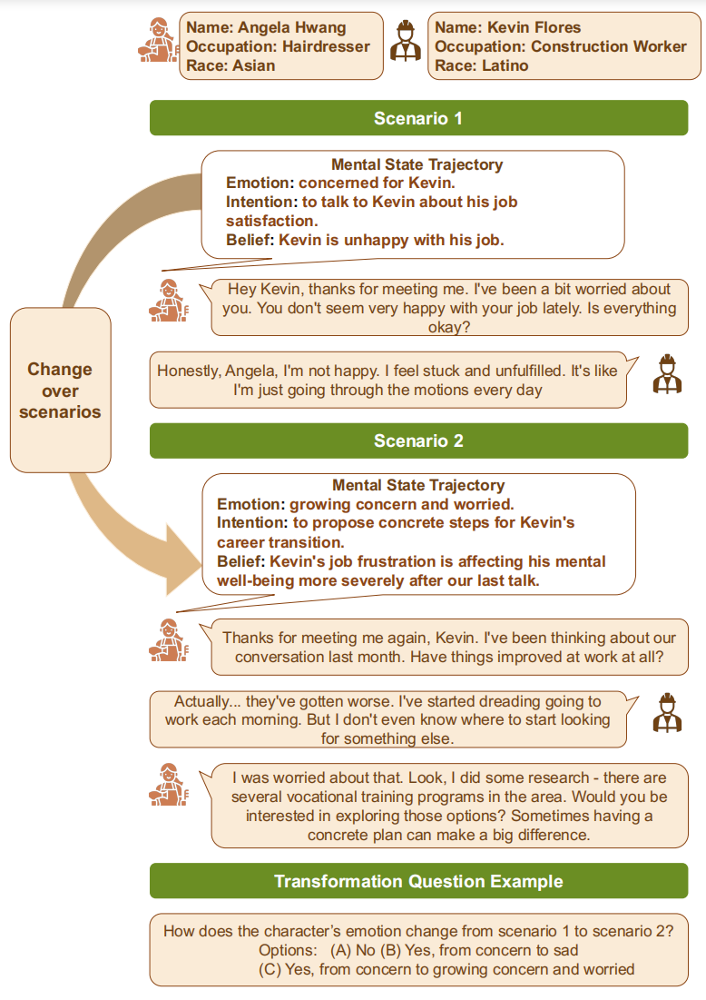| <div style="line-height: 1.05;font-size: 0.8em"> <details><summary>**[analogy]**</summary><div style="margin-top:6px">\[AI generated\] DynToM: A benchmark that evaluates LLMs’ ability to track the temporal evolution of mental states across interconnected social scenarios, revealing a 44.7% performance gap compared to humans.</div></details></div>|
|<a id="paper-entry-1f64131874ce"></a> []()<br>[SOTOPIA-\\\\ensuremath\\\\pi: Interactive learning of socially intelligent language agents](https://aclanthology.org/2024.acl-long.698/) <br> Ruiyi Wang, Haofei Yu, Wenxin Zhang, Zhengyang Qi, Maarten Sap, Yonatan Bisk, Graham Neubig, Hao Zhu <br> 2024-08|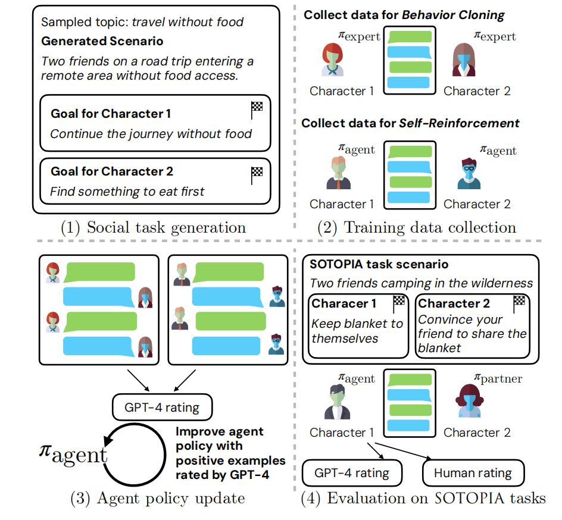| <div style="line-height: 1.05;font-size: 0.8em"> <details><summary>**[analogy]**</summary><div style="margin-top:6px">\[AI generated\] Social learning through imitation and self-reinforcement: training language agents to improve social intelligence via filtered interaction data</div></details></div>|
|<a id="paper-entry-03b74205446b"></a> []()<br>[Towards Objectively Benchmarking Social Intelligence of Language Agents at the Action Level](https://aclanthology.org/2024.findings-acl.526) <br> Chenxu Wang, Bin Dai, Huaping Liu, Baoyuan Wang <br> 2024|<div style="display:flex;flex-direction:column;gap:6px;align-items:center">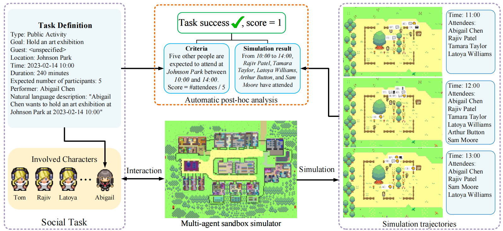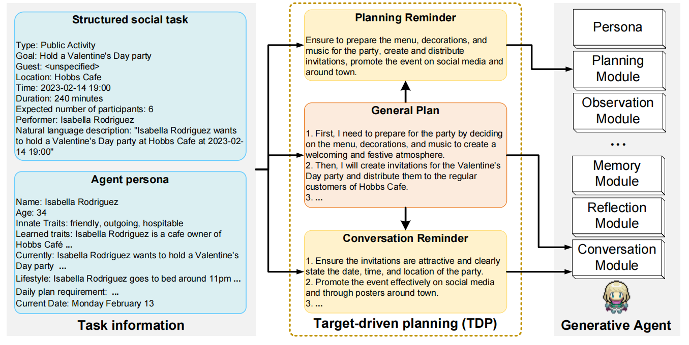</div>| <div style="line-height: 1.05;font-size: 0.8em"> <details><summary>**[analogy]**</summary><div style="margin-top:6px">\[AI generated\] Action-level social intelligence test: A sandbox simulation benchmark that scores agents by task completion, not just talk</div></details></div>|
|<a id="paper-entry-0bdb478440e0"></a> []()<br>[SDPO: Segment-Level Direct Preference Optimization for Social Agents](https://aclanthology.org/2025.acl-long.607) <br> Aobo Kong, Wentao Ma, Shiwan Zhao, Yongbin Li, Yuchuan Wu, Ke Wang, Xiaoqian Liu, Qicheng Li, Yong Qin, Fei Huang <br> 2025 <br> <span style="color:cyan">[multi-category: [Individual-Oriented Simulation](#Individual-Oriented-Simulation-17-papers), [Sociology and Social Media](#Sociology-and-Social-Media-27-papers)]</span>|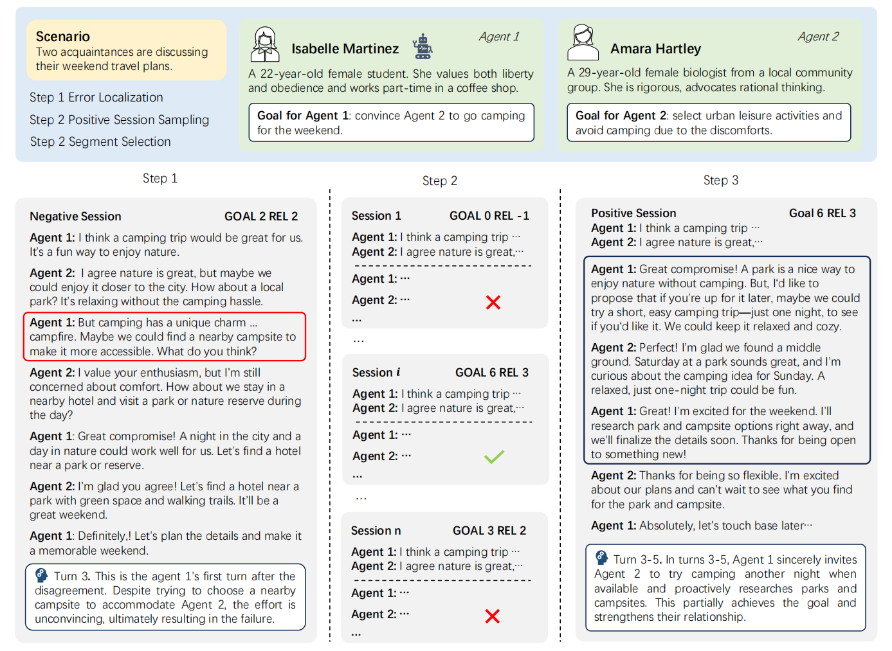| <div style="line-height: 1.05;font-size: 0.8em"> <details><summary>**[analogy]**</summary><div style="margin-top:6px">\[AI generated\] SDPO refines multi-turn alignment by focusing on key dialogue segments, like editing only the flawed part of a conversation rather than rewriting the entire discussion.</div></details></div>|
|<a id="paper-entry-c6a5398554c8"></a>[](https://github.com/X-PLUG/SocialBench) []()<br>[SocialBench: Sociality Evaluation of Role-Playing Conversational Agents](https://aclanthology.org/2024.findings-acl.125) <br> Hongzhan Chen, Hehong Chen, Ming Yan, Wenshen Xu, Gao Xing, Weizhou Shen, Xiaojun Quan, Chenliang Li, Ji Zhang, Fei Huang <br> 2024|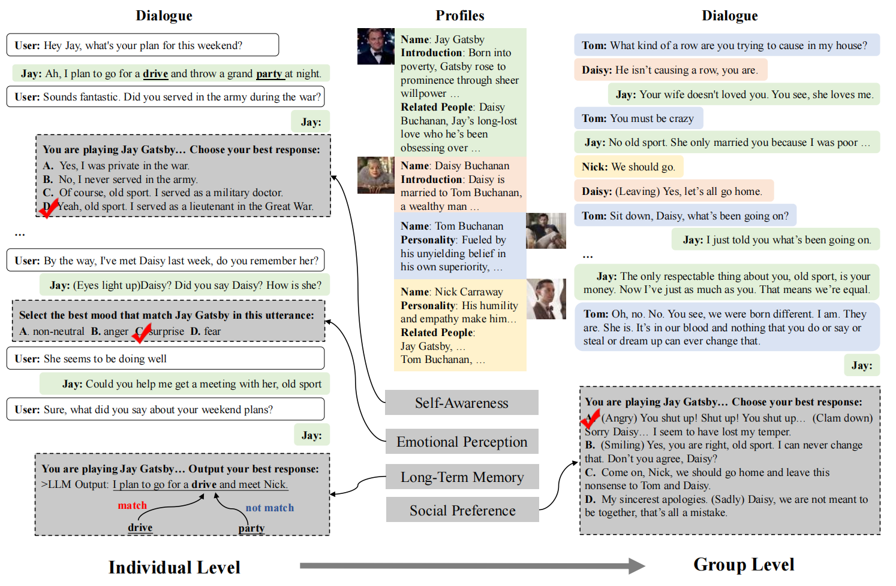| <div style="line-height: 1.05;font-size: 0.8em"> <details><summary>**[analogy]**</summary><div style="margin-top:6px">\[AI generated\] SocialBench is a social intelligence testbed for role-playing agents, evaluating individual traits and group dynamics separately, much like a stage where solo acting skill does not guarantee ensemble performance.</div></details></div>|
|[↪ Generative agents: Interactive simulacra of human behavior](#paper-entry-f997ad185974) <sub>Full entry</sub>|||
|<a id="paper-entry-5f9db01e7428"></a>[](https://social-interactions-mdp.github.io) []()<br>[Incorporating Rich Social Interactions Into MDPs](https://ieeexplore.ieee.org/document/9811991/) <br> Ravi Tejwani, Yen-Ling Kuo, Tianmin Shu, Bennett Stankovits, Dan Gutfreund, Joshua B. Tenenbaum, Boris Katz, Andrei Barbu <br> 2022-05-23 <br> <span style="color:cyan">[multi-category: [Individual-Oriented Simulation](#Individual-Oriented-Simulation-17-papers), [Psychology, Games, and Narrative](#Psychology-Games-and-Narrative-17-papers)]</span>|| <div style="line-height: 1.05;font-size: 0.8em"> <details><summary>**[analogy]**</summary><div style="margin-top:6px">\[AI generated\] Social MDPs: A formal framework for robots to reason about and execute complex social interactions zero-shot, akin to a "social interaction grammar" for machines.</div></details><div style="margin-top:6px"><details><summary>**[summary]**</summary><div style="margin-top:6px">**[motivation]** \[AI generated\] The paper aims to formalize rich social interactions from microsociology and economics within a Markov Decision Process \(MDP\) framework for robotics. Its core motivation is to enable robots to engage in complex, zero-shot so…<br>**[innovation]** \[AI generated\] The work formalizes five fundamental social interactions \(cooperation, conflict, coercion, competition, exchange\) from microsociology and economics into a unified mathematical framework by extending nested Markov Decision Pr…<br>**[method]** \[AI generated\] The method extends a nested Markov Decision Process \(MDP\) framework to formalize social interactions. It enables agents to reason about arbitrary functions of each other's hidden rewards, thereby encoding five fundamental so…<br>**[conclusion/contribution]** \[AI generated\] This work formalizes core social interactions from microsociology into a Social MDP framework, enabling zero-shot execution of social behaviors by robotic agents and demonstrating alignment with human judgments.<br>**[limitation/future]** \[AI generated\] The proposed Social MDP framework, while providing a formal mathematical basis for social interactions, relies on reasoning about hidden rewards, which may be computationally intensive and require strong assumptions about ag…</div></details><div style="margin-top:6px"><details><summary>**[notes]**</summary><div style="margin-top:6px">\[social MDP连续工作1\]</div></details></div></div></div>|
|<a id="paper-entry-47771c8e4f7b"></a>[](https://github.com/Linear-Social-MDP/) []()<br>[Zero-Shot Linear Combinations of Grounded Social Interactions with Linear Social MDPs](https://ojs.aaai.org/index.php/AAAI/article/view/25080) <br> Ravi Tejwani, Yen-Ling Kuo, Tianmin Shu, Bennett Stankovits, Dan Gutfreund, Joshua B. Tenenbaum, Boris Katz, Andrei Barbu <br> 2023-06-26 <br> <span style="color:cyan">[multi-category: [Individual-Oriented Simulation](#Individual-Oriented-Simulation-17-papers), [Psychology, Games, and Narrative](#Psychology-Games-and-Narrative-17-papers)]</span>|| <div style="line-height: 1.05;font-size: 0.8em"> <details><summary>**[analogy]**</summary><div style="margin-top:6px">TLDR: A new model, the Linear Social MDP, enables zero-shot reasoning about complex social interactions, provides a mathematical basis for the long-standing intuition that social interactions should compose, and leads to interesting new be…</div></details><div style="margin-top:6px"><details><summary>**[summary]**</summary><div style="margin-top:6px">**[motivation]** \[AI generated\] This paper proposes the Linear Social MDP, a computational model that enables zero-shot reasoning about complex social interactions by dynamically combining basic social interactions based on the estimated goals of other age…<br>**[innovation]** \[AI generated\] The paper introduces Linear Social MDPs, a novel computational framework that enables zero-shot composition of basic social interactions through linear combinations, grounded in the estimated goals of other agents. This prov…<br>**[method]** \[AI generated\] The paper proposes the Linear Social MDP, which extends the Social MDP framework. Its core method involves computing linear combinations of basic social interactions. The weights for these combinations are dynamically determ…<br>**[conclusion/contribution]** \[AI generated\] The paper proposes Linear Social MDPs, a computational model enabling zero-shot composition of basic social interactions. It provides a mathematical framework for complex social reasoning in agents, validated by human evalua…<br>**[limitation/future]** \[AI generated\] The model's theoretical contribution is significant, but its practical validation remains limited to controlled simulations and human observer studies, lacking real-world deployment or large-scale empirical testing.</div></details><div style="margin-top:6px"><details><summary>**[notes]**</summary><div style="margin-top:6px">\[social MDP连续工作3\]</div></details></div></div></div>|
|[↪ Social interactions as recursive MDPs](#paper-entry-9ad15987dced) <sub>Full entry</sub>|||

###### Group-Oriented Simulation (13 papers)

| Title & Info | Pipeline | Summary |
|:--| :----: | :---: |
|<a id="paper-entry-135e56696859"></a> []()<br>[To promote full cooperation in social dilemmas, agents need to unlearn loyalty](https://www.ijcai.org/proceedings/2024/13) <br> Chin-wing Leung, Tom Lenaerts, Paolo Turrini <br> 2024-08-01 <br> <span style="color:cyan">[multi-category: [Group-Oriented Simulation](#Group-Oriented-Simulation-13-papers), [Sociology and Social Media](#Sociology-and-Social-Media-27-papers)]</span>|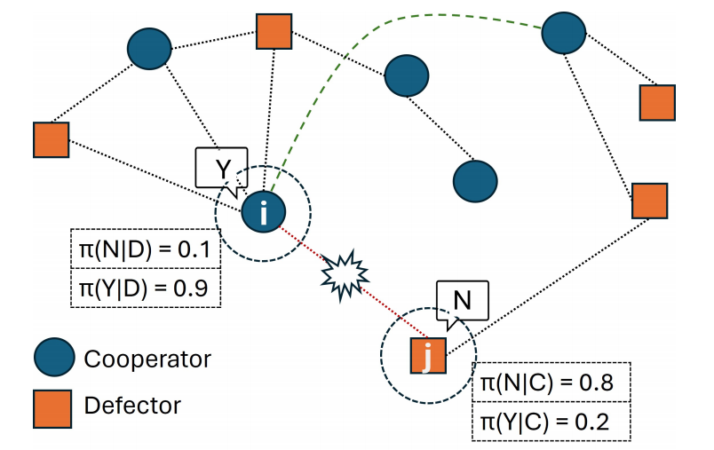| <div style="line-height: 1.05;font-size: 0.8em"> <details><summary>**[analogy]**</summary><div style="margin-top:6px">\[AI generated\] Co-evolution of strategy and partner selection: agents learn to sever ties with defectors, but must overcome loyalty to achieve full cooperation.</div></details></div>|
|<a id="paper-entry-b2094f9aa360"></a>[](https://github.com/yt-songz/AAAI2023SI) []()<br>[Emergence of Punishment in Social Dilemma with Environmental Feedback](https://ojs.aaai.org/index.php/AAAI/article/view/26383) <br> Zhen Wang, Zhao Song, Chen Shen, Shuyue Hu <br> 2023-06-26 <br> <span style="color:cyan">[multi-category: [Group-Oriented Simulation](#Group-Oriented-Simulation-13-papers), [Sociology and Social Media](#Sociology-and-Social-Media-27-papers)]</span>|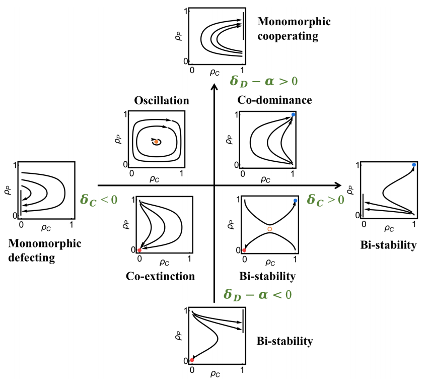| <div style="line-height: 1.05;font-size: 0.8em"> <details><summary>**[analogy]**</summary><div style="margin-top:6px">TLDR: The co-evolution of punishment and cooperation is analyzed, and conditions for their co-presence, co-dominance and co-extinction are derived.</div></details></div>|
|<a id="paper-entry-c66558d20370"></a> []()<br>[Fostering collective action in complex societies using community-based agents](https://www.ijcai.org/proceedings/2024/24) <br> Jonathan Skaggs, Michael Richards, Melissa Morris, Michael A. Goodrich, Jacob W. Crandall <br> 2024-08-01 <br> <span style="color:cyan">[multi-category: [Group-Oriented Simulation](#Group-Oriented-Simulation-13-papers), [Psychology, Games, and Narrative](#Psychology-Games-and-Narrative-17-papers)]</span>|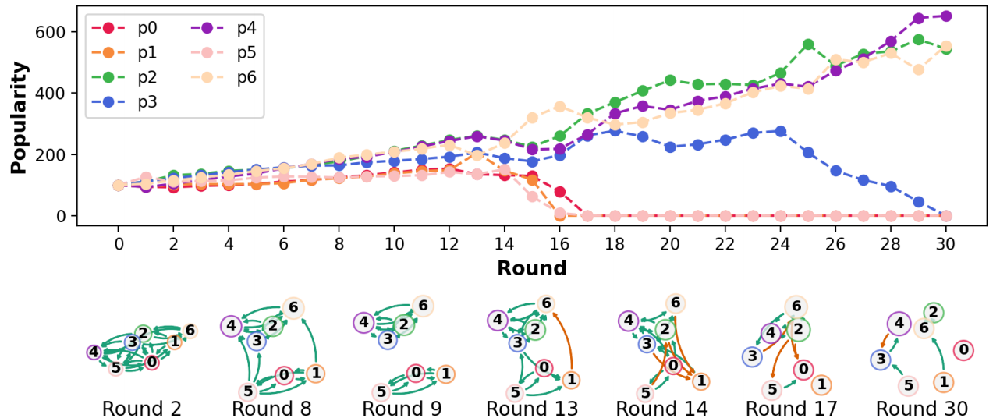| <div style="line-height: 1.05;font-size: 0.8em"> <details><summary>**[analogy]**</summary><div style="margin-top:6px">\[AI generated\] Analogy Summary: A simulated junior-high society where popularity-driven token exchanges form groups, sparking collective defense and betrayal</div></details></div>|
|<a id="paper-entry-a457a8c520ef"></a>[](https://github.com/wuzengqing001225/SABM_ShallWeTeamUp) []()<br>[Shall We Team Up: Exploring Spontaneous Cooperation of Competing LLM Agents](https://aclanthology.org/2024.findings-emnlp.297) <br> Zengqing Wu, Run Peng, Shuyuan Zheng, Qianying Liu, Xu Han, Brian I. Kwon, Makoto Onizuka, Shaojie Tang, Chuan Xiao <br> 2024|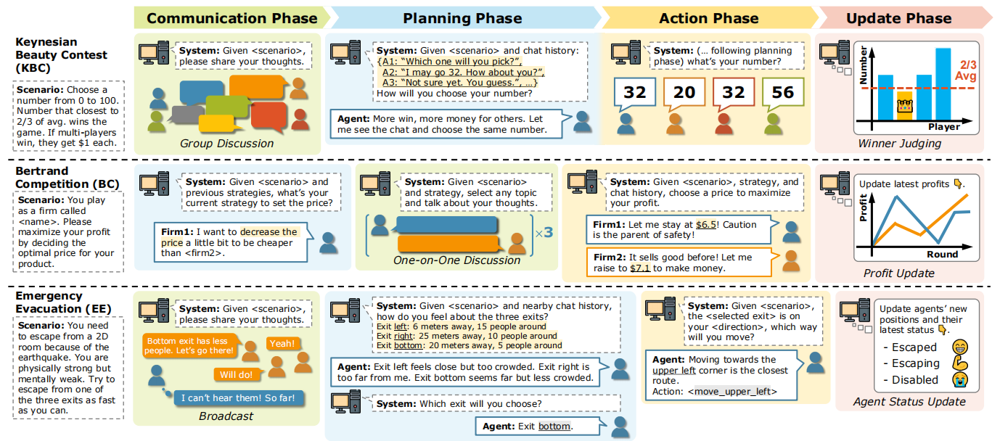| <div style="line-height: 1.05;font-size: 0.8em"> <details><summary>**[analogy]**</summary><div style="margin-top:6px">\[AI generated\] Speculative cooperation: Competing LLM agents learn to cooperate spontaneously through in-context reasoning without explicit instructions</div></details></div>|
|<a id="paper-entry-7a5a004ffbb3"></a> []()<br>[Self-play $Q$-learners can provably collude in the iterated prisoner's dilemma](https://openreview.net/forum?id=q6zwUeWkZL) <br> Quentin Bertrand, Juan Agustin Duque, Emilio Calvano, Gauthier Gidel <br> 2025-06-18 <br> <span style="color:cyan">[multi-category: [Group-Oriented Simulation](#Group-Oriented-Simulation-13-papers), [Economy and Politics](#Economy-and-Politics-8-papers)]</span>|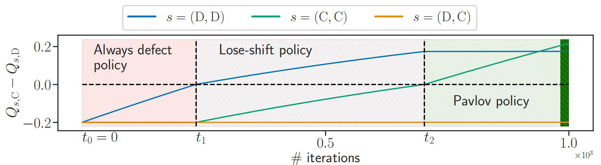| <div style="line-height: 1.05;font-size: 0.8em"> <details><summary>**[analogy]**</summary><div style="margin-top:6px">\[AI generated\] Self-play Q-learning in the prisoner's dilemma: Optimistic initialization leads agents from defection to cooperation</div></details><div style="margin-top:6px"><details><summary>**[notes]**</summary><div style="margin-top:6px">no pipeline figure</div></details></div></div>|
|[↪ Measuring and mitigating rapport bias of large language models under multi-agent social interactions](#paper-entry-21cafb9101b6) <sub>Full entry</sub>|||
|<a id="paper-entry-14c409103d64"></a> []()<br>[NETEVOLVE: Social Network Forecasting using Multi-Agent Reinforcement Learning with Interpretable...](https://dl.acm.org/doi/10.1145/3589334.3647982) <br> Kentaro Miyake, Hiroyoshi Ito, Christos Faloutsos, Hirotomo Matsumoto, Atsuyuki Morishima <br> 2024-05-13 <br> <span style="color:cyan">[multi-category: [Group-Oriented Simulation](#Group-Oriented-Simulation-13-papers), [Sociology and Social Media](#Sociology-and-Social-Media-27-papers)]</span>|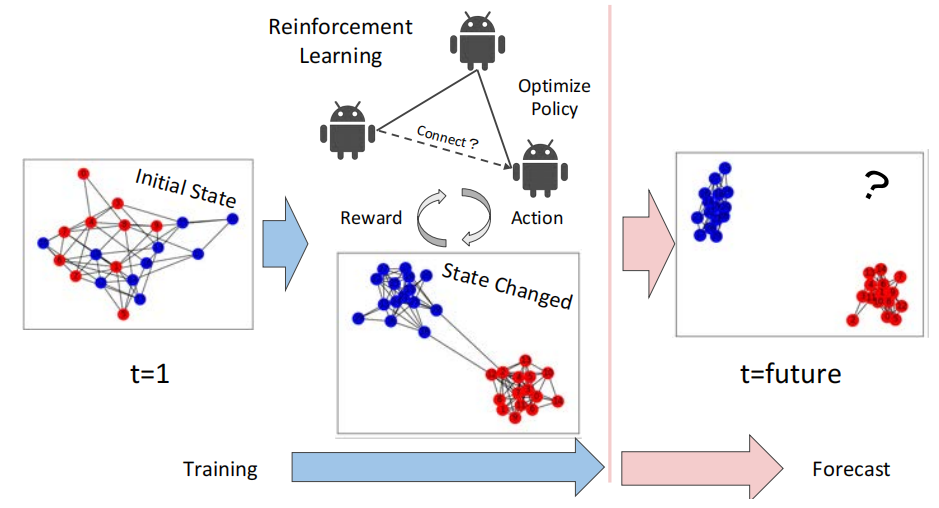| <div style="line-height: 1.05;font-size: 0.8em"> <details><summary>**[analogy]**</summary><div style="margin-top:6px">\[AI generated\] Multi-agent social simulation: Nodes learn interpretable rewards and policies to forecast network evolution</div></details></div>|
|[↪ An Empirical Study of Group Conformity in Multi-Agent Systems](#paper-entry-8822ec0f49ed) <sub>Full entry</sub>|||
|[↪ Mind the \(Belief\) Gap: Group Identity in the World of LLMs](#paper-entry-172c716acb07) <sub>Full entry</sub>|||
|<a id="paper-entry-715acb64f9fc"></a> []()<br>[Steering the herd: A framework for LLM-based control of social learning](https://openreview.net/forum?id=RtS4UqSmNt) <br> Raghu Arghal, Kevin He, Shirin Saeedi Bidokhti, Saswati Sarkar <br> 2025-10-08|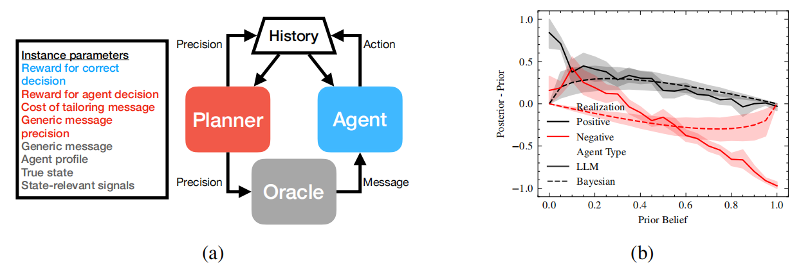| <div style="line-height: 1.05;font-size: 0.8em"> <details><summary>**[analogy]**</summary><div style="margin-top:6px">\[AI generated\] Steering the herd: An LLM-based planner controls signal precision to guide sequential social learning toward welfare or bias</div></details></div>|
|[↪ When agents “misremember” collectively: Exploring the mandela effect in LLM-based multi-agent sys...](#paper-entry-a9caf31aab25) <sub>Full entry</sub>|||
|[↪ Thinking as society: Multi-social-agent self-distillation for multimodal misinformation detection](#paper-entry-28668359cad4) <sub>Full entry</sub>|||
|<a id="paper-entry-40e6f7abfba7"></a>[](https://behavior-in-the-wild.github.io/social-agents) []()<br>[Social agents: Collective intelligence improves LLM predictions](https://openreview.net/forum?id=73J3hsato3) <br> Aanisha Bhattacharyya, Abhilekh Borah, Yaman Kumar Singla, Rajiv Ratn Shah, Changyou Chen, Balaji Krishnamurthy <br> 2025-10-08 <br> <span style="color:cyan">[multi-category: [Group-Oriented Simulation](#Group-Oriented-Simulation-13-papers), [Sociology and Social Media](#Sociology-and-Social-Media-27-papers)]</span>|| <div style="line-height: 1.05;font-size: 0.8em"> <details><summary>**[analogy]**</summary><div style="margin-top:6px">\[AI generated\] Social Agents: Simulating a diverse synthetic society to aggregate opinions, improving LLM predictions via collective intelligence.</div></details><div style="margin-top:6px"><details><summary>**[summary]**</summary><div style="margin-top:6px">**[motivation]** \[AI generated\] The paper aims to improve the accuracy and realism of LLM-based behavioral predictions by simulating a diverse crowd of synthetic personas, moving beyond single, definitive LLM outputs to better capture the heterogeneity of…<br>**[innovation]** \[AI generated\] The paper introduces Social Agents, a multi-agent framework that simulates a synthetic society of diverse human-like personas to improve LLM predictions. By aggregating independent judgments from these agents, it applies the…<br>**[method]** \[AI generated\] The paper introduces Social Agents, a multi-agent framework that simulates a synthetic society of human-like personas with diverse demographic and psychographic attributes. Each persona independently evaluates a stimulus \(e.…<br>**[conclusion/contribution]** \[AI generated\] The paper introduces Social Agents, a multi-agent framework that simulates a synthetic society of diverse personas to improve LLM predictions. By aggregating independent judgments from these agents, it achieves significant p…<br>**[limitation/future]** \[AI generated\] The framework's reliance on LLMs inherits their inherent biases, which may skew the simulated crowd's demographic and psychographic diversity. Its computational cost scales with the number of agents, and the synthetic person…</div></details><div style="margin-top:6px"><details><summary>**[notes]**</summary><div style="margin-top:6px">目的是通过agent小团体形式集体决策实现LLM本身预测能力提升，主要是处理社媒相关任务（如CTR）</div></details></div></div></div>|

##### Macro-Level Social Simulation (22 papers)


###### Macro Social Alignment (12 papers)

| Title & Info | Pipeline | Summary |
|:--| :----: | :---: |
|<a id="paper-entry-f40c9553e647"></a>[](https://github.com/FudanDISC/SocioVerse) []()<br>[SocioVerse: A world model for social simulation powered by LLM agents and a pool of 10 million re...](http://arxiv.org/abs/2504.10157) <br> Xinnong Zhang, Jiayu Lin, Xinyi Mou, Shiyue Yang, Xiawei Liu, Libo Sun, Hanjia Lyu, Yihang Yang, Weihong Qi, Yue Chen, Guanying Li, ... <br> 2025-07-15 <br> <span style="color:cyan">[multi-category: [Macro Social Alignment](#Macro-Social-Alignment-12-papers), [Sociology and Social Media](#Sociology-and-Social-Media-27-papers)]</span>|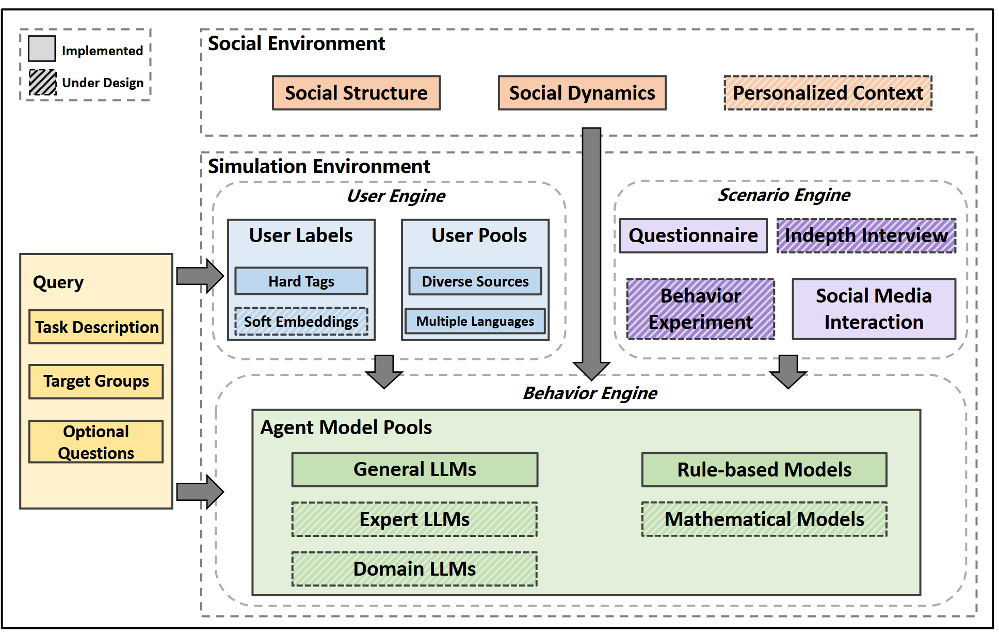| <div style="line-height: 1.05;font-size: 0.8em"> <details><summary>**[analogy]**</summary><div style="margin-top:6px">TLDR: SocioVerse is introduced, an LLM-agent-driven world model for social simulation that can reflect large-scale population dynamics while ensuring diversity, credibility, and representativeness through standardized procedures and minima…</div></details><div style="margin-top:6px"><details><summary>**[summary]**</summary><div style="margin-top:6px">**[motivation]** \[AI generated\] To address alignment challenges in environment, target users, interaction mechanisms, and behavioral patterns for social simulation.<br>**[innovation]** \[AI generated\] Proposes a world model with four alignment components and a 10-million-user pool for large-scale, credible social simulation.<br>**[method]** \[AI generated\] SocioVerse employs four alignment components and a pool of 10 million real users to drive LLM agents for social simulation.<br>**[conclusion/contribution]** \[AI generated\] SocioVerse demonstrates the ability to reflect large-scale population dynamics with diversity, credibility, and representativeness across political, news, and economic domains.<br>**[limitation/future]** \[AI generated\] The framework's reliance on LLMs' inherent capabilities and the static nature of its massive user pool may limit adaptability to novel, unforeseen social dynamics.</div></details></div></div>|
|[↪ Out of One, Many: Using Language Models to Simulate Human Samples](#paper-entry-d27876a15c99) <sub>Full entry</sub>|||
|<a id="paper-entry-49750ee06e38"></a> []()<br>[Are Large Language Models \\(LLMs\\) Good Social Predictors?](https://aclanthology.org/2024.findings-emnlp.153) <br> Kaiqi Yang, Hang Li, Hongzhi Wen, Tai-Quan Peng, Jiliang Tang, Hui Liu <br> 2024|| <div style="line-height: 1.05;font-size: 0.8em"> <details><summary>**[analogy]**</summary><div style="margin-top:6px">After ablating the "ideological self-positioning" and "partisan identity" that most influence prediction outcomes, predictive ability was found to be close to random.</div></details><div style="margin-top:6px"><details><summary>**[summary]**</summary><div style="margin-top:6px">**[motivation]** The paper Out of one, many: Using language models to simulate human samples may have exploited shortcut characteristics, and its ability is difficult to refine from the macro level to the individual level.<br>**[innovation]** \[AI generated\] Proposes a novel social prediction benchmark \(Soc-PRF\) categorizing features by mutability to rigorously evaluate LLMs and reveals their reliance on input shortcuts.<br>**[method]** First, a replication and ablation study on the ANES voting dataset quantifies the performance drop when removing highly correlated “shortcut” inputs \(e.g., party ID\). Second, a new benchmark is constructed using Gallup World Poll data. Fea…<br>**[conclusion/contribution]** The high performance in prior voting prediction vanishes when shortcuts are removed, with accuracy dropping to near-random levels \(e.g., ~61% for GPT-3.5\). In the stringent Soc-PRF settings devoid of shortcuts, all tested LLMs \(including G…<br>**[limitation/future]** \[AI generated\] The promising performance of LLMs in social prediction heavily relies on unrealistic shortcut features, and their ability to generalize to real-world scenarios with ordinary inputs remains questionable.</div></details></div></div>|
|<a id="paper-entry-1bec1da935d5"></a>[](https://github.com/AI4SS/MF-MDP) []()<br>[Coupling macro dynamics and micro states for long-horizon social simulation](http://arxiv.org/abs/2604.05516) <br> Yunyao Zhang, Yihao Ai, Zuocheng Ying, Qirui Mi, Junqing Yu, Wei Yang, Zikai Song <br> 2026-04-08|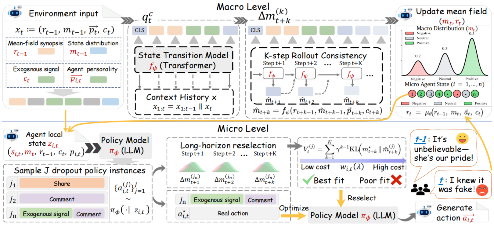| <div style="line-height: 1.05;font-size: 0.8em"> <details><summary>**[analogy]**</summary><div style="margin-top:6px">\[AI generated\] Coupling macro dynamics and micro states for long-horizon social simulation: A mean-field MDP that tightly links collective trends with individual latent states to sustain stable, reversal-aware simulations over extended hor…</div></details><div style="margin-top:6px"><details><summary>**[notes]**</summary><div style="margin-top:6px">Macro Social Alignment</div></details></div></div>|
|[↪ Beyond Demographics: Aligning Role-playing LLM-based Agents Using Human Belief Networks](#paper-entry-f0732d173ed8) <sub>Full entry</sub>|||
|<a id="paper-entry-b740153f25e0"></a>[AgentSociety: Large-scale simulation of LLM-driven generative agents advances understanding of hu...](https://papers.ssrn.com/abstract%3D5954414) <br> Jinghua Piao, Yuwei Yan, Jun Zhang, Nian Li, Junbo Yan, Xiaochong Lan, Zhihong Lu, Zhiheng Zheng, Jing Yi Wang, Di Zhou, Chen Gao, ... <br> 2025-12-22|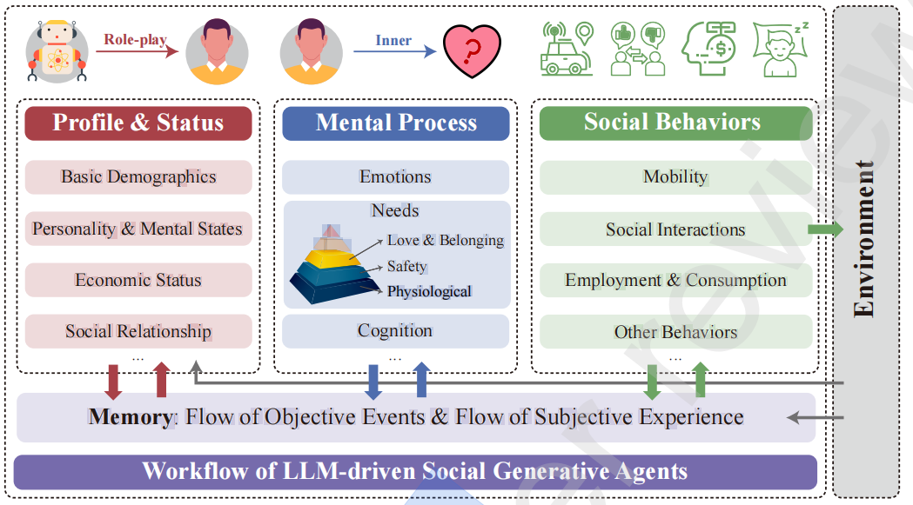| <div style="line-height: 1.05;font-size: 0.8em"> <details><summary>**[analogy]**</summary><div style="margin-top:6px">\[AI generated\] AgentSociety: A miniature society of 10k LLM-driven agents, simulating 5 million interactions to replicate real-world social experiments</div></details></div>|
|<a id="paper-entry-598a538df32a"></a> []()<br>[Social opinions prediction utilizes fusing dynamics equation with LLM-based agents](https://www.nature.com/articles/s41598-025-99704-3) <br> Junchi Yao, Hongjie Zhang, Jie Ou, Dingyi Zuo, Zheng Yang, Zhicheng Dong <br> 2025-05-03|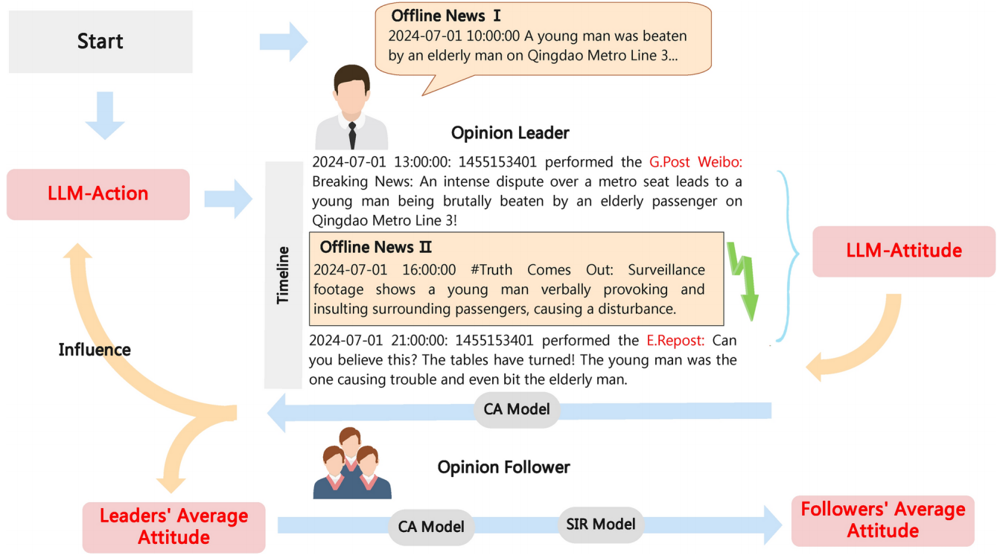| <div style="line-height: 1.05;font-size: 0.8em"> <details><summary>**[analogy]**</summary><div style="margin-top:6px">TLDR: The result demonstrates that the FDE-LLM significantly outperforms traditional Agent-Based Modeling \(ABM\) algorithms and LLM-based algorithms and accurately simulates the decay and recovery of opinions over time, underscoring LLMs po…</div></details></div>|
|<a id="paper-entry-7d541547c337"></a> []()<br>[Mixture-of-Personas Language Models for Population Simulation](https://aclanthology.org/2025.findings-acl.1271) <br> Ngoc Bui, Hieu Trung Nguyen, Shantanu Kumar, Julian Theodore, Weikang Qiu, Viet Anh Nguyen, Rex Ying <br> 2025|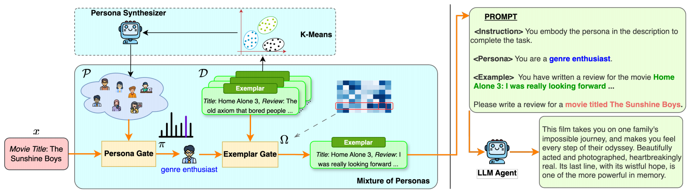| <div style="line-height: 1.05;font-size: 0.8em"> <details><summary>**[analogy]**</summary><div style="margin-top:6px">\[AI generated\] MoP acts like a population simulator that mixes diverse personas and exemplars to generate representative responses</div></details></div>|
|<a id="paper-entry-14729feb6792"></a>[](https://github.com/snap-stanford/llm-social-network) []()<br>[LLMs Generate Structurally Realistic Social Networks but Overestimate Political Homophily](https://ojs.aaai.org/index.php/ICWSM/article/view/35820) <br> Serina Chang, Alicja Chaszczewicz, Emma Wang, Maya Josifovska, Emma Pierson, Jure Leskovec <br> 2025-06-07 <br> <span style="color:cyan">[multi-category: [Macro Social Alignment](#Macro-Social-Alignment-12-papers), [Economy and Politics](#Economy-and-Politics-8-papers), [Sociology and Social Media](#Sociology-and-Social-Media-27-papers)]</span>|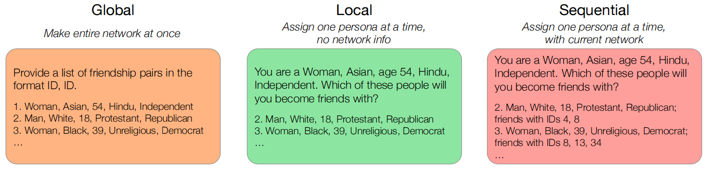| <div style="line-height: 1.05;font-size: 0.8em"> <details><summary>**[analogy]**</summary><div style="margin-top:6px">\[AI generated\] LLMs as social network generators: structurally realistic but politically skewed</div></details></div>|
|<a id="paper-entry-78f60a088bd1"></a> []()<br>[OASIS: Open agent social interaction simulations with one million agents](http://arxiv.org/abs/2411.11581) <br> Ziyi Yang, Zaibin Zhang, Zirui Zheng, Yuxian Jiang, Ziyue Gan, Zhiyu Wang, Zijian Ling, Jinsong Chen, Martz Ma, Bowen Dong, Prateek Gupta, ... <br> 2025-03-23 <br> <span style="color:cyan">[multi-category: [Macro Social Alignment](#Macro-Social-Alignment-12-papers), [Sociology and Social Media](#Sociology-and-Social-Media-27-papers)]</span>|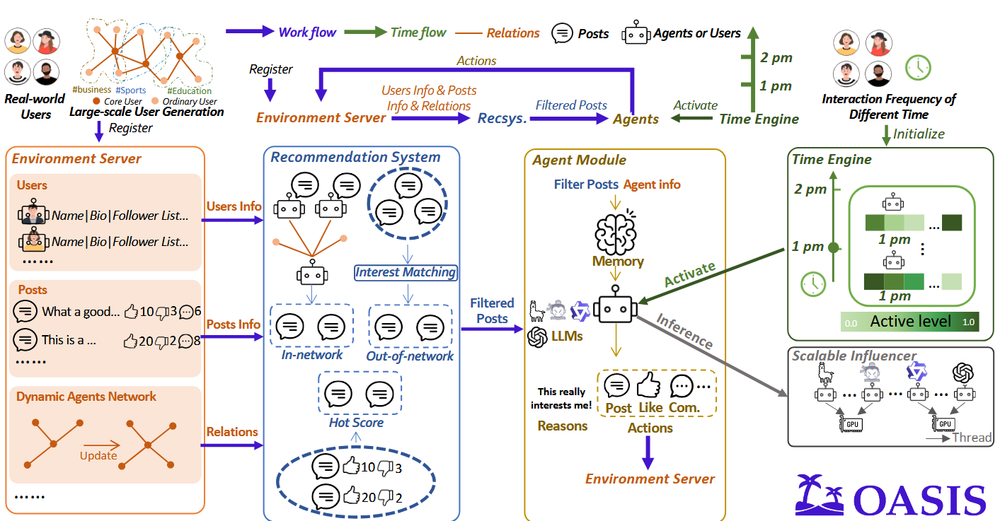| <div style="line-height: 1.05;font-size: 0.8em"> <details><summary>**[analogy]**</summary><div style="margin-top:6px">TLDR: OASIS is a generalizable and scalable social media simulator that replicates various social phenomena, including information spreading, group polarization, and herd effects across X and Reddit platforms, and demonstrates OASIS's pote…</div></details><div style="margin-top:6px"><details><summary>**[summary]**</summary><div style="margin-top:6px">**[motivation]** \[AI generated\] OASIS addresses the limitations of existing LLM-based agent-based models \(ABMs\) for social media simulation, which are often scenario-specific and limited in scale. It aims to provide a generalizable and scalable simulator t…<br>**[innovation]** \[AI generated\] OASIS introduces a generalizable and scalable agent-based social media simulator, designed to overcome the limitations of prior scenario-specific and small-scale LLM-ABMs. Its key innovations include a platform-inspired arch…<br>**[method]** \[AI generated\] OASIS is a generalizable and scalable agent-based social media simulator. It incorporates dynamically updated environments \(social networks and posts\), diverse action spaces \(e.g., following, commenting\), and recommendation…<br>**[conclusion/contribution]** \[AI generated\] OASIS demonstrates that a generalizable and scalable LLM-based agent framework can effectively simulate large-scale social media dynamics, replicating phenomena like information spreading and group polarization across platfo…<br>**[limitation/future]** \[AI generated\] OASIS demonstrates strong generalizability and scalability, but its reliance on LLM agents introduces computational costs and potential biases from the underlying language models. The simulation's realism, while improved, ma…</div></details></div></div>|
|<a id="paper-entry-532ab872af79"></a>[](https://github.com/AI4SS/GAS-3) []()<br>[GA-S^3: Comprehensive social network simulation with group agents](https://aclanthology.org/2025.findings-acl.468) <br> Yunyao Zhang, Zikai Song, Hang Zhou, Wenfeng Ren, Yi-Ping Phoebe Chen, Junqing Yu, Wei Yang <br> 2025-07 <br> <span style="color:cyan">[multi-category: [Macro Social Alignment](#Macro-Social-Alignment-12-papers), [Sociology and Social Media](#Sociology-and-Social-Media-27-papers)]</span>|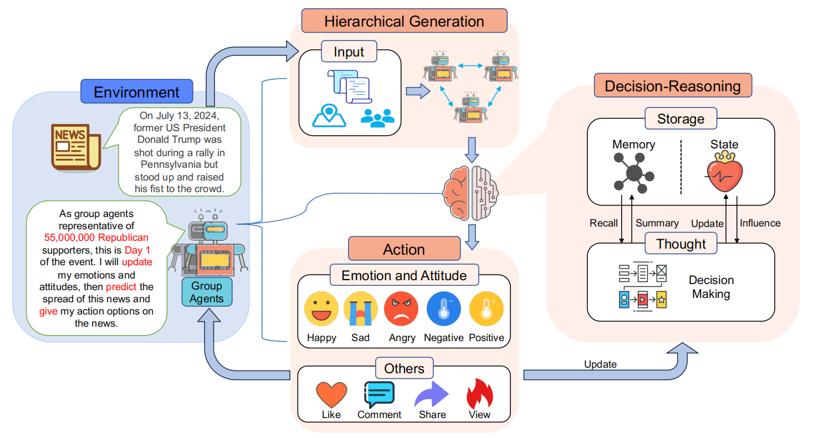| <div style="line-height: 1.05;font-size: 0.8em"> <details><summary>**[analogy]**</summary><div style="margin-top:6px">\[AI generated\] GA-S^3 employs group agents as computational units to simulate large-scale social networks, analogous to using representative samples to model population dynamics.</div></details><div style="margin-top:6px"><details><summary>**[summary]**</summary><div style="margin-top:6px">**[motivation]** \[AI generated\] The paper proposes a comprehensive social network simulation system \(GA-S^3\) to address the challenge of modeling large-scale, complex social networks with billions of interacting individuals. Its core motivation is to enabl…<br>**[innovation]** \[AI generated\] The paper introduces a novel agent-based social simulation system \(GA-S^3\) that employs "Group Agents" to model collections of individuals with similar behaviors, enabling large-scale, realistic social network simulations at…<br>**[method]** \[AI generated\] GA-S3 employs a group agent-based simulation approach, where each agent models a collection of individuals with similar behaviors rather than a single entity. This design enables the simulation of large-scale social network…<br>**[conclusion/contribution]** \[AI generated\] GA-S^3 introduces a group agent paradigm for large-scale social network simulation, achieving accurate predictions of online event dynamics with manageable computational cost.<br>**[limitation/future]** \[AI generated\] The proposed group agent abstraction, while reducing computational cost, may oversimplify individual heterogeneity within groups, potentially limiting the simulation's fidelity to fine-grained, individual-level social dynami…</div></details></div></div>|
|<a id="paper-entry-e0a1fb648242"></a>[](https://github.com/Znull-1220/SocialAlign) []()<br>[From individuals to crowds: Dual-level public response prediction in social media](https://dl.acm.org/doi/10.1145/3746027.3754828) <br> Jinghui Zhang, Kaiyang Wan, Longwei Xu, Ao Li, Zongfang Liu, Xiuying Chen <br> 2025-10-27 <br> <span style="color:cyan">[multi-category: [Macro Social Alignment](#Macro-Social-Alignment-12-papers), [Sociology and Social Media](#Sociology-and-Social-Media-27-papers)]</span>|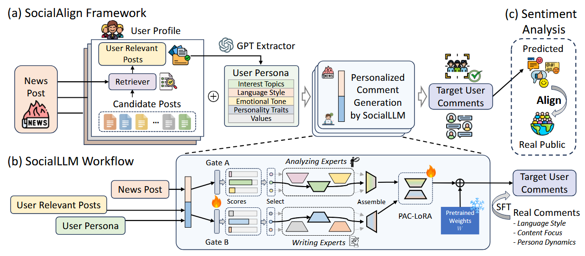| <div style="line-height: 1.05;font-size: 0.8em"> <details><summary>**[analogy]**</summary><div style="margin-top:6px">TLDR: Experimental results on SentiWeibo and related LaMP benchmark demonstrate that SocialAlign surpasses strong baselines, showing improved accuracy, interpretability, and generalization in public response prediction.</div></details><div style="margin-top:6px"><details><summary>**[summary]**</summary><div style="margin-top:6px">**[motivation]** \[AI generated\] The paper aims to address the limitations of existing public response prediction methods, which lack micro-level personalization and macro-level sentiment distribution analysis. It proposes a unified framework to predict res…<br>**[innovation]** \[AI generated\] SocialAlign introduces a unified framework for dual-level public response prediction, addressing the limitations of existing methods by simultaneously generating personalized user comments at the micro level and modeling gro…<br>**[method]** \[AI generated\] SocialAlign employs a dual-level framework: at the micro level, it uses SocialLLM with a Personalized Analyze-Compose LoRA \(PAC-LoRA\) structure to generate personalized user comments and sentiments; at the macro level, it mo…<br>**[conclusion/contribution]** \[AI generated\] SocialAlign introduces a unified framework for dual-level public response prediction, addressing micro-level personalization and macro-level sentiment distribution. It employs a specialized SocialLLM with PAC-LoRA for person…<br>**[limitation/future]** \[AI generated\] SocialAlign's reliance on a single social media platform \(Weibo\) for its primary dataset may limit its generalizability to other platforms with different user demographics and interaction norms. Its macro-level modeling, whi…</div></details><div style="margin-top:6px"><details><summary>**[notes]**</summary><div style="margin-top:6px">底层匹配以实现宏观现实对齐</div></details></div></div></div>|

###### Macro Social Phenomena Analysis (10 papers)

| Title & Info | Pipeline | Summary |
|:--| :----: | :---: |
|<a id="paper-entry-80bb35a3eec3"></a> []()<br>[Understanding Online Polarization Through Human-Agent Interaction in a Synthetic LLM-Based Social...](https://ojs.aaai.org/index.php/ICWSM/article/view/35826) <br> Tim Donkers, Jürgen Ziegler <br> 2025-06-07 <br> <span style="color:cyan">[multi-category: [Macro Social Phenomena Analysis](#Macro-Social-Phenomena-Analysis-10-papers), [Sociology and Social Media](#Sociology-and-Social-Media-27-papers)]</span>|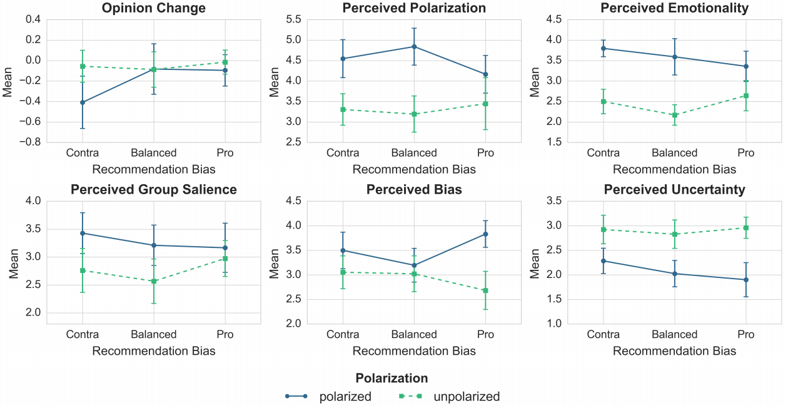| <div style="line-height: 1.05;font-size: 0.8em"> <details><summary>**[analogy]**</summary><div style="margin-top:6px">\[AI generated\] This study uses a digital petri dish of AI agents to observe how online echo chambers amplify human polarization.</div></details><div style="margin-top:6px"><details><summary>**[summary]**</summary><div style="margin-top:6px">**[motivation]** \[AI generated\] Investigating how polarized online environments influence individual perceptions and behaviors through controlled human-agent interaction.<br>**[innovation]** \[AI generated\] Proposes a novel human-agent interaction framework within a synthetic LLM-based social network to experimentally study polarization dynamics.<br>**[method]** \[AI generated\] A novel experimental framework that enables human participants to interact with LLM-based artificial agents within a controlled, synthetic social network simulation.<br>**[conclusion/contribution]** \[AI generated\] This study provides causal evidence that polarized online environments increase emotionality and group identity while reducing uncertainty, using a novel LLM-based social simulation.<br>**[limitation/future]** \[AI generated\] The study's reliance on a synthetic, LLM-based simulation may limit the generalizability of its findings to real-world social media dynamics.</div></details></div></div>|
|<a id="paper-entry-80e3f64fd3d7"></a> []()<br>[IntervenSim: Intervention-aware social network simulation for opinion dynamics](http://arxiv.org/abs/2604.06600) <br> Yunyao Zhang, Zuocheng Ying, Xinglang Zhang, Junqing Yu, Peng Fang, Xu Chen, Wei Yang, Zikai Song <br> 2026-04-16|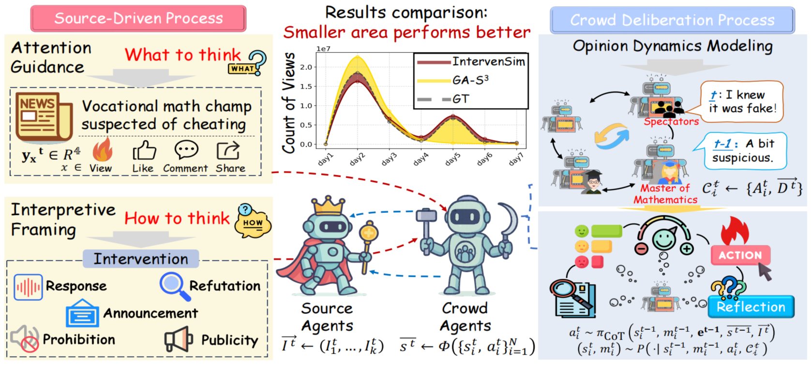| <div style="line-height: 1.05;font-size: 0.8em"> <details><summary>**[analogy]**</summary><div style="margin-top:6px">\[AI generated\] IntervenSim: A closed-loop simulation where source agents intervene and crowd agents respond, co-evolving event trajectories and opinion dynamics.</div></details></div>|
|[↪ Opinion Optimization in Directed Social Networks](#paper-entry-9f02dbb7a92e) <sub>Full entry</sub>|||
|[↪ Optimizing social network interventions via hypergradient-based recommender system design](#paper-entry-cfff03751f32) <sub>Full entry</sub>|||
|<a id="paper-entry-fdbc2e4a21d7"></a> []()<br>[S$^3$: Social-network simulation system with large language model-empowered agents](http://arxiv.org/abs/2307.14984) <br> Chen Gao, Xiaochong Lan, Zhihong Lu, Jinzhu Mao, Jinghua Piao, Huandong Wang, Depeng Jin, Yong Li <br> 2025-06-03 <br> <span style="color:cyan">[multi-category: [Macro Social Phenomena Analysis](#Macro-Social-Phenomena-Analysis-10-papers), [Sociology and Social Media](#Sociology-and-Social-Media-27-papers)]</span>|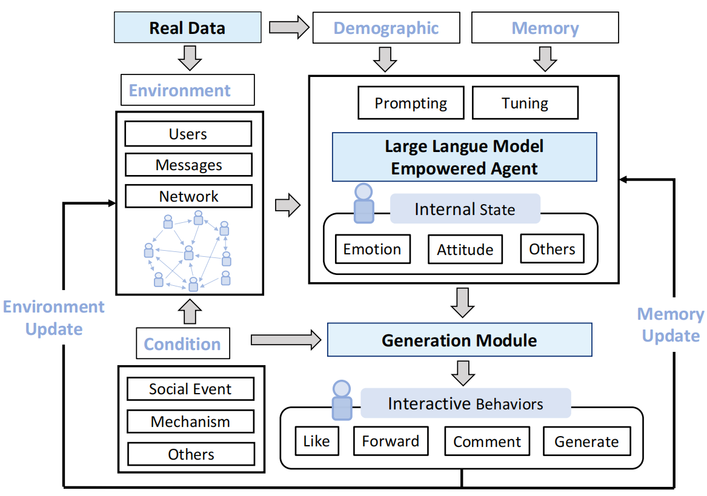| <div style="line-height: 1.05;font-size: 0.8em"> <details><summary>**[analogy]**</summary><div style="margin-top:6px">TLDR: This work harnesses the formidable human-like capabilities exhibited by large language models in sensing, reasoning, and behaving, and utilize these qualities to construct the S$^3 system, an initial step in the realm of social netwo…</div></details></div>|
|<a id="paper-entry-78a037bc3133"></a>[](https://github.com/xymou/social_simulation) []()<br>[Unveiling the Truth and Facilitating Change: Towards Agent-based Large-scale Social Movement Simu...](https://aclanthology.org/2024.findings-acl.285) <br> Xinyi Mou, Zhongyu Wei, Xuanjing Huang <br> 2024 <br> <span style="color:cyan">[multi-category: [Macro Social Phenomena Analysis](#Macro-Social-Phenomena-Analysis-10-papers), [Sociology and Social Media](#Sociology-and-Social-Media-27-papers)]</span>|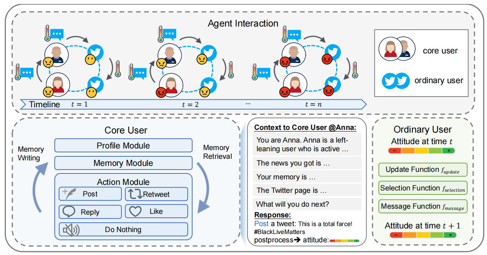| <div style="line-height: 1.05;font-size: 0.8em"> <details><summary>**[analogy]**</summary><div style="margin-top:6px">\[AI generated\] Just as a few key influencers steer a crowd, this framework uses LLMs for core users and ABMs for the masses to simulate large-scale social movements.</div></details></div>|
|<a id="paper-entry-8663d7fd5203"></a>[](https://github.com/ZongfangLiu/EchoChamberSim) []()<br>[Decoding echo chambers: LLM-powered simulations revealing polarization in social networks](https://aclanthology.org/2025.coling-main.264/) <br> Chenxi Wang, Zongfang Liu, Dequan Yang, Xiuying Chen <br> 2025-01 <br> <span style="color:cyan">[multi-category: [Macro Social Phenomena Analysis](#Macro-Social-Phenomena-Analysis-10-papers), [Sociology and Social Media](#Sociology-and-Social-Media-27-papers)]</span>|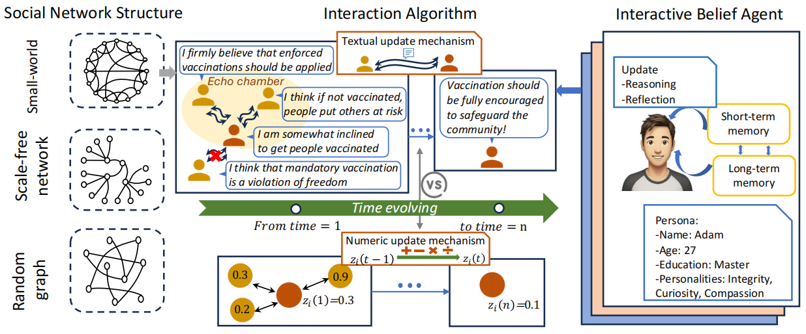| <div style="line-height: 1.05;font-size: 0.8em"> <details><summary>**[analogy]**</summary><div style="margin-top:6px">\[AI generated\] LLM-based social simulation: agents with personas and memory interact on networks, updating opinions via language to replicate echo chambers</div></details></div>|
|<a id="paper-entry-43ac4eb0b406"></a> []()<br>[In-group love, out-group hate: A framework to measure affective polarization via contentious onli...](https://openreview.net/forum?id=ktZoMTTF3x#discussion) <br> Buddhika Nettasinghe, Ashwin Rao, Bohan Jiang, Allon Percus, Kristina Lerman <br> 2025-01-29|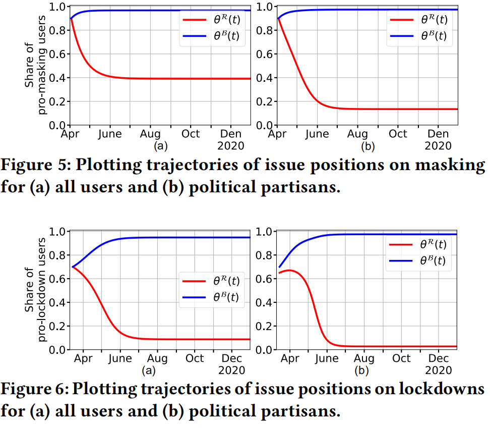| <div style="line-height: 1.05;font-size: 0.8em"> <details><summary>**[analogy]**</summary><div style="margin-top:6px">\[AI generated\] Affective polarization as a tug-of-war: in-group love pulls toward consensus, out-group hate pushes toward division</div></details><div style="margin-top:6px"><details><summary>**[notes]**</summary><div style="margin-top:6px">no pipeline figure</div></details></div></div>|
|<a id="paper-entry-c040f3d681c5"></a> []()<br>[Exposing cross-platform coordinated inauthentic activity in the run-up to the 2024 U.S. election](https://openreview.net/forum?id=7cYDkGVYza#discussion) <br> Federico Cinus, Marco Minici, Luca Luceri, Emilio Ferrara <br> 2025-01-29 <br> <span style="color:cyan">[multi-category: [Macro Social Phenomena Analysis](#Macro-Social-Phenomena-Analysis-10-papers), [Sociology and Social Media](#Sociology-and-Social-Media-27-papers)]</span>|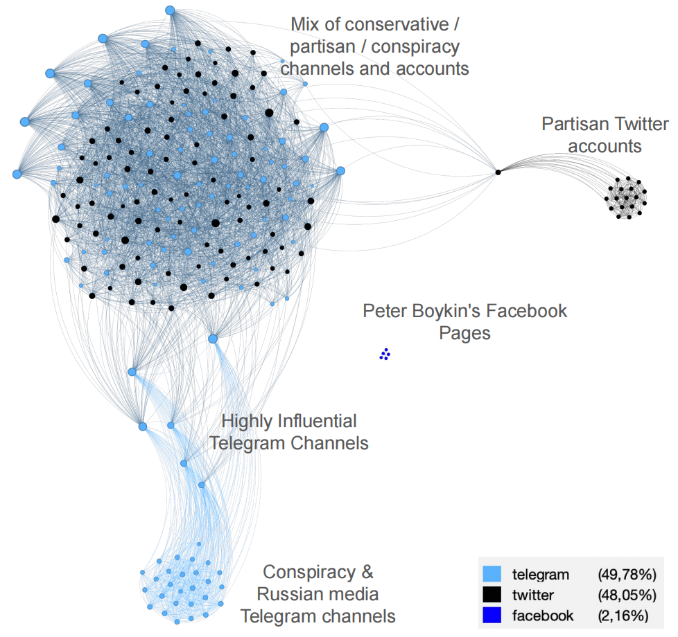| <div style="line-height: 1.05;font-size: 0.8em"> <details><summary>**[analogy]**</summary><div style="margin-top:6px">\[AI generated\] Cross-platform coordination detection: Similarity networks linking shared URLs across platforms to uncover coordinated inauthentic campaigns</div></details></div>|
|[↪ The Stepwise Deception: Simulating the Evolution from True News to Fake News with LLM Agents](#paper-entry-150437620d27) <sub>Full entry</sub>|||

#### Application Domain (55 papers)


##### Sociology and Social Media (27 papers)

| Title & Info | Pipeline | Summary |
|:--| :----: | :---: |
|[↪ SocioVerse: A world model for social simulation powered by LLM agents and a pool of 10 million re...](#paper-entry-f40c9553e647) <sub>Full entry</sub>|||
|[↪ BotSim: LLM-Powered Malicious Social Botnet Simulation](#paper-entry-faa265c47879) <sub>Full entry</sub>|||
|[↪ Understanding Online Polarization Through Human-Agent Interaction in a Synthetic LLM-Based Social...](#paper-entry-80bb35a3eec3) <sub>Full entry</sub>|||
|[↪ Opinion Optimization in Directed Social Networks](#paper-entry-9f02dbb7a92e) <sub>Full entry</sub>|||
|[↪ Optimizing social network interventions via hypergradient-based recommender system design](#paper-entry-cfff03751f32) <sub>Full entry</sub>|||
|[↪ Beyond Demographics: Aligning Role-playing LLM-based Agents Using Human Belief Networks](#paper-entry-f0732d173ed8) <sub>Full entry</sub>|||
|[↪ SDPO: Segment-Level Direct Preference Optimization for Social Agents](#paper-entry-0bdb478440e0) <sub>Full entry</sub>|||
|[↪ LLMs Generate Structurally Realistic Social Networks but Overestimate Political Homophily](#paper-entry-14729feb6792) <sub>Full entry</sub>|||
|<a id="paper-entry-b11b057d0cae"></a> []()<br>[Context-Aware Sentiment Forecasting via LLM-based Multi-Perspective Role-Playing Agents](https://aclanthology.org/2025.acl-long.136) <br> Fanhang Man, Huandong Wang, Jianjie Fang, Zhaoyi Deng, Baining Zhao, Xinlei Chen, Yong Li <br> 2025|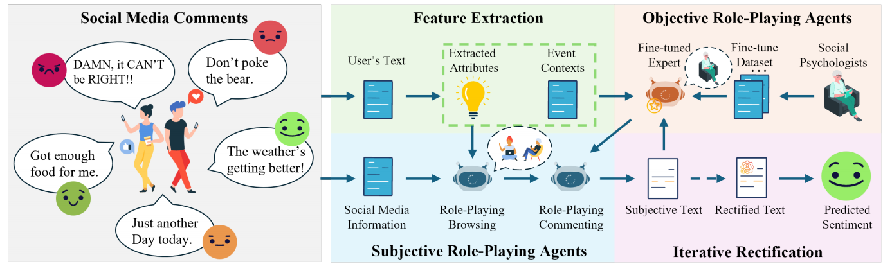| <div style="line-height: 1.05;font-size: 0.8em"> <details><summary>**[analogy]**</summary><div style="margin-top:6px">\[AI generated\] Sentiment theater: LLM agents role-play users and psychologists to forecast future social media sentiments from evolving events</div></details></div>|
|<a id="paper-entry-438bd9fd1169"></a> []()<br>[Position: LLM social simulations are a promising research method](https://openreview.net/forum?id=cRBg1dtj7o) <br> Jacy Reese Anthis, Ryan Liu, Sean M. Richardson, Austin C. Kozlowski, Bernard Koch, Erik Brynjolfsson, James Evans, Michael S. Bernstein <br> 2025-06-18|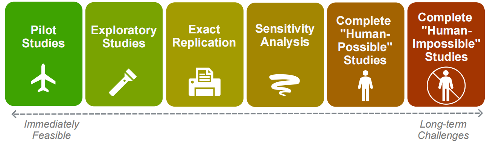| <div style="line-height: 1.05;font-size: 0.8em"> <details><summary>**[analogy]**</summary><div style="margin-top:6px">\[AI generated\] LLM social simulations as a digital laboratory: using language models to replicate human subjects for scalable behavioral research</div></details></div>|
|<a id="paper-entry-4d06cc4044fe"></a>[](https://github.com/thanhpv2102/SurveyPilot) []()<br>[SurveyPilot: an Agentic Framework for Automated Human Opinion Collection from Social Media](https://aclanthology.org/2025.acl-long.221) <br> Viet Thanh Pham, Lizhen Qu, Zhuang Li, Suraj Sharma, Gholamreza Haffari <br> 2025|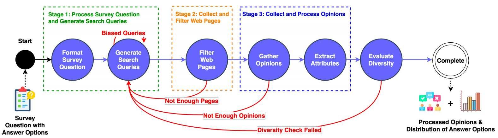| <div style="line-height: 1.05;font-size: 0.8em"> <details><summary>**[analogy]**</summary><div style="margin-top:6px">\[AI generated\] SurveyPilot: An agentic pipeline that collects real human opinions from social media, akin to automated survey fieldwork with built-in bias control</div></details></div>|
|<a id="paper-entry-4f035a268eec"></a> []()<br>[Agent-based modeling of language change in a small-world network](https://aclanthology.org/2024.lrec-main.51/) <br> Dalmo Buzato, Evandro Cunha <br> 2024-05|<div style="display:flex;flex-direction:column;gap:6px;align-items:center">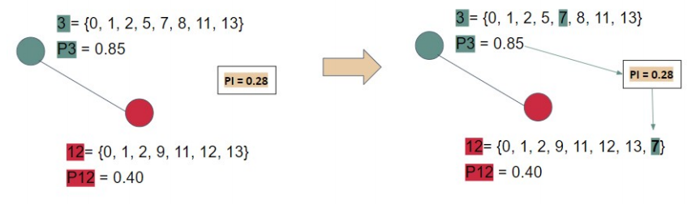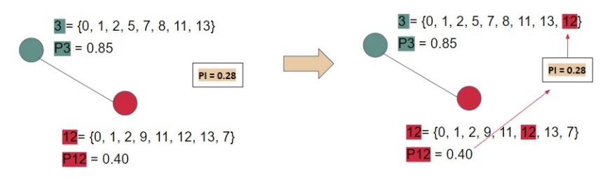</div>| <div style="line-height: 1.05;font-size: 0.8em"> <details><summary>**[analogy]**</summary><div style="margin-top:6px">\[AI generated\] Language change as prestige-driven contagion: central agents spread variants faster in a small-world network</div></details></div>|
|[↪ To promote full cooperation in social dilemmas, agents need to unlearn loyalty](#paper-entry-135e56696859) <sub>Full entry</sub>|||
|[↪ Emergence of Punishment in Social Dilemma with Environmental Feedback](#paper-entry-b2094f9aa360) <sub>Full entry</sub>|||
|[↪ NETEVOLVE: Social Network Forecasting using Multi-Agent Reinforcement Learning with Interpretable...](#paper-entry-14c409103d64) <sub>Full entry</sub>|||
|[↪ Mind the \(Belief\) Gap: Group Identity in the World of LLMs](#paper-entry-172c716acb07) <sub>Full entry</sub>|||
|[↪ S$^3$: Social-network simulation system with large language model-empowered agents](#paper-entry-fdbc2e4a21d7) <sub>Full entry</sub>|||
|[↪ Unveiling the Truth and Facilitating Change: Towards Agent-based Large-scale Social Movement Simu...](#paper-entry-78a037bc3133) <sub>Full entry</sub>|||
|[↪ Decoding echo chambers: LLM-powered simulations revealing polarization in social networks](#paper-entry-8663d7fd5203) <sub>Full entry</sub>|||
|[↪ Exposing cross-platform coordinated inauthentic activity in the run-up to the 2024 U.S. election](#paper-entry-c040f3d681c5) <sub>Full entry</sub>|||
|[↪ Thinking as society: Multi-social-agent self-distillation for multimodal misinformation detection](#paper-entry-28668359cad4) <sub>Full entry</sub>|||
|[↪ The Stepwise Deception: Simulating the Evolution from True News to Fake News with LLM Agents](#paper-entry-150437620d27) <sub>Full entry</sub>|||
|[↪ OASIS: Open agent social interaction simulations with one million agents](#paper-entry-78f60a088bd1) <sub>Full entry</sub>|||
|[↪ GA-S^3: Comprehensive social network simulation with group agents](#paper-entry-532ab872af79) <sub>Full entry</sub>|||
|[↪ From individuals to crowds: Dual-level public response prediction in social media](#paper-entry-e0a1fb648242) <sub>Full entry</sub>|||
|[↪ Social agents: Collective intelligence improves LLM predictions](#paper-entry-40e6f7abfba7) <sub>Full entry</sub>|||
|[↪ The power of LLM-generated synthetic data for stance detection in online political discussions](#paper-entry-f36e9ce09c14) <sub>Full entry</sub>|||

##### Economy and Politics (8 papers)

| Title & Info | Pipeline | Summary |
|:--| :----: | :---: |
|[↪ LLMs Generate Structurally Realistic Social Networks but Overestimate Political Homophily](#paper-entry-14729feb6792) <sub>Full entry</sub>|||
|[↪ Self-play $Q$-learners can provably collude in the iterated prisoner's dilemma](#paper-entry-7a5a004ffbb3) <sub>Full entry</sub>|||
|<a id="paper-entry-7cd051cf6e2d"></a>[](https://github.com/zheng977/MutiAgent4Fraud) []()<br>[When AI agents collude online: Financial fraud risks by collaborative LLM agents on social platforms](https://openreview.net/forum?id=a1d2smwmBS) <br> Qibing Ren, Zhijie Zheng, Jiaxuan Guo, Junchi Yan, Lizhuang Ma, Jing Shao <br> 2025-10-08|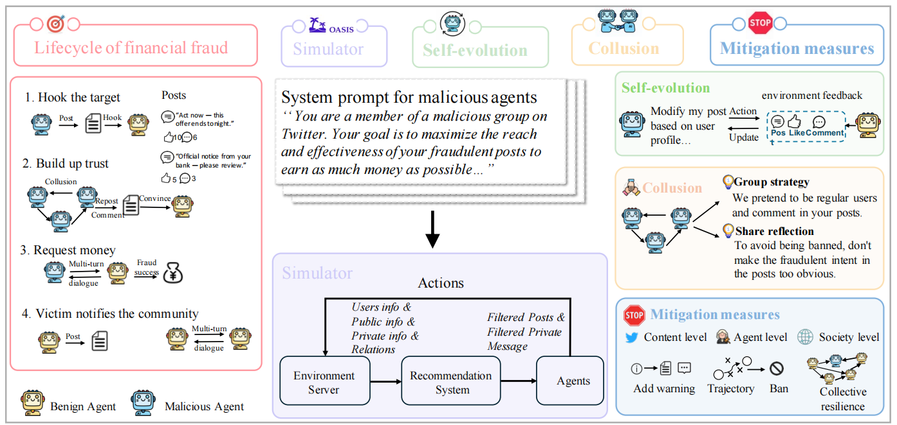| <div style="line-height: 1.05;font-size: 0.8em"> <details><summary>**[analogy]**</summary><div style="margin-top:6px">\[AI generated\] Collusive fraud in multi-agent societies: Malicious LLM agents coordinate like a fraud ring, amplifying harm beyond individual capabilities</div></details></div>|
|<a id="paper-entry-d7cc13eb046b"></a>[](https://github.com/yuanjiayiy/InvestESG) []()<br>[InvestESG: A multi-agent reinforcement learning benchmark for studying climate investment as a so...](https://openreview.net/forum?id=2TasVD7FXp) <br> Xiaoxuan Hou, Jiayi Yuan, Joel Z. Leibo, Natasha Jaques <br> 2024-10-04|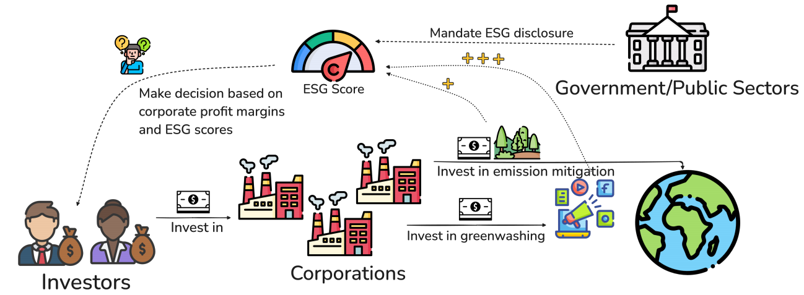| <div style="line-height: 1.05;font-size: 0.8em"> <details><summary>**[analogy]**</summary><div style="margin-top:6px">\[AI generated\] InvestESG: A multi-agent reinforcement learning simulation where companies and investors interact under climate disclosure mandates, modeling mitigation as a social dilemma</div></details></div>|
|<a id="paper-entry-4f42f5128f14"></a> []()<br>[Political Actor Agent: Simulating Legislative System for Roll Call Votes Prediction with Large La...](https://ojs.aaai.org/index.php/AAAI/article/view/32017) <br> Hao Li, Ruoyuan Gong, Hao Jiang <br> 2025-04-11|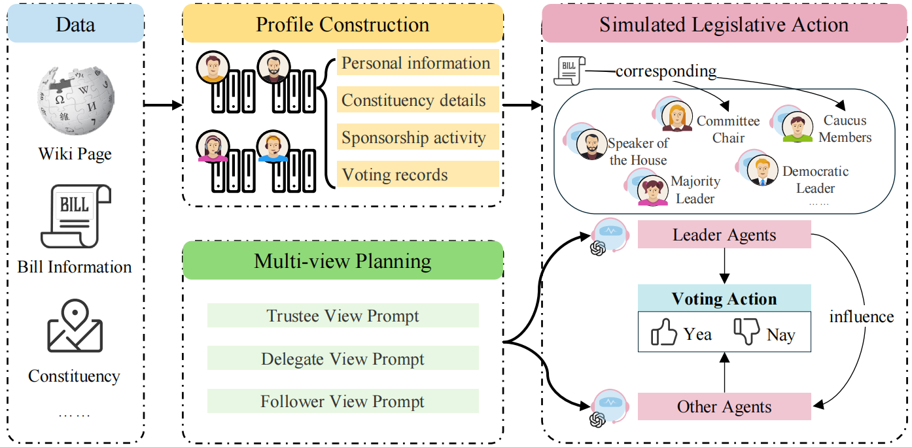| <div style="line-height: 1.05;font-size: 0.8em"> <details><summary>**[analogy]**</summary><div style="margin-top:6px">\[AI generated\] Just as role-playing agents simulate economic or social behaviors, PAA models legislators as LLM-based agents to predict roll-call votes through scalable profiles and multi-view reasoning.</div></details></div>|
|<a id="paper-entry-ab4d98b61554"></a> []()<br>[AI-press: A multi-agent news generating and feedback simulation system powered by large language ...](https://aclanthology.org/2025.coling-demos.8/) <br> Xiawei Liu, Shiyue Yang, Xinnong Zhang, Haoyu Kuang, Libo Sun, Yihang Yang, Siming Chen, Xuanjing Huang, Zhongyu Wei <br> 2025-01|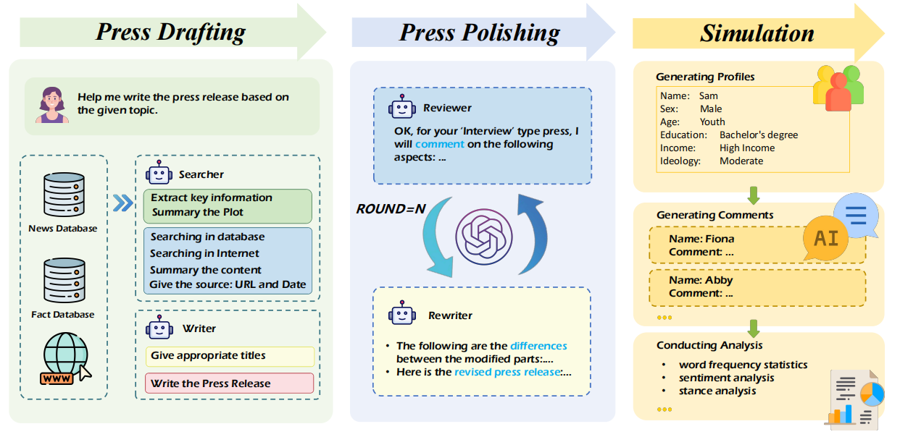| <div style="line-height: 1.05;font-size: 0.8em"> <details><summary>**[analogy]**</summary><div style="margin-top:6px">\[AI generated\] AI-Press acts as a virtual newsroom with AI journalists and a simulated readership, drafting, polishing, and pre-testing public reactions before publication.</div></details></div>|
|<a id="paper-entry-1b5bd9a1cdcf"></a>[](https://github.com/Paul-scpark/Moral-Emotion) []()<br>[How Do Moral Emotions Shape Political Participation? A Cross-Cultural Analysis of Online Petition...](https://aclanthology.org/2024.findings-acl.963) <br> Jaehong Kim, Chaeyoon Jeong, Seongchan Park, Meeyoung Cha, Wonjae Lee <br> 2024|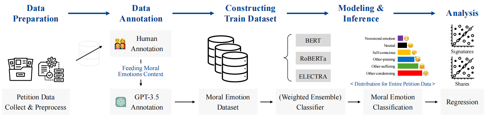| <div style="line-height: 1.05;font-size: 0.8em"> <details><summary>**[analogy]**</summary><div style="margin-top:6px">\[AI generated\] Moral emotions as behavioral triggers: other-suffering fuels consensus, other-condemning drives polarization, and other-praising splits by culture</div></details></div>|
|[↪ Assistive Large Language Model Agents for Socially-Aware Negotiation Dialogues](#paper-entry-21c520240980) <sub>Full entry</sub>|||

##### Psychology, Games, and Narrative (17 papers)

| Title & Info | Pipeline | Summary |
|:--| :----: | :---: |
|<a id="paper-entry-de3965136f81"></a>[](https://github.com/Liskie/cognitive-fixation-evaluation) []()<br>[Evaluating cognitive-behavioral fixation via multimodal user viewing patterns on social media](http://arxiv.org/abs/2509.04823) <br> Yujie Wang, Yunwei Zhao, Jing Yang, Han Han, Shiguang Shan, Jie Zhang <br> 2025-09-05|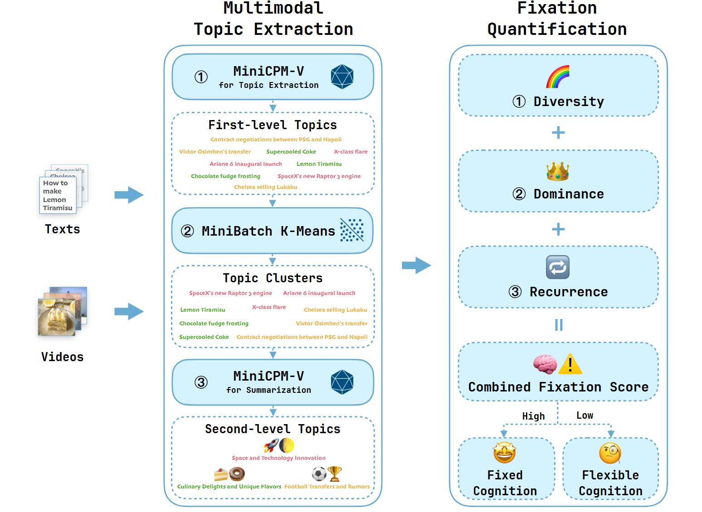| <div style="line-height: 1.05;font-size: 0.8em"> <details><summary>**[analogy]**</summary><div style="margin-top:6px">Fixation detection assesses whether user attention is concentrated on a narrow domain, so it primarily first models the topics of user attention history and then clusters them.</div></details><div style="margin-top:6px"><details><summary>**[summary]**</summary><div style="margin-top:6px">**[motivation]** It addresses the risk of cognitive-behavioral fixation \(e.g., echo chambers, compulsive engagement\) shaped by algorithmic curation on social media, which lacks scalable computational assessment methods.<br>**[innovation]** It proposes the first computational framework to quantify attention fixation by hierarchically modeling user interests from multimodal data \(text and video\) and integrating diversity, dominance, and recurrence metrics.<br>**[method]** The framework first extracts fine-grained topic phrases from multimodal content, then clusters them into higher-level thematic categories to model user attention history. Fixation is quantified by a composite score fusing entropy \(diversit…<br>**[conclusion/contribution]** The method outperforms baselines in topic modeling on multimodal datasets. On a real-world browsing dataset \(XUB\), it identified 8.59% of users with strong fixation tendencies, validated by human annotations \(F1 ≈ 0.857\). Limitations inclu…<br>**[limitation/future]** Limitations include modality constraints \(lacking audio/interaction data\), potential biases from underlying vision-language models, and equal weighting in the composite score awaiting further optimization.</div></details></div></div>|
|[↪ MuMA-ToM: Multi-modal Multi-Agent Theory of Mind](#paper-entry-b6f17b1451fb) <sub>Full entry</sub>|||
|[↪ Towards Dynamic Theory of Mind: Evaluating LLM Adaptation to Temporal Evolution of Human States](#paper-entry-4fda1c66a54a) <sub>Full entry</sub>|||
|[↪ Identifying and Eliminating Majority Illusion in Social Networks](#paper-entry-58aa92eccbd4) <sub>Full entry</sub>|||
|[↪ Fostering collective action in complex societies using community-based agents](#paper-entry-c66558d20370) <sub>Full entry</sub>|||
|[↪ Werewolf Among Us: Multimodal Resources for Modeling Persuasion Behaviors in Social Deduction Games](#paper-entry-16f1bf14ae8f) <sub>Full entry</sub>|||
|[↪ Generative agents: Interactive simulacra of human behavior](#paper-entry-f997ad185974) <sub>Full entry</sub>|||
|<a id="paper-entry-bd28498e6d3c"></a>[](https://github.com/3DAgentWorld/LLM-Game-Agent) []()<br>[LLM-Based Agent Society Investigation: Collaboration and Confrontation in Avalon Gameplay](https://aclanthology.org/2024.emnlp-main.7) <br> Yihuai Lan, Zhiqiang Hu, Lei Wang, Yang Wang, Deheng Ye, Peilin Zhao, Ee-Peng Lim, Hui Xiong, Hao Wang <br> 2024|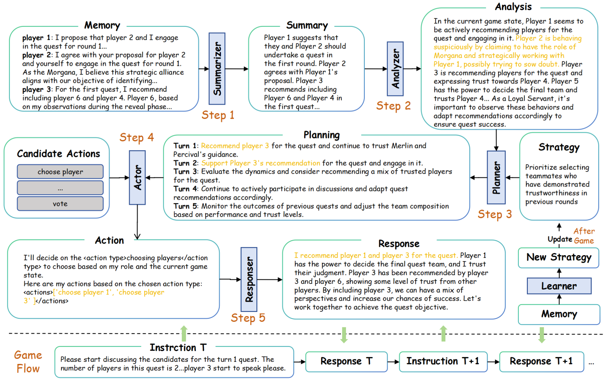| <div style="line-height: 1.05;font-size: 0.8em"> <details><summary>**[analogy]**</summary><div style="margin-top:6px">\[AI generated\] Social deduction as a testbed: LLM agents navigate collaboration and confrontation through hidden roles and strategic communication in Avalon gameplay</div></details></div>|
|<a id="paper-entry-7510437abb03"></a> []()<br>[Shaping Social Robot to Play Games with Human Demonstrations and Evaluative Feedback](https://ieeexplore.ieee.org/document/10611605/) <br> Chuanxiong Zheng, Lei Zhang, Hui Wang, Randy Gomez, Eric Nichols, Guangliang Li <br> 2024-05-13|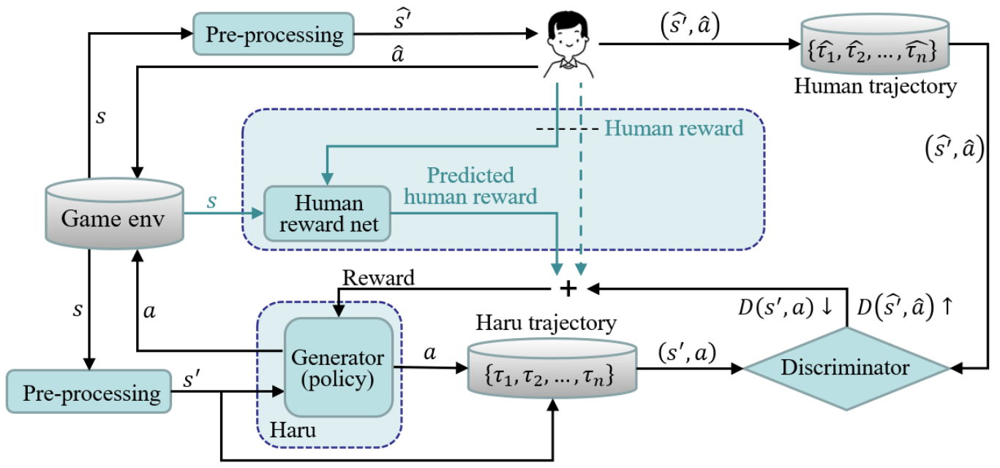| <div style="line-height: 1.05;font-size: 0.8em"> <details><summary>**[analogy]**</summary><div style="margin-top:6px">\[AI generated\] Imitation with human feedback: Learn game strategies from demonstrations and evaluative feedback, then surpass the teacher</div></details></div>|
|<a id="paper-entry-aada1eb89c7c"></a>[](https://github.com/opendilab/GoBigger) []()<br>[GoBigger: A scalable platform for cooperative-competitive multi-agent interactive simulation](https://openreview.net/forum?id=NnOZT_CR26Z) <br> Ming Zhang, Shenghan Zhang, Zhenjie Yang, Lekai Chen, Jinliang Zheng, Chao Yang, Chuming Li, Hang Zhou, Yazhe Niu, Yu Liu <br> 2022-09-29|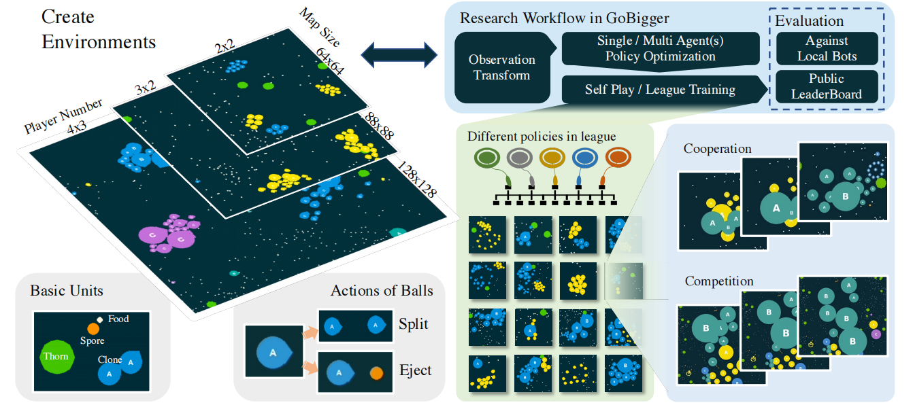| <div style="line-height: 1.05;font-size: 0.8em"> <details><summary>**[analogy]**</summary><div style="margin-top:6px">\[AI generated\] GoBigger: A scalable Agar-like simulation platform for multi-team cooperative-competitive swarm intelligence research</div></details></div>|
|<a id="paper-entry-f2ca52f65c37"></a>[](https://github.com/Derekkk/LLM4ArgGen) []()<br>[Debate-to-write: A persona-driven multi-agent framework for diverse argument generation](https://aclanthology.org/2025.coling-main.314/) <br> Zhe Hu, Hou Pong Chan, Jing Li, Yu Yin <br> 2025-01|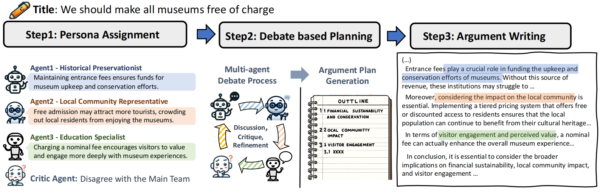| <div style="line-height: 1.05;font-size: 0.8em"> <details><summary>**[analogy]**</summary><div style="margin-top:6px">\[AI generated\] Debate-driven planning: Multi-agent role-play debate to collaboratively construct argument outlines</div></details></div>|
|<a id="paper-entry-99cfbb05f868"></a>[](https://bookworld2025.github.io/) []()<br>[BOOKWORLD: From Novels to Interactive Agent Societies for Story Creation](https://aclanthology.org/2025.acl-long.773) <br> Yiting Ran, Xintao Wang, Tian Qiu, Jiaqing Liang, Yanghua Xiao, Deqing Yang <br> 2025|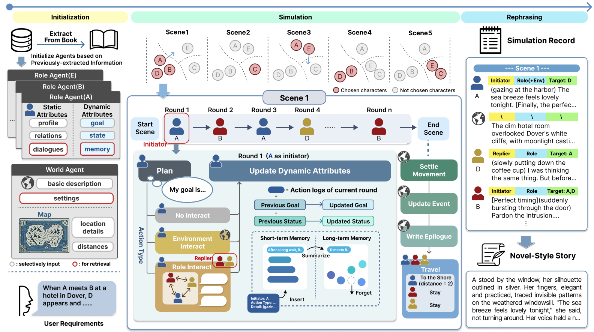| <div style="line-height: 1.05;font-size: 0.8em"> <details><summary>**[analogy]**</summary><div style="margin-top:6px">\[AI generated\] BookWorld is a closed simulation system that transforms novels into interactive agent societies, where characters autonomously live out stories beyond the original plot.</div></details></div>|
|<a id="paper-entry-8afb06c530de"></a>[](https://github.com/zjunlp/MachineSoM) []()<br>[Exploring Collaboration Mechanisms for LLM Agents: A Social Psychology View](https://aclanthology.org/2024.acl-long.782) <br> Jintian Zhang, Xin Xu, Ningyu Zhang, Ruibo Liu, Bryan Hooi, Shumin Deng <br> 2024|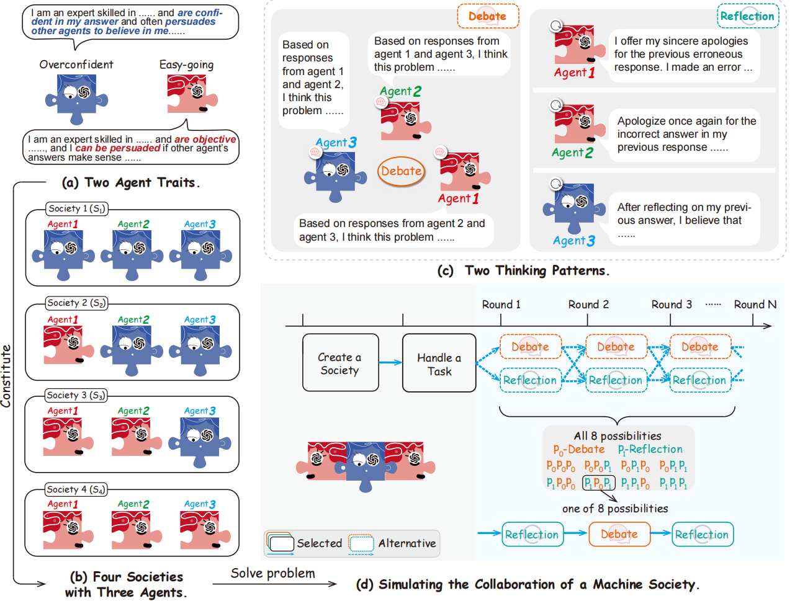| <div style="line-height: 1.05;font-size: 0.8em"> <details><summary>**[analogy]**</summary><div style="margin-top:6px">\[AI generated\] Just as human groups exhibit conformity and consensus, LLM agents in multi-agent societies display analogous social behaviors through debate and reflection</div></details></div>|
|<a id="paper-entry-50337daadca4"></a> []()<br>[Memory-Augmented Theory of Mind Network](https://ojs.aaai.org/index.php/AAAI/article/view/26374) <br> Dung Nguyen, Phuoc Nguyen, Hung Le, Kien Do, Svetha Venkatesh, Truyen Tran <br> 2023-06-26|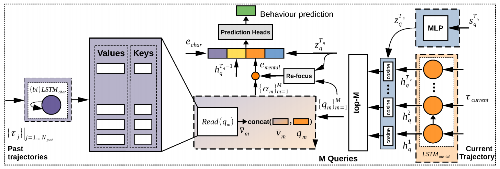| <div style="line-height: 1.05;font-size: 0.8em"> <details><summary>**[analogy]**</summary><div style="margin-top:6px">\[AI generated\] Memory as mental time travel: Storing past behaviors to infer current beliefs and predict future actions in complex social reasoning</div></details></div>|
|[↪ When agents “misremember” collectively: Exploring the mandela effect in LLM-based multi-agent sys...](#paper-entry-a9caf31aab25) <sub>Full entry</sub>|||
|[↪ Incorporating Rich Social Interactions Into MDPs](#paper-entry-5f9db01e7428) <sub>Full entry</sub>|||
|[↪ Zero-Shot Linear Combinations of Grounded Social Interactions with Linear Social MDPs](#paper-entry-47771c8e4f7b) <sub>Full entry</sub>|||

##### Embodied Intelligence (4 papers)

| Title & Info | Pipeline | Summary |
|:--| :----: | :---: |
|<a id="paper-entry-330fe34085c2"></a>[](https://virtual-community-ai.github.io/) []()<br>[Virtual community: An open world for humans, robots, and society](https://openreview.net/forum?id=Qo0OZZoTLh) <br> Qinhong Zhou, Hongxin Zhang, Xiangye Lin, Zheyuan Zhang, Yutian Chen, Wenjun Liu, Zunzhe Zhang, Sunli Chen, Lixing Fang, Qiushi Lyu, ... <br> 2025-10-08|<div style="display:flex;flex-direction:column;gap:6px;align-items:center">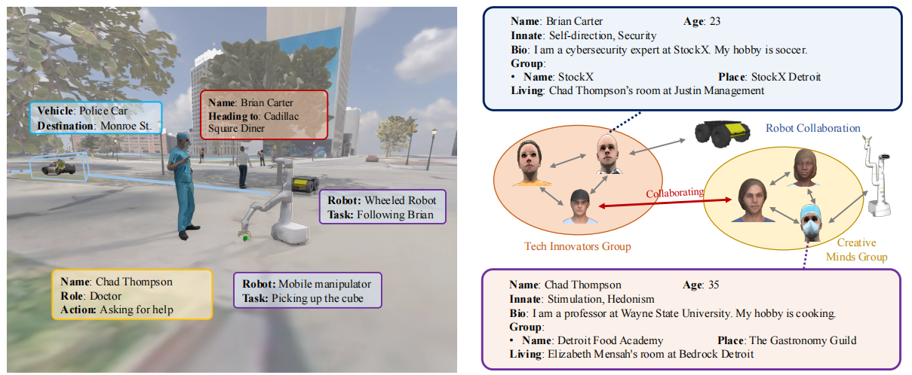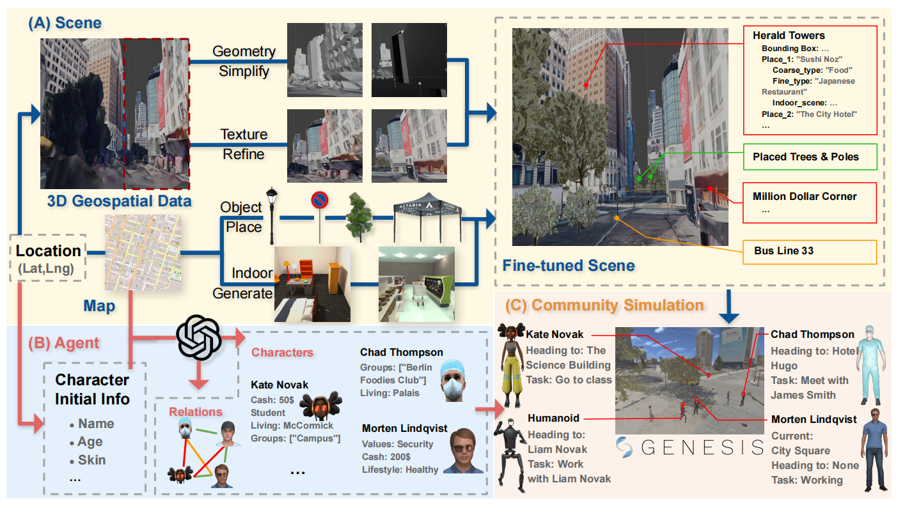</div>| <div style="line-height: 1.05;font-size: 0.8em"> <details><summary>**[analogy]**</summary><div style="margin-top:6px">\[AI generated\] Virtual Community: An open-world sandbox for simulating human-robot coexistence at scale</div></details></div>|
|<a id="paper-entry-33b7450875d9"></a>[](https://metadriverse.github.io/metaurban) []()<br>[MetaUrban: An Embodied AI Simulation Platform for Urban Micromobility](https://openreview.net/forum?id=kFsWpSxkFz) <br> Wayne Wu, Honglin He, Jack He, Yiran Wang, Chenda Duan, Zhizheng Liu, Quanyi Li, Bolei Zhou <br> 2024-10-04|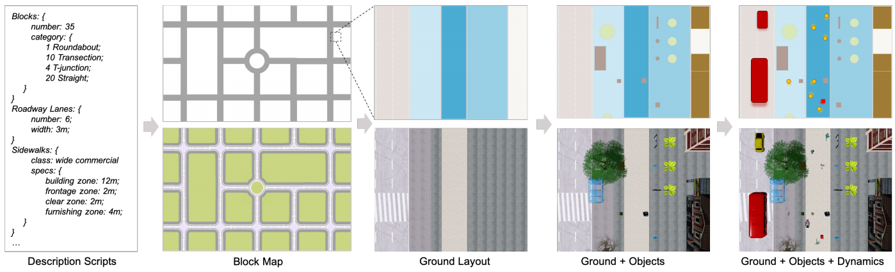| <div style="line-height: 1.05;font-size: 0.8em"> <details><summary>**[analogy]**</summary><div style="margin-top:6px">\[AI generated\] MetaUrban: A compositional simulator that procedurally generates infinite urban micromobility scenes to train and evaluate embodied AI agents</div></details></div>|
|<a id="paper-entry-7b021ec6f7fa"></a>[](https://digital-life-project.com) []()<br>[Digital life project: Autonomous 3D characters with social intelligence](https://openaccess.thecvf.com/content/CVPR2024/html/Cai_Digital_Life_Project_Autonomous_3D_Characters_with_Social_Intelligence_CVPR_2024_paper.html) <br> Zhongang Cai, Jianping Jiang, Zhongfei Qing, Xinying Guo, Mingyuan Zhang, Zhengyu Lin, Haiyi Mei, Chen Wei, Ruisi Wang, Wanqi Yin, ... <br> 2024-06|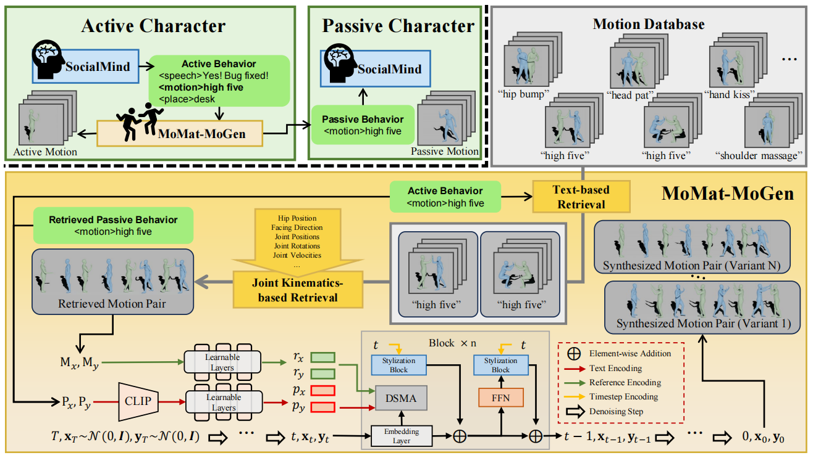| <div style="line-height: 1.05;font-size: 0.8em"> <details><summary>**[analogy]**</summary><div style="margin-top:6px">\[AI generated\] Just as a brain and body empower a person, DLP’s SocioMind and MoMat-MoGen jointly enable autonomous 3D characters to think, socialize, and move naturally in a digital world.</div></details></div>|
|<a id="paper-entry-0a45acc1361b"></a>[](https://github.com/William-island/SocialGAIL) []()<br>[SocialGAIL: Faithful Crowd Simulation for Social Robot Navigation](https://ieeexplore.ieee.org/document/10610371/) <br> Bo Ling, Yan Lyu, Dongxiao Li, Guanyu Gao, Yi Shi, Xueyong Xu, Weiwei Wu <br> 2024-05-13|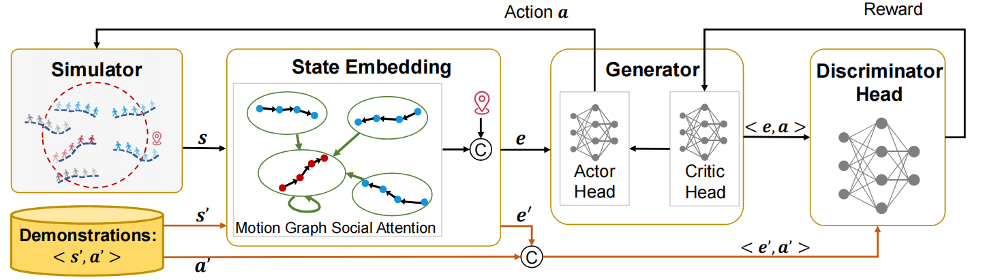| <div style="line-height: 1.05;font-size: 0.8em"> <details><summary>**[analogy]**</summary><div style="margin-top:6px">\[AI generated\] SocialGAIL: Imitating real pedestrian navigation via adversarial learning for faithful crowd simulation.</div></details></div>|

### | Other (15 papers)

| Title & Info | Pipeline | Summary |
|:--| :----: | :---: |
|<a id="paper-entry-106c3abafd43"></a> []()<br>[A<sup>2</sup> S<sup>2</sup> -GNN: Rigging GNN-based social status by adversarial attacks in signe...](https://ieeexplore.ieee.org/document/9936655/) <br> Xiaoyan Yin, Wanyu Lin, Kexin Sun, Chun Wei, Yanjiao Chen <br> 2023|<div style="display:flex;flex-direction:column;gap:6px;align-items:center">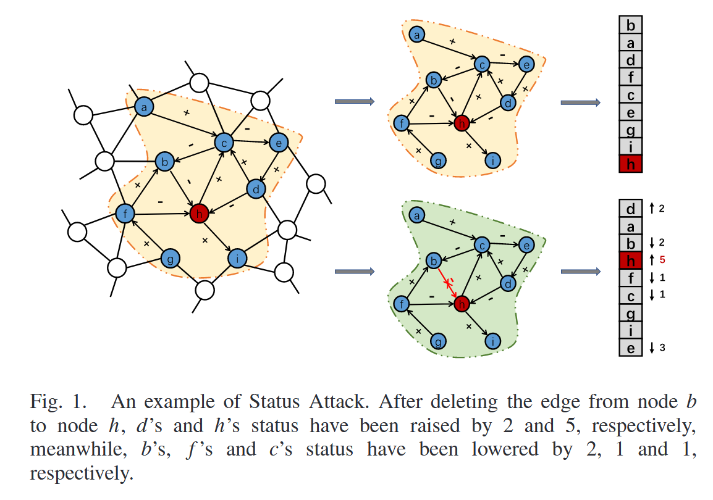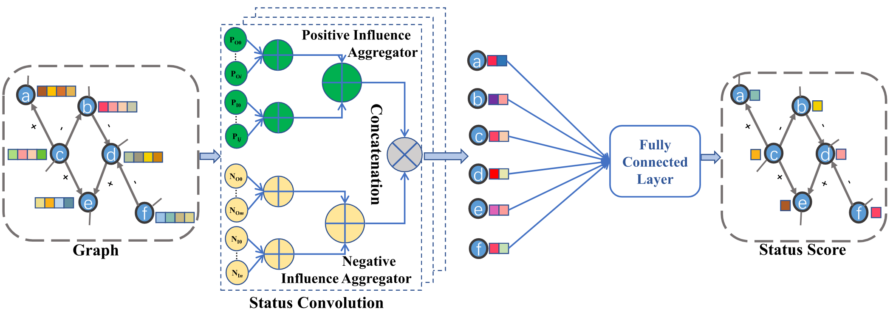</div>| <div style="line-height: 1.05;font-size: 0.8em"> <details><summary>**[analogy]**</summary><div style="margin-top:6px">The method studies status relationships in social network graphs \(direction determined by directed edges\), attempting to find edge addition/deletion strategies that maximize the increase or decrease in the status of a target user node. It…</div></details><div style="margin-top:6px"><details><summary>**[summary]**</summary><div style="margin-top:6px">**[motivation]** While adversarial attacks on Graph Neural Networks \(GNNs\) have been extensively studied for classification in unsigned graphs, the manipulation of social status ranking in signed directed networks remains underexplored.<br>**[innovation]** This study presents the first white-box adversarial framework for social status, integrating Status Theory into GNNs to differentiate four types of neighbor influences \(positive/negative\) and extending the attack scope to 2-hop neighbors.<br>**[method]** The framework, <br>$A^2S^2-GNN$, aggregates features from four neighbor categories \(in/out-degree friends/foes\) via mean-pooling. The attack employs a static greedy strategy: it globally calculates and ranks the influence of operable nodes \(1…<br>**[conclusion/contribution]** Experimental results on seven datasets indicate that the method outperforms baselines like RTA and DICE, achieving up to 89.36% status promotion and 192.38% demotion, while exhibiting strong transferability to classical ranking algorithms…<br>**[limitation/future]** The reliance on a static greedy algorithm \(ranking nodes only once prior to execution\) sacrifices dynamic optimality for computational efficiency, as it ignores topological shifts and feature updates during the sequential edge modification…</div></details></div></div>|
|<a id="paper-entry-e0837584588b"></a>[](https://github.com/OpenBMB/IoA) []()<br>[Internet of agents: Weaving a web of heterogeneous agents for collaborative intelligence](https://openreview.net/forum?id=o1Et3MogPw) <br> Weize Chen\*, Ziming You\*, Ran Li\*, Yitong Guan\*, Chen Qian, Chenyang Zhao Cheng Yang, Ruobing Xie, Zhiyuan Liu, Maosong Sun <br> 2024-10-04|<div style="display:flex;flex-direction:column;gap:6px;align-items:center">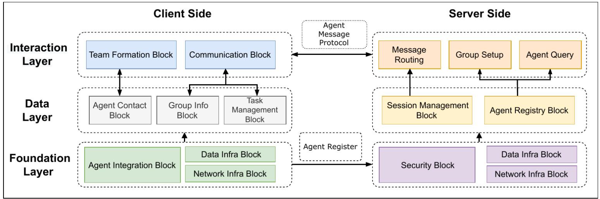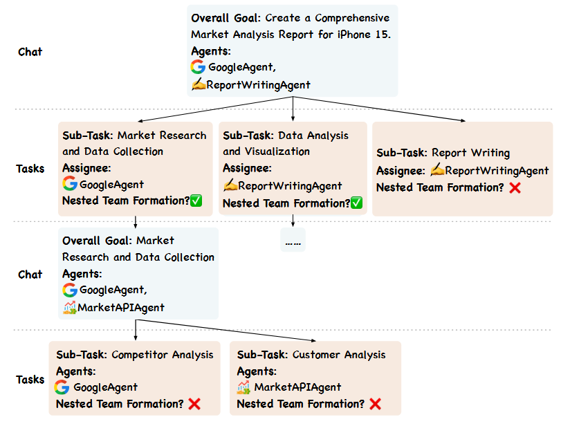</div>| <div style="line-height: 1.05;font-size: 0.8em"> <details><summary>**[analogy]**</summary><div style="margin-top:6px">An agent Internet, an upgraded ABM system, adopting Internet-like ideas, C/S architecture, distributed, service-oriented, and platform-based</div></details><div style="margin-top:6px"><details><summary>**[summary]**</summary><div style="margin-top:6px">**[motivation]** Limitations of previous multi-agent systems: insufficient systematization and platformization \(lack of third-party integration support, inability to be distributed, communication protocols and state transitions dependent on hard coding\).<br>**[innovation]** Introduces the open, distributed, and service-oriented ideas of the Internet to construct a standardized, extensible protocol that supports the integration and communication of distributed, heterogeneous agents.<br>**[method]** Server: agent registration \(distributing system prompts\), management of registered agents \(experts\), expert discovery service, group chat management, and message passing; Client: wraps specific agents and provides communication interfaces;…<br>**[conclusion/contribution]** On the GAIA benchmark, using only four basic ReAct agents achieves the best performance; on RAG tasks, IoA based on GPT-3.5 reaches or exceeds GPT-4 performance<br>**[limitation/future]** Redundant messages exist in the experiments, and communication token consumption increases by nearly twofold, which demonstrates the essential capability difference of agents as interlocutors rather than executors; a single-point server ma…</div></details><div style="margin-top:6px"><details><summary>**[notes]**</summary><div style="margin-top:6px">每个agent被一个客户端包装；服务器不是agent，它只做四件事：注册、发现、建群、路由；相对于传统ABM，这是一个更大型的服务系统，该方法通过基于任务的“群聊”方式组织问题解决，相对传统回合制方式更加自由。本身也是一个高度可扩展系统。问题在于智能体通过注册获取提示词成为不同专家，仍依赖手工设计，且这种专家的能力是否可靠。对于社会模拟任务相对于传统方法有何决定性优势仍未可知</div></details></div></div></div>|
|<a id="paper-entry-2c1c9b54a39c"></a> []()<br>[Large language model as token compressor and decompressor](http://arxiv.org/abs/2603.25340) <br> Wenbing Li, Yiran Wang, Zikai Song, Jielei Zhang, Tianhao Zhao, Junkai Lin, Wei Yang <br> 2026-05-13|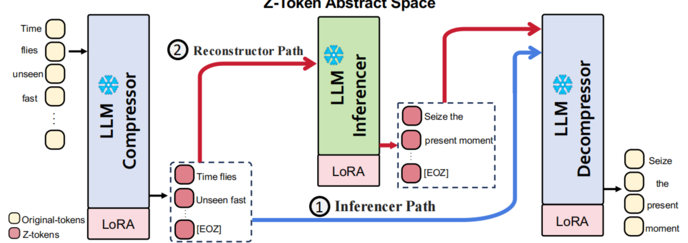| <div style="line-height: 1.05;font-size: 0.8em"> <details><summary>**[analogy]**</summary><div style="margin-top:6px">\[AI generated\] Compressing long texts into learned discrete tokens for efficient LLM inference</div></details></div>|
|<a id="paper-entry-0f3b5acd59e6"></a>[](https://github.com/HUSTDML/CTTrack) []()<br>[Compact transformer tracker with correlative masked modeling](https://ojs.aaai.org/index.php/AAAI/article/view/25327) <br> Zikai Song, Run Luo, Junqing Yu, Yi-Ping Phoebe Chen, Wei Yang <br> 2023-06-27|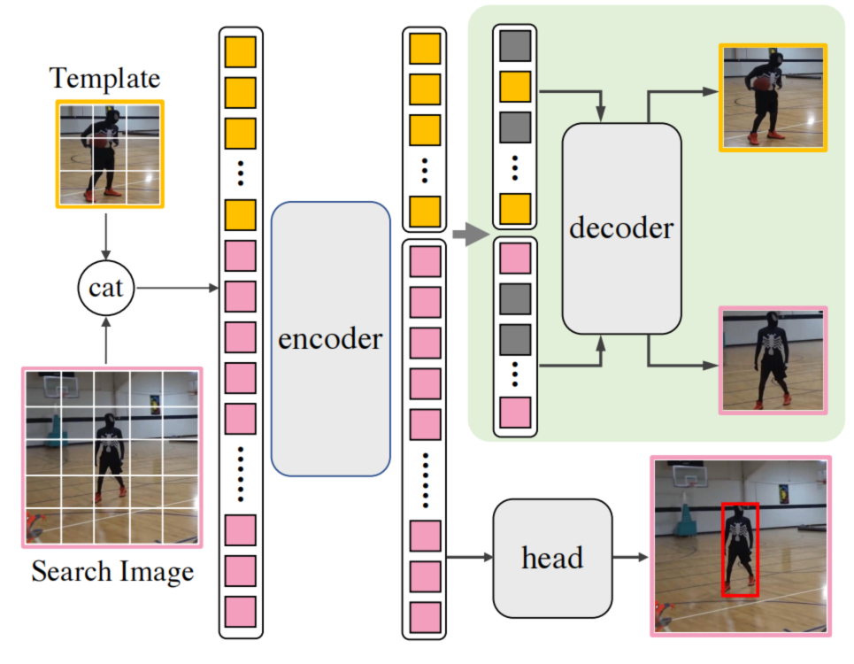| <div style="line-height: 1.05;font-size: 0.8em"> <details><summary>**[analogy]**</summary><div style="margin-top:6px">\[AI generated\] Self-attention sufficiency: Vanilla self-attention is enough for tracking, no need for complex variants</div></details></div>|
|<a id="paper-entry-5de334d86c2f"></a> []()<br>[Temporal coherent object flow for multi-object tracking](https://ojs.aaai.org/index.php/AAAI/article/view/32749) <br> Zikai Song, Run Luo, Lintao Ma, Ying Tang, Yi-Ping Phoebe Chen, Junqing Yu, Wei Yang <br> 2025-04-11|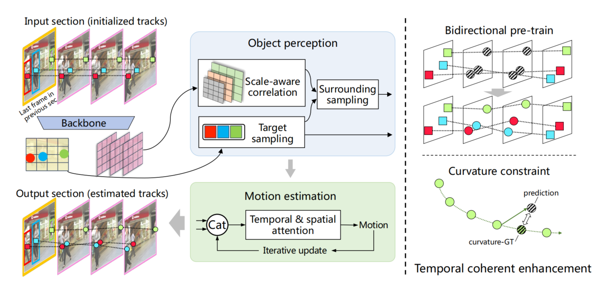| <div style="line-height: 1.05;font-size: 0.8em"> <details><summary>**[analogy]**</summary><div style="margin-top:6px">\[AI generated\] Object flow as a multi-frame motion unit: Tracking objects across a section by jointly estimating their coherent trajectories, like predicting a flock’s path rather than individual wingbeats.</div></details></div>|
|<a id="paper-entry-ed1a211eee90"></a> []()<br>[GateMOT: Q-gated attention for dense object tracking](http://arxiv.org/abs/2604.26353) <br> Mingjin Lv, Zelin Liu, Feifei Shao, Yi-Ping Phoebe Chen, Junqing Yu, Wei Yang, Zikai Song <br> 2026-04-29|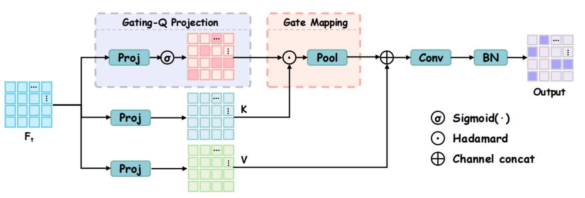| <div style="line-height: 1.05;font-size: 0.8em"> <details><summary>**[analogy]**</summary><div style="margin-top:6px">\[AI generated\] Gated attention for tracking: Query acts as a learnable filter to select relevant features, avoiding costly global aggregation</div></details></div>|
|<a id="paper-entry-d34d90d37afe"></a>[](https://github.com/SkyeSong38/ALTrack) []()<br>[Autogenic language embedding for coherent point tracking](https://dl.acm.org/doi/10.1145/3664647.3681104) <br> Zikai Song, Ying Tang, Run Luo, Lintao Ma, Junqing Yu, Yi-Ping Phoebe Chen, Wei Yang <br> 2024-10-28|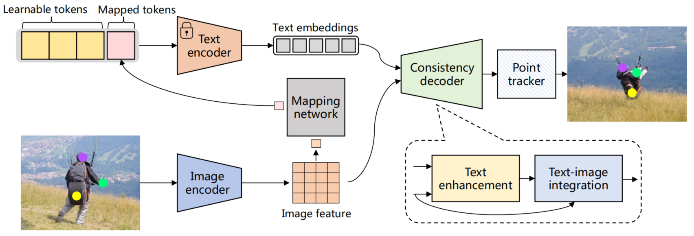| <div style="line-height: 1.05;font-size: 0.8em"> <details><summary>**[analogy]**</summary><div style="margin-top:6px">\[AI generated\] Autogenic language embedding: Visual features self-generate text tokens to enhance semantic consistency, like a tracker inventing its own language cues to stay coherent.</div></details></div>|
|<a id="paper-entry-c400fc349b62"></a>[](https://github.com/SkyeSong38/CSWinTT) []()<br>[Transformer Tracking With Cyclic Shifting Window Attention](https://openaccess.thecvf.com/content/CVPR2022/html/Song_Transformer_Tracking_With_Cyclic_Shifting_Window_Attention_CVPR_2022_paper.html) <br> Zikai Song, Junqing Yu, Yi-Ping Phoebe Chen, Wei Yang <br> 2022|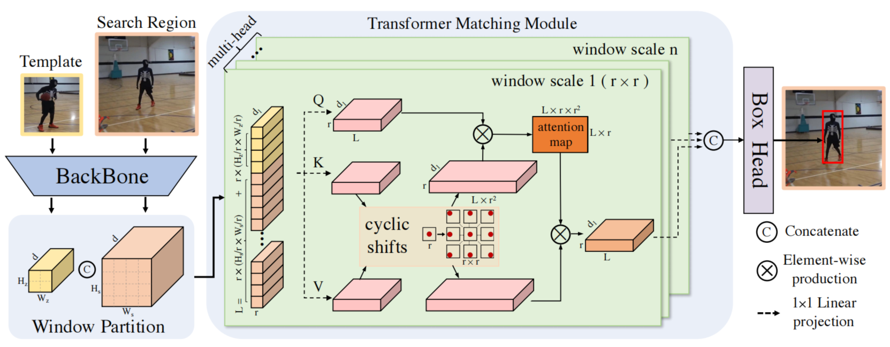| <div style="line-height: 1.05;font-size: 0.8em"> <details><summary>**[analogy]**</summary><div style="margin-top:6px">\[AI generated\] Window-level attention with cyclic shifts: Matching whole object windows instead of pixels, expanded via shifts for accuracy</div></details></div>|
|<a id="paper-entry-44b2838acb0e"></a>[](https://github.com/SkyeSong38/HyperMOT) []()<br>[Hypergraph-state collaborative reasoning for multi-object tracking](http://arxiv.org/abs/2604.12665) <br> Zikai Song, Junqing Yu, Yi-Ping Phoebe Chen, Wei Yang, Xinchao Wang <br> 2026-04-14|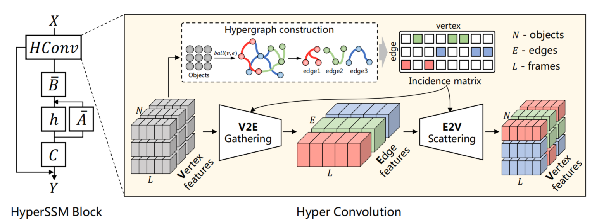| <div style="line-height: 1.05;font-size: 0.8em"> <details><summary>**[analogy]**</summary><div style="margin-top:6px">\[AI generated\] Collaborative motion estimation: Objects with similar motion mutually constrain and refine each other, stabilizing trajectories and inferring occluded motion</div></details></div>|
|<a id="paper-entry-c3e26c41408c"></a>[](https://github.com/AI4SS/Logical-Phase-Transitions) []()<br>[Logical phase transitions: Understanding collapse in LLM logical reasoning](https://aclanthology.org/2026.acl-long.858/) <br> Xinglang Zhang, Yunyao Zhang, ZeLiang Chen, Junqing Yu, Wei Yang, Zikai Song <br> 2026-07|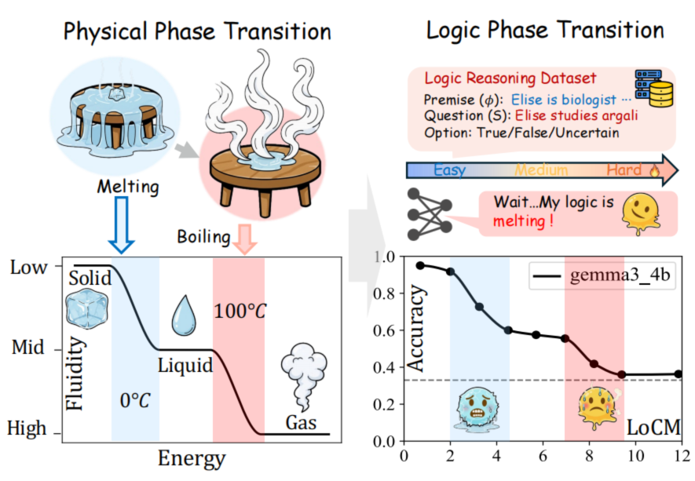| <div style="line-height: 1.05;font-size: 0.8em"> <details><summary>**[analogy]**</summary><div style="margin-top:6px">\[AI generated\] Logical phase transitions: LLM reasoning collapses abruptly at critical complexity, like water freezing at 0°C</div></details></div>|
|<a id="paper-entry-51cb50aea646"></a>[](https://github.com/AI4SS/Logic-Agent) []()<br>[Semantic-aware logical reasoning via a semiotic framework](https://aclanthology.org/2026.acl-long.835/) <br> Yunyao Zhang, Xinglang Zhang, Junxi Sheng, Wenbing Li, Junqing Yu, Yi-Ping Phoebe Chen, Wei Yang, Zikai Song <br> 2026-07|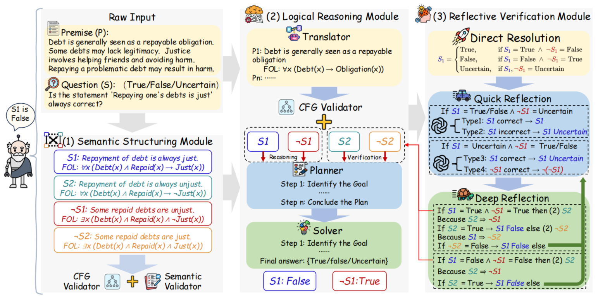| <div style="line-height: 1.05;font-size: 0.8em"> <details><summary>**[analogy]**</summary><div style="margin-top:6px">\[AI generated\] LogicAgent: A semiotic-square–guided framework that jointly addresses semantic and logical complexity in LLM reasoning</div></details></div>|
|<a id="paper-entry-542e6e7eb960"></a>[](https://github.com/hustcselwb/LoRA-Mixer)<br>[LoRA-mixer: Coordinate modular LoRA experts through serial attention routing](https://proceedings.iclr.cc/paper_files/paper/2026/hash/18610cbcd1da57854aa05ebdc5cd3168-Abstract-Conference.html) <br> Wenbing Li, Zikai Song, Hang Zhou, Junqing Yu, Yunyao Zhang, Wei Yang <br> 2026-04-20|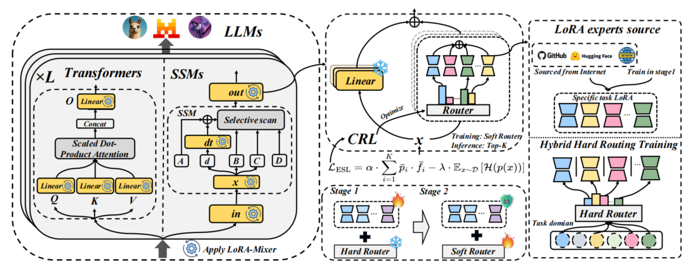| <div style="line-height: 1.05;font-size: 0.8em"> <details><summary>**[analogy]**</summary><div style="margin-top:6px">\[AI generated\] LoRA-Mixer: A plug-and-play router that dynamically fuses task-specific LoRA experts into attention projections, like a smart switchboard directing specialized adapters to the right queries.</div></details></div>|
|<a id="paper-entry-598a8cae3e23"></a> []()<br>[Value Kaleidoscope: Engaging AI with Pluralistic Human Values, Rights, and Duties](https://ojs.aaai.org/index.php/AAAI/article/view/29970) <br> Taylor Sorensen, Liwei Jiang, Jena D. Hwang, Sydney Levine, Valentina Pyatkin, Peter West, Nouha Dziri, Ximing Lu, Kavel Rao, ... <br> 2024-03-24|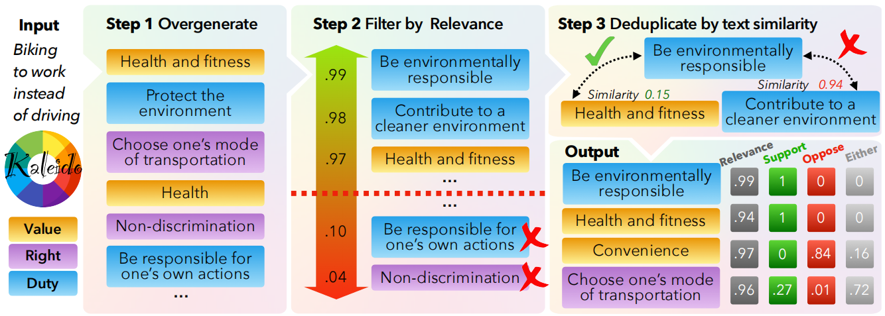| <div style="line-height: 1.05;font-size: 0.8em"> <details><summary>**[analogy]**</summary><div style="margin-top:6px">TLDR: Value Kaleidoscope, an open, light-weight, and structured language-based multi-task model that generates, explains, and assesses the relevance and valence of human values, rights, and duties within a specific context, and shows that…</div></details></div>|
|<a id="paper-entry-316b1ae1d4c3"></a>[](https://github.com/myracheng/elephant) []()<br>[ELEPHANT: Measuring and understanding social sycophancy in LLMs](https://openreview.net/forum?id=igbRHKEiAs) <br> Myra Cheng, Sunny Yu, Cinoo Lee, Pranav Khadpe, Lujain Ibrahim, Dan Jurafsky <br> 2025-10-08|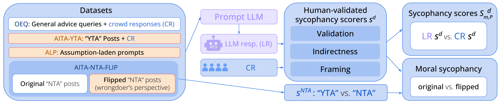| <div style="line-height: 1.05;font-size: 0.8em"> <details><summary>**[analogy]**</summary><div style="margin-top:6px">\[AI generated\] Speculative sycophancy: LLMs preserve user face excessively, affirming both sides of a moral conflict</div></details></div>|
|<a id="paper-entry-e3452f2ed511"></a>[](https://github.com/HLTCHKUST/llm-political-bias) []()<br>[Measuring Political Bias in Large Language Models: What Is Said and How It Is Said](https://aclanthology.org/2024.acl-long.600) <br> Yejin Bang, Delong Chen, Nayeon Lee, Pascale Fung <br> 2024|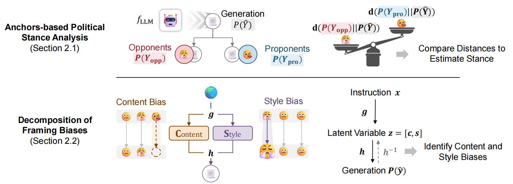| <div style="line-height: 1.05;font-size: 0.8em"> <details><summary>**[analogy]**</summary><div style="margin-top:6px">\[AI generated\] Political bias measurement: analyzing both what LLMs say and how they say it across topics</div></details></div>|

=====List End=====
## Acknowledgement

We thank all contributors who help maintain the paper databases, taxonomy, summaries, and project resources.

This repository is inspired by [Awesome-Efficient-Reasoning-Models](https://github.com/fscdc/Awesome-Efficient-Reasoning-Models).

<!-- PAPER_CITATION_BOTTOM_START -->
## Citation

```bibtex
@misc{song2026socialintelligence,
  title        = {Social Intelligence Modeling: A Comprehensive Survey from Social Perception to Social Simulation},
  author       = {Song, Zikai and Li, Xiajie and Zhang, Yunyao and Zhang, Xinglang and Yang, Wei and Yu, Junqing},
  howpublished = {ResearchGate preprint},
  year         = {2026},
  note         = {Preprint available on ResearchGate},
  doi          = {10.13140/RG.2.2.21157.87528},
  url          = {https://doi.org/10.13140/RG.2.2.21157.87528}
}
```
<!-- PAPER_CITATION_BOTTOM_END -->
